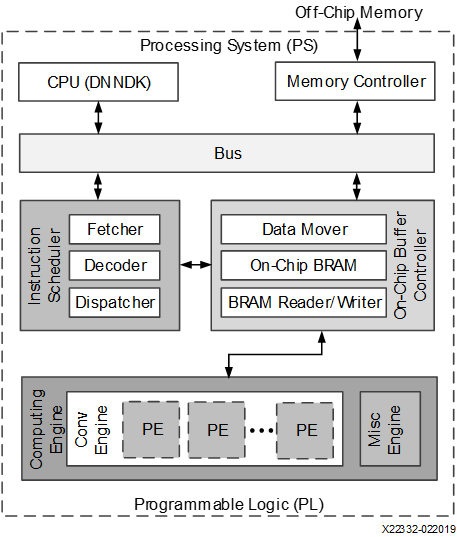

# Zynq UltraScale＋ MPSoC DPU TRD

The Xilinx Deep Learning Processor Unit(DPU) is a configurable computation engine dedicated for convolutional neural networks. The degree of parallelism utilized in the engine is a design parameter and application. It includes a set of highly optimized instructions, and supports most convolutional neural networks, such as VGG, ResNet, GoogleNet, YOLO, SSD, MobileNet, FPN, and others.

### Features

- One AXI salve interface for accessing configuration and status registers.

- One AXI master interface for accessing instructions.

- Supports configurable AXI master interface with 64 or 128 bits for accessing data depending on the target device.

- Supports individual configuration of each channel.

- Supports optional interrupt requeset generation.

- Some highlights of DPU functionality include:
	- Configurable hardware architecture includes: B512, B800, B1024, B1152, B1600, B2304, B3136, and B4096
	- Maximum of three cores
	- Convolution and deconvolution
	- Depthwise convolution
	- Max poolling
	- Average poolling
	- ReLU, RELU6, and Leaky ReLU
	- Concat
	- Elementwise-sum
	- Dilation
	- Reorg
	- Fully connected layer
	- Softmax
	- Bach Normalization
	- Split

### Hardware Architecture

The detailed hardware architecture of the DPU is shown in the following figure. After start-up, the DPU fetches instructions from off-chip memory to control the operation of the computing engine. The instructions are generated by the DNNC where substantial optimizations have been performed. On-chip memory is used to buffer input, intermediate, and output data to achieve high throughput and efficiency. The data is reused as much as possible to reduce the memory bandwidth. A deep pipelined design is used for the computing engine. The processing elements (PE) take full advantage of the finegrained building blocks such as multipliers, adders and accumulators in Xilinx devices.

There are three dimensions of parallelism in the DPU convolution architecture - pixel parallelism, input channel parallelism, and output channel parallelism. The input channel parallelism is always equal to the output channel parallelism. The different architectures require different programmable logic resources. The larger architectures can achieve higher performance with more resources. The parallelism for the different architectures is listed in the table.

|Connolution Architecture|Pixel Parallelism(PP)|Input Channel Parallelism(ICP)|Output Channel Parallelism(OCP)|Peak(operations/per clock)|
|:---|:---|:---|:---|:---|
|B512|4|8|8|512|
|B800|4|10|10|800|
|B1024|8|8|8|1024|
|B1152|4|12|12|1152|
|B1600|8|10|10|1600|
|B2304|8|12|12|2304|
|B3136|8|14|14|3136|
|B4096|8|16|16|4096|

****

[DPU TRD Vitis Flow](./prj/Vitis/README.md)

[DPU TRD Vivado Flow](./prj/Vivado/README.md)

****

