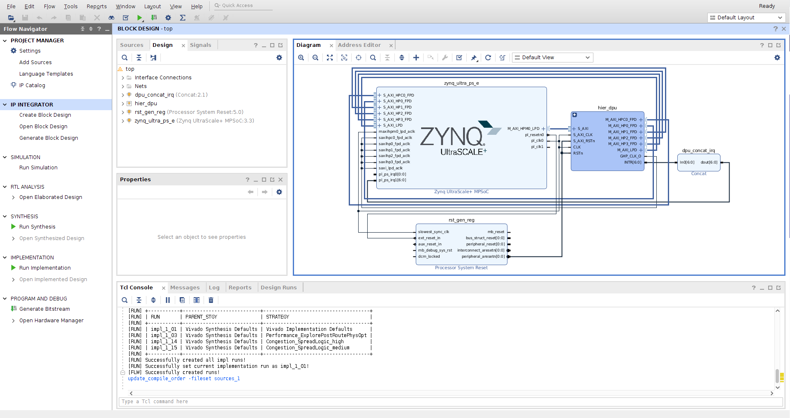
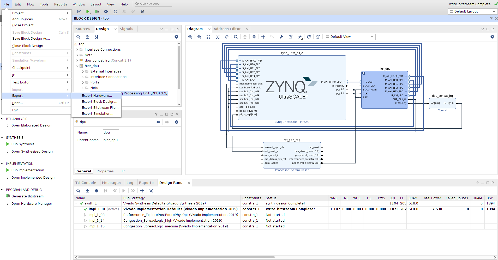

# Zynq UltraScale＋ MPSoC DPU TRD Vivado 2019.2

## Table of Contents

- [1 Revision History](#1-revision-history)
- [2 Overview](#2-overview)
- [3 Software Tools and System Requirements](#3-software-tools-and-system-requirements)
    - [3.1 Hardware](#31-hardware)
    - [3.2 Software](#32-software)
- [4 Design Files](#4-design-files)
    - [Design Components](#design-components)
- [5 Tutorials](#5-tutorials)
	- [5.1 Board Setup](#51-board-setup)
	- [5.2 Build and Run TRD Flow](#52-build-and-run-trd-flow)
		- [5.2.1 Build the Hardware Design](#521-build-the-hardware-design)
   		- [5.2.2 Get HWH File](#522-get-hwh-file)
   		- [5.2.3 DPU PetaLinux BSP](#523-dpu-petalinux-bsp)
   		- [5.2.4 Run Resnet50 Example](#524-run-resnet50-example)
	- [5.3 Configurate the DPU](#53-configurate-the-dpu)
		- [5.3.1 Modify the Frequency](#531-modify-the-frequency)
		- [5.3.2 Modify the Parameters](#532-modify-the-parameters)
- [6 Run with Vitis AI Library](#6-run-with-vitis-ai-library)
	- [6.1 Host Setup](#61-host-setup)
	- [6.2 Board Setup](#62-board-setup)
	- [6.3 Run Vitis AI Library Examples](#63-run-vitis-ai-library-examples)
  
## 1 Revision History

This wiki page complements the Vivado 2019.2 version of the DPU TRD.

Change Log:

-  The first version of Vivado DPU TRD

------

## 2 Overview

This tutorial contains information about:

- How to set up the ZCU102 evaluation board and run the TRD.
- How to change the Configuration of DPU.

------

## 3 Software Tools and System Requirements

### 3.1 Hardware

Required:

- ZCU102 evaluation board

- Micro-USB cable, connected to laptop or desktop for the terminal emulator

- SD card

### 3.2 Software

  Required:
  - Vivado 2019.2 [Vivado Design Tools](https://www.xilinx.com/support/download/index.html/content/xilinx/en/downloadNav/vivado-design-tools.html) 
  - Serial terminal emulator e.g. [teraterm](http://logmett.com/tera-term-the-latest-version)
  - [Vitis AI 1.1](https://github.com/Xilinx/Vitis-AI) to run models other than Resnet50, Optional 
  - [Vitis AI Library 1.1](https://github.com/Xilinx/Vitis-AI/tree/master/Vitis-AI-Library) to configure DPU in Vitis AI Library
  
------

## 4 Design Files

### Design Components

The top-level directory structure shows the the major design components. The TRD directory is provided with a basic README and legal notice file.

```
DPU_TRD       
├── dpu_ip                              # rtl kernel
│   ├── dpu_eu_v3_2_0
│   │   ├── bd
│   │   ├── component.xml
│   │   ├── doc
│   │   ├── gui
│   │   ├── hdl
│   │   ├── inc
│   │   ├── ttcl
│   │   ├── xci
│   │   └── xgui
│   └── Vitis
│       ├── dpu
│       └── sfm
├── app
│   ├── models
│   ├── sample
│   └── resnet50.tar.gz                  # resnet50 application
└── prj 
    └── Vivado       
        ├── constrs
        ├── doc
        ├── dpu_petalinux_bsp                  
        ├── pre-built                  
        ├── scripts
        └── README.md

```

## 5 Tutorials

### 5.1 Board Setup

###### Required:

- Connect power supply to 12V power connector.

- Connect micro-USB cable to the USB-UART connector, use the following settings for your terminal emulator:

  - Baud Rate: 115200
  - Data: 8 bit
  - Parity: None
  - Stop: 1 bit
  - Flow Control: None

- Insert SD card (FAT formatted).

###### Jumpers & Switches:

  - Set boot mode to SD card:
    - Rev 1.0: SW6[4:1] - **off,off,off, on**
    - Rev D2: SW6[4:1] - **on, off on, off**

### 5.2 Build and Run TRD Flow

The following tutorials assume that the $TRD_HOME environment variable is set as given below.

```
%export TRD_HOME =<Vitis AI path>/DPU_TRD
```

###### **Note:** It is recommended to follow the build steps in sequence.

#### 5.2.1 Build the Hardware Design

We need install the Vivado Development Environment.

The following tutorials assume that the Vivado environment variable is set as given below.

Open a linux terminal. Set the linux as Bash mode.

```
% source <Vivado install path>/Vivado/2019.2/settings64.sh

```

The default settings of DPU is **B4096** with RAM_USAGE_LOW, CHANNEL_AUGMENTATION_ENABLE, DWCV_ENABLE, POOL_AVG_ENABLE, RELU_LEAKYRELU_RELU6, Softmax. 

Modify the $TRD_HOME/prj/Vivado/scripts/trd_prj.tcl file can change the default settings.

Build the hardware design.

```
% cd $TRD_HOME/prj/Vivado

% vivado -source scripts/trd_prj.tcl
```

After executing the script, the Vivado IPI block design comes up as shown in the below figure.



- Click on “**Generate Bitstream**”.

###### **Note:** If the user gets any pop-up with “**No implementation Results available**”. Click “**Yes**”. Then, if any pop-up comes up with “**Launch runs**”, Click "**OK**”.

After the generation of bitstream completed.

- Go to **File > Export > Export Hardware**

  
  
- In the Export Hardware window select "**Include bitstream**" and click "**OK**".

  

The XSA file is created at $TRD_HOME/prj/Vivado/prj/top_wrapper.xsa

###### **Note:** The actual results might graphically look different than the image shown

#### 5.2.2 Get HWH File 

HWH file is an important file that needed by the VAI_C tool. The file has been created when compile by the Vivado tool. It works together with VAI_C to support model compilation under various DPU configurations.

The user can get the HWH file in the following path.

$TRD_HOME/prj/Vivado/srcs/top/hw_handoff/top.hwh


#### 5.2.3  DPU PetaLinux BSP

This tutorial shows how to build the Linux image and boot image using the PetaLinux build tool.

**PetaLinux Installation**: Refer to the [PetaLinux Tools Documentation ](https://www.xilinx.com/support/documentation/sw_manuals/xilinx2019_2/ug1144-petalinux-tools-reference-guide.pdf)(UG1144) for installation.

```
% source <path/to/petalinux-installer>/settings.sh
% echo $PETALINUX
```

Post PetaLinux installation $PETALINUX environment variable should be set.


##### Configure and build the PetaLinux project

```
% cd $TRD_HOME/prj/Vivado/dpu_petalinux_bsp
% ./download_bsp.sh
% petalinux-create -t project -s xilinx-zcu102-v2019.2-final-4dpu-1.4.1.bsp
% cd xilinx-zcu102-v2019.2-final-4dpu-1.4.1
% petalinux-config --get-hw-description=$TRD_HOME/prj/Vivado/prj/ --silentconfig
% petalinux-build
```

If the prebuilt design is wanted, please use the path for **--get-hw-description** as below.

```
% petalinux-config --get-hw-description=$TRD_HOME/prj/Vivado/pre-built/ --silentconfig
```

##### Create a boot image (BOOT.BIN) including FSBL, ATF, bitstream, and u-boot.

```
% cd images/linux
% petalinux-package --boot --fsbl zynqmp_fsbl.elf --u-boot u-boot.elf --pmufw pmufw.elf --fpga system.bit
```
 
#### 5.2.4 Run Resnet50 Example 

The TRD project has generated the matching model file in $TRD_HOME/app path as the default settings. If the user change the DPU settings. The model need to be created again.

This part is about how to run the Resnet50 example from the source code.

The user must create the SD card. Refer section "Configuring SD Card ext File System Boot" in page 65 of [ug1144](https://www.xilinx.com/support/documentation/sw_manuals/xilinx2019_2/ug1144-petalinux-tools-reference-guide.pdf)for Petalinux 2019.2:

Copy the image.ub and BOOT.BIN files in **$TRD_HOME/prj/Vivado/dpu_petalinux_bsp/xilinx-zcu102-v2019.2-final-4dpu-1.4.1/images/linux** to BOOT partition.

Extract the rootfs.tar.gz files in **TRD_HOME/prj/Vivado/dpu_petalinux_bsp/xilinx-zcu102-v2019.2-final-4dpu-1.4.1/images/linux** to RootFs partition.

Copy the folder **$TRD_HOME/app/** to RootFs partition


Reboot, after the linux boot, run in the RootFs partition:

```
% cd /app

% tar -xvf resnet50.tar.gz

% cd samples/bin

% cp ../../model/resnet50.elf .

% env LD_LIBRARY_PATH=../lib ./resnet50 ../../img/bellpeppe-994958.JPEG
```

###### **Note:** The resenet50 test case can support both Vitis and Vivado flow. If you want to run other network. Please refer to the [Vitis AI Github](https://github.com/Xilinx/Vitis-AI) and [Vitis AI User Guide](http://www.xilinx.com/support/documentation/sw_manuals/Vitis_ai/1_0/ug1414-Vitis-ai.pdf).


### 5.3 Configurate the DPU


The DPU IP provides some user-configurable parameters to optimize resource utilization and customize different features. Different configurations can be selected for DSP slices, LUT, block RAM(BRAM), and UltraRAM utilization based on the amount of available programmable logic resources. There are also options for addition functions, such as channel augmentation, average pooling, depthwise convolution.

The TRD also support the softmax function.
   
For more details about the DPU, please read [DPU IP Product Guide](https://www.xilinx.com/cgi-bin/docs/ipdoc?c=dpu;v=latest;d=pg338-dpu.pdf)

 
#### 5.3.1 Modify the Frequency

Modify the scripts/trd_prj.tcl to modify the frequency of m_axi_dpu_aclk. The frequency of dpu_2x_clk is twice of m_axi_dpu_aclk.

```
dict set dict_prj dict_param  DPU_CLK_MHz {325}
```

#### 5.3.2 Modify the parameters

Modify the scripts/trd_prj.tcl to modify the parameters which can also be modified on the GUI. 

The TRD supports to modify the following parameters.

- DPU_NUM
- DPU_ARCH
- DPU_RAM_USAGE
- DPU_CHN_AUG_ENA 
- DPU_DWCV_ENA
- DPU_AVG_POOL_ENA
- DPU_CONV_RELU_TYPE
- DPU_SFM_NUM
- DPU_DSP48_USAGE 
- DPU_URAM_PER_DPU 

#### DPU_NUM

The DPU core number is set 2 as default setting. 

```
dict set dict_prj dict_param  DPU_NUM {2}
```
A maximum of 4 cores can be selected on DPU IP. 
###### **Note:** The DPU needs lots of LUTs and RAMs. Use 3 or more DPU may cause the resourse and timing issue.

#### DPU_ARCH

Arch of DPU: The DPU IP can be configured with various convolution architectures which are related to the parallelism of the convolution unit. 
The architectures for the DPU IP include B512, B800, B1024, B1152, B1600, B2304, B3136, and B4096.

```
dict set dict_prj dict_param  DPU_ARCH {4096}
```
#### DPU_RAM_USAGE

RAM Usage: The RAM Usage option determines the total amount of on-chip memory used in different DPU architectures, and the setting is for all the DPU cores in the DPU IP. 
High RAM Usage means that the on-chip memory block will be larger, allowing the DPU more flexibility to handle the intermediate data. High RAM Usage implies higher performance in each DPU core.

Low
```
dict set dict_prj dict_param  DPU_RAM_USAGE {low}
```
High
```
dict set dict_prj dict_param  DPU_RAM_USAGE {high}
```

#### DPU_CHN_AUG_ENA

Channel Augmentation: Channel augmentation is an optional feature for improving the efficiency of the DPU when handling input channels much lower than the available channel parallelism.

Enable 
```
dict set dict_prj dict_param  DPU_CHN_AUG_ENA {1}
```
Disable 
```
dict set dict_prj dict_param  DPU_CHN_AUG_ENA {0}
```

#### DPU_DWCV_ENA

Depthwise convolution: The option determines whether the Depthwise convolution operation will be performed on the DPU or not.

Enable
```
dict set dict_prj dict_param  DPU_DWCV_ENA {1}
```
Disable
```
dict set dict_prj dict_param  DPU_DWCV_ENA {0}
```

#### DPU_AVG_POOL_ENA

AveragePool: The option determines whether the average pooling operation will be performed on the DPU or not.

Enable
```
dict set dict_prj dict_param  DPU_AVG_POOL_ENA {1}
```
Disable
```
dict set dict_prj dict_param  DPU_AVG_POOL_ENA {0}
```

#### DPU_CONV_RELU_TYPE

The ReLU Type option determines which kind of ReLU function can be used in the DPU. ReLU and ReLU6 are supported by default.

RELU_RELU6
```
dict set dict_prj dict_param  DPU_CONV_RELU_TYPE {2}
```
RELU_LEAKRELU_RELU6
```
dict set dict_prj dict_param  DPU_CONV_RELU_TYPE {3}
```

#### DPU_SFM_NUM

Softmax: This option allows the softmax function to be implemented in hardware.

Only use the DPU
```
dict set dict_prj dict_param  DPU_SFM_NUM {0}
```
Use the DPU and Softmax
```
dict set dict_prj dict_param  DPU_SFM_NUM {1}
```

#### DPU_DSP48_USAGE

DSP Usage: This allows you to select whether DSP48E slices will be used for accumulation in the DPU convolution module.

High
```
dict set dict_prj dict_param  DPU_DSP48_USAGE {high}
```
Low
```
dict set dict_prj dict_param  DPU_DSP48_USAGE {low}
```

#### DPU_URAM_PER_DPU

The DPU uses block RAM as the memory unit by default. For a target device with both block RAM and UltraRAM, configure the number of UltraRAM to determine how many UltraRAMs are used to replace some block RAMs. 
The number of UltraRAM should be set as a multiple of the number of UltraRAM required for a memory unit in the DPU. 
An example of block RAM and UltraRAM utilization is shown in the Summary tab section.

```
dict set dict_prj dict_param  DPU_URAM_PER_DPU {0}
```

## 6 Run with Vitis AI Library
### 6.1 Host Setup
1. Download the [sdk.sh](https://www.xilinx.com/bin/public/openDownload?filename=sdk.sh)

2. Install the cross-compilation system environment, follow the prompts to install. 
```
$./sdk.sh
```
Note that the `~/petalinux_sdk` path is recommended for the installation. Regardless of the path you choose for the installation, make sure the path has read-write permissions. 
Here we install it under `~/petalinux_sdk`.

3. When the installation is complete, follow the prompts and execute the following command.
```
$. ~/petalinux_sdk/environment-setup-aarch64-xilinx-linux
```
Note that if you close the current terminal, you need to re-execute the above instructions in the new terminal interface.

4. Download the [vitis_ai_2019.2-r1.1.0.tar.gz](https://www.xilinx.com/bin/public/openDownload?filename=vitis_ai_2019.2-r1.1.0.tar.gz) and install it to the petalinux system.
```
$tar -xzvf vitis_ai_2019.2-r1.1.0.tar.gz -C ~/petalinux_sdk/sysroots/aarch64-xilinx-linux
```
5. Update the glog to v0.4.0
	* Download the glog package and untar it.
		```
		$cd ~
		$curl -Lo glog-v0.4.0.tar.gz https://github.com/google/glog/archive/v0.4.0.tar.gz
		$tar -zxvf glog-v0.4.0.tar.gz
		$cd glog-0.4.0
		```
	* Build it and install it to the PetaLinux system.
		```
		$mkdir build_for_petalinux
		$cd build_for_petalinux
		$unset LD_LIBRARY_PATH; source ~/petalinux_sdk/environment-setup-aarch64-xilinx-linux
		$cmake -DCPACK_GENERATOR=TGZ -DBUILD_SHARED_LIBS=on -DCMAKE_INSTALL_PREFIX=$OECORE_TARGET_SYSROOT/usr ..
		$make && make install
		$make package
		```
6. Cross compile the demo in the AI Library, using yolov3 as example.
```
$cd ~/Vitis-AI/Vitis-AI-Library/overview/demo/yolov3
$bash -x build.sh
```	

7. To compile the library sample in the AI Library, take facedetect for example, execute the following command.
```
$cd ~/Vitis-AI/Vitis-AI-Library/overview/samples/facedetect
$bash -x build.sh
```	
### 6.2 Board Setup
1. Install AI Model Package   
	* Download [ZCU102 AI Model](https://www.xilinx.com/bin/public/openDownload?filename=vitis_ai_model_ZCU102_2019.2-r1.1.0.deb).  
	
	* Copy the downloaded file to the board using scp with the following command.
	```
	  $scp vitis_ai_model_ZCU102_2019.2-r1.1.0.deb root@IP_OF_BOARD:~/
	```
	* Log in to the board (usong ssh or serial port) and install the model package.
	* Run the following command.
	```
	  #dpkg -i vitis_ai_model_ZCU102_2019.2-r1.1.0.deb
	```
2. Install AI Library Package
	* Download the [Vitis AI Runtime 1.1](https://www.xilinx.com/bin/public/openDownload?filename=vitis-ai-runtime-1.1.1-vivado.tar.gz).  
	
	* Untar the packet and copy the files to the board using scp.
	```
	$scp <path_to_untar'd_runtime_library>/libunilog-1.1.0-Linux.deb root@IP_OF_BOARD:~/
	$scp <path_to_untar'd_runtime_library>/libxir-1.1.0-Linux.deb root@IP_OF_BOARD:~/
	$scp <path_to_untar'd_runtime_library>/libvart-1.1.0-Linux.deb root@IP_OF_BOARD:~/
	$scp <path_to_untar'd_runtime_library>/aarch64/libvitis_ai_library-1.1.1-Linux.deb root@IP_OF_BOARD:~/
	```	
  * Install the Vitis AI Library on the board.
	```
	#dpkg –i --force-all libunilog-1.1.0-Linux.deb
	#dpkg –i libxir-1.1.0-Linux.deb
	#dpkg –i libvart-1.1.0-Linux.deb
	#dpkg -i libvitis_ai_library-1.1.1-Linux.deb
	```
	* Reduce the DPU frequency to 93%.
	```
	#dpu_clk 93
	```
### 6.3 Run Vitis AI Library Examples

1. Copy the sample and demo from host to the target using scp with the following command.
```
$scp -r ~/Vitis-AI/Vitis-AI-Library/overview root@IP_OF_BOARD:~/
```
2. Download and copy the image and video packages from host to the target using scp with the following command.
	* Download the [demo video files](https://www.xilinx.com/bin/public/openDownload?filename=vitis_ai_library_r1.1_video.tar.gz) 
	
	* Download the [demo image files](https://www.xilinx.com/bin/public/openDownload?filename=vitis_ai_library_r1.1_images.tar.gz) 
```
$scp vitis_ai_library_r1.1_images.tar.gz root@IP_OF_BOARD:~/
$scp vitis_ai_library_r1.1_video.tar.gz root@IP_OF_BOARD:~/
```
3. Untar the image and video packages on the target.
```
#cd ~
#tar -xzvf vitis_ai_library_r1.1_images.tar.gz -C overview
#tar -xzvf vitis_ai_library_r1.1_video.tar.gz -C overview
```
4. Enter the directory of example in target board, take facedetect as an example.
```
#cd ~/overview/samples/facedetect
```

5. Run the image test example.
```
#./test_jpeg_facedetect densebox_640_360 sample_facedetect.jpg
```
Compare the results with the readme file in the current directory.

6. Run the video test example.
```
#./test_video_facedetect densebox_640_360 video_input.mp4 -t 8
Video_input.mp4: The video file's name for input.The user needs to prepare the videofile.
-t: <num_of_threads>
```

7. To test the program with a USB camera as input, run the following command:
```
#./test_video_facedetect densebox_640_360 0 -t 8
0: The first USB camera device node. If you have multiple USB camera, the value might be 1,2,3 etc.
-t: <num_of_threads>
```

8. To test the performance of model, run the following command:
```
#./test_performance_facedetect densebox_640_360 test_performance_facedetect.list -t 8 -s 60
-t: <num_of_threads>
-s: <num_of_seconds>
```
## Reference
For more information, please refer to [vitis-ai-library-user-guide](https://www.xilinx.com/support/documentation/sw_manuals/vitis_ai/1_1/ug1354-xilinx-ai-sdk.pdf) and [vitis-ai-library-programming-guide](https://www.xilinx.com/support/documentation/sw_manuals/vitis_ai/1_1/ug1355-xilinx-ai-sdk-programming-guide.pdf).
