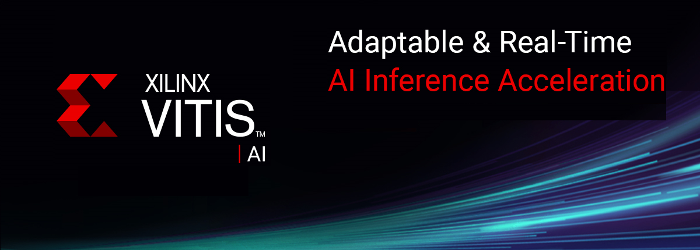

<div align="center">
  
</div>

<br />
Xilinx&reg; Vitis&trade; AI is a development stack for AI inference on Xilinx hardware platforms, including both edge devices and Alveo cards.

It consists of optimized IP, tools, libraries, models, and example designs. It is designed with high efficiency and ease of use in mind, unleashing the full potential of AI acceleration on Xilinx FPGA and ACAP.  
<br />
<br />

<div align="center">
  
</div>

<br />
Vitis AI is composed of the following key components:

* **AI Model Zoo**  - A comprehensive set of pre-optimized models that are ready to deploy on Xilinx devices.
* **AI Optimizer** - An optional model optimizer that can prune a model by up to 90%. It is separately available with commercial licenses.
* **AI Quantizer** - A powerful quantizer that supports model quantization, calibration, and fine tuning.
* **AI Compiler** - Compiles the quantized model to a high-efficient instruction set and data flow.
* **AI Profiler** - Perform an in-depth analysis of the efficiency and utilization of AI inference implementation.
* **AI Library** - Offers high-level yet optimized C++ APIs for AI applications from edge to cloud.
* **DPU** - Efficient and scalable IP cores can be customized to meet the needs for many different applications.
  * For more details on the different DPUs available, refer to [DPU Naming](docs/learn/dpu_naming.md).


**Learn More:** [Vitis AI Overview](https://www.xilinx.com/products/design-tools/vitis/vitis-ai.html)  


## [See What's New](docs//learn/release_notes.md)
- [Release Notes](docs//learn/release_notes.md)
- Support new platforms, including Versal ACAP platforms VCK190, VCK5000 and Kria SoM 
- Better Pytorch and Tensorflow model support: Pytorch 1.5-1.7.1, improved quantization for Tensorflow 2.x models
- New models, including 4D Radar detection, Image-Lidar sensor fusion, 3D detection & segmentation, multi-task, depth estimation, super resolution for automotive, smart medical and industrial vision applications
- New Graph Runner API to deploy models with multiple subgraphs
- DPUCADX8G (DPUv1)deprecated with DPUCADF8H (DPUv3Int8)
- DPUCAHX8H (DPUv3E) and DPUCAHX8L (DPUv3ME) release with xo
- Classification & Detection WAA examples for Versal (VCK190)

## Getting Started

Two options are available for installing the containers with the Vitis AI tools and resources.

 - Pre-built containers on Docker Hub: [xilinx/vitis-ai](https://hub.docker.com/r/xilinx/vitis-ai/tags)
 - Build containers locally with Docker recipes: [Docker Recipes](setup/docker)


### Installation
 - [Install Docker](docs/quick-start/install/install_docker/README.md) - if Docker not installed on your machine yet

 - [Ensure your linux user is in the group docker](https://docs.docker.com/install/linux/linux-postinstall/)

 - At least **100GB** of disk space for the disk partition running Docker

 - Clone the Vitis-AI repository to obtain the examples, reference code, and scripts.
    ```bash
    git clone --recurse-submodules https://github.com/Xilinx/Vitis-AI  

    cd Vitis-AI
    ```

**Note:** The following commands are for the latest version of Vitis AI. For details and history click [Run Docker Container](docs/quick-start/install/install_docker/load_run_docker.md)

#### Using Pre-built Docker

Download the latest Vitis AI Docker with the following command. This container runs on CPU.  
```
docker pull xilinx/vitis-ai-cpu:latest  
```

To run the docker, use command:
```
./docker_run.sh xilinx/vitis-ai-cpu:latest
```
#### Building Docker from Recipe

There are two types of docker recipes provided - CPU recipe and GPU recipe. If you have a compatible nVidia graphics card with CUDA support, you could use GPU recipe; otherwise you could use CPU recipe.

**CPU Docker**

Use below commands to build the CPU docker:
```
cd setup/docker
./docker_build_cpu.sh
```
To run the CPU docker, use command:
```
./docker_run.sh xilinx/vitis-ai-cpu:latest
```
**GPU Docker**

Use below commands to build the GPU docker:
```
cd setup/docker
./docker_build_gpu.sh
```
To run the GPU docker, use command:
```
./docker_run.sh xilinx/vitis-ai-gpu:latest
```
Please use the file **./docker_run.sh** as a reference for the docker launching scripts, you could make necessary modification to it according to your needs.


### Installing Patch in Docker

You can install Anaconda packages in a conda environment this way:

```
Vitis-AI /workspace > sudo conda install -n vitis-ai-caffe https://www.xilinx.com/bin/public/openDownload?filename=unilog-1.3.2-h7b12538_35.tar.bz2
```
For a downloaded file:

```sh
sudo conda install -n vitis-ai-caffe ./<conda_package>.tar.bz2
 ```

**X11 Support for Running Vitis AI Docker with Alveo**

If you are running Vitis AI docker with Alveo card and want to use X11 support for graphics (for example, some demo applications in VART and Vitis-AI-Library for Alveo need to display images or video), please add following line into the *docker_run_params* variable definition in *docker_run.sh* script:

~~~
-e DISPLAY=$DISPLAY -v /tmp/.X11-unix:/tmp/.X11-unix -v $HOME/.Xauthority:/tmp/.Xauthority \
~~~

And after the docker starts up, run following command lines:

~~~
cp /tmp/.Xauthority ~/
sudo chown vitis-ai-user:vitis-ai-group ~/.Xauthority
~~~

Please note before running this script, please make sure either you have local X11 server running if you are using Windows based ssh terminal to connect to remote server, or you have run **xhost +** command at a command terminal if you are using Linux with Desktop. Also if you are using ssh to connect to the remote server, remember to enable *X11 Forwarding* option either with Windows ssh tools setting or with *-X* options in ssh command line.


 ### Get Started with Examples
  - [VART](demo/VART/README.md)
  - [Vitis AI Library](demo/Vitis-AI-Library/README.md)


## Programming with Vitis AI

Vitis AI offers a unified set of high-level C++/Python programming APIs to run AI applications across edge-to-cloud platforms, including DPU for Alveo, and DPU for Zynq Ultrascale+ MPSoC and Zynq-7000. It brings the benefits to easily port AI applications from cloud to edge and vice versa. 10 samples in [VART Samples](demo/VART) are available to help you get familiar with the unfied programming APIs.


| ID | Example Name          | Models              | Framework  | Notes                                                                     |
|----|-----------------------|---------------------|------------|---------------------------------------------------------------------------|
| 1  | resnet50              | ResNet50            | Caffe      | Image classification with VART C\+\+ APIs\.                   |
| 2  | resnet50\_pt          | ResNet50            | Pytorch    | Image classification with VART extension C\+\+ APIs\.         |
| 3  | resnet50\_ext         | ResNet50            | Caffe      | Image classification with VART extension C\+\+ APIs\.         |
| 4  | resnet50\_mt\_py      | ResNet50            | TensorFlow | Multi\-threading image classification with VART Python APIs\. |
| 5  | inception\_v1\_mt\_py | Inception\-v1       | TensorFlow | Multi\-threading image classification with VART Python APIs\. |
| 6  | pose\_detection       | SSD, Pose detection | Caffe      | Pose detection with VART C\+\+ APIs\.                         |
| 7  | video\_analysis       | SSD                 | Caffe      | Traffic detection with VART C\+\+ APIs\.                      |
| 8  | adas\_detection       | YOLO\-v3            | Caffe      | ADAS detection with VART C\+\+ APIs\.                         |
| 9  | segmentation          | FPN                 | Caffe      | Semantic segmentation with VART C\+\+ APIs\.                  |
| 10 | squeezenet\_pytorch   | Squeezenet          | Pytorch    | Image classification with VART C\+\+ APIs\.                   |

For more information, please refer to [Vitis AI User Guide](https://www.xilinx.com/html_docs/vitis_ai/1_4/index.html)


## References
- [Vitis AI Overview](https://www.xilinx.com/products/design-tools/vitis/vitis-ai.html)
- [Vitis AI User Guide](https://www.xilinx.com/html_docs/vitis_ai/1_4/index.html)
- [Vitis AI Model Zoo with Performance & Accuracy Data](models/AI-Model-Zoo)
- [Vitis AI Tutorials](https://github.com/Xilinx/Vitis-Tutorials/tree/master/Machine_Learning)
- [Developer Articles](https://developer.xilinx.com/en/get-started/ai.html)

## [System Requirements](docs/learn/system_requirements.md)

## Questions and Support
- [FAQ](docs/quick-start/faq.md)
- [Vitis AI Forum](https://forums.xilinx.com/t5/AI-and-Vitis-AI/bd-p/AI)
- [Third Party Source](docs/reference/Thirdpartysource.md)

[models]: docs/models.md
[Amazon AWS EC2 F1]: https://aws.amazon.com/marketplace/pp/B077FM2JNS
[Xilinx Virtex UltraScale+ FPGA VCU1525 Acceleration Development Kit]: https://www.xilinx.com/products/boards-and-kits/vcu1525-a.html
[AWS F1 Application Execution on Xilinx Virtex UltraScale Devices]: https://github.com/aws/aws-fpga/blob/master/SDAccel/README.md
[Release Notes]: docs/release-notes/1.x.md
[UG1023]: https://www.xilinx.com/support/documentation/sw_manuals/xilinx2017_4/ug1023-sdaccel-user-guide.pdf
[ML Suite Overview]: docs/ml-suite-overview.md
[Webinar on Xilinx FPGA Accelerated Inference]: https://event.on24.com/wcc/r/1625401/2D3B69878E21E0A3DA63B4CDB5531C23?partnerref=Mlsuite
[ML Suite Lounge]: https://www.xilinx.com/products/boards-and-kits/alveo/applications/xilinx-machine-learning-suite.html
[Models]: https://www.xilinx.com/products/boards-and-kits/alveo/applications/xilinx-machine-learning-suite.html#gettingStartedCloud
[whitepaper here]: https://www.xilinx.com/support/documentation/white_papers/wp504-accel-dnns.pdf

