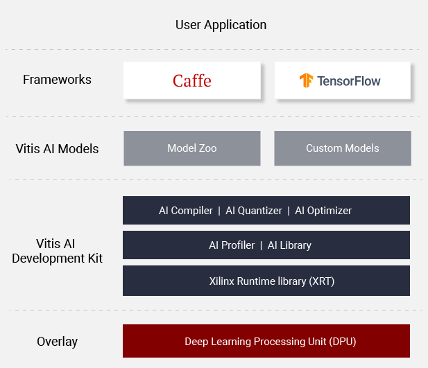

<div align="center">
  
</div>

<br />
Vitis AI is Xilinx’s development stack for AI inference on Xilinx hardware platforms, including both edge devices and Alveo cards. It consists of optimized IP, tools, libraries, models, and example designs. It is designed with high efficiency and ease of use in mind, unleashing the full potential of AI acceleration on Xilinx FPGA and ACAP.  
<br />
<br />

<div align="center">
  
</div>

<br />
Vitis AI is composed of the following key components:

* **AI Model Zoo**  - A comprehensive set of pre-optimized models that are ready to deploy on Xilinx devices.
* **AI Optimizer** - An optional model optimizer that can prune a model by up to 90%. It is seperately available with commercial licenses.
* **AI Quantizer** - A powerful quantizer that supports model quantization, calibration, and fine tuning.
* **AI Compiler** - Compiles the quantized model to a high-efficient instruction set and data flow. 
* **AI Profiler** - Perform an in-depth analysis of the efficiency and utilization of AI inference implementation.
* **AI Library** - Offers high-level yet optimized C++ APIs for AI applications from edge to cloud.
* **DPU** - Efficient and scalable IP cores can be customized to meet the needs for many different applications


**Learn More:** [Vitis AI Overview](https://www.xilinx.com/products/design-tools/vitis/vitis-ai.html)  


## [See What's New](doc/release-notes/1.x.md)
 - [Release Notes](doc/release-notes/1.x.md)
 - Unified Vitis AI APIs with 7 samples for edge to cloud deployment
 - Fully support Vitis flow with XRT 2019.2 and Vitis DPU
 - Model number in Model Zoo increased to 50 with 15 new Tensorflow models 
 - Neptune API for X + AI and Butler API for Multiprocess & Scaleout support for cloud deployment
 - Introduce adaptive operating layer to support non-Linux RTOS such as QNX
 - Vitis AI Library is open source with XRT 2019.2 support
 - Tensorflow and Darkenet model pruning
 - Ease of use enhancements
    - Docker Images for both tool and runtime 
    - Cross compilation support for Zynq/ZU+ MPSoC platform
 
## Getting Started

To facilitate the setup of Vitis AI environment, the docker container is used for Vitis AI package distribution. 
Vitis AI consists of three docker container images: two vitis-ai-docker-tools images and one vitis-ai-docker-runtime image. 
The two vitis-ai-docker-tools images are for GPU and CPU environments respectively. 
The vitis-ai-docker-tools contains the Vitis AI quantizer, AI compiler and examples. 
The vitis-ai-docker-runtime is the runtime docker image for DPU-v2 development, which holds Vitis AI installation package 
for Xilinx ZCU102 and ZCU104 evaluation boards, samples, and Arm GCC cross-compilation toolchain.

 - Clone the Vitis-AI repository to obtain the examples, reference code, and scripts. 
    ```
    git clone https://github.com/Xilinx/Vitis-AI  
    
    cd Vitis-AI
    ```  
 - [Install Docker](doc/install_docker/README.md) - if Docker not installed on your machine yet
 
 - [Ensure your linux user is in the group docker](https://docs.docker.com/install/linux/linux-postinstall/)
 
 - [Load&Run Docker Container](doc/install_docker/load_run_docker.md)  
 
 - Get started with examples
    - [ZU+ MPSoC/Zynq-7000](mpsoc/README.md)
    - [Alveo](alveo/README.md)

## Programming with Vitis AI

Vitis AI offers a unified set of high-level C++/Python programming APIs to run AI applications across edge-to-cloud platforms, including DPUv1 and DPUv3 for Alveo,  
and DPUv2 for Zynq Ultrascale+ MPSoC and Zynq-7000. It brings the benefits to easily port AI applications from cloud to edge and vice versa. 
7 samples in [Vitis AI Samples for Zynq](mpsoc/vitis_ai_samples_zcu102) and [Vitis AI Samples for Alveo](alveo/examples/vitis_ai_alveo_samples) are available 
to help you get familiar with the unfied programming APIs.


| ID | Example Name          | Models              | Framework  | Notes                                                                     |
|----|-----------------------|---------------------|------------|---------------------------------------------------------------------------|
| 1  | resnet50              | ResNet50            | Caffe      | Image classification with Vitis AI unified C\+\+ APIs\.                   |
| 2  | resnet50\_mt\_py      | ResNet50            | TensorFlow | Multi\-threading image classification with Vitis AI unified Python APIs\. |
| 3  | inception\_v1\_mt\_py | Inception\-v1       | TensorFlow | Multi\-threading image classification with Vitis AI unified Python APIs\. |
| 4  | pose\_detection       | SSD, Pose detection | Caffe      | Pose detection with Vitis AI unified C\+\+ APIs\.                         |
| 5  | video\_analysis       | SSD                 | Caffe      | Traffic detection with Vitis AI unified C\+\+ APIs\.                      |
| 6  | adas\_detection       | YOLO\-v3            | Caffe      | ADAS detection with Vitis AI unified C\+\+ APIs\.                         |
| 7  | segmentation          | FPN                 | Caffe      | Semantic segmentation with Vitis AI unified C\+\+ APIs\.                  |

For more information, please refer to [Vitis AI User Guide](http://www.xilinx.com/support/documentation/sw_manuals/vitis_ai/1_0/ug1414-vitis-ai.pdf)

 
## References 
- [Vitis AI Overview](https://www.xilinx.com/products/design-tools/vitis/vitis-ai.html)
- [Vitis AI User Guide](  http://www.xilinx.com/support/documentation/sw_manuals/vitis_ai/1_0/ug1414-vitis-ai.pdf)
- [Vitis AI Model Zoo with Performance & Accuracy Data](https://github.com/Xilinx/Vitis-AI/tree/master/AI-Model-Zoo)
- [Tutorials & Articles](https://developer.xilinx.com/en/get-started/ai.html)
- [Performance Whitepaper][]

## [System Requirements](doc/system_requirements.md)

## Questions and Support
- [FAQ](doc/faq.md)
- [Vitis AI Forum](https://forums.xilinx.com/t5/Machine-Learning/bd-p/Deephi)

[models]: docs/models.md
[Amazon AWS EC2 F1]: https://aws.amazon.com/marketplace/pp/B077FM2JNS
[Xilinx Virtex UltraScale+ FPGA VCU1525 Acceleration Development Kit]: https://www.xilinx.com/products/boards-and-kits/vcu1525-a.html
[AWS F1 Application Execution on Xilinx Virtex UltraScale Devices]: https://github.com/aws/aws-fpga/blob/master/SDAccel/README.md
[Release Notes]: docs/release-notes/1.x.md
[UG1023]: https://www.xilinx.com/support/documentation/sw_manuals/xilinx2017_4/ug1023-sdaccel-user-guide.pdf
[FAQ]: docs/faq.md
[ML Suite Overview]: docs/ml-suite-overview.md
[Webinar on Xilinx FPGA Accelerated Inference]: https://event.on24.com/wcc/r/1625401/2D3B69878E21E0A3DA63B4CDB5531C23?partnerref=Mlsuite
[Vitis AI Forum]: https://forums.xilinx.com/t5/Machine-Learning/bd-p/Deephi
[ML Suite Lounge]: https://www.xilinx.com/products/boards-and-kits/alveo/applications/xilinx-machine-learning-suite.html
[Models]: https://www.xilinx.com/products/boards-and-kits/alveo/applications/xilinx-machine-learning-suite.html#gettingStartedCloud
[whitepaper here]: https://www.xilinx.com/support/documentation/white_papers/wp504-accel-dnns.pdf
[Performance Whitepaper]: https://www.xilinx.com/support/documentation/white_papers/wp504-accel-dnns.pdf


