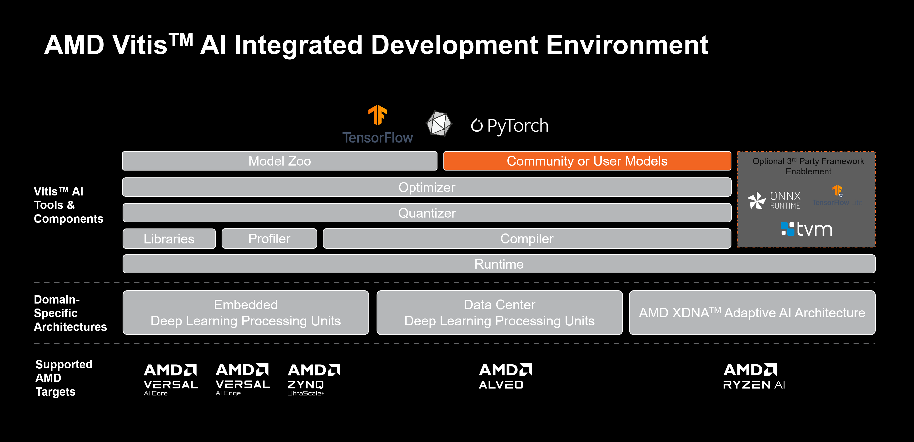

<table class="sphinxhide">
 <tr>
   <td align="center"><h1>Vitis AI</h1><h0>Adaptable & Real-Time AI Inference Acceleration</h0>
   </td>
 </tr>
</table>


[](https://opensource.org/licenses/Apache-2.0)

[](https://xilinx.github.io/Vitis-AI/)


<br />
AMD Vitis&trade; AI is an Integrated Development Environment that can be leveraged to accelerate AI inference on AMD adaptable platforms. Vitis AI provides optimized IP, tools, libraries, models, as well as resources, such as example designs and tutorials that aid the user throughout the development process.  It is designed with high efficiency and ease-of-use in mind, unleashing the full potential of AI acceleration on AMD adaptable SoCs and Alveo Data Center accelerator cards.  
<br /> <br />


<div align="center">
  
</div>
<br />

## Getting Started

If your visit here is accidental, but you are enthusiastic to learn more about Vitis AI, please visit the Vitis AI [homepage](https://www.xilinx.com/products/design-tools/vitis/vitis-ai.html) on Xilinx.com.

Otherwise, if your visit is deliberate and you are ready to begin, why not **[VIEW THE VITIS-AI DOCUMENTATION ON GITHUB.IO](https://xilinx.github.io/Vitis-AI/)**?

## How to Download the Repository

To get a local copy of Vitis AI, clone this repository to the local system with the following command:

```
git clone https://github.com/Xilinx/Vitis-AI
```

This command needs to be executed only once to retrieve the latest version of Vitis AI.

Optionally, configure git-lfs in order to reduce the local storage requirements. 

## Repository Branching and Tagging Strategy

To understand the branching and tagging strategy leveraged by this repository, please refer to [this page](https://xilinx.github.io/Vitis-AI/3.5/html/docs/install/branching_tagging_strategy.html)

## Licenses

Vitis AI License: [Apache 2.0](LICENSE)</br>
Third party: [Components](docsrc/source/docs/reference/Thirdpartysource.md)
