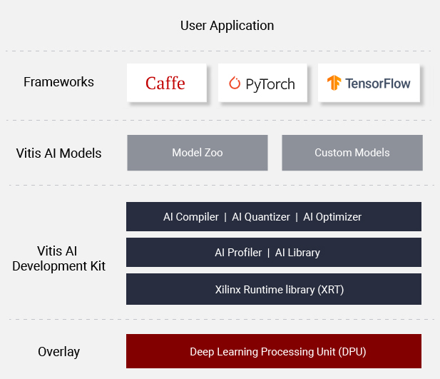

<div align="center">
  
</div>

<br />
Vitis AI is Xilinx’s development stack for AI inference on Xilinx hardware platforms, including both edge devices and Alveo cards. It consists of optimized IP, tools, libraries, models, and example designs. It is designed with high efficiency and ease of use in mind, unleashing the full potential of AI acceleration on Xilinx FPGA and ACAP.  
<br />
<br />

<div align="center">
  
</div>

<br />
Vitis AI is composed of the following key components:

* **AI Model Zoo**  - A comprehensive set of pre-optimized models that are ready to deploy on Xilinx devices.
* **AI Optimizer** - An optional model optimizer that can prune a model by up to 90%. It is separately available with commercial licenses.
* **AI Quantizer** - A powerful quantizer that supports model quantization, calibration, and fine tuning.
* **AI Compiler** - Compiles the quantized model to a high-efficient instruction set and data flow.
* **AI Profiler** - Perform an in-depth analysis of the efficiency and utilization of AI inference implementation.
* **AI Library** - Offers high-level yet optimized C++ APIs for AI applications from edge to cloud.
* **DPU** - Efficient and scalable IP cores can be customized to meet the needs for many different applications
  * For more details on the different DPUs available, please [click here](doc/dpu_naming.md).


**Learn More:** [Vitis AI Overview](https://www.xilinx.com/products/design-tools/vitis/vitis-ai.html)  


## [See What's New](doc/release-notes/1.x.md)
- [Release Notes](doc/release-notes/1.x.md)
- Vitis AI Quantizer and DNNDK runtime all open source
- 14 new Reference Models  AI Model Zoo (Pytorch, Caffe, Tensorflow)
- VAI Quantizer supports optimized models (prunned) 
- DPU naming scheme has been updated to be consistant across all configurations
- Introducing Vitis AI profiler for edge and cloud
- VAI DPUs supported in ONNXRuntime and TVM
- Added Alveo U50/U50LV support
- Added Alveo U280 support
- Alveo U50/U50LV DPU DPUCAHX8H micro-architecture improvement 
- DPU TRD upgraded to support Vitis 2020.1 and Vivado 2020.1
- Vitis AI for Pytorch CNN general access (Beta version)

## Getting Started

Two options are available for installing the containers with the Vitis AI tools and resources.

 - Pre-built containers on Docker Hub: [xilinx/vitis-ai](https://hub.docker.com/r/xilinx/vitis-ai/tags)
 - Build containers locally with Docker recipes: [Docker Recipes](docker)


### Installation
 - [Install Docker](doc/install_docker/README.md) - if Docker not installed on your machine yet

 - [Ensure your linux user is in the group docker](https://docs.docker.com/install/linux/linux-postinstall/)

 - Clone the Vitis-AI repository to obtain the examples, reference code, and scripts.
    ```
    git clone --recurse-submodules https://github.com/Xilinx/Vitis-AI  

    cd Vitis-AI
    ```
 
 - Prepare for the Vitis AI docker image.

    There are two types of docker image provided - CPU docker and GPU docker. If you have a compatible nVidia graphics card with CUDA support, you could use GPU docker; otherwise you could use CPU docker.

   **CPU Docker**

   Use below command to get the pre-built CPU docker image from docker hub:
   ```
   docker pull xilinx/vitis-ai-cpu:latest  
   ```
   or use below commands to build the CPU docker image locally:
   ```
   cd ./docker
   ./docker_build_cpu.sh
   ```

   **GPU Docker**

   You have to build the GPU docker image locally with below commands:
   ```
   cd ./docker
   ./docker_build_gpu.sh
   ```

 ### [Run Docker Container](doc/install_docker/load_run_docker.md)  

   Please use the file **./docker_run.sh** as a reference for the docker launching scripts, you could make necessary modification to it according to your needs.
   
   To run the CPU docker, use command:
   ```
   ./docker_run.sh xilinx/vitis-ai-cpu:latest
   ```
   To run the GPU docker, use command:
   ```
   ./docker_run.sh xilinx/vitis-ai-gpu:latest
   ```
   
   Some examples in VART and Vitis-AI-Library for Alveo card need X11 support to display images, this requires you have X11 server support at your terminal and you need to make some modifications to **./docker_run.sh** file to enable the image display. For example, you could use following script to start the Vitis-AI CPU docker for Alveo with X11 support.
   ```
   #!/bin/bash
   HERE=$(pwd) # Absolute path of current directory
   user=`whoami`
   uid=`id -u`
   gid=`id -g`

   xclmgmt_driver="$(find /dev -name xclmgmt\*)"
   docker_devices=""
   for i in ${xclmgmt_driver} ;
   do
     docker_devices+="--device=$i "
   done

   render_driver="$(find /dev/dri -name renderD\*)"
   for i in ${render_driver} ;
   do
     docker_devices+="--device=$i "
   done

   rm -Rf /tmp/.Xauthority
   cp $HOME/.Xauthority /tmp/
   chmod -R a+rw /tmp/.Xauthority

   docker run \
     $docker_devices \
     -v /opt/xilinx/dsa:/opt/xilinx/dsa \
     -v /opt/xilinx/overlaybins:/opt/xilinx/overlaybins \
     -e USER=$user -e UID=$uid -e GID=$gid \
     -v $HERE:/workspace \
     -v /tmp/.X11-unix:/tmp/.X11-unix \
     -v /tmp/.Xauthority:/tmp/.Xauthority \
     -e DISPLAY=$DISPLAY \
     -w /workspace \
     -it \
     --rm \
     --network=host \
     xilinx/vitis-ai-cpu:latest \
     bash
   ```
  
  Before run this script, please make sure either you have local X11 server running if you are using Windows based ssh terminal to connect to remote server, or you have run **xhost +** command at a command terminal if you are using Linux with Desktop. Also if you are using ssh to connect to the remote server, remember to enable *X11 Forwarding* option either with Windows ssh tools setting or with *-X* options in ssh command line.

 ### Get Started with Examples
  - [VART](VART/README.md)
  - [Vitis AI Library](Vitis-AI-Library/README.md)
  - [Alveo U200/U250](alveo/README.md)
  - [Vitis AI DNNDK samples](mpsoc/README.md)


## Programming with Vitis AI

Vitis AI offers a unified set of high-level C++/Python programming APIs to run AI applications across edge-to-cloud platforms, including DPU for Alveo, and DPU for Zynq Ultrascale+ MPSoC and Zynq-7000. It brings the benefits to easily port AI applications from cloud to edge and vice versa. 7 samples in [VART Samples](VART/samples) are available to help you get familiar with the unfied programming APIs.


| ID | Example Name          | Models              | Framework  | Notes                                                                     |
|----|-----------------------|---------------------|------------|---------------------------------------------------------------------------|
| 1  | resnet50              | ResNet50            | Caffe      | Image classification with VART C\+\+ APIs\.                   |
| 2  | resnet50\_mt\_py      | ResNet50            | TensorFlow | Multi\-threading image classification with VART Python APIs\. |
| 3  | inception\_v1\_mt\_py | Inception\-v1       | TensorFlow | Multi\-threading image classification with VART Python APIs\. |
| 4  | pose\_detection       | SSD, Pose detection | Caffe      | Pose detection with VART C\+\+ APIs\.                         |
| 5  | video\_analysis       | SSD                 | Caffe      | Traffic detection with VART C\+\+ APIs\.                      |
| 6  | adas\_detection       | YOLO\-v3            | Caffe      | ADAS detection with VART C\+\+ APIs\.                         |
| 7  | segmentation          | FPN                 | Caffe      | Semantic segmentation with VART C\+\+ APIs\.                  |

For more information, please refer to [Vitis AI User Guide](https://www.xilinx.com/html_docs/vitis_ai/1_1/zkj1576857115470.html)


## References
- [Vitis AI Overview](https://www.xilinx.com/products/design-tools/vitis/vitis-ai.html)
- [Vitis AI User Guide](https://www.xilinx.com/html_docs/vitis_ai/1_2/zkj1576857115470.html)
- [Vitis AI Model Zoo with Performance & Accuracy Data](https://github.com/Xilinx/AI-Model-Zoo)
- [Vitis AI Tutorials](https://github.com/Xilinx/Vitis-AI-Tutorials)
- [Developer Articles](https://developer.xilinx.com/en/get-started/ai.html)
- [Performance Whitepaper][]

## [System Requirements](doc/system_requirements.md)

## Questions and Support
- [FAQ](doc/faq.md)
- [Vitis AI Forum](https://forums.xilinx.com/t5/AI-and-Vitis-AI/bd-p/AI)
- [Third Party Source](doc/Thirdpartysource.md)

[models]: docs/models.md
[Amazon AWS EC2 F1]: https://aws.amazon.com/marketplace/pp/B077FM2JNS
[Xilinx Virtex UltraScale+ FPGA VCU1525 Acceleration Development Kit]: https://www.xilinx.com/products/boards-and-kits/vcu1525-a.html
[AWS F1 Application Execution on Xilinx Virtex UltraScale Devices]: https://github.com/aws/aws-fpga/blob/master/SDAccel/README.md
[Release Notes]: docs/release-notes/1.x.md
[UG1023]: https://www.xilinx.com/support/documentation/sw_manuals/xilinx2017_4/ug1023-sdaccel-user-guide.pdf
[FAQ]: docs/faq.md
[ML Suite Overview]: docs/ml-suite-overview.md
[Webinar on Xilinx FPGA Accelerated Inference]: https://event.on24.com/wcc/r/1625401/2D3B69878E21E0A3DA63B4CDB5531C23?partnerref=Mlsuite
[Vitis AI Forum]: https://forums.xilinx.com/t5/AI-and-Vitis-AI/bd-p/AI
[ML Suite Lounge]: https://www.xilinx.com/products/boards-and-kits/alveo/applications/xilinx-machine-learning-suite.html
[Models]: https://www.xilinx.com/products/boards-and-kits/alveo/applications/xilinx-machine-learning-suite.html#gettingStartedCloud
[whitepaper here]: https://www.xilinx.com/support/documentation/white_papers/wp504-accel-dnns.pdf
[Performance Whitepaper]: https://www.xilinx.com/support/documentation/white_papers/wp504-accel-dnns.pdf
