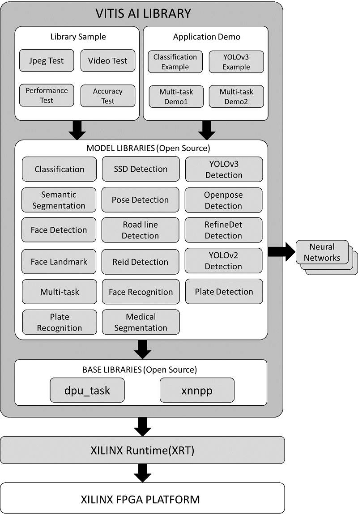

<table width="100%">
  <tr width="100%">
    <td align="center"><h1>Vitis AI Library v1.0</h1>
    </td>
 </tr>
 </table>

# Introduction
The Vitis AI Library is a set of high-level libraries and APIs built for efficient AI inference with Deep-Learning Processor Unit (DPU). It is built based on the Vitis AI Runtime with Unified APIs, and it fully supports XRT 2019.2.

The Vitis AI Library provides an easy-to-use and unified interface by encapsulating many efficient and high-quality neural networks. This simplifies the use of deep-learning neural networks, even for users without knowledge of deep-learning or FPGAs. The Vitis AI Library allows users to focus more on the development of their applications, rather than the underlying hardware.


<p align="center">
  
</p>

Vitis AI Library directory structure introduction
--------------------------------------------------

```
vitis_ai_library
├── demo                         # Application demo, including classification, yolov3,
|   |                            # seg_and_pose_detect and segs_roadline_detect
│   ├── classification
│   ├── seg_and_pose_detect
│   ├── segs_and_roadline_detect
│   └── yolov3
├── libsrc                       # AI library open source code
│   ├── libdpbase                # dpbase library using Vitis unified APIs
│   ├── libdpclassification
│   ├── libdpfacedetect
│   ├── libdpfacelandmark
│   ├── libdpmultitask
│   ├── libdpopenpose
│   ├── libdpposedetect
│   ├── libdprefinedet
│   ├── libdpreid
│   ├── libdproadline
│   ├── libdpsegmentation
│   ├── libdpssd
│   ├── libdptfssd               # Tensorflow SSD library
│   ├── libdpyolov2
│   └── libdpyolov3
├── LICENSE
├── README.md                    # This README
└── samples                      # Model test samples, including jpeg test, video test, performance test
    ├── classification
    ├── facedetect
    ├── facelandmark
    ├── multitask
    ├── openpose
    ├── posedetect
    ├── refinedet
    ├── reid
    ├── roadline
    ├── segmentation
    ├── ssd
    ├── tfssd
    ├── yolov2
    └── yolov3
```

## Quick Start
### Setting Up the Host
1. Download the [vitis-ai-docker-runtime image](https://www.xilinx.com/bin/public/openDownload?filename=vitis-ai-runtime-1.0.0.tar.gz)

2. Set up the docker runtime system according to the docker installation document.
```
   $sh docker_run.sh
```
3. Copy or git clone the AI Library package to the `workspace` folder.

4. Cross compile the demo in the AI Library, using yolov3 as example.
```
$cd /workspace/Vitis-AI/Vitis-AI-Library/demo/yolov3
$sh -x build.sh
```	

5. To compile the library sample in the AI Library, take classification for example, execute the following command.
```
$cd /workspace/Vitis-AI/Vitis-AI-Library/samples/classification
$sh -x build.sh
```	

6. To modify the library source code, view and modify them under `/workspace/Vitis-AI/Vitis-AI-Library/libsrc`.
   If you want to recompile the library, take libdpclassification for example, execute the following command:
```
$cd /workspace/Vitis-AI/Vitis-AI-Library/libsrc/libdpclassification
$sh -x build.sh
```

### Setting Up the Target

1. Installing a Board Image.
	* Download the SD card system image files from the following links:  
	
		[ZCU102](https://www.xilinx.com/bin/public/openDownload?filename=xilinx-zcu102-dpu-v2019.2.img.gz)  
	
		[ZCU104](https://www.xilinx.com/bin/public/openDownload?filename=xilinx-zcu104-dpu-v2019.2.img.gz)  
	
      	Note: The version of the board image should be 2019.2 or above.
	* Use Win32DiskImager (free opensource software) to burn the image file onto the SD card.
	* Insert the SD card with the image into the destination board.
	* Plug in the power and boot the board using the serial port to operate on the system.
	* Set up the IP information of the board using the serial port.
	You can now operate on the board using SSH.

2. Installing AI Model Package   
	* Download [ZCU102 AI Model](https://www.xilinx.com/bin/public/openDownload?filename=vitis_ai_model_ZCU102_2019.2-r1.0.deb)  
	
		You can also download [ZCU104 AI Model](https://www.xilinx.com/bin/public/openDownload?filename=vitis_ai_model_ZCU104_2019.2-r1.0.deb) if you use ZCU104 
	
	* Copy the downloaded file to the board using scp with the following command.
	```
	  $scp vitis_ai_model_ZCU102_2019.2-r1.0.deb root@IP_OF_BOARD:~/
	```
	* Log in to the board (usong ssh or serial port) and install the model package.
	* Run the following command.
	```
	  #dpkg -i vitis_ai_model_ZCU102_2019.2-r1.0.deb
	```

3. Installing AI Library Package
	* Download the [Vitis AI Library 1.0](https://www.xilinx.com/bin/public/openDownload?filename=vitis_ai_library_2019.2-r1.0.deb)  
	* Download the [demo video files](https://www.xilinx.com/bin/public/openDownload?filename=vitis_ai_library_r1.0_video.tar.gz) and untar into the corresponding directories.  
	
	* Download the [demo image files](https://www.xilinx.com/bin/public/openDownload?filename=vitis_ai_library_r1.0_images.tar.gz)  and untar into the corresponding directories.  
	
	* Copy the downloaded file to the board using scp with the following command.
	```
	  $scp vitis_ai_library_2019.2-r1.0.deb root@IP_OF_BOARD:~/
	```
	* Log in to the board using ssh. You can also use the serial port to login.
	* Install the Vitis AI Library.
	```
	  #dpkg -i vitis_ai_library_2019.2-r1.0.deb
	```
	  
### Running Vitis AI Library Examples

1. Enter the extracted directory of example in target board.
	```
	#cd /usr/share/vitis_ai_library/samples/facedetect
	```

2. Run the image example.
	```
	#./test_jpeg_facedetect densebox_640_360 sample_facedetect.jpg
	```

3. Run the video example.
```
	#./test_video_facedetect densebox_640_360 video_input.mp4 -t 8
	Video_input.mp4: The video file's name for input.The user needs to prepare the videofile.
	-t: <num_of_threads>
```

4. To test the program with a USB camera as input, run the following command:
```
	#./test_video_facedetect densebox_640_360 0 -t 8
	0: The first USB camera device node. If you have multiple USB camera, the value might be 1,2,3 etc.
	-t: <num_of_threads>
```

5. To test the performance of model, run the following command:
```
	#./test_performance_facedetect densebox_640_360 test_performance_facedetect.list -t 8 -s 60
	-t: <num_of_threads>
	-s: <num_of_seconds>
```

6. To check the version of Vitis AI Library, run the following command:
```
	#vitis_ai
```	

	
	
