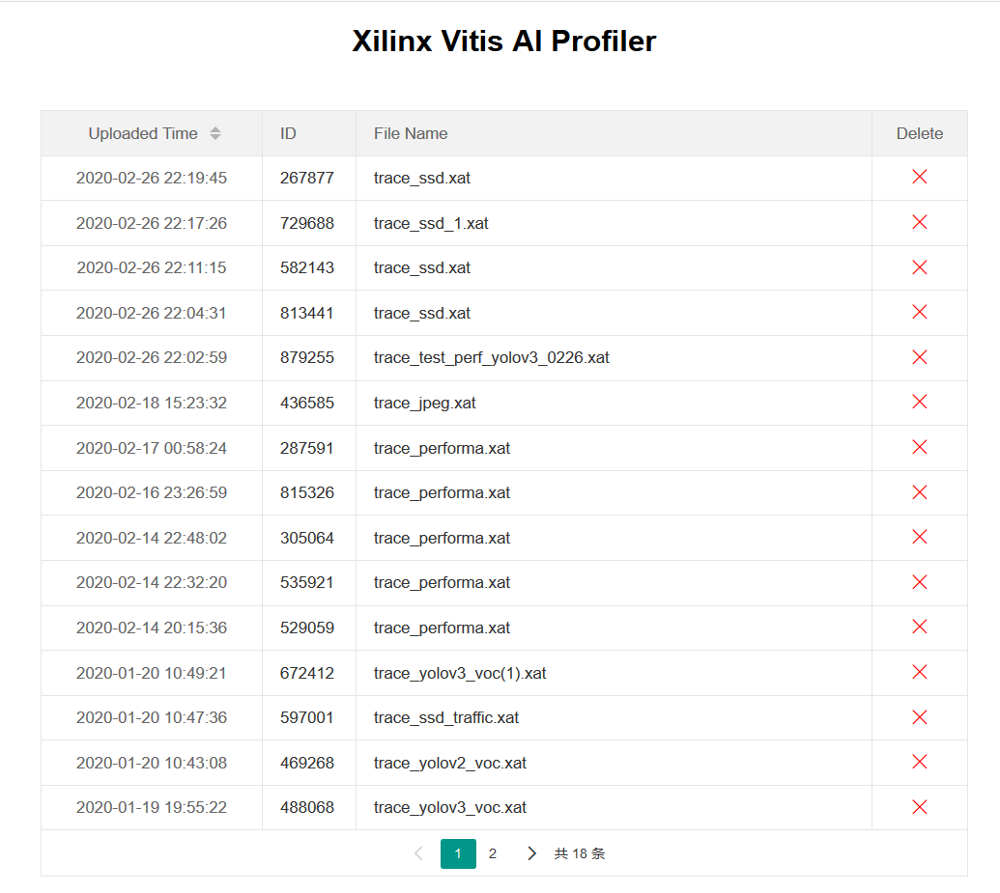

<p align="center">
    
</p>

# Xilinx Vitis AI Profiler

## Overview

The Vitis AI profiler tools is a set of tools that helps profile and visualize AI applications based on the Vitis AI Library:
- It’s easy to use, this tool requires neither any change in user’s code nor re-compilation of the program
- Figuring out hot spots or bottlenecks of preference at a glance
- Illustrating the running state of difference computing units(CPU/DPU/might be AIE in the future)

There are two components of this tool named VAITracer and VAIProfiler
- VAITracer:
Running on devices, take the responsibility for data collection
- VAIProfiler
Running on a PC or local server take responsibility for analyzation and visualization

## Vitis AI Profiler Architecture
<div align="center">
<table border="1">
    <tbody style="text-align: center;">
    <tr>
        <th>VAITracer</th>
        <th>VAIProfiler</th>
    </tr>
    <tr>
        <td>Simple to use, the same interface with the classical Linux profiling tools (strace and ltrace)</td>
        <td>A web application that could be easily deployed(need python as a run-time)</td>
    </tr>
    <tr>
        <td>Based on Linux trace infrastructures (Ftrace/Kprobe/Uprobe)</td>
        <td>Compatible with Windows(need WSL2)/Linux</td>
    </tr>
    <tr>
        <td>Collecting data of Vitis AI library and recording to a .xat format file</td>
        <td>Upload the .xat file</td>
    </tr>
    <tr>
        <td>Rich and flexible features that can be configured</td>
        <td>Auto analyze and show the report</td>
    </tr>
    </tbody>
</table>
<br></br>

</div>  

## Why Vitis AI Profiler
### What's the benefit of this tool
- A all-in-one soution for Vitis-AI
- Light-weight, software and hardware mixed profiling
- Vitis-AI is a heterogeneous system, it's complicated, so that we need a more powerful and customized tool for profiling. The Vitis AI Profiler could be used for a application level profiling. For a AI application, there will be some parts running on hardward, for example, neural network computation usually runs on DPU, and also, there are some parts of the AI application running on CPU as a function that was implemented by c/c++ code like image pre-processing. This tool could help put the running status of all parts together. So that, we get a all-in-one profilling tool for Vitis-AI applications. 

### What Information Can Be Obtained from This Tool

<p align="center"> Vitis AI Profiler GUI Overview</p>

- A union timeline that shows running status of different compute units in FPGA

  - CPU: Function call stack graph and CPU busy/idle state, all AI Library relevant function calls will be highlighted on the timeline 
  - For CPU tasks, different color indicates different thread, on the screenshot below, we can find five different colors that stand for five different threads
    - All of these five threads are forked by the Vitis AI Library
    - The first pink one that is in charge of loading and resizing picture from disk to memory
    - The other four threads that are in charge of processing AI tasks, including per-processing post-processing and scheduling tasks for DPUs
    <p align="center"></p>

    - DPUs' Every task running will be show on the timeline
    - DPU and other PL compute units can be supported(e.g. softmax or resize IP if exists)
    - Mouse move over the block will highlight it and show the run time of this task
  - For DPU tasks, the utilization of DPUs (in time dimension) could be see very clearly from this graph
    <p align="center"></p>


- Information about hardware on running
  - Memory Bandwidth: real-time AXI port traffic only available for edge devices now)
    - User can see details about the traffic(including read and write) of each AXI port
- Real-time throughput for AI inference throughput(FPS)
    - More details will be shown while mouse moving over
      <p align="center"></p>

- At the right half panel of the profiler window, there are two tabs which can be clicked on
    -	Hardware information about hardware platform, and if the target platform is zynq MPSoC DPU hardware information could be found here also
    -	A series of key performance indicator of CPUs and DPUs, including CPU/DPU utilization and DPU average latency for tasks
    <p align="center"></p>

## Get Started with Vitis AI Profiler:
-	System Requirements:
    - Hardware:
        - Support MPSoC (DPUCZD series)
        - Support Alveo (DPUCAH series)
    - Software:
        - Support VART v1.2+
        - Support Vitis AI Library v1.2+

- Installing:
    - Deploy the web server (Vitis AI Profiler) on PC or local server 
        1. Clone the Vitis AI project from github repo 
           ```bash
           # cd /path-to-vitis-ai/Vitis-AI-Profiler
           ```
        2. Requirements: 
            - Python 3.6+
            - Flask which you can get from 
              ```bash
              # pip3 install --user flask
              ```
        3. Start the web Server on PC or Local Network Server 
            ```bash
            # python3 vaiProfilerServer.py [–ip [0.0.0.0]] [--port [8008]]
            ```
            By default (run with no argument) the IP address is 0.0.0.0 and port number is 8008, so user can access the web page by http://localhost:8008 

    -	Preparing debug environment for vaitrace in MPSoC platform
        1.	Configure and Build Petalinux:  
        Run _petalinux-config -c kernel_ and Enable these for Linux kernel:

          ```
            General architecture-dependent options ---> [*] Kprobes
            Kernel hacking  ---> [*] Tracers
            Kernel hacking  ---> [*] Tracers  --->
            			[*]   Kernel Function Tracer
            			[*]   Enable kprobes-based dynamic events
            			[*]   Enable uprobes-based dynamic events
          ```

        2. Run _petelinux-config -c rootfs_ and enable this for root-fs:
          ```
            user-packages  --->  modules   --->
          				[*]   packagegroup-petalinux-self-hosted
          ```

        3. Run _petalinux-build_ and update kernel and rootfs

    - Preparing debug environment for docker  
      If you are using Vitis AI with docker, please add this patch to docker_run.sh, because root permission is required for vaitrace
      ```diff
      --- a/docker_run.sh
      +++ b/docker_run.sh
      @@ -94,6 +94,7 @@ if [[ $IMAGE_NAME == *"gpu"* ]]; then
           -e USER=$user -e UID=$uid -e GID=$gid \
           -e VERSION=$VERSION \
           -v $HERE:/workspace \
      +    -v /sys/kernel/debug:/sys/kernel/debug  --privileged=true \
           -w /workspace \
           --rm \
           --runtime=nvidia \
      @@ -111,6 +112,7 @@ else
           -e USER=$user -e UID=$uid -e GID=$gid \
           -e VERSION=$VERSION \
           -v $HERE:/workspace \
      +    -v /sys/kernel/debug:/sys/kernel/debug  --privileged=true \
           -w /workspace \
           --rm \
           --network=host \

      ```
    -	Installing vaitrace
        1.	Install vitis-ai-runtime package, vaitrace will be installed into /usr/bin/xlnx/vaitrace
        2.	Create a symbolic link for vaitrace for ease of use
        ```bash
            # ln -s /usr/bin/xlnx/vaitrace/vaitrace.py /usr/bin/vaitrace
        ```


- Starting trace with vaitrace  
Here use the 'test_performance' program of Vitis AI Library’s yolo_v3 sample as an example
    - Entry sample directory  
    ```bash
        # cd /usr/share/vitis_ai_library/samples/yolov3/
    ```
    - See readme file in sample directory and the test command is
      ```bash
      # vaitrace –t 10 –o ~/trace_yolo_v3.xat ./test_performance_yolov3 yolov3_voc ./test_performance_yolov3.list
      ```
      1. The first argument [-t 5] stands for vaitrace tracing for 5 seconds
      2. The second argument [-o ~/trace_yolo_v3.xat] stands for saving trace data to home directory and named as trace_yolo_v3.xat, if no specified, the tracing data file(.xat) will be saved to the same directory with the executable file
      3. The rest parts of above command is the target command to run
      4. Copy .xat from home directory to your PC (via scp or nfs)

- Uploading:
    - Open the Vitis AI Profiler with your browser by default URL is http://127.0.0.1:8008
    - Click 'Browse...' button to select the .xat file then click 'Upload'  
       <p align="center"></p>

    - After a while, it jumps to profiler page, there four parts on the profiler page
      1. Timeline  
      The timeline is categorized by hardware components users can tell hardware utilization with just a single glance. All Vitis AI relative tasks are high-lighted, and the other progress are filtered out.  
      For CPU tasks in timeline, different color indicates different thread, click on color block in the timeline it shows the details in the tree-grid table below
      2. Throughtput  
      Show real-time Vitis AI Library inference FPS
      3. DDR memory controller traffic, available for Zynq MPSoC only  
      Total AXI read and write traffic via DDR controller port S1-S5, S0 will not be connect to DPU, so S0 be ignored
      4. Information Table  
      Show CPU/Memory/DPU relative information


## Vaitrace Usage
### Command Line Usage
```bash
# vaitrace --help
usage: Xilinx Vitis AI Trace [-h] [-c [CONFIG]] [-d] [-o [TRACESAVETO]] [-t [TIMEOUT]] [-v]

  cmd   Command to be traced
  -b    Bypass mode, just run command and by pass vaitrace, for debug use
  -c [CONFIG]       Specify the configuration file
  -o [TRACESAVETO]  Save trace file to
  -t [TIMEOUT]      Tracing time limitation
  -v                Show version
```
#### Frequently-used arguments
  - cmd: cmd is your executable program of vitis-ai that want to be traced  

  -	-t  control the tracing time(in seconds) starting from the [cmd] being launched, default value is 3, if no -t is specified, the tracing will stop after [cmd] running for 3 seconds, [cmd] will continue to run as normal, but tracing data collecting will be stop  
  It’s recommended that: trace about 50~500 times of vitis-ai inference run at once, determine how many seconds to trace by considering FPS of your AI program
      -	Less than 50 may not enough for some statistic information
      -	More than 500 will slow down the system significantly  
    
  -	-o  where to save trace file (.xat), by default, the .xat file will be saved to current working directory, and be named as the same as executable program plus .xat as suffix
  -	-c  users can start a trace with more custom options by writing these a json  format configuration file and specify the configuration by -c, details of configuration file will be explained in the next section
  -	Others arguments are used for debug

#### Configuration
Another way to launch a trace is to save all necessary information for vaitrace into a configuration file then use vaitrace -c [cfg_name.json]

- Configuration priority: Configuration File > Command Line > Default

- Here is an example of vaitrace configuration file
    ```json
    {
      "options": {
          "runmode": "normal",
          "cmd": "/usr/share/vitis-ai-library/sample/classification/test_jpeg_classification resnet50 sample.jpg",
          "output": "./trace_resnet50.xat",
          "timeout": 3
      },
      "trace": {
          "enable_trace_list": ["vitis-ai-library", "opencv", "vart", "custom"]
      },
      "trace_custom": []
    }
    ```
    |  Key | Sub-level Key | Type | Description |
    |  :-  | :- | :-: | :- |
    | options  |  | object |  |
    |   | cmd | string | the same with command line argument cmd |
    |   | output | string | the same with command line argument -o |
    |   | timeout | integer | the same with command line argument -t |
    |   | runmode | string | Xmodel run mode control, can be “debug” or “normal”, if runmode == “debug” VART will control xmodel run in a debug mode by using this, user can achieve **fine-grained profiling** for xmodel. For .elf type mode, only "normal" is valid |
    | trace  |  | object | |
    |  | enable_tracelist | list_of_string |enable_trace_list	list	Built-in trace function list to be enabled, available value **"vitis-ai-library", "vart", “opencv”, "custom"**, custom for function in trace_custom list|
    |  trace_custom | | list_of_string | trace_custom	list	The list of functions to be traced that are implemented by user. For the name of function, naming space are supported. You can see an example of using custom trace function later in this document|
		

## Vitis AI Profiler Usage
### Manage uploaded .xat files:
Click on [Manage Uploaded Files] on front-page, that we can see a file management page, that we can find uploaded .xat files:
  - All items are ranked by uploaded time, so that files could find easily
  - Click on the ID number will jump to the report 
  - Click on the file name can download the uploaded .xat file
  - Click on the [x] will remove the file from server
  <p align="center"></p>


## Example of VART based program profiling:
- Preparing 
  ```bash
  # cd path-to-vart-resnet50-samples
  ```
  - Setup environment
  - Remove cv::imshow and cv::waitKey from main.cc so that this program could run continuously
  - Build this sample

  From the source code, we found that **TopK** and **softmax** task will be done by CPU, and we want to check the performance of these two functions, so write the name of these two functions to trace_custom list, and save this file as trace_resnet50_vart.json.  
  For edge devices: 
  ```json
  {
      "options": {
          "runmode": "normal",
          "cmd": "./resnet50 model_dir_for_zcu104/resnet50.elf",
          "output": "./trace_vart_resnet50.xat",
          "timeout": 3
      },
      "trace": {
          "enable_trace_list": ["vart", "opencv", "custom"]
      },
      "trace_custom": [ "TopK", "CPUCalcSoftmax"]
  }

  ```
  For alveo devices, this sample uses xmodel, so it will have a different launch command
  ```json
  {
      "options": {
          "runmode": "normal",
          "cmd": "./resnet50 model_dir_for_U50/resnet50.xmodel",
          "output": "./trace_vart_resnet50.xat",
          "timeout": 3
      },
      "trace": {
          "enable_trace_list": ["vart", "opencv", "custom"]
      },
      "trace_custom": [ "TopK", "CPUCalcSoftmax"]
  }
  ```

- Start a trace:
  ```bash
  # vaitrace -c trace_resnet50_vart.json
  ```
  note: vaitrace requires root permission

- Upload trace_vart_resnet50.xat to Vitis Ai Profiler and check the report

  <p align="center"></p>
