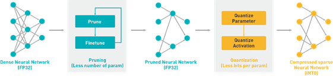

# Vitis AI Quantizer for TensorFlow (vai_q_tensorflow)
This is Xilinx Vitis AI quantizer for TensorFlow. It is a Xilinx maintained fork of TensorFlow from branch r1.15. 
vai_q_tensorflow supports FPGA friendly quantization for Tensorflow models. After quantization, models can be deployed to FPGA devices.
vai_q_tensorflow is a component of Xilinx [Vitis AI](https://github.com/Xilinx/Vitis-AI), which is Xilinx’s development stack for AI inference on Xilinx hardware platforms.

* Note: Users can download the Xilinx prebuilt version in [Xilinx Vitis AI](https://www.xilinx.com/products/design-tools/vitis.html).

## Installation
Tested Environment:
* Ubuntu 16.04
* GCC 4.8
* Bazel 0.24.1
* Python 3.6
* CUDA 10.1 + CUDNN 7.6.5

Prerequisite: 

*  Install [Bazel 0.24.1](https://bazel.build/)
*  (GPU version) Install CUDA and CUDNN
*  Install python prerequistes:
```shell
$ pip install -r requirements.txt 
```

Option 1. Build wheel package and install:
```shell
# CPU-only version
$ ./configure # Input "N" when asked "Do you wish to build TensorFlow with CUDA support?". For other questions, use default value or set as you wish.
$ sh rebuild_cpu.sh
# GPU version
$ ./configure # Input "Y" when asked "Do you wish to build TensorFlow with CUDA support?". For other questions, use default value or set as you wish.
$ sh rebuild_gpu.sh
```

Option 2. Build conda package (need [anaconda](https://www.anaconda.com/)):
```shell
# CPU-only version
$ conda build --python=3.6 vai_q_tensorflow_cpu_feedstock --output-folder ./conda_pkg/
# GPU version
$ conda build --python=3.6 vai_q_tensorflow_gpu_feedstock --output-folder ./conda_pkg/
# Install conda package
$ conda install --use-local ./conda_pkg/linux-64/vai_q_tensorflow-1.0-py36h605774d_1.tar.bz2
```

Validate Installation
```shell
$ vai_q_tensorflow --version
$ vai_q_tensorflow --help
```

* Note: This tool is based on tensorflow 1.15, for more information on build and installation, please refer to [tensorflow installation guide](https://www.tensorflow.org/install/source), such as [Docker linux build](https://www.tensorflow.org/install/source#docker_linux_builds) or [Windows installation](https://www.tensorflow.org/install/source_windows).

## Quantization Overview
The process of inference is computation intensive and requires a high memory bandwidth to satisfy the low-latency and high-throughput requirement of edge applications.

Quantization and channel pruning techniques are employed to address these issues while achieving high performance and high energy efficiency with little degradation in accuracy. Quantization makes it possible to use integer computing units and to represent weights and activations by lower bits, while pruning reduces the overall required operations. In the Vitis AI quantizer, only the quantization tool is included. The pruning tool is packaged in the Vitis AI optimizer. Contact the support team for the Vitis AI development kit if you require the pruning tool.


<div align="center">
  
</div>

Generally, 32-bit floating-point weights and activation values are used when training neural networks. By converting the 32-bit floating-point weights and activations to 8-bit integer (INT8) format, the Vitis AI quantizer can reduce computing complexity without losing prediction accuracy. The fixed-point network model requires less memory bandwidth, thus providing faster speed and higher power efficiency than the floating-point model. The Vitis AI quantizer supports common layers in neural networks, such as convolution, pooling, fully connected, and batchnorm.

The Vitis AI quantizer now supports TensorFlow and Caffe (the quantizer names are vai_q_tensorflow and vai_q_caffe respectively). The vai_q_tensorflow quantizer is based on Tensorflow 1.15.2. 

In the quantize calibration process, only a small set of unlabeled images are required to analyze the distribution of activations. The running time of quantize calibration varies from a few seconds to several minutes, depending on the size of the neural network. Generally, there is a little decline in accuracy after quantization. However, for some networks such as Mobilenets, the accuracy loss might be large. In this situation, quantize finetuning can be used to further improve the accuracy of quantized models. Quantize finetuning requires the original train dataset. According to experiments, several epochs of finetuning are needed and the finetune time varies from several minutes to several hours.

## User Guide

See [Vitis AI User Guide](https://www.xilinx.com/html_docs/vitis_ai/1_1/zkj1576857115470.html).

## TensorFlow
[TensorFlow](https://www.tensorflow.org/) is an end-to-end open source platform
for machine learning. It has a comprehensive, flexible ecosystem of
[tools](https://www.tensorflow.org/resources/tools),
[libraries](https://www.tensorflow.org/resources/libraries-extensions), and
[community](https://www.tensorflow.org/community) resources that lets
researchers push the state-of-the-art in ML and developers easily build and
deploy ML powered applications.

TensorFlow was originally developed by researchers and engineers working on the
Google Brain team within Google's Machine Intelligence Research organization for
the purposes of conducting machine learning and deep neural networks research.
The system is general enough to be applicable in a wide variety of other
domains, as well.

TensorFlow provides stable [Python](https://www.tensorflow.org/api_docs/python)
and [C++](https://www.tensorflow.org/api_docs/cc) APIs, as well as
non-guaranteed backwards compatible API for
[other languages](https://www.tensorflow.org/api_docs).

## License

[Apache License 2.0](LICENSE)
