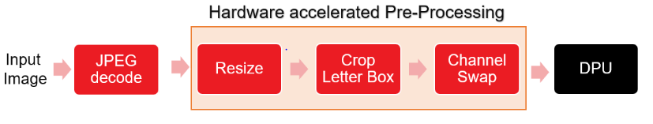

# ADAS Detection
Supported devices
- ZCU102
- Alveo-U50
- Alveo-U200
- Alveo-U280
- VCK190

## Table of Contents

- [Introduction](#Introduction)
- [Run ADAS detection example](#Run-ADAS-detection-example)
  - [Using pre-built xclbin](#Using-pre-built-xclbin)
    - [Setting up and running on ZCU102](#Setting-up-and-running-on-ZCU102)
    - [Setting up and running on U50 U200 U280](#Setting-up-and-running-on-U50-U200-U280)
    - [Setting up and running on VCK190](#Setting-up-and-running-on-VCK190)        
  - [Build flow](#Build-flow)
- [Performance](#Performance)    

## Introduction
Currently, applications accelerating pre-processing for detection networks (YOLO-v3) is provided and can only run on ZCU102/U50/U280/U200/VCK190 platforms. In this application, software JPEG decoder is used for loading input image. JPEG decoder transfer input image data to pre-processing kernel and the pre-processed data is directly stored at the ML accelerator input physical address. Below image shows the inference pipeline.

:pushpin: **Note:** In this application pre-processed data is directly stored at ML accelerator physical address. Hence avoiding device to host data transfers.

<div align="center">
  
</div>

## Run ADAS detection example
ADAS detection example runs with 3 different ways. 
1. Using pre-built xclbin 
1. Build flow

### **Using pre-built xclbin**

#### *Setting up and running on **ZCU102***
* Installing a Board Image.
	* Download the SD card system image tar files from the following links:  
	
      [ZCU102](https://www.xilinx.com/bin/public/openDownload?filename=waa_zcu102_adasdetection_v2_0_0.img.gz)

      :pushpin: **Note:** The version of the board image should be 2021.2 or above.
	* Untar the file
	* Use Etcher software to burn the image file onto the SD card.
	* Insert the SD card with the image into the destination board.
	* Plug in the power and boot the board using the serial port to operate on the system.
	* Set up the IP information of the board using the serial port.
	You can now operate on the board using SSH.

* Installing Vitis AI Runtime on the Evaluation Board

  * Download the [Vitis AI Runtime 2.0.0](https://www.xilinx.com/bin/public/openDownload?filename=vitis-ai-runtime-2.0.0.tar.gz). 

  * Untar the runtime packet and copy the following folder to the board using scp.
    ```sh
	  tar -xzvf vitis-ai-runtime-2.0.0.tar.gz
	  scp -r vitis-ai-runtime-2.0.0/2021.2/aarch64/centos root@IP_OF_BOARD:~/
    ```
  * Install the Vitis AI Runtime on the evaluation board. Execute the following command.
    ```sh
	  cd ~/centos
	  bash setup.sh
    ```
* Cross-compile ADAS detection example
  * Download the [sdk-2021.2.0.0.sh](https://www.xilinx.com/bin/public/openDownload?filename=sdk-2021.2.0.0.sh)

  * Install the cross-compilation system environment, follow the prompts to install. 

    **Please install it on your local host linux system, not in the docker system.**
    ```sh
    ./sdk-2021.2.0.0.sh
    ```
    Note that the `~/petalinux_sdk` path is recommended for the installation. Regardless of the path you choose for the installation, make sure the path has read-write permissions. 
    Here we install it under `~/petalinux_sdk`.

  * When the installation is complete, follow the prompts and execute the following command.
    ```sh
    . ~/petalinux_sdk/environment-setup-cortexa72-cortexa53-xilinx-linux
    ```
    Note that if you close the current terminal, you need to re-execute the above instructions in the new terminal interface.

  * Download the [vitis_ai_2021.2-r2.0.0.tar.gz](https://www.xilinx.com/bin/public/openDownload?filename=vitis_ai_2021.2-r2.0.0.tar.gz) and install it to the petalinux system.
    ```sh
    tar -xzvf vitis_ai_2021.2-r2.0.0.tar.gz -C ~/petalinux_sdk/sysroots/cortexa72-cortexa53-xilinx-linux
    ```

  * Cross compile `ADAS detection` example.
    ```sh
    cd  ${VAI_HOME}/Whole-App-Acceleration/apps/adas_detection
    bash -x app_build.sh
    ```
      If the compilation process does not report any error and the executable file `./bin/adas_detection.exe` is generated , then the host environment is installed correctly.

* Download Model files for ADAS detection

  ```sh
  cd ${VAI_HOME}/Whole-App-Acceleration/apps/adas_detection
  mkdir model_zcu102
  cd model_zcu102
  wget https://www.xilinx.com/bin/public/openDownload?filename=yolov3_adas_pruned_0_9-zcu102_zcu104_kv260-r2.0.0.tar.gz -O yolov3_adas_pruned_0_9-zcu102_zcu104_kv260-r2.0.0.tar.gz
  tar -xzvf yolov3_adas_pruned_0_9-zcu102_zcu104_kv260-r2.0.0.tar.gz
  ```

* Run ADAS detection Example

  This part is about how to run the ADAS detection example on zcu102 board.

  * Download the images at https://cocodataset.org/#download or any other repositories and copy the images to ` ${VAI_HOME}/Whole-App-Acceleration/apps/adas_detection/img` directory. In the following performance test we used COCO dataset.

  * Copy following contents of  ${VAI_HOME}/Whole-App-Acceleration/apps/adas_detection directory to the BOOT partition of the SD Card.
    ```sh
        bin
        model_zcu102
        img
        app_test.sh
        evaluation.py
    ```

  * Please insert SD_CARD on the ZCU102 board. After the linux boot, run:

  * Performance test with & without WAA

    ```sh
    cd /media/sd-mmcblk0p1/
    export XLNX_VART_FIRMWARE=/media/sd-mmcblk0p1/dpu.xclbin
    
    ./app_test.sh --xmodel_file ./model_zcu102/yolov3_adas_pruned_0_9/yolov3_adas_pruned_0_9.xmodel --image_dir ./img/ --performance_diff

    # Expect similar output:
        Running Performance Diff: 

          Running Application with Software Preprocessing 

          E2E Performance: 17.53 fps
          Pre-process Latency: 16.14 ms
          Execution Latency: 8.35 ms
          Post-process Latency: 32.52 ms

       Running Application with Hardware Preprocessing 

          E2E Performance: 25.34 fps
          Pre-process Latency: 0.82 ms
          Execution Latency: 8.25 ms
          Post-process Latency: 30.37 ms

          The percentage improvement in throughput is 44.53 %

    ```

  * Functionality test using single image with WAA
    ```sh
    ./app_test.sh --xmodel_file ./model_zcu102/yolov3_adas_pruned_0_9/yolov3_adas_pruned_0_9.xmodel --image_dir ./img/ --verbose

    # Expect similar output:
		The Confidence Threshold used in this demo is 0.5
		Total number of images in the dataset is 1
		image name: image1
		  xmin, ymin, xmax, ymax :12.3173 312.835 89.8562 364.71
		image name: image1
		  xmin, ymin, xmax, ymax :108.805 328.219 144.592 353.546
		image name: image1
		  xmin, ymin, xmax, ymax :83.6033 328.275 119.39 349.272
		image name: image1
		  xmin, ymin, xmax, ymax :1.9616 324.017 21.5726 345.06
		image name: image1
		  xmin, ymin, xmax, ymax :139.033 321.582 191.414 362.169
		image name: image1
		  xmin, ymin, xmax, ymax :171.326 325.928 261.314 364.758
    ```

  * Functionality test using single image without WAA (software preprocessing)
    ```sh
    ./app_test.sh --xmodel_file ./model_zcu102/yolov3_adas_pruned_0_9/yolov3_adas_pruned_0_9.xmodel --image_dir ./img/ --verbose --use_sw_pre_proc

    # Expect similar output:
		The Confidence Threshold used in this demo is 0.5
		Total number of images in the dataset is 1
		image name: image1
		  xmin, ymin, xmax, ymax :12.1682 313.02 89.707 364.895
		image name: image1
		  xmin, ymin, xmax, ymax :109.099 328.121 144.886 353.449
		image name: image1
		  xmin, ymin, xmax, ymax :83.6033 328.426 119.39 349.423
		image name: image1
		  xmin, ymin, xmax, ymax :173.604 326.026 258.141 364.855
		image name: image1
		  xmin, ymin, xmax, ymax :139.336 321.671 191.717 362.259
		image name: image1
		  xmin, ymin, xmax, ymax :1.87612 324.302 21.4872 345.345
    ```


#### *Setting up and running on **U50, U200, U280***


:pushpin: **Note:** Refer to [Setup Alveo Accelerator Card](../../../setup/alveo) to set up the Alveo Card.

:pushpin: **Note:** The docker container needs to be loaded and the below commands need to be run in the docker environment. Docker installation instructions are available [here](../../../README.md#Installation)

* Download and install xclbin.
  * To install **U50** xclbin, download the [waa_u50_xclbins_v2_0_0](https://www.xilinx.com/bin/public/openDownload?filename=waa_u50_xclbins_v2_0_0.tar.gz) xclbin tar and install xclbin.
	```sh
	sudo tar -xzvf waa_u50_xclbins_v2_0_0.tar.gz --directory /
	export XLNX_VART_FIRMWARE=/opt/xilinx/overlaybins/waa_u50_xclbins_v2_0_0/adas_detection/dpu.xclbin
	```
  * To install **U200** xclbin, download the [waa_u200_xclbins_v2_0_0](https://www.xilinx.com/bin/public/openDownload?filename=waa_u200_xclbins_v2_0_0.tar.gz) xclbin tar and install xclbin.
	```sh
	sudo tar -xzvf waa_u200_xclbins_v2_0_0.tar.gz --directory /
	export XLNX_VART_FIRMWARE=/opt/xilinx/overlaybins/waa_u200_xclbins_v2_0_0/adas_detection/dpu.xclbin
	```
  * To install **U280** xclbin, download the [waa_u280_xclbins_v2_0_0](https://www.xilinx.com/bin/public/openDownload?filename=waa_u280_xclbins_v2_0_0.tar.gz) xclbin tar and install xclbin.
	```sh
	sudo tar -xzvf waa_u280_xclbins_v2_0_0.tar.gz --directory /
	export XLNX_VART_FIRMWARE=/opt/xilinx/overlaybins/waa_u280_xclbins_v2_0_0/adas_detection/dpu.xclbin
	```
* Download and install ADAS detection model.
  * To install model file for **U50 & U280**
	  ```sh
    mkdir -p ${VAI_HOME}/Whole-App-Acceleration/apps/adas_detection/model_dir
	wget https://www.xilinx.com/bin/public/openDownload?filename=yolov3_adas_pruned_0_9-u50-u50lv-u280-DPUCAHX8H-r1.4.1.tar.gz -O yolov3_adas_pruned_0_9-u50-u50lv-u280-DPUCAHX8H-r1.4.1.tar.gz
    tar -xzvf yolov3_adas_pruned_0_9-u50-u50lv-u280-DPUCAHX8H-r1.4.1.tar.gz -C ${VAI_HOME}/Whole-App-Acceleration/apps/adas_detection/model_dir/
	```
  * To install model file for **U200**
	  ```sh
    mkdir -p ${VAI_HOME}/Whole-App-Acceleration/apps/adas_detection/model_dir/
	  wget https://www.xilinx.com/bin/public/openDownload?filename=yolov3_adas_pruned_0_9-u200-u250-r1.4.0.tar.gz -O yolov3_adas_pruned_0_9-u200-u250-r1.4.0.tar.gz
    tar -xzvf yolov3_adas_pruned_0_9-u200-u250-r1.4.0.tar.gz -C ${VAI_HOME}/Whole-App-Acceleration/apps/adas_detection/model_dir/
	  ```
* Download the images at https://cocodataset.org/#download or any other repositories and copy the images to ` ${VAI_HOME}/Whole-App-Acceleration/apps/adas_detection/img` directory. In the following performance test we used COCO dataset.

* Building ADAS detection application
    ```sh
    cd ${VAI_HOME}/Whole-App-Acceleration/apps/adas_detection
    ./app_build.sh
    ```

    If the compilation process does not report any error then the executable file `./bin/adas_detection.exe` is generated.    

* Run ADAS detection Example
  
  * Performance test with & without WAA

    ```sh
    export XLNX_ENABLE_FINGERPRINT_CHECK=0

    ./app_test.sh --xmodel_file ./model_dir/yolov3_adas_pruned_0_9/yolov3_adas_pruned_0_9.xmodel --image_dir ${VAI_HOME}/Whole-App-Acceleration/apps/adas_detection/img/ --performance_diff

    # Expect similar output:
        Running Performance Diff: 

          Running Application with Software Preprocessing 

          E2E Performance: 66.34 fps
          Pre-process Latency: 4.60 ms
          Execution Latency: 3.51 ms
          Post-process Latency: 6.95 ms

        Running Application with Hardware Preprocessing 

          E2E Performance: 88.29 fps
          Pre-process Latency: 0.94 ms
          Execution Latency: 3.30 ms
          Post-process Latency: 7.08 ms

          The percentage improvement in throughput is 33.09 %

    ```

  * Functionality test using single image with WAA
    ```sh

    ./app_test.sh --xmodel_file ./model_dir/yolov3_adas_pruned_0_9/yolov3_adas_pruned_0_9.xmodel --image_dir ${VAI_HOME}/Whole-App-Acceleration/apps/adas_detection/img/ --verbose
    
    # Expect similar output:
		The Confidence Threshold used in this demo is 0.5
		Total number of images in the dataset is 1

		image name: image
		  xmin, ymin, xmax, ymax :12.3173 312.835 89.8562 364.71
		image name: image
		  xmin, ymin, xmax, ymax :108.805 328.219 144.592 353.546
		image name: image
		  xmin, ymin, xmax, ymax :83.6033 328.275 119.39 349.272
		image name: image
		  xmin, ymin, xmax, ymax :1.9616 324.017 21.5726 345.06
		image name: image
		  xmin, ymin, xmax, ymax :139.033 321.582 191.414 362.169
		image name: image
		  xmin, ymin, xmax, ymax :171.326 325.928 261.314 364.758
    ```

  * Functionality test using single image without WAA (software preprocessing)
    ```sh
    
    ./app_test.sh --xmodel_file ./model_dir/yolov3_adas_pruned_0_9/yolov3_adas_pruned_0_9.xmodel --image_dir ${VAI_HOME}/Whole-App-Acceleration/apps/adas_detection/img/ --verbose --use_sw_pre_proc
    
    # Expect similar output:
		The Confidence Threshold used in this demo is 0.5
		Total number of images in the dataset is 1

		image name: image
		  xmin, ymin, xmax, ymax :12.1682 313.02 89.707 364.895
		image name: image
		  xmin, ymin, xmax, ymax :109.099 328.121 144.886 353.449
		image name: image
		  xmin, ymin, xmax, ymax :83.6033 328.426 119.39 349.423
		image name: image
		  xmin, ymin, xmax, ymax :173.604 326.026 258.141 364.855
		image name: image
		  xmin, ymin, xmax, ymax :139.336 321.671 191.717 362.259
		image name: image
		  xmin, ymin, xmax, ymax :1.87612 324.302 21.4872 345.345
    ```

#### *Setting up and running on **VCK190***


* Download the VCK190 SD card image file using the below link.

	[VCK190](https://www.xilinx.com/member/forms/download/design-license-xef.html?filename=xilinx-vck190-dpu-v2020.2-v1.4.0.img.gz)
 
  Please note that Xilinx account sign-in is required to download the above file.
* Unzip the file and flash the .img file to SD card using tools like Etcher.

* Download the WAA package 

```sh
wget https://www.xilinx.com/bin/public/openDownload?filename=waa_versal_adasdetection_v2_0_0.tar.gz -O waa_versal_adasdetection_v2_0_0.tar.gz

tar -xzvf waa_versal_adasdetection_v2_0_0.tar.gz
```
* Copy following contents of the WAA package to the SD card to the location `/media/sd-mmcblk0p1/`.The xmodel file is also present in the package. Create `/media/sd-mmcblk0p1/adas_detection` and move model_vck190 to this folder.
    ```
        BOOT.BIN
        dpu.xclbin
        include
        model_vck190
    ```

* Run ADAS detection Example

  This part is about how to run the ADAS detection example on vck190 board.

  * Download the images at https://cocodataset.org/#download or any other repositories and copy the images to ` ${VAI_HOME}/Whole-App-Acceleration/apps/adas_detection/img` directory. In the following performance test we used COCO dataset.

  * Copy ` waa_versal_adasdetection_v2_0_0/include` from the WAA package to ` ${VAI_HOME}/Whole-App-Acceleration/apps/adas_detection/src`
  
  * Copy following contents of  `${VAI_HOME}/Whole-App-Acceleration/apps/adas_detection` directory to the BOOT partition `/media/sd-mmcblk0p1/` of the SD Card.
    ```
        src
        img
        app_build.sh
        app_test.sh
        evaluation.py
    ```

  * Please insert SD_CARD on the vck190 board. After the linux boot, run the following.

  * Compile `adas detection` example.
    ```sh
    cd /media/sd-mmcblk0p1/
    bash -x app_build.sh
    ```
      If the compilation process does not report any error and the executable file `./bin/adas_detection.exe` is generated.

  * Performance test with & without WAA
    ```sh
    cd /media/sd-mmcblk0p1/
    export XLNX_VART_FIRMWARE=/media/sd-mmcblk0p1/dpu.xclbin
    ./app_test.sh --xmodel_file ./model_vck190/yolov3_adas_compiled.xmodel --image_dir ./img/ --performance_diff

    # Expect similar output:
        Running Performance Diff: 

          Running Application with Software Preprocessing 

          E2E Performance: 34.4495 fps
          Pre-process Latency: 7.588 ms
          Execution Latency: 1.114 ms
          Post-process Latency: 20.313 ms

       Running Application with Hardware Preprocessing 

          E2E Performance: 70.0231 fps
          Pre-process Latency: 0.585 ms
          Execution Latency: 1.081 ms
          Post-process Latency: 12.602 ms

          The percentage improvement in throughput is 103.26 %

    ```

  * Functionality test using single image with WAA
    ```sh
    ./app_test.sh --xmodel_file ./model_vck190/yolov3_adas_compiled.xmodel --image_dir ./img/ --verbose

    # Expect similar output:
		The Confidence Threshold used in this demo is 0.5
		Total number of images in the dataset is 1
		image name: image
		  xmin, ymin, xmax, ymax :1023.22 372.571 1172.79 504.016
		image name: image
		  xmin, ymin, xmax, ymax :1264.86 308.747 1771.48 560.747
		image name: image
		  xmin, ymin, xmax, ymax :1226.47 379.522 1256.53 472.467
		image name: image
		  xmin, ymin, xmax, ymax :1197.53 380.348 1222.46 467.662
		image name: image
		  xmin, ymin, xmax, ymax :1163.45 382.788 1193.51 475.733
    ```

  * Functionality test using single image without WAA (software preprocessing)
    ```sh
    ./app_test.sh --xmodel_file ./model_vck190/yolov3_adas_compiled.xmodel --image_dir ./img/ --verbose --use_sw_pre_proc

    # Expect similar output:
		The Confidence Threshold used in this demo is 0.5
		Total number of images in the dataset is 1
		image name: image
		  xmin, ymin, xmax, ymax :1019.76 373.862 1169.33 505.308
		image name: image
		  xmin, ymin, xmax, ymax :1261.38 311.325 1768 563.325
		image name: image
		  xmin, ymin, xmax, ymax :1004.69 409.349 1036.7 439.155
		image name: image
		  xmin, ymin, xmax, ymax :1196.12 379.151 1224.36 466.464
		image name: image
		  xmin, ymin, xmax, ymax :1227.45 375.78 1257.51 474.72
		image name: image
		  xmin, ymin, xmax, ymax :1162.96 378.397 1193.03 477.337
    ```

### Build flow
Both the pre-processing accelerator and DPU are built from sources.

| No. | Build flow                    | Device     | Documentation                                                                          |
|-----|-------------------------------|------------|----------------------------------------------------------------------------------------|
| 1   | DPUCZDX8G  | ZCU102     | [DPUCZDX8G_zcu102](./build_flow/DPUCZDX8G_zcu102/README.md)        |
| 2   | DPUCAHX8H  | Alveo-U50, U280 | [DPUCAHX8H_u50_u280](./build_flow/DPUCAHX8H_u50_u280/README.md)           |
| 3   | DPUCADF8H  | Alveo-U200 | [DPUCADF8H_u200](./build_flow/DPUCADF8H_u200/README.md)           |
| 4   | DPUCVDX8G  | VCK190 | [DPUCVDX8G_vck190](./build_flow/DPUCVDX8G_vck190/README.md)           |


## Performance
Below table shows the comparison of performance achieved by accelerating the pre-processing pipeline on FPGA.
For `ADAS detection`, the performance numbers are achieved by running ~5k images randomly picked from COCO dataset.

> Network: YOLOv3 Adas Detection


<table style="undefined;table-layout: fixed; width: 664px">
<colgroup>
<col style="width: 119px">
<col style="width: 136px">
<col style="width: 145px">
<col style="width: 134px">
</colgroup>
  <tr>
    <th rowspan="2">Device</th>
    <th colspan="2">Performance (FPS)</th>
    <th rowspan="2"><span style="font-weight:bold">Improvement</span></th>
  </tr>
  <tr>
    <td>with software Pre-processing</td>
    <td>with hardware Pre-processing</td>
  </tr>

  <tr>
    <td>ZCU102</td>
    <td>17.53</td>
    <td>25.34</td>
    <td>44.53 %</td>
  </tr>

  <tr>
    <td>U50</td>
    <td>66.69</td>
    <td>88.53</td>
    <td>32.75 %</td>
  </tr>

  <tr>
    <td>U200</td>
    <td>37.71</td>
    <td>45.95</td>
    <td>23.62 %</td>
  </tr>

  <tr>
    <td>U280</td>
    <td>64.82</td>
    <td>81.99</td>
    <td>26.49 %</td>
  </tr>

  <tr>
    <td>VCK190</td>
    <td>34.4495</td>
    <td>70.0231</td>
    <td>103.26 %</td>
  </tr>

</table>

:pushpin: **Note:** The above performance numbers doesn't consider the image read time.

>System with Intel&reg; Xeon&reg; Silver 4116 CPU @ 2.10GHz is used for U200 and U280 tests while Intel&reg; Xeon&reg; Bronze 3104 CPU @ 1.70GHz is used for U50 tests.

:pushpin: **Note:** The Performance numbers are computed using end-to-end latency and it depends on input image resolution. So performance numbers can vary with different images