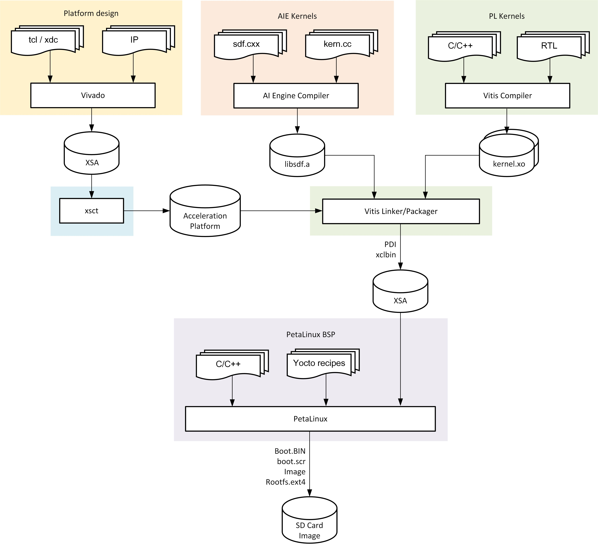

Tool Flow Overview
==================

The overall tool flow is outlined in the below diagram. Each step in the tool
flow is exlpained in detail in subsequent build tutorials.

At a high level, the builds steps are as follows:

#. **Vivado platform design:**
   The Vivado design is augmented with platform parameters that describe the
   meta data and physical interfaces available to the Vitis compiler for
   stitching in PL and/or AIE kernels.

#. **Platform creation:**
   The XSCT utility is used to create an extensible platform whose main
   component is the XSA created by Vivado in step 1.

#. **AIE kernels:**
   The AI Engine compiler is used to compile AI Engine kernels and to generate
   a graph description. The AI Engine elf and cdo files and the graph
   description are packaged into an archive named ``libadf.a`` which is consumed
   by the Vitis toolchain during the link and package steps.

#. **PL kernels:**
   The Vitis compiler is used to compile PL accelerator kernels from C/C++ using
   high-level synthesis (HLS) or to package RTL kernels. The kernels are
   compiled into xo files and consumed by the Vitis linker in the next step.

#. **Vitis linker and packager:**
   The Vitis linker integrates the AIE and PL kernels into the platform and
   implements the design. It generates a new PDI device image as well as xclbin
   file containing meta data information about the PL/AIE kernels. The Vitis
   packager is then used to integrate the AIE elfs/cdos into an updated PDI.
   Finally, the updated PDI and xclbin are packaged as part of the XSA file
   which is consumed by PetaLinux.

#. **PetaLinux BSP:**
   The PetaLinux BSP is a collection of yocto meta layers, recipes, source and
   config files that are used to generate a bootable SD card image. The SD card
   image consists of two partitions. The boot partition includes the boot image
   ``BOOT.BIN``, u-boot script ``boot.scr``, Linux kernel ``Image``, and the
   xclbin file; the second partition contains the root filesystem.

