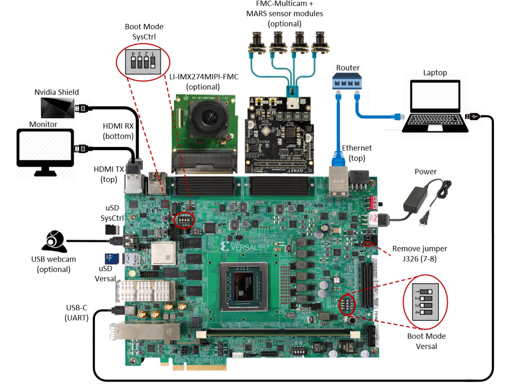

Run the Prebuilt Image
======================

Prerequisites
-------------

* Reference design zip file

* Terminal emulator, for example

  * Windows: teraterm (https://osdn.net/projects/ttssh2)

  * Linux: picocom (https://github.com/npat-efault/picocom/releases)

* Windows: Win32 Disk Imager utility (https://sourceforge.net/projects/win32diskimager)

* Windows: 7zip utility (https://sourceforge.net/projects/sevenzip/)

SD Card Creation
----------------

The SD card image file is located at
``$working_dir/sdcard/petalinux-sdimage.wic.gz``.

Choose an unpartitioned SD card of size 8GB or greater for this demo. Use the
*Win32 Disk Imager* utility for Windows or 'dd' command line utility for Linux
to write the given raw disk image ``petalinux-sdimage.wic`` to the SD card.

After unzipping the image file ``petalinux-sdimage.wic.gz`` using the 7zip
utility on Windows, use the following steps to write a raw disk image to a
removable device using the Win32 Disk Imager utility.

#. Browse to the location of the unzipped image in the Win32 utility. In the
   'File name' field, type ``*.wic``, otherwise only files with the ``.img``
   ending file be shown. Alternatively, change the drop down menu on the bottom
   right from 'Disk Images (\*.img \*.IMG)' to '\*.\*'.

#. Choose the correct SD card drive letter under 'Device'

#. Select 'Write' to the SD card, click 'Yes' at the prompt to continue writing
   and wait till the operation is complete

   .. image:: images/win32.jpg
      :width: 500px
      :alt: Win32 Image

Steps to write a raw disk image to a removable device using dd command-line
utility for Linux

#. Gunzip the given image file ``petalinux-sdimage.wic.gz`` in linux

#. Use dd to write ``petalinux-sdimage.wic`` to correct enumerated disk for SD
   card in the Linux machine:

   .. code-block:: bash

      gunzip petalinux-sdimage.wic.gz
      sudo dd if=petalinux-sdimage.wic of=/dev/sdbx bs=1M

**SD card partitions**

Once the raw image is written to the SD card, you will be able to see two
partitions. The first partition (FAT16 format) is the boot partition and it
contains:

* Xilinx OpenCL binary container (``binary_container_1.xclbin``)
* Boot image (``BOOT.BIN``)
* u-boot boot script (``boot.scr``)
* Linux kernel image (``image.ub``)

while in the second patition (ext4 format) resides the root file system.

**Note:** A Windows OS would only allow FAT16 partitions to be viewed whereas
the ext4 format is not recognized.

Board Setup
-----------

The following figure shows how to set up the VCK190 evaluation board.

**Board jumper and switch settings**

This is a onetime setup and the board should have been delivered to you with
this default settings, but it is good to double check for the first time when
you get the board.

* Make sure you remove J326 (7-8) jumper.

* Setup SYSCTRL Boot mode switch SW11 to (ON,OFF,OFF,OFF) from switch bits
  1 to 4 as shown in the above picture.

* Make sure you have the SYSCTRL uSD card inserted in the slot and card has the
  SYSCTRL image.

* Setup Versal Boot Mode switch SW1 to (ON,OFF,OFF,OFF) from switch bits 1 to 4
  as shown in the above picture.

**MIPI and HDMI connections**

Platform 1 supports video capture from the Leopard IMX274 MIPI FMC,
connect the FMC card to the FMCP1 slot (J51) as shown in the above figure.
For more info on the FMC module, visit:
https://leopardimaging.com/product/csi-2-mipi-modules-i-pex/li-imx274mipi-fmc/

Platform 2 supports video capture from Avnet Multi-Camera MIPI FMC Module.
Connect the FMC card to the FMCP2 slot (J53) as shown in the above figure.
For more info on the FMC module, visit:
https://www.avnet.com/wps/portal/silica/products/new-products/npi/2018/avnet-multi-camera-fmc-module/

Platform 3 supports video capture via HDMI RX.
Connect the HDMI cable as shown in the above figure. Connect the other end of the cable to a HDMI source
like a laptop or Nvidia Shield or Roku 

**Serial console settings**

VCK190 comes with a USB-C connector for JTAG+UART, when connected three UART
ports should be visible in Device Manager:

* Versal UART0

* Versal UART1 &

* System Controller UART

Connect a USB-C cable to the USB-UART connector. Open two terminal emulator windows. Choose
Versal UART0 on one and System Controller UART on the other and use the following settings
on the Serial Port:

* Baud Rate: 115200

* Data: 8 bit

* Parity: None

* Stop: 1 bit

* Flow Control: None

**Vadj settings**

Perform the following steps to set the Vadj voltage rail to 1.2V using the
*BoardUI* utility:

* Power on the board. On the  System Controller UART terminal type the 
  following commands at the linux prompt. This will allow the *BoardUI*
  utility to communicate with the System Controller.

  .. code-block:: bash

     sed -i -e 's/^#//' /etc/init.d/start_boardframework.sh
     nohup /usr/bin/boardframework.sh

* Close the System Controller UART terminal 
  
* Download the *BoardUI* tool from the following link:
  http://wiki.xilinx.com/BEAM+Tool+for+VCK190+Evaluation+Kit

* Extract the zip file and start the *BoardUI* tool. Make sure the USB-C
  cable is connected to your PC and the system controller Micro SD card is
  inserted.

* In the *BoardUI* GUI, navigate to the *FMC Boot Up* tab following the red
  circles as shown in the below figure. Enter *1.2* in the *Set On-Boot VADJ*
  field and click the button next to it to save the value.

  .. image:: images/boardui.jpg
     :width: 900px
     :alt: BoardUI Utility

* Power-cycle the board and navigate to the *FMC Current* tab. Click the
  *Get VADJ_FMC Voltage* button to read out the current voltage setting and
  confirm it matches the 1.2V set in the previous step.

* Close the *BoardUI* utility.

.. note::

   If Vadj does not persists after reboot, try updating the System Controller
   SD card image. The image  and instructions can be downloaded from this link:
   http://wiki.xilinx.com/BEAM+Tool+for+VCK190+Evaluation+Kit
   After updating the SD image, rerun the instructions for setting Vadj.

Connect to the JupyterLab Server
--------------------------------

Follow these steps to boot the board into Linux

* Ensure all steps under the section 'Board jumper and switch settings' are
  verified.

* Insert the prepared micro SD card into the Versal SD card slot (refer to the
  image VCK190 Board Setup)

* Make physical connections to ethernet, HDMI, UART, webcam and power as shown
  in the image.

* Have the UART0 terminal emulator tab connected.

* Turn ON power switch SW13.

* On Versal UART0 terminal, we would see the Versal device booting from the
  micro SD card starting with the message
  "Xilinx Versal Platform Loader and Manager"

* In about 60 seconds boot is complete. Observe the Linux prompt
  *root@xilinx-vck190-2020_1* and autostart of JupyterLab server as shown
  in the example below:

  .. code-block:: bash

     root@xilinx-vck190-2020_1:~#
     [I 17:36:24.640 LabApp] Writing notebook server cookie secret to /home/root/.local/share/jupyter/runtime/notebook_cookie_secret
     [W 17:36:26.084 LabApp] JupyterLab server extension not enabled, manually loading...
     [I 17:44:03.942 LabApp] JupyterLab extension loaded from /usr/lib/python3.7/site-packages/jupyterlab
     [I 17:44:03.942 LabApp] JupyterLab application directory is /usr/share/jupyter/lab
     [I 17:44:06.924 LabApp] Serving notebooks from local directory: /usr/share/notebooks
     [I 17:44:06.924 LabApp] The Jupyter Notebook is running at:
     [I 17:44:06.925 LabApp] http://192.168.1.77:8888/?token=06cfb958c61eb0581bb759f40e3a4c3a6252cef3b7075449
     [I 17:44:06.925 LabApp]  or http://127.0.0.1:8888/?token=06cfb958c61eb0581bb759f40e3a4c3a6252cef3b7075449
     [I 17:44:06.925 LabApp] Use Control-C to stop this server and shut down all kernels (twice to skip confirmation).
     [C 17:44:06.949 LabApp]

         To access the notebook, open this file in a browser:
             file:///home/root/.local/share/jupyter/runtime/nbserver-658-open.html
         Or copy and paste one of these URLs:
             http://192.168.1.77:8888/?token=06cfb958c61eb0581bb759f40e3a4c3a6252cef3b7075449
          or http://127.0.0.1:8888/?token=06cfb958c61eb0581bb759f40e3a4c3a6252cef3b7075449

Follow these steps to connect to the jupyter-server using Chrome browser on the
laptop.

**Note:** This demo is tested with Chrome browser only.

* Copy the generated URL with token on the prompt of Versal target and paste it
  to the browser address bar of the laptop, for example:

  .. code-block:: bash

     http://192.168.1.77:8888/?token=06cfb958c61eb0581bb759f40e3a4c3a6252cef3b7075449

  **Note:** If for any reason target fails to grab an IP address from the
  network, Jupyter server would fail to issue an URL. In such a case user is
  recommended to fix an IP address and restart the jupyter server as shown
  below:

  .. code-block:: bash

     /etc/init.d/jupyterlab-server stop
     /etc/init.d/jupyterlab-server start

* To look up the jupyter server IP address and token on the target, run:

  .. code-block:: bash

     jupyter notebook list

Setting a private network
^^^^^^^^^^^^^^^^^^^^^^^^^
In case of a private network, user may have to assign a static address within
the subnet of the host machine, this section can be skipped if you are using
DHCP and not on a private network

**Setting up a private network with target board and the host machine for
Windows users:**

* Make a direct connection between the windows host machine and the target
  board using an ethernet cable

* In windows, run command prompt as an admisntrator

  .. code-block:: bash

     Press Windows+R to open the “Run” box.
     Type “cmd” into the box.
     press Ctrl+Shift+Enter to run the command as an administrator

* Run ipconfig on the windows machine to list available ethernet adapters and
  set a static private ip

  .. code-block:: bash

     # A sample output after executing ipconfig
     # notice interface "Ethernet" has an auto address assigned with no Default Gateway

     ipconfig

     Ethernet adapter Ethernet:

        Connection-specific DNS Suffix  . :
        Link-local IPv6 Address . . . . . : fe80::1d8d:ac40:ff9b:8d1%21
        Autoconfiguration IPv4 Address. . : 169.254.8.209
        Subnet Mask . . . . . . . . . . . : 255.255.0.0
        Default Gateway . . . . . . . . . :

     # Set static ip address
     netsh interface ip set address name="YOUR INTERFACE NAME" static "IP_ADDRESS" "SUBNET_MASK"

     # Example
     netsh interface ip set address name="Ethernet" static 10.0.0.1 255.255.255.0

* Set a private ip address for the target within the subnet of host machine and
  verify connectivity.

  .. code-block:: bash

     ifconfig eth0 10.0.0.2 netmask 255.255.255.0

     # Perform a ping test to the host form the target
     ping -c 3 10.0.0.1

**Setting up a private network with target board and the host machine for Linux
users:**

* Make a direct connection between the Linux host machine and the target board
  using an ethernet cable

* Run ifconfig on the Linux machine to list available ethernet adapters and set
  a static private ip

  .. code-block:: bash

     # Example to set an ip 10.0.0.1 to ethernet interface enp2s0:
     sudo ifconfig enp2s0 10.0.0.1 netmask 255.255.255.0

* Set a private ip address for the target within the subnet of host machine and
  verify connectivity.

  .. code-block:: bash

     ifconfig eth0 10.0.0.2 netmask 255.255.255.0

     # Perform a ping test to the host form the target
     ping -c 3 10.0.0.1

Run the Jupyter Notebooks
-------------------------

This TRD includes the following jupyter notebooks:

#. **base-trd-nb1.ipynb**: Demonstrates videoplayback of a file source in rootfs
   of the target to the Jupyter notebook using the GStreamer multimedia
   framework.

#. **base-trd-nb2.ipynb**: Demonstrates streaming video from a v4l2 device on
   the target to the Jupyter notebook using the GStreamer multimedia framework

#. **base-trd-nb3.ipynb**: Demonstrates streaming video from a v4l2 device on
   the target to a HDMI monitor using the GStreamer multimedia framework.

#. **base-trd-nb4.ipynb**: Demonstrates two simultaneous streaming pipelines,
   one from file source and another from a v4l2 device onto two individual
   planes of a HDMI monitor using the GStreamer multimedia framework.

#. **base-trd-nb5.ipynb**: Demonstrates streaming video from a Mulit-Camera FMC
   module on the target to a HDMI monitor using the GStreamer multimedia
   framework.

#. **base-trd-nb6.ipynb**: Demonstrates the 2D filter accelerator kernels, both
   the PL and the AIE versions, inserted into the video pipeline of notebook 2.

#. **base-trd-nb7.ipynb**: Demonstrates using both 2D filter accelerator kernels
   in a time-multiplexed fashion in a multi-branch pipeline.

#. **base-trd-nb8.ipynb**: Demonstrates streaming audio/video from a v4l2 device
   or a file to a HDMI monitor/speaker using the GStreamer multimedia framework.

#. **base-trd-apm.ipynb**: Demonstrates how to plot the memory bandwidth while
   a video pipeline is running using the libxapm library with python bindings.

#. **base-trd-cpu.ipynb**: Demonstrates how to plot the CPU usage while running
   applications and pipelines.

#. **base-trd-power.ipynb**: Demonstrates how to plot power consumption of
   multiple voltage rails throughout the board.

**Note:** MIPI sources in the notebook is platform specific, User is allowed to
choose "mipi" in platform 1 and "mipi_quad" in platform 2 respectively,
otherwise an exception would be thrown.

To run the notebooks, follow the below steps:

#. On the left pane of the browser, 8 notebooks are available under the folder
   Base TRD.

#. Double click to open the notebook

#. Select 'Kernel' → 'Restart Kernel and Run All Cells' from the top menu bar to
   run the demo. For nb1, nb2 and nb6 scroll down to the end of the notebook to see 
   the video output. For all other notebooks the video output is displayed on the 
   monitor.

#. Click the rectangular icon to interrupt the kernel and stop the video stream.

#. Select 'Kernel' → 'Shutdown Kernel' → close the notebook tab and move to the
   next notebook.

   .. image:: images/jnbh.jpg
      :width: 1000px
      :alt: Jupyter_nb_home
