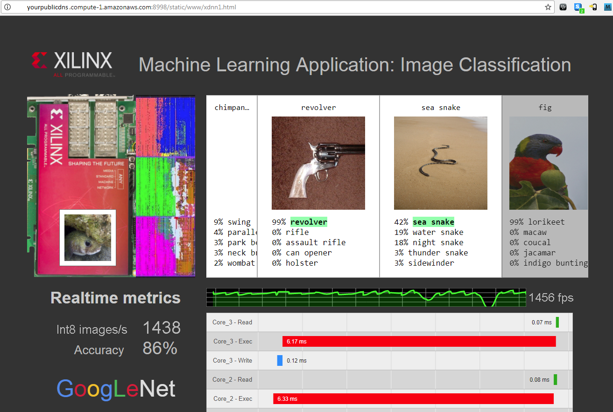

# ImageNet Image Classification w/ GoogLeNet v1 Web Demo

## Introduction
This tutorial shows you how to launch an image classification GoogLeNet-v1 demo in a web browser.  
Once the demo is started, you will be able to view the demo and monitor performance from any web browser.

1. Download a minimal version of the ImageNet Validation set  
```
python -m ck pull repo:ck-env
python -m ck install package:imagenet-2012-val-min
python -m ck install package:imagenet-2012-aux
head -n 500 $HOME/CK-TOOLS/dataset-imagenet-ilsvrc2012-aux/val.txt > $HOME/CK-TOOLS/dataset-imagenet-ilsvrc2012-val-min/val_map.txt
```
2. Open apps/perpetual_demo/run.sh in a text editor, and make sure that NUMPE is set correctly 
```
# User must set this
# aws : 1
# alveo-u200 : 2
# alveo-u200-ml : 3
# alveo-u250 : 4
# 1525 : 2
NUMPE=2
```
3. Launch the demo 
```
apps/perpetual_demo $ ./run.sh
```
4. Open Web Browser  
    Navigate to `http://<your_host>:8998/static/www/index.html`
    If there are multiple FPGAS, Navigate to `http://<your_ip>:8998/static/www/index.html#<no_of_FPGAS>`
    like `http://<your_ip>:8998/static/www/index.html#4`
    
5. To stop the demo, use ctrl+c, and then `kill -9 $(ps -s $$ -o pid=)` 


