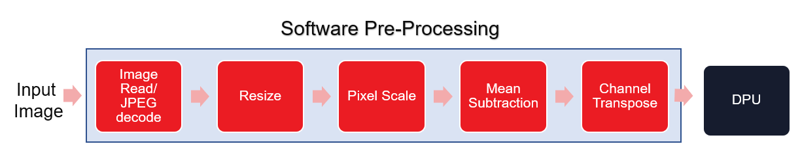
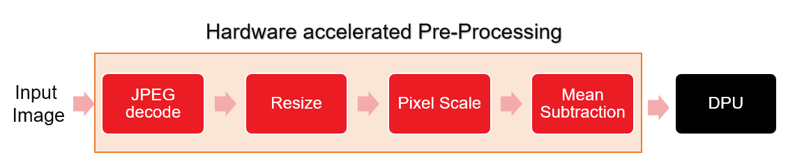

# Accelerating Pre-processing for classification networks

This application  demonstrates the acceleration of pre-processing for classification networks. The input image is fed to JPEG decoder which will generate YUV data. YUV image is converted to RGB and then resized and channel wise mean subtraction is perfomed on the resized image. Below block diagrams show various steps involved in the pre-processing and the blocks which are accelerated on hardware.

<div align="center">
  
</div>

<div align="center">
  
</div>

## Running the Application
1. `cd $VAI_ALVEO_ROOT/apps/whole_app_acceleration/classification`
2. Use `run.sh` file to run the application. Familiarize yourself with the script usage by `./run.sh -h`

### Examples:

1. To run image classification using Googlenet_v1
```sh
$ ./run.sh
```

2. To run image classification using resnet-50 with JPEG decode acceleration
```sh
$ ./run.sh -m resnet50 -t test_classify_jpeg
```

Note: Currently, JPEG decoder accelerator doesn't support certain JPEG image types so a conversion script is run to convert the input images to supported format.

### Performance:
Below table shows the comparison of pre-processing execution times on CPU and FPGA and also the througput achieved by acclerating the pre-processing pipeline on FPGA. The performance numbers are achieved by running 5K images randomly picked from imagenet dataset. The performance results may vary based on your system performance. 


CPU:  Intel(R) Core(TM) i7-4770 CPU @ 3.40GHz

FPGA: Alveo-U200


<table style="undefined;table-layout: fixed; width: 534px">
<colgroup>
<col style="width: 119px">
<col style="width: 136px">
<col style="width: 145px">
<col style="width: 134px">
</colgroup>
  <tr>
    <th rowspan="2">Network</th>
    <th colspan="2">E2E Throughput (fps)</th>
    <th rowspan="2"><span style="font-weight:bold">Percentage improvement in throughput</span></th>
  </tr>
  <tr>
    <td>with software Pre-processing</td>
    <td>with hardware Pre-processing</td>
  </tr>
  <tr>
    <td>Googlenet_v1</td>
    <td>129.81</td>
    <td>256.46</td>
    <td>97.5 %</td>
  </tr>
  <tr>
    <td>Resnet-50</td>
    <td>144.75</td>
    <td>208.36</td>
    <td>43.94 %</td>
  </tr>
</table>
