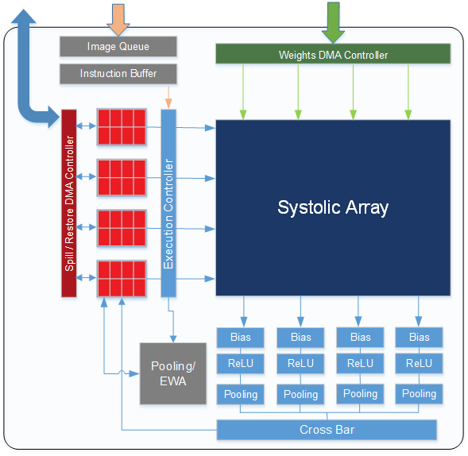
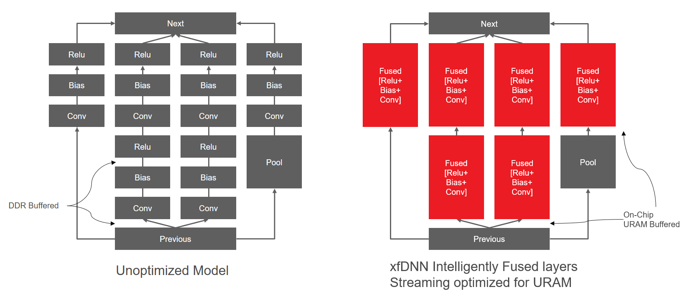

# DPU-v1 Overview

Xilinx xDNN IP cores(previously xDNN-v3) are high performance general CNN processing engines (PE). This means they can accept a wide range of CNN networks and models. DPU-v1 has been optimized for different performance metrics. Our latest version 3 of the IP has the following configuration:

| DSP Array Configuration | Total Image Memory per PE | Total DSPs in Array | 16-bit GOP/s @700MHz | 8-bit GOP/s @700MHz |
|:-------------------------:|:---------------------------:|:---------------------:|:----------------------:|:---------------------:|
| 96x16                   | 9 MB                      | 1536                | 2150                  | 4300                |

Each DPU-v1 IP Kernel supports the following Layers:

  

The DPU-v1 IP is a general CNN inference engine spporting applications such as: Classification, Object Detection, and Segmentation. 
  

  

  
**The key features of this engine are:**

* 96x16 DSP Systolic Array operating at 700MHz
* Instruction-based programming model for simplicity and flexibility to represent a variety of custom neural network graphs.
* 9MB on-chip Tensor Memory composed of UltraRAM
* Distributed on-chip filter cache
* Utilizes external DDR memory for storing Filters and Tensor data
* Pipelined Scale, ReLU, and Pooling Blocks for maximum efficiency
* Standalone Pooling/Eltwise execution block for parallel processing with Convolution layers
* Hardware-Assisted Tiling Engine to sub-divide tensors to fit in on-chip Tensor Memory and pipelined instruction scheduling
* Standard AXI-MM and AXI-Lite top-level interfaces for simplified system-level integration
* Optional pipelined RGB tensor Convolution engine for efficiency boost

The following example shows an **overlay** with four PEs.

An **overlay** is an FPGA binary with multiple xDNN IP kernels and the necessary connectivity for on board DDR channels and communication with other system level components such as PCIe. xDNN kernels can be combined with other accelerators such as video transcoding blocks, or custom IP blocks to create custom overlays. For all the standard overlays available in the ML Suite today, please see the [Overlay Selector Guide][]

### DPU-v1 Compiler
DPU-v1 not only provides simple Python interfaces to connect to high level ML frameworks, but also provides tools for network optimization by fusing layers, optimizing memory dependencies in the network, and pre-scheduling the entire network removing CPU host control bottlenecks.

Once these optimizations are completed per layer, the entire network is optimized for deployment in a "One-Shot" execution flow.

  

DPU-v1 uses VAI Quantizer which enables fast, high-precision calibration to lower precision deployments to INT8 and INT16. These Python tools are simple to use.

### ML Framework and Open Source Support

The ML Suite supports the following Frameworks:
- [Caffe](https://caffe.berkeleyvision.org/)
- [Tensorflow](https://www.tensorflow.org/api_docs/)
- [Keras](https://keras.io/)
- [MXNet](https://mxnet.incubator.apache.org/api/python/index.html)
- [Darknet*](https://pjreddie.com/darknet/)  
    - Note: Darknet support is achieved by automatically converting to Caffe.

With Vitis-AI you can connect to other Open Source frameworks and software easily with our Python APIs.

[Overlay Selector Guide]: ../overlaybins/README.md
