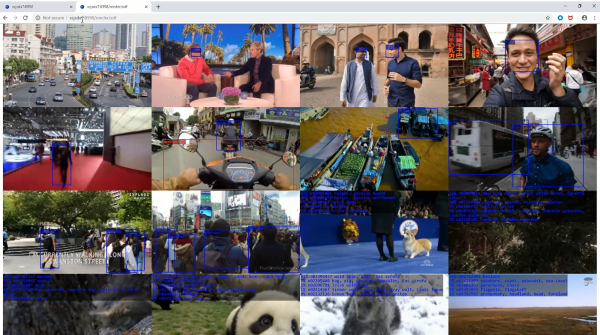

# NEPTUNE

<p align="center">

</p>


---

## Table of Contents <!-- omit in toc -->

- [About the Project](#about-the-project)
- [Getting Started](#getting-started)
  - [Prerequisites](#prerequisites)
  - [Running a Basic Service](#running-a-basic-service)
- [Directory Structure](#directory-structure)
  - [Neptune](#neptune)
  - [Other](#other)
- [Testing](#testing)
- [Further Reading](#further-reading)
  - [Disclaimer](#disclaimer)
- [Troubleshooting](#troubleshooting)

---

## About the Project

<p align="center">

</p>

Neptune provides a web server with a modular collection of nodes defined in Python.
Nodes can be strung together in a graph to create a service.
Users can interact with the server to start and stop services.
Users can extend Neptune by adding their own nodes and services.
In the picture, the user is running three different machine learning models on 16 videos from YouTube in real-time.
Through a single Neptune server, we enable time and space multiplexing of FPGA resources.
Eventually, with many Neptune servers, we hope to enable broader scale-out.

To run the example above, start the services `sface`, `simnet`, and `scoco`.
And go to `http://hostname:port/render/xdf`

## Getting Started

### Prerequisites

Since Vitis-AI is used under the hood, Vitis-AI dependencies must be present.
Some additonal packages are required different from the base Vitis-AI Caffe/TF environments:
* opencv >= 4.1.1
* ffmpeg >= 4.1.3
* pafy >= 0.5.4
* youtube-dl >= 2019.9.12
* redis >= 5.0.3 / pyarrow >= 0.15.0
* wget >= 3.2
* requests >= 2.21.0

```sh
# within Docker
conda activate vitis-ai-neptune
```

```sh
# without Docker
# note: due to changing default packages in the Vitis-AI conda env, you may need
# additional packages that were once default but are no longer. These instructions
# require access to the xdnn_cpp source code. You have to remake libxfdnn.so in
# the new environment after setting it up.

# first setup the default Vitis-AI conda env for Caffe, then in that env run:
 
# there's a dependency conflict with updating opencv (3.4.2 by default in
# MLsuite) and other packages. This command removes py-opencv and caffe_decent
conda remove -y -q py-opencv
 
conda install -y -q -c conda-forge "opencv>=4.1.1" ffmpeg
pip install youtube-dl pafy wget requests pyarrow orderedset
 
# libnms.so is also needed for some services. Make sure it's in the PYTHONPATH/site-packages!
cd $VAI_ALVEO_ROOT/apps/yolo/nms && make
 
# for full testing, you'll need these
pip install pytest coverage coverage-badge websocket-client

# Note that the Vitis C++ libraries will have to be rebuilt after the Conda env changes above
```

Python 3.6+ is recommended.

### Running a Basic Service
Neptune comes with a simple _ping_ service that can be used to demonstrate basic functionality  
1. Start Neptune on the server 
```sh
cd $VAI_ALVEO_ROOT/neptune && ./run.sh
```

The Neptune server will begin running (listening by default on port 8998)

From a web browser on the client machine
1. Navigate to `http://<server_hostname>:8998`
    - Use the push button to start/stop the ping service.
    - Wait until the service is started
2. Navigate to `http://<server_host_name>:8998/serve/ping` in another tab
    - The URL is also listed beside the service
    - The _ping_ service should send a reply with the current time every time the page is refreshed
3. The ping service can be stopped by clicking on the same button again

Use ctrl+C to exit the Neptune server. 

## Directory Structure

### Neptune

* **[docs](docs/)**: Contains documentation
* **[handlers](handlers/)**: Contains handler functions for Neptune services
* **[logs](logs/)**: Contains Neptune logs. Use logging.ini to configure logging options
* **[recipes](recipes/)**: Contains Neptune service definitions ([documentation](recipes/README.md))
* **[static](static/)**: Contains JS and CSS for building the default webpages in Neptune
* **[templates](templates/)**: Contains Tornado HTML templates for the default webpages in Neptune
* **[tests](tests/)**: Contains pytest tests

### Other

* **xstream.py (located at vai/dpuv1/rt/xstream.py)**: Defines the xstream communication for Neptune nodes ([documentation](../docs/xstream.md))
* **xsnodes (located at vai/dpuv1/rt/xsnodes/)**: Contains nodes for services in Neptune (documentation located at vai/dpuv1/rt/xsnodes/README.md)

## Testing

Neptune uses pytest for running tests.
[`test.sh`](./test.sh) is provided as a documented shell script wrapper for pytest showing the additional arguments that have been added to pytest.
Use the `--help` flag to see.
For complete testing, you will need the following:
```sh
pip install pytest coverage coverage-badge websocket-client
```

Tests are available in [tests/](./tests/). 
They also serve as documentation for how to write client applications that talk to Neptune.

## Further Reading

Documentation for source code should be available in the source file.

Some folders may have their own READMEs as well (see the links to documentation in the [directory structure](#directory-structure))

Finally, there is additional documentation in `docs/`, which is also listed below:
* [Neptune Overview](docs/neptune_overview.md)
* [REST Endpoints](docs/endpoints.md)

### Disclaimer

While every effort is made to keep the documentation up to date, it may lag behind the code.
In order of precedence, trust the code first, followed by the in-code documentation and finally, the external documentation in markdown.

## Troubleshooting

Neptune uses ports 8998 and 8999 by default, in addition to the xstream ports.
If they are already used, there will be an error about busy ports.
Free up the ports or specify new ones for Neptune/xstream

You may get an asyncio CancelledError when closing Neptune.
It's a bug but doesn't affect the run time behavior.

Try using `run.sh --clean` as a sanity check

If you're getting wget errors when trying to construct recipes, double check the artifact_server variable in recipes.py.
When services are constructed, they may require fetching the models associated with them.
If the artifacts can't be found, then the service will fail to be added. 

Always check the logs!
