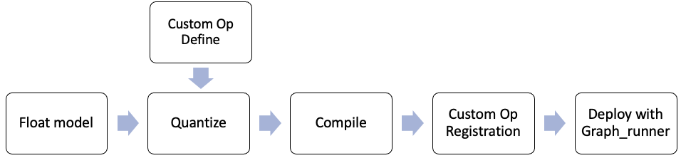

<table width="100%">
  <tr width="100%">
    <td align="center"><h1>Vitis AI Library v2.0</h1>
    </td>
 </tr>
 </table>

# Introduction
In VAI2.0 release, Pytorch model and Tensorflow2 model with custom op are supported. The basic workflow for custom op is shown below.

<p align="center">
  
</p>

We will give examples for the following two models respectively.
* MNIST model based on Tensorflow2
* Pointpillars model based on Pytorch

## Directory Structure Introduction

```
Custom_OP_Demo
  ├── op_add
  │   ├── Makefile
  │   ├── my_add_op.cpp
  │   └── README.md
  ├── pytorch_example
  │   ├── model
  │   ├── op_PPScatter
  │   └── pointpillars_graph_runner
  ├── README.md
  └── tensorflow2_example
      ├── model
      ├── op_Mylayer
      └── tf2_custom_op_graph_runner
```

## Step 1 : Quantize

For the Tensorflow2 model, refer to Tensorflow2 model quantize in Custom OP Workflow section of UG1414 and download the source code package [tf2_custom_op_demo.tar.gz](https://www.xilinx.com/bin/public/openDownload?filename=tf2_custom_op_demo.tar.gz) to do the quantization.

For the Pytorch model, refer to Pytorch model quantize in Custom OP Workflow section of UG1414 and download the float model and source code package [pointpillars-code-20211206.tar.gz](https://www.xilinx.com/bin/public/openDownload?filename=pointpillars-code-20211206.tar.gz) to do the quantization.

## Step 2 : Compile
Use the latest 2.0 docker to compile the model.  
For tensorflow2, the compiling commands are shown below.
Compile for edge DPU as an example:
```
conda activate vitis-ai-tensorflow2
cd <path of Vitis-AI>/demo/Custom_OP_Demo/tensorflow2_example/model/quantized
vai_c_tensorflow2 -m ./quantized.h5 -a /opt/vitis_ai/compiler/arch/DPUCZDX8G/ZCU102/arch.json -o ./ -n tf2_custom_op
```
For pytorch model, the compiling commands are shown below.
Compile for edge DPU as an example:
```
conda activate vitis-ai-pytorch
cd <path of Vitis-AI>/demo/Custom_OP_Demo/pytorch_example/model/quantized
vai_c_xir -x VoxelNet_int.xmodel -a /opt/vitis_ai/compiler/arch/DPUCZDX8G/ZCU102/arch.json -o ./ -n pointpillars_custom_op
```

## Step 3 : Custom OP Registration
For custom op registration, refer to [Custom OP Registration](op_add/README.md)
## Step 4 : Deployment
For the models with custom op, `graph_runner` APIs are recommended.
The following figure is the block flow of programming in `graph_runner`

<p align="center">
  
</p>

After you finished coding, you need to compile/cross-compile the source code to generate the executable program.

## Step 5 : Run the demo 
Before you run the demo, make sure the environment of the board has been set up correctly. If not, refer to [board setup](../../setup)   

Also, make sure the following files are generated or ready.

* compiled model, which is generated in step 2
* custom op library, which is generated in step 3
* test images
* executable program, which is generated in step 4


### tensorflow2_example
#### Running on edge DPU
Copy the custom op library to /usr/lib on the target.
```
scp libvart_op_imp_Mylayer.so root@[IP_OF_BOARD]:/usr/lib
```
Copy the `tensorflow2_example` folder to the target
```
scp -r tensorflow2_example root@[IP_OF_BOARD]:~
```
Run the demo.
```
cd ~/tensorflow2_example/tf2_custom_op_graph_runner/
./tf2_custom_op_graph_runner ../model/compiled/zcu102_zcu104_kv260/tf2_custom_op.xmodel sample.jpg
```
#### Running on cloud DPU
Copy the custom op library to /usr/lib on the target.
```
cp libvart_op_imp_Mylayer.so /usr/lib
```
Run the demo.
```
cd ~/tensorflow2_example/tf2_custom_op_graph_runner/
./tf2_custom_op_graph_runner ../model/compiled/vck5000_prod_8pe/tf2_custom_op.xmodel sample.jpg
```

### pytorch_example
#### Running on edge DPU
Copy the custom op library to /usr/lib on the target.
```
scp libvart_op_imp_PPScatterV2.so root@[IP_OF_BOARD]:/usr/lib
```
Copy the `pytorch_example` folder to the target
```
scp -r pytorch_example root@[IP_OF_BOARD]:~
```
Run the demoi, vck5000 8pe as an example.
```
cd ~/pytorch_example/pointpillars_graph_runner/
./build/sample_pointpillars_graph_runner ../model/compiled/zcu102_zcu104_kv260/pointpillars_custom_op.xmodel data/sample_pointpillars.bin
```
#### Running on cloud DPU
Copy the custom op library to /usr/lib on the target.
```
cp libvart_op_imp_PPScatterV2.so /usr/lib
```
Run the demo, vck5000 8pe as an example.
```
cd ~/pytorch_example/pointpillars_graph_runner/
./build/sample_pointpillars_graph_runner ../model/compiled/vck5000_prod_8pe/pointpillars_custom_op.xmodel data/sample_pointpillars.bin
```

## Reference
For more information, please refer to [Vitis AI User Guide](https://www.xilinx.com/html_docs/vitis_ai/2_0/index.html).
