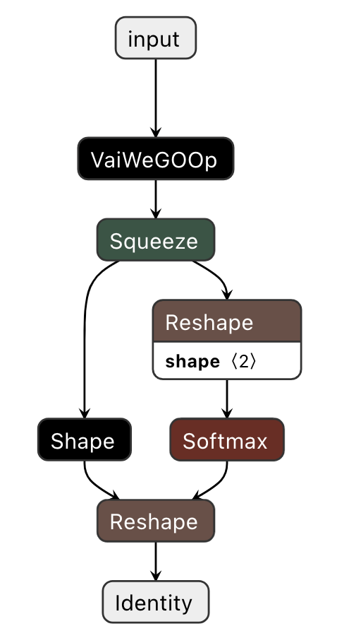
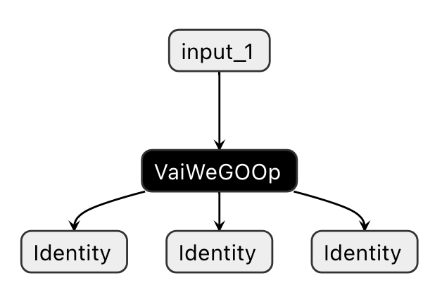

# Overview

WeGO (<u>W</u>hol<u>e</u> <u>G</u>raph <u>O</u>ptimizer) is a Vitis AI new experimental feature and it aims to offer the smooth solution to deploy TensorFlow models on cloud DPU through integrating Vitis AI Development kit with TensorFlow framework r1.15 version. For TensorFlow 2.x version, WeGO isn’t available yet.

WeGO automatically performs subgraph partitioning for the models quantized by Vitis AI quantizer, and applies optimizations and acceleration for the cloud DPU compatible subgraphs.  And the DPU un-supported remaining parts of graph are dispatched to TensorFlow for CPU execution. WeGO takes care of the whole graph optimization, compilation and run-time subgraphs’ dispatch and execution. This whole process is completely transparent to the end users, which makes it very easy to use. 

Using WeGO is a very straightforward transition from training to inference for model designers. WeGO provides Python programming interface to deploy the quantized models over TensorFlow framework. This makes it possible to maximumly reuse the Python code (including pre-processing and post-processing) developed during the phase of models training with TensorFlow, which greatly speeds up the models’ deployment and evaluation over cloud DPUs.

# WeGO Workflow

The input for WeGO is the quantized model usually named as quantize_eval_model.pb, which is generated by vai_q_tensorflow. The core WeGO API `create_wego_graph` automatically converts the quantized graph into new TensorFlow graph called WeGO graph where the cloud DPU compatible subgraphs are transformed into TensorFlow operator with the kind of VaiWeGOOp. The whole converting workflow can be abstracted into the following steps:

1. Execute some graph-level optimizations on the original graph to meet DPU specific requirements;
2. Traverse the whole graph of the input quantized model and detect nodes which are supported by cloud DPU.
3. Perform graph auto-partitioning over the quantized graph over the node list detected in step 2.
4. Transform all cloud DPU compatible subgraphs into new TensorFlow nodes with kind of VaiWeGOOp within the input quantized model. The following two figures demonstrate the graph structures for ResNet50 and Yolov3-Voc speparately after this transformation by WeGO.
5. Return the optimized new WeGO graph and then invoke TensorFlow `sess.run()` to execute the whole graph.


| ResNet50                                |            Yolov3-Voc                 |
| :--------------------------------------:|:-------------------------------------:|
|   |   |

# Model Deployment with WeGO

The steps to deploy TensorFlow quantized model with WeGO are described as follows.

1. Import `vitis_vai` package into python deployment source code.
2. Feed and parse TensorFlow quantized model quantize_eval_model.pb generated by vai_q_tensorflow as TensorFlow graph_def with TensorFlow API `tf.GraphDef()`.
3. Invoke WeGO API `create_wego_graph()` to convert the graph into a new optimized TensorFlow graph.
4. Get the output and input tensor(s) name with TensorFlow API `sess.graph.get_tensor_by_name()`.
5. Invoke TensorFlow `sess.run()` to execute whole new optimized graph and retrieve the final result.

The three parameters for WeGO API `create_wego_graph()` are described as follows:

-  `target`: A string that represents DPU target on which the supported subgraph(s) will be deployed. Current support list: [ DPUCVDX8H_ISA1_F2W2_8PE, DPUCVDX8H_ISA1_F2W4_6PE_aieDWC ]. 
- `input_graph_def`: its type is TensorFlow GraphDef and comes from the parse of quantized model quantize_eval_model.pb.
- `feed_dict`: the default value is None. The dictionary for graph’s input tensors when their shapes are variable.


# Run Examples

## Environment Setup

### Step 1: VCK5000 Prod Card Setup in Host

Please follow instructions in [VCK5000 Prod](../../setup/vck5000) for VCK5000 Prod card setup and DPU xclbins installation in host.

### Step 2: Build WeGO Docker From Recipe

The Vitis AI WeGO Docker image needs to be built from recipe. The Vitis AI WeGO Docker recipe depends on the `xilinx/vitis-ai-cpu:latest` Docker image as a base image and cannot build without it. When the `xilinx/vitis-ai-cpu:latest` docker image is available, proceed to build the Vitis AI WeGO Docker image by executing following script:

```bash
$ cd setup
$ sh docker_build.sh
$ cd -
```

> **Note**: The latest Vitis AI CPU base Docker iamge will be downloaded automatically if it's not available in local host by the wego docker build script. Or you can pull it manually by using following command before executing the wego docker build script:
>
> ```bash
> $ docker pull xilinx/vitis-ai-cpu:latest
> ```

### Step 3: Run WeGO Docker and Activate WeGO Conda Env

When the WeGO Docker image is built successfully, run the Docker image by executing:

```bash
$ sh setup/docker_run.sh
```

Then activate the conda env for WeGO in the docker container:

```bash
$ conda activate vitis-ai-wego-tf1
```

### Step 4: Choose and Export Cloud DPU Xclbin in Docker Container

The xclbin files should be in the `/opt/xilinx/overlaybins` directory and execute following command to export DPU xclbin for WeGO:

```bash
$ source ./setup/setup_xclbin.sh DPUCVDX8H
```

> **Note**: currently vck5000 prod supports two types of DPUs, please ensure that the xclbin exported is consistent with the target string passed to `create_wego_graph` interface:
>
> - If `DPUCVDX8H` is exported: `"DPUCVDX8H_ISA1_F2W2_8PE"` for `target` should be passed to `create_wego_graph`, this type of DPU is used in demo code for both ResNet50 and Yolov3-Voc.
>
> - If `DPUCVDX8H-DWC` is exported: `"DPUCVDX8H_ISA1_F2W4_6PE_aieDWC"` for `target` should be passed to `create_wego_graph`.


## Run WeGO Demos

When running environment is setup correctly, please refer to the following links to run the demo in the docker image according to corresponding instructions.

- [ResNet50](./examples/tf_resnetv1_50_imagenet_224_224_6.97G_1.4) 
- [Yolov3-voc](./examples/tf_yolov3_voc_416_416_65.63G_1.4)


# License

Copyright 2019 Xilinx Inc.

Licensed under the Apache License, Version 2.0 (the "License"); you may not use this file except in compliance with the License. You may obtain a copy of the License at

http://www.apache.org/licenses/LICENSE-2.0

Unless required by applicable law or agreed to in writing, software distributed under the License is distributed on an "AS IS" BASIS, WITHOUT WARRANTIES OR CONDITIONS OF ANY KIND, either express or implied. See the License for the specific language governing permissions and limitations under the License.
