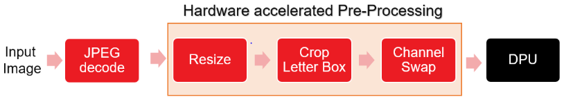

## ADAS detection example with accelerated pre-process
:pushpin: **Note:** This application can be run only on VCK190 platform.

## Table of Contents

- [Introduction](#Introduction)
- [Setting Up and Running on VCK190](#Setting-Up-and-Running-on-VCK190)
    - [Setting Up the Target](#Setting-Up-the-Target-VCK190)
    - [Building and running the application](#Building-and-running-the-application-on-VCK190)
- [Performance](#Performance)    

## Introduction

ADAS (Advanced Driver Assistance Systems) application
using YOLO-v3 network model is an example for object detection.
Accelerating pre-processing for YOLO-v3 is provided and can only run on VCK190 board. In this application, software JPEG decoder is used for loading input image. Three processes are created one for image loading and running pre-processing kernel ,one for running the ML accelerator and one for generating output image. JPEG decoder transfer input image data to pre-processing kernel and the pre-processed data is transferred to the ML accelerator over a queue. ML accelerator output will be transferd over queue to create output image. Below image shows the inference pipeline.

<div align="center">
  
</div>

## Setting Up and Running on VCK190

### Setting Up the Target VCK190

**To improve the user experience, the Vitis AI Runtime packages have been built into the board image. Therefore, user does not need to install Vitis AI
Runtime packages on the board separately.**

* Installing a Board Image.
	* Download the SD card system image files from the following links:  
	[VCK190](https://www.xilinx.com/member/forms/download/design-license-xef.html?filename=xilinx-vck190-dpu-v2020.2-v1.4.0.img.gz)
 
      Please note that Xilinx account sign-in is required to download the above file.

	* Unzip the file and use Etcher software to burn the image file onto the SD card.
	* Insert the SD card with the image into the destination board.
	* Plug in the power and boot the board using the serial port to operate on the system.
	* Set up the IP information of the board using the serial port.
	You can now operate on the board using SSH.
	
* Update the system image files.
```
Download the WAA package
wget https://www.xilinx.com/bin/public/openDownload?filename=waa_versal_sd_card_vai1.4.tar.gz -O waa_versal_sd_card_vai1.4.tar.gz

tar -xzvf waa_versal_sd_card_vai1.4.tar.gz

```

copy the WAA package to the SD card.


:pushpin: **Note:** Only copy the BOOT.BIN and dpu.xclbin from the package to SD Card.

* Download test images	

  For adas_detection example, download the images at https://cocodataset.org/#download and copy the images to `Vitis-AI/demo/Whole-App-Acceleration/adas_detection/data`


* Copy application files to SD card

    ```
	  scp -r Vitis-AI/demo/Whole-App-Acceleration/adas_detection_versal root@IP_OF_BOARD:~/
    ```

* Download and install `yolov3_adas_pruned_0_9` model:
```
wget https://www.xilinx.com/bin/public/openDownload?filename=yolov3_adas_pruned_0_9-vck190-r1.4.0.tar.gz -O yolov3_adas_pruned_0_9-vck190-r1.4.0.tar.gz

tar -xzvf yolov3_adas_pruned_0_9-vck190-r1.4.0.tar.gz

Copy the extracted files to SD card

```


### Building and running the application on VCK190
* Build
    ```
      cd ~/adas_detection
      ./build.sh
      mkdir output #Will be written to the picture after processing
    ```
* Run adas_detection without waa
    ```
    ./adas_detection_versal <model dir>/yolov3_adas_pruned_0_9/yolov3_adas_pruned_0_9.xmodel 0
    ```
* Run adas_detection with waa
    ```
    env XILINX_XRT=/usr ./adas_detection_versal <model dir>/yolov3_adas_pruned_0_9/yolov3_adas_pruned_0_9.xmodel 1
    ```


## Performance
Below table shows the comparison of througput achieved by acclerating the pre-processing pipeline on FPGA. 
For `Adas Detection`, the performance numbers are achieved by running 1K images randomly picked from COCO dataset. 

Network: YOLOv3 Adas Detection
<table style="undefined;table-layout: fixed; width: 534px">
<colgroup>
<col style="width: 119px">
<col style="width: 136px">
<col style="width: 145px">
<col style="width: 134px">
</colgroup>
  <tr>
    <th rowspan="2">FPGA</th>
    <th colspan="2">E2E Throughput (fps)</th>
    <th rowspan="2"><span style="font-weight:bold">Percentage improvement in throughput</span></th>
  </tr>
  <tr>
    <td>with software Pre-processing</td>
    <td>with hardware Pre-processing</td>
  </tr>


  
  <tr>
   <td>VCK190</td>
    <td>13.4</td>
    <td>15.3</td>
        <td>14.17%</td>
  </tr>

  
</table>

**Note that Performance numbers are computed using end-to-end latency and it depends on input image resolution. So performance numbers can vary with different images**   
