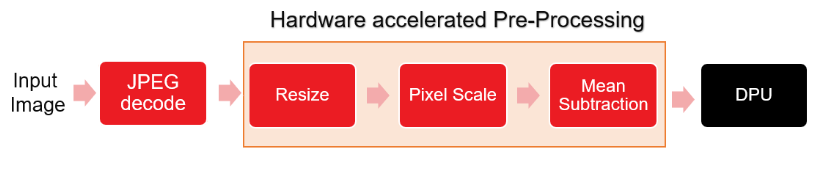

## Resnet-50
:pushpin: **Note:** This application can be run only on ZCU102 and Alveo-U50 platforms.

## Table of Contents

- [Introduction](#Introduction)
- [Setting Up and Running on ZCU102](#Setting-Up-and-Running-on-ZCU102)
    - [Setting Up the Target](#Setting-Up-the-Target-ZCU102)
    - [Running the application](#Running-the-application-on-ZCU102-board)
- [Setting Up and Running on U50](#Setting-Up-and-Running-Alveo-U50)
    - [Setting Up the Target](#Setting-Up-the-Target-Alveo-U50)
    - [Running the application](#Running-the-application-on-Alveo-U50)
- [Performance](#Performance)    

## Introduction
Currently, applications accelerating pre-processing for classification networks (Resnet-50) is provided and  can only run on ZCU102 board (device part  xczu9eg-ffvb1156-2-e) and Alveo U50 card (device part xcu50-fsvh2104-2-e). In this application, software JPEG decoder is used for loading input image. JPEG decoder transfer input image data to pre-processing kernel and the pre-processed data is transferred to the ML accelerator. Below image shows the inference pipeline.


<div align="center">
  
</div>

## Setting Up and Running on ZCU102

### Setting Up the Target ZCU102

**To improve the user experience, the Vitis AI Runtime packages have been built into the board image. Therefore, user does not need to install Vitis AI
Runtime packages on the board separately.**

* Installing a Board Image.
	* Download the SD card system image files from the following links:  
	
      [ZCU102](https://www.xilinx.com/bin/public/openDownload?filename=xilinx-zcu102-dpu-v2020.2-v1.3.0.img.gz)   
	    
      	Note: The version of the board image should be 2020.2 or above.
	* Use Etcher software to burn the image file onto the SD card.
	* Insert the SD card with the image into the destination board.
	* Plug in the power and boot the board using the serial port to operate on the system.
	* Set up the IP information of the board using the serial port.
	You can now operate on the board using SSH.
	
* Update the system image files.
	* Download the [waa_system_zcu102_v1.4.0.tar.gz](https://www.xilinx.com/bin/public/openDownload?filename=waa_system_zcu102_v1.4.0.tar.gz).	

	* Copy the `waa_system_zcu102_v1.4.0.tar.gz` to the board using scp.
		```
		scp waa_system_zcu102_v1.4.0.tar.gz root@IP_OF_BOARD:~/
		```
	* Update the system image files on the target side

		```
		cd ~
		tar -xzvf waa_system_zcu102_v1.4.0.tar.gz
		cp waa_system_zcu102_v1.4.0/sd_card_resnet50/* /mnt/sd-mmcblk0p1/
		cp /mnt/sd-mmcblk0p1/dpu.xclbin /usr/lib/
		ln -s /usr/lib/dpu.xclbin /mnt/dpu.xclbin
		cp waa_system_zcu102_v1.4.0/lib/* /usr/lib/
		reboot
		```

* Download test images

    Download the images at http://image-net.org/download-images and copy 1000 images to `Vitis-AI/demo/Whole-App-Acceleration/resnet50_mt_py/images` 

* Copy application files to SD card

    ```
	scp -r Vitis-AI/demo/Whole-App-Acceleration/resnet50_mt_py root@IP_OF_BOARD:~/
    ```


### Running the application on ZCU102 board
* Run resnet50 without waa
  ```
  cd ~/resnet50_mt_py
  python3 resnet50.py 1 /usr/share/vitis_ai_library/models/resnet50/resnet50.xmodel
  ```
 * Run resnet50 with waa
 	```
  	cd ~/resnet50_mt_py
 	env XILINX_XRT=/usr python3 resnet50_waa.py 1 /usr/share/vitis_ai_library/models/resnet50/resnet50.xmodel
	```  
## Setting Up and Running Alveo U50

### Setting Up the Target Alveo U50
**Note that the docker container needs to be loaded and the below commands need to be run in the docker environment. Docker installation instructions are available [here](../../../README.md#Installation)**

* Follow the steps mentioned [here](../../../setup/alveo/README.md) to setup the target. 

* Download [waa_system_u50_v1.4.0.tar.gz](https://www.xilinx.com/bin/public/openDownload?filename=waa_system_u50_v1.4.0.tar.gz) and update the xclbin file.

	```
	tar -xzvf waa_system_u50_v1.4.0.tar.gz
	sudo cp waa_system_u50_v1.4.0/classification/dpu.xclbin /usr/lib/
	sudo cp waa_system_u50_v1.4.0/classification/hbm_address_assignment.txt /usr/lib/
	sudo cp waa_system_u50_v1.4.0/classification/pp_pipeline.so /usr/lib/
	```
* To download and install `resnet50` model:
	```
	  mkdir -p ${VAI_HOME}/demo/Whole-App-Acceleration/resnet50_mt_py/model
	  cd ${VAI_HOME}/demo/Whole-App-Acceleration/resnet50_mt_py/model
	  wget https://www.xilinx.com/bin/public/openDownload?filename=resnet50-u50-r1.3.0.tar.gz -O resnet50-u50-r1.3.0.tar.gz
	```	
	* Install the model package.


	```
	  tar -xzvf resnet50-u50-r1.3.0.tar.gz
	  sudo mkdir -p /usr/share/vitis_ai_library/models
	  sudo cp resnet50 /usr/share/vitis_ai_library/models -r
	```
* Download test images

    Download the images at http://image-net.org/download-images and copy 1000 images to `${VAI_HOME}/demo/Whole-App-Acceleration/resnet50_mt_py/images` 
	
### Running the application on Alveo U50

 * Run resnet50 without waa
  	```
  	cd ${VAI_HOME}/demo/Whole-App-Acceleration/resnet50_mt_py
  	/usr/bin/python3 resnet50.py 1 /usr/share/vitis_ai_library/models/resnet50/resnet50.xmodel
  	```
 * Run resnet50 with waa
  	```
  	cd ${VAI_HOME}/demo/Whole-App-Acceleration/resnet50_mt_py
  	/usr/bin/python3 resnet50_waa.py 1 /usr/share/vitis_ai_library/models/resnet50/resnet50.xmodel  
  	```

### Performance
Below table shows the comparison of througput achieved by acclerating the pre-processing pipeline on FPGA. 
For `Resnet-50`, the performance numbers are achieved by running 1K images randomly picked from ImageNet dataset. 

Network: Resnet50
<table style="undefined;table-layout: fixed; width: 534px">
<colgroup>
<col style="width: 119px">
<col style="width: 136px">
<col style="width: 145px">
<col style="width: 134px">
</colgroup>
  <tr>
    <th rowspan="2">FPGA</th>
    <th colspan="2">E2E Throughput (fps)</th>
    <th rowspan="2"><span style="font-weight:bold">Percentage improvement in throughput</span></th>
  </tr>
  <tr>
    <td>with software Pre-processing</td>
    <td>with hardware Pre-processing</td>
  </tr>


  
  <tr>
   <td>ZCU102</td>
    <td>26.22</td>
    <td>42.3</td>
        <td>61.3%</td>
  </tr>

  <tr>
   <td>U50</td>
    <td>63.35</td>
    <td>77.24</td>
        <td>21.9%</td>
  </tr>
</table>


**Note that Performance numbers are computed using end-to-end latency and it depends on input image resolution. So performance numbers can vary with different images**  
