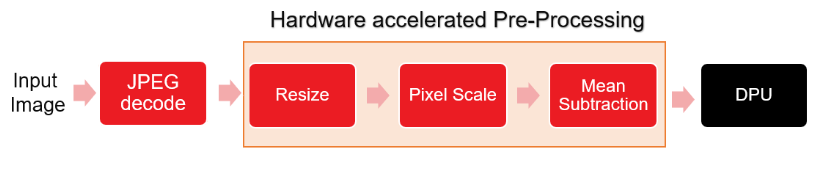

## Pre-process acceleration for classification network (resnet-50) inference demo
:pushpin: **Note:** This application can be run only on vck190 platform.

## Table of Contents

- [Introduction](#Introduction)
- [Setting Up and Running on VCK190](#Setting-Up-and-Running-on-VCK190)
    - [Setting Up the Target](#Setting-Up-the-Target-VCK190)
    - [Building and running the application](#Building-and-running-the-application-on-VCK190)
- [Performance](#Performance)    

## Introduction
Currently, applications accelerating pre-processing for classification networks (Resnet-50) is provided and can only run on VCK190 platform. In this application, software JPEG decoder is used for loading input image. JPEG decoder transfer input image data to pre-processing kernel and the pre-processed data is transferred to the ML accelerator. Below image shows the inference pipeline.

<div align="center">
  
</div>

## Setting Up and Running on VCK190

### Setting Up the Target VCK190


* Download the VCK190 SD card image file using the below link.

	[VCK190](https://www.xilinx.com/member/forms/download/design-license-xef.html?filename=xilinx-vck190-dpu-v2020.2-v1.4.0.img.gz)
 
  Please note that Xilinx account sign-in is required to download the above file.
* Unzip the file and flash the .img file to SD card using tools like Etcher.

* Download the WAA package

```
wget https://www.xilinx.com/bin/public/openDownload?filename=waa_versal_sd_card_vai1.4.tar.gz -O waa_versal_sd_card_vai1.4.tar.gz

tar -xzvf waa_versal_sd_card_vai1.4.tar.gz
```
* copy the BOOT.BIN and dpu.xclbin from the WAA package to the SD card.

:pushpin: **Note:** Only copy the BOOT.BIN and dpu.xclbin from the package to SD Card.

* Download and install `resnet_v1_50_tf` model:
```
wget https://www.xilinx.com/bin/public/openDownload?filename=resnet_v1_50_tf-vck190-r1.4.0.tar.gz -O resnet_v1_50_tf-vck190-r1.4.0.tar.gz

tar -xzvf resnet_v1_50_tf-vck190-r1.4.0.tar.gz
```
Copy the extracted files to SD card


* Download test images

    Download the images at http://image-net.org/download-images and copy images to `images` directory in SD card

    

### Building and running the application on VCK190
* Build
	```
	cd /media/sd-mmcblk0p1/resnet50_versal
	bash -x build.sh
	```
* Run classification without waa
	```
	./app_resnet_versal_waa <model dir>/resnet_v1_50_tf.xmodel 0
	```
* Run classification with waa
	```
	./app_resnet_versal_waa <model dir>/resnet_v1_50_tf.xmodel 1
	```

## Performance
Below table shows the comparison of performance achieved by accelerating the pre-processing pipeline on FPGA.
For `Resnet-50`, the performance numbers are achieved by running 1K images randomly picked from ImageNet dataset.


<table style="undefined;table-layout: fixed; width: 534px">
<colgroup>
<col style="width: 119px">
<col style="width: 136px">
<col style="width: 145px">
<col style="width: 134px">
</colgroup>
  <tr>
    <th rowspan="2">Network</th>
    <th colspan="2">Performance (FPS)</th>
    <th rowspan="2"><span style="font-weight:bold">Percentage improvement</span></th>
  </tr>
  <tr>
    <td>with software Pre-processing</td>
    <td>with hardware Pre-processing</td>
  </tr>

  <tr>
    <td>Resnet-50</td>
    <td>176.49</td>
    <td>255.16</td>
    <td>44.5%</td>
  </tr>

</table>

:pushpin: **Note:** The above performance numbers doesn't consider the image read time.

**Note that Performance numbers are computed using end-to-end latency and it depends on input image resolution. So performance numbers can vary with different images**  