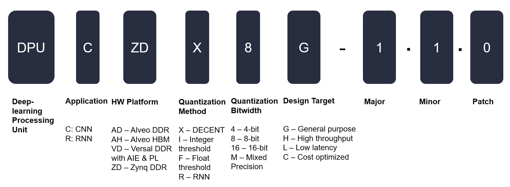

## DPU Naming

Vitis AI 1.2 introduces a new DPU naming scheme. This new naming scheme will help users select the right DPU for their application or platform, by highlighting each DPUs characteristics.

The old DPUv1/v2/v3 naming will be deprecated.  

Please refer to the guide below to understand the availble DPU options. 

  

 
We may have new DPUs available in near future. The fields of the DPU naming can be expanded and updated accordingly.
 

### DPU Naming Example

To better understand how to map the old DPU names into this naming, please refer to the following table, 

 

  

 
