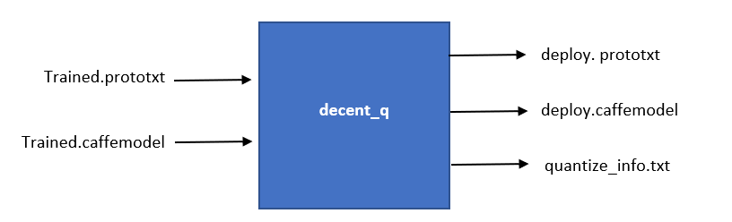

# Running a quantizer in MLsuite Docker
VAI_Q_CAFFE is a tool to convert the 32-bit floating-point weights and activations to 8-bit integer (INT8). The fixed-point network model requires less memory bandwidth, thus providing faster speed and higher power efficiency than the floating-point model. This tool supports common layers in neural networks, such as convolution, pooling, fully-connected, and batchnorm among others. There is no need to retrain the network after the quantization process, instead only a small set of images is needed to analyze the distribution of activation values for calibration. The quantization time ranges from a few seconds to several minutes, depending on the size of the neural network. VAI_Q_CAFFE is based on Caffe 1.0. The block diagram of VAI_Q_CAFFE as shown in figure.

<div align="center">
<br><br>
</div>

## Steps for running VAI_Q_CAFFE

### Inputs<br /> 
To run vai_q_caffe, following parameters need to be provided<br /> 

1.	Caffe floating-point network model prototxt file.
2.	Pre-trained Caffe floating-point network model caffemodel file.
3.	Calibration data set (Optional): The calibration set is usually a subset of the           training set or actual application images (at least 100 images). Make sure to set the     source and root_folder in image_data_param to the actual calibration image list and       image folder path. The sample caffe layer for quantizaion as shown below
``` sh
name: "ResNet-50"
layer {
  name: "data"
  type: "ImageData"
  top: "data"
  top: "label"
  include {
    phase: TRAIN
  }
  transform_param {
    mirror: false
    mean_value: 104
    mean_value: 117
    mean_value: 123
  }
   image_data_param {
    source: "./data/imagenet_256/calibration.txt"
    root_folder: "./data/imagenet_256/calibration_images/"
    batch_size: 8
    shuffle: false
    new_width: 224
    new_height: 224
  }
}

```

>**:pushpin: NOTE:** Only the 3-mean-value format is supported by DECENT. Convert to the 3-mean-value format as required.

### Running VAI_Q_CAFFE <br /> 
Run the following command to generate a fixed-point model
```
vai_q_caffe quantize -model float.prototxt -weights float.caffemodel [other options]

```
The 3 commonly used ‘other options’ are shown below:<br /> 
  -	weights_bit: Bit width for quantized weight and bias (default is 8). Possible values: 8/16.<br /> 
  -	data_bit: Bit width for quantized activation (default is 8). Possible values: 8/16.<br /> 
  -	method (optional): Quantization method. Possible values: 0 stands for OVER_FLOW and  1 stands for DIFF_S (default is 1)<br /> 
  -	auto_test (optional): Run flag runs test after calibration, test dataset is required.<br /> 

For more information about usage of vai_q_caffe, run ‘vai_q_caffe –help’ command.

### Running DECENT_Q with python <br /> 
```
source $VAI_ALVEO_ROOT/overlaybins/setup.sh alveo-u200
# Bring in Quantizer
from decent import CaffeFrontend as xfdnnQuantizer
def Quantize(prototxt, caffemodel, calib_iter=1, test_iter=1):
    quantizer = xfdnnQuantizer(
      model=prototxt,
      weights=caffemodel,
      calib_iter=calib_iter,
      test_iter=test_iter,
      auto_test=True,
    )
    quantizer.quantize()  
```
```
Quantize(prototxt='float.prototxt', caffemodel='float.caffemdodel')

```

### Outputs
After successful execution of the above command, five files will be generated (under the default directory "./quantize_results/"). Out of five generated files, only three files are required by MLsuite compiler.<br /> 

  - fixed-point model network (deploy.prototxt is used by MLsuite compiler)<br /> 
  -	fixed-point weights (deploy.caffemodel is used by MLsuite compiler)<br /> 
  -	quantize_info.txt (quantization information used by MLsuite compiler)<br /> 
  -	quantize_train_test.prototxt (Required for retraining, can be ignored)<br /> 
  -	quantize_train_test.caffemodel (Required for retraining, can be ignored)<br /> 

## Checking Accuracy of Quantized Network<br /> 
There are two ways to get the quantize accuracy. <br /> 

1.	While running vai_q_caffe, user can pass “auto_test” option to enable accuracy calculation.<br /> 
2.	After running vai_q_caffe, user can use following command to calculate accuracy of the quantized model. <br /> 

```
vai_q_caffe test -model quantize_results/quantize_train_test.prototxt -weights quantize_results/quantize_train_test.caffemodel  -test_iter 100
```


