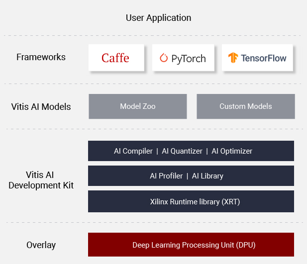

<table class="sphinxhide">
 <tr>
   <td align="center"><h1>Vitis AI</h1>
   </td>
 </tr>
</table>

Xilinx&reg; Vitis&trade; AI is a development stack for AI inference on Xilinx
hardware platforms, including both edge devices and Alveo cards.

It consists of optimized IP, tools, libraries, models, and example
designs. It is designed with high efficiency and ease of use in mind,
unleashing the full potential of AI acceleration on Xilinx FPGA and
ACAP.

Vitis AI is composed of the following key components:

-   AI Model Zoo - A comprehensive set of pre-optimized models that are
    ready to deploy on Xilinx devices.

-   AI Optimizer - An optional model optimizer that can prune a model by
    up to 90%. It is separately available with commercial licenses.

-   AI Quantizer - A powerful quantizer that supports model
    quantization, calibration, and fine tuning.

-   AI Compiler - Compiles the quantized model to a high-efficient
    instruction set and data flow.

-   AI Profiler - Perform an in-depth analysis of the efficiency and
    utilization of AI inference implementation.

-   AI Library - Offers high-level yet optimized C++ APIs for AI
    applications from edge to cloud.

-   DPU - Efficient and scalable IP cores can be customized to meet the
    needs for many different applications

For more details on the different DPUs available, see [DPU Nomenclature](https://github.com/Xilinx/Vitis-AI/blob/master/docs/images/dpu_naming.md).

## References
- [Vitis AI Overview](https://www.xilinx.com/products/design-tools/vitis/vitis-ai.html)
- [Vitis AI User Guide](https://www.xilinx.com/html_docs/vitis_ai/2_0/index.html)
- [Vitis AI Model Zoo with Performance & Accuracy Data](../models/AI-Model-Zoo)
- [Vitis AI Tutorials](https://github.com/Xilinx/Vitis-Tutorials/tree/master/Machine_Learning)
- [Developer Articles](https://developer.xilinx.com/en/get-started/ai.html)

## [System Requirements](learn/system_requirements.md)

## Questions and Support
- [FAQ](quick-start/faq.md)
- [Vitis AI Forum](https://forums.xilinx.com/t5/AI-and-Vitis-AI/bd-p/AI)
- [Third Party Source](reference/Thirdpartysource.md)

<!-- Legacy links for reference -->
[models]: docs/models.md
[Amazon AWS EC2 F1]: https://aws.amazon.com/marketplace/pp/B077FM2JNS
[Xilinx Virtex UltraScale+ FPGA VCU1525 Acceleration Development Kit]: https://www.xilinx.com/products/boards-and-kits/vcu1525-a.html
[AWS F1 Application Execution on Xilinx Virtex UltraScale Devices]: https://github.com/aws/aws-fpga/blob/master/SDAccel/README.md
[Release Notes]: release-notes.md
[UG1023]: https://www.xilinx.com/support/documentation/sw_manuals/xilinx2017_4/ug1023-sdaccel-user-guide.pdf
[FAQ]: quick-start/faq.md
[Webinar on Xilinx FPGA Accelerated Inference]: https://event.on24.com/wcc/r/1625401/2D3B69878E21E0A3DA63B4CDB5531C23?partnerref=Mlsuite
[Vitis AI Forum]: https://forums.xilinx.com/t5/AI-and-Vitis-AI/bd-p/AI
[Models]: https://www.xilinx.com/products/boards-and-kits/alveo/applications/xilinx-machine-learning-suite.html#gettingStartedCloud
[whitepaper here]: https://www.xilinx.com/support/documentation/white_papers/wp504-accel-dnns.pdf
