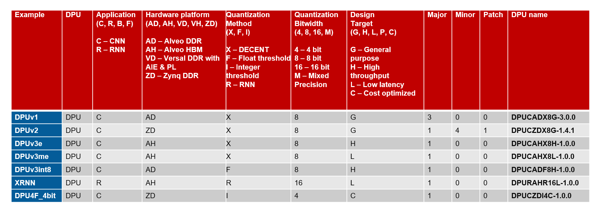

<table class="sphinxhide">
 <tr>
    <td align="center"><h1>Vitis AI</h1>
   </td>
 </tr>
</table>

# DPU Nomenclature

There are a variety of different DPUs available for different tasks and Xilinx platforms.  The below decoder is useful to extract the features, characteristics and target hardware platforms from a given DPU name.

  

 

## Historic DPU Nomenclature

As of the Vitis 1.2 release, the historic DPUv1/v2/v3 nomenclature was deprecated.  To better understand how these historic DPU names map into this current nomenclature, refer to the following table.

 

  

 
