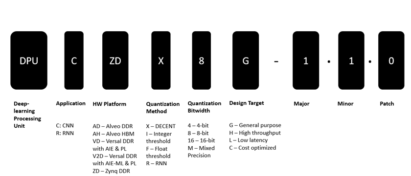

DPU Nomenclature
================

There are a variety of different DPUs available for different tasks and Xilinx® platforms. The following decoder helps extract the features, characteristics, and target hardware platforms from a given DPU name.

Historic DPU Nomenclature
-------------------------

As of the Vitis™ 1.2 release, the historic DPUv1/v2/v3 nomenclature is deprecated. To better understand how these historic DPU names map into the current nomenclature, refer to the following table:

.. image:: ../reference/images/dpu_nomenclature_legacy_mapping.PNG
