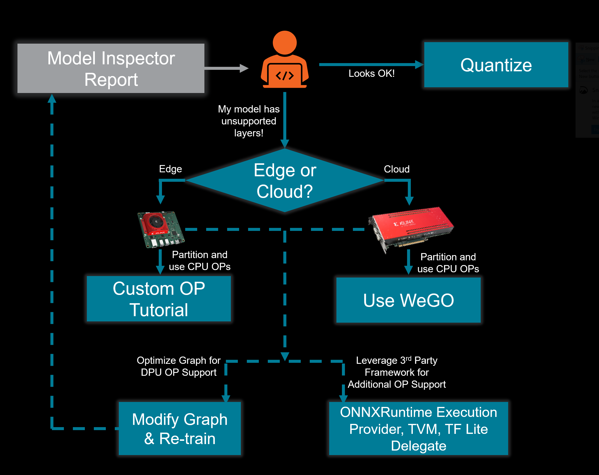
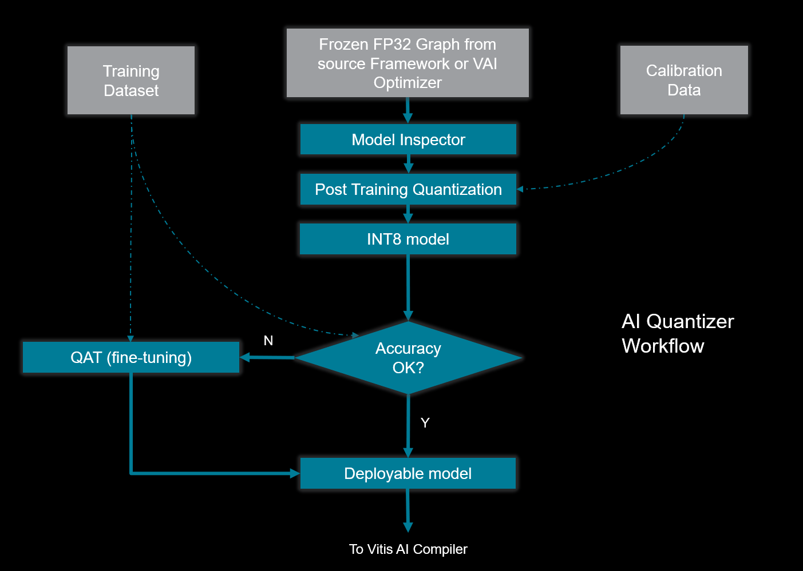
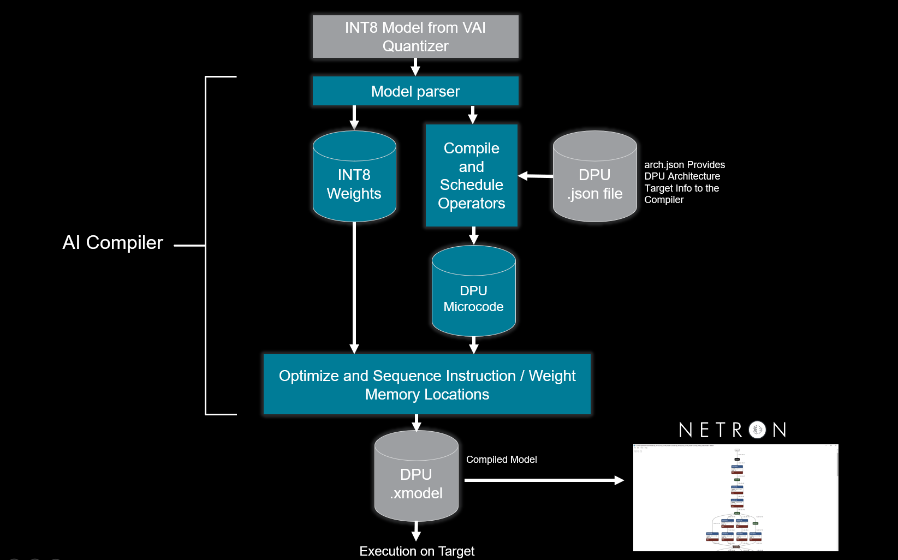

Developing a Model
==================

Model Inspector
---------------

.. important:: The early release of Model Inspector included with Vitis |trade| AI 3.0 is “beta” quality. Submit Github issues if you encounter problems with this initial release.

The Vitis AI quantizer and compiler are designed to parse and compile operators within a frozen FP32 graph for acceleration in hardware. However, novel neural network architectures, operators, and activation types are constantly being developed and optimized for prediction accuracy and performance. In this context, it is important to understand that while Xilinx |reg| strives to provide support for a wide variety of neural network architectures and provide these graphs for user reference, only some operators are supported for acceleration on the DPU. Furthermore, specific layer ordering requirements enable Vitis AI model deployment.

In the early phases of development, it is highly recommended that the developer leverage the Vitis AI Model Inspector as an initial sanity check to confirm that the operators and sequence of operators in the graph is compatible with Vitis AI.

   Model Inspector Decision Tree

For more information on the Model Inspector, see the following resources:

-  When you are ready to get started with the Vitis AI Model Inspector, refer to the examples provided for both `PyTorch <https://github.com/Xilinx/Vitis-AI/tree/v3.0/examples/vai_quantizer/pytorch/inspector_tutorial.ipynb>`__ and `TensorFlow <https://github.com/Xilinx/Vitis-AI/tree/v3.0/src/vai_quantizer/vai_q_tensorflow2.x/README.md#inspecting-vai_q_tensorflow2>`__.

-  If your graph uses operators that are not natively supported by your specific DPU target, see the :ref:`Operator Support <operator-support>` section.

.. _operator-support:

Operator Support
~~~~~~~~~~~~~~~~

Several paths are available to leverage an operator not supported for acceleration on the DPU, including C/C++ code or custom HLS or RTL kernels. However, these DIY paths pose specific challenges related to the partitioning of a trained model. For most developers, a workflow that supports automated partitioning is preferred.

.. important:: A high-level list of the supported operators is provided in the :doc:`reference/release_documentation`. Both the Vitis AI quantizer and compiler implement layer fusion using a pattern-match algorithm. The net result is the ordering of layers in the graph is as important as the operators used. For instance, if you implement a layer ordering scheme such as CONV -> ReLU -> Batchnorm, the outcome is quite different from `CONV -> Batchnorm -> ReLU <https://support.xilinx.com/s/question/0D52E00006hpW23SAE/resolving-debugging-shiftcut0-tensorflow?language=en_US>`__. In this context, it is always an excellent idea to review the structure of similar Xilinx :doc:`Model Zoo<workflow-model-zoo>` models to understand how to design your graph for optimum results.

For Zynq |reg| UltraScale+ |trade| MPSoC and Versal ACAP |trade| embedded applications, Xilinx supports an official flow which you can use to add support for these custom operators. More details can be found `here <https://github.com/Xilinx/Vitis-AI/tree/v3.0/examples/custom_operator>`__.

For Alveo |trade| cards, the `Whole Graph Optimizer <https://github.com/Xilinx/Vitis-AI/tree/v3.0/examples/wego>`__ (WeGO) automatically performs subgraph partitioning for models quantized by Vitis AI quantizer, and applies optimizations and acceleration for the DPU compatible subgraphs. The remaining partitions of the graph are dispatched to the native framework for CPU execution.

Starting with the release of Vitis AI 3.0, we have enhanced Vitis AI support for the ONNX Runtime.  The Vitis AI Quantizer can now be leveraged to export a quantized ONNX model to the runtime where subgraphs suitable for deployment on the DPU are compiled.  Remaining subgraphs are then deployed by ONNX Runtime, leveraging the Xilinx Versal |trade| and Zynq |reg| UltraScale+ |trade| MPSoC APUs, or the AMD64 (or x64) host processor (Alveo |trade| targets) to deploy these subgraphs.  The underlying software infrastructure is named VOE or “**V** itis AI **O** NNX Runtime **E** ngine”.  Users should refer to the section "Programming with VOE" in :doc:`UG1414 <../docs/reference/release_documentation>` for additional information on this powerful workflow.

.. figure:: reference/images/VAI_3rd_party_ONNXRuntime_Edge.PNG
   :width: 1300
   
   Vitis-AI Integration With ONNX Runtime (Edge)
   
In addition, the TVM compiler, TF Lite Delegate, and ONNX Runtime Execution Provider (Alveo only). :doc:`../docs/workflow-third-party` may also be used to enable support for operations that cannot be accelerated by the DPU. These third party solutions are of “beta” quality and offer more limited support than the standard Vitis AI workflow.

   
.. _model_optimization:

Model Optimization
------------------

The Vitis AI Optimizer exploits the notion of sparsity to reduce the overall computational complexity for inference. Many deep neural network topologies employ significant levels of redundancy. This is particularly true when the network backbone is optimized for prediction accuracy with training datasets supporting many classes. In many cases, this redundancy can be reduced by “pruning” some of the operations out of the graph. There are two forms of pruning - channel (kernel) pruning and sparse pruning.

.. important:: The Vitis AI Optimizer is an optional tool that can significantly enhance performance in many applications. However, if your application is not hitting the wall on performance or logic density, or if your model is already well optimized for your dataset and application, you will likely not require the AI Optimizer.

.. note::

   Using the Vitis AI Optimizer requires the developer to purchase a license for the tool. You can request a quotation for either the node-locked (part# EF-AI-OPTIMIZER-NL) or floating license (part# EF-AI-OPTIMIZER-FL) by contacting your local `Xilinx Distributor or Sales Office <https://www.xilinx.com/about/contact.html>`__.

   This is a perpetual license with no annual maintenance or renewal costs.

   If you wish to evaluate the AI Optimizer before considering a purchase, you can request access by emailing xilinx_ai_optimizer@amd.com or request access to the `AI Optimizer Lounge <https://www.xilinx.com/member/ai_optimizer.html>`__.

The Vitis AI Optimizer leverages the native framework in which the model was trained, and the input and output of the pruning process are a frozen FP32 graph. At a high level, the workflow of the AI Optimizer consists of several steps. The optimizer first performs a sensitivity analysis designed to determine the degree to which each of the convolution kernels (channels) at each layer impacts the predictions of the network. Following this, the kernel weights for channels to be pruned are zeroed, permitting an accurate evaluation of the “proposed” pruned model. The remaining weights are then optimized (fine-tuned) for several training epochs to recover accuracy. Multiple iterations of pruning are typically employed, and after each iteration, the state can be captured, permitting the developer to backtrack by one or more pruning iterations. This ability enables the developer to prune for multiple iterations and then select the iteration with the preferred result. As necessary, pruning can be restarted from a previous iteration with different hyperparameters to address accuracy “cliffs” that may present at a specific iteration.

The final phase of pruning, the transform step, removes the channels selected for pruning (previously zeroed weights), resulting in a reduction of the number of channels at each pruned layer in the final computational graph. For instance, a layer that previously required the computation of 128 channels (128 convolution kernels) may now only require the computation of output activations for 87 channels (i.e., 41 channels were pruned). Following the transform step, the model is now in a form that can be ingested by the Vitis AI Quantizer and deployed on the target.

The following diagram illustrates the high-level pruning workflow:

.. figure:: reference/images/optimizer_workflow.PNG
   :width: 1300

   Vitis AI Optimizer Pruning Workflow

Channel Pruning
~~~~~~~~~~~~~~~

Current Vitis AI DPUs can take advantage of channel pruning to significantly reduce the computational cost for inference, often with little or no prediction accuracy loss. In contrast to sparse pruning, which requires that the computation of specific activations within a channel or layer be “skipped” at inference time, channel pruning requires no special hardware to address the problem of these “skipped” computations.

The Vitis AI Optimizer is an optional component of the Vitis AI flow. In general it is possible to reduce the overall computational cost by a factor of more than 2x, and in some cases by a factor of 10x, with minimal losses in prediction accuracy. In many cases, there is actually an improvement in prediction accuracy during the first few iterations of pruning. While the fine-tuning step is in part responsible for this improvement, it is not the only explanation. Such accuracy improvements will not come as a surprise to developers who are familiar with the concept of overfitting, a phenomena that can occur when a large, deep, network is trained on a dataset that has a limited number of classes.

Many pre-trained networks available in Xilinx :doc:`Model Zoo <workflow-model-zoo>` are pruned using this technique.

Neural Architecture Search
~~~~~~~~~~~~~~~~~~~~~~~~~~

In addition to channel pruning, a technique coined “Once-for-All” training is supported in Vitis AI. The concept of Neural Architecture Search (NAS) is that for any given inference task and dataset, there exist in the potential design space a number of network architectures that are both efficient and have high prediction scores. A developer often starts with a standard backbone familiar to them, such as ResNet50, and trains that network for the best accuracy. However, there are many cases when a network topology with a much lower computational cost may have offered similar or better performance. For the developer, the effort to train multiple networks with the same dataset (sometimes going so far as to make this a training hyperparameter) is not an efficient method to select the best network topology. “Once-for-All” addresses this challenge by employing a single training pass and novel selection techniques.

NAS and AI Optimizer Related Resources
~~~~~~~~~~~~~~~~~~~~~~~~~~~~~~~~~~~~~~

- Sample scripts for channel pruning can be found in `examples <https://github.com/Xilinx/Vitis-AI/tree/v3.0/examples/vai_optimizer>`__

- For additional details on channel pruning leveraging the Vitis AI Optimizer, refer to `Vitis AI Optimizer User Guide <https://docs.xilinx.com/access/sources/dita/map?isLatest=true&ft:locale=en-US&url=ug1333-ai-optimizer>`__.

- For information on Xilinx NAS / Once-for-All, refer to the Once-for-All (OFA) section in the `Vitis AI Optimizer User Guide <https://docs.xilinx.com/access/sources/dita/map?isLatest=true&ft:locale=en-US&url=ug1333-ai-optimizer>`__ .

- Once-for-All examples can be found `here <https://github.com/Xilinx/Vitis-AI/tree/v3.0/examples/ofa>`__.

An excellent overview of the advantages of OFA is available on the `Xilinx Developer website <https://www.xilinx.com/developer/articles/advantages-of-using-ofa.html>`__.

Model Quantization
------------------

Deployment of neural networks on Xilinx DPUs is made more efficient through the use of integer quantization to reduce the energy cost,
memory footprint, and data path bandwidth required for inference.

Xilinx general-purpose CNN-focused DPUs leverage INT8 (8-bit integer) quantization of a trained network. In many real-world datasets, the distribution of weights and activations at a given layer in the network typically spans a much narrower range than can be represented by a 32-bit floating point number. It is thus possible to accurately represent the distribution of weights and activations at a given layer as integer values by simply applying a scaling factor. The impact on prediction accuracy of INT8 quantization is typically low, often less than 1%. This is true in many applications in which the input data consists of images and video, point-cloud data, and input data from various sampled-data systems, including specific audio and RF applications.

.. _quantization-process:

Quantization Process
~~~~~~~~~~~~~~~~~~~~

The Vitis AI Quantizer, integrated as a component of either TensorFlow or PyTorch, performs a calibration step in which a subset of the original training data (typically 100-1000 samples, no labels required) is forward propagated through the network to analyze the distribution of the activations at each layer. The weights and activations are then quantized as 8-bit integer values. This process is referred to as Post-Training Quantization. Following quantization, the prediction accuracy of the network is re-tested using data from the validation set. If the accuracy is acceptable, the quantization process is complete.

With certain network topologies, the developer may experience excessive accuracy loss. In these cases, a technique referred to as QAT (Quantization Aware Training) can be used with the source training data to execute several back propagation passes to optimize (fine-tune) the quantized weights.

   Vitis AI Quantizer Workflow

The Vitis AI Quantizer is a component of the Vitis AI toolchain, installed in the VAI Docker, and is also provided as
`open-source <https://github.com/Xilinx/Vitis-AI/tree/v3.0/src/vai_quantizer>`__.

Quantization Related Resources
""""""""""""""""""""""""""""""

- For additional details on the Vitis AI Quantizer, refer to Chapter 3 "Quantizing the Model" in the `Vitis AI User Guide <https://docs.xilinx.com/access/sources/dita/map?isLatest=true&ft:locale=en-US&url=ug1414-vitis-ai>`__.

- TensorFlow 2.x examples are available as follows:
   - `TF2 Post-Training Quantization <https://github.com/Xilinx/Vitis-AI/tree/v3.0/src/vai_quantizer/vai_q_tensorflow2.x/tensorflow_model_optimization/g3doc/guide/quantization/post_training.md>`__
   - `TF2 Quantization Aware Training <https://github.com/Xilinx/Vitis-AI/tree/v3.0/src/vai_quantizer/vai_q_tensorflow2.x/tensorflow_model_optimization/g3doc/guide/quantization/training.md>`__

- PyTorch examples are available as follows:
   - `PT Post-Training Quantization <https://github.com/Xilinx/Vitis-AI/tree/v3.0/src/vai_quantizer/vai_q_pytorch/example/resnet18_quant.py>`__
   - `PT Quantization Aware Training <https://github.com/Xilinx/Vitis-AI/tree/v3.0/src/vai_quantizer/vai_q_pytorch/example/resnet18_qat.py>`__

Model Compilation
-----------------

Once the model has been quantized, the Vitis AI Compiler is used to construct an internal computation graph as an intermediate representation (IR). This internal graph consists of independent control and data flow representations. The compiler then performs multiple optimizations; for example, batch normalization operations are fused with convolution when the convolution operator precedes the normalization operator. As the DPU supports multiple dimensions of parallelism, efficient instruction scheduling is key to exploiting the inherent parallelism and potential for data reuse in the graph. The Vitis AI Compiler addresses such optimizations.

The intermediate representation leveraged by Vitis AI is “XIR” (Xilinx Intermediate Representation). The XIR-based compiler takes the quantized TensorFlow or PyTorch model as input. First, the compiler transforms the input model into the XIR format. Most of the variations between different frameworks are eliminated at this stage. The compiler then applies optimizations to the graph and, as necessary, will partition it into several subgraphs based on whether the subgraph operators can be executed on the DPU. Architecture-aware optimizations are applied for each subgraph. For the DPU subgraph, the compiler generates the instruction stream. Finally, the optimized graph is serialized into a compiled .xmodel file.

The compilation process leverages an additional input as a DPU arch.json file. This file communicates the target architecture to the compiler, hence, the capabilities of the specific DPU for which the graph will be compiled. The compiled model will not run on the target if the correct ``arch.json`` file is not used. Runtime errors will occur if the model is not compiled for the correct DPU architecture. The implication is that models compiled for a specific target DPU must be recompiled if they are to be deployed on a different DPU architecture.

Once you have compiled the .xmodel file, you can leverage `Netron <https://github.com/lutzroeder/netron>`__ to review the final graph structure.

.. note:: As part of the compilation process, the weights are formatted as INT8, concatenated, and shuffled for efficient execution. Thus, it is not possible to review the weights post-compilation.

The following diagram illustrates a high-level overview of the Vitis AI Compiler workflow:

   Vitis AI Compiler Workflow

The Vitis AI Compiler is a component of the Vitis AI toolchain, installed in the VAI Docker. The source code for the compiler is not provided.

Compiler Related Resources
~~~~~~~~~~~~~~~~~~~~~~~~~~

- For more information on Vitis AI Compiler and XIR refer to Chapter 4 in the `Vitis AI User Guide <https://docs.xilinx.com/access/sources/dita/map?isLatest=true&ft:locale=en-US&url=ug1414-vitis-ai>`__.
- PyXIR, which supports TVM and ONNXRuntime integration is available as `open source <https://github.com/Xilinx/pyxir>`__.
- XIR source code is released as a `component of VART <https://github.com/Xilinx/Vitis-AI/tree/v3.0/src/vai_runtime/xir>`__.

.. |trade|  unicode:: U+02122 .. TRADEMARK SIGN
   :ltrim:
.. |reg|    unicode:: U+000AE .. REGISTERED TRADEMARK SIGN
   :ltrim:

