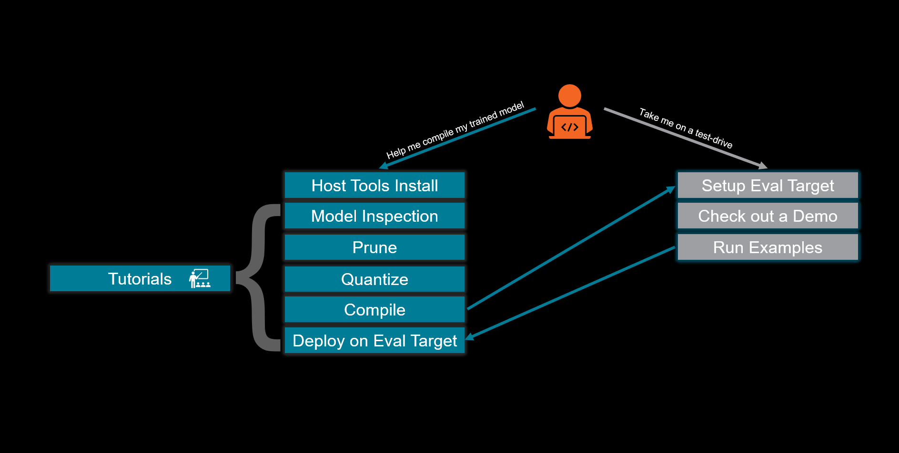
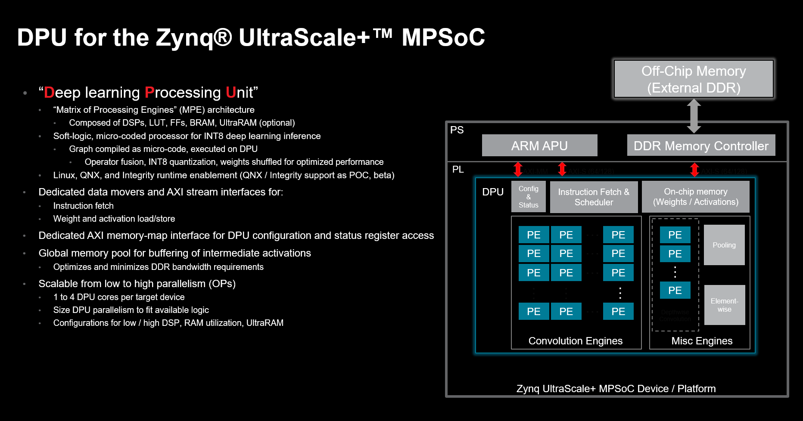
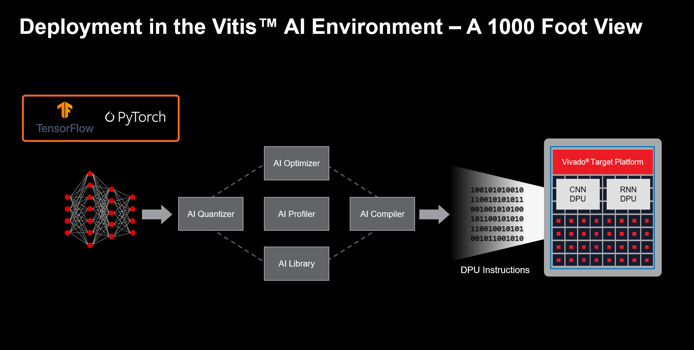

Vitis AI - A Brief Introduction
===============================

The page intends to briefly introduce each component of the Vitis |trade| AI workflow and provide a unified landing page that will assist developers in navigating to key resources for each stage in the workflow.

.. tip:: Review this entire Vitis AI HTML documentation as a first step on your journey with Vitis AI. On these pages, you will find vital information that will help to augment the formal user and product guides.

Documentation
-------------

Vitis AI documentation has formal product and user guides, task-specific resources, and examples. Additional task-specific resources and examples are encapsulated in the various sections of this documentation repository. The formal documentation is listed in  :doc:`../docs/reference/release_documentation`.

New Users
-------------------------

So, you are a new user wondering where to start. In general, there are two primary starting points. Most users will want to start by installing the toolchain or doing a "test drive." Xilinx recommends that all users start with a "test drive" and then move on to the installation of the tools. The two workflows are as follows:

   Vitis AI High-Level New User Workflow

What is a DPU?
--------------

Xilinx uses the acronym D-P-U to identify soft accelerators that target deep-learning inference. These “**D** eep Learning **P** rocessing **U** nits” are a vital component of the Vitis AI solution. This (perhaps overloaded) term can refer to one of several potential accelerator architectures covering multiple network topologies.

A DPU comprises elements available in the Xilinx programmable logic fabric, such as DSP, BlockRAM, UltraRAM, LUTs, and Flip-Flops, or may be developed as a set of microcoded functions that are deployed on the Xilinx AI Engine, or “AI Engine” architecture. Furthermore, in the case of some applications, the DPU is likely to be comprised of programmable logic and AI Engine array resources.

An example of the DPUCZ, targeting Zynq |reg| Ultrascale+ |trade| devices is displayed in the following image:

   Features and Architecture of the Zynq Ultrascale+ DPUCZ

Vitis AI provides the DPU IP and the required tools to deploy both standard and custom neural networks on Xilinx targets:

   Vitis AI 1000 Foot View

Vitis AI DPUs are general-purpose AI inference accelerators. A single DPU instance in your design can enable you to deploy multiple CNNs simultaneously and process multiple streams simultaneously. The Processing depends on the DPU having sufficient parallelism to support the combination of the networks and the number of streams. Multiple DPU instances can be instantiated per device. The DPU can be scaled in size to accommodate the requirements of the user.

The Vitis AI DPU architecture is called a "Matrix of (Heterogeneous) Processing Engines."  While on the surface, Vitis AI DPU architectures have some visual similarity to a systolic array; the similarity ends there. DPU is a micro-coded processor with its Instruction Set Architecture. Each DPU architecture has its own instruction set, and the Vitis AI Compiler compiles an executable ``.Xmodel`` to deploy for each network. The DPU executes the compiled instructions in the ``.Xmodel``. The Vitis AI Runtime addresses the underlying tasks of scheduling the inference of multiple networks, multiple streams, and even multiple DPU instances. The mix of processing engines in the DPU is heterogeneous, with the DPU having different engines specialized for different tasks. For instance, CONV2D operators are accelerated in a purpose-built PE, while another process depthwise convolutions.

One advantage of this architecture is that there is no need to load a new bitstream or build a new hardware platform while changing the network.  This is an important differentiator from Data Flow accelerator architectures that are purpose-built for a single network.  That said, both the Matrix of Processing Engines and Data Flow architectures have a place in Xilinx designs.  If you need a highly optimized, specialized Data Flow accelerator for inference, refer to the `FINN & Brevitas  <https://xilinx.github.io/finn/>`__ solutions.  Data Flow architectures based on FINN can support inference at line rates for high-speed communications and extremely high sample rates for inference in the RF domain.  Neither of these two applications is a great fit for Vitis AI.  The reality is that both of these flows are complementary, and support for both can play an essential role in customer product differentiation and future-proofing.

Test-Drive Vitis AI on a Supported Platform
--------------------------------------------

In the early stages of evaluation, it is recommended that developers obtain and leverage a supported Vitis AI target platform. Several Xilinx evaluation platforms are directly supported with pre-built SD card images that enable the developer to evaluate the Vitis AI workflow. Because these images are ready-to-use, there is no immediate need for
the developer to master the integration of the DPU IP. This path provides an excellent starting point for software or data science-centric developers.

To get started, you must know which platform you plan to target. New users should consult with a local FAE or ML Specialist, review the DPU product guides, review the target platform documentation, and finally, review the :doc:`../docs/workflow-model-zoo` performance metrics.

Supported Evaluation Targets
----------------------------

.. list-table::
   :widths: 30 70
   :header-rows: 1

   * - Product
     - Supported Devices

   * - Versal Embedded
     - `VCK190 <https://www.xilinx.com/vck190>`__ / `VCK5000 <https://www.xilinx.com/vck5000>`__

   * - Versal AI Edge
     - `VEK280 <https://www.xilinx.com/member/vitis-ai-vek280.html>`__ 

   * - Zynq Ultrascale+ Embedded
     - `ZCU102 <https://www.xilinx.com/zcu102>`__ / `ZCU104 <https://www.xilinx.com/zcu104>`__ / `Kria K26 SOM <https://www.xilinx.com/kria>`__

   * - Alveo Data Center Acceleration Cards
     - `V70 <https://www.xilinx.com/member/v70.html#vitis_ai>`__

Vitis AI support for the `U200 16nm DDR <https://www.xilinx.com/U200>`__, `U250 16 nm DDR <https://www.xilinx.com/U250>`__, `U280 16 nm HBM <https://www.xilinx.com/U280>`__, `U55C 16 nm HBM <https://www.xilinx.com/U55C>`__, `U50 16 nm HBM <https://www.xilinx.com/U50>`__, and `U50LV 16 nm HBM <https://www.xilinx.com/U50LV>`__ has been discontinued.   `Please leverage a previous release for these targets or contact your local sales team for additional guidance <https://xilinx.github.io/Vitis-AI/docs/board_setup/board_setup_alveo.html>`__.  

When you are ready to start with one of these pre-built platforms, you should refer to :doc:`../docs/board_setup/board_setup`. These instructions guide users to download a pre-built board image to launch deployment examples that leverage Vitis AI Model Zoo. This is a crucial first step to becoming familiar with Vitis AI.

In addition, developers with access to suitable available hardware platforms can experience pre-built demonstrations available for download through the `Vitis AI Developer page <https://www.xilinx.com/developer/products/vitis-ai.html#demos>`__. Contact your local FAE to arrange a live demonstration.

Last but not least, embedded in the Vitis AI Github repo, there is a folder that in which we may publish demonstrations from time-to-time. You can access the `demos here <https://github.com/Xilinx/Vitis-AI/tree/v3.0/demos>`__.

Once the “test drive” of the hardware platform is complete, Xilinx recommends reviewing this documentation to become more familiar with the components of Vitis AI.

Version Compatibility
---------------------

Vitis AI v3.0 and the DPU IP released with the v3.0 branch of this repository are verified as compatible with Vitis, Vivado |reg|, and PetaLinux version 2022.2. If you are using a previous release of Vitis AI, you should review the :doc:`../docs/reference/version_compatibility` for that release.

.. |trade|  unicode:: U+02122 .. TRADEMARK SIGN
   :ltrim:
.. |reg|    unicode:: U+000AE .. REGISTERED TRADEMARK SIGN
   :ltrim:
