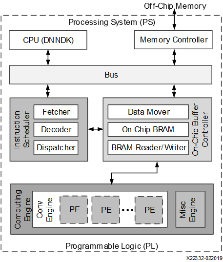

<table class="sphinxhide">
 <tr>
   <td align="center"><h1>Vitis AI</h1><h0>Adaptable & Real-Time AI Inference Acceleration</h0>
   </td>
 </tr>
</table>

# Zynq UltraScale＋ MPSoC DPU Reference Design

The DPUCZDX8G is the Deep learning Processor Unit (DPU) designed for the Zynq UltraScale+ MPSoC. It is a configurable computation engine optimized for convolutional neural networks. The degree of parallelism utilized in the engine is a design parameter and can be selected according to the target device and application. At a high-level, the DPU is a microcoded compute engine which has an efficient, optimized instruction set, and which can support inference of most convolutional neural networks.  The [Vitis AI Model Zoo](../../model_zoo) is an excellent resource to better understand the types of models that are supported by the DPUCZDX8G.

### DPU IP Features:

- Supports one AXI slave interface for accessing configuration and status registers.
- Supports one AXI master interface for instruction fetch.
- Supports individual configuration of each channel.
- IP is available in multiple variants, scaling both in terms of logic resource utilization and parallelism.  Configurations include: B512, B800, B1024, B1152, B1600, B2304, B3136, and B4096, where the nomenclature illuminates the total number of OPs per DPU clock cycle.
- Software and IP core support for up to a maximum of four homogeneous DPU instances in a single Xilinx SoC

### DPUCZDX8G supported operators:

- Convolution and transposed convolution
- Depthwise convolution and depthwise transposed convolution
- Max pooling
- Average pooling
- ReLU, ReLU6, Leaky ReLU, Hard Sigmoid, and Hard Swish
- Elementwise-sum and Elementwise-multiply
- Dilation
- Reorg
- Fully connected layer
- Softmax
- Concat, Batch Normalization

### Hardware Architecture

After start-up, the DPUCZDX8G fetches instructions from off-chip memory to control the operation of the computing engine. The instructions are generated by the Vitis™ AI compiler, which performs substantial optimizations including layer fusion.

On-chip memory is used to buffer input activations, intermediate feature-maps, and output meta-data to achieve high throughput and efficiency. The data is reused as much as possible to reduce external memory bandwidth requirements. A deep pipelined design is used for the computing engine. The processing elements (PEs) take full advantage of the fine-grained building blocks such as multipliers, adders, and accumulators in Xilinx devices.

There are three dimensions of parallelism in the DPU architecture - pixel parallelism, input channel parallelism, and output channel parallelism. The input channel parallelism is always equal to the output channel parallelism. The DPU IP is offered in several configuration in order to enable the developer to scale between small and large Zynq Ultrascale+ target devices. DPUs with higher levels of parallelism can achieve higher performance at the expense of higher programmable logic resource utilization. The parallelism for the different architectures is listed in the table below:

|Convolution Architecture|Pixel Parallelism(PP)|Input Channel Parallelism(ICP)|Output Channel Parallelism(OCP)|Peak(operations/per clock)|
|:---|:---|:---|:---|:---|
|B512|4|8|8|512|
|B800|4|10|10|800|
|B1024|8|8|8|1024|
|B1152|4|12|12|1152|
|B1600|8|10|10|1600|
|B2304|8|12|12|2304|
|B3136|8|14|14|3136|
|B4096|8|16|16|4096|

****

[DPU TRD Vitis Flow ](README_DPUCZ_Vitis.md)

[DPU TRD Vivado Flow](README_DPUCZ_Vivado.md)

****

Copyright&copy; 2022 Xilinx

