# Zynq UltraScale＋ MPSoC DPU TRD V4.1 Vitis 2022.2

## Table of Contents

- [1 Revision History](#1-revision-history)
- [2 Overview](#2-overview)
- [3 Software Tools and System Requirements](#3-software-tools-and-system-requirements)
    - [3.1 Hardware](#31-hardware)
    - [3.2 Software](#32-software)
- [4 Design Files](#4-design-files)
    - [Design Components](#design-components)
- [5 Tutorials](#5-tutorials)
	- [5.1 Board Setup](#51-board-setup)
	- [5.2 Build and Run TRD Flow](#52-build-and-run-trd-flow)
		- [5.2.1 Build the Hardware Design](#521-build-the-hardware-design)
   		- [5.2.2 Get Json File](#522-get-json-file)
   		- [5.2.3 Run Resnet50 Example](#523-run-resnet50-example)
	- [5.3 Configurate the DPU](#3-configurate-the-dpu)
		- [5.3.1 Set the DPU Core Number](#531-set-dpu-core-number)
		- [5.3.2 Modify the Parameters](#532-modify-the-parameters)
		- [5.3.3 Specify Connectivity for DPU Ports](#533-specify-connectivity-for-dpu-ports)
   	- [5.4 Integrate the DPU in customer platform](#54-integrate-the-dpu-in-customer-platform)
	- [5.5 Integrate the DPU for zcu102 and zcu104 VITIS-AI release](#55-integrate-the-dpu-for-zcu102-and-zcu104-vitis-ai-release)
		- [5.5.1 Configue the zcu102 released project ](#551-configue-the-zcu102-released-project)
		- [5.5.2 Configue the zcu104 released project ](#552-configue-the-zcu104-released-project)
		- [5.5.3 Known Issues ](#553-known-issues)
- [6 GUI Flow](#6-gui-flow)
    - [Run Steps](#run-steps)

## 1 Revision History

This wiki page complements the Vitis 2022.2 version of the DPU TRD.

V4.1 Change log:

-  Vitis AI 3.0
-  Supported Correlation 1D and 2D
-  Supported Argmax and Max along channel dimension
-  Optimized resources and timing

V4.0 Change log:

-  Vitis AI 2.5
-  new ALU
-  optimize resource utilization for better timing

V3.4 Change log:

-  Vitis AI 2.0
-  update GUI scripts.

V3.3 Change log:

-  Vitis AI 1.3
-  support DRAM replace of Luts resources
-  support GUI flow
-  support MaxPooling kernel from 1-8 to 1-256

V3.2 Change Log:

-  Vitis AI 1.2
-  support low power mode
-  support ZYNQ device

------

## 2 Overview


This tutorial contains information about:

- How to set up the ZCU102 evaluation board and run the TRD.
- How to change the Configuration of DPU.
- How to integrate the DPU in the customer platform in vitis 2022.2 environment.

------

## 3 Software Tools and System Requirements

### 3.1 Hardware

Required:

- ZCU102 evaluation board

- Micro-USB cable, connected to laptop or desktop for the terminal emulator

- SD card

### 3.2 Software

  Required:
  - Vitis 2022.2 [Vitis Core Development Kit](https://www.xilinx.com/support/download/index.html/content/xilinx/en/downloadNav/vitis/2022-2.html)
  - [CP210x_Universal_Windows_Driver](https://www.silabs.com/documents/public/software/CP210x_Universal_Windows_Driver.zip)
  - Serial terminal emulator e.g. [teraterm](http://logmett.com/tera-term-the-latest-version)
  - [XRT 2022.2](https://github.com/Xilinx/XRT/tree/2022.2)
  - [zcu102 base platform 2022.2] The zcu102 base platform is added to Vitis Installer. you can use it directly after installing Vitis. It is used for youverifying the integrating flows. We provide modified zcu102 and zcu104 base platforms in DPUCZDX8G/prj/Vitis/platforms. if you want to generate related files(BOOTBIN and xclbin) as same as the released image without samples and models, you need use base platforms in DPUCZDX8G/prj/Vitis/platforms folder.
  - [ZYNQMP common image 2022.2](https://www.xilinx.com/support/download/index.html/content/xilinx/en/downloadNav/embedded-platforms/2022-2.html)
  - [Vitis AI Library](https://github.com/Xilinx/Vitis-AI/tree/master/tools/Vitis-AI-Library) to configure DPU in Vitis AI Library ZCU102 and ZCU104 pacakge, Optional


###### **Note:** The user can also refer the [zcu102 dpu platform](https://github.com/Xilinx/Vitis_Embedded_Platform_Source/tree/2022.2/Xilinx_Official_Platforms/xilinx_zcu102_base), The github page includes all the details, such as how to generage the zcu102 dpu platform, how to create the SD card after compiling the DPU project.
------

## 4 Design Files

### Design Components

The top-level directory structure shows the the major design components. The TRD directory is provided with a basic README and legal notice file.

###### **Note:** The DPU_TRD/dpu_ip and DPU_TRD/prj/Vitis(inclduing the kernel_xml,dpu_config.vh,scripts) are needed, if the user add the DPU and softmax in own project.

```
DPU_TRD       
├── dpu_ip                              # rtl kernel
│   ├── DPU 
│   │   ├── bd
│   │   ├── component.xml
│   │   ├── doc
│   │   ├── gui
│   │   ├── hdl
│   │   ├── inc
│   │   ├── ttcl
│   │   ├── xci
│   │   └── xgui
│   └── Vitis
│       ├── dpu
│       └── sfm
├── app       
│   ├── models
│   ├── img 
│   ├── dpu_sw_optimize.tar.gz 
│   └── sample                          # resnet50 application
└── prj 
    └── Vitis
        │        
        ├── kernel_xml                                        
        │   ├── dpu
        │   └── sfm 
        ├── Makefile
        ├── syslink                     # postlink tcl file
        ├── dpu_conf.vh                 # dpu configuration file
        ├── config_file                 # config file
        │   ├── prj_config              # integrate 2DPU 
        │   ├── prj_config_102_3dpu     # integrate 3DPU on zcu102
        │   ├── prj_config_104_2dpu     # integrate 2DPU on zcu104
        │   └── prj_config_1dpu         # integrate 1DPU on zcu104
        ├── scripts
        ├── scripts_gui
        └── README.md

```

## 5 Tutorials

### 5.1 Board Setup

###### Required:

- Connect power supply to 12V power connector.

- Connect micro-USB cable to the USB-UART connector; use the following settings for your terminal emulator:

  - Baud Rate: 115200
  - Data: 8 bit
  - Parity: None
  - Stop: 1 bit
  - Flow Control: None

- Insert SD card (FAT formatted) with binaries copied from $TRD_HOME/images directory.

###### Jumpers & Switches:

  - Set boot mode to SD card:
    - Rev 1.0: SW6[4:1] - **off,off,off, on**
    - Rev D2: SW6[4:1] - **on, off on, off**


### 5.2 Build and Run Flow

The following tutorials assume that the $TRD_HOME environment variable is set as given below.

```
%export TRD_HOME =<Vitis AI path>/DPU-TRD
```

###### **Note:** It is recommended to follow the build steps in sequence.

#### 5.2.1 Building the Hardware Design

We need install the Vitis Core Development Environment.

We prepare the zcu102_dpu platform in the vitis TRD project. The platform include all the libs that needed.

The following tutorials assume that the Vitis and XRT environment variable is set as given below.

Open a linux terminal. Set the linux as Bash mode.

```
% source <vitis install path>/Vitis/2022.2/settings64.sh

% source opt/xilinx/xrt/setup.sh
```

The default setting of DPU is **B4096** with RAM_USAGE_LOW, CHANNEL_AUGMENTATION_ENABLE, DWCV_ENABLE, POOL_AVG_ENABLE, RELU_LEAKYRELU_RELU6, Softmax. Modify the $TRD_HOME/prj/Vitis/dpu_conf.vh file can change the default settings.

Build the hardware design.

```
% cd $TRD_HOME/prj/Vitis

% export EDGE_COMMON_SW=<mpsoc common system>/xilinx-zynqmp-common-v2022.2

% export SDX_PLATFORM=<zcu102 base platform path>/xilinx_zcu102_base_202220_1/xilinx_zcu102_base_202220_1.xpfm

% make all KERNEL=DPU_SM DEVICE=zcu102
```

Note that **mpsoc common system** should be downloaded in the 3.2 chapter. Generated SD card files are in **$TRD_HOME/prj/Vitis/binary_container_1/sd_card**.

#### 5.2.2 Get Json File 

The arch.json file is an important file required by the Vitis AI. The file has been generated by Vitis during the compilation of DPU TRD. It works together with Vitis AI compiler to support model compilation with various DPU configurations.

The arch.json file can be found in $TRD_HOME/prj/Vitis/binary_container_1/sd_card.

It can also be found in the following path:

$TRD_HOME/prj/Vitis/binary_container_1/link/vivado/vpl/prj/prj.gen/sources_1/bd/xilinx_zcu102_base/ip/xilinx_zcu102_base_DPUCZDX8G_1_0/arch.json

#### 5.2.3 Run Resnet50 Example 

**The TRD project has generated the matching model file in $TRD_HOME/prj/app/ path as the default settings. If the user change the DPU settings. The model need to be created again.**

This part is about how to run the Resnet50 example from the source code.

All the related files have been packaged in **$TRD_HOME/prj/Vitis/binary_container_1/sd_card.img** by Vitis tools. the user can use the balenaEtcher tool to generate the SD card.

The all needed files are in **$TRD_HOME/prj/Vitis/binary_container_1/sd_card**.

Copy the directory **$TRD_HOME/app** to the BOOT partition of the SD Card.

After the linux boot, run:

```
% cp -r /mnt/sd-mmcblk0p1/app/samples ~

% cp /mnt/sd-mmcblk0p1/app/models/resnet50.xmodel ~

% cp -r /mnt/sd-mmcblk0p1/app/img ~

% cd ~

% env LD_LIBRARY_PATH=samples/lib XLNX_VART_FIRMWARE=/media/sd-mmcblk0p1/dpu.xclbin samples/bin/resnet50 img/bellpeppe-994958.JPEG

Expect: 
score[945]  =  0.992235     text: bell pepper,
score[941]  =  0.00315807   text: acorn squash,
score[943]  =  0.00191546   text: cucumber, cuke,
score[939]  =  0.000904801  text: zucchini, courgette,
score[949]  =  0.00054879   text: strawberry,

```


###### **Note:** The $TRD_HOME/prj/app resenet50 test case can support both Vitis and Vivado flow. You can get the img folder form the v1.1 branch. If you want to run other network. Please refer to the [Vitis AI Github](https://github.com/Xilinx/Vitis-AI) and [Vitis AI User Guide](http://www.xilinx.com/support/documentation/sw_manuals/vitis_ai/1_0/ug1414-vitis-ai.pdf).


### 5.3 Change the Configuration


The DPU IP provides some user-configurable parameters to optimize resource utilization and customize different features. Different configurations can be selected for DSP slices, LUT, block RAM(BRAM), and UltraRAM utilization based on the amount of available programmable logic resources. There are also options for addition functions, such as channel augmentation, average pooling, depthwise convolution.

The TRD also support the softmax function.
   
For more details about the DPU, please read [DPU IP Product Guide](https://www.xilinx.com/cgi-bin/docs/ipdoc?c=dpu;v=latest;d=pg338-dpu.pdf)

 
#### 5.3.1 Set the DPU Core Number

The DPU core number is set 2 as default setting. Modify the prj_config file in the [connectivity] part.

```
nk=DPUCZDX8G:2
```
The project will integrate 2 DPU. The user can delete this property, Then the project will integrate 1 DPU. Change the number 2 to others, The project will integrate DPU number as you want.

###### **Note:** The DPU needs lots of LUTs and RAMs. Use 3 or more DPU numbers may cause the resourse and timing issue.


#### 5.3.2 Modify the Parameters

The default setting is B4096 for ZCU102. Read the dpu_conf.vh file to get the details of DPU. You can get all the configurations form [PG338](https://www.xilinx.com/support/documentation/ip_documentation/dpu/v3_2/pg338-dpu.pdf) 

Modify the $TRD_HOME/prj/Vitis/dpu_conf.vh file to modify the configuration. 

The TRD supports to modify the following parameters.

- Architecture
- URAM Number
- RAM Usage 
- Channel Augmentation 
- DepthwiseConv
- AveragePool
- ReLU Type
- DSP Usage
- Device 
- Softmax

#### Architecture

The DPU can configurate hardware architecture, including: **B512, B800, B1024, B1152, B1600, B2304, B3136, B4096**.

If you want to choose the B4096 DPU. Need to set like this.

```
`define B4096
```
#### URAM Number

Enable the URAM, The DPU will replace the bram to the uram.

```
`define URAM_ENABLE
```
Disable the URAM
```
`define URAM_DISABLE
```

For example, Use the DPU B4096 in zcu104 board. Setting as following.

```
`define B4096
`define URAM_ENABLE
```

There are some recommended uram numbers for different sizes.

| |B512|B800|B1024|B1152|B1600|B2304|B3136|B4096|
|:---|:---|:---|:---|:---|:---|:---|:---|:---|
|U_BANK_IMG|2|2|4|2|4|4|4|5|
|U_BANK_WGT|9|11|9|13|11|13|15|17|
|U_BANK_BIAS|1|1|1|1|1|1|1|1|

Modify the **$TRD_HOME/prj/Vitis/dpu_conf.vh** file to enable or disable the URAM function and change the URAM numbers.

Change the URAM numbers.

```
`ifdef URAM_ENABLE
    `define def_UBANK_IMG_N          5
    `define def_UBANK_WGT_N          17
    `define def_UBANK_BIAS           1
`elsif URAM_DISABLE
    `define def_UBANK_IMG_N          0
    `define def_UBANK_WGT_N          0
    `define def_UBANK_BIAS           0
`endif
```
#### RAM Usage

There are two options of RAM usage. High RAM Usage means that the on-chip memory block will be larger, allowing the DPU more flexibility to handle the internediate data. If the RAM is limited, Please the low RAM Usage.

#### Channel Augmentation

Enable 
```
`define CHANNEL_AUGMENTATION_ENABLE
```
Disable 
```
`define CHANNEL_AUGMENTATION_DISABLE
```

#### DepthwiseConv

Enable
```
`define DWCV_ENABLE
```
Disable
```
`define DWCV_DISABLE
```

#### AveragePool

Enable
```
`define POOL_AVG_ENABLE
```
Disable
```
`define POOL_AVG_DISABLE
```

#### ELEW MULT

Support multiplication of two feature maps for spicfic models

Enable
```
`define ELEW_MULT_ENABLE
```
Disable
```
`define ELEW_MULT_DISABLE
```

#### RELU Type

There are two  options of RELU Type, including: RELU_RELU6,RELU_LEAKRELU_RELU6. We recommend use the RELU_LEAKRELU_RELU6.
```
`define RELU_LEAKYRELU_RELU6
```

#### Argmax

Enable
```
`define SAVE_ARGMAX_ENABLE
```
Disable
```
`define SAVE_ARGMAX_DISABLE
```

#### DSP Usage
Setting High will cost more DSP rescources than LOW and save the LUTs.
```
`define DSP48_USAGE_HIGH
```
LOW
```
`define DSP48_USAGE_LOW
```

#### Low Power Mode
The dpu support low power mode and doesn't impact the performance.
```
`define LOWPOWER_ENABLE
```
Disable
```
`define LOWPOWER_DISABLE
```
We test the two mode in zcu102 board using same threads,dpu config(3DPU+softmax) and frequency(300Mhz).

| |LOWPOWER_DISABLE|LOWPOWER_ENABLE|
|:---|:---|:---|
|static_after_boot(w)|9.621|5.894|
|dynamic_running(w)|16.421|12.302|
|static_after_run(w)|9.735|5.929|

Need set the following steps.
1. Modify the dpu_conf.vh file
```
LOWPOWER_ENABLE
```
2. Modify the Makefile, Update the **$XOCC_OPTS** parameters
```
--xp param:compiler.userPostSysLinkOverlayTcl=${DIR_PRJ}/syslink/zcu102_lowpower.tcl 
```
3. Modify the **config_file/prj_config_102_3dpu_LPD **.
```
#prop=run.impl_1.strategy=Performance_NetDelay_low
prop=run.impl_1.strategy=Performance_Explore
prop=run.impl_1.steps.power_opt_design.is_enabled=1
```

The main function of the tcl file:

1.update the clock wizard parameters.

2.re-connect the wires between the clock wizard and DPU.

The user can get more details in the chapter 5 in UG338. The zcu102_lowpower.tcl file is only for 3 DPU. The user need modify the tcl for other numbers of DPU.

#### Device Configuration
support MPSOC
```
`define MPSOC
```
support ZYNQ
```
`define ZYNQ70000
```

#### Softmax

The TRD support the softmax function. The TRD has included the softmax rtl kernel.

Only use the DPU
```
make KERNEL=DPU
```
Use the DPU and Softmax
```
make KERNEL=DPU_SM
```

####5.3.3 Specify Connectivity for DPU Ports

Need to specify connectivity to the various ports in the system for the DPU. Open the file **prj_config** in a text editor. Refer the vitis document. Using the following comment to check the ports of platform.

```
% platforminfo -p <platform path>/zcu102_base/zcu102_base.xpfm
```

The information of platform is shown in the below figure.

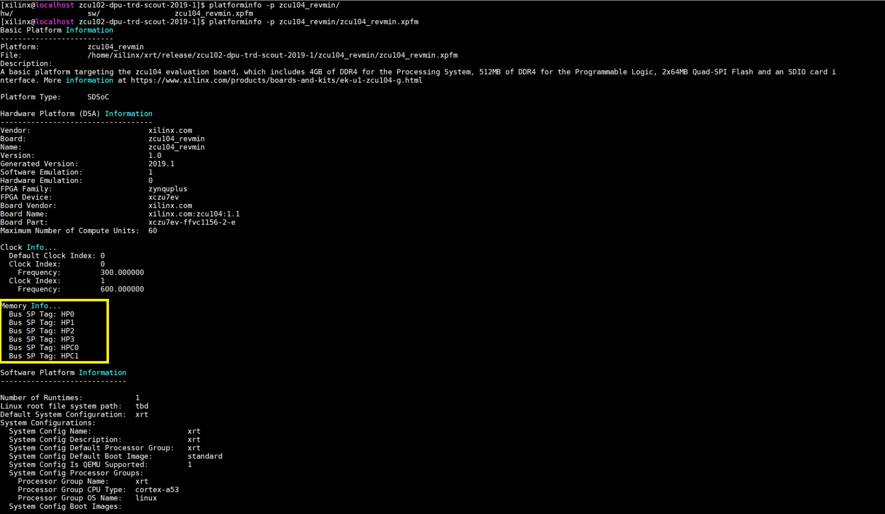

The default port connection is shown below.

|IP|Port|Connection|
|:---|:---|:---|
| |M_AXI_GP0|HP0|
|DPUCZDX8G_1|M_AXI_HP0|HP1|
| |M_AXI_HP2|HP2|
| |M_AXI_GP0|HP0|
|DPUCZDX8G_2|M_AXI_HP0|HPC0|
| |M_AXI_HP2|HPC1|


If the platform doesn't have enough port to connect the port of DPU. The ports can share with other IPs.


------

### 5.4 Integrate the DPU in customer platform

Refer the UG1146 or [Vitis_Embedded_Platform_Source](https://github.com/Xilinx/Vitis_Embedded_Platform_Source) to create the vitis platform. Modify the **SDX_PLATFORM** to specify the user platform.

```
% export SDX_PLATFORM=<user platform path>/user_platform.xpfm
```

If user just want to integrate the DPU IP in user platform. The related files need to be copied incuding the following path.

$TRD_HOME/prj/Vitis
$TRD_HOME/dpu_ip

The $TRD/prj/Vitis/strip_interconects.tcl file is for reducing the resources and not necessary. It can be detelted. The relevant statement need to be deleted inthe makefile at the same time.

Delete the following property.

```
--xp param:compiler.userPostSysLinkTcl=${DIR_PRJ}/strip_interconnects.tcl 
```

If the user changes the directroy structure, the relative paths in the script files need to be modified.

The other steps refer the 5.2 chapter. 

If you meet some timing issues. you can modify the [vivado] part of prj_config file (**prop=run.impl_1.strategy=Performance_Explore**) to change another implementation strategy and re-compile the project.


------

### 5.5 Integrate the DPU for Vitis AI Library release

This chapter introduces how to configue the project for [Vitis AI Library](https://github.com/Xilinx/Vitis-AI/tree/master/Vitis-AI-Library) released package for ZCU102 and ZCU104.

#### 5.5.1 Configue the zcu102 released project

steps:

1.Modify the Makefile file, Update the **$XOCC_OPTS** parameters
```
--config ${TRD_HOME}/prj/Vitis/config_file/prj_config_102_3dpu_LPD
```
2.
```
% make KERNEL=DPU_SM DEVICE=zcu102
```


#### 5.5.2 Configue the zcu104 released project

steps:

1.Modify the Makefile file, Update the **$XOCC_OPTS** parameters 
```
--config ${TRD_HOME}/prj/Vitis/config_file/prj_config_104_2dpu
```
2.Enable the URAM and modify the RAM USAGE

Need to modify the dpu_conf.vh file
```
line37: `define URAM_ENABLE
```
3.
```
% make KERNEL=DPU DEVICE=zcu104
```

###### **Note:** Vitis-AI 1.3 has use the RAM_USAGE_LOW option replace of RAM_USAGE_HIGH in zcu104 board. 

#### 5.5.3 Known issues

1.HPC

When HPC0 or HPC1 port is used to connect DPU, we advise platform disable HPC hardware cache-coherency, which could reduce DPU latency on HPC port.

label the HPC ports with the type S_AXI_HP, instead of S_AXI_HPC in xsa.tcl file in your platform.

```
S_AXI_HPC0_FPD {memport "S_AXI_HP" sptag "HPC0" memory "ps_e HPC0_DDR_LOW"}
S_AXI_HPC1_FPD {memport "S_AXI_HP" sptag "HPC1" memory "ps_e HPC1_DDR_LOW"}
```

2.DDR QOS

When AXI HP0 port connects to DPU and use DisplayPort to display, if the QoS settings are not modified, the DisplayPort transmission may under-run, producing black frames or screen flicker intermittently during DPU running. Apart from QoS settings, increasing the read and write issuing capability (outstanding commands) of DPU connected AXI FIFO interface S_AXI_HPC{0, 1}_FPD or S_AXI_HP{0:3}_FPD or S_AXI_LPD may keep the ports busy with always some requests in the queue, which could improve DPU performance highly. [solution](#fine-tune)

3.ZCU104 PMIC

As the default value of IOUT_OC_FAULT_LIMIT on PMIC chip irps5401 is too low to afford dpu running, thus, user could adjust the fault limit of over current for running DPU models on Xilinx ZCU104 board. Otherwise, you'll see board hangs or reboot when running some models on ZCU104 board. [solution](#fine-tune)

##### fine-tune 

User could execute **zynqmp_dpu_optimize.sh** on target board to address issue2 and issue3

Copy **$TRD_HOME/app/dpu_sw_optimize.tar.gz** to target board, after linux boot-up, run: 

```shell
This zynqmp_dpu_optimize.sh would execute following functions on target board:
  1) auto-resize ext4 partition to the max capacity
  2) fine-tune QoS/Outstanding settings for DPU case to achieve a better performance
  3) adjust pmic irps5401 current for ZCU104 board only

% tar -zxvf dpu_sw_optimize.tar.gz

% ./dpu_sw_optimize/zynqmp/zynqmp_dpu_optimize.sh

(refer to dpu_sw_optimize/zynqmp/README.md get more info)

```
## 6 Gui Flow

The DPU TRD can run in gui flow. Please refer to the following steps.

###### **Note:** The gui flow is for zcu102 board default. if user change the platform, need update related settings of DPU. 


1. open the Vitis tool.

2. select or create the dpu_trd as the workspace and click launch.

  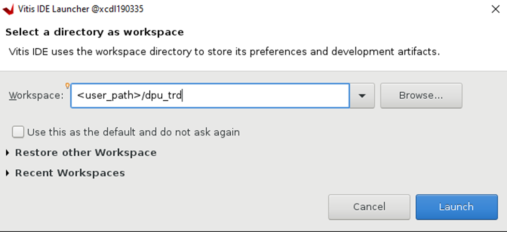   

3. Add DPU-TRD link to library Repositories

	a. Once the dpu_trd workspace is created and open

	b. Navigate to Windows -> Preference -> Library Repositories
    
		i. Using already DPU-TRD clone location.

  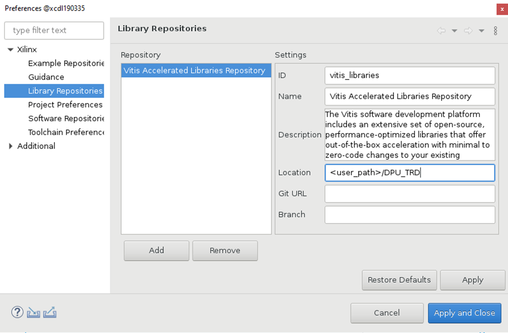   
    
4. Creation Application Project

	a. File->New->Application Project->Next->Choose the zcu102_base platform->Next

  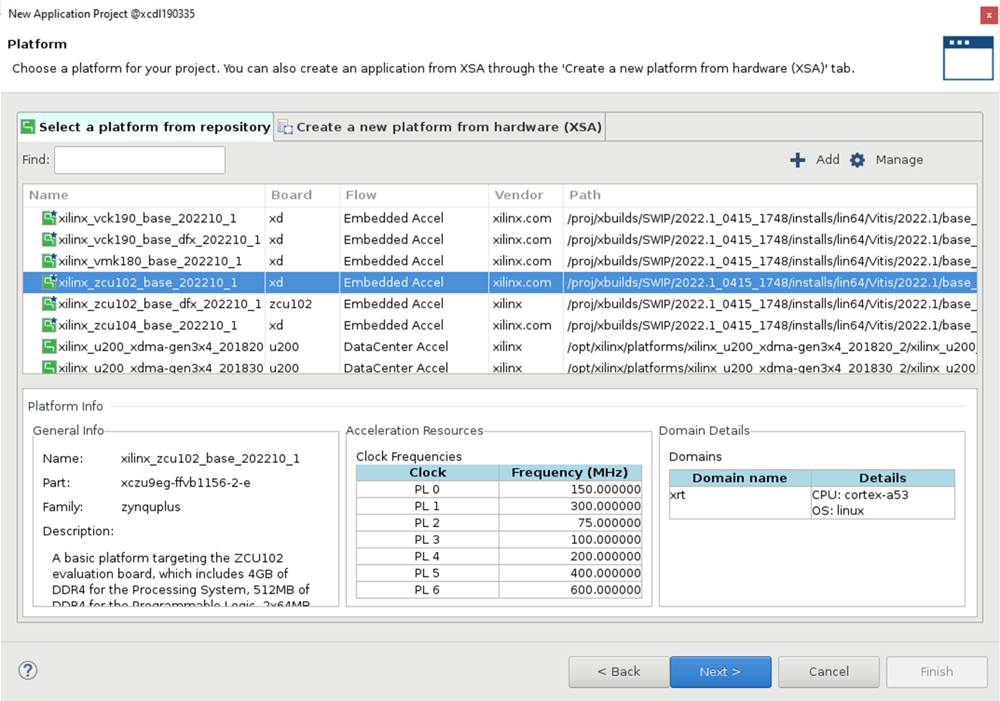  

	b. Enter the Application project name: dpu_trd -> Next 

  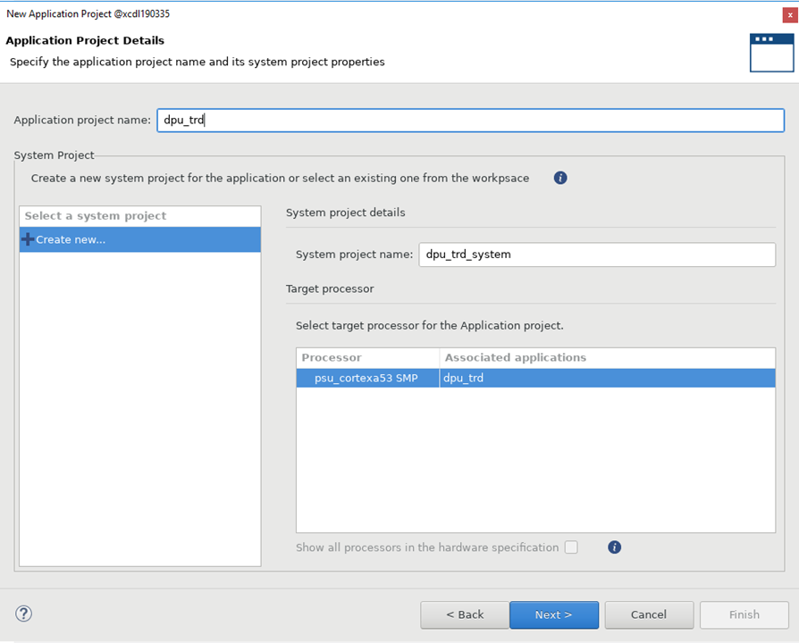 

	c. Enter the Sysroot, Root FS, Kernel Image paths and click Next. Find them in the common system. The user can get the related in the ZYNQMP common image 2022.2
[ZYNQMP common image 2022.2](https://www.xilinx.com/support/download/index.html/content/xilinx/en/downloadNav/embedded-platforms.html)

  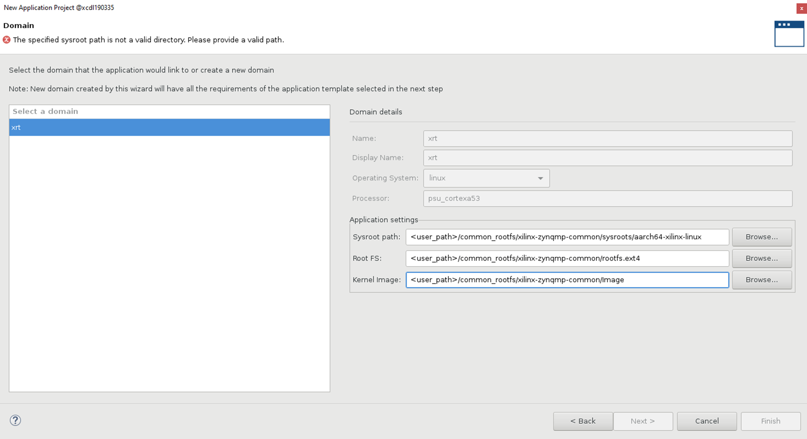 
 
	d. Choose the DPU Kernel(RTL Kernel)

  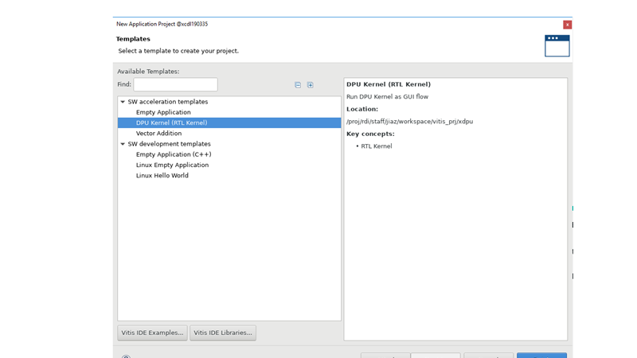 

	e. dpu_trd application project is created.


5. Choose the Hardware in Active Build configuration, Only Hardware Configuration is supported.

  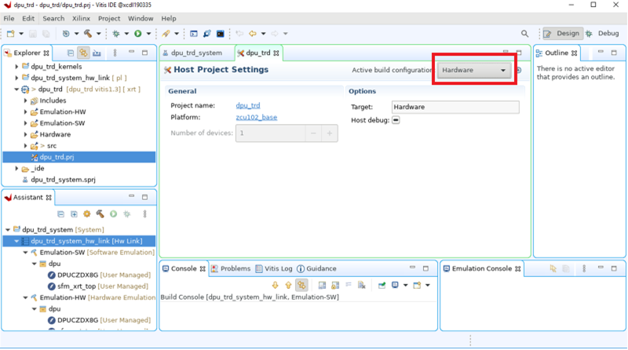 

6. Modify the dpu_conf.vh file to change DPU parmeters. You can use the default setting.
    
	a. User can edit dpu_conf.vh inside the kernel project[ex: dpu_trd_system->dpu_trd_kernel->src->prj->Vitis->dpu_conf.vh]
    
		i. Default configuration are set to zcu102 base platform.

  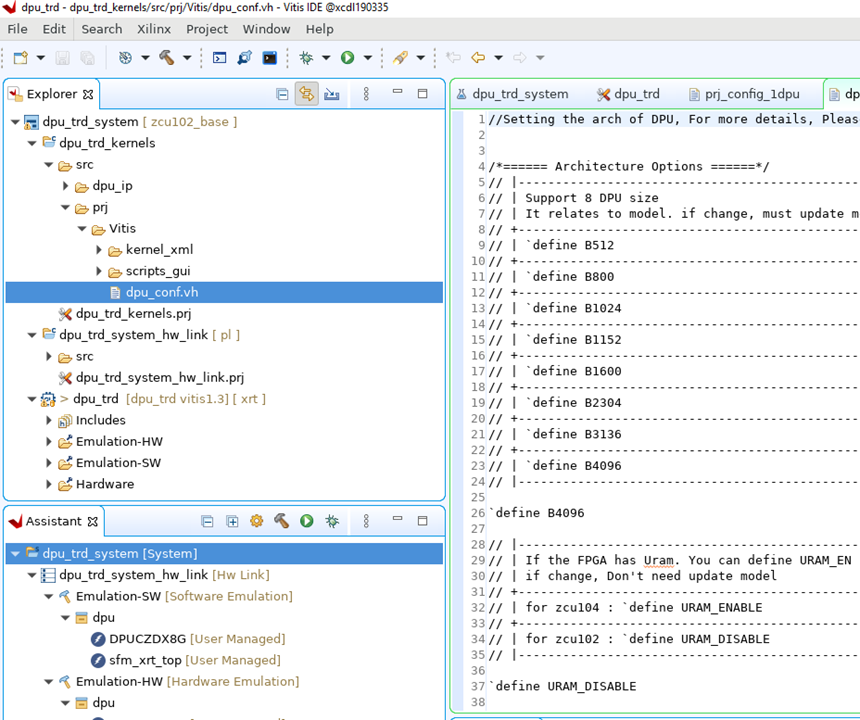 
  
		ii. For zcu104, dpu_conf.vh modifications

			Enable URAM

			//`define URAM_DISABLE
			`define URAM_ENABLE

7. C/C++ property settings

	a. Right click the dpu_trd ->C/C++ Build Settings->C/C++ Build->Settings

  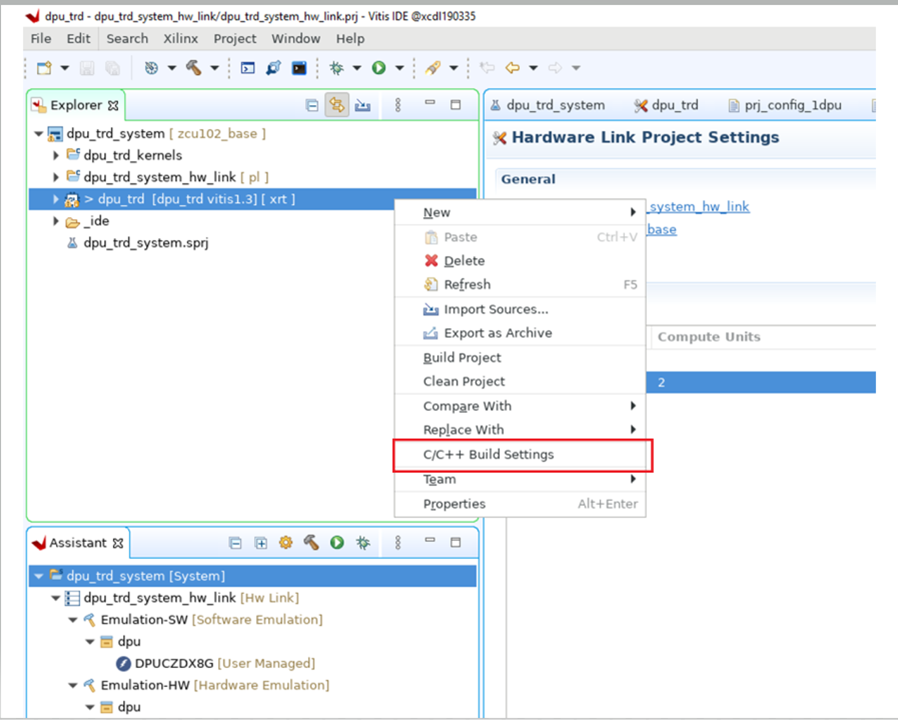

	b. Enter "-std=c++17" in Miscellaneous->Other flags, This step has supported by the Json. The user can skip it.

  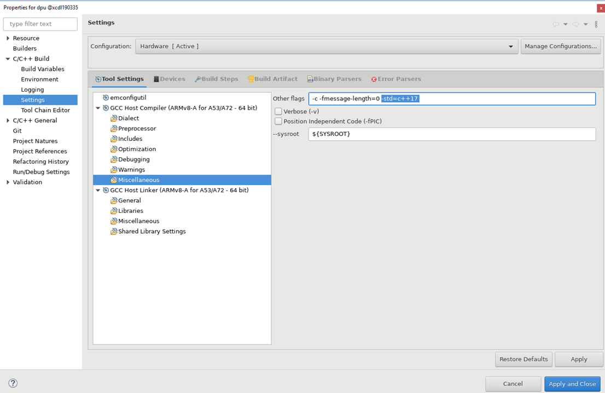

	c. Enter "sysroots/cortexa72-cortexa53-xilinx-linux/user/include/opencv4" path into GCC Host Compilier -> includes.

  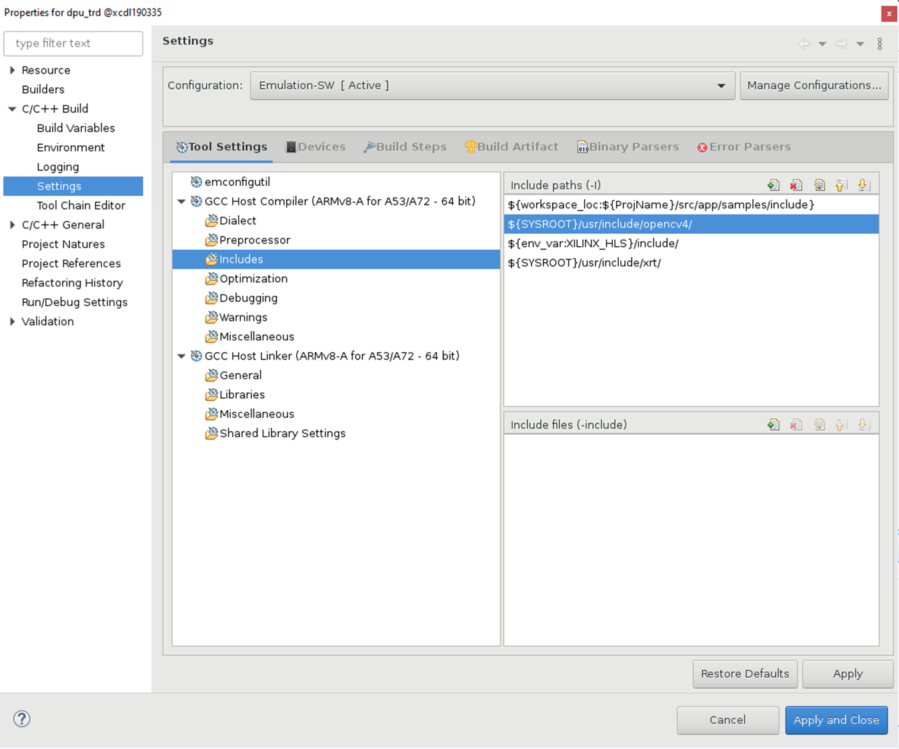

	d. Add the following libraries in libraries window, This step has supported by the Json. The user can skip it.
  - glog 
  - vart-mem-manager 
  - xir 
  - unilog 
  - vart-buffer-object 
  - vart-runner 
  - vart-util 
  - vart-xrt-device-handle 
  - opencv_core
  - opencv_imgproc 
  - opencv_imgcodecs 
  - vart-dpu-runner
  - vart-dpu-controller

   e. Add <Vitis AI path>/DPU-TRD/src/app/samples/lib in GCC Host Link-> Libraries->Library search path. make sure that new path is in front of the SYSROOT path.
  
  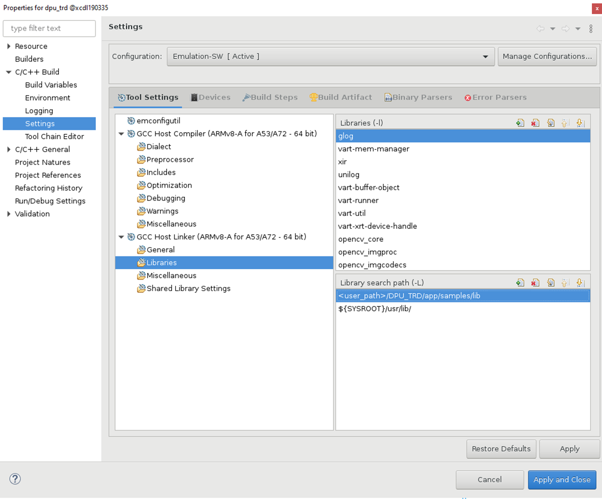
  
8. prj_config file-Default set to support single configuration. The gui flow only support default configuration. if want to other configuration, please use commandline flow.
  
  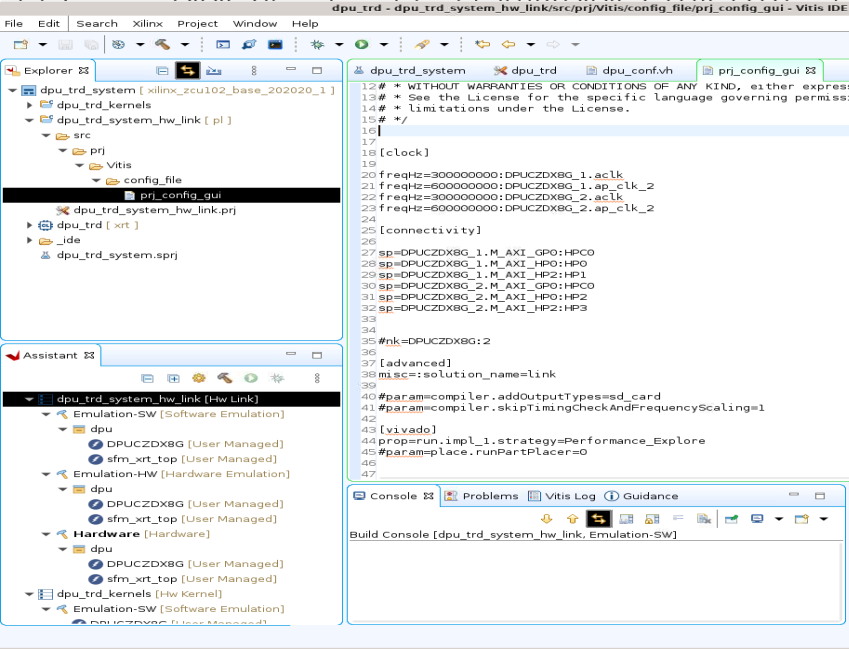

9. For zcu104, double click "dpu_trd_system_hw_link.prj" and remove/delete sfm_xrt_top function.

  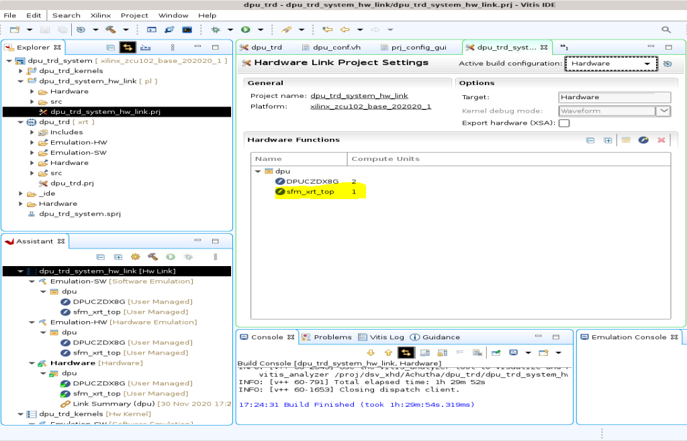

10. Add/Move Application specific "img" and "model" into sd_card using package option as shown in the snapshot

  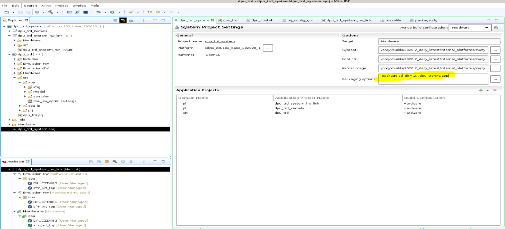

11. Right click dpu_trd_system ->Build Project 

  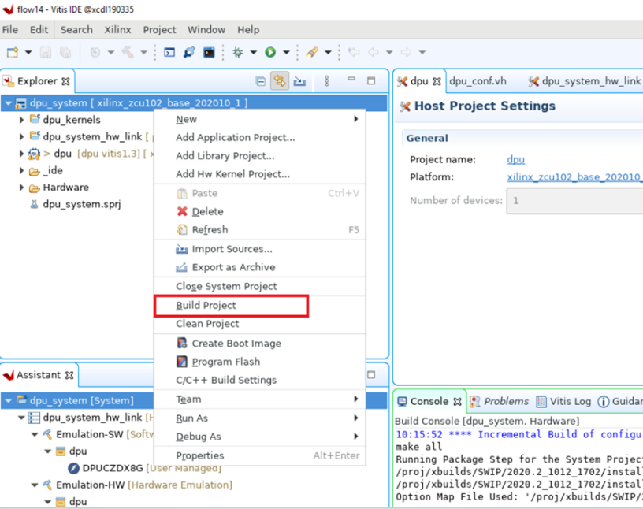

The arch.json file can be found in the following path.

**dpu_trd_system__hw_link->Hardware->dpu.build->link->vivado->vpl->prj->prj.gen->source_1->bd->zcu102_base->ip->zcu102_base_DPUCZDX8G_1_0->arch.json**

###### **Note:** Build process will create DPU kernel.xo, xclbin, host executable and also create the sd card img file.


<p align="center"><sup>Copyright&copy; 2022 Xilinx</sup></p>

 
