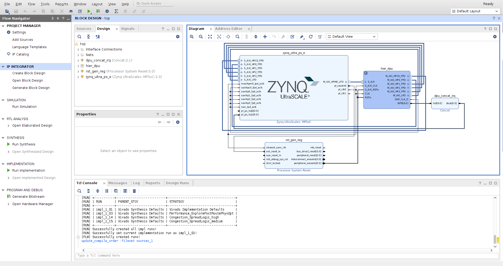
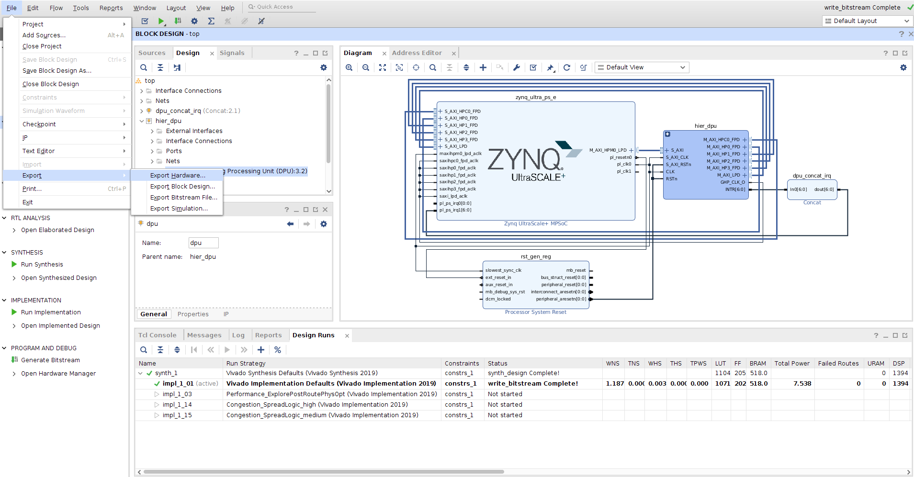
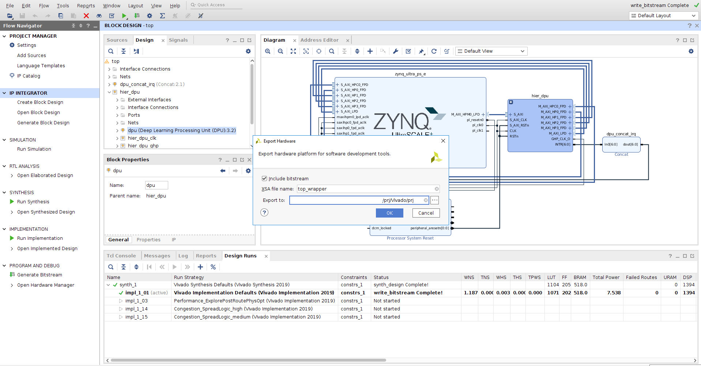

<table class="sphinxhide">
 <tr>
   <td align="center"><h1>Vitis AI</h1><h0>Adaptable & Real-Time AI Inference Acceleration</h0>
   </td>
 </tr>
</table>

# Zynq UltraScale＋ MPSoC DPU v4.1 Reference Design for Vivado 2022.2

## Table of Contents

- [1 Revision History](#1-revision-history)
- [2 Overview](#2-overview)
- [3 Software Tools and System Requirements](#3-software-tools-and-system-requirements)
    - [3.1 Hardware](#31-hardware)
    - [3.2 Software](#32-software)
- [4 Design Files](#4-design-files)
    - [Design Components](#design-components)
- [5 Tutorials](#5-tutorials)
	- [5.1 Board Setup](#51-board-setup)
	- [5.2 Build and Run TRD Flow](#52-build-and-run-trd-flow)
		- [5.2.1 Build the Hardware Design](#521-build-the-hardware-design)
   		- [5.2.2 Get Json File](#522-get-json-file)
   		- [5.2.3 DPU PetaLinux BSP](#523-dpu-petalinux-bsp)
   		- [5.2.4 Run Resnet50 Example](#524-run-resnet50-example)
	- [5.3 Configurate the DPU](#53-configurate-the-dpu)
		- [5.3.1 Modify the Frequency](#531-modify-the-frequency)
		- [5.3.2 Modify the Parameters](#532-modify-the-parameters)
- [6 Run with Vitis AI Library](#6-run-with-vitis-ai-library)

## 1 Revision History

Change Log:

V4.1 Change log:

-  Vitis AI v3.0
-  Supported Correlation 1D and 2D
-  Supported Argmax and Max along channel dimension
-  Optimized resources and timing

V4.0 Change log:

-  Vitis AI v2.5
-  New ALU engine to replace Pool engine and Dwcv engine
-  ALU: Supported large-kernel-size MaxPool and AveragePool
-  ALU: Supported rectangle-kernel-size AveragePool
-  ALU: Supported 16bit const weights
-  ALU: Supported HardSigmoid and HardSwish
-  ALU: Supported DepthWiseConv + LeakyReLU
-  ALU: Unlocked the parallelism configuration
-  ALU: Always enabled AveragePool
-  ALU: Always enabled DepthWiseConv
-  ALU: Always enabled Elew-Multiply
-  Optimized resources and timing

V3.4 Change log:

-  Updated IP name.
-  Updated interrupt connection.

V3.3 Change log:

-  Supported range of conv stride from 4 to 8.
-  Supported Pool MaxReduce.
-  Supported Elew Multiply.

V3.2 Change log:

-  Updated IP Name.
-  Supported Bias-right-shift.
-  Supported up-to 4 cores DPU

V3.1 Change Log:

-  The first version of Vivado DPU TRD.

------

## 2 Overview

This tutorial contains information about:

- How to set up the ZCU102 evaluation board and run the TRD.
- How to change the Configuration of DPU.

------

## 3 Software Tools and System Requirements

### 3.1 Hardware

Required:

- ZCU102 evaluation board

- Micro-USB cable, connected to laptop or desktop for the terminal emulator

- SD card

### 3.2 Software

  Required:
  - Vivado 2022.2 [Vivado Design Tools](https://www.xilinx.com/support/download/index.html/content/xilinx/en/downloadNav/vivado-design-tools.html)
  - Petalinux 2022.2 [Embedded Design Tools](https://www.xilinx.com/support/download/index.html/content/xilinx/en/downloadNav/embedded-design-tools.html)
  - [Vitis AI](https://github.com/Xilinx/Vitis-AI) to run models other than Resnet50, Optional

------

## 4 Design Files

### Design Components

The top-level directory structure shows the the major design components. The TRD directory is provided with a basic README and legal notice file.

```
├── dpu_ip
│   ├── DPUCZDX8G_v4_1_0
│   └── Vitis
├── prj
│   ├── Vitis
│   └── Vivado
│       ├── hw
│       │   ├── constrs
│       │   ├── pre-built
│       │   ├── scripts
│       ├── README.md
│       └── sw
│           ├── helper_build_bsp.sh
│           ├── meta-vitis
│           └── README.md
└── README.md
```

## 5 Tutorials

### 5.1 Board Setup

###### Required:

- Connect power supply to 12V power connector.

- Connect micro-USB cable to the USB-UART connector, use the following settings for your terminal emulator:

  - Baud Rate: 115200
  - Data: 8 bit
  - Parity: None
  - Stop: 1 bit
  - Flow Control: None

- Insert SD card (FAT formatted).

###### Jumpers & Switches:

  - Set boot mode to SD card:
    - Rev 1.0: SW6[4:1] - **OFF,OFF,OFF,ON**
    - Rev D2: SW6[4:1] - **ON,OFF,ON,OFF**

### 5.2 Build and Run TRD Flow

The following tutorials assume that the $TRD_HOME environment variable is set as given below.

```
%export TRD_HOME=<Vitis AI path>/DPU_TRD
```

###### **Note:** It is recommended to follow the build steps in sequence.

#### 5.2.1 Build the Hardware Design

We need install the Vivado Development Environment.

The following tutorials assume that the Vivado environment variable is set as given below.

Open a linux terminal. Set the linux as Bash mode.

```
% source <Vivado install path>/Vivado/2022.2/settings64.sh

```

The default settings of DPU is 3 cores **B4096** with RAM_USAGE_LOW, CHANNEL_AUGMENTATION_ENABLE, DWCV_ENABLE, POOL_AVG_ENABLE, RELU_LEAKYRELU_RELU6, Softmax.

Modify the $TRD_HOME/prj/Vivado/hw/scripts/trd_prj.tcl file can change the default settings.

Build the hardware design.

```
% cd $TRD_HOME/prj/Vivado/hw

% vivado -source scripts/trd_prj.tcl
```

After executing the script, the Vivado IPI block design comes up as shown in the below figure.



- Click on “**Generate Bitstream**”.

###### **Note:** If the user gets any pop-up with “**No implementation Results available**”. Click “**Yes**”. Then, if any pop-up comes up with “**Launch runs**”, Click "**OK**”.

After the generation of bitstream completed.

- Go to **File > Export > Export Hardware**

  

- In the Export Hardware window select "**Include bitstream**" and click "**OK**".

  

The XSA file is created at $TRD_HOME/prj/Vivado/hw/prj/top_wrapper.xsa

###### **Note:** The actual results might graphically look different than the image shown

#### 5.2.2 Get Json File

Json file is an important file that needed by the VAI Compiler. The file has been created when compile by the Vivado tool. It works together with VAI Compiler to support model compilation under various DPU configurations.

The user can get the arch.json file in the following path.

$TRD_HOME/prj/Vivado/hw/srcs/top/ip/top_DPUCZDX8G_0/arch.json


#### 5.2.3 DPU PetaLinux BSP

Please follow [DPU Petalinux System Customization Guide](./README_DPUCZ_Vivado_sw.md) to get more details.

Setup PetaLinux working environment according to [PetaLinux Tools Documentation (UG1144)](https://docs.xilinx.com/r/en-US/ug1144-petalinux-tools-reference-guide/Setting-Up-Your-Environment). 

Build the petalinux project based on pre-built xsa under $TRD_HOME/prj/Vivado/hw/pre-built:
```
$ cd $TRD_HOME/prj/Vivado/sw
$ ./helper_build_bsp.sh
```
###### **Note:** All related files have been packaged in $TRD_HOME/prj/Vivado/sw/xilinx-zcu102-trd/images/linux/petalinux-sdimage.wic.gz. Please use Ether to flash the SD card. Refer section "Flashing the OS Image to the SD Card" in [UG1414](https://docs.xilinx.com/r/en-US/ug1414-vitis-ai/Flashing-the-OS-Image-to-the-SD-Card) for details.


#### 5.2.4 Run Resnet50 Example

This part is about how to run the Resnet50 example from the source code.

Execute the following command in the RootFs partition:
```
root@xilinx-zcu102-trd:~# cd app/
root@xilinx-zcu102-trd:~/app# cp model/resnet50.xmodel .
root@xilinx-zcu102-trd:~/app# env LD_LIBRARY_PATH=samples/lib samples/bin/resnet50 img/bellpeppe-994958.JPEG
score[945]  =  0.992235     text: bell pepper,
score[941]  =  0.00315807   text: acorn squash,
score[943]  =  0.00191546   text: cucumber, cuke,
score[939]  =  0.000904801  text: zucchini, courgette,
score[949]  =  0.00054879   text: strawberry,
root@xilinx-zcu102-trd:~/app#
```

###### **Note:** The matching model files has been provided in the app path as default settings, if the DPU settings changed, the model files need to be regenerated. For other models, please refer to [Running Vitis AI Library Examples](https://github.com/Xilinx/Vitis-AI/blob/master/src/vai_library/README.md#running-vitis-ai-library-examples).

### 5.3 Configurate the DPU

The DPU IP provides some user-configurable parameters to optimize resource utilization and customize different features. Different configurations can be selected for DSP slices, LUT, block RAM(BRAM), and UltraRAM utilization based on the amount of available programmable logic resources. There are also options for addition functions, such as channel augmentation, average pooling, depthwise convolution.

The TRD also support the softmax function.

For more details about the DPU, please read [DPU IP Product Guide](https://docs.xilinx.com/r/en-US/pg338-dpu)

#### 5.3.1 Modify the Frequency

#### DPU_CLK_MHz

Modify the scripts/trd_prj.tcl to modify the frequency of **Data Controller Clock**. The frequency of **Computation Clock** is twice of **Data Controller Clock**.

```
dict set dict_prj dict_param  DPU_CLK_MHz {325}
```
For details, please refer to **Data Controller Clock** and **Computation Clock** of **Clocking** in Chapter 4 DPU Configuration of PG338.

#### REG_CLK_MHz

Modify the scripts/trd_prj.tcl to modify the frequency of **Register Clock**

```
dict set dict_prj dict_param  REG_CLK_MHz {100}
```
For details, please refer to **Register Clock** of **Clocking** in Chapter 4 DPU Configuration of PG338.


#### 5.3.2 Modify the parameters

Modify the scripts/trd_prj.tcl to modify the parameters which can also be modified on the GUI.

The TRD supports to modify the following parameters.

- DPU_NUM
- DPU_ARCH
- DPU_RAM_USAGE
- DPU_CHN_AUG_ENA
- DPU_CONV_RELU_TYPE
- DPU_ALU_PARALLEL_USER
- DPU_ALU_LEAKYRELU
- DPU_SFM_NUM
- DPU_DSP48_USAGE
- DPU_URAM_PER_DPU

If one of the following parameters is modified, the corresponding model needs to be recompiled.

- DPU_ARCH
- DPU_RAM_USAGE
- DPU_CHN_AUG_ENA
- DPU_CONV_RELU_TYPE
- DPU_ALU_PARALLEL_USER
- DPU_ALU_LEAKYRELU

#### DPU_NUM

Number of DPUCZDX8G Cores: A maximum of four cores can be selected in one DPUCZDX8G IP.

1-4 can be selected, 3 is default setting.

```
dict set dict_prj dict_param  DPU_NUM {3}
```
For details, please refer to **Number of DPUCZDX8G Cores** of **Configuration Options** in Chapter 4 DPU Configuration of PG338.

###### **Note:** The DPU needs lots of LUTs and RAMs. Use 3 or more DPU may cause the resourse and timing issue.

#### DPU_ARCH

Architecture of the DPUCZDX8G: The DPUCZDX8G IP can be configured with various convolution architectures which are related to the parallelism of the convolution unit.

The architectures for the DPUCZDX8G IP include B512, B800, B1024, B1152, B1600, B2304, B3136, and B4096.

512/800/1024/1152/1600/2304/3136/4096 can be selected.

```
dict set dict_prj dict_param  DPU_ARCH {4096}
```
For details, please refer to **Architecture of the DPUCZDX8G** of **Configuration Options** in Chapter 4 DPU Configuration of PG338.

###### **Note:** It relates to models. If change, must update models.

#### DPU_RAM_USAGE

RAM Usage: The option determines whether the RAM Usage will be high on the DPU or not.

Low
```
dict set dict_prj dict_param  DPU_RAM_USAGE {low}
```
High
```
dict set dict_prj dict_param  DPU_RAM_USAGE {high}
```
For details, please refer to **RAM Usage** of **Configuration Options** in Chapter 4 DPU Configuration of PG338.

#### DPU_CHN_AUG_ENA

Channel Augmentation: The option determines whether the Channel Augmentation operation will be performed on the DPU or not.

Enable
```
dict set dict_prj dict_param  DPU_CHN_AUG_ENA {1}
```
Disable
```
dict set dict_prj dict_param  DPU_CHN_AUG_ENA {0}
```
For details, please refer to **Channel Augmentation** of **Configuration Options** in Chapter 4 DPU Configuration of PG338.

###### **Note:** It relates to models. If change, must update models.

#### DPU_SAVE_ARGMAX_ENA

Argmax and Max: The option enables argmax and max feature along channel dimension when restoring the outputs back to DDR space.

Enable
```
dict set dict_prj dict_param  DPU_SAVE_ARGMAX_ENA {1}
```
Disable
```
dict set dict_prj dict_param  DPU_SAVE_ARGMAX_ENA {0}
```
For details, please refer to **Argmax and Max** of **Configuration Options** in Chapter 4 DPU Configuration of PG338.

###### **Note:** It relates to models. If change, must update models.

#### DPU_CONV_RELU_TYPE

Conv ReLU Type: The option determines which kind of ReLU function can be used in the DPU. ReLU and ReLU6 are supported by default.

RELU_RELU6
```
dict set dict_prj dict_param  DPU_CONV_RELU_TYPE {2}
```
RELU_LEAKRELU_RELU6
```
dict set dict_prj dict_param  DPU_CONV_RELU_TYPE {3}
```
For details, please refer to **ReLU Type** of **Configuration Options** in Chapter 4 DPU Configuration of PG338.

###### **Note:** It relates to models. If change, must update models.

#### DPU_ALU_PARALLEL_USER

ALU parallel: The depthwise conv is performed by the ALU engine, along with the pooling. The ALU parallel ranges from 1 to PP, and is recommended to be set as PP/2.

For details, please refer to **DepthwiseConv (ALU)** of **Configuration Options** in Chapter 4 DPU Configuration of PG338.

###### **Note:** It relates to models. If change, must update models.

#### DPU_ALU_LEAKYRELU

ALU LeakReLU: The option determines whether the LeakReLU is performed by the ALU engine.

Enable
```
dict set dict_prj dict_param  DPU_ALU_LEAKYRELU {1}
```
Disable
```
dict set dict_prj dict_param  DPU_ALU_LEAKYRELU {0}
```
For details, please refer to **ReLU Type** of **Configuration Options** in Chapter 4 DPU Configuration of PG338.

###### **Note:** It relates to models. If change, must update models.

#### DPU_SFM_NUM

Softmax: This option allows the softmax function to be implemented in hardware.

Only use the DPU
```
dict set dict_prj dict_param  DPU_SFM_NUM {0}
```
Use the DPU and Softmax
```
dict set dict_prj dict_param  DPU_SFM_NUM {1}
```

For details, please refer to **Softmax** of **Configuration Options** in Chapter 4 DPU Configuration of PG338.

#### DPU_SAXICLK_INDPD

For details, please refer to **S-AXI Clock Mode** of **Advanced Tab** in Chapter 4 DPU Configuration of PG338.

#### DPU_CLK_GATING_ENA

For details, please refer to **dpu_2x Clock Gating** of **Advanced Tab** in Chapter 4 DPU Configuration of PG338.

#### DPU_DSP48_MAX_CASC_LEN

For details, please refer to **DSP Cascade** of **Advanced Tab** in Chapter 4 DPU Configuration of PG338.

#### DPU_DSP48_USAGE

DSP Usage: This allows you to select whether DSP48E slices will be used for accumulation in the DPU convolution module.

High
```
dict set dict_prj dict_param  DPU_DSP48_USAGE {high}
```
Low
```
dict set dict_prj dict_param  DPU_DSP48_USAGE {low}

```
For details, please refer to **DSP Usage** of **Advanced Tab** in Chapter 4 DPU Configuration of PG338.

#### DPU_URAM_PER_DPU

For details, please refer to **UltraRAM** of **Advanced Tab** in Chapter 4 DPU Configuration of PG338.


## 6 Run with Vitis AI Library

For the instroduction of Vitis AI Library, please refer to **Quick Start For Edge** of this page [Vitis AI Library](https://github.com/Xilinx/Vitis-AI/blob/master/src/vai_library/README.md).

<hr/>
<p align="center"><sup>Copyright&copy; 2022 Xilinx</sup></p>
