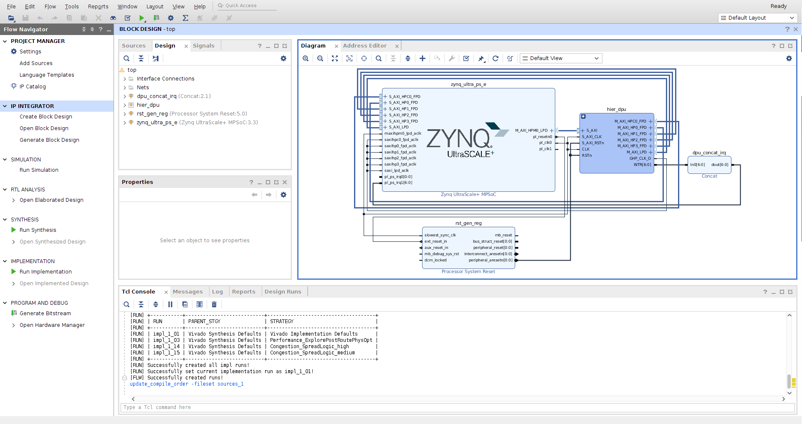
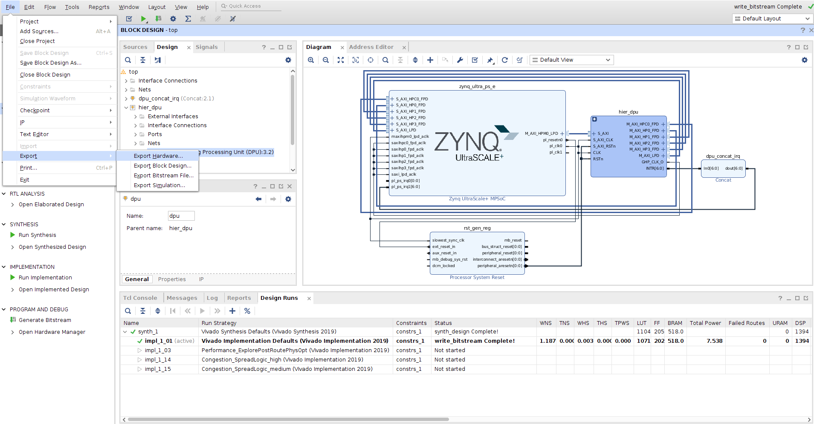
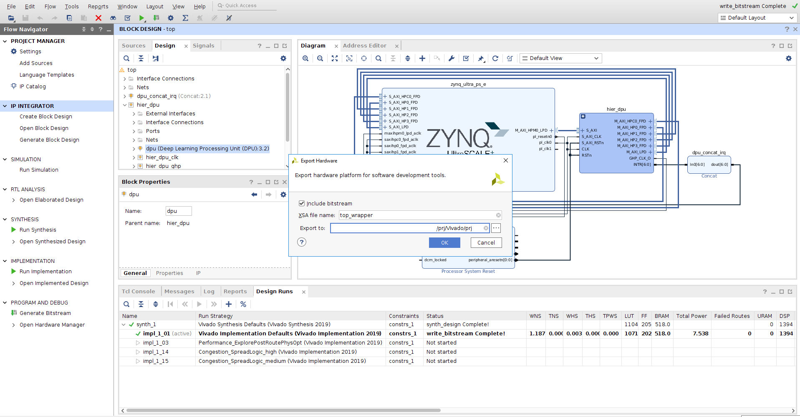

# Zynq UltraScale＋ MPSoC DPU TRD V3.3 Vivado 2021.1

## Table of Contents

- [1 Revision History](#1-revision-history)
- [2 Overview](#2-overview)
- [3 Software Tools and System Requirements](#3-software-tools-and-system-requirements)
    - [3.1 Hardware](#31-hardware)
    - [3.2 Software](#32-software)
- [4 Design Files](#4-design-files)
    - [Design Components](#design-components)
- [5 Tutorials](#5-tutorials)
	- [5.1 Board Setup](#51-board-setup)
	- [5.2 Build and Run TRD Flow](#52-build-and-run-trd-flow)
		- [5.2.1 Build the Hardware Design](#521-build-the-hardware-design)
   		- [5.2.2 Get Json File](#522-get-json-file)
   		- [5.2.3 DPU PetaLinux BSP](#523-dpu-petalinux-bsp)
   		- [5.2.4 Run Resnet50 Example](#524-run-resnet50-example)
	- [5.3 Configurate the DPU](#53-configurate-the-dpu)
		- [5.3.1 Modify the Frequency](#531-modify-the-frequency)
		- [5.3.2 Modify the Parameters](#532-modify-the-parameters)
- [6 Run with Vitis AI Library](#6-run-with-vitis-ai-library)
- [7 Known issues](#7-known-issues)

## 1 Revision History

Change Log:

V3.3 Change log:

-  Supported range of conv stride from 4 to 8
-  Supported Pool MaxReduce
-  Supported Elew Multiply

V3.2 Change log:

-  Updated IP Name
-  Supported Bias-right-shift.
-  Supported up-to 4 cores DPU

V3.1 Change Log:

-  The first version of Vivado DPU TRD

------

## 2 Overview

This tutorial contains information about:

- How to set up the ZCU102 evaluation board and run the TRD.
- How to change the Configuration of DPU.

------

## 3 Software Tools and System Requirements

### 3.1 Hardware

Required:

- ZCU102 evaluation board

- Micro-USB cable, connected to laptop or desktop for the terminal emulator

- SD card

### 3.2 Software

  Required:
  - Vivado 2021.1 [Vivado Design Tools](https://www.xilinx.com/support/download/index.html/content/xilinx/en/downloadNav/vivado-design-tools.html)
  - [Vitis AI](https://github.com/Xilinx/Vitis-AI) to run models other than Resnet50, Optional

------

## 4 Design Files

### Design Components

The top-level directory structure shows the the major design components. The TRD directory is provided with a basic README and legal notice file.

```
├── app
│   ├── img
│   ├── model
│   ├── samples
│   └── dpu_sw_optimize.tar.gz
├── dpu_ip
│   ├── DPUCZDX8G_v3_3_0
│   └── Vitis
└── prj
    └── Vivado
        ├── constrs
        ├── doc
        ├── dpu_petalinux_bsp
        ├── pre-built
        └── scripts
            ├── base
            └── trd_prj.tcl
```

## 5 Tutorials

### 5.1 Board Setup

###### Required:

- Connect power supply to 12V power connector.

- Connect micro-USB cable to the USB-UART connector, use the following settings for your terminal emulator:

  - Baud Rate: 115200
  - Data: 8 bit
  - Parity: None
  - Stop: 1 bit
  - Flow Control: None

- Insert SD card (FAT formatted).

###### Jumpers & Switches:

  - Set boot mode to SD card:
    - Rev 1.0: SW6[4:1] - **OFF,OFF,OFF,ON**
    - Rev D2: SW6[4:1] - **ON,OFF,ON,OFF**

### 5.2 Build and Run TRD Flow

The following tutorials assume that the $TRD_HOME environment variable is set as given below.

```
%export TRD_HOME=<Vitis AI path>/DPU_TRD
```

###### **Note:** It is recommended to follow the build steps in sequence.

#### 5.2.1 Build the Hardware Design

We need install the Vivado Development Environment.

The following tutorials assume that the Vivado environment variable is set as given below.

Open a linux terminal. Set the linux as Bash mode.

```
% source <Vivado install path>/Vivado/2021.1/settings64.sh

```

The default settings of DPU is **B4096** with RAM_USAGE_LOW, CHANNEL_AUGMENTATION_ENABLE, DWCV_ENABLE, POOL_AVG_ENABLE, RELU_LEAKYRELU_RELU6, Softmax.

Modify the $TRD_HOME/prj/Vivado/scripts/trd_prj.tcl file can change the default settings.

Build the hardware design.

```
% cd $TRD_HOME/prj/Vivado

% vivado -source scripts/trd_prj.tcl
```

After executing the script, the Vivado IPI block design comes up as shown in the below figure.



- Click on “**Generate Bitstream**”.

###### **Note:** If the user gets any pop-up with “**No implementation Results available**”. Click “**Yes**”. Then, if any pop-up comes up with “**Launch runs**”, Click "**OK**”.

After the generation of bitstream completed.

- Go to **File > Export > Export Hardware**

  

- In the Export Hardware window select "**Include bitstream**" and click "**OK**".

  

The XSA file is created at $TRD_HOME/prj/Vivado/prj/top_wrapper.xsa

###### **Note:** The actual results might graphically look different than the image shown

#### 5.2.2 Get Json File

Json file is an important file that needed by the VAI Compiler. The file has been created when compile by the Vivado tool. It works together with VAI Compiler to support model compilation under various DPU configurations.

The user can get the arch.json file in the following path.

$TRD_HOME/prj/Vivado/srcs/top/ip/top_DPUCZDX8G_0/arch.json


#### 5.2.3  DPU PetaLinux BSP

This tutorial shows how to build the Linux image and boot image using the PetaLinux build tool.

**PetaLinux Working Environment Setup**: Refer to the [PetaLinux Tools Documentation ](https://www.xilinx.com/support/documentation/sw_manuals/xilinx2021_1/ug1144-petalinux-tools-reference-guide.pdf)(UG1144) for installation.

For Bash as user login shell:

```
$ source <path-to-installed-PetaLinux>/settings.sh
```

For C shell as user login shell:

```
$ source <path-to-installed-PetaLinux>/settings.csh
```

Verify that the working environment has been set:

```
% echo $PETALINUX
```

##### Configure and build the PetaLinux project

```
% cd $TRD_HOME/prj/Vivado/dpu_petalinux_bsp
% ./download_bsp.sh
% petalinux-create -t project -s xilinx-zcu102-trd.bsp
% cd xilinx-zcu102-trd
% petalinux-config --get-hw-description=$TRD_HOME/prj/Vivado/prj/ --silentconfig
% petalinux-build
```

If the prebuilt design is wanted, please use the path for **--get-hw-description** as below.

```
% petalinux-config --get-hw-description=$TRD_HOME/prj/Vivado/pre-built/ --silentconfig
```

##### Create a boot image (BOOT.BIN) including FSBL, ATF, bitstream, and u-boot.

```
% cd images/linux
% petalinux-package --boot --fsbl zynqmp_fsbl.elf --u-boot u-boot.elf --pmufw pmufw.elf --fpga system.bit
```

#### 5.2.4 Run Resnet50 Example

**The TRD project has generated the matching model file in $TRD_HOME/app path as the default settings. If the user change the DPU settings. The model need to be created again.**

This part is about how to run the Resnet50 example from the source code.

The user must create the SD card. Refer section "Configuring SD Card ext File System Boot" in [ug1144](https://www.xilinx.com/support/documentation/sw_manuals/xilinx2021_1/ug1144-petalinux-tools-reference-guide.pdf) for PetaLinux 2021.1:

Copy the Image, BOOT.BIN, boot.scr and system.dtb files in **$TRD_HOME/prj/Vivado/dpu_petalinux_bsp/xilinx-zcu102-trd/images/linux** to BOOT partition.

Extract the rootfs.tar.gz files in **$TRD_HOME/prj/Vivado/dpu_petalinux_bsp/xilinx-zcu102-trd/images/linux** to RootFs partition.

```
tar -zxvf rootfs.tar.gz -C <path-of-SD-card-ext4-partition>
```

Copy the folder **$TRD_HOME/app/** to RootFs partition.

Reboot, after the linux boot, run in the RootFs partition:

```
% cd ./app

% cp ./model/resnet50.xmodel .

% env LD_LIBRARY_PATH=samples/lib samples/bin/resnet50 img/bellpeppe-994958.JPEG
```

Expect:
```
score[945]  =  0.992235     text: bell pepper,
score[941]  =  0.00315807   text: acorn squash,
score[943]  =  0.00191546   text: cucumber, cuke,
score[939]  =  0.000904801  text: zucchini, courgette,
score[949]  =  0.00054879   text: strawberry,
```

###### **Note:** The resenet50 test case can support both Vitis and Vivado flow. If you want to run other network. Please refer to the [Vitis AI Github](https://github.com/Xilinx/Vitis-AI) and [Vitis AI User Guide](http://www.xilinx.com/support/documentation/sw_manuals/Vitis_ai/1_0/ug1414-Vitis-ai.pdf).


### 5.3 Configurate the DPU


The DPU IP provides some user-configurable parameters to optimize resource utilization and customize different features. Different configurations can be selected for DSP slices, LUT, block RAM(BRAM), and UltraRAM utilization based on the amount of available programmable logic resources. There are also options for addition functions, such as channel augmentation, average pooling, depthwise convolution.

The TRD also support the softmax function.

For more details about the DPU, please read [DPU IP Product Guide](https://www.xilinx.com/cgi-bin/docs/ipdoc?c=dpu;v=latest;d=pg338-dpu.pdf)


#### 5.3.1 Modify the Frequency

Modify the scripts/trd_prj.tcl to modify the frequency of m_axi_dpu_aclk. The frequency of dpu_2x_clk is twice of m_axi_dpu_aclk.

```
dict set dict_prj dict_param  DPU_CLK_MHz {325}
```

#### 5.3.2 Modify the parameters

Modify the scripts/trd_prj.tcl to modify the parameters which can also be modified on the GUI.

The TRD supports to modify the following parameters.

- DPU_NUM
- DPU_ARCH
- DPU_RAM_USAGE
- DPU_CHN_AUG_ENA
- DPU_DWCV_ENA
- DPU_AVG_POOL_ENA
- DPU_CONV_RELU_TYPE
- DPU_SFM_NUM
- DPU_DSP48_USAGE
- DPU_URAM_PER_DPU
- DPU_CONV_WP

#### DPU_NUM

The DPU core number is set 2 as default setting.

```
dict set dict_prj dict_param  DPU_NUM {2}
```
A maximum of 4 cores can be selected on DPU IP.
###### **Note:** The DPU needs lots of LUTs and RAMs. Use 3 or more DPU may cause the resourse and timing issue.

#### DPU_ARCH

Arch of DPU: The DPU IP can be configured with various convolution architectures which are related to the parallelism of the convolution unit.
The architectures for the DPU IP include B512, B800, B1024, B1152, B1600, B2304, B3136, and B4096.

```
dict set dict_prj dict_param  DPU_ARCH {4096}
```
###### **Note:** It relates to models. If change, must update models.

#### DPU_RAM_USAGE

RAM Usage: The RAM Usage option determines the total amount of on-chip memory used in different DPU architectures, and the setting is for all the DPU cores in the DPU IP.
High RAM Usage means that the on-chip memory block will be larger, allowing the DPU more flexibility to handle the intermediate data. High RAM Usage implies higher performance in each DPU core.

Low
```
dict set dict_prj dict_param  DPU_RAM_USAGE {low}
```
High
```
dict set dict_prj dict_param  DPU_RAM_USAGE {high}
```

#### DPU_CHN_AUG_ENA

Channel Augmentation: Channel augmentation is an optional feature for improving the efficiency of the DPU when handling input channels much lower than the available channel parallelism.

Enable
```
dict set dict_prj dict_param  DPU_CHN_AUG_ENA {1}
```
Disable
```
dict set dict_prj dict_param  DPU_CHN_AUG_ENA {0}
```
###### **Note:** It relates to models. If change, must update models.

#### DPU_DWCV_ENA

Depthwise Convolution: The option determines whether the Depthwise convolution operation will be performed on the DPU or not.

Enable
```
dict set dict_prj dict_param  DPU_DWCV_ENA {1}
```
Disable
```
dict set dict_prj dict_param  DPU_DWCV_ENA {0}
```
###### **Note:** It relates to models. If change, must update models.

#### DPU_ELEW_MULT_ENA

ElementWise Multiply: The ElementWise Multiply can perform dot multiplication on most two input feature maps. The input channel of EM(ElementWise Multiply) ranges from 1 to 256 * channel_parallel.

Enable
```
dict set dict_prj dict_param  DPU_ELEW_MULT_ENA {1}
```
Disable
```
dict set dict_prj dict_param  DPU_ELEW_MULT_ENA {0}
```
###### **Note:** It relates to models. If change, must update models.

#### DPU_AVG_POOL_ENA

AveragePool: The option determines whether the average pooling operation will be performed on the DPU or not.

Enable
```
dict set dict_prj dict_param  DPU_AVG_POOL_ENA {1}
```
Disable
```
dict set dict_prj dict_param  DPU_AVG_POOL_ENA {0}
```
###### **Note:** It relates to models. If change, must update models.

#### DPU_CONV_RELU_TYPE

The ReLU Type option determines which kind of ReLU function can be used in the DPU. ReLU and ReLU6 are supported by default.

RELU_RELU6
```
dict set dict_prj dict_param  DPU_CONV_RELU_TYPE {2}
```
RELU_LEAKRELU_RELU6
```
dict set dict_prj dict_param  DPU_CONV_RELU_TYPE {3}
```
###### **Note:** It relates to models. If change, must update models.

#### DPU_SFM_NUM

Softmax: This option allows the softmax function to be implemented in hardware.

Only use the DPU
```
dict set dict_prj dict_param  DPU_SFM_NUM {0}
```
Use the DPU and Softmax
```
dict set dict_prj dict_param  DPU_SFM_NUM {1}
```

#### DPU_DSP48_USAGE

DSP Usage: This allows you to select whether DSP48E slices will be used for accumulation in the DPU convolution module.

High
```
dict set dict_prj dict_param  DPU_DSP48_USAGE {high}
```
Low
```
dict set dict_prj dict_param  DPU_DSP48_USAGE {low}
```

#### DPU_URAM_PER_DPU

The DPU uses block RAM as the memory unit by default. For a target device with both block RAM and UltraRAM, configure the number of UltraRAM to determine how many UltraRAMs are used to replace some block RAMs.
The number of UltraRAM should be set as a multiple of the number of UltraRAM required for a memory unit in the DPU.
An example of block RAM and UltraRAM utilization is shown in the Summary tab section.

```
dict set dict_prj dict_param  DPU_URAM_PER_DPU {0}
```

#### DPU_CONV_WP
The DPU supports additional write-parallel acceleration for the **PointPillar models**.
Modify line 49 of scripts/base/trd_bd.tcl file can change the default settings.

The option could be set as power of 2 and up to PP/2.

For B512/B800/B1152 architectures, DPU_CONV_WP can be set up to 2:
```
dict set dict_prj dict_param  DPU_CONV_WP {2}
```

For B1024/B1600/B2304/B3136/B4096 architectures, DPU_CONV_WP can be set up to 4:
```
dict set dict_prj dict_param  DPU_CONV_WP {4}
```

## 6 Run with Vitis AI Library

For the instroduction of Vitis AI Library, please refer to **Quick Start For Edge** of this page [Vitis AI Library](https://github.com/Xilinx/Vitis-AI/tree/master/demo/Vitis-AI-Library)

## 7 Known issues

1. DDR QOS

When AXI HP0 port connects to DPU and use DisplayPort to display, if the QoS settings are not modified, the DisplayPort transmission may under-run, producing black frames or screen flicker intermittently during DPU running. Apart from QoS settings, increasing the read and write issuing capability (outstanding commands) of DPU connected AXI FIFO interface S_AXI_HPC{0, 1}_FPD or S_AXI_HP{0:3}_FPD or S_AXI_LPD may keep the ports busy with always some requests in the queue, which could improve DPU performance highly. [solution](#solution)

##### Solution

User could execute **zynqmp_dpu_optimize.sh** on target board to address the issue.

Copy **$TRD_HOME/app/dpu_sw_optimize.tar.gz** to target board, after linux boot-up, run:

```shell
% tar -zxvf dpu_sw_optimize.tar.gz

% ./dpu_sw_optimize/zynqmp/zynqmp_dpu_optimize.sh

(refer to dpu_sw_optimize/zynqmp/README.md get more info)

```

2. Application hang

If the design of DPU connection is changed, such as using FPD port instead of LPD port, then the address of DPU is not start from 0x8F000000 by default.

In this case, the line "KCFLAGS +=-DSIG_BASE_ADDR=0x8FF00000" in "xilinx-zcu102-trd/project-spec/meta-user/recipes-modules/dpu/files/Makefile" should be modified.

The value of "KCFLAGS +=-DSIG_BASE_ADDR=value" is equal to the DPU start address plus offset 0xF00000.

For LPD port, the default DPU start address is 0x8F000000， so "KCFLAGS +=-DSIG_BASE_ADDR=0x8FF00000".

For FPD port, the start address is 0xB0000000， so "KCFLAGS +=-DSIG_BASE_ADDR=0xB0F00000".

After making the above modification, the abnormal conditions such as crashes, hanging may occur when run the program with DPU.

This is caused by the “get_dpu_fingerprint” function in “Vitis-AI/tools/Vitis-AI-Runtime/VART/vart/dpu-controller/src/dpu_controller_dnndk.cpp”.

The solution is as follows:

Use the following command to skip the fingerprint check when run the program.

```
env XLNX_ENABLE_FINGERPRINT_CHECK=0 <program running command>
```