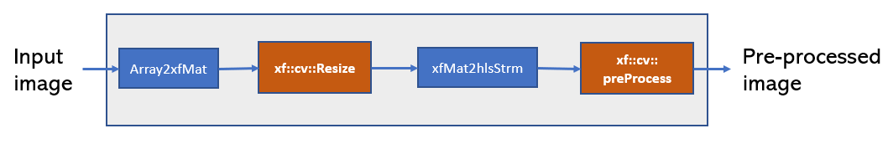

# Classification example: Pre-process Accelerator

xf_pp_pipeline_accel.cpp is the pre-process accelerator file which consist of following submodules:

- Array2xfMat : Data adaptor for conversion of pointer to xf::Mat
- xf::cv::resize : Resize 8bit BGR image 
- xfMat2hlsStrm : Data adaptor for conversion of xf::Mat to HLS stream
- xf::cv::preProcess : Mean-Sub and int8 to float conversion

  
  

