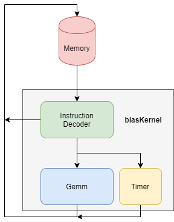

.. 
   Copyright 2019 Xilinx, Inc.
  
   Licensed under the Apache License, Version 2.0 (the "License");
   you may not use this file except in compliance with the License.
   You may obtain a copy of the License at
  
       http://www.apache.org/licenses/LICENSE-2.0
  
   Unless required by applicable law or agreed to in writing, software
   distributed under the License is distributed on an "AS IS" BASIS,
   WITHOUT WARRANTIES OR CONDITIONS OF ANY KIND, either express or implied.
   See the License for the specific language governing permissions and
   limitations under the License.

.. meta::
   :keywords: BLAS, Library, Vitis BLAS Library, L2 Kernel, GEMM
   :description: Vitis BLAS library L2 applications.
   :xlnxdocumentclass: Document
   :xlnxdocumenttype: Tutorials

.. _user_guide_gemm_l2:

********************
Blas Function Kernel
********************

Blas Function Kernels
========================
Blas kernels in this library has a uniform top function. 
This top function has only two memory interfaces for communicating with external
memories via AXI memory controlller. 
The external memory interface can be DDR, HBM or PLRAM. 
As shown in the figure below, the top function blasKernel is composed by
instruction process unit, timer and operation functional unit e.g. GEMM. 
The functional unit can be a single blas function or more. 

GEMM Kernels
========================
General matrix multiply (GEMM) is a very common and important function in BLAS library. 
It is a core operation in many applications such as machine learning algorithms.
GEMM operation C = A * B + X is implemented as a kernel in this library.

.. toctree::
   :maxdepth: 1

   L2_gemm_content.rst
