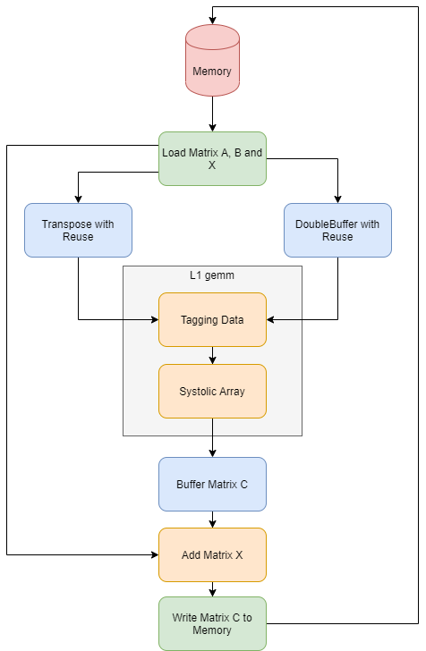

.. 
   Copyright 2019 Xilinx, Inc.
  
   Licensed under the Apache License, Version 2.0 (the "License");
   you may not use this file except in compliance with the License.
   You may obtain a copy of the License at
  
       http://www.apache.org/licenses/LICENSE-2.0
  
   Unless required by applicable law or agreed to in writing, software
   distributed under the License is distributed on an "AS IS" BASIS,
   WITHOUT WARRANTIES OR CONDITIONS OF ANY KIND, either express or implied.
   See the License for the specific language governing permissions and
   limitations under the License.

.. meta::
   :keywords: BLAS, Library, Vitis BLAS Library, L2 Kernel, GEMM
   :description: Vitis BLAS library L2 applications.
   :xlnxdocumentclass: Document
   :xlnxdocumenttype: Tutorials

.. _user_guide_gemm_content_l2:

********************
GEMM Kernel
********************

Architecture 
================
GEMM kernel here is an implementation of the operation C = A * B + X, where A,
B, X and C are matrices.
This kernel is composed by three major parts, data movers, transpose and buffers, and a systolic array as shown in the figure below.

Systolic Array
=======================
The architecture of the systolic array is implemented with L1 primitive function gemm. 
The size of the systolic array is defined via template parameters. 
In this library, the size is set according the external memory datawidth. 
For single-precision floating point GEMM and 512-bit DDR interface, the systolic
array size is 16 x 16.

Matrix Block Partition 
----------------------
There is no size limitations for matrices in the operation as long as they are
fitted in the memory. 
The matrices are partitioned into multiple identical blocks for block matrix
multiplication. 
The size of these matrix blocks should be multiple of the size of systolic array. 

Data Movers
=============

Data movers are responsible for data loading from the external memory to the
computation unit and storing the results from the computation unit to the
external memory. The original matrice are stored in its original row-major formats. They play an important role in the kernel to load and store the data with correct addresses due to the block matrix multiplication features. 

Transpose
========================
In the systolic array, the data of the matrix A (or B) should input in a transposed
order compared to its original row-major format. 
Transpose unit in the GEMM kernel is implemented to perform the transpose
operation. 
It also plays a role of double buffer and re-transmites the data to the systolic arrays since the data is re-usable
in the block mattrix multiplication. 

Double Buffers
========================
For the other input matrix B (or A), its data needs to be also double buffered
and can be reused. 
A special buffer object is designed to perform this operation
in GEMM kernel. 
