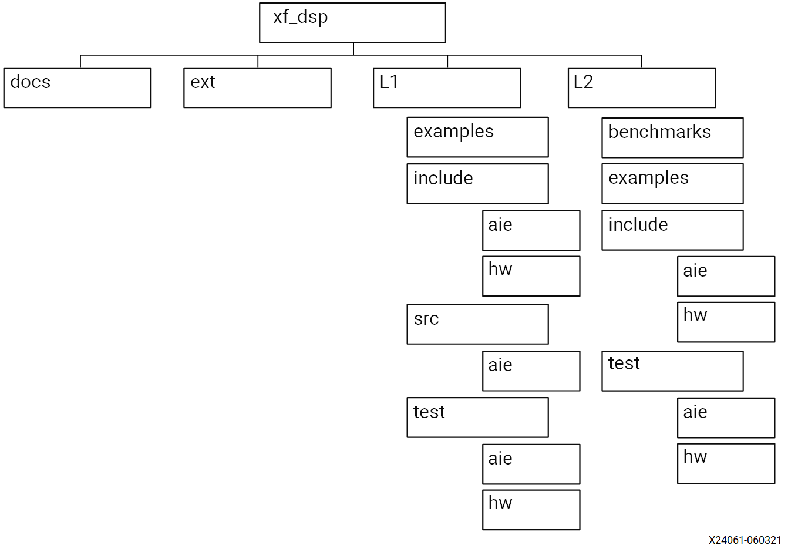

..
   Copyright 2021 Xilinx, Inc.

   Licensed under the Apache License, Version 2.0 (the "License");
   you may not use this file except in compliance with the License.
   You may obtain a copy of the License at

       http://www.apache.org/licenses/LICENSE-2.0

   Unless required by applicable law or agreed to in writing, software
   distributed under the License is distributed on an "AS IS" BASIS,
   WITHOUT WARRANTIES OR CONDITIONS OF ANY KIND, either express or implied.
   See the License for the specific language governing permissions and
   limitations under the License.

.. _1_INTRODUCTION:

************
Introduction
************

The DSP Library for AI Engine provides a set of DSP library elements. Each library element consists of a main graph class and a corresponding kernel class, but also includes a reference model graph class.

====================================
Navigating Content by Design Process
====================================

Xilinx |reg| documentation is organized around a set of standard design processes to help you find relevant content for your current development task. This document covers the following design processes:

-  **AI Engine Development:** Creating the AI Engine graph and kernels, library use, simulation debugging and profiling, and algorithm development. Also includes the integration of the Programmable Logic (PL) and AI Engine kernels. Topics in this document that apply to this design process include:

   -  :ref:`1_ORGANIZATION`

   -  :ref:`1_USING`

   -  :ref:`1_KNOWN_ISSUES`

   -  :ref:`1_TUTORIALS`

   -  :ref:`2_DSP_LIB_FUNC`

   -  :ref:`3_USING_EXAMPLES`

   -  :ref:`4_API_REFRENCE`

   -  :ref:`5_BENCHMARK`

-  **System and Solution Planning:** Identifying the components, performance, I/O, and data transfer requirements at a system level. Includes application mapping for the solution to Processing Subsystem (PS), PL, and AI Engine. Topics in this document that apply to this design process include:

   -  :ref:`2_FILTERS`

   -  :ref:`2_FFT_IFFT`

   -  :ref:`2_MATRIX_MULTIPLY`

   -  :ref:`2_WIDGETS`

-  **System Integration and Validation:** Integrating and validating the system functional performance, including timing, resource use, and power closure. Topics in this document that apply to this design process include:

   -  :ref:`3_USING_EXAMPLES`

   -  :ref:`4_API_REFRENCE`

.. _1_ORGANIZATION:

============
Organization
============

The following figure shows the DSPLib organization.

*Figure 1:* **DSPLib Organization**

The directories L1, L2, and L3 correspond to AI Engine kernels, AI Engine graphs, and drivers for each function, respectively. Inclusion of an L2 graph rather than an L1 element is recommended in your design.

.. note:: The L3 directory is not yet available.

Graph class declarations and constants that allow you to include the library element in your design are located in the `L2/include/aie/`. Kernel class definitions, the `.cpp` files and corresponding `.hpp` files are located in the `L1/src/aie` and `L1/include/aie` subdirectories respectively.

The `L2/tests/aie/<library_element>` subdirectory contains a test bench for the library element. Additional testbench files, like stimulus, monitor, and other utility modules are located in the `L1/tests/aie/inc/` folder.

Reference models graph class for each library element are contained in `L2/tests/aie/common/inc`. Reference models kernel class for each library element are contained in `L1/tests/aie/inc/` and `L1/tests/aie/src`.

The `L2/examples` subdirectory holds example wrapper designs to demonstrate the use of the library elements.

.. _1_USING:

=================================================
Using Library Elements within User Defined Graphs
=================================================

It is recommended that the library element to include in your graph is from the L2 directory, that is, a subgraph. For instance, to include a single rate asymmetrical FIR filter, include `fir_sr_asym_graph.hpp` from the `L2/include/aie/` folder. The test harness for each library unit can be used as a reference example of how to instantiate a parameterized graph. For example, see `L2/tests/aie/<library_element>/test.hpp` and `test.cpp`.

An example `test.h` and `test.cpp` which instantiates a parameterized graph and exposes a configured (point solution) interface is provided in the `L2/examples/fir_129t_sym` folder.

Set the environment variable to DSPLIB_ROOT.

.. code-block::

    setenv DSPLIB_ROOT <your-vitis-libraries-install-path/dsp>

.. note:: Use setenv for csh and export DSPLIB_ROOT=<path> for bash.

Use the following option in the aiecompiler command to provide the path:

.. code-block::

    -include=$DSPLIB_ROOT/L2/include/aie/
    -include=$DSPLIB_ROOT/L1/include/aie
    -include=$DSPLIB_ROOT/L1/src/aie

.. _1_KNOWN_ISSUES:

============
Known Issues
============

See Xilinx |reg| Answer Record `75802 <https://www.xilinx.com/support/answers/75802.html>`__ for the list of known issues.

.. _1_TUTORIALS:

========================
Vitis Tutorials
========================

Xilinx |reg| provides an extensive library of purpose build tutorials. It is recommended to visit `Vitis Tutorials <https://github.com/Xilinx/Vitis-Tutorials>`__ to get familiar with Vitis |trade| in-Depth tutorials.

To learn how to use the Vitis core tools to develop for Versal |trade|, the first Adaptive Compute Acceleration Platform (ACAP) device from Xilinx please visit `AI Engine Development Tutorials <https://github.com/Xilinx/Vitis-Tutorials/tree/master/AI_Engine_Development>`__. There is a variety of design, methodology, and feature tutorials, where you may also find a highly recommended `DSP Library Tutorial <https://github.com/Xilinx/Vitis-Tutorials/tree/master/AI_Engine_Development/Feature_Tutorials/08-dsp-library>`__
which demonstrates how to use kernels provided by the DSP library for a filtering application, how to analyze the design results, and how to use filter parameters to optimize the design's performance using simulation.

Finally, Simulink users could be interested in `AI Engine DSP Library and Model Composer Tutorial <https://github.com/Xilinx/Vitis-Tutorials/tree/master/AI_Engine_Development/Feature_Tutorials/10-aie-dsp-lib-model-composer>`__ which shows how to design AI Engine applications using Model Composer

.. |trade|  unicode:: U+02122 .. TRADEMARK SIGN
   :ltrim:
.. |reg|    unicode:: U+000AE .. REGISTERED TRADEMARK SIGN
   :ltrim:

