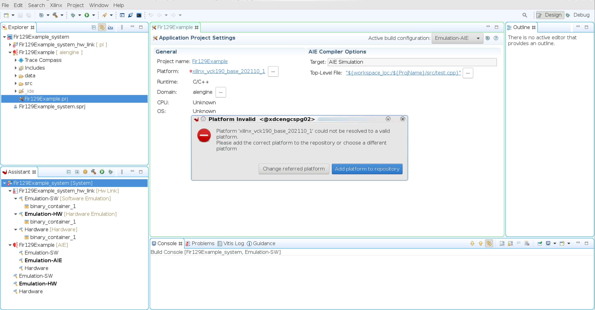
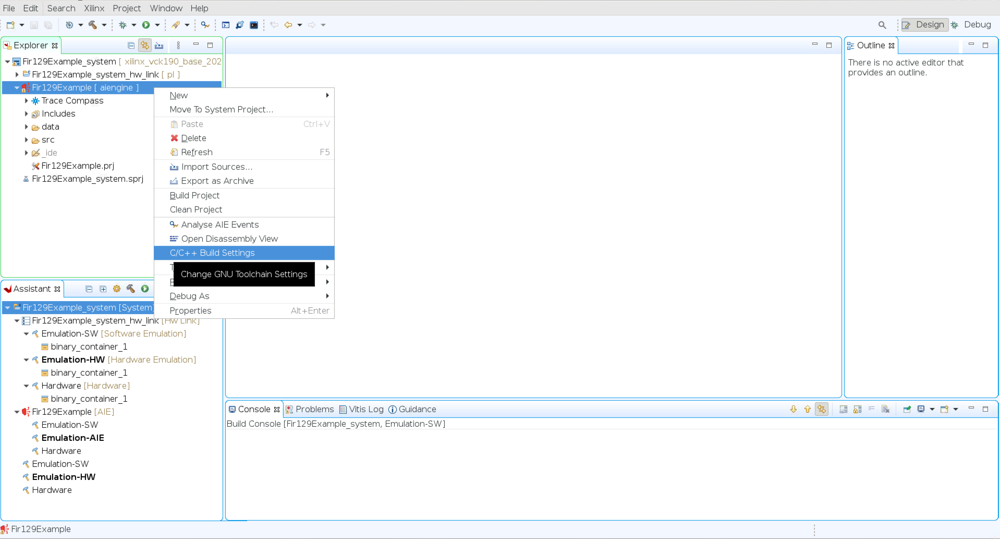
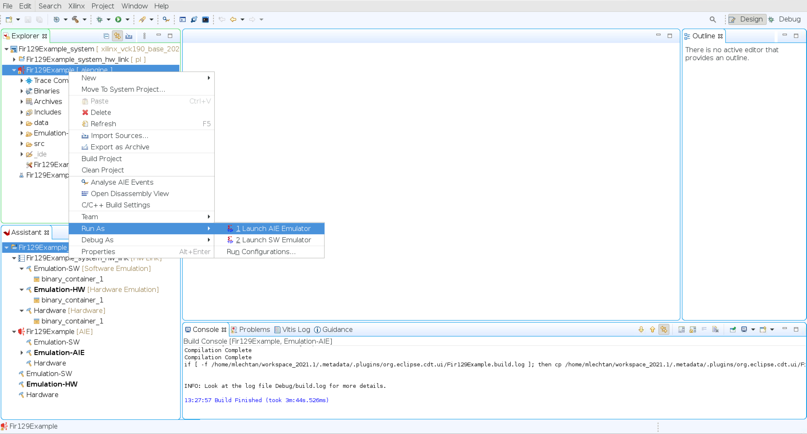

..
   Copyright 2021 Xilinx, Inc.

   Licensed under the Apache License, Version 2.0 (the "License");
   you may not use this file except in compliance with the License.
   You may obtain a copy of the License at

       http://www.apache.org/licenses/LICENSE-2.0

   Unless required by applicable law or agreed to in writing, software
   distributed under the License is distributed on an "AS IS" BASIS,
   WITHOUT WARRANTIES OR CONDITIONS OF ANY KIND, either express or implied.
   See the License for the specific language governing permissions and
   limitations under the License.

.. _2_DSP_LIB_FUNC:

*********************
DSP Library Functions
*********************

The Xilinx |reg| digital signal processing library (DSPLib) is a configurable library of kernels that can be used to develop applications on Versal |trade| ACAP AI Engines. This is an Open Source library for DSP applications. Kernels are coded in C++ and contain special functions called *intrinsics* that give access to AI Engine vector processing capabilities. Kernels can be combined to construct graphs for developing complex designs. An example design is provided with this library for your reference. Each kernel has a corresponding graph. It is highly recommended to use the library element's graph as the entry-point. See the :ref:`3_USING_EXAMPLES`  for more details.

.. _2_FILTERS:

=======
Filters
=======

The DSPLib contains several variants of Finite Impulse Response (FIR) filters. On the AI Engine processor, data is packetized into windows. In the case of FIRs, each window is extended by a margin so that the state of the filter at the end of the previous window may be restored before new computations begin. Therefore, to maximize performance, the window size should be set to the maximum that the system will allow, though this will lead to a corresponding increase in latency. However, this is a complex decision as multiple factors such as data movement and latency need to be taken into consideration.

.. note:: With a small window size (for example, 32), you pay a high penalty on the function call overhead. This means that the pre/post amble will be major cycle consumer in your function call.

FIR filters have been categorized into classes and placed in a distinct namespace scope: xf::dsp::aie::fir, to prevent name collision in the global scope. Namespace aliasing can be utilized to shorten instantiations:

.. code-block::

    namespace dsplib = xf::dsp::aie;

Additionally, each FIR filter has been placed in a unique FIR type namespace. The available FIR filter classes and the corresponding graph entry point are listed below:

*Table 1*: FIR Filter Classes

+----------------------------------+-----------------------------------------------------------+
|    **Function**                  |      **Namespace**                                        |
+==================================+===========================================================+
|    Single rate, asymmetrical     | dsplib::fir::sr_asym::fir_sr_asym_graph                   |
+----------------------------------+-----------------------------------------------------------+
|    Single rate, symmetrical      | dsplib::fir::sr_sym::fir_sr_sym_graph                     |
+----------------------------------+-----------------------------------------------------------+
| Interpolation asymmetrical       | dsplib::fir::interpolate_asym::fir_interpolate_asym_graph |
+----------------------------------+-----------------------------------------------------------+
| Decimation, halfband             | dsplib::fir::decimate_hb::fir_decimate_hb_graph           |
+----------------------------------+-----------------------------------------------------------+
| Interpolation, halfband          | dsplib::fir::interpolate_hb::fir_interpolate_hb_graph     |
+----------------------------------+-----------------------------------------------------------+
| Decimation, asymmetric           | dsplib::fir::decimate_asym::fir_decimate_asym_graph       |
+----------------------------------+-----------------------------------------------------------+
| Interpolation, fractional,       | dsplib::fir::interpolate_fract_asym::                     |
| asymmetric                       | fir_interpolate_fract_asym_graph                          |
+----------------------------------+-----------------------------------------------------------+
| Decimation, symmetric            | dsplib::fir::decimate_sym::fir_decimate_sym_graph         |
+----------------------------------+-----------------------------------------------------------+

Conventions for Filters
~~~~~~~~~~~~~~~~~~~~~~~

All FIR filters can be configured for various types of data and coefficients. These types can be int16, int32, or float, and also real or complex. However, configurations with real data versus complex coefficients are not supported nor are configurations where the coefficients are int32 and data is int16. Data and coefficients must both be integer types or both be float types, as mixes are not supported.

The following table lists the supported combinations of data type and coefficient type.

*Table 2*: Supported Combinations of Data Type and Coefficient Type

+-----------------------------------------------------------------------------------------------+
|                                 **Data Type**                                                 |
+=============+==========+===========+===========+==========+===========+==========+============+
|             |          | **Int16** |**Cint16** |**Int32** |**Cint32** |**Float** | **Cfloat** |
+-------------+----------+-----------+-----------+----------+-----------+----------+------------+
| Coefficient |**Int16** |Supported  |Supported  |Supported |Supported  |3         |3           |
| type        |          |           |           |          |           |          |            |
+-------------+----------+-----------+-----------+----------+-----------+----------+------------+
|             |**Cint16**|1          |Supported  |1         |Supported  | 3        |3           |
+-------------+----------+-----------+-----------+----------+-----------+----------+------------+
|             |**Int32** |2          |2          |Supported |Supported  | 3        | 3          |
+-------------+----------+-----------+-----------+----------+-----------+----------+------------+
|             |**Cint32**|1, 2       | 2         |1         |Supported  |3         |3           |
+-------------+----------+-----------+-----------+----------+-----------+----------+------------+
|             |**Float** |3          |3          | 3        |3          |Supported |Supported   |
+-------------+----------+-----------+-----------+----------+-----------+----------+------------+
|             |**Cfloat**| 3         |3          |3         | 3         | 3        |Supported   |
+-------------+----------+-----------+-----------+----------+-----------+----------+------------+
| 1. Complex coefficients are not supported for real-only data types.                           |
| 2. Coefficient type of higher precision than data type is not supported.                      |
| 3. A mix of float and integer types is not supported.                                         |
+-----------------------------------------------------------------------------------------------+

For all filters, the coefficient values are passed, not as template parameters, but as an array argument to the constructor for non-reloadable configurations, or to the reload function for reloadable configurations. In the case of symmetrical filters, only the first half (plus any odd centre tap) need be passed, as the remainder may be derived by symmetry. For halfband filters, only the non-zero coefficients should be entered, so the length of the array expected will be the (TP_FIR_LEN+1)/4 + 1 for the centre tap.

The following table lists parameters supported by all the FIR filters:

*Table 3*: Parameters Supported by FIR Filters

+------------------------+----------------+----------------+----------------+
| Parameter Name         |    Type        |  Description   |    Range       |
+========================+================+================+================+
|    TP_FIR_LEN          |    unsigned    | The number of  |    4 to 240    |
|                        |                | taps           |                |
+------------------------+----------------+----------------+----------------+
|    TP_RND              |    unsigned    | Round mode     |    0 =         |
|                        |    int         |                |    truncate or |
|                        |                |                |    floor       |
|                        |                |                |                |
|                        |                |                |    1 =         |
|                        |                |                |    ceiling     |
|                        |                |                |    (round up)  |
|                        |                |                |                |
|                        |                |                |    2 =         |
|                        |                |                |    positive    |
|                        |                |                |    infinity    |
|                        |                |                |                |
|                        |                |                |    3 =         |
|                        |                |                |    negative    |
|                        |                |                |    infinity    |
|                        |                |                |                |
|                        |                |                |    4 =         |
|                        |                |                |    symmetrical |
|                        |                |                |    to infinity |
|                        |                |                |    5 =         |
|                        |                |                |    symmetrical |
|                        |                |                |    to zero     |
|                        |                |                |                |
|                        |                |                |    6 =         |
|                        |                |                |    convergent  |
|                        |                |                |    to even     |
|                        |                |                |                |
|                        |                |                |    7 =         |
|                        |                |                |    convergent  |
|                        |                |                |    to odd      |
+------------------------+----------------+----------------+----------------+
|    TP_SHIFT            |    unsigned    | The number of  |    0 to 61     |
|                        |    int         | bits to shift  |                |
|                        |                | accumulation   |                |
|                        |                | down by before |                |
|                        |                | output.        |                |
+------------------------+----------------+----------------+----------------+
|    TT_DATA             |    typename    | Data Type      |    int16,      |
|                        |                |                |    cint16,     |
|                        |                |                |    int32,      |
|                        |                |                |    cint32,     |
|                        |                |                |    float,      |
|                        |                |                |    cfloat      |
+------------------------+----------------+----------------+----------------+
|    TT_COEFF            |    typename    | Coefficient    |    int16,      |
|                        |                | type           |    cint16,     |
|                        |                |                |    int32,      |
|                        |                |                |    cint32,     |
|                        |                |                |    float,      |
|                        |                |                |    cfloat      |
+------------------------+----------------+----------------+----------------+
| TP_INPUT_WINDOW_VSIZE  |    unsigned    | The number     |    Must be a   |
|                        |    int         | of samples     |    multiple of |
|                        |                | in the         |    the number  |
|                        |                | input          |    of lanes    |
|                        |                | window.        |    used        |
|                        |                |                |    (typically  |
|                        |                |                |    4 or 8). No |
|                        |                |                |    enforced    |
|                        |                |                |    range, but  |
|                        |                |                |    large       |
|                        |                |                |    windows     |
|                        |                |                |    will result |
|                        |                |                |    in mapper   |
|                        |                |                |    errors due  |
|                        |                |                |    to          |
|                        |                |                |    excessive   |
|                        |                |                |    RAM use.    |
+------------------------+----------------+----------------+----------------+
|    TP_CASC_LEN         |    unsigned    | The number     |    1 to 9.     |
|                        |    int         | of cascaded    |    Defaults to |
|                        |                | kernels to     |    1 if not    |
|                        |                | use for        |    set.        |
|                        |                | this FIR.      |                |
+------------------------+----------------+----------------+----------------+
|    TP_DUAL_IP          |    unsigned    | Use dual       |    Range 0     |
|                        |    int         | inputs (may    |    (single     |
|                        |                | increase       |    input), 1   |
|                        |                | throughput     |    (dual       |
|                        |                | for symmetrical|    input).     |
|                        |                | and halfband   |    Defaults to |
|                        |                | filters by     |    0 if not    |
|                        |                | avoiding load  |    set.        |
|                        |                | contention by  |                |
|                        |                | using a second |                |
|                        |                | RAM bank for   |                |
|                        |                | input).        |                |
+------------------------+----------------+----------------+----------------+
| TP_USE_COEFF_RELOAD    |    unsigned    | Enable         |    0 (no       |
|                        |    int         | reloadable     |    reload), 1  |
|                        |                | coefficient    |    (use        |
|                        |                | feature. An    |    reloads).   |
|                        |                | additional     |    Defaults to |
|                        |                | 'coeff' RTP    |    0 if not    |
|                        |                | port will      |    set.        |
|                        |                | appear on      |                |
|                        |                | the graph.     |                |
+------------------------+----------------+----------------+----------------+
| TP_NUM_OUTPUTS         |    unsigned    | Number of      |                |
|                        |    int         | fir output     |    >1          |
|                        |                | ports          |                |
+------------------------+----------------+----------------+----------------+

.. note:: The number of lanes is the number of data elements that is being processed in parallel, e.g., presented at the input window. This varies depending on the data type (i.e., number of bits in each element) and the register or bus width.

.. _2_FFT_IFFT:

========
FFT/iFFT
========

The DSPLib contains one FFT/iFFT solution. This is a single channel, decimation in time (DIT) implementation with configurable point size, data type, and FFT/iFFT function.

Point size may be any power of 2 from 16 to 4096, but this upper limit will be reduced to 2048 for cint16 data type and 1024 for cfloat or cint32 data type where the FFT kernel uses ping-pong window input. The 4096 limit may only be achieved where the FFT receives and outputs data to/from kernels on the same processor.

*Table 4*: FFT Parameters

+----------------------+----------------+----------------+----------------------------+
|    **Name**          |    **Type**    |   Description  |    **Range**               |
+======================+================+================+============================+
|    TT_DATA           |    Typename    |    The input   |  cint16,                   |
|                      |                |    data type   |  cint32,                   |
|                      |                |                |  cfloat                    |
+----------------------+----------------+----------------+----------------------------+
|    TT_TWIDDLE        |    Typename    |    The twiddle |  Set to cint16 for data    |
|                      |                |    factor type.|  type of cint16 or cint32  |
|                      |                |    Determined  |  and cfloat for data type  |
|                      |                |    by TT_DATA  |  of  cfloat.               |
|                      |                |                |                            |
+----------------------+----------------+----------------+----------------------------+
|  TP_POINT_SIZE       |    Unsigned    |    The number  |  2^N, where N is in the    |
|                      |    int         |    of samples  |  range 4 to 12, though     |
|                      |                |    in a frame  |  the upper limit may be    |
|                      |                |    to be       |  constrained by device     |
|                      |                |    processed   |  resources.                |
|                      |                |                |                            |
+----------------------+----------------+----------------+----------------------------+
|   TP_FFT_NIFFT       |    Unsigned    |    Forward or  |  0 (IFFT) or               |
|                      |    int         |    reverse     |  1 (FFT).                  |
|                      |                |    transform   |                            |
+----------------------+----------------+----------------+----------------------------+
|    TP_SHIFT          |    Unsigned    | The number of  |  0 to 61                   |
|                      |    int         | bits to shift  |                            |
|                      |                | accumulation   |                            |
|                      |                | down by before |                            |
|                      |                | output.        |                            |
+----------------------+----------------+----------------+----------------------------+
|    TP_CASC_LEN       |    Unsigned    | The number     |  1 to 12.                  |
|                      |    int         | of kernels     |  Defaults to 1             |
|                      |                | the FFT will   |  if not set.               |
|                      |                | be divided     |                            |
|                      |                | over.          |  Maximum is derived by the |
|                      |                |                |  number of radix 2 stages  |
|                      |                |                |  required for the given    |
|                      |                |                |  point size (N where       |
|                      |                |                |  pointSize = 2^N)          |
|                      |                |                |                            |
|                      |                |                |  For float data types the  |
|                      |                |                |  max is N.                 |
|                      |                |                |  For integer data types    |
|                      |                |                |  the max is CEIL(N/2).     |
+----------------------+----------------+----------------+----------------------------+
| TP_DYN_PT_SIZE       |    Unsigned    |    FFT point   |  2^N, where                |
|                      |    int         |    size        |  N is 2 to 12              |
+----------------------+----------------+----------------+----------------------------+
| TP_WINDOW_VSIZE      |    Unsigned    | The number     |  Must be a multiple of the |
|                      |    int         | of samples     |  number of lanes used      |
|                      |                | in the         |  (typically 4 or 8). No    |
|                      |                | input          |  enforced range, but large |
|                      |                | window.        |  windows will result in    |
|                      |                |                |  mapper errors due to      |
|                      |                |                |  excessive memory usage.   |
|                      |                |                |                            |
+----------------------+----------------+----------------+----------------------------+

.. note:: The number of lanes is the number of data elements that is being processed in parallel, e.g., presented at the input window. This varies depending on the data type (i.e., number of bits in each element) and the register or bus width.

This FFT implementation does not implement the 1/N scaling of an IFFT. Internally, for cint16 and cint32 data, an internal data type of cint32 is used. After each rank, the values are scaled by only enough to normalize the bit growth caused by the twiddle multiplication (i.e., 15 bits). Distortion caused by saturation will be possible for large point sizes and large values when the data type is cint32. In the final stage, the result is scaled by 17 bits for point size from 16 to 1024, by 18 for 2048, and by 19 for 4096.

No scaling is applied at any point when the data type is cfloat. The graph entry point is the following:

.. code-block::

    xf::dsp::aie::fft::fft_ifft_dit_1ch_graph

.. _2_MATRIX_MULTIPLY:

===============
Matrix Multiply
===============

The DSPLib contains one Matrix Multiply/GEMM (GEneral Matrix Multiply) solution. The gemm has two input ports connected to two windows of data. The inputs are denoted as Matrix A (inA) and Matrix B (inB). Matrix A has a template parameter TP_DIM_A to describe the number of rows of A. The number of columns of inA must be equal to the number of rows of inB. This is denoted with the template parameter TP_DIM_AB. The number of columns of B is denoted by TP_DIM_B.

An output port connects to a window, where the data for the output matrix will be stored. The output matrix will have rows = inA rows (TP_DIM_A) and columns = inB (TP_DIM_B) columns. The data type of both input matrices can be configured and the data type of the output is derived from the inputs.

*Table 5*: Matrix Multiply Parameters

+----------------------------+----------------+----------------+----------------+
|                **Name**    |    **Type**    |   Description  |    **Range**   |
+============================+================+================+================+
|                TT_DATA_A   |    Typename    |    The input   |    int16,      |
|                            |                |    data type   |    cint16,     |
|                            |                |                |    int32       |
|                            |                |                |    cint32      |
|                            |                |                |    float       |
|                            |                |                |    cfloat      |
+----------------------------+----------------+----------------+----------------+
|                TT_DATA_B   |    Typename    |    The input   |    int16,      |
|                            |                |    data type   |    cint16,     |
|                            |                |                |    int32       |
|                            |                |                |    cint32      |
|                            |                |                |    float       |
|                            |                |                |    cfloat      |
+----------------------------+----------------+----------------+----------------+
|                TP_DIM_A    | unsigned int   | The number of  |                |
|                            |                | elements along |                |
|                            |                | the unique     |                |
|                            |                | dimension      |                |
|                            |                | (rows) of      |                |
|                            |                | Matrix A       |                |
+----------------------------+----------------+----------------+----------------+
|                TP_DIM_AB   | unsigned int   | The number of  |                |
|                            |                | elements along |                |
|                            |                | the common     |                |
|                            |                | dimension      |                |
|                            |                | of Matrix A    |                |
|                            |                | (columns) and  |                |
|                            |                | Matrix B       |                |
|                            |                | (rows)         |                |
+----------------------------+----------------+----------------+----------------+
|                TP_DIM_B    | unsigned int   | The number of  |                |
|                            |                | elements along |                |
|                            |                | the unique     |                |
|                            |                | dimension      |                |
|                            |                | (rows) of      |                |
|                            |                | Matrix B       |                |
+----------------------------+----------------+----------------+----------------+
|                TP_SHIFT    | unsigned int   | power of 2     |   In range     |
|                            |                | shift down     |   0 to 61      |
|                            |                | applied to the |                |
|                            |                | accumulation   |                |
|                            |                | of product     |                |
|                            |                | terms before   |                |
|                            |                | each output    |                |
+----------------------------+----------------+----------------+----------------+
|                TP_RND      | unsigned int   | Round mode     |    0 =         |
|                            |                |                |    truncate or |
|                            |                |                |    floor       |
|                            |                |                |                |
|                            |                |                |    1 =         |
|                            |                |                |    ceiling     |
|                            |                |                |    (round up)  |
|                            |                |                |                |
|                            |                |                |    2 =         |
|                            |                |                |    positive    |
|                            |                |                |    infinity    |
|                            |                |                |                |
|                            |                |                |    3 =         |
|                            |                |                |    negative    |
|                            |                |                |    infinity    |
|                            |                |                |                |
|                            |                |                |    4 =         |
|                            |                |                |    symmetrical |
|                            |                |                |    to infinity |
|                            |                |                |    5 =         |
|                            |                |                |    symmetrical |
|                            |                |                |    to zero     |
|                            |                |                |                |
|                            |                |                |    6 =         |
|                            |                |                |    convergent  |
|                            |                |                |    to even     |
|                            |                |                |                |
|                            |                |                |    7 =         |
|                            |                |                |    convergent  |
|                            |                |                |    to odd      |
+----------------------------+----------------+----------------+----------------+
| TP_DIM_A_LEADING           | unsigned int   | The scheme in  | ROW_MAJOR = 0  |
|                            |                | which the data | COL_MAJOR = 1  |
|                            |                | should be      |                |
|                            |                | stored in      |                |
|                            |                | memory         |                |
+----------------------------+----------------+----------------+----------------+
| TP_DIM_B_LEADING           | unsigned int   | The scheme in  | ROW_MAJOR = 0  |
|                            |                | which the data | COL_MAJOR = 1  |
|                            |                | should be      |                |
|                            |                | stored in      |                |
|                            |                | memory         |                |
+----------------------------+----------------+----------------+----------------+
| TP_DIM_OUT_LEADING         | unsigned int   | The scheme in  | ROW_MAJOR = 0  |
|                            |                | which the data | COL_MAJOR = 1  |
|                            |                | should be      |                |
|                            |                | stored in      |                |
|                            |                | memory         |                |
+----------------------------+----------------+----------------+----------------+
| TP_ADD_TILING_A            | unsigned int   | Option to add  | 0 = rearrange  |
|                            |                | an additional  | externally to  |
|                            |                | kernel to      | the graph      |
|                            |                | rearrange      |                |
|                            |                | matrix samples |                |
+----------------------------+----------------+----------------+----------------+
| TP_ADD_TILING_B            | unsigned int   | Option to add  | 0 = rearrange  |
|                            |                | an additional  | externally to  |
|                            |                | kernel to      | the graph      |
|                            |                | rearrange      |                |
|                            |                | matrix samples |                |
+----------------------------+----------------+----------------+----------------+
|                            | unsigned int   | Option to add  | 0 = rearrange  |
| TP_ADD_DETILING_OUT        |                | an additional  | externally to  |
|                            |                | kernel to      | the graph      |
|                            |                | rearrange      |                |
|                            |                | matrix samples |                |
+----------------------------+----------------+----------------+----------------+
|                            |    unsigned    | The number     |  Must be of    |
| TP_WINDOW_VSIZE_A          |    int         | of samples     |  size          |
|                            |                | in the         |  TP_DIM_A*     |
|                            |                | input          |  TP_DIM_AB*N   |
|                            |                | window for     |  has a default |
|                            |                | Matrix A       |  value of      |
|                            |                |                |  TP_DIM_A*     |
|                            |                |                |  TP_DIM_AB     |
|                            |                |                |  (N=1)         |
+----------------------------+----------------+----------------+----------------+
|                            |    unsigned    | The number     |  Must be of    |
| TP_WINDOW_VSIZE_B          |    int         | of samples     |  size          |
|                            |                | in the         |  TP_DIM_B*     |
|                            |                | input          |  TP_DIM_AB*M   |
|                            |                | window for     |  has a default |
|                            |                | Matrix B       |  value of      |
|                            |                |                |  TP_DIM_B*     |
|                            |                |                |  TP_DIM_AB     |
|                            |                |                |  (M=1)         |
+----------------------------+----------------+----------------+----------------+
| TP_CASC_LEN                |    unsigned    | The number of  |  Defaults to   |
|                            |    int         | AIE tiles to   |  1 if not      |
|                            |                | split the      |  set.          |
|                            |                | operation into |                |
|                            |                |                |                |
|                            |                |                |                |
|                            |                |                |                |
|                            |                |                |                |
|                            |                |                |                |
+----------------------------+----------------+----------------+----------------+

Input matrices are processed in distinct blocks and matrix elements must be rearranged into a specific pattern.

The following table demonstrates how a 16x16 input matrix should be rearranged into a 4x4 tiling pattern.

.. note:: Indices are quoted assuming a row major matrix. A column major matrix needs to be transposed.

*Table 6*: Matrix Multiply 4x4 tiling pattern

+------------+-------------------------------+-------------------------------+-------------------------------+-------------------------------+
|            | Tile Col 0                    | Tile Col 1                    | Tile Col 2                    | Tile Col 3                    |
+============+=======+=======+=======+=======+=======+=======+=======+=======+=======+=======+=======+=======+=======+=======+=======+=======+
| Tile Row 0 |    0  |    1  |    2  |    3  |    4  |    5  |    6  |    7  |    8  |    9  |   10  |   11  |   12  |   13  |   14  |   15  |
|            +-------+-------+-------+-------+-------+-------+-------+-------+-------+-------+-------+-------+-------+-------+-------+-------+
|            |   16  |   17  |   18  |   19  |   20  |   21  |   22  |   23  |   24  |   25  |   26  |   27  |   28  |   29  |   30  |   31  |
|            +-------+-------+-------+-------+-------+-------+-------+-------+-------+-------+-------+-------+-------+-------+-------+-------+
|            |   32  |   33  |   34  |   35  |   36  |   37  |   38  |   39  |   40  |   41  |   42  |   43  |   44  |   45  |   46  |   47  |
|            +-------+-------+-------+-------+-------+-------+-------+-------+-------+-------+-------+-------+-------+-------+-------+-------+
|            |   48  |   49  |   50  |   51  |   52  |   53  |   54  |   55  |   56  |   57  |   58  |   59  |   60  |   61  |   62  |   63  |
+------------+-------+-------+-------+-------+-------+-------+-------+-------+-------+-------+-------+-------+-------+-------+-------+-------+
| Tile Row 1 |   64  |   65  |   66  |   67  |   68  |   69  |   70  |   71  |   72  |   73  |   74  |   75  |   76  |   77  |   78  |   79  |
|            +-------+-------+-------+-------+-------+-------+-------+-------+-------+-------+-------+-------+-------+-------+-------+-------+
|            |   80  |   81  |   82  |   83  |   84  |   85  |   86  |   87  |   88  |   89  |   90  |   91  |   92  |   93  |   94  |   95  |
|            +-------+-------+-------+-------+-------+-------+-------+-------+-------+-------+-------+-------+-------+-------+-------+-------+
|            |   96  |   97  |   98  |   99  |  100  |  101  |  102  |  103  |  104  |  105  |  106  |  107  |  108  |  109  |  110  |  111  |
|            +-------+-------+-------+-------+-------+-------+-------+-------+-------+-------+-------+-------+-------+-------+-------+-------+
|            |  112  |  113  |  114  |  115  |  116  |  117  |  118  |  119  |  120  |  121  |  122  |  123  |  124  |  125  |  126  |  127  |
+------------+-------+-------+-------+-------+-------+-------+-------+-------+-------+-------+-------+-------+-------+-------+-------+-------+
| Tile Row 2 |  128  |  129  |  130  |  131  |  132  |  133  |  134  |  135  |  136  |  137  |  138  |  139  |  140  |  141  |  142  |  143  |
|            +-------+-------+-------+-------+-------+-------+-------+-------+-------+-------+-------+-------+-------+-------+-------+-------+
|            |  144  |  145  |  146  |  147  |  148  |  149  |  150  |  151  |  152  |  153  |  154  |  155  |  156  |  157  |  158  |  159  |
|            +-------+-------+-------+-------+-------+-------+-------+-------+-------+-------+-------+-------+-------+-------+-------+-------+
|            |  160  |  161  |  162  |  163  |  164  |  165  |  166  |  167  |  168  |  169  |  170  |  171  |  172  |  173  |  174  |  175  |
|            +-------+-------+-------+-------+-------+-------+-------+-------+-------+-------+-------+-------+-------+-------+-------+-------+
|            |  176  |  177  |  178  |  179  |  180  |  181  |  182  |  183  |  184  |  185  |  186  |  187  |  188  |  189  |  190  |  191  |
+------------+-------+-------+-------+-------+-------+-------+-------+-------+-------+-------+-------+-------+-------+-------+-------+-------+
| Tile Row 3 |  192  |  193  |  194  |  195  |  196  |  197  |  198  |  199  |  200  |  201  |  202  |  203  |  204  |  205  |  206  |  207  |
|            +-------+-------+-------+-------+-------+-------+-------+-------+-------+-------+-------+-------+-------+-------+-------+-------+
|            |  208  |  209  |  210  |  211  |  212  |  213  |  214  |  215  |  216  |  217  |  218  |  219  |  220  |  221  |  222  |  223  |
|            +-------+-------+-------+-------+-------+-------+-------+-------+-------+-------+-------+-------+-------+-------+-------+-------+
|            |  224  |  225  |  226  |  227  |  228  |  229  |  230  |  231  |  232  |  233  |  234  |  235  |  236  |  237  |  238  |  239  |
|            +-------+-------+-------+-------+-------+-------+-------+-------+-------+-------+-------+-------+-------+-------+-------+-------+
|            |  240  |  241  |  242  |  243  |  244  |  245  |  246  |  247  |  248  |  249  |  250  |  251  |  252  |  253  |  254  |  255  |
+------------+-------+-------+-------+-------+-------+-------+-------+-------+-------+-------+-------+-------+-------+-------+-------+-------+

This is stored contigulously in memory like:

0, 1, 2, 3, 16, 17, 18, 19, 32, 33, 34, 35, 48, 49, 50, 51, 4, 5, 6, 7, 20, 21, 22, 23, 36, 37, 38, 39, 52, 53, 54, 55, 8, 9, 10, 11, 24, 25, 26, 27, 40, 41, 42, 43, 56, 57, 58, 59, 12, 13, 14, 15, 28, 29, 30, 31, 44, 45, 46, 47, 60, 61, 62, 63, 64, 65, 66, 67, 80, 81, 82, 83, 96, 97, 98, 99, 112, 113, 114, 115, ... , 204, 205, 206, 207, 220, 221, 222, 223, 236, 237, 238, 239, 252, 253, 254, 255

The following table demonstrates how a 16x16 input matrix should be rearranged into a 4x2 tiling pattern.

*Table 7*: Matrix Multiply 4x2 tiling pattern

+------------+---------------+---------------+---------------+---------------+---------------+---------------+---------------+---------------+
|            | Tile Col 0    | Tile Col 1    | Tile Col 2    | Tile Col 3    | Tile Col 4    | Tile Col 5    | Tile Col 6    | Tile Col 7    |
+============+=======+=======+=======+=======+=======+=======+=======+=======+=======+=======+=======+=======+=======+=======+=======+=======+
| Tile Row 0 |    0  |    1  |    2  |    3  |    4  |    5  |    6  |    7  |    8  |    9  |   10  |   11  |   12  |   13  |   14  |   15  |
|            +-------+-------+-------+-------+-------+-------+-------+-------+-------+-------+-------+-------+-------+-------+-------+-------+
|            |   16  |   17  |   18  |   19  |   20  |   21  |   22  |   23  |   24  |   25  |   26  |   27  |   28  |   29  |   30  |   31  |
|            +-------+-------+-------+-------+-------+-------+-------+-------+-------+-------+-------+-------+-------+-------+-------+-------+
|            |   32  |   33  |   34  |   35  |   36  |   37  |   38  |   39  |   40  |   41  |   42  |   43  |   44  |   45  |   46  |   47  |
|            +-------+-------+-------+-------+-------+-------+-------+-------+-------+-------+-------+-------+-------+-------+-------+-------+
|            |   48  |   49  |   50  |   51  |   52  |   53  |   54  |   55  |   56  |   57  |   58  |   59  |   60  |   61  |   62  |   63  |
+------------+-------+-------+-------+-------+-------+-------+-------+-------+-------+-------+-------+-------+-------+-------+-------+-------+
| Tile Row 1 |   64  |   65  |   66  |   67  |   68  |   69  |   70  |   71  |   72  |   73  |   74  |   75  |   76  |   77  |   78  |   79  |
|            +-------+-------+-------+-------+-------+-------+-------+-------+-------+-------+-------+-------+-------+-------+-------+-------+
|            |   80  |   81  |   82  |   83  |   84  |   85  |   86  |   87  |   88  |   89  |   90  |   91  |   92  |   93  |   94  |   95  |
|            +-------+-------+-------+-------+-------+-------+-------+-------+-------+-------+-------+-------+-------+-------+-------+-------+
|            |   96  |   97  |   98  |   99  |  100  |  101  |  102  |  103  |  104  |  105  |  106  |  107  |  108  |  109  |  110  |  111  |
|            +-------+-------+-------+-------+-------+-------+-------+-------+-------+-------+-------+-------+-------+-------+-------+-------+
|            |  112  |  113  |  114  |  115  |  116  |  117  |  118  |  119  |  120  |  121  |  122  |  123  |  124  |  125  |  126  |  127  |
+------------+-------+-------+-------+-------+-------+-------+-------+-------+-------+-------+-------+-------+-------+-------+-------+-------+
| Tile Row 2 |  128  |  129  |  130  |  131  |  132  |  133  |  134  |  135  |  136  |  137  |  138  |  139  |  140  |  141  |  142  |  143  |
|            +-------+-------+-------+-------+-------+-------+-------+-------+-------+-------+-------+-------+-------+-------+-------+-------+
|            |  144  |  145  |  146  |  147  |  148  |  149  |  150  |  151  |  152  |  153  |  154  |  155  |  156  |  157  |  158  |  159  |
|            +-------+-------+-------+-------+-------+-------+-------+-------+-------+-------+-------+-------+-------+-------+-------+-------+
|            |  160  |  161  |  162  |  163  |  164  |  165  |  166  |  167  |  168  |  169  |  170  |  171  |  172  |  173  |  174  |  175  |
|            +-------+-------+-------+-------+-------+-------+-------+-------+-------+-------+-------+-------+-------+-------+-------+-------+
|            |  176  |  177  |  178  |  179  |  180  |  181  |  182  |  183  |  184  |  185  |  186  |  187  |  188  |  189  |  190  |  191  |
+------------+-------+-------+-------+-------+-------+-------+-------+-------+-------+-------+-------+-------+-------+-------+-------+-------+
| Tile Row 3 |  192  |  193  |  194  |  195  |  196  |  197  |  198  |  199  |  200  |  201  |  202  |  203  |  204  |  205  |  206  |  207  |
|            +-------+-------+-------+-------+-------+-------+-------+-------+-------+-------+-------+-------+-------+-------+-------+-------+
|            |  208  |  209  |  210  |  211  |  212  |  213  |  214  |  215  |  216  |  217  |  218  |  219  |  220  |  221  |  222  |  223  |
|            +-------+-------+-------+-------+-------+-------+-------+-------+-------+-------+-------+-------+-------+-------+-------+-------+
|            |  224  |  225  |  226  |  227  |  228  |  229  |  230  |  231  |  232  |  233  |  234  |  235  |  236  |  237  |  238  |  239  |
|            +-------+-------+-------+-------+-------+-------+-------+-------+-------+-------+-------+-------+-------+-------+-------+-------+
|            |  240  |  241  |  242  |  243  |  244  |  245  |  246  |  247  |  248  |  249  |  250  |  251  |  252  |  253  |  254  |  255  |
+------------+-------+-------+-------+-------+-------+-------+-------+-------+-------+-------+-------+-------+-------+-------+-------+-------+

This is stored contigulously in memory like:

0, 1, 16, 17, 32, 33, 48, 49, 2, 3, 18, 19, 34, 35, 50, 51, ..., 206, 207, 222, 223, 238, 239, 254, 255

Multiplying a 16x16 matrix (with 4x4 tiling) with a 16x16 matrix (with 4x2 tiling) will result in a 16x16 matrix with 4x2 tiling.

The following table specifies the tiling scheme used for a given data type combination and the corresponding output data type:

*Table 8*: Matrix Multiply tiling pattern combination

+------------------------+----------------+--------------+
|Input Type Combination  |  Tiling Scheme |  Output Type |
+=========+==============+========+=======+==============+
| A       |        B     |    A   |    B  |              |
+---------+--------------+--------+-------+--------------+
|int16    |       int16  |    4x4 |   4x4 |   int16      |
+---------+--------------+--------+-------+--------------+
|int16    |       cint16 |   4x2  |   2x2 |   cint16     |
+---------+--------------+--------+-------+--------------+
|int16    |       int32  |  4x2   |   2x2 |   int32      |
+---------+--------------+--------+-------+--------------+
|int16    |       cint32 |    2x4 |  4x2  | cint32       |
+---------+--------------+--------+-------+--------------+
|cint16   |       int16  |     4x4|  4x2  |  cint16      |
+---------+--------------+--------+-------+--------------+
|cint16   |       cint16 |     4x4|  4x2  |  cint16      |
+---------+--------------+--------+-------+--------------+
|cint16   |       int32  |     4x4|  4x2  |  cint32      |
+---------+--------------+--------+-------+--------------+
|cint16   |       cint32 |     2x2|   2x2 |   cint32     |
+---------+--------------+--------+-------+--------------+
|int32    |       int16  |   4x4  |   4x2 |   int32      |
+---------+--------------+--------+-------+--------------+
|int32    |       int32  |    4x4 |  4x2  |    int32     |
+---------+--------------+--------+-------+--------------+
|int32    |       cint16 |    4x4 |  4x2  |  cint32      |
+---------+--------------+--------+-------+--------------+
|int32    |       cint32 |    2x2 |  2x2  |  cint32      |
+---------+--------------+--------+-------+--------------+
|cint32   |       int16  |    2x4 |  4x2  |  cint32      |
+---------+--------------+--------+-------+--------------+
|cint32   |       cint16 |    2x2 |  2x2  |  cint32      |
+---------+--------------+--------+-------+--------------+
|cint32   |       int32  |    2x2 |  2x2  |  cint32      |
+---------+--------------+--------+-------+--------------+
|cint32   |       cint32 |   2x2  |   2x2 |   cint32     |
+---------+--------------+--------+-------+--------------+
|float    |       float  |    4x4 |   4x2 |   float      |
+---------+--------------+--------+-------+--------------+
|float    |       cfloat |  2x4   |   4x2 |   cfloat     |
+---------+--------------+--------+-------+--------------+
|cfloat   |       float  |   2x4  |  4x2  |  cfloat      |
+---------+--------------+--------+-------+--------------+
|cfloat   |       cfloat |   4x2  |  2x2  |  cfloat      |
+---------+--------------+--------+-------+--------------+

The parameters TP_ADD_TILING_A, TP_ADD_TILING_B, and TP_ADD_DETILING_OUT control the inclusion of an additional pre-processing / post-processing kernel to perform the required data shuffling. When used with TP_DIM_A_LEADING, TP_DIM_B_LEADING, or TP_DIM_OUT_LEADING, the matrix is also transposed in the tiling kernel.

If the additional kernels are not selected, then the matrix multiply kernels assume incoming data is in the correct format, as specified above. When using the TP_CASC_LEN parameter, the matrix multiply operation is split across TP_DIM_AB and processed in a TP_CASC_LEN number of kernels. The accumulated partial results of each kernel is passed down the cascade port to the next kernel in the cascade chain until the final kernel provides the expected output. Cascade connections are made internally to the matrix multiply graph.

Each AI Engine kernel in the array is given a sub-matrix, so the interface to the graph is an array of ports for both A and B.

**Input Matrix A (16x16 - 4x4 Tile - Cascade Length 2)**:

*Table 9*: Input Matrix A (16x16 - 4x4 Tile - Cascade Length 2)

+------------+---------------------------------------------------------------+---------------------------------------------------------------+
|            | AIE 0                                                         | AIE 1                                                         |
+============+===============================+===============================+===============================+===============================+
|            | Tile Col 0                    | Tile Col 1                    | Tile Col 2                    | Tile Col 3                    |
+------------+-------+-------+-------+-------+-------+-------+-------+-------+-------+-------+-------+-------+-------+-------+-------+-------+
| Tile Row 0 |    0  |    1  |    2  |    3  |    4  |    5  |    6  |    7  |    8  |    9  |   10  |   11  |   12  |   13  |   14  |   15  |
|            +-------+-------+-------+-------+-------+-------+-------+-------+-------+-------+-------+-------+-------+-------+-------+-------+
|            |   16  |   17  |   18  |   19  |   20  |   21  |   22  |   23  |   24  |   25  |   26  |   27  |   28  |   29  |   30  |   31  |
|            +-------+-------+-------+-------+-------+-------+-------+-------+-------+-------+-------+-------+-------+-------+-------+-------+
|            |   32  |   33  |   34  |   35  |   36  |   37  |   38  |   39  |   40  |   41  |   42  |   43  |   44  |   45  |   46  |   47  |
|            +-------+-------+-------+-------+-------+-------+-------+-------+-------+-------+-------+-------+-------+-------+-------+-------+
|            |   48  |   49  |   50  |   51  |   52  |   53  |   54  |   55  |   56  |   57  |   58  |   59  |   60  |   61  |   62  |   63  |
+------------+-------+-------+-------+-------+-------+-------+-------+-------+-------+-------+-------+-------+-------+-------+-------+-------+
| Tile Row 1 |   64  |   65  |   66  |   67  |   68  |   69  |   70  |   71  |   72  |   73  |   74  |   75  |   76  |   77  |   78  |   79  |
|            +-------+-------+-------+-------+-------+-------+-------+-------+-------+-------+-------+-------+-------+-------+-------+-------+
|            |   80  |   81  |   82  |   83  |   84  |   85  |   86  |   87  |   88  |   89  |   90  |   91  |   92  |   93  |   94  |   95  |
|            +-------+-------+-------+-------+-------+-------+-------+-------+-------+-------+-------+-------+-------+-------+-------+-------+
|            |   96  |   97  |   98  |   99  |  100  |  101  |  102  |  103  |  104  |  105  |  106  |  107  |  108  |  109  |  110  |  111  |
|            +-------+-------+-------+-------+-------+-------+-------+-------+-------+-------+-------+-------+-------+-------+-------+-------+
|            |  112  |  113  |  114  |  115  |  116  |  117  |  118  |  119  |  120  |  121  |  122  |  123  |  124  |  125  |  126  |  127  |
+------------+-------+-------+-------+-------+-------+-------+-------+-------+-------+-------+-------+-------+-------+-------+-------+-------+
| Tile Row 2 |  128  |  129  |  130  |  131  |  132  |  133  |  134  |  135  |  136  |  137  |  138  |  139  |  140  |  141  |  142  |  143  |
|            +-------+-------+-------+-------+-------+-------+-------+-------+-------+-------+-------+-------+-------+-------+-------+-------+
|            |  144  |  145  |  146  |  147  |  148  |  149  |  150  |  151  |  152  |  153  |  154  |  155  |  156  |  157  |  158  |  159  |
|            +-------+-------+-------+-------+-------+-------+-------+-------+-------+-------+-------+-------+-------+-------+-------+-------+
|            |  160  |  161  |  162  |  163  |  164  |  165  |  166  |  167  |  168  |  169  |  170  |  171  |  172  |  173  |  174  |  175  |
|            +-------+-------+-------+-------+-------+-------+-------+-------+-------+-------+-------+-------+-------+-------+-------+-------+
|            |  176  |  177  |  178  |  179  |  180  |  181  |  182  |  183  |  184  |  185  |  186  |  187  |  188  |  189  |  190  |  191  |
+------------+-------+-------+-------+-------+-------+-------+-------+-------+-------+-------+-------+-------+-------+-------+-------+-------+
| Tile Row 3 |  192  |  193  |  194  |  195  |  196  |  197  |  198  |  199  |  200  |  201  |  202  |  203  |  204  |  205  |  206  |  207  |
|            +-------+-------+-------+-------+-------+-------+-------+-------+-------+-------+-------+-------+-------+-------+-------+-------+
|            |  208  |  209  |  210  |  211  |  212  |  213  |  214  |  215  |  216  |  217  |  218  |  219  |  220  |  221  |  222  |  223  |
|            +-------+-------+-------+-------+-------+-------+-------+-------+-------+-------+-------+-------+-------+-------+-------+-------+
|            |  224  |  225  |  226  |  227  |  228  |  229  |  230  |  231  |  232  |  233  |  234  |  235  |  236  |  237  |  238  |  239  |
|            +-------+-------+-------+-------+-------+-------+-------+-------+-------+-------+-------+-------+-------+-------+-------+-------+
|            |  240  |  241  |  242  |  243  |  244  |  245  |  246  |  247  |  248  |  249  |  250  |  251  |  252  |  253  |  254  |  255  |
+------------+-------+-------+-------+-------+-------+-------+-------+-------+-------+-------+-------+-------+-------+-------+-------+-------+

**Input Matrix B (16x16 - 4x2 Tile - Cascade Length 2)**:

*Table 10*: Input Matrix B (16x16 - 4x2 Tile - Cascade Length 2)

+------------+------------+---------------+---------------+---------------+---------------+---------------+---------------+---------------+---------------+
|            |            | Tile Col 0    | Tile Col 1    | Tile Col 2    | Tile Col 3    | Tile Col 4    | Tile Col 5    | Tile Col 6    | Tile Col 7    |
+============+============+=======+=======+=======+=======+=======+=======+=======+=======+=======+=======+=======+=======+=======+=======+=======+=======+
| AIE 0      | Tile Row 0 |    0  |    1  |    2  |    3  |    4  |    5  |    6  |    7  |    8  |    9  |   10  |   11  |   12  |   13  |   14  |   15  |
|            |            +-------+-------+-------+-------+-------+-------+-------+-------+-------+-------+-------+-------+-------+-------+-------+-------+
|            |            |   16  |   17  |   18  |   19  |   20  |   21  |   22  |   23  |   24  |   25  |   26  |   27  |   28  |   29  |   30  |   31  |
|            |            +-------+-------+-------+-------+-------+-------+-------+-------+-------+-------+-------+-------+-------+-------+-------+-------+
|            |            |   32  |   33  |   34  |   35  |   36  |   37  |   38  |   39  |   40  |   41  |   42  |   43  |   44  |   45  |   46  |   47  |
|            |            +-------+-------+-------+-------+-------+-------+-------+-------+-------+-------+-------+-------+-------+-------+-------+-------+
|            |            |   48  |   49  |   50  |   51  |   52  |   53  |   54  |   55  |   56  |   57  |   58  |   59  |   60  |   61  |   62  |   63  |
|            +------------+-------+-------+-------+-------+-------+-------+-------+-------+-------+-------+-------+-------+-------+-------+-------+-------+
|            | Tile Row 1 |   64  |   65  |   66  |   67  |   68  |   69  |   70  |   71  |   72  |   73  |   74  |   75  |   76  |   77  |   78  |   79  |
|            |            +-------+-------+-------+-------+-------+-------+-------+-------+-------+-------+-------+-------+-------+-------+-------+-------+
|            |            |   80  |   81  |   82  |   83  |   84  |   85  |   86  |   87  |   88  |   89  |   90  |   91  |   92  |   93  |   94  |   95  |
|            |            +-------+-------+-------+-------+-------+-------+-------+-------+-------+-------+-------+-------+-------+-------+-------+-------+
|            |            |   96  |   97  |   98  |   99  |  100  |  101  |  102  |  103  |  104  |  105  |  106  |  107  |  108  |  109  |  110  |  111  |
|            |            +-------+-------+-------+-------+-------+-------+-------+-------+-------+-------+-------+-------+-------+-------+-------+-------+
|            |            |  112  |  113  |  114  |  115  |  116  |  117  |  118  |  119  |  120  |  121  |  122  |  123  |  124  |  125  |  126  |  127  |
+------------+------------+-------+-------+-------+-------+-------+-------+-------+-------+-------+-------+-------+-------+-------+-------+-------+-------+
| AIE 1      | Tile Row 2 |  128  |  129  |  130  |  131  |  132  |  133  |  134  |  135  |  136  |  137  |  138  |  139  |  140  |  141  |  142  |  143  |
|            |            +-------+-------+-------+-------+-------+-------+-------+-------+-------+-------+-------+-------+-------+-------+-------+-------+
|            |            |  144  |  145  |  146  |  147  |  148  |  149  |  150  |  151  |  152  |  153  |  154  |  155  |  156  |  157  |  158  |  159  |
|            |            +-------+-------+-------+-------+-------+-------+-------+-------+-------+-------+-------+-------+-------+-------+-------+-------+
|            |            |  160  |  161  |  162  |  163  |  164  |  165  |  166  |  167  |  168  |  169  |  170  |  171  |  172  |  173  |  174  |  175  |
|            |            +-------+-------+-------+-------+-------+-------+-------+-------+-------+-------+-------+-------+-------+-------+-------+-------+
|            |            |  176  |  177  |  178  |  179  |  180  |  181  |  182  |  183  |  184  |  185  |  186  |  187  |  188  |  189  |  190  |  191  |
|            +------------+-------+-------+-------+-------+-------+-------+-------+-------+-------+-------+-------+-------+-------+-------+-------+-------+
|            | Tile Row 3 |  192  |  193  |  194  |  195  |  196  |  197  |  198  |  199  |  200  |  201  |  202  |  203  |  204  |  205  |  206  |  207  |
|            |            +-------+-------+-------+-------+-------+-------+-------+-------+-------+-------+-------+-------+-------+-------+-------+-------+
|            |            |  208  |  209  |  210  |  211  |  212  |  213  |  214  |  215  |  216  |  217  |  218  |  219  |  220  |  221  |  222  |  223  |
|            |            +-------+-------+-------+-------+-------+-------+-------+-------+-------+-------+-------+-------+-------+-------+-------+-------+
|            |            |  224  |  225  |  226  |  227  |  228  |  229  |  230  |  231  |  232  |  233  |  234  |  235  |  236  |  237  |  238  |  239  |
|            |            +-------+-------+-------+-------+-------+-------+-------+-------+-------+-------+-------+-------+-------+-------+-------+-------+
|            |            |  240  |  241  |  242  |  243  |  244  |  245  |  246  |  247  |  248  |  249  |  250  |  251  |  252  |  253  |  254  |  255  |
+------------+------------+-------+-------+-------+-------+-------+-------+-------+-------+-------+-------+-------+-------+-------+-------+-------+-------+

The graph entry point is the following:

.. code-block::

    xf::dsp::aie::blas::matrix_mult::matrix_mult_graph

Find a full list of descriptions and parameters in the :ref:`4_API_REFRENCE`.

Connections to the cascade ports can be made as follows:

.. code-block::

    for (int i = 0 ; i < P_CASC_LEN; i++) {
        connect<>(inA[i], mmultGraph.inA[i]);
        connect<>(inB[i], mmultGraph.inB[i]);
    }
    connect<>(mmultGraph.out, out);

.. _2_WIDGETS:

=======
Widgets
=======

Widget API Cast
~~~~~~~~~~~~~~~

The DSPLib contains a Widget API Cast solution, which provides flexibilty when connecting other kernels. This component is able to change the stream interface to window interface and vice-versa. It may be configured to read two input stream interfaces and interleave data onto an output window interface. In addition, multiple copies of output window may be configured to allow extra flexibility when connecting to further kernels.

*Table 11*: Widget API Cast Parameters

+-----------------------+----------------+----------------+----------------+
|           **Name**    |    **Type**    |   Description  |    **Range**   |
+=======================+================+================+================+
|           TT_DATA     |    typename    | Data Type      |    int16,      |
|                       |                |                |    cint16,     |
|                       |                |                |    int32,      |
|                       |                |                |    cint32,     |
|                       |                |                |    float,      |
|                       |                |                |    cfloat      |
+-----------------------+----------------+----------------+----------------+
|           TP_IN_API   |    Unsigned    | The input      |  0 = window,   |
|                       |    int         | interface type |  1 = stream    |
|                       |                |                |                |
+-----------------------+----------------+----------------+----------------+
|          TP_OUT_API   |    Typename    | The output     |  0 = window,   |
|                       |    int         | interface type |  1 = stream    |
|                       |                |                |                |
+-----------------------+----------------+----------------+----------------+
|         TP_NUM_INPUTS |    Unsigned    | The number of  |  1 - 2         |
|                       |    int         | input stream   |                |
|                       |                | interfaces     |                |
|                       |                | to be          |                |
|                       |                | processed      |                |
|                       |                |                |                |
+-----------------------+----------------+----------------+----------------+
|       TP_WINDOW_VSIZE |    Unsigned    | The number     |  Must be a     |
|                       |    int         | of samples     |  multiple of   |
|                       |                | in the input   |  the number    |
|                       |                | window         |  of lanes      |
|                       |                |                |  used          |
|                       |                |                |  (typically    |
|                       |                |                |  4 or 8). No   |
|                       |                |                |  enforced      |
|                       |                |                |  range, but    |
|                       |                |                |  large         |
|                       |                |                |  windows       |
|                       |                |                |  will result   |
|                       |                |                |  in mapper     |
|                       |                |                |  errors due    |
|                       |                |                |  to            |
|                       |                |                |  excessive     |
|                       |                |                |  RAM use.      |
|                       |                |                |                |
|                       |                |                |                |
+-----------------------+----------------+----------------+----------------+
| TP_NUM_OUTPUT_CLONES  |    Unsigned    | The number     |  1 - 4         |
|                       |    int         | of output      |                |
|                       |                | window         |                |
|                       |                | ports to write |                |
|                       |                | the input data |                |
|                       |                | to.            |                |
|                       |                |                |                |
+-----------------------+----------------+----------------+----------------+

.. note:: The number of lanes is the number of data elements that is being processed in parallel, e.g., presented at the input window. This varies depending on the data type (i.e., number of bits in each element) and the register or bus width.

The graph entry point is the following:

.. code-block::

    xf::dsp::aie::widget::api_cast::widget_api_cast_graph

Widget Real to Complex
~~~~~~~~~~~~~~~~~~~~~~~

The DSPLib contains a Widget Real to Complex solution, which provides a utility to convert real data to complex or vice versa.

*Table 12*: Widget Real to Complex Parameters

+-----------------+----------------+----------------+----------------+
|     **Name**    |    **Type**    |   Description  |    **Range**   |
+=================+================+================+================+
|     TT_DATA     |    typename    | Data Type      |    int16,      |
|                 |                |                |    cint16,     |
|                 |                |                |    int32,      |
|                 |                |                |    cint32,     |
|                 |                |                |    float,      |
|                 |                |                |    cfloat      |
+-----------------+----------------+----------------+----------------+
|  TT_OUT_DATA    |    typename    | Data Type      |    int16,      |
|                 |                |                |    cint16,     |
|                 |                |                |    int32,      |
|                 |                |                |    cint32,     |
|                 |                |                |    float,      |
|                 |                |                |    cfloat      |
+-----------------+----------------+----------------+----------------+
| TP_WINDOW_VSIZE |    Unsigned    | The number     |  Must be a     |
|                 |    int         | of samples     |  multiple of   |
|                 |                | in the input   |  the number    |
|                 |                | window         |  of lanes      |
|                 |                |                |  used          |
|                 |                |                |  (typically    |
|                 |                |                |  4 or 8). No   |
|                 |                |                |  enforced      |
|                 |                |                |  range, but    |
|                 |                |                |  large         |
|                 |                |                |  windows       |
|                 |                |                |  will result   |
|                 |                |                |  in mapper     |
|                 |                |                |  errors due    |
|                 |                |                |  to            |
|                 |                |                |  excessive     |
|                 |                |                |  RAM use.      |
|                 |                |                |                |
|                 |                |                |                |
+-----------------+----------------+----------------+----------------+

.. note:: The number of lanes is the number of data elements that is being processed in parallel, e.g., presented at the input window. This varies depending on the data type (i.e., number of bits in each element) and the register or bus width.

The graph entry point is the following:

.. code-block::

    xf::dsp::aie::widget::api_cast::widget_api_cast_graph

.. _2_COMPILING_AND_SIMULATING:

===========================================
Compiling and Simulating Using the Makefile
===========================================

A Makefile is included with each library element. It is located in the `L2/tests/aie/<library_element>` directory. Each Makefile holds default values for each of the library element parameters. These values can be edited as required to configure the library element for your needs.

Prerequisites:

.. code-block::

        source <your-Vitis-install-path>/lin64/Vitis/HEAD/settings64.csh
        setenv PLATFORM_REPO_PATHS <your-platform-repo-install-path>
        source <your-XRT-install-path>/xbb/xrt/packages/xrt-2.1.0-centos/opt/xilinx/xrt/setup.csh
        setenv DSPLIB_ROOT <your-Vitis-libraries-install-path/dsp>

Use the following steps to compile, simulate the reference model with the x86sim target and the AIE graphs using AIE emulation plaftorm. The output of the reference model ( `logs/ref_output.txt` ) is verified against the output of the AIE graphs ( `logs/uut_output.txt` ).

.. code-block::

        make run

To overwrite the default parameters, add desired parameters as arguments to the make command, for example:

.. code-block::

        make run DATA_TYPE=cint16 SHIFT=16

For list of all the configurable parameters, see the :ref:`2_CONFIGURATION_PARAMETERS`.

List of all Makefile targets:

.. code-block::

        make all TARGET=<aiesim/x86sim/hw_emu/hw> DEVICE=<FPGA platform> HOST_ARCH=<aarch64>
            Command to generate the design for specified Target and Shell.

        make clean
            Command to remove the generated non-hardware files.

        make cleanall
            Command to remove all the generated files.

        make sd_card TARGET=<aiesim/x86sim/hw_emu/hw> DEVICE=<FPGA platform> HOST_ARCH=<aarch64>
            Command to prepare sd_card files.
            This target is only used in embedded device.

        make run TARGET=<aiesim/x86sim/hw_emu/hw> DEVICE=<FPGA platform> HOST_ARCH=<aarch64>
            Command to run application in emulation or on board.

        make build TARGET=<aiesim/x86sim/hw_emu/hw> DEVICE=<FPGA platform> HOST_ARCH=<aarch64>
            Command to build xclbin application.

        make host HOST_ARCH=<aarch64>
            Command to build host application.

.. note:: For embedded devices like vck190, env variable SYSROOT, EDGE_COMMON_SW and PERL need to be set first, and HOST_ARCH is either aarch32 or aarch64. For example,

            .. code-block::

                export SYSROOT=< path-to-platform-sysroot >
                export EDGE_COMMON_SW=< path-to-rootfs-and-Image-files >
                export PERL=<path-to-perl-installation-location >

Simulation results and diff results are located in the in `L2/tests/aie/<library_element>/logs/status.txt` file. To perform a x86 compilation/simulation, run

.. code-block::

    make run TARGET=x86sim.

It is also possible to randomly generate coefficient and input data, or to generate specific stimulus patterns like ALL_ONES, IMPULSE, etc. by running

.. code-block::

      make run STIM_TYPE=4.

L2 Library Element Unit Test
~~~~~~~~~~~~~~~~~~~~~~~~~~~~

Each library element category comes supplied with a test harness which is an example of how to use the library element subgraph in the context of a super-graph. These test harnesses (graphs) can be found in the `L2/tests/aie/<library_element>/test.hpp` and `L2/tests/aie/<library_element>/test.cpp` file.

Each library element filter category also has a reference model which is used by the test harness. The reference models graphs are to be found in the `L2/tests/aie/inc/<library_element>_ref_graph.hpp` file.

Although it is recommended that only L2 (graphs) library elements are instantiated directly in user code, the kernels underlying the graphs can be found in the `L1/include/aie/<library_element>.hpp` and the `L1/src/aie/<library_element>.cpp` files.

An example of how a library element may be configured by a parent graph is provided in the `L2/examples/fir_129t_sym` folder. The example graph, test.h, in the `L2/examples/fir_129t_sym` folder instantiates the fir_sr_sym graph configured to be a 129-tap filter. This example exposes the ports such that the parent graph can be used to replace an existing 129-tap symmetric filter point solution design.

.. _2_CONFIGURATION_PARAMETERS:

L2 Library Element Configuration Parameters
~~~~~~~~~~~~~~~~~~~~~~~~~~~~~~~~~~~~~~~~~~~

.. _2_CONFIGURATION_PARAMETERS_FILTERS:

L2 FIR configuration parameters
-------------------------------

The list below consists of configurable parameters for FIR library elements with their default values.

*Table 13*: L2 FIR configuration parameters

+------------------------+----------------+----------------+--------------------------------------+
|     **Name**           |    **Type**    |  **Default**   |   Description                        |
+========================+================+================+======================================+
| DATA_TYPE              |    typename    |    cint16      | Data Type.                           |
|                        |                |                |                                      |
+------------------------+----------------+----------------+--------------------------------------+
| COEFF_TYPE             |    typename    |    int16       | Coefficient Type.                    |
|                        |                |                |                                      |
+------------------------+----------------+----------------+--------------------------------------+
| FIR_LEN                |    unsigned    |    81          | FIR length.                          |
|                        |                |                |                                      |
+------------------------+----------------+----------------+--------------------------------------+
| SHIFT                  |    unsigned    |    16          | Acc results shift down value.        |
|                        |                |                |                                      |
+------------------------+----------------+----------------+--------------------------------------+
| ROUND_MODE             |    unsigned    |    0           | Rounding mode.                       |
|                        |                |                |                                      |
+------------------------+----------------+----------------+--------------------------------------+
| INPUT_WINDOW_VSIZE     |    unsigned    |    512         | Input window size.                   |
|                        |                |                |                                      |
+------------------------+----------------+----------------+--------------------------------------+
| CASC_LEN               |    unsigned    |    1           | Cascade length.                      |
|                        |                |                |                                      |
+------------------------+----------------+----------------+--------------------------------------+
| INTERPOLATE_FACTOR     |    unsigned    |    1           | Interpolation factor,                |
|                        |                |                | see note below                       |
+------------------------+----------------+----------------+--------------------------------------+
| DECIMATE_FACTOR        |    unsigned    |    1           | Decimation factor,                   |
|                        |                |                | see note below                       |
+------------------------+----------------+----------------+--------------------------------------+
| DUAL_IP                |    unsigned    |    0           | Dual inputs used in symmetric FIRs,  |
|                        |                |                | see note below                       |
+------------------------+----------------+----------------+--------------------------------------+
| NITER                  |    unsigned    |    16          | Number of iterations to execute.     |
|                        |                |                |                                      |
+------------------------+----------------+----------------+--------------------------------------+
| GEN_INPUT_DATA         |    bool        |    true        | Generate input data samples.         |
|                        |                |                | When true, generate stimulus data    |
|                        |                |                | as defined in: DATA_STIM_TYPE.       |
|                        |                |                | When false, use the input file       |
|                        |                |                | defined in: INPUT_FILE               |
|                        |                |                |                                      |
+------------------------+----------------+----------------+--------------------------------------+
| GEN_COEFF_DATA         |    bool        |    true        | Generate random coefficients.        |
|                        |                |                | When true, generate stimulus data    |
|                        |                |                | as defined in: COEFF_STIM_TYPE.      |
|                        |                |                | When false, use the coefficient file |
|                        |                |                | defined in: COEFF_FILE               |
|                        |                |                |                                      |
+------------------------+----------------+----------------+--------------------------------------+
| DATA_STIM_TYPE         |    unsigned    |    0           | Supported types:                     |
|                        |                |                | 0 - random                           |
|                        |                |                | 3 - impulse                          |
|                        |                |                | 4 - all ones                         |
|                        |                |                | 5 - incrementing pattern             |
|                        |                |                | 6 - sym incrementing pattern         |
|                        |                |                | 8 - sine wave                        |
|                        |                |                |                                      |
+------------------------+----------------+----------------+--------------------------------------+
| COEFF_STIM_TYPE        |    unsigned    |    0           | Supported types:                     |
|                        |                |                | 0 - random                           |
|                        |                |                | 3 - impulse                          |
|                        |                |                | 4 - all ones                         |
|                        |                |                | 5 - incrementing pattern             |
|                        |                |                | 6 - sym incrementing pattern         |
|                        |                |                | 8 - sine wave                        |
|                        |                |                |                                      |
+------------------------+----------------+----------------+--------------------------------------+
| INPUT_FILE             |    string      | data/input.txt | Input data samples file.             |
|                        |                |                | Only used when GEN_INPUT_DATA=false. |
|                        |                |                |                                      |
+------------------------+----------------+----------------+--------------------------------------+
| COEFF_FILE             |    string      | data/coeff.txt | Coefficient data file.               |
|                        |                |                | Only used when GEN_COEFF_DATA=false. |
|                        |                |                |                                      |
+------------------------+----------------+----------------+--------------------------------------+

.. note:: The above configurable parameters range may exceed a library element's maximum supported range, in which case the compilation will end with a static_assert error informing about the exceeded range.

.. note:: Not all dsplib elements support all of the above configurable parameters. Unsupported parameters which are not used have no impact on execution, e.g., parameter `INTERPOLATE_FACTOR` is only supported by interpolation filters and will be ignored by other library elements.

.. _2_CONFIGURATION_PARAMETERS_FFT:

L2 FFT configuration parameters
-------------------------------

For the FFT/iFFT library element the list of configurable parameters and default values is presented below.

*Table 14*: L2 FFT configuration parameters

+------------------------+----------------+----------------+--------------------------------------+
|     **Name**           |    **Type**    |  **Default**   |   Description                        |
+========================+================+================+======================================+
| DATA_TYPE              |    typename    |    cint16      | Data Type.                           |
|                        |                |                |                                      |
+------------------------+----------------+----------------+--------------------------------------+
| TWIDDLE_TYPE           |    typename    |    cint16      | Twiddle Type.                        |
|                        |                |                |                                      |
+------------------------+----------------+----------------+--------------------------------------+
| POINT_SIZE             |    unsigned    |    1024        | FFT point size.                      |
|                        |                |                |                                      |
+------------------------+----------------+----------------+--------------------------------------+
| SHIFT                  |    unsigned    |    17          | Acc results shift down value.        |
|                        |                |                |                                      |
+------------------------+----------------+----------------+--------------------------------------+
| FFT_NIFFT              |    unsigned    |    0           | Forward (1) or reverse (0) transform.|
|                        |                |                |                                      |
+------------------------+----------------+----------------+--------------------------------------+
| WINDOW_VSIZE           |    unsigned    |    1024        | Input/Output window size.            |
|                        |                |                | By default, set to: $(POINT_SIZE).   |
+------------------------+----------------+----------------+--------------------------------------+
| CASC_LEN               |    unsigned    |    1           | Cascade length.                      |
|                        |                |                |                                      |
+------------------------+----------------+----------------+--------------------------------------+
| DYN_PT_SIZE            |    unsigned    |    0           | Enable (1) Dynamic Point size        |
|                        |                |                | feature.                             |
+------------------------+----------------+----------------+--------------------------------------+
| NITER                  |    unsigned    |    4           | Number of iterations to execute.     |
|                        |                |                |                                      |
+------------------------+----------------+----------------+--------------------------------------+
| GEN_INPUT_DATA         |    bool        |    true        | Generate random input data samples.  |
|                        |                |                | When false, use the input file       |
|                        |                |                | defined in: INPUT_FILE               |
|                        |                |                |                                      |
+------------------------+----------------+----------------+--------------------------------------+
| STIM_TYPE              |    unsigned    |    0           | Supported types:                     |
|                        |                |                | 0 - random                           |
|                        |                |                | 3 - impulse                          |
|                        |                |                | 4 - all ones                         |
|                        |                |                | 5 - incrementing pattern             |
|                        |                |                | 6 - sym incrementing pattern         |
|                        |                |                | 8 - sine wave                        |
|                        |                |                |                                      |
+------------------------+----------------+----------------+--------------------------------------+
| INPUT_FILE             |    string      | data/input.txt | Input data samples file.             |
|                        |                |                | Only used when GEN_INPUT_DATA=false. |
|                        |                |                |                                      |
+------------------------+----------------+----------------+--------------------------------------+

.. note:: The above configurable parameters range may exceed a library element's maximum supported range, in which case the compilation will end with a static_assert error informing about the exceeded range.

.. _2_CONFIGURATION_PARAMETERS_GEMM:

L2 Matrix Multiply Configuration Parameters
-------------------------------------------

For the Matrix Multiply (GeMM) library element the list of configurable parameters and default values is presented below.

*Table 15*: L2 Matrix Multiply configuration parameters

+------------------------+----------------+----------------+--------------------------------------+
|     **Name**           |    **Type**    |  **Default**   |   Description                        |
+========================+================+================+======================================+
| T_DATA_A               |    typename    |    cint16      | Input A Data Type.                   |
|                        |                |                |                                      |
+------------------------+----------------+----------------+--------------------------------------+
| T_DATA_B               |    typename    |    cint16      | Input B Data Type.                   |
|                        |                |                |                                      |
+------------------------+----------------+----------------+--------------------------------------+
| P_DIM_A                |    unsigned    |    16          | Input A Dimension                    |
|                        |                |                |                                      |
+------------------------+----------------+----------------+--------------------------------------+
| P_DIM_AB               |    unsigned    |    16          | Input AB Common Dimension.           |
|                        |                |                |                                      |
+------------------------+----------------+----------------+--------------------------------------+
| P_DIM_B                |    unsigned    |    16          | Input B Dimension.                   |
|                        |                |                |                                      |
+------------------------+----------------+----------------+--------------------------------------+
| SHIFT                  |    unsigned    |    20          | Acc results shift down value.        |
|                        |                |                |                                      |
+------------------------+----------------+----------------+--------------------------------------+
| ROUND_MODE             |    unsigned    |    0           | Rounding mode.                       |
|                        |                |                |                                      |
+------------------------+----------------+----------------+--------------------------------------+
| P_CASC_LEN             |    unsigned    |    1           | Cascade length.                      |
|                        |                |                |                                      |
+------------------------+----------------+----------------+--------------------------------------+
| P_DIM_A_LEADING        |    unsigned    |    0           | ROW_MAJOR = 0                        |
|                        |                |                | COL_MAJOR = 1                        |
+------------------------+----------------+----------------+--------------------------------------+
| P_DIM_B_LEADING        |    unsigned    |    1           | ROW_MAJOR = 0                        |
|                        |                |                | COL_MAJOR = 1                        |
+------------------------+----------------+----------------+--------------------------------------+
| P_DIM_OUT_LEADING      |    unsigned    |    0           | ROW_MAJOR = 0                        |
|                        |                |                | COL_MAJOR = 1                        |
+------------------------+----------------+----------------+--------------------------------------+
| P_ADD_TILING_A         |    unsigned    |    1           | no additional tiling kernel = 0      |
|                        |                |                | add additional tiling kernel = 1     |
+------------------------+----------------+----------------+--------------------------------------+
| P_ADD_TILING_B         |    unsigned    |    1           | no additional tiling kernel = 0      |
|                        |                |                | add additional tiling kernel = 1     |
+------------------------+----------------+----------------+--------------------------------------+
| P_ADD_DETILING_OUT     |    unsigned    |    1           | no additional detiling kernel = 0    |
|                        |                |                | add additional detiling kernel = 1   |
+------------------------+----------------+----------------+--------------------------------------+
| NITER                  |    unsigned    |    16          | Number of iterations to execute.     |
|                        |                |                |                                      |
+------------------------+----------------+----------------+--------------------------------------+
| STIM_TYPE_A            |    unsigned    |    0           | Supported types:                     |
|                        |                |                | 0 - random                           |
|                        |                |                | 3 - impulse                          |
|                        |                |                | 4 - all ones                         |
|                        |                |                | 5 - incrementing pattern             |
|                        |                |                | 6 - sym incrementing pattern         |
|                        |                |                | 8 - sine wave                        |
|                        |                |                |                                      |
+------------------------+----------------+----------------+--------------------------------------+
| STIM_TYPE_B            |    unsigned    |    0           | Supported types:                     |
|                        |                |                | 0 - random                           |
|                        |                |                | 3 - impulse                          |
|                        |                |                | 4 - all ones                         |
|                        |                |                | 5 - incrementing pattern             |
|                        |                |                | 6 - sym incrementing pattern         |
|                        |                |                | 8 - sine wave                        |
|                        |                |                |                                      |
+------------------------+----------------+----------------+--------------------------------------+

.. note:: The above configurable parameters range may exceed a library element's maximum supported range, in which case the compilation will end with a static_assert error informing about the exceeded range.

.. _2_CONFIGURATION_PARAMETERS_WIDGETS:

L2 Widgets Configuration Parameters
-----------------------------------

For the Widgets library elements the list of configurable parameters and default values is presented below.

*Table 16*: L2 Widget API Casts Configuration Parameters

+------------------------+----------------+----------------+--------------------------------------+
|     **Name**           |    **Type**    |  **Default**   |   Description                        |
+========================+================+================+======================================+
| DATA_TYPE              |    typename    |    cint16      | Data Type.                           |
|                        |                |                |                                      |
+------------------------+----------------+----------------+--------------------------------------+
| IN_API                 |    unsigned    |    0           | 0 = window,                          |
|                        |                |                | 1 = stream                           |
+------------------------+----------------+----------------+--------------------------------------+
| OUT_API                |    unsigned    |    0           | 0 = window,                          |
|                        |                |                | 1 = stream                           |
+------------------------+----------------+----------------+--------------------------------------+
| NUM_INPUTS             |    unsigned    |    1           | The number of input stream           |
|                        |                |                | interfaces                           |
+------------------------+----------------+----------------+--------------------------------------+
| WINDOW_VSIZE           |    unsigned    |    256         | Input/Output window size.            |
|                        |                |                |                                      |
+------------------------+----------------+----------------+--------------------------------------+
| NUM_OUTPUT_CLONES      |    unsigned    |    1           | The number of output window          |
|                        |                |                | port copies                          |
+------------------------+----------------+----------------+--------------------------------------+

*Table 17*: L2 Widget Real to Complex Configuration Parameters

+------------------------+----------------+----------------+--------------------------------------+
|     **Name**           |    **Type**    |  **Default**   |   Description                        |
+========================+================+================+======================================+
| DATA_TYPE              |    typename    |    cint16      | Data Type.                           |
|                        |                |                |                                      |
+------------------------+----------------+----------------+--------------------------------------+
| DATA_OUT_TYPE          |    typename    |    cint16      | Data Type.                           |
|                        |                |                |                                      |
+------------------------+----------------+----------------+--------------------------------------+
| WINDOW_VSIZE           |    unsigned    |    256         | Input/Output window size.            |
+------------------------+----------------+----------------+--------------------------------------+

.. note:: The above configurable parameters range may exceed a library element's maximum supported range, in which case the compilation will end with a static_assert error informing about the exceeded range.

.. |image1| image:: ./media/image1.png
.. |image2| image:: ./media/image2.png
.. |image3| image:: ./media/image4.png
.. |image4| image:: ./media/image2.png
.. |image6| image:: ./media/image2.png

.. |image10| image:: ./media/image2.png
.. |image11| image:: ./media/image2.png
.. |image12| image:: ./media/image2.png
.. |image13| image:: ./media/image2.png
.. |trade|  unicode:: U+02122 .. TRADEMARK SIGN
   :ltrim:
.. |reg|    unicode:: U+000AE .. REGISTERED TRADEMARK SIGN
   :ltrim:

