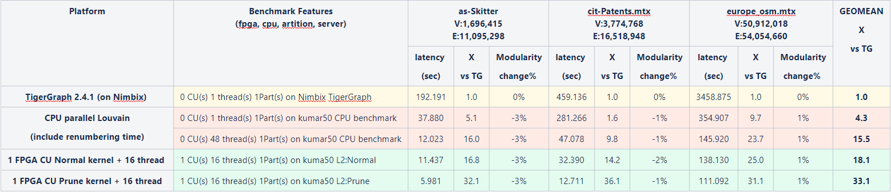

# Louvain Fast 

Louvain example resides in ``L2/benchmarks/louvain_fast`` directory. The tutorial provides a step-by-step guide that covers commands for building and running kernel.

## Executable Usage

* **Work Directory(Step 1)**

The steps for library download and environment setup can be found in [here](https://github.com/Xilinx/Vitis_Libraries/tree/master/graph/L2/benchmarks#building). For getting the design,

```
   cd L2/benchmarks/louvain_fast
```   

* **Build kernel(Step 2)**

Run the following make command to build your XCLBIN and host binary targeting a specific device. Please be noticed that this process will take a long time, maybe couple of hours.

```
   make run TARGET=hw DEVICE=xilinx_u50_gen3x16_xdma_201920_3
```   

* **Run kernel(Step 3)**

To get the benchmark results, please run the following command.

```
   ./build_dir.hw.xilinx_u50_gen3x16_xdma_201920_3/host.exe -x build_dir.hw.xilinx_u50_gen3x16_xdma_201920_3/kernel_louvain.xclbin -f 3 -c -o -m 10 -prun data/example-wt.txt
```   

Louvain fast Input Arguments:

```
   Usage: host.exe -[-x -f -c -o -m -prun -d -t]
         -x:           the kernel name
         -f:           File-type : 3 is Pajek (each edge once) 
         -c:           Turns distance-1 vertex coloring on.
         -o:           Turns priting final clustering onto a file with "_clustInfo" suffix to the input file. 
                       The file contains the cluster-id for each vertex (the line number is the implicit id for a vertex.
         -m:           The minimum size for coloring to be enabled (default value is 100,000 vertices).
         -prun:        The kernel type is fast
         -d:           The threshold value with distance-1 vertex coloring (default value is 0.0001).
         -t:           The threshold value without coloring (default value is 0.000001).
```          

Note: Default arguments are set in Makefile, you can use other [datasets](https://github.com/Xilinx/Vitis_Libraries/tree/master/graph/L2/benchmarks#datasets) listed in the table.

* **Example output(Step 4)** 

```
   ...

   ********************************************
   *********    Compact Summary   *************
   ********************************************
   Number of threads              : 1               m=10    thhd=0.000001   thhd_c=0.0002
   Total number of phases         : 1
   Total number of iterations     : 3        =      +        3
   Final number of clusters       : 4        :               4
   Final modularity               : 0.149872 :        0.149872
   Total time for clustering      : 0.000000
   Total time for building phases : 0.069543
   Total E2E time(s)              : 2.648519 =     + 2.648519
   Total time for coloring        : 0.000000
   ********************************************
   TOTAL TIME                     : 2.718061
   ********************************************
   Total time for Init buff_host  : 0.003191 =     + 0.003191
   Total time for Read buff_host  : 0.001154 =     + 0.001154
   Total time for totTimeE2E_2    : 2.648519 =     + 2.648519
   Total time for totTimeReGraph  : 0.359287 =     + 0.359287
   ----- time for ToTeachNum      : 0.038004 =     + 0.038004
   ----- time for ToTeachC        : 0.004088 =     + 0.004088
   ----- time for ToTeachM        : 0.000000 =     + 0.000000
   ----- time for ToTeachBuild    : 0.069543 =     + 0.069543
   ----- time for ToTeachSet      : 0.192248 =     + 0.192248
   Total time for totTimeFeature  : 0.000083 =     + 0.000083
   ********************************************
   TOTAL TIME2                    : 3.016897 =     + 3.016473
   ********************************************
   TOTAL PrePre                   : 8.021335 = 5.051470(dev) + 2.328372(bin) + 0.637452(buff) +0.004041
   TOTAL PostPost                 : 0.225914 = 0.003621 + 0.222293                                    

```

## Profiling

The hardware resource utilizations are listed in the following table.
Different tool versions may result slightly different resource.

Table 1 : Hardware resources for Louvain fast

|    Kernel         |   BRAM   |   URAM   |    DSP   |    FF    |   LUT   | Frequency(MHz)  |
|-------------------|----------|----------|----------|----------|---------|-----------------|
|  kernel_louvain   |   461    |    208   |    115   |  163521  |  130668 |      188.3      |


Table 2 : Louvain FPGA acceleration benchmark  



##### Note
```    
   1. 2 FPGA versions of kernel are used: 
      * Normal kernel  : 18.1 X 
      * Prune kernel     : 33.1 X without modularity loss VS. parallel Louvain on CPU
      * the Latency time = CPU time + FPGA time
   2. TigerGraph running on platform with Intel(R) Xeon(R) CPU E5-2640 v3 @2.60GHz, cache(20480 KB), cores(8).
   3. Parallel Louvain running on Intel(R) Xeon(R) CPU E5-2690 v4 @ 2.60GHz, cache(35840 KB), cores(14).
   4. time unit: second.
```
