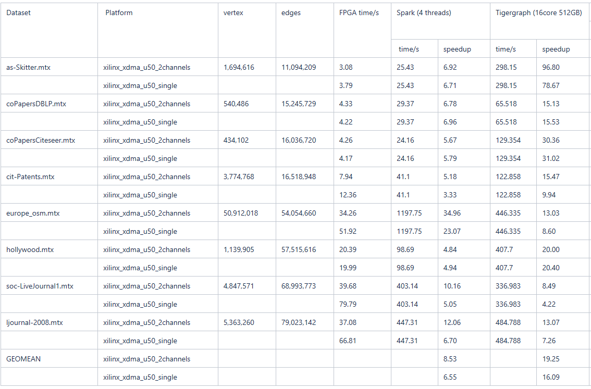

PageRank Personalized
======================

PageRank Personalized example resides in ``L2/benchmarks/pagerank_personalized`` directory. The tutorial provides a step-by-step guide that covers commands for building and running kernel.

Executable Usage
----------------

* **Work Directory(Step 1)**

The steps for library download and environment setup can be found in [here](https://github.com/Xilinx/Vitis_Libraries/tree/master/graph/L2/benchmarks#building). For getting the design,

```
   cd L2/benchmarks/pagerank_personalized
```   

* **Build kernel(Step 2)**

Run the following make command to build your XCLBIN and host binary targeting a specific device. Please be noticed that this process will take a long time, maybe couple of hours.

```
   make run TARGET=hw DEVICE=xilinx_u250_xdma_201830_2
```   

* **Run kernel(Step 3)**

To get the benchmark results, please run the following command.

```
   ./build_dir.hw.xilinx_u250_xdma_201830_2/host.exe -xclbin build_dir.hw.xilinx_u250_xdma_201830_2/kernel_pagerank_0.xclbin -dataSetDir data/ -refDir data/
```   

Pagerank Personalized Input Arguments:

```
   Usage: host.exe -[-xclbin -dataSetDir -refDir]
         -xclbin:      the kernel name
         -dataSetDir:  the path point to input directory
         -refDir:      the path point to reference directory
```          

Note: Default arguments are set in Makefile, you can use other [datasets](https://github.com/Xilinx/Vitis_Libraries/tree/master/graph/L2/benchmarks#datasets) listed in the table.

* **Example output(Step 4)** 

```
   Found Platform
   Platform Name: Xilinx
   INFO: Found Device=xilinx_u50_gen3x16_xdma_201920_3
   INFO: Importing build_dir.hw.xilinx_u50_gen3x16_xdma_201920_3/kernel_pagerank_0.xclbin
   Loading: 'build_dir.hw.xilinx_u50_gen3x16_xdma_201920_3/kernel_pagerank_0.xclbin'
   INFO: Kernel has been created
   INFO: Finish kernel setup
   INFO: Finish event_write
   INFO: Finish event_kernel
   ...

   INFO: Finish kernel execution
   INFO: Finish E2E execution
   INFO: Data transfer from host to device: 383 us
   INFO: Data transfer from device to host: 210 us
   INFO: Average kernel execution per run: 260422 us
   INFO: Average execution per run: 261015 us
   ...

   INFO: sum_golden = 0.65297
   INFO: sum_pagerank = 0.652969
   INFO: Accurate Rate = 1
   INFO: Err Geomean = 8.42715e-07
   INFO: Result is correct
```

Profiling
---------

The hardware resource utilizations are listed in the following table.

##### Table 1 : Hardware resources for PageRankMultiChannels with 2 channels

|    Kernel         |   BRAM   |   URAM   |    DSP   |    FF    |   LUT   | Frequency(MHz)  |
|-------------------|----------|----------|----------|----------|---------|-----------------|
| kernel_pagerank_0 |   303    |   224    |    84    |  352693  |  135193 |      229        |

##### Table 2 : Comparison between CPU tigergraph and FPGA VITIS_GRAPH



##### Note
```  
    1. Tigergraph time is the execution time of funciton "pageRank" Developer Edition 2.4.1 .
    2. Tigergraph running on platform with Intel(R) Xeon(R) CPU E5-2640 v3 @2.600GHz, 32 Threads (16 Core(s)).
    3. time unit: second.
    4. "-" Indicates that the result could not be obtained due to insufficient memory.
    5. FPGA time is the kernel runtime by adding data transfer and executed with pagerank_cache
```
