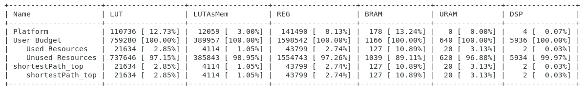
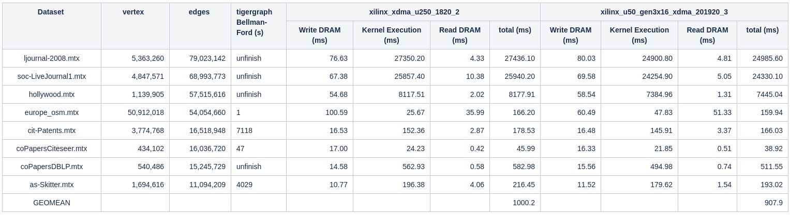

Single Source Shortest Path
===========================

Single Source Shortest Path(SSSP) example resides in ``L2/benchmarks/shortest_path_float_pred`` directory. The tutorial provides a step-by-step guide that covers commands for building and running kernel.

Executable Usage
----------------

* **Work Directory(Step 1)**

The steps for library download and environment setup can be found in [here](https://github.com/Xilinx/Vitis_Libraries/tree/master/graph/L2/benchmarks#building). For getting the design,

```
   cd L2/benchmarks/shortest_path_float_pred
```   

* **Build kernel(Step 2)**

Run the following make command to build your XCLBIN and host binary targeting a specific device. Please be noticed that this process will take a long time, maybe couple of hours.

```
   make run TARGET=hw DEVICE=xilinx_u50_gen3x16_xdma_201920_3
```   

* **Run kernel(Step 3)**

To get the benchmark results, please run the following command.

```
   ./build_dir.hw.xilinx_u50_gen3x16_xdma_201920_3/host.exe -xclbin build_dir.hw.xilinx_u50_gen3x16_xdma_201920_3/shortestPath_top.xclbin -o data/data-csr-offset.mtx -c data/data-csr-indicesweights.mtx -g data/data-golden.sssp.mtx 
```   

Single Source Shortest Path Input Arguments:

```
   Usage: host.exe -[-xclbin -o -c -g]
          -xclbin      Xclbin File Name
          -o           Offset File Name
          -c           Indices File Name
          -g           Golden File Name
```          

Note: Default arguments are set in Makefile, you can use other [datasets](https://github.com/Xilinx/Vitis_Libraries/tree/master/graph/L2/benchmarks#datasets) listed in the table.  

* **Example output(Step 4)**

```
   ---------------------Shortest Path---------------- 
   id: 92 max out: 13
   Found Platform
   Platform Name: Xilinx
   Found Device=xilinx_u50_gen3x16_xdma_201920_3
   INFO: Importing build_dir.hw.xilinx_u50_gen3x16_xdma_201920_3/shortestPath_top.xclbin
   Loading: 'build_dir.hw.xilinx_u50_gen3x16_xdma_201920_3/shortestPath_top.xclbin'
   kernel has been created
   kernel start------
   kernel call success
   kernel call finish
   kernel end------
   Execution time 11.651ms
   Write DDR Execution time 0.273831ms
   Kernel[0] Execution time 11.2184ms
   Read DDR Execution time 0.130417ms
   Total Execution time 11.6227ms
```    

Profiling
---------
The hardware resource utilizations are listed in the following table.

Table 1 : Resource utilization of SingleSourceShortestPath



The performance is shown below.

Table 2 : Performance of SingleSourceShortestPath


Note 1: Tigergraph running on platform with Intel(R) Xeon(R) CPU E5-2640 v3 @2.60GHz.

