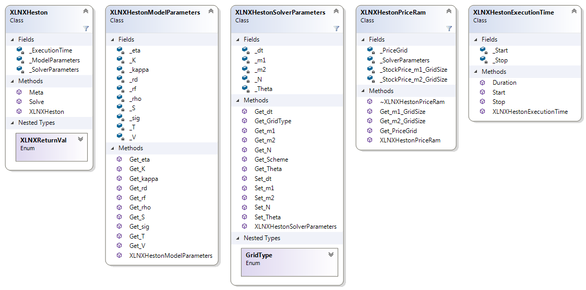

.. 
   Copyright 2019 Xilinx, Inc.
  
   Licensed under the Apache License, Version 2.0 (the "License");
   you may not use this file except in compliance with the License.
   You may obtain a copy of the License at
  
       http://www.apache.org/licenses/LICENSE-2.0
  
   Unless required by applicable law or agreed to in writing, software
   distributed under the License is distributed on an "AS IS" BASIS,
   WITHOUT WARRANTIES OR CONDITIONS OF ANY KIND, either express or implied.
   See the License for the specific language governing permissions and
   limitations under the License.

==========
Heston FD 
==========

Description
-----------

The class diagram below details the interface to the Heston FD library.

.. toctree::
   :maxdepth: 1
   

XLNXHeston Class
----------------
This class in the main interface, requires an instance of XLNXHestonModelParameters & XLNXHestonSolverParameters being passed in when being constructed.
Contains methods to solve Heston FD and return meta data for the time taken.

.. toctree::
	:maxdepth: 1
	
	heston_class.rst

XLNXHestonModelParameters Class
-------------------------------
This class deals with configuring the input parameters to the Heston FD Model.

.. toctree::
	:maxdepth: 1
	
	heston_model.rst

XLNXHestonSolverParameters Class
--------------------------------
This class deals with setting the grid size (m1 & m2) and number of timesteps (N ) to be used when solving Heston FD.

.. toctree::
	:maxdepth: 1
	
	heston_solver.rst

XLNXHestonPriceRam Class
------------------------
This class deals with allocating and free'ing memory to store the returned price grid from the Kernel.

.. toctree::
	:maxdepth: 1
	
	heston_priceram.rst
	

XLNXHestonExecutionTime Class
-----------------------------
This class tracks execution time.

.. toctree::
	:maxdepth: 1
	
	heston_execution_time.rst
