.. meta::
   :keywords: Vision, Library, Vitis Vision Library, Iterative Pyramidal, Corner Tracking, cornerUpdate, cornersImgToList, cv, mat
   :description: Vitis Vision library application programming interface reference.
   :xlnxdocumentclass: Document
   :xlnxdocumenttype: Tutorials

.. _libapireference:

Overview
##################################

To facilitate local memory allocation on FPGA devices, the Vitis Vision
library functions are provided in templates with compile-time
parameters. Data is explicitly copied from ``cv::Mat`` to ``xf::cv::Mat``
and is stored in physically contiguous memory to achieve the best
possible performance. After processing, the output in ``xf::cv::Mat`` is
copied back to ``cv::Mat`` to write it into the memory.

.. _xf-mat-class:

xf::cv::Mat Image Container Class
##################################

``xf::cv::Mat`` is a template class that serves as a container for storing
image data and its attributes.

.. note:: The ``xf::cv::Mat`` image container class is similar to the ``cv::Mat`` class of the OpenCV library.

.. _xfmat-calls-def:

Class Definition
================

.. code:: c

	template <int T, int ROWS, int COLS, int NPC, int XFCVDEPTH = _XFCVDEPTH_DEFAULT>
	class Mat {
	   public:
		unsigned char allocatedFlag; // flag to mark memory allocation in this class
		int rows, cols, size;        // actual image size

		typedef XF_TNAME(T, NPC) DATATYPE;
		using _DATATTYPE = typename std::conditional<
			(XFCVDEPTH < 0),
			DATATYPE*,                 // Case of Memory Mapped pointer
			typename std::conditional< // Case of Stream
				(XFCVDEPTH == 0),
				hls::stream<DATATYPE>,           // Case of default Dtream depth or user can override outside
				hls::stream<DATATYPE, XFCVDEPTH> // Case of Stream depth specified
				>::type>::type;
		_DATATTYPE data;

		Mat(); // default constructor
		Mat(Size _sz);
		Mat(int _rows, int _cols);
		Mat(int _size, int _rows, int _cols);
		Mat(int _rows, int _cols, void* _data);
		Mat(const Mat&); // copy constructor

		~Mat();

		Mat& operator=(const Mat&); // Assignment operator

		template <int D = XFCVDEPTH, typename std::enable_if<(D < 0)>::type* = nullptr>
		void alloc_data() {
	#ifndef __SYNTHESIS__
			data = (DATATYPE*)malloc(size * sizeof(DATATYPE));

			if (data == NULL) {
				fprintf(stderr, "\nFailed to allocate memory\n");
			} else {
				allocatedFlag = 1;
			}
	#endif
		}

		template <int D = XFCVDEPTH, typename std::enable_if<(D >= 0)>::type* = nullptr>
		void alloc_data() {
			// This is a stream
		}

		template <int D = XFCVDEPTH, typename std::enable_if<(D < 0)>::type* = nullptr>
		void free_data() {
			if (data != NULL) {
	#ifndef __SYNTHESIS__
				free(data);
	#endif
			}
		}

		template <int D = XFCVDEPTH, typename std::enable_if<(D >= 0)>::type* = nullptr>
		void free_data() {}

		template <int D = XFCVDEPTH, typename std::enable_if<(D < 0)>::type* = nullptr>
		void copyData(const Mat& src) {
			for (int i = 0; i < (rows * ((cols + NPC - 1) >> XF_BITSHIFT(NPC))); ++i) {
				data[i] = src.data[i];
			}
		}

		template <int D = XFCVDEPTH, typename std::enable_if<(D >= 0)>::type* = nullptr>
		void copyData(const Mat& src) {
			// This is a stream
			assert(0);
		}

		template <int D = XFCVDEPTH, typename std::enable_if<(D < 0)>::type* = nullptr>
		void assignDataPtr(void* _data) {
			data = (DATATYPE*)_data;
		}

		template <int D = XFCVDEPTH, typename std::enable_if<(D >= 0)>::type* = nullptr>
		void assignDataPtr(void* _data) {
			// This is a stream
			assert(0);
		}

		template <int D = XFCVDEPTH, typename std::enable_if<(D < 0)>::type* = nullptr>
		XF_TNAME(T, NPC)
		read(int index) {
			return data[index];
		}

		template <int D = XFCVDEPTH, typename std::enable_if<(D >= 0)>::type* = nullptr>
		XF_TNAME(T, NPC)
		read(int index) {
			return data.read();
		}
		float read_float(int index);

		template <int D = XFCVDEPTH, typename std::enable_if<(D < 0)>::type* = nullptr>
		void write(int index, XF_TNAME(T, NPC) val) {
			data[index] = val;
		}

		template <int D = XFCVDEPTH, typename std::enable_if<(D >= 0)>::type* = nullptr>
		void write(int index, XF_TNAME(T, NPC) val) {
			data.write(val);
		}
		void write_float(int index, float val);

		template <int D = XFCVDEPTH, typename std::enable_if<(D >= 0)>::type* = nullptr>
		void init(int _rows, int _cols, void* _data) {
			init(_rows, _cols);
			copyTo(_data);
		}

		template <int D = XFCVDEPTH, typename std::enable_if<(D < 0)>::type* = nullptr>
		void init(int _rows, int _cols, void* _data) {
			init(_rows, _cols, false);
			assignDataPtr(_data);
		}

		void init(int _rows, int _cols, bool allocate = true);
		void copyTo(void* fromData);
		unsigned char* copyFrom();

		const int type() const;
		const int depth() const;
		const int channels() const;

		template <int DST_T>
		void convertTo(Mat<DST_T, ROWS, COLS, NPC, XFCVDEPTH>& dst, int otype, double alpha = 1, double beta = 0);
	};

.. rubric:: Parameter Descriptions

The following table lists the ``xf::cv::Mat`` class parameters and their
descriptions:

.. table:: Table xf::cv::Mat Class Parameter Descriptions

   +---------------+------------------------------------------------------+
   | Parameter     | Description                                          |
   +===============+======================================================+
   | rows          | The number of rows in the image or height of the     |
   |               | image.                                               |
   +---------------+------------------------------------------------------+
   | cols          | The number of columns in the image or width of the   |
   |               | image.                                               |
   +---------------+------------------------------------------------------+
   | size          | The number of words stored in the data member. The   |
   |               | value is calculated using                            |
   |               | ``rows*cols/(number of pixels packed per  word)``.   |
   +---------------+------------------------------------------------------+
   | allocatedFlag | Flag for memory allocation status                    |
   +---------------+------------------------------------------------------+
   | \*data        | class parameters and the pointer to the words that   |
   |               | store the pixels of the image.                       |
   +---------------+------------------------------------------------------+

The following table lists the member functions and their descriptions:

.. table:: Table xf::cv::Mat Member Function Descriptions

   +---------------+--------------------------------------------------------+
   | Member        | Description                                            |
   | Functions     |                                                        |
   +===============+========================================================+
   | Mat()         | This default constructor initializes the Mat object    |
   |               | sizes, using the template parameters ROWS and COLS.    |
   +---------------+--------------------------------------------------------+
   | Mat(int       | This constructor initializes the Mat object using      |
   | \_rows, int   | arguments \_rows and \_cols.                           |
   | \_cols)       |                                                        |
   +---------------+--------------------------------------------------------+
   | Mat(const     | This constructor helps clone a Mat object to           |
   | xf::cv::Mat   | another. New memory will be allocated for the newly    |
   | &_src)        | created constructor.                                   |
   +---------------+--------------------------------------------------------+
   | Mat(int       | This constructor initializes the Mat object using      |
   | \_rows, int   | arguments \_rows, \_cols, and \_data. The \*data       |
   | \_cols, void  | member of the Mat object points to the memory          |
   | \*_data)      | allocated for \_data argument, when this constructor   |
   |               | is used. No new memory is allocated for the \*data     |
   |               | member.                                                |
   +---------------+--------------------------------------------------------+
   | convertTo(Mat | Refer to `xf::cv::convertTo`_                          |
   | <DST_T,ROWS,  |                                                        |
   | COLS, NPC>    |                                                        |
   | &dst, int     |                                                        |
   | otype, double |                                                        |
   | alpha=1,      |                                                        |
   | double        |                                                        |
   | beta=0)       |                                                        |
   +---------------+--------------------------------------------------------+
   | copyTo(\*     | Copies the data from Data pointer into physically      |
   | fromData)     | contiguous memory allocated inside the constructor.    |
   +---------------+--------------------------------------------------------+
   | copyFrom()    | Returns the pointer to the first location of the       |
   |               | \*data member.                                         |
   +---------------+--------------------------------------------------------+
   | read(int      | Readout a value from a given location and return it    |
   | index)        | as a packed (for multi-pixel/clock) value.             |
   +---------------+--------------------------------------------------------+
   | read_float(in | Readout a value from a given location and return it    |
   | t             | as a float value                                       |
   | index)        |                                                        |
   +---------------+--------------------------------------------------------+
   | write(int     | Writes a packed (for multi-pixel/clock) value into     |
   | index,        | the given location.                                    |
   | XF_TNAME(T,NP |                                                        |
   | C)            |                                                        |
   | val)          |                                                        |
   +---------------+--------------------------------------------------------+
   | write_float(i | Writes a float value into the given location.          |
   | nt            |                                                        |
   | index, float  |                                                        |
   | val)          |                                                        |
   +---------------+--------------------------------------------------------+
   | type()        | Returns the type of the image.                         |
   +---------------+--------------------------------------------------------+
   | depth()       | Returns the depth of the image                         |
   +---------------+--------------------------------------------------------+
   | channels()    | Returns number of channels of the image                |
   +---------------+--------------------------------------------------------+
   | ~Mat()        | This is a default destructor of the Mat object.        |
   +---------------+--------------------------------------------------------+

Template parameters of the ``xf::cv::Mat`` class are used to set the depth
of the pixel, number of channels in the image, number of pixels packed
per word, maximum number of rows and columns of the image. The following
table lists the template parameters and their descriptions:

.. table:: Table xf::cv::Mat Template Parameter Descriptions

   +---------------+------------------------------------------------------+
   | Parameters    | Description                                          |
   +===============+======================================================+
   | TYPE          | Type of the pixel data. For example, XF_8UC1 stands  |
   |               | for 8-bit unsigned and one channel pixel. More types |
   |               | can be found in include/common/xf_params.h.          |
   +---------------+------------------------------------------------------+
   | HEIGHT        | Maximum height of an image.                          |
   +---------------+------------------------------------------------------+
   | WIDTH         | Maximum width of an image.                           |
   +---------------+------------------------------------------------------+
   | NPC           | The number of pixels to be packed per word. For      |
   |               | instance, XF_NPPC1 for 1 pixel per word; and         |
   |               | XF_NPPC8 for 8 pixels per word.                      |
   +---------------+------------------------------------------------------+

Pixel-Level Parallelism
========================

The amount of parallelism to be implemented in a function from Vitis Vision
is kept as a configurable parameter. In most functions, there are two
options for processing data.

-  Single-pixel processing
-  Processing eight pixels in parallel

The following table describes the options available for specifying the
level of parallelism required in a particular function:

.. table:: Table Options Available for Specifying the Level of Parallelism

   +----------+----------------------------------+
   | Option   | Description                      |
   +==========+==================================+
   | XF_NPPC1 | Process 1 pixel per clock cycle  |
   +----------+----------------------------------+
   | XF_NPPC2 | Process 2 pixels per clock cycle |
   +----------+----------------------------------+
   | XF_NPPC4 | Process 4 pixels per clock cycle |
   +----------+----------------------------------+
   | XF_NPPC8 | Process 8 pixels per clock cycle |
   +----------+----------------------------------+

Macros to Work With Parallelism
---------------------------------

There are two macros that are defined to work with parallelism.

-  The ``XF_NPIXPERCYCLE(flags)`` macro resolves to the number of pixels
   processed per cycle.

   -  ``XF_NPIXPERCYCLE(XF_NPPC1)`` resolves to 1
   -  ``XF_NPIXPERCYCLE(XF_NPPC2)`` resolves to 2
   -  ``XF_NPIXPERCYCLE(XF_NPPC4)`` resolves to 4
   -  ``XF_NPIXPERCYCLE(XF_NPPC8)`` resolves to 8

-  The ``XF_BITSHIFT(flags)`` macro resolves to the number of times to
   shift the image size to right to arrive at the final data transfer
   size for parallel processing.

   -  ``XF_BITSHIFT(XF_NPPC1)`` resolves to 0
   -  ``XF_BITSHIFT(XF_NPPC2)`` resolves to 1
   -  ``XF_BITSHIFT(XF_NPPC4)`` resolves to 2
   -  ``XF_BITSHIFT(XF_NPPC8)`` resolves to 3

Data Types
===========

Data types will differ, depending on the combination of the depth
of pixels and the number of channels in the image. The generic
nomenclature of the parameter is listed below.

.. code:: c

   XF_<Number of bits per pixel><signed (S) or unsigned (U) or float (F)>C<number of channels>

For example, for an 8-bit pixel - unsigned - 1 channel the data type is
``XF_8UC1``.

The following table lists the available data types for the ``xf::cv::Mat``
class:

.. table:: Table xf::cv::Mat Class - Available Data Types

   +-------------+-----------------+--------------------+-----------------+
   | Option      | Number of bits  | Unsigned/ Signed/  | Number of       |
   |             | per Pixel       | Float Type         | Channels        |
   +=============+=================+====================+=================+
   | XF_2UC1     | 2               | Unsigned           | 1               |
   +-------------+-----------------+--------------------+-----------------+
   | XF_8UC1     | 8               | Unsigned           | 1               |
   +-------------+-----------------+--------------------+-----------------+
   | XF_8UC2     | 8               | Unsigned           | 2               |
   +-------------+-----------------+--------------------+-----------------+
   | XF_8UC3     | 8               | Unsigned           | 3               |
   +-------------+-----------------+--------------------+-----------------+
   | XF_8UC4     | 8               | Unsigned           | 4               |
   +-------------+-----------------+--------------------+-----------------+
   | XF_10UC1    | 10              | Unsigned           | 1               |
   +-------------+-----------------+--------------------+-----------------+
   | XF_10UC2    | 10              | Unsigned           | 2               |
   +-------------+-----------------+--------------------+-----------------+
   | XF_10UC3    | 10              | Unsigned           | 3               |
   +-------------+-----------------+--------------------+-----------------+
   | XF_10UC4    | 10              | Unsigned           | 4               |
   +-------------+-----------------+--------------------+-----------------+
   | XF_12UC1    | 12              | Unsigned           | 1               |
   +-------------+-----------------+--------------------+-----------------+
   | XF_12UC2    | 12              | Unsigned           | 2               |
   +-------------+-----------------+--------------------+-----------------+
   | XF_12UC3    | 12              | Unsigned           | 3               |
   +-------------+-----------------+--------------------+-----------------+
   | XF_12UC4    | 12              | Unsigned           | 4               |
   +-------------+-----------------+--------------------+-----------------+
   | XF_16UC1    | 16              | Unsigned           | 1               |
   +-------------+-----------------+--------------------+-----------------+
   | XF_16SC1    | 16              | Signed             | 1               |
   +-------------+-----------------+--------------------+-----------------+
   | XF_32UC1    | 32              | Unsigned           | 1               |
   +-------------+-----------------+--------------------+-----------------+
   | XF_32FC1    | 32              | Float              | 1               |
   +-------------+-----------------+--------------------+-----------------+
   | XF_32FC3    | 32              | Float              | 3               |
   +-------------+-----------------+--------------------+-----------------+
   | XF_32SC1    | 32              | Signed             | 1               |
   +-------------+-----------------+--------------------+-----------------+

Manipulating Data Type
-----------------------

Based on the number of pixels to process per clock cycle and the type
parameter, there are different possible data types. The Vitis Vision library
uses these datatypes for internal processing and inside the ``xf::cv::Mat``
class. The following are a few supported types:

-  ``XF_TNAME(TYPE,NPPC)`` resolves to the data type of the data member
   of the ``xf::cv::Mat`` object. For instance,
   ``XF_TNAME(XF_8UC1,XF_NPPC8)`` resolves to ``ap_uint<64>``.
-  ``Word width = pixel depth * number of channels * number of pixels to process per             cycle (NPPC)``.
-  ``XF_DTUNAME(TYPE,NPPC)`` resolves to the data type of the pixel. For
   instance, ``XF_DTUNAME(XF_32FC1,XF_NPPC1)`` resolves to ``float``.
-  ``XF_PTSNAME(TYPE,NPPC)`` resolves to the ‘C’ data type of the pixel.
   For instance, ``XF_PTSNAME             (XF_16UC1,XF_NPPC2)`` resolves
   to ``unsigned             short``.

.. note:: ``ap_uint<>``, ``ap_int<>``, ``ap_fixed<>``, and ``ap_ufixed<>`` types belong to the high-level synthesis (HLS) library. For more information, see the Vivado Design Suite User Guide: High-Level Synthesis (`UG902 <https://www.xilinx.com/cgi-bin/docs/rdoc?v=2019.1;d=ug902-vivado-high-level-synthesis.pdf>`_).

.. _xf-imread:

xf::cv::imread
==============

The function `xf::cv::imread` loads an image from the specified file path,
copies into xf::cv::Mat and returns it. If the image cannot be read (because
of missing file, improper permissions, unsupported or invalid format),
the function exits with a non-zero return code and an error statement.

.. note:: In an HLS standalone mode like Cosim, use ``cv::imread`` followed by ``copyTo`` function, instead of ``xf::cv::imread``.

.. rubric:: API Syntax

.. code:: c

   template<int PTYPE, int ROWS, int COLS, int NPC>
   xf::cv::Mat<PTYPE, ROWS, COLS, NPC> imread (char *filename, int type)

.. rubric:: Parameter Descriptions

The table below describes the template and the function parameters.

.. table:: Table xf::cv::imread Parameter Description

   +--------------+-------------------------------------------------------+
   | Parameter    | Description                                           |
   +==============+=======================================================+
   | PTYPE        | Input pixel type. Value should be in accordance with  |
   |              | the ‘type’ argument’s value.                          |
   +--------------+-------------------------------------------------------+
   | ROWS         | Maximum height of the image to be read                |
   +--------------+-------------------------------------------------------+
   | COLS         | Maximum width of the image to be read                 |
   +--------------+-------------------------------------------------------+
   | NPC          | Number of pixels to be processed per cycle; possible  |
   |              | options are XF_NPPC1 and XF_NPPC8 for 1 pixel and 8   |
   |              | pixel operations respectively.                        |
   +--------------+-------------------------------------------------------+
   | filename     | Name of the file to be loaded                         |
   +--------------+-------------------------------------------------------+
   | type         | Flag that depicts the type of image. The values are:  |
   |              |                                                       |
   |              | -  '0' for gray scale                                 |
   |              | -  '1' for color image                                |
   +--------------+-------------------------------------------------------+

.. _ariaid-title4:

xf::cv::imwrite
===============

The function xf::cv::imwrite saves the image to the specified file from the
given xf::cv::Mat. The image format is chosen based on the file name
extension. This function internally uses cv::imwrite for the processing.
Therefore, all the limitations of cv::imwrite are also applicable to
xf::cv::imwrite.

.. rubric:: API Syntax

.. code:: c

   template <int PTYPE, int ROWS, int COLS, int NPC>
   void imwrite(const char *img_name, xf::cv::Mat<PTYPE, ROWS, COLS, NPC> &img)

.. rubric:: Parameter Descriptions

The table below describes the template and the function parameters.

.. table:: Table xf::cv::imwrite Parameter Description

   +--------------+-------------------------------------------------------+
   | Parameter    | Description                                           |
   +==============+=======================================================+
   | PTYPE        | Input pixel type. Supported types are: XF_8UC1,       |
   |              | XF_16UC1, XF_8UC4, and XF_16UC4                       |
   +--------------+-------------------------------------------------------+
   | ROWS         | Maximum height of the image to be read                |
   +--------------+-------------------------------------------------------+
   | COLS         | Maximum width of the image to be read                 |
   +--------------+-------------------------------------------------------+
   | NPC          | Number of pixels to be processed per cycle; possible  |
   |              | options are XF_NPPC1 and XF_NPPC8 for 1 pixel and 8   |
   |              | pixel operations respectively.                        |
   +--------------+-------------------------------------------------------+
   | img_name     | Name of the file with the extension                   |
   +--------------+-------------------------------------------------------+
   | img          | xf::cv::Mat array to be saved                         |
   +--------------+-------------------------------------------------------+

.. _xf-absdiff:

xf::cv::absDiff
===============

The function xf::cv::absDiff computes the absolute difference between each
individual pixels of an xf::cv::Mat and a cv::Mat, and returns the
difference values in a cv::Mat.

.. rubric:: API Syntax

.. code:: c

   template <int PTYPE, int ROWS, int COLS, int NPC>
   void absDiff(cv::Mat &cv_img, xf::cv::Mat<PTYPE, ROWS, COLS, NPC>& xf_img, cv::Mat &diff_img )

.. rubric:: Parameter Descriptions

The table below describes the template and the function parameters.

.. table:: Table xf::cv::absDiff Parameter Description

   +--------------+-------------------------------------------------------+
   | Parameter    | Description                                           |
   +==============+=======================================================+
   | PTYPE        | Input pixel type                                      |
   +--------------+-------------------------------------------------------+
   | ROWS         | Maximum height of the image to be read                |
   +--------------+-------------------------------------------------------+
   | COLS         | Maximum width of the image to be read                 |
   +--------------+-------------------------------------------------------+
   | NPC          | Number of pixels to be processed per cycle; possible  |
   |              | options are XF_NPPC1, XF_NPPC4, and XF_NPPC8 for      |
   |              | 1-pixel, 4-pixel, and 8-pixel parallel operations     |
   |              | respectively.                                         |
   +--------------+-------------------------------------------------------+
   | cv_img       | cv::Mat array to be compared                          |
   +--------------+-------------------------------------------------------+
   | xf_img       | xf::cv::Mat array to be compared                      |
   +--------------+-------------------------------------------------------+
   | diff_img     | Output difference image(cv::Mat)                      |
   +--------------+-------------------------------------------------------+

.. _xf-convertto:

xf::cv::convertTo
=================

The xf::cv::convertTo function performs bit depth conversion on each
individual pixel of the given input image. This method converts the
source pixel values to the target data type with appropriate casting.

.. code:: c

   dst(x,y)= cast<target-data-type>(α(src(x,y)+β))

Note: The output and input Mat cannot be the same. That is, the
converted image cannot be stored in the Mat of the input image.

.. rubric:: API Syntax

.. code:: c

   template<int DST_T> void convertTo(xf::cv::Mat<DST_T,ROWS, COLS, NPC> &dst, int ctype, double alpha=1, double beta=0)

.. rubric:: Parameter Descriptions

The table below describes the template and function parameters.

.. table:: Table xf::cv::convertTo Parameter Description

   +--------------+-------------------------------------------------------+
   | Parameter    | Description                                           |
   +==============+=======================================================+
   | DST_T        | Output pixel type. Possible values are XF_8UC1,       |
   |              | XF_16UC1, XF_16SC1, and XF_32SC1.                     |
   +--------------+-------------------------------------------------------+
   | ROWS         | Maximum height of image to be read                    |
   +--------------+-------------------------------------------------------+
   | COLS         | Maximum width of image to be read                     |
   +--------------+-------------------------------------------------------+
   | NPC          | Number of pixels to be processed per cycle; possible  |
   |              | options are XF_NPPC1, XF_NPPC4, and XF_NPPC8 for      |
   |              | 1-pixel, 4-pixel, and 8-pixel parallel operations     |
   |              | respectively. XF_32SC1 and XF_NPPC8 combination is    |
   |              | not supported.                                        |
   +--------------+-------------------------------------------------------+
   | dst          | Converted xf Mat                                      |
   +--------------+-------------------------------------------------------+
   | ctype        | Conversion type : Possible values are listed here.    |
   |              |                                                       |
   |              |  //Down-convert:                                      |
   |              |                                                       |   
   |              | -  XF_CONVERT_16U_TO_8U                               |
   |              |                                                       |
   |              | -  XF_CONVERT_16S_TO_8U                               |
   |              |                                                       |
   |              | -  XF_CONVERT_32S_TO_8U                               |
   |              |                                                       |
   |              | -  XF_CONVERT_32S_TO_16U                              |
   |              |                                                       |
   |              | -  XF_CONVERT_32S_TO_16S                              |
   |              |                                                       |
   |              | //Up-convert:                                         |
   |              |                                                       |
   |              | -  XF_CONVERT_8U_TO_16U                               |
   |              |                                                       |
   |              | -  XF_CONVERT_8U_TO_16S                               |
   |              |                                                       |
   |              | -  XF_CONVERT_8U_TO_32S                               |
   |              |                                                       |
   |              | -  XF_CONVERT_16U_TO_32S                              |
   |              |                                                       |
   |              | -  XF_CONVERT_16S_TO_32S                              |
   +--------------+-------------------------------------------------------+
   | alpha        | Optional scale factor                                 |
   +--------------+-------------------------------------------------------+
   | beta         | Optional delta added to the scaled values             |
   +--------------+-------------------------------------------------------+

.. _xfopencv-lib-fns:

Vitis Vision Library Functions
###############################

The Vitis Vision library is a set of select OpenCV functions optimized for
Zynq-7000, Zynq UltraScale+ MPSoC, Alveo U200 and U50 devices. The maximum resolution supported for all the functions is 4K, except
Houghlines and HOG (RB mode).

.. note:: `Resolution Conversion (Resize) <#resolution-conversion>`_ in 8 pixel per cycle mode, `Dense Pyramidal LK Optical Flow <#dense-pyramidal-lk-optical>`_, and `Dense Non-Pyramidal LK Optical Flow <#dense-non-pyramidal-lk-optical>`_ functions are not supported on the Zynq-7000 SoC ZC702 devices, due to the higher resource utilization.

.. note:: Number of pixel per clock depends on the maximum bus width a device can support. For example: Zynq-7000 SoC has 64-bit interface and so for a pixel type 16UC1, maximum of four pixel per clock (XF_NPPC4) is possible.

.. _absdiff:

Absolute Difference
===================

.. rubric:: API Syntax

The ``absdiff`` function finds the pixel wise absolute difference
between two input images and returns an output image. The input and the
output images must be the XF_8UC1 type.

| 
| |image0|

Where,

-  I\ :sub:`out`\ (x, y) is the intensity of output image at (x,y)
   position.
-  I\ :sub:`in1`\ (x, y) is the intensity of first input image at (x,y)
   position.
-  I\ :sub:`in2`\ (x, y) is the intensity of second input image at (x,y)
   position.

.. code:: c

   template<int SRC_T, int ROWS, int COLS, int NPC=1>
   void absdiff(
   xf::cv::Mat<int SRC_T, int ROWS, int COLS, int NPC> src1,
   xf::cv::Mat<int SRC_T, int ROWS, int COLS, int NPC> src2,
   xf::cv::Mat<int SRC_T, int ROWS, int COLS, int NPC> dst )

.. rubric:: Parameter Descriptions

The following table describes the template and the function parameters.

.. table:: Table absdiff Parameter Description

   +-----------------------------------+-----------------------------------+
   | Parameter                         | Description                       |
   +===================================+===================================+
   | SRC_T                             | Input and Output pixel type. Only |
   |                                   | 8-bit, unsigned, 1 and 3 channels |
   |                                   | are supported (XF_8UC1 and        |
   |                                   | XF_8UC3)                          |
   +-----------------------------------+-----------------------------------+
   | ROWS                              | Maximum height of input and       |
   |                                   | output image.                     |
   +-----------------------------------+-----------------------------------+
   | COLS                              | Maximum width of input and output |
   |                                   | image. Must be multiple of 8, for |
   |                                   | 8-pixel operation.                |
   +-----------------------------------+-----------------------------------+
   | NPC                               | Number of pixels to be processed  |
   |                                   | per cycle; possible options are   |
   |                                   | XF_NPPC1 and XF_NPPC8 for 1 pixel |
   |                                   | and 8 pixel operations            |
   |                                   | respectively.                     |
   +-----------------------------------+-----------------------------------+
   | src1                              | Input image                       |
   +-----------------------------------+-----------------------------------+
   | src2                              | Input image                       |
   +-----------------------------------+-----------------------------------+
   | dst                               | Output image                      |
   +-----------------------------------+-----------------------------------+

.. rubric:: Resource Utilization

The following table summarizes the resource utilization in different
configurations, generated using Vivado HLS 2019.1 tool for the
Xczu9eg-ffvb1156-1-i-es1 FPGA, to process a grayscale HD (1080x1920)
image.

.. table:: Table absdiff Function Resource Utilization Summary

    +----------------+---------------------------+----------------------+-----------+----+-----+-----+
    | Operating Mode | Operating Frequency (MHz) |               Utilization Estimate                |
    +                +                           +----------------------+-----------+----+-----+-----+
    |                |                           | BRAM_18K             | DSP_48Es  | FF | LUT | CLB |
    +================+===========================+======================+===========+====+=====+=====+
    | 1 Pixel        | 300                       | 0                    | 0         | 62 | 67  | 17  |
    +----------------+---------------------------+----------------------+-----------+----+-----+-----+
    | 8 Pixel        | 150                       | 0                    | 0         | 67 | 234 | 39  |
    +----------------+---------------------------+----------------------+-----------+----+-----+-----+

.. rubric:: Performance Estimate

The following table summarizes the performance in different
configurations, as generated using Vivado HLS 2019.1 tool for the
Xczu9eg-ffvb1156-1-i-es1, to process a grayscale HD (1080x1920) image.

.. table:: Table absdiff Function Performance Estimate Summary

    +-----------------------------+------------------+
    | Operating Mode              | Latency Estimate |
    +                             +------------------+
    |                             | Max Latency (ms) |
    +=============================+==================+
    | 1 pixel operation (300 MHz) | 6.9              |
    +-----------------------------+------------------+
    | 8 pixel operation (150 MHz) | 1.69             |
    +-----------------------------+------------------+

.. rubric:: Deviation from OpenCV

There is no deviation from OpenCV, except that the ``absdiff`` function
supports 8-bit pixels.

.. _accumulate:

Accumulate
==========

The ``accumulate`` function adds an image (src1) to the accumulator
image (src2), and generates the accumulated result image (dst).

|image1|

.. rubric:: API Syntax

.. code:: c

   template<int SRC_T, int DST_T, int ROWS, int COLS, int NPC=1> 
   void accumulate (
   xf::cv::Mat<int SRC_T, int ROWS, int COLS, int NPC> src1, 
   xf::cv::Mat<int SRC_T, int ROWS, int COLS, int NPC> src2, 
   xf::cv::Mat<int DST_T, int ROWS, int COLS, int NPC> dst )

.. rubric:: Parameter Descriptions

The following table describes the template and the function parameters.

.. table:: Table accumulate Parameter Description

   +-----------------+----------------------------------------------------+
   | Parameter       | Description                                        |
   +=================+====================================================+
   | SRC_T           | Input pixel type. Only 8-bit, unsigned, 1 and 3    |
   |                 | channels are supported (XF_8UC1 and XF_8UC3)       |
   +-----------------+----------------------------------------------------+
   | DST_T           | Output pixel type. Only 16-bit, unsigned, 1 and 3  |
   |                 | channels are supported (XF_16UC1 and XF_16UC3)     |
   +-----------------+----------------------------------------------------+
   | ROWS            | Maximum height of input and output image.          |
   +-----------------+----------------------------------------------------+
   | COLS            | Maximum width of input and output image. Recommend |
   |                 | using a multiple of 8, for an 8-pixel operation.   |
   +-----------------+----------------------------------------------------+
   | NPC             | Number of pixels to be processed per cycle;        |
   |                 | possible options are XF_NPPC1 and XF_NPPC8 for 1   |
   |                 | pixel and 8 pixel operations respectively.         |
   +-----------------+----------------------------------------------------+
   | src1            | Input image                                        |
   +-----------------+----------------------------------------------------+
   | src2            | Input image                                        |
   +-----------------+----------------------------------------------------+
   | dst             | Output image                                       |
   +-----------------+----------------------------------------------------+

.. rubric:: Resource Utilization

The following table summarizes the resource utilization in different
configurations, generated using Vivado HLS 2019.1 tool for the
Xczu9eg-ffvb1156-1-i-es1, to process a grayscale HD (1080x1920) image.

.. table:: Table accumulate Function Resource Utilization Summary

    +----------------+---------------------------+----------------------+-----------+----+-----+-----+
    | Operating Mode | Operating Frequency (MHz) |               Utilization Estimate                |
    +                +                           +----------------------+-----------+----+-----+-----+
    |                |                           | BRAM_18K             | DSP_48Es  | FF | LUT | CLB |
    +================+===========================+======================+===========+====+=====+=====+
    | 1 Pixel        | 300                       | 0                    | 0         | 62 | 55  | 12  |
    +----------------+---------------------------+----------------------+-----------+----+-----+-----+
    | 8 Pixel        | 150                       | 0                    | 0         | 389| 285 | 61  |
    +----------------+---------------------------+----------------------+-----------+----+-----+-----+

The following table summarizes the resource utilization in different
configurations, generated using Vivado HLS 2019.1 tool for the
Xczu9eg-ffvb1156-1-i-es1, to process 4K 3 Channel image.

.. table:: Table 16. accumulate Function Resource Utilization Summary

    +----------------+---------------------------+----------------------+-----------+----+-----+-----+
    | Operating Mode | Operating Frequency (MHz) |               Utilization Estimate                |
    +                +                           +----------------------+-----------+----+-----+-----+
    |                |                           | BRAM_18K             | DSP_48Es  | FF | LUT | CLB |
    +================+===========================+======================+===========+====+=====+=====+
    | 1 Pixel        | 300                       | 0                    | 1         | 207| 72  | 32  |
    +----------------+---------------------------+----------------------+-----------+----+-----+-----+

.. rubric:: Performance Estimate

The following table summarizes the performance in different
configurations, as generated using Vivado HLS 2019.1 tool for the
Xczu9eg-ffvb1156-1-i-es1, to process a grayscale HD (1080x1920) image.

.. table:: Table 17. accumulate Function Performance Estimate Summary

    +-----------------------------+------------------+
    | Operating Mode              | Latency Estimate |
    +                             +------------------+
    |                             | Max Latency (ms) |
    +=============================+==================+
    | 1 pixel operation (300 MHz) | 6.9              |
    +-----------------------------+------------------+
    | 8 pixel operation (150 MHz) | 1.7              |
    +-----------------------------+------------------+

.. rubric:: Deviation from OpenCV

| In OpenCV the accumulated image is stored in the second input image.
  The src2 image acts as both input and output, as shown below:
| |image2|

Whereas, in the Vitis Vision implementation, the accumulated image is stored
separately, as shown below:

| 
| |image3|

.. _acumulate-squared:

Accumulate Squared
==================

The ``accumulateSquare`` function adds the square of an image (src1) to
the accumulator image (src2) and generates the accumulated result (dst).

| 
| |image4|

The accumulated result is a separate argument in the function, instead
of having src2 as the accumulated result. In this implementation, having
a bi-directional accumulator is not possible as the function makes use
of streams.

.. rubric:: API Syntax

.. code:: c

   template<int SRC_T, int DST_T, int ROWS, int COLS, int NPC=1> 
   void accumulateSquare (
   xf::cv::Mat<int SRC_T, int ROWS, int COLS, int NPC> src1, 
   xf::cv::Mat<int SRC_T, int ROWS, int COLS, int NPC> src2, 
   xf::cv::Mat<int DST_T, int ROWS, int COLS, int NPC> dst)

.. rubric:: Parameter Descriptions

The following table describes the template and the function parameters.

.. table:: Table accumulateSquare Parameter Description

   +-------------+--------------------------------------------------------+
   | Parameter   | Description                                            |
   +=============+========================================================+
   | SRC_T       | Input pixel type. Only 8-bit, unsigned, 1 and 3        |
   |             | channels are supported (XF_8UC1 and XF_8UC3)           |
   +-------------+--------------------------------------------------------+
   | DST_T       | Output pixel type. Only 16-bit, unsigned, 1 and 3      |
   |             | channels are supported (XF_16UC1 and XF_16UC3)         |
   +-------------+--------------------------------------------------------+
   | ROWS        | Maximum height of input and output image.              |
   +-------------+--------------------------------------------------------+
   | COLS        | Maximum width of input and output image (must be       |
   |             | multiple of 8, for 8-pixel operation)                  |
   +-------------+--------------------------------------------------------+
   | NPC         | Number of pixels to be processed per cycle; possible   |
   |             | options are XF_NPPC1 and XF_NPPC8 for 1 pixel and 8    |
   |             | pixel operations respectively.                         |
   +-------------+--------------------------------------------------------+
   | src1        | Input image                                            |
   +-------------+--------------------------------------------------------+
   | src2        | Input image                                            |
   +-------------+--------------------------------------------------------+
   | dst         | Output image                                           |
   +-------------+--------------------------------------------------------+

.. rubric:: Resource Utilization

The following table summarizes the resource utilization in different
configurations, generated using Vivado HLS 2019.1 tool for the
Xczu9eg-ffvb1156-1-i-es1 FPGA, to process a grayscale HD (1080x1920)
image.

.. table:: Table accumulateSquare Function Resource Utilization Summary

    +----------------+---------------------------+----------------------+-----------+----+-----+-----+
    | Operating Mode | Operating Frequency (MHz) |               Utilization Estimate                |
    +                +                           +----------------------+-----------+----+-----+-----+
    |                |                           | BRAM_18K             | DSP_48Es  | FF | LUT | CLB |
    +================+===========================+======================+===========+====+=====+=====+
    | 1 Pixel        | 300                       | 0                    | 1         | 71 | 52  | 14  |
    +----------------+---------------------------+----------------------+-----------+----+-----+-----+
    | 8 Pixel        | 150                       | 0                    | 8         | 401| 247 | 48  |
    +----------------+---------------------------+----------------------+-----------+----+-----+-----+

The following table summarizes the resource utilization in different
configurations, generated using Vivado HLS 2019.1 tool for the
Xczu9eg-ffvb1156-1-i-es1 FPGA, to process 4K 3 Channel image.

.. table:: Table accumulateSquare Function Resource Utilization Summary

    +----------------+---------------------------+----------------------+-----------+----+-----+-----+
    | Operating Mode | Operating Frequency (MHz) |               Utilization Estimate                |
    +                +                           +----------------------+-----------+----+-----+-----+
    |                |                           | BRAM_18K             | DSP_48Es  | FF | LUT | CLB |
    +================+===========================+======================+===========+====+=====+=====+
    | 1 Pixel        | 300                       | 0                    | 3         | 227| 86  | 37  |
    +----------------+---------------------------+----------------------+-----------+----+-----+-----+

.. rubric:: Performance Estimate

The following table summarizes the performance in different
configurations, as generated using Vivado HLS 2019.1 tool for the
Xczu9eg-ffvb1156-1-i-es1, to process a grayscale HD (1080x1920) image.

.. table:: Table accumulateSquare Function Performance Estimate Summary

    +-----------------------------+------------------+
    | Operating Mode              | Latency Estimate |
    +                             +------------------+
    |                             | Max Latency (ms) |
    +=============================+==================+
    | 1 pixel operation (300 MHz) | 6.9              |
    +-----------------------------+------------------+
    | 8 pixel operation (150 MHz) | 1.6              |
    +-----------------------------+------------------+

.. rubric:: Deviation from OpenCV

In OpenCV the accumulated squared image is stored in the second input
image. The src2 image acts as input as well as output.

| 
| |image5|
| Whereas, in the Vitis Vision implementation, the accumulated squared image
  is stored separately. |image6|

.. _accumulate-weighted:

Accumulate Weighted
===================

The ``accumulateWeighted`` function computes the weighted sum of the
input image (src1) and the accumulator image (src2) and generates the
result in dst.

| 
| |image7|

The accumulated result is a separate argument in the function, instead
of having src2 as the accumulated result. In this implementation, having
a bi-directional accumulator is not possible, as the function uses
streams.

.. rubric:: API Syntax

.. code:: c

   template<int SRC_T, int DST_T, int ROWS, int COLS, int NPC=1> 
   void accumulateWeighted (
   xf::cv::Mat<int SRC_T, int ROWS, int COLS, int NPC> src1, 
   xf::cv::Mat<int SRC_T, int ROWS, int COLS, int NPC> src2, 
   xf::cv::Mat<int DST_T, int ROWS, int COLS, int NPC> dst, 
   float alpha )

.. rubric:: Parameter Descriptions

The following table describes the template and the function parameters.

.. table:: Table accumulateWeighted Parameter Description

   +--------------+-------------------------------------------------------+
   | Parameter    | Description                                           |
   +==============+=======================================================+
   | SRC_T        | Input pixel type. Only 8-bit, unsigned, 1 and 3       |
   |              | channels are supported (XF_8UC1 and XF_8UC3)          |
   +--------------+-------------------------------------------------------+
   | DST_T        | Output pixel type. Only 16-bit, unsigned, 1 and 3     |
   |              | channels are supported (XF_16UC1 and XF_16UC3)        |
   +--------------+-------------------------------------------------------+
   | ROWS         | Maximum height of input and output image.             |
   +--------------+-------------------------------------------------------+
   | COLS         | Maximum width of input and output image. Recommend    |
   |              | multiples of 8, for an 8-pixel operation.             |
   +--------------+-------------------------------------------------------+
   | NPC          | Number of pixels to be processed per cycle; possible  |
   |              | options are XF_NPPC1 and XF_NPPC8 for 1 pixel and 8   |
   |              | pixel operations respectively.                        |
   +--------------+-------------------------------------------------------+
   | src1         | Input image                                           |
   +--------------+-------------------------------------------------------+
   | src2         | Input image                                           |
   +--------------+-------------------------------------------------------+
   | dst          | Output image                                          |
   +--------------+-------------------------------------------------------+
   | alpha        | Weight applied to input image                         |
   +--------------+-------------------------------------------------------+

.. rubric:: Resource Utilization

The following table summarizes the resource utilization in different
configurations, generated using Vivado HLS 2019.1 tool for the
Xczu9eg-ffvb1156-1-i-es1 FPGA, to process a grayscale HD (1080x1920)
image.

.. table:: Table accumulateWeighted Function Resource Utilization Summary

    +----------------+---------------------------+----------------------+-----------+----+-----+-----+
    | Operating Mode | Operating Frequency (MHz) |               Utilization Estimate                |
    +                +                           +----------------------+-----------+----+-----+-----+
    |                |                           | BRAM_18K             | DSP_48Es  | FF | LUT | CLB |
    +================+===========================+======================+===========+====+=====+=====+
    | 1 Pixel        | 300                       | 0                    | 5         | 295| 255 | 52  |
    +----------------+---------------------------+----------------------+-----------+----+-----+-----+
    | 8 Pixel        | 150                       | 0                    | 19        | 556| 476 | 88  |
    +----------------+---------------------------+----------------------+-----------+----+-----+-----+

The following table summarizes the resource utilization in different
configurations, generated using Vivado HLS 2019.1 tool for the
Xczu9eg-ffvb1156-1-i-es1 FPGA, to process a 4K 3 Channel image.

.. table:: Table accumulateWeighted Function Resource Utilization Summary

    +----------------+---------------------------+----------------------+-----------+----+-----+-----+
    | Operating Mode | Operating Frequency (MHz) |               Utilization Estimate                |
    +                +                           +----------------------+-----------+----+-----+-----+
    |                |                           | BRAM_18K             | DSP_48Es  | FF | LUT | CLB |
    +================+===========================+======================+===========+====+=====+=====+
    | 1 Pixel        | 300                       | 0                    | 9         | 457| 387 | 95  |
    +----------------+---------------------------+----------------------+-----------+----+-----+-----+

.. rubric:: Performance Estimate

The following table summarizes the performance in different
configurations, as generated using Vivado HLS 2019.1 tool for the
Xczu9eg-ffvb1156-1-i-es1, to process a grayscale HD (1080x1920) image.

.. table:: Table accumulateWeighted Function Performance Estimate Summary

    +-----------------------------+------------------+
    | Operating Mode              | Latency Estimate |
    +                             +------------------+
    |                             | Max Latency (ms) |
    +=============================+==================+
    | 1 pixel operation (300 MHz) | 6.9              |
    +-----------------------------+------------------+
    | 8 pixel operation (150 MHz) | 1.7              |
    +-----------------------------+------------------+

.. rubric:: Deviation from OpenCV

The resultant image in OpenCV is stored in the second input image. The
src2 image acts as input as well as output, as shown below:

|image8|

Whereas, in Vitis Vision implementation, the accumulated weighted image is
stored separately.

|image9|

.. _adds:

AddS
====

The AddS function performs the addition operation between pixels of
input image src and given scalar value scl and stores the result in dst.

dst(x,y)= src(x,y) + scl

Where (x,y) is the spatial coordinate of the pixel.

.. rubric:: API Syntax

.. code:: c

   template<int POLICY_TYPE, int SRC_T, int ROWS, int COLS, int NPC =1>
   void addS(xf::cv::Mat<SRC_T, ROWS, COLS, NPC> & _src1, unsigned char _scl[XF_CHANNELS(SRC_T,NPC)],xf::cv::Mat<SRC_T, ROWS, COLS, NPC> & _dst)

.. rubric:: Parameter Descriptions

The following table describes the template and the function parameters.

.. table:: Table 26. AddS Parameter Description

   +---------------+------------------------------------------------------+
   | Parameter     | Description                                          |
   +===============+======================================================+
   | SRC_T         | Input pixel type. 8-bit, unsigned, 1 channel is      |
   |               | supported (XF_8UC1).                                 |
   +---------------+------------------------------------------------------+
   | ROWS          | Maximum height of input and output image.            |
   +---------------+------------------------------------------------------+
   | COLS          | Maximum width of input and output image. In case of  |
   |               | N-pixel parallelism, width should be multiple of N.  |
   +---------------+------------------------------------------------------+
   | NPC           | Number of pixels to be processed per cycle; possible |
   |               | options are XF_NPPC1 and XF_NPPC8 for 1 pixel and 8  |
   |               | pixel operations respectively.                       |
   +---------------+------------------------------------------------------+
   | \_src1        | First input image                                    |
   +---------------+------------------------------------------------------+
   | \_scl         | Input scalar value, the size should be number of     |
   |               | channels.                                            |
   +---------------+------------------------------------------------------+
   | \_dst         | Output image                                         |
   +---------------+------------------------------------------------------+

.. rubric:: Resource Utilization

The following table summarizes the resource utilization of the AddS
function in both the resource optimized (8 pixel) mode and normal mode,
as generated using Vivado HLS 2019.1 version tool for the
Xczu9eg-ffvb1156-1-i-es1 FPGA.

.. table:: Table 27. AddS Function Resource Utilization Summary

    +-----------------------------+-----------------------------+-----------------------------+
    | Name                        | Resource Utilization                                      |
    +                             +-----------------------------+-----------------------------+
    |                             | 1 pixel per clock operation | 8 pixel per clock operation |  
    +                             +-----------------------------+-----------------------------+
    |                             | 300 MHz                     | 150 MHz                     |
    +=============================+=============================+=============================+
    | BRAM_18K                    | 0                           | 0                           |
    +-----------------------------+-----------------------------+-----------------------------+
    | DSP48E                      | 0                           | 0                           |
    +-----------------------------+-----------------------------+-----------------------------+
    | FF                          | 100                         | 101                         |
    +-----------------------------+-----------------------------+-----------------------------+
    | LUT                         | 52                          | 185                         |
    +-----------------------------+-----------------------------+-----------------------------+
    | CLB                         | 20                          | 45                          |
    +-----------------------------+-----------------------------+-----------------------------+

.. rubric:: Performance Estimate

The following table summarizes a performance estimate of the kernel in
different configurations, generated using Vivado HLS 2019.1 tool for
Xczu9eg-ffvb1156-1-i-es1 FPGA to process a grayscale HD (1080x1920)
image.

.. table:: Table 28. AddS Function Performance Estimate Summary

    +-----------------------------+------------------+
    | Operating Mode              | Latency Estimate |
    +                             +------------------+
    |                             | Max Latency (ms) |
    +=============================+==================+
    | 1 pixel operation (300 MHz) | 6.9              |
    +-----------------------------+------------------+
    | 8 pixel operation (150 MHz) | 1.7              |
    +-----------------------------+------------------+

.. _addweighted:

Add Weighted
=============

The addweighted function calculates a weighted sum of two input images
src1, src2 and generates the result in dst.

dst(x,y)= src1(x,y)*alpha+src2(x,y)*beta+ gamma

.. rubric:: API Syntax

.. code:: c

   template< int SRC_T , int DST_T,   int ROWS, int COLS, int NPC=1>
   void addWeighted(xf::cv::Mat<SRC_T, ROWS, COLS, NPC> & _src1, float alpha, xf::cv::Mat<SRC_T, ROWS, COLS, NPC> & _src2, float beta, float gamma, xf::cv::Mat<SRC_T, ROWS, COLS, NPC> & _dst)

.. rubric:: Parameter Descriptions

The following table describes the template and the function parameters.

.. table:: Table 29. Addweighted Parameter Description

   +---------------+------------------------------------------------------+
   | Parameter     | Description                                          |
   +===============+======================================================+
   | SRC_T         | Input Pixel Type. 8-bit, unsigned,1 channel is       |
   |               | supported (XF_8UC1)                                  |
   +---------------+------------------------------------------------------+
   | DST_T         | Output Pixel Type. 8-bit, unsigned,1 channel is      |
   |               | supported (XF_8UC1)                                  |
   +---------------+------------------------------------------------------+
   | ROWS          | Maximum height of input and output image             |
   +---------------+------------------------------------------------------+
   | COLS          | Maximum width of input and output image. In case of  |
   |               | N-pixel parallelism, width should be multiple of N   |
   +---------------+------------------------------------------------------+
   | NPC           | Number of pixels to be processed per cycle; possible |
   |               | options are XF_NPPC1 and XF_NPPC8 for 1 pixel and 8  |
   |               | pixel operations respectively.                       |
   +---------------+------------------------------------------------------+
   | \_src1        | First Input image                                    |
   +---------------+------------------------------------------------------+
   | Alpha         | Weight applied on first image                        |
   +---------------+------------------------------------------------------+
   | \_src2        | Second Input image                                   |
   +---------------+------------------------------------------------------+
   | Beta          | Weight applied on second image                       |
   +---------------+------------------------------------------------------+
   | gamma         | Scalar added to each sum                             |
   +---------------+------------------------------------------------------+
   | \_dst         | Output image                                         |
   +---------------+------------------------------------------------------+

.. rubric:: Resource Utilization

The following table summarizes the resource utilization of the
Addweighted function in Resource optimized (8 pixel) mode and normal
mode, as generated in Vivado HLS 2019.1 version tool for the
Xczu9eg-ffvb1156-1-i-es1 FPGA.

.. table:: Table 30. Addweighted Function Resource Utilization Summary

    +-----------------------------+-----------------------------+-----------------------------+
    | Name                        | Resource Utilization                                      |
    +                             +-----------------------------+-----------------------------+
    |                             | 1 pixel per clock operation | 8 pixel per clock operation |  
    +                             +-----------------------------+-----------------------------+
    |                             | 300 MHz                     | 150 MHz                     |
    +=============================+=============================+=============================+
    | BRAM_18K                    | 0                           | 0                           |
    +-----------------------------+-----------------------------+-----------------------------+
    | DSP48E                      | 11                          | 25                          |
    +-----------------------------+-----------------------------+-----------------------------+
    | FF                          | 903                         | 680                         |
    +-----------------------------+-----------------------------+-----------------------------+
    | LUT                         | 851                         | 1077                        |
    +-----------------------------+-----------------------------+-----------------------------+
    | CLB                         | 187                         | 229                         |
    +-----------------------------+-----------------------------+-----------------------------+

.. rubric:: Performance Estimate

The following table summarizes a performance estimate of the kernel in
different configurations, generated using Vivado HLS 2019.1 tool for
Xczu9eg-ffvb1156-1-i-es1 FPGA to process a grayscale HD (1080x1920)
image.

.. table:: Table 31. Addweighted Function Performance Estimate Summary

    +-----------------------------+------------------+
    | Operating Mode              | Latency Estimate |
    +                             +------------------+
    |                             | Max Latency (ms) |
    +=============================+==================+
    | 1 pixel operation (300 MHz) | 6.9              |
    +-----------------------------+------------------+
    | 8 pixel operation (150 MHz) | 1.7              |
    +-----------------------------+------------------+

.. _autoexposurecorrection:

Auto Exposure Correction
=========================

Auto exposure correction improves contrast and brightness of the image and also corrects the exposure of the input frame. The algorithm uses luminence histogram equalization to improve overall exposure and contrast of the image.
Luminence (V) is extracted after converting input image to HSV color space. Once the algorthm is applied the image is converted back to RGB color space.

.. rubric:: API Syntax

.. code:: c

   template <int SRC_T, int DST_T, int SIN_CHANNEL_TYPE, int ROWS, int COLS, int NPC = 1>
   void autoexposurecorrection(xf::cv::Mat<SRC_T, ROWS, COLS, NPC>& src,
                               xf::cv::Mat<DST_T, ROWS, COLS, NPC>& dst,
                               unsigned int hist_array1[1][256],
                               unsigned int hist_array2[1][256])

.. rubric:: Parameter Descriptions

The following table describes template parameters and arguments of the function.

.. table:: Table AEC Parameter Description

   +------------------+------------------------------------------------------+
   | Parameter        | Description                                          |
   +==================+======================================================+
   | SRC_T            | Input pixel type. 8-bit unsigned 3 channel is        |
   |                  | supported (XF_8UC3).                                 |
   +------------------+------------------------------------------------------+
   | DST_T            | Output pixel type. 8-bit unsigned 3 channel is       |
   |                  | supported (XF_8UC3).                                 |
   +------------------+------------------------------------------------------+
   | ROWS             | Maximum height of input and output image             |
   +------------------+------------------------------------------------------+
   | COLS             | Maximum width of input and output image. In case of  |
   |                  | N-pixel parallelism, width should be multiple of N.  |
   +------------------+------------------------------------------------------+
   | SIN_CHANNEL_TYPE | Single channel type. should be XF_8UC1               |
   +------------------+------------------------------------------------------+
   | NPC              | Number of pixels to be processed per cycle; possible |
   |                  | options is XF_NPPC1, XF_NPPC2 AND so on              |
   +------------------+------------------------------------------------------+
   | src              | Input image                                          |
   +------------------+------------------------------------------------------+
   | dst              | Output image                                         |
   +------------------+------------------------------------------------------+
   | hist_array1      | Histogram array                                      |
   +------------------+------------------------------------------------------+
   | hist_array2      | Histogram array                                      |
   +------------------+------------------------------------------------------+
   
.. rubric:: Resource Utilization

The following table summarizes the resource utilization  of kernel in different configurations, generated using Vitis HLS 2020.2 tool, to process a FULL HD image.

.. table:: Table AEC Resource Utilization Summary

    +--------------------+-------------------------+--------------------------+--------------+--------+---------+---------+
    |   Operating Mode   |   Operating Frequency   |   Utilization Estimate                                               |
    +                    +   (MHz)                 +--------------------------+--------------+--------+---------+---------+
    |                    |                         |   BRAM_18K               |   DSP_48Es   |   FF   |   LUT   |   CLB   |
    +====================+=========================+==========================+==============+========+=========+=========+
    | 1 pixel            | 300                     | 4                        | 18           | 6713   | 2996    | 1103    |
    +--------------------+-------------------------+--------------------------+--------------+--------+---------+---------+
    | 2 pixel            | 300                     | 4                        | 27           | 7618   | 3705    | 1257    |
    +--------------------+-------------------------+--------------------------+--------------+--------+---------+---------+

.. rubric:: Performance Estimate

The following table summarizes a performance estimate of the kernel in
different configurations, as generated using Vitis HLS 2020.2 tool, to process a FULL HD image.

.. table:: Table AEC Function Performance Estimate Summary

    +--------------------+-------------------------+---------------------------------------------+
    |   Operating Mode   |   Operating Frequency   | Latency Estimate                            |
    |                    |   (MHz)                 | **Max (ms)**                                |
    +====================+=========================+=============================================+
    | 1 pixel            | 300                     | 7                                           |
    +--------------------+-------------------------+---------------------------------------------+
    | 2 pixel            | 300                     | 3.7                                         |
    +--------------------+-------------------------+---------------------------------------------+

.. _autowhitebalance:

Auto White Balance
===================
**Grayworld whitebalancing algorithm:**

This algorithm scales the values of pixels based on a gray-world assumption which states that the average of all channels should result in a gray image.
It adds a modification which thresholds pixels based on their saturation value and only uses pixels below the provided threshold in finding average pixel values.
Saturation is calculated using the following for a 3-channel RGB image per pixel I and is in the range [0, 1]:

|image161|

A threshold of 1 means that all pixels are used to white-balance, while a threshold of 0 means no pixels are used. Lower thresholds are useful in white-balancing saturated images.

**Simple whitebalancing algorithm:**

A simple white balance algorithm that works by independently stretching each of the input image channels to the specified range(maximum and minimum). Computes channel wise intensity histogram and ignores p% maximum and minimum values and finally normalize each channel with min and max. For increased robustness it ignores the top and bottom :math:`p\%\ \ (4\%\ is\ fixed)` \ of pixel values.

.. rubric:: API Syntax for Simple white balance

.. code:: c

    template <int SRC_T, int DST_T, int ROWS, int COLS, int NPC = 1, int WB_TYPE, int HIST_SIZE>
    void AWBhistogram(xf::cv::Mat<SRC_T, ROWS, COLS, NPC>& src1,
                  xf::cv::Mat<SRC_T, ROWS, COLS, NPC>& src2,
                  uint32_t histogram[3][HIST_SIZE],
                  float thresh,
                  float inputMin,
                  float inputMax,
                  float outputMin,
                  float outputMax)
                  
    template <int SRC_T, int DST_T, int ROWS, int COLS, int NPC = 1, int WB_TYPE, int HIST_SIZE, int S_DEPTH = 2>
    void AWBNormalization(xf::cv::Mat<SRC_T, ROWS, COLS, NPC>& src,
                      xf::cv::Mat<DST_T, ROWS, COLS, NPC, S_DEPTH>& dst,
                      uint32_t histogram[3][HIST_SIZE],
                      float thresh,
                      float inputMin,
                      float inputMax,
                      float outputMin,
                      float outputMax)     

.. rubric:: API Syntax for Grayworld white balance    

.. code:: c    

    template <int SRC_T, int DST_T, int ROWS, int COLS, int NPC = 1, int WB_TYPE>
    void AWBChannelGain(xf::cv::Mat<SRC_T, ROWS, COLS, NPC>& src,
                    xf::cv::Mat<DST_T, ROWS, COLS, NPC>& dst,
                    float thresh,
                    int i_gain[3])
                    
    template <int SRC_T, int DST_T, int ROWS, int COLS, int NPC = 1, int WB_TYPE, int S_DEPTH = 2>
    void AWBGainUpdate(xf::cv::Mat<SRC_T, ROWS, COLS, NPC>& src1,
                   xf::cv::Mat<DST_T, ROWS, COLS, NPC, S_DEPTH>& src2,
                   float thresh,
                   int i_gain[3])
.. rubric:: Parameter Descriptions

The following table describes the template and the function parameters.

.. table:: Table Autowhitebalance Parameter Description

    +---------------+------------------------------------------------------------------------------------------------------------------------------+
    |   Parameter   |   Description                                                                                                                |
    +===============+==============================================================================================================================+
    |   SRC_T       | Input Pixel Type.                                                                                                            |
    +---------------+------------------------------------------------------------------------------------------------------------------------------+
    |   DST_T       | Output Pixel Type.                                                                                                           |
    +---------------+------------------------------------------------------------------------------------------------------------------------------+
    |   ROWS        | Maximum height of input and output image (Must be multiple of NPC)                                                           |
    +---------------+------------------------------------------------------------------------------------------------------------------------------+
    |   COLS        | Maximum width of input and output image (Must be multiple of NPC)                                                            |
    +---------------+------------------------------------------------------------------------------------------------------------------------------+
    |   NPC         | Number of Pixels to be processed per cycle.                                                                                  |
    +---------------+------------------------------------------------------------------------------------------------------------------------------+
    |   WB_TYPE     | White balance type. Supported types are Gray world and simple.                                                               |
    +---------------+------------------------------------------------------------------------------------------------------------------------------+
    |   HIST_SIZE   | Histogram size.                                                                                                              |
    +---------------+------------------------------------------------------------------------------------------------------------------------------+
    |   Src1        | Input image.                                                                                                                 |
    +---------------+------------------------------------------------------------------------------------------------------------------------------+
    |   Src2        | Input image.                                                                                                                 |
    +---------------+------------------------------------------------------------------------------------------------------------------------------+
    |   histogram   | Histogram array for the Simple AWB.                                                                                          |
    +---------------+------------------------------------------------------------------------------------------------------------------------------+
    |   i_gain      | Gain values for gray-world AWB.                                                                                              |
    +---------------+------------------------------------------------------------------------------------------------------------------------------+
    |   dst         | Output image.                                                                                                                |
    +---------------+------------------------------------------------------------------------------------------------------------------------------+
    |   thresh      | Threshold value, which is used in gray world white balance method to compute average pixel values below the threshold value. |
    +---------------+------------------------------------------------------------------------------------------------------------------------------+
    |   inputMin    | Input image range minimum value.                                                                                             |
    +---------------+------------------------------------------------------------------------------------------------------------------------------+
    |   inputMax    | Input image range maximum value.                                                                                             |
    +---------------+------------------------------------------------------------------------------------------------------------------------------+
    |   outputMin   | Output image range minimum value.                                                                                            |
    +---------------+------------------------------------------------------------------------------------------------------------------------------+
    |   outputMax   | Output image range maximum value.                                                                                            |
    +---------------+------------------------------------------------------------------------------------------------------------------------------+

.. rubric:: Resource Utilization

The following table summarizes the resource utilization  of the kernel in different configurations, generated using Vitis HLS 2020.1 tool for the Xilinx xc7vx485t-ffg1157-1 FPGA, to process a 4K image.

.. table:: Table Autowhitebalance Resource Utilization Summary

    +--------------------+-------------------------+--------------------------+--------------+--------+---------+---------+
    |   Operating Mode   |   Operating Frequency   |   Utilization Estimate                                               |
    |                    |                         |                                                                      |
    |                    |   (MHz)                 |                                                                      |
    +                    +                         +--------------------------+--------------+--------+---------+---------+
    |                    |                         |   BRAM_18K               |   DSP_48Es   |   FF   |   LUT   |   CLB   |
    +====================+=========================+==========================+==============+========+=========+=========+
    | 1 pixel            | 300                     | 14                       | 10           | 4798   | 4953    | 1757    |
    +--------------------+-------------------------+--------------------------+--------------+--------+---------+---------+
    | 2 pixel            | 300                     | 14                       | 10           | 8335   | 8535    | 2901    |
    +--------------------+-------------------------+--------------------------+--------------+--------+---------+---------+

.. rubric:: Performance Estimate

The following table summarizes a performance estimate of the kernel in
different configurations, as generated using Vitis HLS 2020.1 tool for the Xilinx xc7vx485t-ffg1157-1 FPGA, to process a 4K image.

.. table:: Table Autowhitebalance Function Performance Estimate Summary

    +--------------------+-------------------------+---------------------------------------------+
    |   Operating Mode   |   Operating Frequency   |   Latency Estimate                          |
    |                    |                         |                                             |
    |                    |   (MHz)                 |                                             |
    +                    +                         +---------------------------------------------+
    |                    |                         | **Max (ms)**                                |
    +====================+=========================+=============================================+
    | 1 pixel            | 300                     | 55.2 for still image(27.9 for video stream) |
    +--------------------+-------------------------+---------------------------------------------+
    | 2 pixel            | 300                     | 28 for still image(14.2 for video stream)   |
    +--------------------+-------------------------+---------------------------------------------+

.. _badpixelcorrection:

Bad Pixel Correction
=====================

An image sensor may have a certain number of defective/bad pixels that may be the result of manufacturing faults or variations in pixel voltage levels based on temperature or exposure. The Badpixelcorrection module removes the defective pixels in the image using below operation.

If the middle pixel value is lesser than minimum neighborhood value, will consider minimum neighborhood value as mid pixel, otherwise mid pixel value is greater than maximum neighborhood value, will consider maximum neighborhood as mid pixel.

.. rubric:: API Syntax

.. code:: c

    template<int TYPE, int ROWS, int COLS, int NPPC=1, int BORDER_T=XF_BORDER_CONSTANT, int USE_URAM=0>void badpixelcorrection(xf::cv::Mat<TYPE, ROWS, COLS, NPPC> &_src,xf::cv::Mat<TYPE, ROWS, COLS, NPPC> &_dst)

The following table describes the template and the function parameters.

.. table:: Table badpixelcorrection Parameter Description

    +-----------+---------------------------------------------------------------------+
    | Parameter | Description                                                         |
    +===========+=====================================================================+
    | TYPE      | Input and Output Pixel Type.                                        |
    +-----------+---------------------------------------------------------------------+
    | ROWS      | Maximum height of input and output image (Must be multiple of NPPC) |
    +-----------+---------------------------------------------------------------------+
    | COLS      | Maximum width of input and output image (Must be multiple of NPPC)  |
    +-----------+---------------------------------------------------------------------+
    | NPPC      | Number of Pixels to be processed per cycle.                         |
    +-----------+---------------------------------------------------------------------+
    | BORDER_T  | Border Type supported is XF_BORDER_CONSTANT                         |
    +-----------+---------------------------------------------------------------------+
    | USE_URAM  | Enable to map storage structures to UltraRAM.                       |
    +-----------+---------------------------------------------------------------------+
    | \_src     | Input Bayer image                                                   |
    +-----------+---------------------------------------------------------------------+
    | \_dst     | Output Bayer image                                                  |
    +-----------+---------------------------------------------------------------------+

.. rubric:: Resource Utilization

The following table summarizes the resource utilization of the kernel in different configurations, generated using Vivado HLS 2019.2 tool for the Xilinx xc7vx485t-ffg1157-1 FPGA, to process a 4K image.

.. table:: Table badpixelcorrection Resource Utilization Summary

    +----------------+---------------------+----------------------+----------+------+------+-------+
    | Operating Mode | Operating Frequency | Utilization Estimate |          |      |      |       |
    |                |                     |                      |          |      |      |       |
    |                | (MHz)               |                      |          |      |      |       |
    +                +                     +----------------------+----------+------+------+-------+
    |                |                     | BRAM_18K             | DSP_48Es | FF   | LUT  | SLICE |
    +================+=====================+======================+==========+======+======+=======+
    | 1 pixel        | 300                 | 10                   | 0        | 979  | 744  | 355   |
    +----------------+---------------------+----------------------+----------+------+------+-------+
    | 2 pixel        | 300                 | 10                   | 0        | 1148 | 1177 | 458   |
    +----------------+---------------------+----------------------+----------+------+------+-------+

.. rubric:: Performance Estimate

The following table summarizes a performance estimate of the kernel in different configurations, as generated using Vivado HLS 2019.2 tool for the Xilinx xc7vx485t-ffg1157-1, to process 4K image.

.. table:: Table badpixelcorrection Resource Utilization Summary

    +----------------+---------------------+------------------+
    | Operating Mode | Operating Frequency | Latency Estimate |
    |                |                     |                  |
    |                | (MHz)               |                  |
    +                +                     +------------------+   
    |                |                     | Max (ms)         |
    +================+=====================+==================+
    | 1 pixel        | 300                 | 27.8             |
    +----------------+---------------------+------------------+
    | 2 pixel        | 300                 | 14.2             |
    +----------------+---------------------+------------------+

.. _bruteforce-feature-matcher:

Brute-force (Bf) Feature Matcher
================================

Bf matcher takes the descriptor of one feature in first set and is matched 
with all other features in second set and the closest one is returned.

.. rubric:: API Syntax

.. code:: c

   template <int PU = 1, int MAX_KEYPOINTS = 10000>
   void bfMatcher(ap_uint<256> desc_list_q[MAX_KEYPOINTS],
                  ap_uint<256> desc_list_t[MAX_KEYPOINTS],
                  ap_int<16> match_list[MAX_KEYPOINTS],
                  ap_uint<32> num_keypoints_q,
                  ap_uint<32> num_keypoints_t,
                  float ratio_thresh)

.. rubric:: Parameter Descriptions

The following table describes template paramters and arguments of the function.

.. table:: Table brute-force matcher Parameter Description

   +-----------------+------------------------------------------------------+
   | Parameter       | Description                                          |
   +=================+======================================================+
   | PU              | Parallel units / compute units. Number of parallel   |
   |                 | matches computed. Default is '1'. Increasing this    |
   |                 | parameter results in lesser compute time, but also   |
   |                 | consumes more hardware resources.                    |
   +-----------------+------------------------------------------------------+
   | MAX_KEYPOINTS   | Maximum keypoints in the query and training feature  |
   |                 | sets.                                                |
   +-----------------+------------------------------------------------------+
   | desc_list_q     | Feature descriptor query list of 256-bit type.       |
   +-----------------+------------------------------------------------------+
   | desc_list_t     | Feature descriptor training list of 256-bit type.    |
   +-----------------+------------------------------------------------------+
   | match_list      | Index of corresponding matches for query list in     |
   |                 | training set.                                        |
   +-----------------+------------------------------------------------------+
   | num_keypoints_q | Total number keypoints in the query set. This must   |
   |                 | not exceed MAX_KEYPOINTS.                            |
   +-----------------+------------------------------------------------------+
   | num_keypoints_t | Total number keypoints in the training set. This     |
   |                 | must not exceed MAX_KEYPOINTS.                       |
   +-----------------+------------------------------------------------------+
   | ratio_thresh    | Ratio threshold for lowe's test, for strong matches. |
   +-----------------+------------------------------------------------------+
   
   
.. rubric:: Resource Utilization

The following table summarizes the resource utilization  of the kernel in different configurations, generated using Vitis 2020.2 tool, for MAX_KEYPOINTS of 10000.

.. table:: Table brute-force matcher Resource Utilization Summary

    +--------------------+-------------------------+--------------------------+--------------+--------+---------+
    |   Operating Mode   |   Operating Frequency   |   Utilization Estimate                                     |
    +                    +   (MHz)                 +--------------------------+--------------+--------+---------+
    |                    |                         |   BRAM_18K               |   DSP_48Es   |   FF   |   LUT   |
    +====================+=========================+==========================+==============+========+=========+
    | PU = 1             | 300                     | 162                      | 0            | 5152   | 8453    |
    +--------------------+-------------------------+--------------------------+--------------+--------+---------+
    | PU = 2             | 300                     | 176                      | 0            | 9471   | 16320   |
    +--------------------+-------------------------+--------------------------+--------------+--------+---------+
    | PU = 10            | 300                     | 176                      | 0            | 17708  | 48839   |
    +--------------------+-------------------------+--------------------------+--------------+--------+---------+

.. rubric:: Performance Estimate

The following table summarizes a performance estimate of the kernel in
different configurations, as generated using Vitis 2020.2 tool, for MAX_KEYPOINTS of 10000.

.. table:: Table brute-force matcher Function Performance Estimate Summary

   +--------------------+-------------------------+---------------------------------------------+
   |   Operating Mode   |   Operating Frequency   | Latency Estimate                            |
   |                    |   (MHz)                 | **Max (ms)**                                |
   +====================+=========================+=============================================+
   | PU = 1             | 300                     |  333.4                                      |
   +--------------------+-------------------------+---------------------------------------------+
   | PU = 2             | 300                     |  168.6                                      |
   +--------------------+-------------------------+---------------------------------------------+
   | PU = 10            | 300                     |  34.285                                     |
   +--------------------+-------------------------+---------------------------------------------+

.. _bilateral-filter:

Bilateral Filter
================

In general, any smoothing filter smoothens the image which will affect
the edges of the image. To preserve the edges while smoothing, a
bilateral filter can be used. In an analogous way as the Gaussian
filter, the bilateral filter also considers the neighboring pixels with
weights assigned to each of them. These weights have two components, the
first of which is the same weighing used by the Gaussian filter. The
second component takes into account the difference in the intensity
between the neighboring pixels and the evaluated one.

| The bilateral filter applied on an image is:
| |image10|

| Where
| |image11|
| and |image12| is a gaussian filter with variance |image13|.

The gaussian filter is given by: |image14|

.. rubric:: API Syntax

.. code:: c

   template<int FILTER_SIZE, int BORDER_TYPE, int TYPE, int ROWS, int COLS, int NPC=1> 
   void bilateralFilter (
   xf::cv::Mat<int TYPE, int ROWS, int COLS, int NPC> src, 
   xf::cv::Mat<int TYPE, int ROWS, int COLS, int NPC> dst,
   float sigma_space, float sigma_color )

.. rubric:: Parameter Descriptions

The following table describes the template and the function parameters.

.. table:: Table bilateralFilter Parameter Description

   +----------------------+-----------------------------------------------+
   | Parameter            | Description                                   |
   +======================+===============================================+
   | FILTER_SIZE          | Filter size. Filter size of 3                 |
   |                      | (XF_FILTER_3X3), 5 (XF_FILTER_5X5) and 7      |
   |                      | (XF_FILTER_7X7) are supported                 |
   +----------------------+-----------------------------------------------+
   | BORDER_TYPE          | Border type supported is XF_BORDER_CONSTANT   |
   +----------------------+-----------------------------------------------+
   | TYPE                 | Input and output pixel type. Only 8-bit,      |
   |                      | unsigned, 1 channel, and 3 channels are       |
   |                      | supported (XF_8UC1 and XF_8UC3)               |
   +----------------------+-----------------------------------------------+
   | ROWS                 | Maximum height of input and output image.     |
   +----------------------+-----------------------------------------------+
   | COLS                 | Maximum width of input and output image (must |
   |                      | be multiple of 8, for 8-pixel operation)      |
   +----------------------+-----------------------------------------------+
   | NPC                  | Number of pixels to be processed per cycle;   |
   |                      | this function supports XF_NPPC1 and XF_NPPC8. |
   +----------------------+-----------------------------------------------+
   | src                  | Input image                                   |
   +----------------------+-----------------------------------------------+
   | dst                  | Output image                                  |
   +----------------------+-----------------------------------------------+
   | sigma_space          | Standard deviation of filter in spatial       |
   |                      | domain                                        |
   +----------------------+-----------------------------------------------+
   | sigma_color          | Standard deviation of filter used in color    |
   |                      | space                                         |
   +----------------------+-----------------------------------------------+

.. rubric:: Resource Utilization

The following table summarizes the resource utilization of the kernel in
different configurations, generated using Vivado HLS 2019.1 version tool
for the Xczu9eg-ffvb1156-1-i-es1 FPGA, to progress a grayscale HD
(1080x1920) image.

.. table:: Table bilateralFilter Resource Utilization Summary

    +----------------+----------------+---------------------------+------------------+-----------+-------+-------+
    | Operating Mode | Filter Size    | Operating Frequency (MHz) |           Utilization Estimate               |
    +                +                +                           +------------------+-----------+-------+-------+
    |                |                |                           | BRAM_18K         | DSP_48Es  | FF    | LUT   |
    +================+================+===========================+==================+===========+=======+=======+
    | 1 Pixel        | 3x3            | 300                       | 6                | 22        | 4934  | 4293  |
    +                +----------------+---------------------------+------------------+-----------+-------+-------+
    |                | 5x5            | 300                       | 12               | 30        | 5481  | 4943  |
    +                +----------------+---------------------------+------------------+-----------+-------+-------+
    |                | 7x7            | 300                       | 37               | 48        | 7084  | 6195  |
    +----------------+----------------+---------------------------+------------------+-----------+-------+-------+

The following table summarizes the resource utilization of the kernel in
different configurations, generated using Vivado HLS 2019.1 version tool
for the Xczu9eg-ffvb1156-1-i-es1 FPGA, to progress a 4K 3 channel image.

.. table:: Table bilateralFilter Resource Utilization Summary

    +----------------+----------------+---------------------------+------------------+-----------+-------+-------+
    | Operating Mode | Filter Size    | Operating Frequency (MHz) |           Utilization Estimate               |
    +                +                +                           +------------------+-----------+-------+-------+
    |                |                |                           | BRAM_18K         | DSP_48Es  | FF    | LUT   |
    +================+================+===========================+==================+===========+=======+=======+
    | 1 Pixel        | 3x3            | 300                       | 12               | 32        | 8342  | 7442  |
    +                +----------------+---------------------------+------------------+-----------+-------+-------+
    |                | 5x5            | 300                       | 27               | 57        | 10663 | 8857  |
    +                +----------------+---------------------------+------------------+-----------+-------+-------+
    |                | 7x7            | 300                       | 49               | 107       | 12870 | 12181 |
    +----------------+----------------+---------------------------+------------------+-----------+-------+-------+

.. rubric:: Performance Estimate

The following table summarizes a performance estimate of the kernel in
different configurations, as generated using Vivado HLS 2019.1 tool for
Xczu9eg-ffvb1156-1-i-es1 FPGA, to process a grayscale HD (1080x1920)
image.

.. table:: Table 35. bilateralFilter Function Performance Estimate Summary

    +-----------------------------+------------------+------------------+
    | Operating Mode              | Filter Size      | Latency Estimate |
    +                             +                  +------------------+
    |                             |                  | 300 MHz          |
    +                             +                  +------------------+
    |                             |                  | Max Latency (ms) |
    +=============================+==================+==================+
    | 1 pixel                     | 3x3              | 7.18             |
    +                             +------------------+------------------+
    |                             | 5x5              | 7.20             |
    +                             +------------------+------------------+
    |                             | 7x7              | 7.22             |
    +-----------------------------+------------------+------------------+

.. rubric:: Deviation from OpenCV

Unlike OpenCV, Vitis Vision only supports filter sizes of 3, 5 and 7.

.. _bit-depth-conversion:

Bit Depth Conversion
====================

The ``convertTo`` function converts the input image bit depth to the
required bit depth in the output image.

.. rubric:: API Syntax

.. code:: c

   template <int SRC_T, int DST_T, int ROWS, int COLS, int NPC=1>
   void convertTo(xf::cv::Mat<SRC_T, ROWS, COLS, NPC> &_src_mat, xf::cv::Mat<DST_T, ROWS, COLS, NPC> &_dst_mat, ap_uint<4> _convert_type, int _shift)

.. rubric:: Parameter Descriptions

The following table describes the template and the function parameters.

.. table:: Table 36. convertTo Parameter Description

   +--------------+-------------------------------------------------------+
   | Parameter    | Description                                           |
   +==============+=======================================================+
   | SRC_T        | Input pixel type. 8-bit, unsigned, 1 channel          |
   |              | (XF_8UC1),                                            |
   |              |                                                       |
   |              | 16-bit, unsigned, 1 channel (XF_16UC1),               |
   |              |                                                       |
   |              | 16-bit, signed, 1 channel (XF_16SC1),                 |
   |              |                                                       |
   |              | 32-bit, signed, 1 channel (XF_32SC1) are supported.   |
   +--------------+-------------------------------------------------------+
   | DST_T        | Output pixel type. 8-bit, unsigned, 1 channel         |
   |              | (XF_8UC1),                                            |
   |              |                                                       |
   |              | 16-bit, unsigned, 1 channel (XF_16UC1),               |
   |              |                                                       |
   |              | 16-bit, signed, 1 channel (XF_16SC1),                 |
   |              |                                                       |
   |              | 32-bit, signed, 1 channel (XF_32SC1) are supported.   |
   +--------------+-------------------------------------------------------+
   | ROWS         | Height of input and output images                     |
   +--------------+-------------------------------------------------------+
   | COLS         | Width of input and output images                      |
   +--------------+-------------------------------------------------------+
   | NPC          | Number of pixels to be processed per cycle; possible  |
   |              | options are XF_NPPC1 and XF_NPPC8 for 1 pixel and 8   |
   |              | pixel operations respectively. XF_NPPC8 is not        |
   |              | supported with the 32-bit input and output pixel      |
   |              | type.                                                 |
   +--------------+-------------------------------------------------------+
   | \_src_mat    | Input image                                           |
   +--------------+-------------------------------------------------------+
   | \_dst_mat    | Output image                                          |
   +--------------+-------------------------------------------------------+
   | \_convert_ty | This parameter specifies the type of conversion       |
   | pe           | required. (See XF_convert_bit_depth_e enumerated type |
   |              | in file xf_params.h for possible values.)             |
   +--------------+-------------------------------------------------------+
   | \_shift      | Optional scale factor                                 |
   +--------------+-------------------------------------------------------+

Possible Conversions

The following table summarizes supported conversions. The rows are
possible input image bit depths and the columns are corresponding
possible output image bit depths (U=unsigned, S=signed).

.. table:: Table 37. convertTo Function Supported Conversions

   +--------------+-----+-----+-----+-----+-----+
   | INPUT/OUTPUT | U8  | U16 | S16 | U32 | S32 |
   +==============+=====+=====+=====+=====+=====+
   | U8           | NA  | yes | yes | NA  | yes |
   +--------------+-----+-----+-----+-----+-----+
   | U16          | yes | NA  | NA  | NA  | yes |
   +--------------+-----+-----+-----+-----+-----+
   | S16          | yes | NA  | NA  | NA  | yes |
   +--------------+-----+-----+-----+-----+-----+
   | U32          | NA  | NA  | NA  | NA  | NA  |
   +--------------+-----+-----+-----+-----+-----+
   | S32          | yes | yes | yes | NA  | NA  |
   +--------------+-----+-----+-----+-----+-----+

.. rubric:: Resource Utilization

The following table summarizes the resource utilization of the `convertTo`
function, generated using Vivado HLS 2019.1 tool for the Xilinx®
Xczu9eg-ffvb1156-1-i-es1 FPGA, to process a grayscale HD (1080x1920)
image.

.. table:: Table 38. convertTo Function Resource Utilization Summary For `XF_CONVERT_8U_TO_16S` Conversion

    +----------------+---------------------------+----------------------+-----------+----+-----+-----+
    | Operating Mode | Operating Frequency (MHz) |               Utilization Estimate                |
    +                +                           +----------------------+-----------+----+-----+-----+
    |                |                           | BRAM_18K             | DSP_48Es  | FF | LUT | CLB |
    +================+===========================+======================+===========+====+=====+=====+
    | 1 Pixel        | 300                       | 0                    | 8         | 581| 523 | 119 |
    +----------------+---------------------------+----------------------+-----------+----+-----+-----+
    | 8 Pixel        | 150                       | 0                    | 8         | 963| 1446| 290 |
    +----------------+---------------------------+----------------------+-----------+----+-----+-----+

.. table:: Table 39. convertTo Function Resource Utilization Summary For `XF_CONVERT_16U_TO_8U` Conversion

    +----------------+---------------------------+----------------------+-----------+----+-----+-----+
    | Operating Mode | Operating Frequency (MHz) |               Utilization Estimate                |
    +                +                           +----------------------+-----------+----+-----+-----+
    |                |                           | BRAM_18K             | DSP_48Es  | FF | LUT | CLB |
    +================+===========================+======================+===========+====+=====+=====+
    | 1 Pixel        | 300                       | 0                    | 8         | 591| 541 | 124 |
    +----------------+---------------------------+----------------------+-----------+----+-----+-----+
    | 8 Pixel        | 150                       | 0                    | 8         | 915| 1500| 308 |
    +----------------+---------------------------+----------------------+-----------+----+-----+-----+

.. rubric:: Performance Estimate

The following table summarizes the performance in different
configurations, as generated using Vivado HLS 2019.1 tool for the
Xczu9eg-ffvb1156-1-i-es1, to process a grayscale HD (1080x1920) image.

.. table:: Table 40. convertTo Function Performance Estimate Summary

    +-----------------------------+------------------+
    | Operating Mode              | Latency Estimate |
    +                             +------------------+
    |                             | Max Latency (ms) |
    +=============================+==================+
    | 1 pixel operation (300 MHz) | 6.9              |
    +-----------------------------+------------------+
    | 8 pixel operation (150 MHz) | 1.69             |
    +-----------------------------+------------------+

.. _bitwise-and:

Bitwise AND
===========

The ``bitwise_and`` function performs the bitwise AND operation for each
pixel between two input images, and returns an output image.

 |image15|

Where,

-  |image16| is the intensity of output image at (x, y) position
-  |image17| is the intensity of first input image at (x, y) position
-  |image18| is the intensity of second input image at (x, y) position

.. rubric:: API Syntax

.. code:: c

   template<int SRC_T, int ROWS, int COLS, int NPC=1> 
   void bitwise_and (
   xf::cv::Mat<int SRC_T, int ROWS, int COLS, int NPC> src1, 
   xf::cv::Mat<int SRC_T, int ROWS, int COLS, int NPC> src2, 
   xf::cv::Mat<int SRC_T, int ROWS, int COLS, int NPC> dst )

.. rubric:: Parameter Descriptions

The following table describes the template and the function parameters.

.. table:: Table 41. bitwise_and Parameter Description

   +------------+---------------------------------------------------------+
   | Parameter  | Description                                             |
   +============+=========================================================+
   | SRC_T      | Input and output pixel type. Supports 1 channel and 3   |
   |            | channels (XF_8UC1 and XF_8UC3)                          |
   +------------+---------------------------------------------------------+
   | ROWS       | Maximum height of input and output image.               |
   +------------+---------------------------------------------------------+
   | COLS       | Maximum width of input and output image (must be a      |
   |            | multiple of 8, for 8 pixel mode)                        |
   +------------+---------------------------------------------------------+
   | NPC        | Number of pixels to be processed per cycle; possible    |
   |            | options are XF_NPPC1 and XF_NPPC8 for 1 pixel and 8     |
   |            | pixel operations, respectively.                         |
   +------------+---------------------------------------------------------+
   | src1       | Input image                                             |
   +------------+---------------------------------------------------------+
   | src2       | Input image                                             |
   +------------+---------------------------------------------------------+
   | dst        | Output image                                            |
   +------------+---------------------------------------------------------+

.. rubric:: Resource Utilization

The following table summarizes the resource utilization in different
configurations, generated using Vivado HLS 2019.1 tool for the
Xczu9eg-ffvb1156-1-i-es1 FPGA, to process a grayscale HD (1080x1920)
image.

.. table:: Table 42. bitwise_and Function Resource Utilization Summary

    +----------------+---------------------------+----------------------+-----------+----+-----+-----+
    | Operating Mode | Operating Frequency (MHz) |               Utilization Estimate                |
    +                +                           +----------------------+-----------+----+-----+-----+
    |                |                           | BRAM_18K             | DSP_48Es  | FF | LUT | CLB |
    +================+===========================+======================+===========+====+=====+=====+
    | 1 Pixel        | 300                       | 0                    | 0         | 62 | 44  | 10  |
    +----------------+---------------------------+----------------------+-----------+----+-----+-----+
    | 8 Pixel        | 150                       | 0                    | 0         | 59 | 72  | 13  |
    +----------------+---------------------------+----------------------+-----------+----+-----+-----+

The following table summarizes the resource utilization in different
configurations, generated using Vivado HLS 2019.1 tool for the
Xczu9eg-ffvb1156-1-i-es1 FPGA, to process a 4K 3Channel image.

.. table:: Table 43. bitwise_and Function Resource Utilization Summary

    +----------------+---------------------------+----------------------+-----------+----+-----+-----+
    | Operating Mode | Operating Frequency (MHz) |               Utilization Estimate                |
    +                +                           +----------------------+-----------+----+-----+-----+
    |                |                           | BRAM_18K             | DSP_48Es  | FF | LUT | CLB |
    +================+===========================+======================+===========+====+=====+=====+
    | 1 Pixel        | 300                       | 0                    | 1         | 155| 61  | 22  |
    +----------------+---------------------------+----------------------+-----------+----+-----+-----+

.. rubric:: Performance Estimate

The following table summarizes the performance in different
configurations, as generated using Vivado HLS 2019.1 tool for the
Xczu9eg-ffvb1156-1-i-es1, to process a grayscale HD (1080x1920) image.

.. table:: Table 44. bitwise_and Function Performance Estimate Summary

    +-----------------------------+------------------+
    | Operating Mode              | Latency Estimate |
    +                             +------------------+
    |                             | Max Latency (ms) |
    +=============================+==================+
    | 1 pixel operation (300 MHz) | 6.9              |
    +-----------------------------+------------------+
    | 8 pixel operation (150 MHz) | 1.7              |
    +-----------------------------+------------------+

.. _bitwise-not:

Bitwise NOT
===========

The ``bitwise_not`` function performs the pixel wise bitwise NOT
operation for the pixels in the input image, and returns an output
image. |image19|

Where,

-  |image20| is the intensity of output image at (x, y) position
-  |image21| is the intensity of input image at (x, y) position

.. rubric:: API Syntax

.. code:: c

   template<int SRC_T, int ROWS, int COLS, int NPC=1> 
   void bitwise_not (
   xf::cv::Mat<int SRC_T, int ROWS, int COLS, int NPC> src, 
   xf::cv::Mat<int SRC_T, int ROWS, int COLS, int NPC> dst )

.. rubric:: Parameter Descriptions

The following table describes the template and the function parameters.

.. table:: Table 45. bitwise_not Parameter Description

   +--------------+-------------------------------------------------------+
   | Parameter    | Description                                           |
   +==============+=======================================================+
   | SRC_T        | Input and output pixel type. Supports 1 channel and 3 |
   |              | channels (XF_8UC1 and XF_8UC3).                       |
   +--------------+-------------------------------------------------------+
   | ROWS         | Maximum height of input and output image.             |
   +--------------+-------------------------------------------------------+
   | COLS         | Maximum width of input and output image. Must be a    |
   |              | multiple of 8 for 8 pixel mode.                       |
   +--------------+-------------------------------------------------------+
   | NPC          | Number of pixels to be processed per cycle; possible  |
   |              | options are XF_NPPC1 and XF_NPPC8 for 1 pixel and 8   |
   |              | pixel operations, respectively.                       |
   +--------------+-------------------------------------------------------+
   | src          | Input image                                           |
   +--------------+-------------------------------------------------------+
   | dst          | Output image                                          |
   +--------------+-------------------------------------------------------+

.. rubric:: Resource Utilization

The following table summarizes the resource utilization in different
configurations, generated using Vivado HLS 2019.1 tool for the
Xczu9eg-ffvb1156-1-i-es1 FPGA, to process a grayscale HD (1080x1920)
image.

Table 46. bitwise_not Function Resource Utilization Summary

    +----------------+---------------------------+----------------------+-----------+----+-----+-----+
    | Operating Mode | Operating Frequency (MHz) |               Utilization Estimate                |
    +                +                           +----------------------+-----------+----+-----+-----+
    |                |                           | BRAM_18K             | DSP_48Es  | FF | LUT | CLB |
    +================+===========================+======================+===========+====+=====+=====+
    | 1 Pixel        | 300                       | 0                    | 0         | 97 | 78  | 20  |
    +----------------+---------------------------+----------------------+-----------+----+-----+-----+
    | 8 Pixel        | 150                       | 0                    | 0         | 88 | 97  | 21  |
    +----------------+---------------------------+----------------------+-----------+----+-----+-----+

The following table summarizes the resource utilization in different
configurations, generated using Vivado HLS 2019.1 tool for the
Xczu9eg-ffvb1156-1-i-es1 FPGA, to process a 4K 3Channel image.

.. table:: Table 47. bitwise_not Function Resource Utilization Summary

    +----------------+---------------------------+----------------------+-----------+----+-----+-----+
    | Operating Mode | Operating Frequency (MHz) |               Utilization Estimate                |
    +                +                           +----------------------+-----------+----+-----+-----+
    |                |                           | BRAM_18K             | DSP_48Es  | FF | LUT | CLB |
    +================+===========================+======================+===========+====+=====+=====+
    | 1 Pixel        | 300                       | 0                    | 1         | 155| 61  | 22  |
    +----------------+---------------------------+----------------------+-----------+----+-----+-----+

... rubric:: Performance Estimate

The following table summarizes the performance in different
configurations, as generated using Vivado HLS 2019.1 tool for the
Xczu9eg-ffvb1156-1-i-es1, to process a grayscale HD (1080x1920) image.

.. table:: Table 48. bitwise_not Function Performance Estimate Summary

    +-----------------------------+------------------+
    | Operating Mode              | Latency Estimate |
    +                             +------------------+
    |                             | Max Latency (ms) |
    +=============================+==================+
    | 1 pixel operation (300 MHz) | 6.9              |
    +-----------------------------+------------------+
    | 8 pixel operation (150 MHz) | 1.7              |
    +-----------------------------+------------------+

.. _bitwise-or:

Bitwise OR
==========

The ``bitwise_or`` function performs the pixel wise bitwise OR
operation between two input images, and returns an output image.

 |image22|

Where,

-  |image23| is the intensity of output image at (x, y) position
-  |image24| is the intensity of first input image at (x, y) position
-  |image25| is the intensity of second input image at (x, y) position

.. rubric:: API Syntax

.. code:: c

   template<int SRC_T, int ROWS, int COLS, int NPC=1> 
   void bitwise_or (
   xf::cv::Mat<int SRC_T, int ROWS, int COLS, int NPC> src1, 
   xf::cv::Mat<int SRC_T, int ROWS, int COLS, int NPC> src2, 
   xf::cv::Mat<int SRC_T, int ROWS, int COLS, int NPC> dst )

.. rubric:: Parameter Descriptions

The following table describes the template and the function parameters.

.. table:: Table 49. bitwise_or Parameter Description

   +-------------+--------------------------------------------------------+
   | Parameter   | Description                                            |
   +=============+========================================================+
   | SRC_T       | Input and output pixel type. Supports 1 channel and 3  |
   |             | channels (XF_8UC1 and XF_8UC3).                        |
   +-------------+--------------------------------------------------------+
   | ROWS        | Maximum height of input and output image.              |
   +-------------+--------------------------------------------------------+
   | COLS        | Maximum width of input and output image. Must be       |
   |             | multiple of 8, for 8 pixel mode.                       |
   +-------------+--------------------------------------------------------+
   | NPC         | Number of pixels to be processed per cycle; possible   |
   |             | options are XF_NPPC1 and XF_NPPC8 for 1 pixel and 8    |
   |             | pixel operations respectively.                         |
   +-------------+--------------------------------------------------------+
   | src1        | Input image                                            |
   +-------------+--------------------------------------------------------+
   | src2        | Input image                                            |
   +-------------+--------------------------------------------------------+
   | dst         | Output image                                           |
   +-------------+--------------------------------------------------------+

.. rubric:: Resource Utilization

The following table summarizes the resource utilization in different
configurations, generated using Vivado HLS 2019.1 tool for the
Xczu9eg-ffvb1156-1-i-es1 FPGA, to process a grayscale HD (1080x1920)
image.

.. table:: Table 50. bitwise_or Function Resource Utilization Summary

    +----------------+---------------------------+----------------------+-----------+----+-----+-----+
    | Operating Mode | Operating Frequency (MHz) |               Utilization Estimate                |
    +                +                           +----------------------+-----------+----+-----+-----+
    |                |                           | BRAM_18K             | DSP_48Es  | FF | LUT | CLB |
    +================+===========================+======================+===========+====+=====+=====+
    | 1 Pixel        | 300                       | 0                    | 0         | 62 | 44  | 10  |
    +----------------+---------------------------+----------------------+-----------+----+-----+-----+
    | 8 Pixel        | 150                       | 0                    | 0         | 59 | 72  | 13  |
    +----------------+---------------------------+----------------------+-----------+----+-----+-----+

The following table summarizes the resource utilization in different
configurations, generated using Vivado HLS 2019.1 tool for the
Xczu9eg-ffvb1156-1-i-es1 FPGA, to process a 4K 3Channel image

.. table:: Table 51. bitwise_or Function Resource Utilization Summary

    +----------------+---------------------------+----------------------+-----------+----+-----+-----+
    | Operating Mode | Operating Frequency (MHz) |               Utilization Estimate                |
    +                +                           +----------------------+-----------+----+-----+-----+
    |                |                           | BRAM_18K             | DSP_48Es  | FF | LUT | CLB |
    +================+===========================+======================+===========+====+=====+=====+
    | 1 Pixel        | 300                       | 0                    | 1         | 155| 61  | 22  |
    +----------------+---------------------------+----------------------+-----------+----+-----+-----+

.. rubric:: Performance Estimate

The following table summarizes the performance in different
configurations, as generated using Vivado HLS 2019.1 tool for the
Xczu9eg-ffvb1156-1-i-es1, to process a grayscale HD (1080x1920) image.

.. table:: Table 52. bitwise_or Function Performance Estimate Summary

    +-----------------------------+------------------+
    | Operating Mode              | Latency Estimate |
    +                             +------------------+
    |                             | Max Latency (ms) |
    +=============================+==================+
    | 1 pixel operation (300 MHz) | 6.9              |
    +-----------------------------+------------------+
    | 8 pixel operation (150 MHz) | 1.7              |
    +-----------------------------+------------------+

.. _bitwise-xor:

Bitwise XOR
===========

The ``bitwise_xor`` function performs the pixel wise bitwise XOR
operation between two input images, and returns an output image, as
shown below:

|image26|

Where,

-  |image27| is the intensity of output image at (x, y) position
-  |image28| is the intensity of first input image at (x, y) position
-  |image29| is the intensity of second input image at (x, y) position

.. _api-syntax-15:

.. rubric:: API Syntax

.. code:: c

   template<int SRC_T, int ROWS, int COLS, int NPC=1> 
   void bitwise_xor(
   xf::cv::Mat<int SRC_T, int ROWS, int COLS, int NPC> src1, 
   xf::cv::Mat<int SRC_T, int ROWS, int COLS, int NPC> src2, 
   xf::cv::Mat<int SRC_T, int ROWS, int COLS, int NPC> dst )

.. rubric:: Parameter Descriptions

The following table describes the template and the function parameters.

.. table:: Table 53. bitwise_xor Parameter Description

   +-------------------+--------------------------------------------------+
   | Parameter         | Description                                      |
   +===================+==================================================+
   | SRC_T             | Input and output pixel type. Supports 1 channel  |
   |                   | and 3 channels (XF_8UC1 and XF_8UC3).            |
   +-------------------+--------------------------------------------------+
   | ROWS              | Maximum height of input and output image.        |
   +-------------------+--------------------------------------------------+
   | COLS              | Maximum width of input and output image. Must be |
   |                   | multiple of 8, for 8 pixel mode.                 |
   +-------------------+--------------------------------------------------+
   | NPC               | Number of pixels to be processed per cycle;      |
   |                   | possible options are XF_NPPC1 and XF_NPPC8 for 1 |
   |                   | pixel and 8 pixel operations respectively.       |
   +-------------------+--------------------------------------------------+
   | src1              | Input image                                      |
   +-------------------+--------------------------------------------------+
   | src2              | Input image                                      |
   +-------------------+--------------------------------------------------+
   | dst               | Output image                                     |
   +-------------------+--------------------------------------------------+

.. rubric:: Resource Utilization

The following table summarizes the resource utilization in different
configurations, generated using Vivado HLS 2019.1 tool for the
Xczu9eg-ffvb1156-1-i-es1 FPGA, to process a grayscale HD (1080x1920)
image:

.. table:: Table 54. bitwise_xor Function Resource Utilization Summary

    +----------------+---------------------------+----------------------+-----------+----+-----+-----+
    | Operating Mode | Operating Frequency (MHz) |               Utilization Estimate                |
    +                +                           +----------------------+-----------+----+-----+-----+
    |                |                           | BRAM_18K             | DSP_48Es  | FF | LUT | CLB |
    +================+===========================+======================+===========+====+=====+=====+
    | 1 Pixel        | 300                       | 0                    | 0         | 62 | 44  | 10  |
    +----------------+---------------------------+----------------------+-----------+----+-----+-----+
    | 8 Pixel        | 150                       | 0                    | 0         | 59 | 72  | 13  |
    +----------------+---------------------------+----------------------+-----------+----+-----+-----+

.. rubric:: Performance Estimate

The following table summarizes the resource utilization in different
configurations, generated using Vivado HLS 2019.1 tool for the
Xczu9eg-ffvb1156-1-i-es1 FPGA, to process a 4k Channel image

.. table:: Table 55. bitwise_xor Function Resource Utilization Summary

    +----------------+---------------------------+----------------------+-----------+----+-----+-----+
    | Operating Mode | Operating Frequency (MHz) |               Utilization Estimate                |
    +                +                           +----------------------+-----------+----+-----+-----+
    |                |                           | BRAM_18K             | DSP_48Es  | FF | LUT | CLB |
    +================+===========================+======================+===========+====+=====+=====+
    | 1 Pixel        | 300                       | 0                    | 1         | 155| 61  | 22  |
    +----------------+---------------------------+----------------------+-----------+----+-----+-----+

The following table summarizes the performance in different
configurations, as generated using Vivado HLS 2019.1 tool for the
Xczu9eg-ffvb1156-1-i-es1, to process a grayscale HD (1080x1920) image:

.. table:: Table 56. bitwise_xor Function Performance Estimate Summary

    +-----------------------------+------------------+
    | Operating Mode              | Latency Estimate |
    +                             +------------------+
    |                             | Max Latency (ms) |
    +=============================+==================+
    | 1 pixel operation (300 MHz) | 6.9              |
    +-----------------------------+------------------+
    | 8 pixel operation (150 MHz) | 1.7              |
    +-----------------------------+------------------+

.. _blacklevelcorrection:

Blacklevelcorrection
====================

Black level leads to the whitening of image in dark region and perceived loss of overall
contrast. The Blacklevelcorrection algorithm corrects the black and white levels of the overall image.

.. rubric:: API Syntax

.. code:: c

     template <int SRC_T,int MAX_ROWS,int MAX_COLS,int NPPC = XF_NPPC1,int MUL_VALUE_WIDTH = 16,int FL_POS = 15,int USE_DSP = 1>
     void blackLevelCorrection(xf::cv::Mat<SRC_T, MAX_ROWS, MAX_COLS, NPPC>& _Src,
                               xf::cv::Mat<SRC_T, MAX_ROWS, MAX_COLS, NPPC>& _Dst,
                               XF_CTUNAME(SRC_T, NPPC) black_level,
                               float mul_value)
.. rubric:: Parameter Descriptions

The following table describes the template and the function parameters.

.. table:: Table blacklevelcorrection correction Parameter Description

   +-----------------+-----------------------------------------------------------+
   | Parameter       | Description                                               |
   +=================+===========================================================+
   | MUL_VALUE_WIDTH | Width of multiplication factor.                           |
   +-----------------+-----------------------------------------------------------+
   | FL_POS          | Number of fractional bits in multiplication factor.       |
   +-----------------+-----------------------------------------------------------+
   | USE_DSP         | Enables usage of DSP for multiplication.                  |
   +-----------------+-----------------------------------------------------------+
   | SRC_T           | Input pixel type. 8/10/12/16-bit unsigned 1 channel       |
   |                 | are supported (XF_8UC1, XF_10UC1, XF_12UC1, XF_16UC1).    |
   +-----------------+-----------------------------------------------------------+
   | DST_T           | Output pixel type. 8/10/12/16-bit unsigned 1 channel are  |
   |                 | supported (XF_8UC1, XF_10UC1, XF_12UC1, XF_16UC1).        |
   +-----------------+-----------------------------------------------------------+
   | MAX_ROWS        | Maximum height of input and output image.                 |
   +-----------------+-----------------------------------------------------------+
   | MAX_COLS        | Maximum width of input and output image. In case of       |
   |                 | N-pixel parallelism, width should be multiple of N.       |
   +-----------------+-----------------------------------------------------------+
   | NPC             | Number of pixels to be processed per cycle; possible      |
   |                 | options are XF_NPPC1, XF_NPPC2 AND so on                  |
   +-----------------+-----------------------------------------------------------+
   | \_Src           | Input image                                               |
   +-----------------+-----------------------------------------------------------+
   | \_Dst           | Output image                                              |
   +-----------------+-----------------------------------------------------------+
   | \black_level    | Black level value                                         |
   +-----------------+-----------------------------------------------------------+
   | \mul_value      | Multiplication factor for blacklevel correction;          |      
   |                 | which is computed as maxlevel/(maxlevel-blacklevel)       |
   +-----------------+-----------------------------------------------------------+

.. rubric:: Resource Utilization

The following table summarizes the resource utilization  of the kernel in different configurations, 
generated using Vitis HLS 2020.2 tool, to process a FULL HD image.

.. table:: Table blacklevelcorrection Resource Utilization Summary

    +--------------------+-------------------------+--------------------------+--------------+--------+---------+---------+
    |   Operating Mode   |   Operating Frequency   |   Utilization Estimate                                               |
    +                    +   (MHz)                 +--------------------------+--------------+--------+---------+---------+
    |                    |                         |   BRAM_18K               |   DSP_48Es   |   FF   |   LUT   |   CLB   |
    +====================+=========================+==========================+==============+========+=========+=========+
    | 1 pixel-8U         | 300                     | 0                        | 0            | 279    | 271     | 70      |
    +--------------------+-------------------------+--------------------------+--------------+--------+---------+---------+

.. rubric:: Performance Estimate

The following table summarizes a performance estimate of the kernel in different configurations, as generated using Vitis HLS 2020.2 tool, to process a FULL HD image.

.. table:: Table blacklevelcorrection Function Performance Estimate Summary

    +--------------------+-------------------------+---------------------------------------------+
    |   Operating Mode   |   Operating Frequency   |  Latency Estimate                           |
    +                    +                         +                                             +
    |                    |   (MHz)                 |  **Max (ms)**                               |
    +====================+=========================+=============================================+
    | 1 pixel            | 300                     | 7                                           |
    +--------------------+-------------------------+---------------------------------------------+
    | 2 pixel            | 300                     | 3.6                                         |
    +--------------------+-------------------------+---------------------------------------------+
    

.. _box-filter:

Box Filter
==========

The ``boxFilter`` function performs box filtering on the input image. Box filter acts as a low-pass filter and performs blurring over the image. The ``boxFilter`` function or the box blur is a spatial domain linear filter in which each pixel in the resulting image has a value equal to the average value of the neighboring pixels in the image.
|image30|

.. rubric:: API Syntax

.. code:: c

   template<int BORDER_TYPE,int FILTER_TYPE, int SRC_T, int ROWS, int COLS,int NPC=1,bool USE_URAM=false>
   void boxFilter(xf::cv::Mat<SRC_T, ROWS, COLS, NPC> & _src_mat,xf::cv::Mat<SRC_T, ROWS, COLS, NPC> & _dst_mat)

.. _parameter-descriptions-17:

.. rubric:: Parameter Descriptions

The following table describes the template and the function parameters.

.. table:: Table 57. boxFilter Parameter Description

   +----------------+-----------------------------------------------------+
   | Parameter      | Description                                         |
   +================+=====================================================+
   | FILTER_SIZE    | Filter size. Filter size of 3(XF_FILTER_3X3),       |
   |                | 5(XF_FILTER_5X5) and 7(XF_FILTER_7X7) are supported |
   +----------------+-----------------------------------------------------+
   | BORDER_TYPE    | Border Type supported is XF_BORDER_CONSTANT         |
   +----------------+-----------------------------------------------------+
   | SRC_T          | Input and output pixel type. 8-bit, unsigned,       |
   |                | 16-bit unsigned and 16-bit signed, 1 channel is     |
   |                | supported (XF_8UC1)                                 |
   +----------------+-----------------------------------------------------+
   | ROWS           | Maximum height of input and output image.           |
   +----------------+-----------------------------------------------------+
   | COLS           | Maximum width of input and output image (must be    |
   |                | multiple of 8, for 8-pixel operation)               |
   +----------------+-----------------------------------------------------+
   | NPC            | Number of pixels to be processed per cycle;         |
   |                | possible options are XF_NPPC1 and XF_NPPC8 for 1    |
   |                | pixel and 8 pixel operations respectively.          |
   +----------------+-----------------------------------------------------+
   | USE_URAM       | Enable to map storage structures to UltraRAM        |
   +----------------+-----------------------------------------------------+
   | \_src_mat      | Input image                                         |
   +----------------+-----------------------------------------------------+
   | \_dst_mat      | Output image                                        |
   +----------------+-----------------------------------------------------+

.. rubric:: Resource Utilization

The following table summarizes the resource utilization of the kernel in different configurations, generated using Vivado HLS 2019.1 tool for the Xczu9eg-ffvb1156-1-i-es1 FPGA, to process a grayscale HD (1080x1920) image.

.. table:: Table 58. boxFilter Function Resource Utilization Summary

    +----------------+----------------+---------------------------+------------------+-----------+-------+-------+--------+
    | Operating Mode | Filter Size    | Operating Frequency (MHz) |           Utilization Estimate                        |   
    +                +                +                           +------------------+-----------+-------+-------+--------+
    |                |                |                           | BRAM_18K         | DSP_48Es  | FF    | LUT   |  CLB   |
    +================+================+===========================+==================+===========+=======+=======+========+
    | 1 Pixel        | 3x3            | 300                       | 3                | 1         | 545   | 519   |  104   |
    +                +----------------+---------------------------+------------------+-----------+-------+-------+--------+
    |                | 5x5            | 300                       | 5                | 1         | 876   | 870   |  189   |
    +                +----------------+---------------------------+------------------+-----------+-------+-------+--------+
    |                | 7x7            | 300                       | 7                | 1         | 1539  | 1506  |  300   |
    +----------------+----------------+---------------------------+------------------+-----------+-------+-------+--------+
    | 8 Pixel        | 3x3            | 150                       | 6                | 8         | 1002  | 1368  |  264   |
    +                +----------------+---------------------------+------------------+-----------+-------+-------+--------+
    |                | 5x5            | 150                       | 10               | 8         | 1576  | 3183  |  611   |
    +                +----------------+---------------------------+------------------+-----------+-------+-------+--------+
    |                | 7x7            | 150                       | 14               | 8         | 2414  | 5018  |  942   |
    +----------------+----------------+---------------------------+------------------+-----------+-------+-------+--------+

The following table summarizes the resource utilization of the kernel in different configurations, generated using the Vivado HLS™ 2019.1 tool for the xczu7ev-ffvc1156-2-e FPGA, to process a grayscale 4K (3840x2160) image with UltraRAM enable.

.. table:: Table 59. boxFilter Function Resource Utilization Summary with UltraRAM enabled

    +----------------+----------------+---------------------------+------------------+-----------+----------+-------+--------+
    | Operating Mode | Filter Size    | Operating Frequency (MHz) |           Utilization Estimate                           |   
    +                +                +                           +------------------+-----------+----------+-------+--------+
    |                |                |                           | BRAM_18K         | URAM      | DSP_48Es | FF    |  LUT   |
    +================+================+===========================+==================+===========+==========+=======+========+
    | 1 Pixel        | 3x3            | 300                       | 0                | 1         | 1        | 821   |  521   |
    +                +----------------+---------------------------+------------------+-----------+----------+-------+--------+
    |                | 5x5            | 300                       | 0                | 1         | 1        | 1204  |  855   |
    +                +----------------+---------------------------+------------------+-----------+----------+-------+--------+
    |                | 7x7            | 300                       | 0                | 1         | 1        | 2083  |  1431  |
    +----------------+----------------+---------------------------+------------------+-----------+----------+-------+--------+
    | 8 Pixel        | 3x3            | 150                       | 0                | 3         | 8        | 1263  |  1480  |
    +                +----------------+---------------------------+------------------+-----------+----------+-------+--------+
    |                | 5x5            | 150                       | 0                | 5         | 8        | 1771  |  3154  |
    +                +----------------+---------------------------+------------------+-----------+----------+-------+--------+
    |                | 7x7            | 150                       | 0                | 7         | 8        | 2700  |  5411  |
    +----------------+----------------+---------------------------+------------------+-----------+----------+-------+--------+

.. rubric:: Performance Estimate

The following table summarizes the performance of the kernel in different configurations, as generated using Vivado HLS 2019.1 tool for the Xczu9eg-ffvb1156-1-i-es1, to process a grayscale HD (1080x1920) image.

.. table:: Table 60. boxFilter Function Performance Estimate Summary

    +-------------------+---------------------+------------------+------------------+
    | Operating Mode    | Operating Frequency | Filter Size      | Latency Estimate |
    +                   |       (MHz)         +                  +------------------+
    |                   |                     |                  | Max Latency (ms) |
    +===================+=====================+==================+==================+
    | 1 pixel           |       300           | 3x3              | 7.2              |
    +                   +---------------------+------------------+------------------+
    |                   |       300           | 5x5              | 7.21             |
    +                   +---------------------+------------------+------------------+
    |                   |       300           | 7x7              | 7.22             |
    +-------------------+---------------------+------------------+------------------+
    | 8 pixel           |       150           | 3x3              | 1.7              |
    +                   +---------------------+------------------+------------------+
    |                   |       150           | 5x5              | 1.7              |
    +                   +---------------------+------------------+------------------+
    |                   |       150           | 7x7              | 1.7              |
    +-------------------+---------------------+------------------+------------------+

.. _boundingbox:

BoundingBox
===========

The ``boundingbox`` function highlights the region of interest (ROI)
from the input image using below equations.

P(X,Y) ≤ P(xi, yi) ≤ P(X,Y’)

P(X’,Y) ≤ P(xi, yi) ≤ P(X’,Y’)

Where,

-  P(xi, yi) - Current pixel location
-  P(X,Y) - Top left corner of ROI
-  P(X,Y’) - Top right corner of ROI
-  P(X’,Y) - Bottom left corner of ROI
-  P(X’,Y’) - Bottom Right of ROI

.. rubric:: API Syntax

.. code:: c

   template<int SRC_T, int ROWS, int COLS, int MAX_BOXES=1, int NPC=1>
   void boundingbox(xf::cv::Mat<SRC_T, ROWS, COLS, NPC> & _src_mat, xf::cv::Rect_<int> *roi , xf::cv::Scalar<4,unsigned char > *color, int num_box)

.. rubric:: Parameter Descriptions

The following table describes the template and the function parameters.

.. table:: Table 61. boundingbox Parameter Description

   +-------------------+--------------------------------------------------+
   | Parameter         | Description                                      |
   +===================+==================================================+
   | SRC_T             | Input pixel Type. Only 8-bit, unsigned, 1        |
   |                   | channel and 3 channel is supported               |
   |                   | (XF_8UC1,XF_8UC3).                               |
   +-------------------+--------------------------------------------------+
   | ROWS              | Maximum height of input and output image.        |
   +-------------------+--------------------------------------------------+
   | COLS              | Maximum width of input and output image. Must be |
   |                   | multiple of NPC.                                 |
   +-------------------+--------------------------------------------------+
   | MAX_BOXES         | Maximum number of boxes, fixed to 5.             |
   +-------------------+--------------------------------------------------+
   | NPC               | Number of pixels to be processed per cycle,      |
   |                   | possible options are XF_NPPC1 only.              |
   +-------------------+--------------------------------------------------+
   | \_src_mat         | Input image                                      |
   +-------------------+--------------------------------------------------+
   | roi               | ROI is a ``xf::cv::Rect`` object that consists of|
   |                   | the top left corner of the rectangle along with  |
   |                   | the height and width of the rectangle.           |
   +-------------------+--------------------------------------------------+
   | color             | The ``xf::cv::Scalar`` object consists of color  |
   |                   | information for each box (ROI).                  |
   +-------------------+--------------------------------------------------+
   | num_box           | Number of boxes to be detected. It should be     |
   |                   | equal or less than MAX_BOXES.                    |
   +-------------------+--------------------------------------------------+

.. rubric:: Resource Utilization

The following table summarizes the resource utilization in different configurations, generated using Vivado HLS 2019.1 tool for the
Xczu9eg-ffvb1156-1-i-es1 FPGA.

.. table:: Table 62. boundingbox Function Resource Utilization Summary

    +----------------+---------------------------+----------------------+-----------+------+------+-----+
    | Operating Mode | Operating Frequency (MHz) |               Utilization Estimate                   |
    +                +                           +----------------------+-----------+------+------+-----+
    |                |                           | BRAM_18K             | DSP_48Es  |  FF  |  LUT | CLB |
    +================+===========================+======================+===========+======+======+=====+
    | 1 Pixel        | 300                       | 5                    | 4         | 2521 | 1649 | 409 |
    +----------------+---------------------------+----------------------+-----------+------+------+-----+

.. rubric:: Performance Estimate

The following table summarizes the performance of the kernel in 1-pixel
mode as generated using Vivado HLS 2019.1 tool for the Xilinx
xczu9eg-ffvb1156-2-i-es2 FPGA to process a grayscale 4K (2160x3840)
image for highlighting 3 different boundaries (480x640, 100x200,
300x300).

.. table:: Table 63. boundingbox Function Performance Estimate Summary

    +-----------------------------+------------------+
    | Operating Mode              | Latency Estimate |
    +                             +------------------+
    |                             | Max Latency (ms) |
    +=============================+==================+
    | 1 pixel operation (300 MHz) | 0.15             |
    +-----------------------------+------------------+

.. rubric:: Vitis Vision Reference

The ``xf::cv::boundingbox`` is complaint with below Vitis Vision function:

.. code:: c

   void rectangle(Mat& img, Rect rec, const Scalar& color, int thickness=1, int lineType=8, int shift=0 )

.. _ariaid-title22:

Canny Edge Detection
====================

The Canny edge detector finds the edges in an image or video frame. It
is one of the most popular algorithms for edge detection. Canny
algorithm aims to satisfy three main criteria:

#. Low error rate: A good detection of only existent edges.
#. Good localization: The distance between edge pixels detected and real
   edge pixels have to be minimized.
#. Minimal response: Only one detector response per edge.

In this algorithm, the noise in the image is reduced first by applying a
Gaussian mask. The Gaussian mask used here is the average mask of size
3x3. Thereafter, gradients along x and y directions are computed using
the Sobel gradient function. The gradients are used to compute the
magnitude and phase of the pixels. The phase is quantized and the pixels
are binned accordingly. Non-maximal suppression is applied on the pixels
to remove the weaker edges.

Edge tracing is applied on the remaining pixels to draw the edges on the
image. In this algorithm, the canny up to non-maximal suppression is in
one kernel and the edge linking module is in another kernel. After
non-maxima suppression, the output is represented as 2-bit per pixel,
Where:

-  ``00`` - represents the background
-  ``01`` - represents the weaker edge
-  ``11`` - represents the strong edge

The output is packed as 8-bit (four 2-bit pixels) in 1 pixel per cycle
operation and packed as 16-bit (eight 2-bit pixels) in 8 pixel per cycle
operation. For the edge linking module, the input is 64-bit, such 32
pixels of 2-bit are packed into a 64-bit. The edge tracing is applied on
the pixels and returns the edges in the image.

.. rubric:: API Syntax

The .. rubric:: API Syntax for ``Canny`` is:

.. code:: c

   template<int FILTER_TYPE,int NORM_TYPE,int SRC_T,int DST_T, int ROWS, int COLS,int NPC,int NPC1,bool USE_URAM=false>
   void Canny(xf::cv::Mat<SRC_T, ROWS, COLS, NPC> & _src_mat,xf::cv::Mat<DST_T, ROWS, COLS, NPC1> & _dst_mat,unsigned char _lowthreshold,unsigned char _highthreshold)

The .. rubric:: API Syntax for ``EdgeTracing`` is:

.. code:: c

   template<int SRC_T, int DST_T, int ROWS, int COLS,int NPC_SRC,int NPC_DST,bool USE_URAM=false>
   voidEdgeTracing(xf::cv::Mat<SRC_T, ROWS, COLS, NPC_SRC> & _src,xf::cv::Mat<DST_T, ROWS, COLS, NPC_DST> & _dst)

.. rubric:: Parameter Descriptions

The following table describes the ``xf::cv::Canny`` template and function
parameters:

.. table:: Table 64. xf::cv::Canny Parameter Description

   +-----------------------+----------------------------------------------+
   | Parameter             | Description                                  |
   +=======================+==============================================+
   | FILTER_TYPE           | The filter window dimensions. The options    |
   |                       | are 3 and 5.                                 |
   +-----------------------+----------------------------------------------+
   | NORM_TYPE             | The type of norm used. The options for norm  |
   |                       | type are L1NORM and L2NORM.                  |
   +-----------------------+----------------------------------------------+
   | SRC_T                 | Input pixel type. Only 8-bit, unsigned, 1    |
   |                       | channel is supported (XF_8UC1)               |
   +-----------------------+----------------------------------------------+
   | DST_T                 | Output pixel type. Only XF_2UC1 is           |
   |                       | supported. The output in case of             |
   |                       | NPC=XF_NPPC1 is 8-bit and packing four 2-bit |
   |                       | pixel values into 8-bit. The output in case  |
   |                       | of NPC=XF_NPPC8 is 16-bit, 8-bit, 2-bit      |
   |                       | pixel values are packing into 16-bit.        |
   +-----------------------+----------------------------------------------+
   | ROWS                  | Maximum height of input and output image     |
   +-----------------------+----------------------------------------------+
   | COLS                  | Maximum width of input and output image      |
   |                       | (must be a multiple of 8, in case of 8 pixel |
   |                       | mode)                                        |
   +-----------------------+----------------------------------------------+
   | NPC                   | Number of pixels to be processed per cycle;  |
   |                       | possible options are XF_NPPC1 and XF_NPPC8   |
   |                       | for 1 pixel and 8 pixel operations           |
   |                       | respectively. In XF_NPPC, the output image   |
   |                       | pixels are packed and precision is XF_NPPC4. |
   |                       | In XF_NPPC8, output pixels precision is      |
   |                       | XF_NPPC8.                                    |
   +-----------------------+----------------------------------------------+
   | NPC1                  | The output NPC is 32.Packing 2bit, 32 pixels |
   |                       | into 64 bit pointer                          |
   +-----------------------+----------------------------------------------+
   | USE_URAM              | Enable to map some storage structures to     |
   |                       | URAM                                         |
   +-----------------------+----------------------------------------------+
   | \_src_mat             | Input image                                  |
   +-----------------------+----------------------------------------------+
   | \_dst_mat             | Output image                                 |
   +-----------------------+----------------------------------------------+
   | \_lowthreshold        | The lower value of threshold for binary      |
   |                       | thresholding.                                |
   +-----------------------+----------------------------------------------+
   | \_highthreshold       | The higher value of threshold for binary     |
   |                       | thresholding.                                |
   +-----------------------+----------------------------------------------+

The following table describes the ``EdgeTracing`` template and function
parameters:

.. table:: Table 65. EdgeTracing Parameter Description

   +-----------------------+----------------------------------------------+
   | Parameter             | Description                                  |
   +=======================+==============================================+
   | SRC_T                 | Input pixel type                             |
   +-----------------------+----------------------------------------------+
   | DST_T                 | Output pixel type                            |
   +-----------------------+----------------------------------------------+
   | ROWS                  | Maximum height of input and output image     |
   +-----------------------+----------------------------------------------+
   | COLS                  | Maximum width of input and output image      |
   |                       | (must be a multiple of 32)                   |
   +-----------------------+----------------------------------------------+
   | NPC_SRC               | Number of pixels to be processed per cycle.  |
   |                       | Fixed to XF_NPPC32.                          |
   +-----------------------+----------------------------------------------+
   | NPC_DST               | Number of pixels to be written to            |
   |                       | destination. Fixed to XF_NPPC8.              |
   +-----------------------+----------------------------------------------+
   | USE_URAM              | Enable to map storage structures to URAM.    |
   +-----------------------+----------------------------------------------+
   | \_src                 | Input image                                  |
   +-----------------------+----------------------------------------------+
   | \_dst                 | Output image                                 |
   +-----------------------+----------------------------------------------+

.. rubric:: Resource Utilization

The following table summarizes the resource utilization of ``xf::cv::Canny``
and ``EdgeTracing`` in different configurations, generated using Vivado
HLS 2019.1 tool for the Xczu9eg-ffvb1156-1-i-es1 FPGA, to process a
grayscale HD (1080x1920) image for Filter size is 3.

.. table:: Table 66. xf::cv::Canny and EdgeTracing Function Resource Utilization Summary

    +----------------+--------------------+--------------------+--------------------+--------------------+--------------------+--------------------+
    | Name           | Resource Utilization                                                                                                        |
    +                +--------------------+--------------------+--------------------+--------------------+--------------------+--------------------+
    |                | 1 pixel            | 1 pixel            | 8 pixel            | 8 pixel            | Edge Linking       | Edge Linking       |
    +                +--------------------+--------------------+--------------------+--------------------+                    +                    +
    |                | L1NORM,FS:3        | L2NORM,FS:3        | L1NORM,FS:3        | L2NORM,FS:3        |                    |                    |
    +                +--------------------+--------------------+--------------------+--------------------+--------------------+--------------------+
    |                | 300 MHz            | 300 MHz            | 150 MHz            | 150 MHz            | 300 MHz            | 150 MHz            |
    +================+====================+====================+====================+====================+====================+====================+
    | BRAM_18K       | 22                 | 18                 | 36                 | 32                 | 84                 | 84                 |
    +----------------+--------------------+--------------------+--------------------+--------------------+--------------------+--------------------+
    | DSP48E         | 2                  | 4                  | 16                 | 32                 | 3                  | 3                  |
    +----------------+--------------------+--------------------+--------------------+--------------------+--------------------+--------------------+
    | FF             | 3027               | 3507               | 4899               | 6208               | 17600              | 14356              |
    +----------------+--------------------+--------------------+--------------------+--------------------+--------------------+--------------------+
    | LUT            | 2626               | 3170               | 6518               | 9560               | 15764              | 14274              |
    +----------------+--------------------+--------------------+--------------------+--------------------+--------------------+--------------------+
    | CLB            | 606                | 708                | 1264               | 1871               | 2955               | 3241               |
    +----------------+--------------------+--------------------+--------------------+--------------------+--------------------+--------------------+

The following table summarizes the resource utilization of ``xf::cv::Canny``
and ``EdgeTracing`` in different configurations, generated using Vivado HLS
2019.1 tool for the xczu7ev-ffvc1156-2-e FPGA, to process a grayscale 4K
image for Filter size is 3.

.. table:: Table 67. xf::cv::Canny and EdgeTracing Function Resource Utilization Summary with UltraRAM Enable

    +----------------+--------------------+--------------------+--------------------+--------------------+--------------------+--------------------+
    | Name           | Resource Utilization                                                                                                        |
    +                +--------------------+--------------------+--------------------+--------------------+--------------------+--------------------+
    |                | 1 pixel            | 1 pixel            | 8 pixel            | 8 pixel            | Edge Linking       | Edge Linking       |
    +                +--------------------+--------------------+--------------------+--------------------+                    +                    +
    |                | L1NORM,FS:3        | L2NORM,FS:3        | L1NORM,FS:3        | L2NORM,FS:3        |                    |                    |
    +                +--------------------+--------------------+--------------------+--------------------+--------------------+--------------------+
    |                | 300 MHz            | 300 MHz            | 150 MHz            | 150 MHz            | 300 MHz            | 150 MHz            |
    +================+====================+====================+====================+====================+====================+====================+
    | BRAM_18K       | 10                 | 8                  | 3                  | 3                  | 4                  | 4                  |
    +----------------+--------------------+--------------------+--------------------+--------------------+--------------------+--------------------+
    | URAM           | 1                  | 1                  | 15                 | 13                 | 8                  | 8                  |
    +----------------+--------------------+--------------------+--------------------+--------------------+--------------------+--------------------+
    | DSP48E         | 2                  | 4                  | 16                 | 32                 | 8                  | 8                  |
    +----------------+--------------------+--------------------+--------------------+--------------------+--------------------+--------------------+
    | FF             | 3184               | 3749               | 5006               | 7174               | 5581               | 7054               |
    +----------------+--------------------+--------------------+--------------------+--------------------+--------------------+--------------------+
    | LUT            | 2511               | 2950               | 6695               | 9906               | 4092               | 6380               |
    +----------------+--------------------+--------------------+--------------------+--------------------+--------------------+--------------------+

.. rubric:: Performance Estimate

The following table summarizes the performance of the kernel in
different configurations, as generated using Vivado HLS 2019.1 tool for
the Xczu9eg-ffvb1156-1-i-es1, to process a grayscale HD (1080x1920)
image for L1NORM, filter size is 3 and including the edge linking
module.

.. table:: Table 68. xf::cv::Canny and EdgeTracing Function Performance Estimate Summary

    +-----------------------------+------------------+
    | Operating Mode              | Latency Estimate |
    +                             +------------------+
    |                             | Max Latency (ms) |
    +=============================+==================+
    | 1 pixel operation (300 MHz) | 10.8             |
    +-----------------------------+------------------+
    | 8 pixel operation (150 MHz) | 8.5              |
    +-----------------------------+------------------+

.. rubric:: Deviation from OpenCV

In OpenCV `Canny` function, the Gaussian blur is not applied as a pre-processing step.

.. _channel-combine:

Channel Combine
===============

The ``merge`` function, merges single channel images into a
multi-channel image. The number of channels to be merged should be two, three or four.

.. rubric:: API Syntax

.. code:: c

   template<int SRC_T, int DST_T, int ROWS, int COLS, int NPC=1>
   void merge(xf::cv::Mat<SRC_T, ROWS, COLS, NPC> &_src1, xf::cv::Mat<SRC_T, ROWS, COLS, NPC> &_src2, xf::cv::Mat<SRC_T, ROWS, COLS, NPC> &_src3, xf::cv::Mat<SRC_T, ROWS, COLS, NPC> &_src4, xf::cv::Mat<DST_T, ROWS, COLS, NPC> &_dst)

   template<int SRC_T, int DST_T, int ROWS, int COLS, int NPC=1>
   void merge(xf::cv::Mat<SRC_T, ROWS, COLS, NPC> &_src1, xf::cv::Mat<SRC_T, ROWS, COLS, NPC> &_src2, xf::cv::Mat<SRC_T, ROWS, COLS, NPC> &_src3, xf::cv::Mat<DST_T, ROWS, COLS, NPC> &_dst)
   
   template<int SRC_T, int DST_T, int ROWS, int COLS, int NPC=1>
   void merge(xf::cv::Mat<SRC_T, ROWS, COLS, NPC> &_src1, xf::cv::Mat<SRC_T, ROWS, COLS, NPC> &_src2, xf::cv::Mat<DST_T, ROWS, COLS, NPC> &_dst)

.. rubric:: Parameter Descriptions

The following table describes the template and the function parameters.

.. table:: Table 69. merge Parameter Description

   +----------+-----------------------------------------------------------+
   | Paramete | Description                                               |
   | r        |                                                           |
   +==========+===========================================================+
   | SRC_T    | Input pixel type. Only 8-bit, unsigned, 1, channel        |
   |          | is supported (XF_8UC1)                                    |
   +----------+-----------------------------------------------------------+
   | DST_T    | Output pixel type. 8-bit, unsigned,2,3 and 4 channels are |
   |          | supported (XF_8UC2, XF_8UC3 and XF_8UC4)                  |
   +----------+-----------------------------------------------------------+
   | ROWS     | Maximum height of input and output image.                 |
   +----------+-----------------------------------------------------------+
   | COLS     | Maximum width of input and output image. Must be multiple |
   |          | of 8 for 8 pixel mode.                                    |
   +----------+-----------------------------------------------------------+
   | NPC      | Number of pixels to be processed per cycle; possible      |
   |          | options are XF_NPPC1 for 1 pixel operation.               |
   +----------+-----------------------------------------------------------+
   | \_src1   | Input single-channel image                                |
   +----------+-----------------------------------------------------------+
   | \_src2   | Input single-channel image                                |
   +----------+-----------------------------------------------------------+
   | \_src3   | Input single-channel image (only for 3 and 4 input config)|
   +----------+-----------------------------------------------------------+
   | \_src4   | Input single-channel image (only for 4 input config)      |
   +----------+-----------------------------------------------------------+
   | \_dst    | Output multi-channel image                                |
   +----------+-----------------------------------------------------------+

.. rubric:: Resource Utilization

The following table summarizes the resource utilization of the merge
function, generated using Vivado HLS 2019.1 tool for the
Xczu9eg-ffvb1156-1-i-es1 FPGA, to process 4 single-channel HD
(1080x1920) images.

.. table:: Table 70. merge Function Resource Utilization Summary

    +----------------+---------------------------+----------------------+-----------+----+-----+-----+
    | Operating Mode | Operating Frequency (MHz) |               Utilization Estimate                |
    +                +                           +----------------------+-----------+----+-----+-----+
    |                |                           | BRAM_18K             | DSP_48Es  | FF | LUT | CLB |
    +================+===========================+======================+===========+====+=====+=====+
    | 1 Pixel        | 300                       | 0                    | 8         | 494| 386 | 85  |
    +----------------+---------------------------+----------------------+-----------+----+-----+-----+

.. rubric:: Performance Estimate

The following table summarizes the performance in different
configurations, as generated using Vivado HLS 2019.1 tool for the
Xczu9eg-ffvb1156-1-i-es1, to process 4 single channel HD (1080x1920)
images.

.. table:: Table 71. merge Function Performance Estimate Summary

    +-----------------------------+------------------+
    | Operating Mode              | Latency Estimate |
    +                             +------------------+
    |                             | Max Latency (ms) |
    +=============================+==================+
    | 1 pixel operation (300 MHz) | 6.92             |
    +-----------------------------+------------------+

.. _channel-extract:

Channel Extract
===============

The ``extractChannel`` function splits a multi-channel array (32-bit
pixel-interleaved data) into several single-channel arrays and returns a
single channel. The channel to be extracted is specified by using the
channel argument.

The value of the channel argument is specified by macros defined in the
``xf_channel_extract_e`` enumerated data type. The following table
summarizes the possible values for the ``xf_channel_extract_e``
enumerated data type:

.. table:: Table 72. xf_channel_extract_e Enumerated Data Type Values

   +------------+-----------------+
   | Channel    | Enumerated Type |
   +============+=================+
   | Unknown    | XF_EXTRACT_CH_0 |
   +------------+-----------------+
   | Unknown    | XF_EXTRACT_CH_1 |
   +------------+-----------------+
   | Unknown    | XF_EXTRACT_CH_2 |
   +------------+-----------------+
   | Unknown    | XF_EXTRACT_CH_3 |
   +------------+-----------------+
   | RED        | XF_EXTRACT_CH_R |
   +------------+-----------------+
   | GREEN      | XF_EXTRACT_CH_G |
   +------------+-----------------+
   | BLUE       | XF_EXTRACT_CH_B |
   +------------+-----------------+
   | ALPHA      | XF_EXTRACT_CH_A |
   +------------+-----------------+
   | LUMA       | XF_EXTRACT_CH_Y |
   +------------+-----------------+
   | Cb/U       | XF_EXTRACT_CH_U |
   +------------+-----------------+
   | Cr/V/Value | XF_EXTRACT_CH_V |
   +------------+-----------------+

.. rubric:: API Syntax

.. code:: c

   template<int SRC_T, int DST_T, int ROWS, int COLS, int NPC=1> 
   void extractChannel(xf::cv::Mat<SRC_T, ROWS, COLS, NPC> & _src_mat, xf::cv::Mat<DST_T, ROWS, COLS, NPC> & _dst_mat, uint16_t _channel)

.. rubric:: Parameter Descriptions

The following table describes the template and the function parameters.

.. table:: Table 73. extractChannel Parameter Description

   +----------+-----------------------------------------------------------+
   | Paramete | Description                                               |
   | r        |                                                           |
   +==========+===========================================================+
   | SRC_T    | Input pixel type. Only 8-bit, unsigned, 4channel is       |
   |          | supported (XF_8UC4)                                       |
   +----------+-----------------------------------------------------------+
   | DST_T    | Output pixel type. Only 8-bit, unsigned, 1 channel is     |
   |          | supported (XF_8UC1)                                       |
   +----------+-----------------------------------------------------------+
   | ROWS     | Maximum height of input and output image                  |
   +----------+-----------------------------------------------------------+
   | COLS     | Maximum width of input and output image. Must be multiple |
   |          | of 8 for 8 pixel mode                                     |
   +----------+-----------------------------------------------------------+
   | NPC      | Number of pixels to be processed per cycle; possible      |
   |          | options are XF_NPPC1 for 1 pixel operation.               |
   +----------+-----------------------------------------------------------+
   | \_src_ma | Input multi-channel image                                 |
   | t        |                                                           |
   +----------+-----------------------------------------------------------+
   | \_dst_ma | Output single channel image                               |
   | t        |                                                           |
   +----------+-----------------------------------------------------------+
   | \_channe | Channel to be extracted (See xf_channel_extract_e         |
   | l        | enumerated type in file xf_params.h for possible values.) |
   +----------+-----------------------------------------------------------+

.. rubric:: Resource Utilization

The following table summarizes the resource utilization of the
extractChannel function, generated using Vivado HLS 2019.1 tool for the
Xczu9eg-ffvb1156-1-i-es1 FPGA, to process a 4 channel HD (1080x1920)
image.

.. table:: Table 74. extractChannel Function Resource Utilization Summary

    +----------------+---------------------------+----------------------+-----------+----+-----+-----+
    | Operating Mode | Operating Frequency (MHz) |               Utilization Estimate                |
    +                +                           +----------------------+-----------+----+-----+-----+
    |                |                           | BRAM_18K             | DSP_48Es  | FF | LUT | CLB |
    +================+===========================+======================+===========+====+=====+=====+
    | 1 Pixel        | 300                       | 0                    | 8         | 508| 354 | 96  |
    +----------------+---------------------------+----------------------+-----------+----+-----+-----+

.. rubric:: Performance Estimate

The following table summarizes the performance in different
configurations, as generated using Vivado HLS 2019.1 tool for the
Xczu9eg-ffvb1156-1-i-es1, to process a 4 channel HD (1080x1920) image.

.. table:: Table 75. extractChannel Function Performance Estimate Summary

    +-----------------------------+------------------+
    | Operating Mode              | Latency Estimate |
    +                             +------------------+
    |                             | Max Latency (ms) |
    +=============================+==================+
    | 1 pixel operation (300 MHz) | 6.92             |
    +-----------------------------+------------------+

.. _color-conversion:

Color Conversion
================

The color conversion functions convert one image format to another image
format, for the combinations listed in the following table. The rows
represent the input formats and the columns represent the output
formats. Supported conversions are discussed in the following sections.

.. table:: Table 76. Supported Color Conversions
    
    +-------------+---------------------------------------+------------------------------------------------+------------------------------------------------+---------------------------------------+---------------------------------------------+---------------------------------------------+---------------------------------------+---------------------------------------------+---------------------------------------------+
    | I/O Formats | RGBA                                  | NV12                                           | NV21                                           | IYUV                                  | UYVY                                        | YUYV                                        | YUV4                                  | RGB                                         | BGR                                         |
    +=============+=======================================+================================================+================================================+=======================================+=============================================+=============================================+=======================================+=============================================+=============================================+
    | RGBA        | N/A                                   | For details, see the RGBA to NV12              | For details, see the RGBA to NV21              | For details, see the RGBA/RGB to IYUV |                                             |                                             | For details, see the RGBA/RGB to YUV4 |                                             |                                             |
    +-------------+---------------------------------------+------------------------------------------------+------------------------------------------------+---------------------------------------+---------------------------------------------+---------------------------------------------+---------------------------------------+---------------------------------------------+---------------------------------------------+
    | NV12        | For details, see the NV12 to RGBA     | N/A                                            | For details, see the NV12 to NV21/NV21 to NV12 | For details, see the NV12 to IYUV     | For details, see the NV12/NV21 to UYVY/YUYV | For details, see the NV12/NV21 to UYVY/YUYV | For details, see the NV12 to YUV4     | For details, see the NV12/NV21 to RGB/ BGR  | For details, see the NV12/NV21 to RGB/ BGR  |
    +-------------+---------------------------------------+------------------------------------------------+------------------------------------------------+---------------------------------------+---------------------------------------------+---------------------------------------------+---------------------------------------+---------------------------------------------+---------------------------------------------+
    | NV21        | For details, see the NV21 to RGBA     | For details, see the NV12 to NV21/NV21 to NV12 | N/A                                            | For details, see the NV21 to IYUV     | For details, see the NV12/NV21 to UYVY/YUYV | For details, see the NV12/NV21 to UYVY/YUYV | For details, see the NV21 to YUV4     | For details, see the NV12/NV21 to RGB/ BGR  | For details, see the NV12/NV21 to RGB/ BGR  |
    +-------------+---------------------------------------+------------------------------------------------+------------------------------------------------+---------------------------------------+---------------------------------------------+---------------------------------------------+---------------------------------------+---------------------------------------------+---------------------------------------------+
    | IYUV        | For details, see the IYUV to RGBA/RGB | For details, see the IYUV to NV12              |                                                | N/A                                   |                                             |                                             | For details, see the IYUV to YUV4     | For details, see the IYUV to RGBA/RGB       |                                             |
    +-------------+---------------------------------------+------------------------------------------------+------------------------------------------------+---------------------------------------+---------------------------------------------+---------------------------------------------+---------------------------------------+---------------------------------------------+---------------------------------------------+
    | UYVY        | For details, see the UYVY to RGBA     | For details, see the UYVY to NV12              |                                                | For details, see the UYVY to IYUV     | N/A                                         |                                             |                                       |                                             |                                             |
    +-------------+---------------------------------------+------------------------------------------------+------------------------------------------------+---------------------------------------+---------------------------------------------+---------------------------------------------+---------------------------------------+---------------------------------------------+---------------------------------------------+
    | YUYV        | For details, see the YUYV to RGBA     | For details, see the YUYV to NV12              |                                                | For details, see the YUYV to IYUV     |                                             | N/A                                         |                                       |                                             |                                             |
    +-------------+---------------------------------------+------------------------------------------------+------------------------------------------------+---------------------------------------+---------------------------------------------+---------------------------------------------+---------------------------------------+---------------------------------------------+---------------------------------------------+
    | YUV4        |                                       |                                                |                                                |                                       |                                             |                                             | N/A                                   |                                             |                                             |
    +-------------+---------------------------------------+------------------------------------------------+------------------------------------------------+---------------------------------------+---------------------------------------------+---------------------------------------------+---------------------------------------+---------------------------------------------+---------------------------------------------+
    | RGB         |                                       | For details see the RGB/ BGR to NV12/NV21      | For details see theRGB/ BGR to NV12/NV21       | For details see the RGBA/RGB to IYUV  | For details see the RGB/BGR to UYVY/YUYV    | For details see the RGB/BGR to UYVY/YUYV    | For details see the RGBA/RGB to YUV4  |                                             | For details see the BGR to RGB / RGB to BGR |
    +-------------+---------------------------------------+------------------------------------------------+------------------------------------------------+---------------------------------------+---------------------------------------------+---------------------------------------------+---------------------------------------+---------------------------------------------+---------------------------------------------+
    | BGR         |                                       | For details see the RGB/ BGR to NV12/NV21      | For details see theRGB/ BGR to NV12/NV21       |                                       | For details see the RGB/BGR to UYVY/YUYV    | For details see the RGB/BGR to UYVY/YUYV    |                                       | For details see the BGR to RGB / RGB to BGR |                                             |
    +-------------+---------------------------------------+------------------------------------------------+------------------------------------------------+---------------------------------------+---------------------------------------------+---------------------------------------------+---------------------------------------+---------------------------------------------+---------------------------------------------+

.. rubric:: Other conversions

Few other conversions are also added.
BGR/RGB<->HSV,BGR/RGB<->HLS,BGR/RGB<->YCrCb,BGR/RGB<->XYZ and RGB<->BGR
conversions are added.

.. _rgb-to-yuv:

RGB to YUV Conversion Matrix
-----------------------------

| Following is the formula to convert RGB data to YUV data:
| |image31|

.. _yuv-to-rgb:

YUV to RGB Conversion Matrix
-----------------------------

| Following is the formula to convert YUV data to RGB data:
| |image32|

Source: http://www.fourcc.org/fccyvrgb.php

.. _rgba-yuv4:

RGBA/RGB to YUV4
----------------

The ``rgba2yuv4`` function converts a 4-channel RGBA image to YUV444
format and the ``rgb2yuv4`` function converts a 3-channel RGB image to
YUV444 format. The function outputs Y, U, and V streams separately.

.. rubric:: API Syntax

.. code:: c

   template <int SRC_T, int DST_T, int ROWS, int COLS, int NPC=1>
   void rgba2yuv4(xf::cv::Mat<SRC_T, ROWS, COLS, NPC> & _src, xf::cv::Mat<DST_T, ROWS, COLS, NPC> & _y_image, xf::cv::Mat<DST_T, ROWS, COLS, NPC> & _u_image, xf::cv::Mat<DST_T, ROWS, COLS, NPC> & _v_image)

.. code:: c

   template <int SRC_T, int DST_T, int ROWS, int COLS, int NPC=1>
   void rgb2yuv4(xf::cv::Mat<SRC_T, ROWS, COLS, NPC> & _src, xf::cv::Mat<DST_T, ROWS, COLS, NPC> & _y_image, xf::cv::Mat<DST_T, ROWS, COLS, NPC> & _u_image, xf::cv::Mat<DST_T, ROWS, COLS, NPC> & _v_image)

.. rubric:: Parameter Descriptions

The following table describes the template and the function parameters.

.. table:: Table (rgba/rgb)2yuv4 Parameter Description

   +--------------+-------------------------------------------------------+
   | Parameter    | Description                                           |
   +==============+=======================================================+
   | SRC_T        | Input pixel type. Only 8-bit, unsigned, 4(RGBA) and   |
   |              | 3(RGB)-channel are supported (XF_8UC4 and XF_8UC3).   |
   +--------------+-------------------------------------------------------+
   | DST_T        | Output pixel type. Only 8-bit, unsigned, 1-channel is |
   |              | supported (XF_8UC1).                                  |
   +--------------+-------------------------------------------------------+
   | ROWS         | Maximum height of input and output image.             |
   +--------------+-------------------------------------------------------+
   | COLS         | Maximum width of input and output image. Must be a    |
   |              | multiple of 8 for 8 pixel mode.                       |
   +--------------+-------------------------------------------------------+
   | NPC          | Number of pixels to be processed per cycle; possible  |
   |              | options are XF_NPPC1 and XF_NPPC8 for 1 pixel and 8   |
   |              | pixel operations respectively.                        |
   +--------------+-------------------------------------------------------+
   | \_src        | Input Y plane of size (ROWS, COLS).                   |
   +--------------+-------------------------------------------------------+
   | \_y_image    | Output Y image of size (ROWS, COLS).                  |
   +--------------+-------------------------------------------------------+
   | \_u_image    | Output U image of size (ROWS, COLS).                  |
   +--------------+-------------------------------------------------------+
   | \_v_image    | Output V image of size (ROWS, COLS).                  |
   +--------------+-------------------------------------------------------+

.. rubric:: Resource Utilization
 

The following table summarizes the resource utilization of RGBA/RGB to
YUV4 for different configurations, generated using Vivado HLS 2019.1
tool for the Xczu9eg-ffvb1156-1-i-es1 FPGA, to process a HD (1080x1920)
image.

.. table:: Table (rgba/rgb)2yuv4 Function Resource Utilization Summary

    +----------------+---------------------------+----------------------+-----------+----+-----+-----+
    | Operating Mode | Operating Frequency (MHz) |               Utilization Estimate                |
    +                +                           +----------------------+-----------+----+-----+-----+
    |                |                           | BRAM_18K             | DSP_48Es  | FF | LUT | CLB |
    +================+===========================+======================+===========+====+=====+=====+
    | 1 Pixel        | 300                       | 0                    | 9         | 589| 328 | 96  |
    +----------------+---------------------------+----------------------+-----------+----+-----+-----+

.. rubric:: Performance Estimate

The following table summarizes the performance of RGBA/RGB to YUV4 for
different configurations, as generated using the Vivado HLS 2019.1
version for the Xczu9eg-ffvb1156-1-i-es1, to process a grayscale HD
(1080x1920) image.

.. table:: Table (rgba/rgb)2yuv4 Function Performance Estimate Summary

    +-----------------------------+------------------+
    | Operating Mode              | Latency Estimate |
    +                             +------------------+
    |                             | Max Latency (ms) |
    +=============================+==================+
    | 1 pixel operation (300 MHz) | 1.89             |
    +-----------------------------+------------------+

.. _rgba-iyuv:

RGBA/RGB to IYUV
-----------------

The ``rgba2iyuv`` function converts a 4-channel RGBA image to IYUV
(4:2:0) format and the ``rgb2iyuv`` function converts a 3-channel RGB
image to IYUV (4:2:0) format. The function outputs Y, U, and V planes
separately. IYUV holds subsampled data, Y is sampled for every RGBA/RGB
pixel and U,V are sampled once for 2row and 2column(2x2) pixels. U and V
planes are of (rows/2)*(columns/2) size, by cascading the consecutive
rows into a single row the planes size becomes (rows/4)*columns.

.. rubric:: API Syntax

.. code:: c

   template <int SRC_T, int DST_T, int ROWS, int COLS, int NPC=1>
   void rgba2iyuv(xf::cv::Mat<SRC_T, ROWS, COLS, NPC> & _src, xf::cv::Mat<DST_T, ROWS, COLS, NPC> & _y_image, xf::cv::Mat<DST_T, ROWS/4, COLS, NPC> & _u_image, xf::cv::Mat<DST_T, ROWS/4, COLS, NPC> & _v_image)

.. code:: c

   template <int SRC_T, int DST_T, int ROWS, int COLS, int NPC=1>
   void rgb2iyuv(xf::cv::Mat<SRC_T, ROWS, COLS, NPC> & _src, xf::cv::Mat<DST_T, ROWS, COLS, NPC> & _y_image, xf::cv::Mat<DST_T, ROWS/4, COLS, NPC> & _u_image, xf::cv::Mat<DST_T, ROWS/4, COLS, NPC> & _v_image)

.. rubric:: Parameter Descriptions

The following table describes the template and the function parameters.

.. table:: Table (rgba/rgb)2iyuv Parameter Description

   +--------------+-------------------------------------------------------+
   | Parameter    | Description                                           |
   +==============+=======================================================+
   | SRC_T        | Input pixel type. Only 8-bit,unsigned, 4(RGBA) and    |
   |              | 3(RGB)-channel are supported (XF_8UC4 and XF_8UC3).   |
   +--------------+-------------------------------------------------------+
   | DST_T        | Output pixel type. Only 8-bit,unsigned, 1-channel is  |
   |              | supported (XF_8UC1).                                  |
   +--------------+-------------------------------------------------------+
   | ROWS         | Maximum height of input and output image.             |
   +--------------+-------------------------------------------------------+
   | COLS         | Maximum width of input and output image. Must be a    |
   |              | multiple of 8 for 8 pixel mode.                       |
   +--------------+-------------------------------------------------------+
   | NPC          | Number of pixels to be processed per cycle; possible  |
   |              | options are XF_NPPC1 and XF_NPPC8 for 1 pixel and 8   |
   |              | pixel operations respectively.                        |
   +--------------+-------------------------------------------------------+
   | \_src        | Input Y plane of size (ROWS, COLS).                   |
   +--------------+-------------------------------------------------------+
   | \_y_image    | Output Y image of size (ROWS, COLS).                  |
   +--------------+-------------------------------------------------------+
   | \_u_image    | Output U image of size (ROWS/4, COLS).                |
   +--------------+-------------------------------------------------------+
   | \_v_image    | Output V image of size (ROWS/4, COLS).                |
   +--------------+-------------------------------------------------------+

.. rubric:: Resource Utilization

The following table summarizes the resource utilization of RGBA/RGB to
IYUV for different configurations, generated using Vivado HLS 2019.1
tool for the Xczu9eg-ffvb1156-1-i-es1 FPGA, to process a HD (1080x1920)
image.

.. table:: Table (rgba/rgb)2iyuv Function Resource Utilization Summary

    +----------------+---------------------------+----------------------+-----------+----+-----+-----+
    | Operating Mode | Operating Frequency (MHz) |               Utilization Estimate                |
    +                +                           +----------------------+-----------+----+-----+-----+
    |                |                           | BRAM_18K             | DSP_48Es  | FF | LUT | CLB |
    +================+===========================+======================+===========+====+=====+=====+
    | 1 Pixel        | 300                       | 0                    | 9         | 816| 472 | 149 |
    +----------------+---------------------------+----------------------+-----------+----+-----+-----+

.. rubric:: Performance Estimate

The following table summarizes the performance of RGBA/RGB to IYUV for
different configurations, as generated using Vivado HLS 2019.1 tool for
the Xczu9eg-ffvb1156-1-i-es1, to process a grayscale HD (1080x1920)
image.

.. table:: Table (rgba/rgb)2iyuv Function Performance Estimate Summary

    +-----------------------------+------------------+
    | Operating Mode              | Latency Estimate |
    +                             +------------------+
    |                             | Max Latency (ms) |
    +=============================+==================+
    | 1 pixel operation (300 MHz) | 1.8              |
    +-----------------------------+------------------+

.. _rgba-nv12:

RGBA to NV12
-------------

The ``rgba2nv12`` function converts a 4-channel RGBA image to NV12
(4:2:0) format. The function outputs Y plane and interleaved UV plane
separately. NV12 holds the subsampled data, Y is sampled for every RGBA
pixel and U, V are sampled once for 2row and 2columns (2x2) pixels. UV
plane is of (rows/2)*(columns/2) size as U and V values are interleaved.

.. rubric:: API Syntax

.. code:: c

   template <int SRC_T, int Y_T, int UV_T, int ROWS, int COLS, int NPC=1>
   void rgba2nv12(xf::cv::Mat<SRC_T, ROWS, COLS, NPC> & _src, xf::cv::Mat<Y_T, ROWS, COLS, NPC> & _y, xf::cv::Mat<UV_T, ROWS/2, COLS/2, NPC> & _uv)

.. rubric:: Parameter Descriptions

The following table describes the template and the function parameters.

.. table:: Table rgba2nv12 Parameter Description

   +--------------+-------------------------------------------------------+
   | Parameter    | Description                                           |
   +==============+=======================================================+
   | SRC_T        | Input pixel type. Only 8-bit,unsigned, 4-channel is   |
   |              | supported (XF_8UC4).                                  |
   +--------------+-------------------------------------------------------+
   | Y_T          | Output pixel type. Only 8-bit,unsigned, 1-channel is  |
   |              | supported (XF_8UC1).                                  |
   +--------------+-------------------------------------------------------+
   | UV_T         | Output pixel type. Only 8-bit,unsigned, 2-channel is  |
   |              | supported (XF_8UC2).                                  |
   +--------------+-------------------------------------------------------+
   | ROWS         | Maximum height of input and output image.             |
   +--------------+-------------------------------------------------------+
   | COLS         | Maximum width of input and output image. Must be a    |
   |              | multiple of 8 for 8 pixel mode.                       |
   +--------------+-------------------------------------------------------+
   | NPC          | Number of pixels to be processed per cycle; possible  |
   |              | options are XF_NPPC1 and XF_NPPC8 for 1 pixel and 8   |
   |              | pixel operations respectively.                        |
   +--------------+-------------------------------------------------------+
   | \_src        | Input RGBA image of size (ROWS, COLS).                |
   +--------------+-------------------------------------------------------+
   | \_y          | Output Y image of size (ROWS, COLS).                  |
   +--------------+-------------------------------------------------------+
   | \_uv         | Output UV image of size (ROWS/2, COLS/2).             |
   +--------------+-------------------------------------------------------+

.. rubric:: Resource Utilization

The following table summarizes the resource utilization of RGBA to NV12
for different configurations, generated using Vivado HLS 2019.1 tool for
the Xczu9eg-ffvb1156-1-i-es1 FPGA, to process a HD (1080x1920) image.

.. table:: Table rgba2nv12 Function Resource Utilization Summary

    +----------------+---------------------------+----------------------+-----------+----+-----+-----+
    | Operating Mode | Operating Frequency (MHz) |               Utilization Estimate                |
    +                +                           +----------------------+-----------+----+-----+-----+
    |                |                           | BRAM_18K             | DSP_48Es  | FF | LUT | CLB |
    +================+===========================+======================+===========+====+=====+=====+
    | 1 Pixel        | 300                       | 0                    | 9         | 802| 452 | 128 |
    +----------------+---------------------------+----------------------+-----------+----+-----+-----+

.. rubric:: Performance Estimate

The following table summarizes the performance of RGBA to NV12 for
different configurations, as generated using Vivado HLS 2019.1 tool for
the Xczu9eg-ffvb1156-1-i-es1, to process a grayscale HD (1080x1920)
image.

.. table:: Table rgba2nv12 Function Performance Estimate Summary

    +-----------------------------+------------------+
    | Operating Mode              | Latency Estimate |
    +                             +------------------+
    |                             | Max Latency (ms) |
    +=============================+==================+
    | 1 pixel operation (300 MHz) | 1.8              |
    +-----------------------------+------------------+

.. _rgba-nv21:

RGBA to NV21
-------------

The ``rgba2nv21`` function converts a 4-channel RGBA image to NV21
(4:2:0) format. The function outputs Y plane and interleaved VU plane
separately. NV21 holds subsampled data, Y is sampled for every RGBA
pixel and U, V are sampled once for 2 row and 2 columns (2x2) RGBA
pixels. UV plane is of (rows/2)*(columns/2) size as V and U values are
interleaved.

.. rubric:: API Syntax

.. code:: c

   template <int SRC_T, int Y_T, int UV_T, int ROWS, int COLS, int NPC=1>
   void rgba2nv21(xf::cv::Mat<SRC_T, ROWS, COLS, NPC> & _src, xf::cv::Mat<Y_T, ROWS, COLS, NPC> & _y, xf::cv::Mat<UV_T, ROWS/2, COLS/2, NPC> & _uv)

.. rubric:: Parameter Descriptions

The following table describes the template and the function parameters.

.. table:: Table rgba2nv21 Parameter Description

   +--------------+-------------------------------------------------------+
   | Parameter    | Description                                           |
   +==============+=======================================================+
   | SRC_T        | Input pixel type. Only 8-bit, unsigned, 4-channel is  |
   |              | supported (XF_8UC4).                                  |
   +--------------+-------------------------------------------------------+
   | Y_T          | Output pixel type. Only 8-bit, unsigned, 1-channel is |
   |              | supported (XF_8UC1).                                  |
   +--------------+-------------------------------------------------------+
   | UV_T         | Output pixel type. Only 8-bit, unsigned, 1-channel is |
   |              | supported (XF_8UC2).                                  |
   +--------------+-------------------------------------------------------+
   | ROWS         | Maximum height of input and output image.             |
   +--------------+-------------------------------------------------------+
   | COLS         | Maximum width of input and output image. Must be a    |
   |              | multiple of 8 for 8 pixel mode.                       |
   +--------------+-------------------------------------------------------+
   | NPC          | Number of pixels to be processed per cycle; possible  |
   |              | options are XF_NPPC1 and XF_NPPC8 for 1 pixel and 8   |
   |              | pixel operations respectively.                        |
   +--------------+-------------------------------------------------------+
   | \_src        | Input RGBA image of size (ROWS, COLS).                |
   +--------------+-------------------------------------------------------+
   | \_y          | Output Y image of size (ROWS, COLS).                  |
   +--------------+-------------------------------------------------------+
   | \_uv         | Output UV image of size (ROWS/2, COLS/2).             |
   +--------------+-------------------------------------------------------+

.. rubric:: Resource Utilization

The following table summarizes the resource utilization of RGBA to NV21
for different configurations, generated using Vivado HLS 2019.1 tool for
the Xczu9eg-ffvb1156-1-i-es1 FPGA, to process a HD (1080x1920) image.

.. table:: Table rgba2nv21 Function Resource Utilization Summary

    +----------------+---------------------------+----------------------+-----------+----+-----+-----+
    | Operating Mode | Operating Frequency (MHz) |               Utilization Estimate                |
    +                +                           +----------------------+-----------+----+-----+-----+
    |                |                           | BRAM_18K             | DSP_48Es  | FF | LUT | CLB |
    +================+===========================+======================+===========+====+=====+=====+
    | 1 Pixel        | 300                       | 0                    | 9         | 802| 453 | 131 |
    +----------------+---------------------------+----------------------+-----------+----+-----+-----+

.. rubric:: Performance Estimate

The following table summarizes the performance of RGBA to NV21 for
different configurations, as generated using Vivado HLS 2019.1 tool for
the Xczu9eg-ffvb1156-1-i-es1, to process a grayscale HD (1080x1920)
image.

.. table:: Table rgba2nv21 Function Performance Estimate Summary

    +-----------------------------+------------------+
    | Operating Mode              | Latency Estimate |
    +                             +------------------+
    |                             | Max Latency (ms) |
    +=============================+==================+
    | 1 pixel operation (300 MHz) | 1.89             |
    +-----------------------------+------------------+

.. _yuyv-rgba:

YUYV to RGBA
-------------

The ``yuyv2rgba`` function converts a single-channel YUYV (YUV 4:2:2)
image format to a 4-channel RGBA image. YUYV is a sub-sampled format, a
set of YUYV value gives 2 RGBA pixel values. YUYV is represented in
16-bit values where as, RGBA is represented in 32-bit values.

.. rubric:: API Syntax

.. code:: c

   template<int SRC_T, int DST_T, int ROWS, int COLS, int NPC=1>
   void yuyv2rgba(xf::cv::Mat<SRC_T, ROWS, COLS, NPC> & _src, xf::cv::Mat<DST_T, ROWS, COLS, NPC> & _dst)

.. rubric:: Parameter Descriptions

The following table describes the template and the function parameters.

.. table:: Table yuyv2rgba Parameter Description

   +--------------+-------------------------------------------------------+
   | Parameter    | Description                                           |
   +==============+=======================================================+
   | SRC_T        | Input pixel type. Only 16-bit, unsigned, 1-channel is |
   |              | supported (XF_16UC1).                                 |
   +--------------+-------------------------------------------------------+
   | DST_T        | Output pixel type. Only 8-bit, unsigned, 4-channel is |
   |              | supported (XF_8UC4).                                  |
   +--------------+-------------------------------------------------------+
   | ROWS         | Maximum height of input and output image.             |
   +--------------+-------------------------------------------------------+
   | COLS         | Maximum width of input and output image. Must be a    |
   |              | multiple of 8 incase of 8 pixel mode.                 |
   +--------------+-------------------------------------------------------+
   | NPC          | Number of pixels to be processed per cycle; possible  |
   |              | options are XF_NPPC1 and XF_NPPC8 for 1 pixel and 8   |
   |              | pixel operations respectively.                        |
   +--------------+-------------------------------------------------------+
   | \_src        | Input image of size (ROWS, COLS).                     |
   +--------------+-------------------------------------------------------+
   | \_dst        | Output image of size (ROWS, COLS).                    |
   +--------------+-------------------------------------------------------+

.. rubric:: Resource Utilization

The following table summarizes the resource utilization of YUYV to RGBA
for different configurations, generated using Vivado HLS 2019.1 tool for
the Xczu9eg-ffvb1156-1-i-es1 FPGA, to process a HD (1080x1920) image.

.. table:: Table yuyv2rgba Function Resource Utilization Summary

    +----------------+---------------------------+----------------------+-----------+----+-----+-----+
    | Operating Mode | Operating Frequency (MHz) |               Utilization Estimate                |
    +                +                           +----------------------+-----------+----+-----+-----+
    |                |                           | BRAM_18K             | DSP_48Es  | FF | LUT | CLB |
    +================+===========================+======================+===========+====+=====+=====+
    | 1 Pixel        | 300                       | 0                    | 6         | 765| 705 | 165 |
    +----------------+---------------------------+----------------------+-----------+----+-----+-----+

.. rubric:: Performance Estimate

The following table summarizes the performance of UYVY to RGBA for
different configurations, as generated using Vivado HLS 2019.1 tool for
the Xczu9eg-ffvb1156-1-i-es1, to process a grayscale HD (1080x1920)
image.

.. table:: Table yuyv2rgba Function Performance Estimate Summary

    +-----------------------------+------------------+
    | Operating Mode              | Latency Estimate |
    +                             +------------------+
    |                             | Max Latency (ms) |
    +=============================+==================+
    | 1 pixel operation (300 MHz) | 6.9              |
    +-----------------------------+------------------+

.. _yuv-to-nv12:

YUYV to NV12
-------------

The ``yuyv2nv12`` function converts a single-channel YUYV (YUV 4:2:2)
image format to NV12 (YUV 4:2:0) format. YUYV is a sub-sampled format, 1
set of YUYV value gives 2 Y values and 1 U and V value each.

.. rubric:: API Syntax

.. code:: c

   template<int SRC_T,int Y_T,int UV_T,int ROWS,int COLS,int NPC=1,int NPC_UV=1>
   void yuyv2nv12(xf::cv::Mat<SRC_T, ROWS, COLS, NPC> & _src,xf::cv::Mat<Y_T, ROWS, COLS, NPC> & _y_image,xf::cv::Mat<UV_T, ROWS/2, COLS/2, NPC_UV> & _uv_image)

.. rubric:: Parameter Descriptions

The following table describes the template and the function parameters.

.. table:: Table yuyv2nv12 Parameter Description

   +--------------+-------------------------------------------------------+
   | Parameter    | Description                                           |
   +==============+=======================================================+
   | SRC_T        | Input pixel type. Only 16-bit, unsigned, 1-channel is |
   |              | supported (XF_16UC1).                                 |
   +--------------+-------------------------------------------------------+
   | Y_T          | Output pixel type. Only 8-bit, unsigned, 1-channel is |
   |              | supported (XF_8UC1).                                  |
   +--------------+-------------------------------------------------------+
   | UV_T         | Output UV image pixel type. Only 8-bit, unsigned,     |
   |              | 2-channel is supported (XF_8UC2).                     |
   +--------------+-------------------------------------------------------+
   | ROWS         | Maximum height of input and output image.             |
   +--------------+-------------------------------------------------------+
   | COLS         | Maximum width of input and output image. Must be a    |
   |              | multiple of 8 for 8 pixel mode.                       |
   +--------------+-------------------------------------------------------+
   | NPC          | Number of pixels to be processed per cycle; possible  |
   |              | options are XF_NPPC1 and XF_NPPC8 for 1 pixel and 8   |
   |              | pixel operations respectively.                        |
   +--------------+-------------------------------------------------------+
   | NPC_UV       | Number of UV image Pixels to be processed per cycle;  |
   |              | possible options are XF_NPPC1 and XF_NPPC8 for 1      |
   |              | pixel and 8 pixel operations respectively.            |
   +--------------+-------------------------------------------------------+
   | \_src        | Input image of size (ROWS, COLS).                     |
   +--------------+-------------------------------------------------------+
   | \_y_image    | Output Y plane of size (ROWS, COLS).                  |
   +--------------+-------------------------------------------------------+
   | \_uv_image   | Output U plane of size (ROWS/2, COLS/2).              |
   +--------------+-------------------------------------------------------+

.. rubric:: Resource Utilization

The following table summarizes the resource utilization of YUYV to NV12
for different configurations, generated using Vivado HLS 2019.1 tool for
the Xczu9eg-ffvb1156-1-i-es1 FPGA, to process a HD (1080x1920) image.

.. table:: Table yuyv2nv12 Function Resource Utilization Summary

    +----------------+---------------------------+----------------------+-----------+----+-----+-----+
    | Operating Mode | Operating Frequency (MHz) |               Utilization Estimate                |
    +                +                           +----------------------+-----------+----+-----+-----+
    |                |                           | BRAM_18K             | DSP_48Es  | FF | LUT | CLB |
    +================+===========================+======================+===========+====+=====+=====+
    | 1 Pixel        | 300                       | 0                    | 0         | 831| 491 | 149 |
    +----------------+---------------------------+----------------------+-----------+----+-----+-----+
    | 8 Pixel        | 150                       | 0                    | 0         |1196| 632 | 161 |
    +----------------+---------------------------+----------------------+-----------+----+-----+-----+

.. rubric:: Performance Estimate

The following table summarizes the performance of YUYV to NV12 for
different configurations, as generated using Vivado HLS 2019.1 tool for
the Xczu9eg-ffvb1156-1-i-es1, to process a grayscale HD (1080x1920)
image.

.. table:: Table yuyv2nv12 Function Performance Estimate Summary

    +-----------------------------+------------------+
    | Operating Mode              | Latency Estimate |
    +                             +------------------+
    |                             | Max Latency (ms) |
    +=============================+==================+
    | 1 pixel operation (300 MHz) | 6.9              |
    +-----------------------------+------------------+
    | 8 pixel operation (150 MHz) | 1.7              |
    +-----------------------------+------------------+

.. _yuyv-to-iyuv:

YUYV to IYUV
-------------

The ``yuyv2iyuv`` function converts a single-channel YUYV (YUV 4:2:2)
image format to IYUV(4:2:0) format. Outputs of the function are separate
Y, U, and V planes. YUYV is a sub-sampled format, 1 set of YUYV value
gives 2 Y values and 1 U and V value each. U, V values of the odd rows
are dropped as U, V values are sampled once for 2 rows and 2 columns in
the IYUV(4:2:0) format.

.. rubric:: API Syntax

.. code:: c

   template<int SRC_T, int DST_T, int ROWS, int COLS, int NPC=1>
   void yuyv2iyuv(xf::cv::Mat<SRC_T, ROWS, COLS, NPC> & _src, xf::cv::Mat<DST_T, ROWS, COLS, NPC> & _y_image, xf::cv::Mat<DST_T, ROWS/4, COLS, NPC> & _u_image, xf::cv::Mat<DST_T, ROWS/4, COLS, NPC> & _v_image)

.. rubric:: Parameter Descriptions

The following table describes the template and the function parameters.

.. table:: Table yuyv2iyuv Parameter Description

   +--------------+-------------------------------------------------------+
   | Parameter    | Description                                           |
   +==============+=======================================================+
   | SRC_T        | Input pixel type. Only 16-bit, unsigned,1 channel is  |
   |              | supported (XF_16UC1).                                 |
   +--------------+-------------------------------------------------------+
   | DST_T        | Output pixel type. Only 8-bit, unsigned, 1 channel is |
   |              | supported (XF_8UC1).                                  |
   +--------------+-------------------------------------------------------+
   | ROWS         | Maximum height of input and output image.             |
   +--------------+-------------------------------------------------------+
   | COLS         | Maximum width of input and output image. Must be a    |
   |              | multiple of 8 for 8 pixel modes.                      |
   +--------------+-------------------------------------------------------+
   | NPC          | Number of pixels to be processed per cycle; possible  |
   |              | options are XF_NPPC1 and XF_NPPC8 for 1 pixel and 8   |
   |              | pixel operations respectively.                        |
   +--------------+-------------------------------------------------------+
   | \_src        | Input image of size (ROWS, COLS).                     |
   +--------------+-------------------------------------------------------+
   | \_y_image    | Output Y plane of size (ROWS, COLS).                  |
   +--------------+-------------------------------------------------------+
   | \_u_image    | Output U plane of size (ROWS/4, COLS).                |
   +--------------+-------------------------------------------------------+
   | \_v_image    | Output V plane of size (ROWS/4, COLS).                |
   +--------------+-------------------------------------------------------+

.. rubric:: Resource Utilization

The following table summarizes the resource utilization of YUYV to IYUV
for different configurations, generated using Vivado HLS 2019.1 tool for
the Xilinx Xczu9eg-ffvb1156-1-i-es1 FPGA, to process a HD (1080x1920)
image.

.. table:: Table yuyv2iyuv Function Resource Utilization Summary

    +----------------+---------------------------+----------------------+-----------+----+-----+-----+
    | Operating Mode | Operating Frequency (MHz) |               Utilization Estimate                |
    +                +                           +----------------------+-----------+----+-----+-----+
    |                |                           | BRAM_18K             | DSP_48Es  | FF | LUT | CLB |
    +================+===========================+======================+===========+====+=====+=====+
    | 1 Pixel        | 300                       | 0                    | 0         | 835| 497 | 149 |
    +----------------+---------------------------+----------------------+-----------+----+-----+-----+
    | 8 Pixel        | 150                       | 0                    | 0         |1428| 735 | 210 |
    +----------------+---------------------------+----------------------+-----------+----+-----+-----+

.. rubric:: Performance Estimate

The following table summarizes the performance of YUYV to IYUV for
different configurations, as generated using Vivado HLS 2019.1 tool for
the Xilinx Xczu9eg-ffvb1156-1-i-es1, to process a grayscale HD
(1080x1920) image.

.. table:: Table yuyv2iyuv Function Performance Estimate

    +-----------------------------+------------------+
    | Operating Mode              | Latency Estimate |
    +                             +------------------+
    |                             | Max Latency (ms) |
    +=============================+==================+
    | 1 pixel operation (300 MHz) | 6.9              |
    +-----------------------------+------------------+
    | 8 pixel operation (150 MHz) | 1.7              |
    +-----------------------------+------------------+

.. _uyvy-to-iyuv:

UYVY to IYUV
-------------

The ``uyvy2iyuv`` function converts a UYVY (YUV 4:2:2) single-channel
image to the IYUV format. The outputs of the functions are separate Y,
U, and V planes. UYVY is sub sampled format. One set of UYVY value gives
two Y values and one U and V value each.

.. rubric:: API Syntax

.. code:: c

   template<int SRC_T, int DST_T, int ROWS, int COLS, int NPC=1>
   void uyvy2iyuv(xf::cv::Mat<SRC_T, ROWS, COLS, NPC> & _src, xf::cv::Mat<DST_T, ROWS, COLS, NPC> & _y_image,xf::cv::Mat<DST_T, ROWS/4, COLS, NPC> & _u_image, xf::cv::Mat<DST_T, ROWS/4, COLS, NPC> & _v_image)

.. rubric:: Parameter Descriptions

The following table describes the template and the function parameters.

.. table:: Table uyvy2iyuv Parameter Description

   +--------------+-------------------------------------------------------+
   | Parameter    | Description                                           |
   +==============+=======================================================+
   | SRC_T        | Input pixel type. Only 16-bit, unsigned, 1-channel is |
   |              | supported (XF_16UC1).                                 |
   +--------------+-------------------------------------------------------+
   | DST_T        | Output pixel type. Only 8-bit, unsigned, 1-channel is |
   |              | supported (XF_8UC1).                                  |
   +--------------+-------------------------------------------------------+
   | ROWS         | Maximum height of input and output image.             |
   +--------------+-------------------------------------------------------+
   | COLS         | Maximum width of input and output image. Must be a    |
   |              | multiple of 8 for 8 pixel mode.                       |
   +--------------+-------------------------------------------------------+
   | NPC          | Number of pixels to be processed per cycle; possible  |
   |              | options are XF_NPPC1 and XF_NPPC8 for 1 pixel and 8   |
   |              | pixel operations respectively.                        |
   +--------------+-------------------------------------------------------+
   | \_src        | Input image of size (ROWS, COLS).                     |
   +--------------+-------------------------------------------------------+
   | \_y_image    | Output Y plane of size (ROWS, COLS).                  |
   +--------------+-------------------------------------------------------+
   | \_u_image    | Output U plane of size (ROWS/4, COLS).                |
   +--------------+-------------------------------------------------------+
   | \_v_image    | Output V plane of size (ROWS/4, COLS).                |
   +--------------+-------------------------------------------------------+

.. rubric:: Resource Utilization

The following table summarizes the resource utilization of UYVY to IYUV
for different configurations, generated using Vivado HLS 2019.1 tool for
the Xczu9eg-ffvb1156-1-i-es1 FPGA, to process a HD (1080x1920) image.

Table uyvy2iyuv Function Resource Utilization Summary

    +----------------+---------------------------+----------------------+-----------+----+-----+-----+
    | Operating Mode | Operating Frequency (MHz) |               Utilization Estimate                |
    +                +                           +----------------------+-----------+----+-----+-----+
    |                |                           | BRAM_18K             | DSP_48Es  | FF | LUT | CLB |
    +================+===========================+======================+===========+====+=====+=====+
    | 1 Pixel        | 300                       | 0                    | 0         | 835| 494 | 139 |
    +----------------+---------------------------+----------------------+-----------+----+-----+-----+
    | 8 Pixel        | 150                       | 0                    | 0         |1428| 740 | 209 |
    +----------------+---------------------------+----------------------+-----------+----+-----+-----+

.. rubric:: Performance Estimate

The following table summarizes the performance of UYVY to IYUV for
different configurations, as generated using Vivado HLS 2019.1 tool for
the Xczu9eg-ffvb1156-1-i-es1, to process a grayscale HD (1080x1920)
image.

.. table:: Table uyvy2iyuv Function Performance Estimate Summary

    +-----------------------------+------------------+
    | Operating Mode              | Latency Estimate |
    +                             +------------------+
    |                             | Max Latency (ms) |
    +=============================+==================+
    | 1 pixel operation (300 MHz) | 6.9              |
    +-----------------------------+------------------+
    | 8 pixel operation (150 MHz) | 1.7              |
    +-----------------------------+------------------+

.. _uyvy-to-rgba:

UYVY to RGBA

The ``uyvy2rgba`` function converts a UYVY (YUV 4:2:2) single-channel
image to a 4-channel RGBA image. UYVY is sub sampled format, 1set of
UYVY value gives 2 RGBA pixel values. UYVY is represented in 16-bit
values where as RGBA is represented in 32-bit values.

.. rubric:: API Syntax

.. code:: c

   template<int SRC_T, int DST_T, int ROWS, int COLS, int NPC=1>
   void uyvy2rgba(xf::cv::Mat<SRC_T, ROWS, COLS, NPC> & _src, xf::cv::Mat<DST_T, ROWS, COLS, NPC> & _dst)

.. rubric:: Parameter Descriptions

The following table describes the template and the function parameters.

.. table:: Table uyvy2rgba Parameter Description

   +--------------+-------------------------------------------------------+
   | Parameter    | Description                                           |
   +==============+=======================================================+
   | SRC_T        | Input pixel type. Only 16-bit, unsigned, 1-channel is |
   |              | supported (XF_16UC1).                                 |
   +--------------+-------------------------------------------------------+
   | DST_T        | Output pixel type. Only 8-bit, unsigned, 1-channel is |
   |              | supported (XF_8UC1).                                  |
   +--------------+-------------------------------------------------------+
   | ROWS         | Maximum height of input and output image.             |
   +--------------+-------------------------------------------------------+
   | COLS         | Maximum width of input and output image. Must be a    |
   |              | multiple of 8 for 8 pixel mode.                       |
   +--------------+-------------------------------------------------------+
   | NPC          | Number of pixels to be processed per cycle; possible  |
   |              | options are XF_NPPC1 and XF_NPPC8 for 1 pixel and 8   |
   |              | pixel operations respectively.                        |
   +--------------+-------------------------------------------------------+
   | \_src        | Input image of size (ROWS, COLS).                     |
   +--------------+-------------------------------------------------------+
   | \_dst        | Output image of size (ROWS, COLS).                    |
   +--------------+-------------------------------------------------------+

.. rubric:: Resource Utilization

The following table summarizes the resource utilization of UYVY to RGBA
for different configurations, generated using Vivado HLS 2019.1 tool for
the Xczu9eg-ffvb1156-1-i-es1 FPGA, to process a HD (1080x1920) image.

.. table:: Table uyvy2rgba Function Resource Utilization Summary

    +----------------+---------------------------+----------------------+-----------+----+-----+-----+
    | Operating Mode | Operating Frequency (MHz) |               Utilization Estimate                |
    +                +                           +----------------------+-----------+----+-----+-----+
    |                |                           | BRAM_18K             | DSP_48Es  | FF | LUT | CLB |
    +================+===========================+======================+===========+====+=====+=====+
    | 1 Pixel        | 300                       | 0                    | 6         | 773| 704 | 160 |
    +----------------+---------------------------+----------------------+-----------+----+-----+-----+

.. rubric:: Performance Estimate

The following table summarizes the performance of UYVY to RGBA for
different configurations, as generated using Vivado HLS 2019.1 tool for
the Xczu9eg-ffvb1156-1-i-es1, to process a grayscale HD (1080x1920)
image.

.. table:: Table uyvy2rgba Function Performance Estimate Summary

    +-----------------------------+------------------+
    | Operating Mode              | Latency Estimate |
    +                             +------------------+
    |                             | Max Latency (ms) |
    +=============================+==================+
    | 1 pixel operation (300 MHz) | 6.8              |
    +-----------------------------+------------------+

.. _uyvy-to-nv12:

UYVY to NV12
------------

The ``uyvy2nv12`` function converts a UYVY (YUV 4:2:2) single-channel
image to NV12 format. The outputs are separate Y and UV planes. UYVY is
sub sampled format, 1 set of UYVY value gives 2 Y values and 1 U and V
value each.

.. rubric:: API Syntax

.. code:: c

   template<int SRC_T, int Y_T, int UV_T, int ROWS, int COLS, int NPC=1, int NPC_UV=1>
   void uyvy2nv12(xf::cv::Mat<SRC_T, ROWS, COLS, NPC> & _src,xf::cv::Mat<Y_T, ROWS, COLS, NPC> & _y_image,xf::cv::Mat<UV_T, ROWS/2, COLS/2, NPC_UV> & _uv_image)

.. rubric:: Parameter Descriptions

The following table describes the template and the function parameters.

.. table:: Table uyvy2nv12 Parameter Description

   +--------------+-------------------------------------------------------+
   | Parameter    | Description                                           |
   +==============+=======================================================+
   | SRC_T        | Input pixel type. Only 16-bit, unsigned, 1-channel is |
   |              | supported (XF_16UC1).                                 |
   +--------------+-------------------------------------------------------+
   | Y_T          | Output pixel type. Only 8-bit, unsigned, 1-channel is |
   |              | supported (XF_8UC1).                                  |
   +--------------+-------------------------------------------------------+
   | UV_T         | Output UV image pixel type. Only 8-bit, unsigned,     |
   |              | 2-channel is supported (XF_8UC2).                     |
   +--------------+-------------------------------------------------------+
   | ROWS         | Maximum height of input and output image.             |
   +--------------+-------------------------------------------------------+
   | COLS         | Maximum width of input and output image. Must be a    |
   |              | multiple of 8 for 8 pixel mode.                       |
   +--------------+-------------------------------------------------------+
   | NPC          | Number of pixels to be processed per cycle; possible  |
   |              | options are XF_NPPC1 and XF_NPPC8 for 1 pixel and 8   |
   |              | pixel operations respectively.                        |
   +--------------+-------------------------------------------------------+
   | NPC_UV       | Number of UV image Pixels to be processed per cycle;  |
   |              | possible options are XF_NPPC1 and XF_NPPC4 for 1      |
   |              | pixel and 8 pixel operations respectively.            |
   +--------------+-------------------------------------------------------+
   | \_src        | Input image of size (ROWS, COLS).                     |
   +--------------+-------------------------------------------------------+
   | \_y_image    | Output Y plane of size (ROWS, COLS).                  |
   +--------------+-------------------------------------------------------+
   | \_uv_image   | Output U plane of size (ROWS/2, COLS/2).              |
   +--------------+-------------------------------------------------------+

.. rubric:: Resource Utilization

The following table summarizes the resource utilization of UYVY to NV12
for different configurations, generated using Vivado HLS 2019.1 tool for
the Xczu9eg-ffvb1156-1-i-es1 FPGA, to process a HD (1080x1920) image.

.. table:: Table uyvy2nv12 Function Resource Utilization Summary

    +----------------+---------------------------+----------------------+-----------+----+-----+-----+
    | Operating Mode | Operating Frequency (MHz) |               Utilization Estimate                |
    +                +                           +----------------------+-----------+----+-----+-----+
    |                |                           | BRAM_18K             | DSP_48Es  | FF | LUT | CLB |
    +================+===========================+======================+===========+====+=====+=====+
    | 1 Pixel        | 300                       | 0                    | 0         | 831| 488 | 131 |
    +----------------+---------------------------+----------------------+-----------+----+-----+-----+
    | 8 Pixel        | 150                       | 0                    | 0         |1235| 677 | 168 |
    +----------------+---------------------------+----------------------+-----------+----+-----+-----+

.. rubric:: Performance Estimate

The following table summarizes the performance of UYVY to NV12 for
different configurations, as generated using Vivado HLS 2019.1 tool for
the Xczu9eg-ffvb1156-1-i-es1, to process a grayscale HD (1080x1920)
image.

.. table:: Table uyvy2nv12 Function Performance Estimate Summary

    +-----------------------------+------------------+
    | Operating Mode              | Latency Estimate |
    +                             +------------------+
    |                             | Max Latency (ms) |
    +=============================+==================+
    | 1 pixel operation (300 MHz) | 6.9              |
    +-----------------------------+------------------+
    | 8 pixel operation (150 MHz) | 1.7              |
    +-----------------------------+------------------+

.. _iyuv-to-rgba:

IYUV to RGBA/RGB
-----------------

The ``iyuv2rgba`` function converts single channel IYUV (YUV 4:2:0)
image to a 4-channel RGBA image and ``iyuv2rgb`` function converts
single channel IYUV (YUV 4:2:0) image to a 3-channel RGB image . The
inputs to the function are separate Y, U, and V planes. IYUV is sub
sampled format, U and V values are sampled once for 2 rows and 2 columns
of the RGBA/RGB pixels. The data of the consecutive rows of size
(columns/2) is combined to form a single row of size (columns).

.. rubric:: API Syntax

.. code:: c

   template<int SRC_T, int DST_T, int ROWS, int COLS, int NPC=1>
   void iyuv2rgba(xf::cv::Mat<SRC_T, ROWS, COLS, NPC> & src_y, xf::cv::Mat<SRC_T, ROWS/4, COLS, NPC> & src_u,xf::cv::Mat<SRC_T, ROWS/4, COLS, NPC> & src_v, xf::cv::Mat<DST_T, ROWS, COLS, NPC> & _dst0)

.. code:: c

   template<int SRC_T, int DST_T, int ROWS, int COLS, int NPC=1>
   void iyuv2rgb(xf::cv::Mat<SRC_T, ROWS, COLS, NPC> & src_y, xf::cv::Mat<SRC_T, ROWS/4, COLS, NPC> & src_u,xf::cv::Mat<SRC_T, ROWS/4, COLS, NPC> & src_v, xf::cv::Mat<DST_T, ROWS, COLS, NPC> & _dst0)

.. rubric:: Parameter Descriptions

The following table describes the template and the function parameters.

.. table:: Table iyuv2(rgba/rgb) Parameter Description

   +--------------+-------------------------------------------------------+
   | Parameter    | Description                                           |
   +==============+=======================================================+
   | SRC_T        | Input pixel type. Only 8-bit, unsigned, 1-channel is  |
   |              | supported (XF_8UC1).                                  |
   +--------------+-------------------------------------------------------+
   | DST_T        | Output pixel type. Only 8-bit, unsigned, 4(RGBA) and  |
   |              | 3(RGB)-channel are supported (XF_8UC4 and XF_8UC3).   |
   +--------------+-------------------------------------------------------+
   | ROWS         | Maximum height of input and output image.             |
   +--------------+-------------------------------------------------------+
   | COLS         | Maximum width of input and output image. Must be a    |
   |              | multiple of 8 for 8 pixel mode.                       |
   +--------------+-------------------------------------------------------+
   | NPC          | Number of pixels to be processed per cycle; possible  |
   |              | options are XF_NPPC1 and XF_NPPC8 for 1 pixel and 8   |
   |              | pixel operations respectively.                        |
   +--------------+-------------------------------------------------------+
   | src_y        | Input Y plane of size (ROWS, COLS).                   |
   +--------------+-------------------------------------------------------+
   | src_u        | Input U plane of size (ROWS/4, COLS).                 |
   +--------------+-------------------------------------------------------+
   | src_v        | Input V plane of size (ROWS/4, COLS).                 |
   +--------------+-------------------------------------------------------+
   | \_dst0       | Output RGBA image of size (ROWS, COLS).               |
   +--------------+-------------------------------------------------------+

.. rubric:: Resource Utilization

The following table summarizes the resource utilization of IYUV to
RGBA/RGB for different configurations, generated using Vivado HLS 2019.1
tool for the Xczu9eg-ffvb1156-1-i-es1 FPGA, to process a HD (1080x1920)
image.

.. table:: Table iyuv2(rgba/rgb) Function Resource Utilization Summary

    +----------------+---------------------------+----------------------+-----------+----+-----+-----+
    | Operating Mode | Operating Frequency (MHz) |               Utilization Estimate                |
    +                +                           +----------------------+-----------+----+-----+-----+
    |                |                           | BRAM_18K             | DSP_48Es  | FF | LUT | CLB |
    +================+===========================+======================+===========+====+=====+=====+
    | 1 Pixel        | 300                       | 2                    | 5         |1208| 728 | 196 |
    +----------------+---------------------------+----------------------+-----------+----+-----+-----+

.. rubric:: Performance Estimate

The following table summarizes the performance of IYUV to RGBA/RGB for
different configurations, as generated using the Vivado HLS 2019.1
version tool for the Xczu9eg-ffvb1156-1-i-es1, to process a grayscale HD
(1080x1920) image.

.. table:: Table iyuv2(rgba/rgb) Function Performance Estimate Summary

    +-----------------------------+------------------+
    | Operating Mode              | Latency Estimate |
    +                             +------------------+
    |                             | Max Latency (ms) |
    +=============================+==================+
    | 1 pixel operation (300 MHz) | 6.9              |
    +-----------------------------+------------------+

.. _iyuv-to-nv12:

IYUV to NV12
------------

The ``iyuv2nv12`` function converts single channel IYUV image to NV12
format. The inputs are separate U and V planes. There is no need of
processing Y plane as both the formats have a same Y plane. U and V
values are rearranged from plane interleaved to pixel interleaved.

.. rubric:: API Syntax

.. code:: c

   template<int SRC_T, int UV_T, int ROWS, int COLS, int NPC =1, int NPC_UV=1>
   void iyuv2nv12(xf::cv::Mat<SRC_T, ROWS, COLS, NPC> & src_y, xf::cv::Mat<SRC_T, ROWS/4, COLS, NPC> & src_u,xf::cv::Mat<SRC_T, ROWS/4, COLS, NPC> & src_v,xf::cv::Mat<SRC_T, ROWS, COLS, NPC> & _y_image, xf::cv::Mat<UV_T, ROWS/2, COLS/2, NPC_UV> & _uv_image)

.. rubric:: Parameter Descriptions

The following table describes the template and the function parameters.

.. table:: Table iyuv2nv12 Parameter Description

   +--------------+-------------------------------------------------------+
   | Parameter    | Description                                           |
   +==============+=======================================================+
   | SRC_T        | Input pixel type. Only 8-bit, unsigned, 1-channel is  |
   |              | supported (XF_8UC1).                                  |
   +--------------+-------------------------------------------------------+
   | UV_T         | Output pixel type. Only 8-bit, unsigned, 2-channel is |
   |              | supported (XF_8UC2).                                  |
   +--------------+-------------------------------------------------------+
   | ROWS         | Maximum height of input and output image.             |
   +--------------+-------------------------------------------------------+
   | COLS         | Maximum width of input and output image. Must be a    |
   |              | multiple of 8 for 8 pixel mode.                       |
   +--------------+-------------------------------------------------------+
   | NPC          | Number of pixels to be processed per cycle; possible  |
   |              | options are XF_NPPC1 and XF_NPPC8 for 1 pixel and 8   |
   |              | pixel operations respectively.                        |
   +--------------+-------------------------------------------------------+
   | NPC_UV       | Number of UV Pixels to be processed per cycle;        |
   |              | possible options are XF_NPPC1 and XF_NPPC4 for 1      |
   |              | pixel and 4-pixel operations respectively.            |
   +--------------+-------------------------------------------------------+
   | src_y        | Input Y plane of size (ROWS, COLS).                   |
   +--------------+-------------------------------------------------------+
   | src_u        | Input U plane of size (ROWS/4, COLS).                 |
   +--------------+-------------------------------------------------------+
   | src_v        | Input V plane of size (ROWS/4, COLS).                 |
   +--------------+-------------------------------------------------------+
   | \_y_image    | Output V plane of size (ROWS, COLS).                  |
   +--------------+-------------------------------------------------------+
   | \_uv_image   | Output UV plane of size (ROWS/2, COLS/2).             |
   +--------------+-------------------------------------------------------+

.. rubric:: Resource Utilization

The following table summarizes the resource utilization of IYUV to NV12
for different configurations, generated using Vivado HLS 2019.1 tool for
the Xczu9eg-ffvb1156-1-i-es1 FPGA, to process a HD (1080x1920) image..

.. table:: Table iyuv2nv12 Function Resource Utilization Summary

    +----------------+---------------------------+----------------------+-----------+----+-----+-----+
    | Operating Mode | Operating Frequency (MHz) |               Utilization Estimate                |
    +                +                           +----------------------+-----------+----+-----+-----+
    |                |                           | BRAM_18K             | DSP_48Es  | FF | LUT | CLB |
    +================+===========================+======================+===========+====+=====+=====+
    | 1 Pixel        | 300                       | 0                    | 12        | 907| 677 | 158 |
    +----------------+---------------------------+----------------------+-----------+----+-----+-----+
    | 8 Pixel        | 150                       | 0                    | 12        |1591| 1022| 235 |
    +----------------+---------------------------+----------------------+-----------+----+-----+-----+

.. rubric:: Performance Estimate

The following table summarizes the performance of IYUV to NV12 for
different configurations, as generated using the Vivado HLS 2019.1
version tool for the Xczu9eg-ffvb1156-1-i-es1, to process a grayscale HD
(1080x1920) image.

.. table:: Table iyuv2nv12 Function Performance Estimate Summary

    +-----------------------------+------------------+
    | Operating Mode              | Latency Estimate |
    +                             +------------------+
    |                             | Max Latency (ms) |
    +=============================+==================+
    | 1 pixel operation (300 MHz) | 6.9              |
    +-----------------------------+------------------+
    | 8 pixel operation (150 MHz) | 1.7              |
    +-----------------------------+------------------+

.. _iyuv-to-yuv4:

IYUV to YUV4
-------------

The ``iyuv2yuv4`` function converts a single channel IYUV image to a
YUV444 format. Y plane is same for both the formats. The inputs are
separate U and V planes of IYUV image and the outputs are separate U and
V planes of YUV4 image. IYUV stores subsampled U,V values. YUV format
stores U and V values for every pixel. The same U, V values are
duplicated for 2 rows and 2 columns (2x2) pixels in order to get the
required data in the YUV444 format.

.. rubric:: API Syntax

.. code:: c

   template<int SRC_T, int ROWS, int COLS, int NPC=1>
   void iyuv2yuv4(xf::cv::Mat<SRC_T, ROWS, COLS, NPC> & src_y, xf::cv::Mat<SRC_T, ROWS/4, COLS, NPC> & src_u,xf::cv::Mat<SRC_T, ROWS/4, COLS, NPC> & src_v,xf::cv::Mat<SRC_T, ROWS, COLS, NPC> & _y_image, xf::cv::Mat<SRC_T, ROWS, COLS, NPC> & _u_image, xf::cv::Mat<SRC_T, ROWS, COLS, NPC> & _v_image)

.. rubric:: Parameter Descriptions

The following table describes the template and the function parameters.

.. table:: Table iyuv2yuv4 Parameter Description

   +--------------+-------------------------------------------------------+
   | Parameter    | Description                                           |
   +==============+=======================================================+
   | SRC_T        | Input pixel type. Only 8-bit, unsigned, 1-channel is  |
   |              | supported (XF_8UC1).                                  |
   +--------------+-------------------------------------------------------+
   | ROWS         | Maximum height of input and output image.             |
   +--------------+-------------------------------------------------------+
   | COLS         | Maximum width of input and output image. Must be a    |
   |              | multiple of 8, for 8 pixel mode.                      |
   +--------------+-------------------------------------------------------+
   | NPC          | Number of pixels to be processed per cycle; possible  |
   |              | options are XF_NPPC1 and XF_NPPC8 for 1 pixel and 8   |
   |              | pixel operations respectively.                        |
   +--------------+-------------------------------------------------------+
   | src_y        | Input Y plane of size (ROWS, COLS).                   |
   +--------------+-------------------------------------------------------+
   | src_u        | Input U plane of size (ROWS/4, COLS).                 |
   +--------------+-------------------------------------------------------+
   | src_v        | Input V plane of size (ROWS/4, COLS).                 |
   +--------------+-------------------------------------------------------+
   | \_y_image    | Output Y image of size (ROWS, COLS).                  |
   +--------------+-------------------------------------------------------+
   | \_u_image    | Output U image of size (ROWS, COLS).                  |
   +--------------+-------------------------------------------------------+
   | \_v_image    | Output V image of size (ROWS, COLS).                  |
   +--------------+-------------------------------------------------------+

.. rubric:: Resource Utilization

The following table summarizes the resource utilization of IYUV to YUV4
for different configurations, generated using Vivado HLS 2019.1 tool for
the Xczu9eg-ffvb1156-1-i-es1 FPGA, to process a HD (1080x1920) image.

.. table:: Table iyuv2yuv4 Function Resource Utilization Summary

    +----------------+---------------------------+----------------------+-----------+----+-----+-----+
    | Operating Mode | Operating Frequency (MHz) |               Utilization Estimate                |
    +                +                           +----------------------+-----------+----+-----+-----+
    |                |                           | BRAM_18K             | DSP_48Es  | FF | LUT | CLB |
    +================+===========================+======================+===========+====+=====+=====+
    | 1 Pixel        | 300                       | 0                    | 0         |1398| 870 | 232 |
    +----------------+---------------------------+----------------------+-----------+----+-----+-----+
    | 8 Pixel        | 150                       | 0                    | 0         |2134| 1214| 304 |
    +----------------+---------------------------+----------------------+-----------+----+-----+-----+

.. rubric:: Performance Estimate

The following table summarizes the performance of IYUV to YUV4 for
different configurations, as generated using the Vivado HLS 2019.1
version tool for the Xczu9eg-ffvb1156-1-i-es1, to process a grayscale HD
(1080x1920) image.

.. table:: Table iyuv2yuv4 Function Performance Estimate Summary

    +-----------------------------+------------------+
    | Operating Mode              | Latency Estimate |
    +                             +------------------+
    |                             | Max Latency (ms) |
    +=============================+==================+
    | 1 pixel operation (300 MHz) | 13.8             |
    +-----------------------------+------------------+
    | 8 pixel operation (150 MHz) | 3.4              |
    +-----------------------------+------------------+

.. _nv12-to-iyuv:

NV12 to IYUV
-------------

The ``nv122iyuv`` function converts NV12 format to IYUV format. The
function inputs the interleaved UV plane and the outputs are separate U
and V planes. There is no need of processing the Y plane as both the
formats have a same Y plane. U and V values are rearranged from pixel
interleaved to plane interleaved.

.. rubric:: API Syntax

.. code:: c

   template<int SRC_T, int UV_T, int ROWS, int COLS, int NPC=1, int NPC_UV=1>
   void nv122iyuv(xf::cv::Mat<SRC_T, ROWS, COLS, NPC> & src_y, xf::cv::Mat<UV_T, ROWS/2, COLS/2, NPC_UV> & src_uv,xf::cv::Mat<SRC_T, ROWS, COLS, NPC> & _y_image,xf::cv::Mat<SRC_T, ROWS/4, COLS, NPC> & _u_image,xf::cv::Mat<SRC_T, ROWS/4, COLS, NPC> & _v_image)

.. rubric:: Parameter Descriptions

The following table describes the template and the function parameters.

.. table:: Table nv122iyuv Parameter Description

   +--------------+-------------------------------------------------------+
   | Parameter    | Description                                           |
   +==============+=======================================================+
   | SRC_T        | Input pixel type. Only 8-bit, unsigned, 1-channel is  |
   |              | supported (XF_8UC1).                                  |
   +--------------+-------------------------------------------------------+
   | UV_T         | Input pixel type. Only 8-bit, unsigned, 2-channel is  |
   |              | supported (XF_8UC2).                                  |
   +--------------+-------------------------------------------------------+
   | ROWS         | Maximum height of input and output image.             |
   +--------------+-------------------------------------------------------+
   | COLS         | Maximum width of input and output image (must be a    |
   |              | multiple of 8, for 8 pixel mode).                     |
   +--------------+-------------------------------------------------------+
   | NPC          | Number of pixels to be processed per cycle; possible  |
   |              | options are XF_NPPC1 and XF_NPPC8 for 1 pixel and 8   |
   |              | pixel operations respectively.                        |
   +--------------+-------------------------------------------------------+
   | NPC_UV       | Number of UV image Pixels to be processed per cycle;  |
   |              | possible options are XF_NPPC1 and XF_NPPC4 for 1      |
   |              | pixel and 4-pixel operations respectively.            |
   +--------------+-------------------------------------------------------+
   | src_y        | Input Y plane of size (ROWS, COLS).                   |
   +--------------+-------------------------------------------------------+
   | src_uv       | Input UV plane of size (ROWS/2, COLS/2).              |
   +--------------+-------------------------------------------------------+
   | \_y_image    | Output Y plane of size (ROWS, COLS).                  |
   +--------------+-------------------------------------------------------+
   | \_u_image    | Output U plane of size (ROWS/4, COLS).                |
   +--------------+-------------------------------------------------------+
   | \_v_image    | Output V plane of size (ROWS/4, COLS).                |
   +--------------+-------------------------------------------------------+

.. rubric:: Resource Utilization

The following table summarizes the resource utilization of NV12 to IYUV
for different configurations, as generated in the Vivado HLS 2019.1
version tool for the Xczu9eg-ffvb1156-1-i-es1 FPGA, to process a HD
(1080x1920) image.

.. table:: Table nv122iyuv Function Resource Utilization Summary

    +----------------+---------------------------+----------------------+-----------+----+-----+-----+
    | Operating Mode | Operating Frequency (MHz) |               Utilization Estimate                |
    +                +                           +----------------------+-----------+----+-----+-----+
    |                |                           | BRAM_18K             | DSP_48Es  | FF | LUT | CLB |
    +================+===========================+======================+===========+====+=====+=====+
    | 1 Pixel        | 300                       | 0                    | 1         |1344| 717 | 208 |
    +----------------+---------------------------+----------------------+-----------+----+-----+-----+
    | 8 Pixel        | 150                       | 0                    | 1         |1961| 1000| 263 |
    +----------------+---------------------------+----------------------+-----------+----+-----+-----+

.. rubric:: Performance Estimate

The following table summarizes the performance of NV12 to IYUV for
different configurations, as generated using the Vivado HLS 2019.1
version tool for the Xczu9eg-ffvb1156-1-i-es1, to process a grayscale HD
(1080x1920) image.

.. table:: Table nv122iyuv Function Performance Estimate Summary

    +-----------------------------+------------------+
    | Operating Mode              | Latency Estimate |
    +                             +------------------+
    |                             | Max Latency (ms) |
    +=============================+==================+
    | 1 pixel operation (300 MHz) | 6.9              |
    +-----------------------------+------------------+
    | 8 pixel operation (150 MHz) | 1.7              |
    +-----------------------------+------------------+

.. _nv12-to-rgba:

NV12 to RGBA
-------------

The ``nv122rgba`` function converts NV12 image format to a 4-channel
RGBA image. The inputs to the function are separate Y and UV planes.
NV12 holds sub sampled data, Y plane is sampled at unit rate and 1 U and
1 V value each for every 2x2 Y values. To generate the RGBA data, each U
and V value is duplicated (2x2) times.

.. rubric:: API Syntax

.. code:: c

   template<int SRC_T, int UV_T, int DST_T, int ROWS, int COLS, int NPC=1>
   void nv122rgba(xf::cv::Mat<SRC_T, ROWS, COLS, NPC> & src_y,xf::cv::Mat<UV_T, ROWS/2, COLS/2, NPC> & src_uv,xf::cv::Mat<DST_T, ROWS, COLS, NPC> & _dst0)

.. rubric:: Parameter Descriptions

The following table describes the template and the function parameters.

.. table:: Table nv122rgba Parameter Description

   +--------------+-------------------------------------------------------+
   | Parameter    | Description                                           |
   +==============+=======================================================+
   | SRC_T        | Input pixel type. Only 8-bit, unsigned, 1-channel is  |
   |              | supported (XF_8UC1).                                  |
   +--------------+-------------------------------------------------------+
   | UV_T         | Input pixel type. Only 8-bit, unsigned, 2-channel is  |
   |              | supported (XF_8UC2).                                  |
   +--------------+-------------------------------------------------------+
   | DST_T        | Output pixel type. Only 8-bit,unsigned,4channel is    |
   |              | supported (XF_8UC4).                                  |
   +--------------+-------------------------------------------------------+
   | ROWS         | Maximum height of input and output image.             |
   +--------------+-------------------------------------------------------+
   | COLS         | Maximum width of input and output image. Must be a    |
   |              | multiple of 8, for 8 pixel mode.                      |
   +--------------+-------------------------------------------------------+
   | NPC          | Number of pixels to be processed per cycle; possible  |
   |              | options are XF_NPPC1 and XF_NPPC8 for 1 pixel and 8   |
   |              | pixel operations respectively.                        |
   +--------------+-------------------------------------------------------+
   | src_y        | Input Y plane of size (ROWS, COLS).                   |
   +--------------+-------------------------------------------------------+
   | src_uv       | Input UV plane of size (ROWS/2, COLS/2).              |
   +--------------+-------------------------------------------------------+
   | \_dst0       | Output RGBA image of size (ROWS, COLS).               |
   +--------------+-------------------------------------------------------+

.. rubric:: Resource Utilization

The following table summarizes the resource utilization of NV12 to RGBA
for different configurations, as generated in the Vivado HLS 2019.1
version tool for the Xczu9eg-ffvb1156-1-i-es1 FPGA, to process a HD
(1080x1920) image.

.. table:: Table nv122rgba Function Resource Utilization Summary

    +----------------+---------------------------+----------------------+-----------+----+-----+-----+
    | Operating Mode | Operating Frequency (MHz) |               Utilization Estimate                |
    +                +                           +----------------------+-----------+----+-----+-----+
    |                |                           | BRAM_18K             | DSP_48Es  | FF | LUT | CLB |
    +================+===========================+======================+===========+====+=====+=====+
    | 1 Pixel        | 300                       | 2                    | 5         |1191| 708 | 195 |
    +----------------+---------------------------+----------------------+-----------+----+-----+-----+

.. rubric:: Performance Estimate

The following table summarizes the performance of NV12 to RGBA for
different configurations, as generated using the Vivado HLS 2019.1
version tool for the Xczu9eg-ffvb1156-1-i-es1, to process a grayscale HD
(1080x1920) image.

.. table:: Table nv122rgba Function Performance Estimate Summary

    +-----------------------------+------------------+
    | Operating Mode              | Latency Estimate |
    +                             +------------------+
    |                             | Max Latency (ms) |
    +=============================+==================+
    | 1 pixel operation (300 MHz) | 6.9              |
    +-----------------------------+------------------+

.. _nv12-to-yuv4:

NV12 to YUV4
-------------

The ``nv122yuv4`` function converts a NV12 image format to a YUV444
format. The function outputs separate U and V planes. Y plane is same
for both the image formats. The UV planes are duplicated 2x2 times to
represent one U plane and V plane of the YUV444 image format.

.. rubric:: API Syntax

.. code:: c

   template<int SRC_T,int UV_T, int ROWS, int COLS, int NPC=1, int NPC_UV=1>
   void nv122yuv4(xf::cv::Mat<SRC_T, ROWS, COLS, NPC> & src_y, xf::cv::Mat<UV_T, ROWS/2, COLS/2, NPC_UV> & src_uv,xf::cv::Mat<SRC_T, ROWS, COLS, NPC> & _y_image, xf::cv::Mat<SRC_T, ROWS, COLS, NPC> & _u_image,xf::cv::Mat<SRC_T, ROWS, COLS, NPC> & _v_image)

.. rubric:: Parameter Descriptions

The following table describes the template and the function parameters.

.. table:: Table nv122yuv4 Parameter Description

   +--------------+-------------------------------------------------------+
   | Parameter    | Description                                           |
   +==============+=======================================================+
   | SRC_T        | Input pixel type. Only 8-bit, unsigned, 1-channel is  |
   |              | supported (XF_8UC1).                                  |
   +--------------+-------------------------------------------------------+
   | UV_T         | Input pixel type. Only 8-bit, unsigned, 2-channel is  |
   |              | supported (XF_8UC2).                                  |
   +--------------+-------------------------------------------------------+
   | ROWS         | Maximum height of input and output image.             |
   +--------------+-------------------------------------------------------+
   | COLS         | Maximum width of input and output image (must be a    |
   |              | multiple of 8, for 8 pixel mode).                     |
   +--------------+-------------------------------------------------------+
   | NPC          | Number of pixels to be processed per cycle; possible  |
   |              | options are XF_NPPC1 and XF_NPPC8 for 1 pixel and 8   |
   |              | pixel operations respectively.                        |
   +--------------+-------------------------------------------------------+
   | NPC_UV       | Number of UV image Pixels to be processed per cycle;  |
   |              | possible options are XF_NPPC1 and XF_NPPC4 for 1      |
   |              | pixel and 4-pixel operations respectively.            |
   +--------------+-------------------------------------------------------+
   | src_y        | Input Y plane of size (ROWS, COLS).                   |
   +--------------+-------------------------------------------------------+
   | src_uv       | Input UV plane of size (ROWS/2, COLS/2).              |
   +--------------+-------------------------------------------------------+
   | \_y_image    | Output Y plane of size (ROWS, COLS).                  |
   +--------------+-------------------------------------------------------+
   | \_u_image    | Output U plane of size (ROWS, COLS).                  |
   +--------------+-------------------------------------------------------+
   | \_v_image    | Output V plane of size (ROWS, COLS).                  |
   +--------------+-------------------------------------------------------+

.. rubric:: Resource Utilization

The following table summarizes the resource utilization of NV12 to YUV4
for different configurations, as generated in the Vivado HLS 2019.1
version tool for the Xczu9eg-ffvb1156-1-i-es1 FPGA, to process a HD
(1080x1920) image.

.. table:: Table nv122yuv4 Function Resource Utilization Summary

    +----------------+---------------------------+----------------------+-----------+----+-----+-----+
    | Operating Mode | Operating Frequency (MHz) |               Utilization Estimate                |
    +                +                           +----------------------+-----------+----+-----+-----+
    |                |                           | BRAM_18K             | DSP_48Es  | FF | LUT | CLB |
    +================+===========================+======================+===========+====+=====+=====+
    | 1 Pixel        | 300                       | 0                    | 0         |1383| 832 | 230 |
    +----------------+---------------------------+----------------------+-----------+----+-----+-----+
    | 8 Pixel        | 150                       | 0                    | 0         |1772| 1034| 259 |
    +----------------+---------------------------+----------------------+-----------+----+-----+-----+

.. rubric:: Performance Estimate

The following table summarizes the performance of NV12 to YUV4 for
different configurations, as generated using the Vivado HLS 2019.1
version tool for the Xczu9eg-ffvb1156-1-i-es1, to process a grayscale HD
(1080x1920) image.

.. table:: Table nv122yuv4 Function Performance Estimate Summary

    +-----------------------------+------------------+
    | Operating Mode              | Latency Estimate |
    +                             +------------------+
    |                             | Max Latency (ms) |
    +=============================+==================+
    | 1 pixel operation (300 MHz) | 13.8             |
    +-----------------------------+------------------+
    | 8 pixel operation (150 MHz) | 3.4              |
    +-----------------------------+------------------+

.. _nv21-to-iyuv:

NV21 to IYUV
-------------

The ``nv212iyuv`` function converts a NV21 image format to an IYUV image
format. The input to the function is the interleaved VU plane only and
the outputs are separate U and V planes. There is no need of processing
Y plane as both the formats have same the Y plane. U and V values are
rearranged from pixel interleaved to plane interleaved.

.. rubric:: API Syntax

.. code:: c

   template<int SRC_T, int UV_T, int ROWS, int COLS, int NPC=1,int NPC_UV=1>
   void nv212iyuv(xf::cv::Mat<SRC_T, ROWS, COLS, NPC> & src_y, xf::cv::Mat<UV_T, ROWS/2, COLS/2, NPC_UV> & src_uv,xf::cv::Mat<SRC_T, ROWS, COLS, NPC> & _y_image, xf::cv::Mat<SRC_T, ROWS/4, COLS, NPC> & _u_image,xf::cv::Mat<SRC_T, ROWS/4, COLS, NPC> & _v_image)

.. rubric:: Parameter Descriptions

The following table describes the template and the function parameters.

.. table:: Table nv212iyuv Parameter Description

   +--------------+-------------------------------------------------------+
   | Parameter    | Description                                           |
   +==============+=======================================================+
   | SRC_T        | Input pixel type. Only 8-bit, unsigned, 1-channel is  |
   |              | supported (XF_8UC1).                                  |
   +--------------+-------------------------------------------------------+
   | UV_T         | Input pixel type. Only 8-bit, unsigned, 2-channel is  |
   |              | supported (XF_8UC2).                                  |
   +--------------+-------------------------------------------------------+
   | ROWS         | Maximum height of input and output image .            |
   +--------------+-------------------------------------------------------+
   | COLS         | Maximum width of input and output image. Must be a    |
   |              | multiple of 8, for 8 pixel mode.                      |
   +--------------+-------------------------------------------------------+
   | NPC          | Number of pixels to be processed per cycle; possible  |
   |              | options are XF_NPPC1 and XF_NPPC8 for 1 pixel and 8   |
   |              | pixel operations respectively.                        |
   +--------------+-------------------------------------------------------+
   | NPC_UV       | Number of UV image Pixels to be processed per cycle;  |
   |              | possible options are XF_NPPC1 and XF_NPPC4 for 1      |
   |              | pixel and 4-pixel operations respectively.            |
   +--------------+-------------------------------------------------------+
   | src_y        | Input Y plane of size (ROWS, COLS).                   |
   +--------------+-------------------------------------------------------+
   | src_uv       | Input UV plane of size (ROWS/2, COLS/2).              |
   +--------------+-------------------------------------------------------+
   | \_y_image    | Output Y plane of size (ROWS, COLS).                  |
   +--------------+-------------------------------------------------------+
   | \_u_image    | Output U plane of size (ROWS/4, COLS).                |
   +--------------+-------------------------------------------------------+
   | \_v_image    | Output V plane of size (ROWS/4, COLS).                |
   +--------------+-------------------------------------------------------+

.. rubric:: Resource Utilization

The following table summarizes the resource utilization of NV21 to IYUV
for different configurations, as generated in the Vivado HLS 2019.1
version tool for the Xczu9eg-ffvb1156-1-i-es1 FPGA, to process a HD
(1080x1920) image.

.. table:: Table nv212iyuv Function Resource Utilization Summary

    +----------------+---------------------------+----------------------+-----------+----+-----+-----+
    | Operating Mode | Operating Frequency (MHz) |               Utilization Estimate                |
    +                +                           +----------------------+-----------+----+-----+-----+
    |                |                           | BRAM_18K             | DSP_48Es  | FF | LUT | CLB |
    +================+===========================+======================+===========+====+=====+=====+
    | 1 Pixel        | 300                       | 0                    | 1         |1377| 730 | 219 |
    +----------------+---------------------------+----------------------+-----------+----+-----+-----+
    | 8 Pixel        | 150                       | 0                    | 1         |1975| 1012| 279 |
    +----------------+---------------------------+----------------------+-----------+----+-----+-----+

.. rubric:: Performance Estimate

The following table summarizes the performance of NV21 to IYUV for
different configurations, as generated using the Vivado HLS 2019.1
version tool for the Xczu9eg-ffvb1156-1-i-es1, to process a grayscale HD
(1080x1920) image.

.. table:: Table nv212iyuv Function Performance Estimate Summary

    +-----------------------------+------------------+
    | Operating Mode              | Latency Estimate |
    +                             +------------------+
    |                             | Max Latency (ms) |
    +=============================+==================+
    | 1 pixel operation (300 MHz) | 6.9              |
    +-----------------------------+------------------+
    | 8 pixel operation (150 MHz) | 1.7              |
    +-----------------------------+------------------+

.. _nv21-to-rgba:

NV21 to RGBA
-------------

The ``nv212rgba`` function converts a NV21 image format to a 4-channel
RGBA image. The inputs to the function are separate Y and VU planes.
NV21 holds sub sampled data, Y plane is sampled at unit rate and one U
and one V value each for every 2x2 Yvalues. To generate the RGBA data,
each U and V value is duplicated (2x2) times.

.. rubric:: API Syntax

.. code:: c

   template<int SRC_T, int UV_T, int DST_T, int ROWS, int COLS, int NPC=1>
   void nv212rgba(xf::cv::Mat<SRC_T, ROWS, COLS, NPC> & src_y, xf::cv::Mat<UV_T, ROWS/2, COLS/2, NPC> & src_uv,xf::cv::Mat<DST_T, ROWS, COLS, NPC> & _dst0)

.. rubric:: Parameter Descriptions

The following table describes the template and the function parameters.

.. table:: Table nv212rgba Parameter Description

   +--------------+-------------------------------------------------------+
   | Parameter    | Description                                           |
   +==============+=======================================================+
   | SRC_T        | Input pixel type. Only 8-bit, unsigned, 1-channel is  |
   |              | supported (XF_8UC1).                                  |
   +--------------+-------------------------------------------------------+
   | UV_T         | Input pixel type. Only 8-bit, unsigned, 2-channel is  |
   |              | supported (XF_8UC2).                                  |
   +--------------+-------------------------------------------------------+
   | DST_T        | Output pixel type. Only 8-bit, unsigned, 4-channel is |
   |              | supported (XF_8UC4).                                  |
   +--------------+-------------------------------------------------------+
   | ROWS         | Maximum height of input and output image.             |
   +--------------+-------------------------------------------------------+
   | COLS         | Maximum width of input and output image. Must be a    |
   |              | multiple of 8, incase of 8 pixel mode.                |
   +--------------+-------------------------------------------------------+
   | NPC          | Number of pixels to be processed per cycle; possible  |
   |              | options are XF_NPPC1 and XF_NPPC8 for 1 pixel and 8   |
   |              | pixel operations respectively.                        |
   +--------------+-------------------------------------------------------+
   | src_y        | Input Y plane of size (ROWS, COLS).                   |
   +--------------+-------------------------------------------------------+
   | src_uv       | Input UV plane of size (ROWS/2, COLS/2).              |
   +--------------+-------------------------------------------------------+
   | \_dst0       | Output RGBA image of size (ROWS, COLS).               |
   +--------------+-------------------------------------------------------+

.. rubric:: Resource Utilization

The following table summarizes the resource utilization of NV21 to RGBA
for different configurations, as generated in the Vivado HLS 2019.1
version tool for the Xczu9eg-ffvb1156-1-i-es1 FPGA, to process a HD
(1080x1920) image.

.. table:: Table nv212rgba Function Resource Utilization Summary

    +----------------+---------------------------+----------------------+-----------+----+-----+-----+
    | Operating Mode | Operating Frequency (MHz) |               Utilization Estimate                |
    +                +                           +----------------------+-----------+----+-----+-----+
    |                |                           | BRAM_18K             | DSP_48Es  | FF | LUT | CLB |
    +================+===========================+======================+===========+====+=====+=====+
    | 1 Pixel        | 300                       | 2                    | 5         |1170| 673 | 183 |
    +----------------+---------------------------+----------------------+-----------+----+-----+-----+

.. rubric:: Performance Estimate

The following table summarizes the performance of NV12 to RGBA for
different configurations, as generated using the Vivado HLS 2019.1
version tool for the Xczu9eg-ffvb1156-1-i-es1, to process a grayscale HD
(1080x1920) image.

.. table:: Table nv212rgba Function Performance Estimate Summary

    +-----------------------------+------------------+
    | Operating Mode              | Latency Estimate |
    +                             +------------------+
    |                             | Max Latency (ms) |
    +=============================+==================+
    | 1 pixel operation (300 MHz) | 6.9              |
    +-----------------------------+------------------+

.. _nv21-to-yuv4:

NV21 to YUV4
-------------

The ``nv212yuv4`` function converts an image in the NV21 format to a
YUV444 format. The function outputs separate U and V planes. Y plane is
same for both formats. The UV planes are duplicated 2x2 times to
represent one U plane and V plane of YUV444 format.

.. rubric:: API Syntax

.. code:: c

   template<int SRC_T, int UV_T, int ROWS, int COLS, int NPC=1,int NPC_UV=1>
   void nv212yuv4(xf::cv::Mat<SRC_T, ROWS, COLS, NPC> & src_y, xf::cv::Mat<UV_T, ROWS/2, COLS/2, NPC_UV> & src_uv, xf::cv::Mat<SRC_T, ROWS, COLS, NPC> & _y_image, xf::cv::Mat<SRC_T, ROWS, COLS, NPC> & _u_image, xf::cv::Mat<SRC_T, ROWS, COLS, NPC> & _v_image)

.. rubric:: Parameter Descriptions

The following table describes the template and the function parameters.

.. table:: Table nv212yuv4 Parameter Description

   +--------------+-------------------------------------------------------+
   | Parameter    | Description                                           |
   +==============+=======================================================+
   | SRC_T        | Input pixel type. Only 8-bit, unsigned, 1-channel is  |
   |              | supported (XF_8UC1).                                  |
   +--------------+-------------------------------------------------------+
   | UV_T         | Input pixel type. Only 8-bit, unsigned, 2-channel is  |
   |              | supported (XF_8UC2).                                  |
   +--------------+-------------------------------------------------------+
   | ROWS         | Maximum height of input and output image.             |
   +--------------+-------------------------------------------------------+
   | COLS         | Maximum width of input and output image (must be a    |
   |              | multiple of 8, for 8 pixel mode).                     |
   +--------------+-------------------------------------------------------+
   | NPC          | Number of pixels to be processed per cycle; possible  |
   |              | options are XF_NPPC1 and XF_NPPC8 for 1 pixel and 8   |
   |              | pixel operations respectively.                        |
   +--------------+-------------------------------------------------------+
   | NPC_UV       | Number of UV image Pixels to be processed per cycle;  |
   |              | possible options are XF_NPPC1 and XF_NPPC4 for 1      |
   |              | pixel and 4-pixel operations respectively.            |
   +--------------+-------------------------------------------------------+
   | src_y        | Input Y plane of size (ROWS, COLS).                   |
   +--------------+-------------------------------------------------------+
   | src_uv       | Input UV plane of size (ROWS/2, COLS/2).              |
   +--------------+-------------------------------------------------------+
   | \_y_image    | Output Y plane of size (ROWS, COLS).                  |
   +--------------+-------------------------------------------------------+
   | \_u_image    | Output U plane of size (ROWS, COLS).                  |
   +--------------+-------------------------------------------------------+
   | \_v_image    | Output V plane of size (ROWS, COLS).                  |
   +--------------+-------------------------------------------------------+

.. rubric:: Resource Utilization

The following table summarizes the resource utilization of NV21 to YUV4
for different configurations, as generated in the Vivado HLS 2019.1
version tool for the Xczu9eg-ffvb1156-1-i-es1 FPGA, to process a HD
(1080x1920) image.

.. table:: Table nv212yuv4 Function Resource Utilization Summary

    +----------------+---------------------------+----------------------+-----------+----+-----+-----+
    | Operating Mode | Operating Frequency (MHz) |               Utilization Estimate                |
    +                +                           +----------------------+-----------+----+-----+-----+
    |                |                           | BRAM_18K             | DSP_48Es  | FF | LUT | CLB |
    +================+===========================+======================+===========+====+=====+=====+
    | 1 Pixel        | 300                       | 0                    | 0         |1383| 817 | 233 |
    +----------------+---------------------------+----------------------+-----------+----+-----+-----+
    | 8 Pixel        | 150                       | 0                    | 0         |1887| 1087| 287 |
    +----------------+---------------------------+----------------------+-----------+----+-----+-----+

.. rubric:: Performance Estimate

The following table summarizes the performance of NV21 to YUV4 for
different configurations, as generated using the Vivado HLS 2019.1
version tool for the Xczu9eg-ffvb1156-1-i-es1, to process a grayscale HD
(1080x1920) image.

.. table:: Table nv212yuv4 Function Performance Estimate Summary

    +-----------------------------+------------------+
    | Operating Mode              | Latency Estimate |
    +                             +------------------+
    |                             | Max Latency (ms) |
    +=============================+==================+
    | 1 pixel operation (300 MHz) | 13.8             |
    +-----------------------------+------------------+
    | 8 pixel operation (150 MHz) | 3.5              |
    +-----------------------------+------------------+

.. _rgb-to-gray:

RGB to GRAY
------------

The ``rgb2gray`` function converts a 3-channel RGB image to GRAY format.

Y= 0.299*R+0.587*G+0.114*B

Where,

-  Y = Gray pixel
-  R= Red channel
-  G= Green channel
-  B= Blue channel

.. rubric:: API Syntax

.. code:: c

   template<int SRC_T, int DST_T, int ROWS, int COLS, int NPC=1>
   void rgb2gray(xf::cv::Mat<SRC_T, ROWS, COLS, NPC> & _src, xf::cv::Mat<DST_T, ROWS, COLS, NPC> & _dst)

.. rubric:: Parameter Descriptions

The following table describes the template and the function parameters.

.. table:: Table RGB2GRAY Parameter Description

   +--------------+-------------------------------------------------------+
   | Parameter    | Description                                           |
   +==============+=======================================================+
   | SRC_T        | Input pixel type. Only 8-bit, unsigned, 3-channel is  |
   |              | supported (XF_8UC3).                                  |
   +--------------+-------------------------------------------------------+
   | DST_T        | Output pixel type. Only 8-bit, unsigned, 1-channel is |
   |              | supported (XF_8UC1)                                   |
   +--------------+-------------------------------------------------------+
   | ROWS         | Maximum height of input and output image.             |
   +--------------+-------------------------------------------------------+
   | COLS         | Maximum width of input and output image.              |
   +--------------+-------------------------------------------------------+
   | NPC          | Number of pixels to be processed per cycle.           |
   +--------------+-------------------------------------------------------+
   | \_src        | RGB input image                                       |
   +--------------+-------------------------------------------------------+
   | \_dst        | GRAY output image                                     |
   +--------------+-------------------------------------------------------+

.. rubric:: Resource Utilization

The following table summarizes the resource utilization of RGB to GRAY
for different configurations, as generated in the Vivado HLS 2019.1
version tool for the Xczu9eg-ffvb1156-1-i-es1 FPGA, to process a HD
(1080x1920) image.

.. table:: Table RGB2GRAY Function Resource Utilization Summary

    +----------------+---------------------------+----------------------+-----------+----+-----+
    | Operating Mode | Operating Frequency (MHz) |               Utilization Estimate          |
    +                +                           +----------------------+-----------+----+-----+
    |                |                           | BRAM_18K             | DSP_48Es  | FF | LUT |
    +================+===========================+======================+===========+====+=====+
    | 1 Pixel        | 300                       | 0                    | 3         | 439| 280 |
    +----------------+---------------------------+----------------------+-----------+----+-----+

.. rubric:: Performance Estimate

The following table summarizes the performance of RGB to GRAY for
different configurations, as generated using the Vivado HLS 2019.1
version tool for the Xczu9eg-ffvb1156-1-i-es1, to process a HD
(1080x1920) image.

Table RGB2GRAY Function Performance Estimate Summary

    +-----------------------------+------------------+
    | Operating Mode              | Latency Estimate |
    +                             +------------------+
    |                             | Max Latency (ms) |
    +=============================+==================+
    | 1 pixel operation (300 MHz) | 6.9              |
    +-----------------------------+------------------+

.. _bgr-to-gray:

BGR to GRAY
------------

The ``bgr2gray`` function converts a 3-channel BGR image to GRAY format.

Y= 0.299*R+0.587*G+0.114*B

Where,

-  Y = Gray pixel
-  R= Red channel
-  G= Green channel
-  B= Blue channel

.. rubric:: API Syntax

.. code:: c

   template<int SRC_T, int DST_T, int ROWS, int COLS, int NPC=1>
   void bgr2gray(xf::cv::Mat<SRC_T, ROWS, COLS, NPC> & _src, xf::cv::Mat<DST_T, ROWS, COLS, NPC> & _dst)

.. rubric:: Parameter Descriptions

The following table describes the template and the function parameters.

.. table:: Table bgr2gray Parameter Description

   +--------------+-------------------------------------------------------+
   | Parameter    | Description                                           |
   +==============+=======================================================+
   | **SRC_T**    | Input pixel type. Only 8-bit, unsigned, 3-channel is  |
   |              | supported (XF_8UC3).                                  |
   +--------------+-------------------------------------------------------+
   | **DST_T**    | Output pixel type. Only 8-bit, unsigned,1-channel is  |
   |              | supported (XF_8UC1).                                  |
   +--------------+-------------------------------------------------------+
   | **ROWS**     | Maximum height of input and output image. Must be     |
   |              | multiple of 8.                                        |
   +--------------+-------------------------------------------------------+
   | **COLS**     | Maximum width of input and output image. Must be      |
   |              | multiple of 8.                                        |
   +--------------+-------------------------------------------------------+
   | **NPC**      | Number of pixels to be processed per cycle.           |
   +--------------+-------------------------------------------------------+
   | **\_src**    | BGR input image                                       |
   +--------------+-------------------------------------------------------+
   | **\_dst**    | GRAY output image                                     |
   +--------------+-------------------------------------------------------+

.. rubric:: Resource Utilization

The following table summarizes the resource utilization of BGR to GRAY
for different configurations, as generated in the Vivado HLS 2019.1
version tool for the Xczu9eg-ffvb1156-1-i-es1 FPGA, to process a HD
(1080x1920) image.

.. table:: Table bgr2gray Function Resource Utilization Summary

    +----------------+---------------------------+----------------------+-----------+----+-----+
    | Operating Mode | Operating Frequency (MHz) |               Utilization Estimate          |
    +                +                           +----------------------+-----------+----+-----+
    |                |                           | BRAM_18K             | DSP_48Es  | FF | LUT |
    +================+===========================+======================+===========+====+=====+
    | 1 Pixel        | 300                       | 0                    | 3         | 439| 280 |
    +----------------+---------------------------+----------------------+-----------+----+-----+

.. rubric:: Performance Estimate

The following table summarizes the performance of BGR to GRAY for
different configurations, as generated using the Vivado HLS 2019.1
version tool for the Xczu9eg-ffvb1156-1-i-es1, to process a grayscale HD
(1080x1920) image.

Table bgr2gray Function Performance Estimate Summary

    +-----------------------------+------------------+
    | Operating Mode              | Latency Estimate |
    +                             +------------------+
    |                             | Max Latency (ms) |
    +=============================+==================+
    | 1 pixel operation (300 MHz) | 6.9              |
    +-----------------------------+------------------+

.. _gray-to-rgb:

GRAY to RGB
------------

The ``gray2rgb`` function converts a gray intensity image to RGB color
format.

R<-Y, G<-Y, B<-Y

-  Y = Gray pixel
-  R= Red channel
-  G= Green channel
-  B= Blue channel

.. rubric:: API Syntax

.. code:: c

   template<int SRC_T,int DST_T,int ROWS,int COLS,int NPC=1>void gray2rgb(xf::cv::Mat<SRC_T, ROWS, COLS, NPC> & _src,xf::cv::Mat<DST_T, ROWS, COLS, NPC> & _dst)

.. rubric:: Parameter Descriptions

The following table describes the template and the function parameters.

.. table:: Table gray2rgb Parameter Description

   +--------------+-------------------------------------------------------+
   | Parameter    | Description                                           |
   +==============+=======================================================+
   | SRC_T        | Input pixel type. Only 8-bit, unsigned, 1-channel is  |
   |              | supported (XF_8UC1).                                  |
   +--------------+-------------------------------------------------------+
   | DST_T        | Output pixel type. Only 8-bit, unsigned, 3-channel is |
   |              | supported (XF_8UC3).                                  |
   +--------------+-------------------------------------------------------+
   | ROWS         | Maximum height of input and output image. Must be     |
   |              | multiple of 8.                                        |
   +--------------+-------------------------------------------------------+
   | COLS         | Maximum width of input and output image. Must be      |
   |              | multiple of 8.                                        |
   +--------------+-------------------------------------------------------+
   | NPC          | Number of pixels to be processed per cycle.           |
   +--------------+-------------------------------------------------------+
   | \_src        | GRAY input image.                                     |
   +--------------+-------------------------------------------------------+
   | \_dst        | RGB output image.                                     |
   +--------------+-------------------------------------------------------+

.. rubric:: Resource Utilization

The following table summarizes the resource utilization of gray2rgb for
different configurations, as generated in the Vivado HLS 2019.1 version
tool for the Xczu9eg-ffvb1156-1-i-es1 FPGA, to process a HD (1080x1920)
image.

.. table:: Table gray2rgb Function Resource Utilization Summary

    +----------------+---------------------------+----------------------+-----------+----+-----+
    | Operating Mode | Operating Frequency (MHz) |               Utilization Estimate          |
    +                +                           +----------------------+-----------+----+-----+
    |                |                           | BRAM_18K             | DSP_48Es  | FF | LUT |
    +================+===========================+======================+===========+====+=====+
    | 1 Pixel        | 300                       | 0                    | 0         | 156| 184 |
    +----------------+---------------------------+----------------------+-----------+----+-----+

.. rubric:: Performance Estimate

The following table summarizes the performance of gray2rgb for different
configurations, as generated using the Vivado HLS 2019.1 version tool
for the Xczu9eg-ffvb1156-1-i-es1, to process a grayscale HD (1080x1920)
image.

.. table:: Table gray2rgb Function Performance Estimate Summary

    +-----------------------------+------------------+
    | Operating Mode              | Latency Estimate |
    +                             +------------------+
    |                             | Max Latency (ms) |
    +=============================+==================+
    | 1 pixel operation (300 MHz) | 6.9              |
    +-----------------------------+------------------+

.. _gray-to-bgr:

GRAY to BGR
-----------

The ``gray2bgr`` function converts a gray intensity image to RGB color
format.

R<-Y, G<-Y, B<-Y

Where,

-  Y = Gray pixel
-  R= Red channel
-  G= Green channel
-  B= Blue channel

.. rubric:: API Syntax

.. code:: c

   template<int SRC_T,int DST_T,int ROWS,int COLS,int NPC=1>
   void gray2bgr(xf::cv::Mat<SRC_T, ROWS, COLS, NPC> & _src,xf::cv::Mat<DST_T, ROWS, COLS, NPC> & _dst)

.. rubric:: Parameter Descriptions

The following table describes the template and the function parameters.

.. table:: Table gray2bgr Parameter Description

   +--------------+-------------------------------------------------------+
   | Parameter    | Description                                           |
   +==============+=======================================================+
   | SRC_T        | Input pixel type. Only 8-bit, unsigned, 1-channel is  |
   |              | supported (XF_8UC1).                                  |
   +--------------+-------------------------------------------------------+
   | DST_T        | Output pixel type. Only 8-bit, unsigned, 3-channel is |
   |              | supported (XF_8UC3).                                  |
   +--------------+-------------------------------------------------------+
   | ROWS         | Maximum height of input and output image. Must be     |
   |              | multiple of 8.                                        |
   +--------------+-------------------------------------------------------+
   | COLS         | Maximum width of input and output image. Must be      |
   |              | multiple of 8.                                        |
   +--------------+-------------------------------------------------------+
   | NPC          | Number of pixels to be processed per cycle;           |
   +--------------+-------------------------------------------------------+
   | \_src        | GRAY input image.                                     |
   +--------------+-------------------------------------------------------+
   | \_dst        | BGR output image.                                     |
   +--------------+-------------------------------------------------------+

.. rubric:: Resource Utilization

The following table summarizes the resource utilization of gray2bgr for
different configurations, as generated in the Vivado HLS 2019.1 version
tool for the Xczu9eg-ffvb1156-1-i-es1 FPGA, to process a HD (1080x1920)
image.

.. table:: Table gray2bgr Function Resource Utilization Summary

    +----------------+---------------------------+----------------------+-----------+----+-----+
    | Operating Mode | Operating Frequency (MHz) |               Utilization Estimate          |
    +                +                           +----------------------+-----------+----+-----+
    |                |                           | BRAM_18K             | DSP_48Es  | FF | LUT |
    +================+===========================+======================+===========+====+=====+
    | 1 Pixel        | 300                       | 0                    | 0         | 156| 184 |
    +----------------+---------------------------+----------------------+-----------+----+-----+

.. rubric:: Performance Estimate

The following table summarizes the performance of gray2bgr for different
configurations, as generated using the Vivado HLS 2019.1 version tool
for the Xczu9eg-ffvb1156-1-i-es1, to process a HD (1080x1920) image.

.. table:: Table gray2bgr Function Performance Estimate Summary

    +-----------------------------+------------------+
    | Operating Mode              | Latency Estimate |
    +                             +------------------+
    |                             | Max Latency (ms) |
    +=============================+==================+
    | 1 pixel operation (300 MHz) | 6.9              |
    +-----------------------------+------------------+

.. _hls-to-rgb:

HLS to RGB/BGR

| The ``hls2(rgb/bgr)`` function converts HLS color space to 3-channel
  RGB/BGR image.
| |image33|
| |image34|
| |image35|
| |image36|
| |image37|
| |image38|

.. rubric:: API Syntax

.. code:: c

   template<int SRC_T,int DST_T,int ROWS,int COLS,int NPC=1>void hls2rgb(xf::cv::Mat<SRC_T, ROWS, COLS, NPC> & _src,xf::cv::Mat<DST_T, ROWS, COLS, NPC> & _dst)template<int SRC_T,int DST_T,int ROWS,int COLS,int NPC=1>void hls2bgr(xf::cv::Mat<SRC_T, ROWS, COLS, NPC> & _src,xf::cv::Mat<DST_T, ROWS, COLS, NPC> & _dst)

.. rubric:: Parameter Descriptions

The following table describes the template and the function parameters.

.. table:: Table HLS2RGB/BGR Parameter Description

   +--------------+-------------------------------------------------------+
   | Parameter    | Description                                           |
   +==============+=======================================================+
   | SRC_T        | Input pixel type. Only 8-bit, unsigned, 3-channel is  |
   |              | supported (XF_8UC3).                                  |
   +--------------+-------------------------------------------------------+
   | DST_T        | Output pixel type. Only 8-bit, unsigned, 3-channel is |
   |              | supported (XF_8UC3).                                  |
   +--------------+-------------------------------------------------------+
   | ROWS         | Maximum height of input and output image. Must be     |
   |              | multiple of 8.                                        |
   +--------------+-------------------------------------------------------+
   | COLS         | Maximum width of input and output image. Must be      |
   |              | multiple of 8.                                        |
   +--------------+-------------------------------------------------------+
   | NPC          | Number of pixels to be processed per cycle.           |
   +--------------+-------------------------------------------------------+
   | \_src        | HLS input image.                                      |
   +--------------+-------------------------------------------------------+
   | \_dst        | RGB/BGR output image.                                 |
   +--------------+-------------------------------------------------------+

.. rubric:: Resource Utilization

The following table summarizes the resource utilization of HLS2RGB/BGRR
for different configurations, as generated in the Vivado HLS 2019.1
version tool for the Xczu9eg-ffvb1156-1-i-es1 FPGA, to process a HD
(1080x1920) image.

.. table:: Table HLS2RGB/BGR Function Resource Utilization Summary

    +----------------+---------------------------+----------------------+-----------+----+-----+
    | Operating Mode | Operating Frequency (MHz) |               Utilization Estimate          |
    +                +                           +----------------------+-----------+----+-----+
    |                |                           | BRAM_18K             | DSP_48Es  | FF | LUT |
    +================+===========================+======================+===========+====+=====+
    | 1 Pixel        | 300                       | 0                    | 3         |4366| 3096|
    +----------------+---------------------------+----------------------+-----------+----+-----+

.. rubric:: Performance Estimate

The following table summarizes the performance of HLS2RGB/BGR for
different configurations, as generated using the Vivado HLS 2019.1
version tool for the Xczu9eg-ffvb1156-1-i-es1, to process a HD
(1080x1920) image.

.. table:: Table HLS2RGB/BGR Function Performance Estimate Summary

    +-----------------------------+------------------+
    | Operating Mode              | Latency Estimate |
    +                             +------------------+
    |                             | Max Latency (ms) |
    +=============================+==================+
    | 1 pixel operation (300 MHz) | 6.9              |
    +-----------------------------+------------------+

.. _rgb-to-xyz:

RGB to XYZ
-----------

| The ``rgb2xyz`` function converts a 3-channel RGB image to XYZ color
  space.
| |image39|

-  R= Red channel
-  G= Green channel
-  B= Blue channel

.. rubric:: API Syntax

.. code:: c

   template<int SRC_T,int DST_T,int ROWS,int COLS,int NPC=1>void rgb2xyz(xf::cv::Mat<SRC_T, ROWS, COLS, NPC> & _src,xf::cv::Mat<DST_T, ROWS, COLS, NPC> & _dst)

.. rubric:: Parameter Descriptions

The following table describes the template and the function parameters.

.. table:: Table RGB2XYZ Parameter Description

   +--------------+-------------------------------------------------------+
   | Parameter    | Description                                           |
   +==============+=======================================================+
   | SRC_T        | Input pixel type. Only 8-bit, unsigned, 3-channel is  |
   |              | supported (XF_8UC3).                                  |
   +--------------+-------------------------------------------------------+
   | DST_T        | Output pixel type. Only 8-bit, unsigned, 3-channel is |
   |              | supported. (XF_8UC3).                                 |
   +--------------+-------------------------------------------------------+
   | ROWS         | Maximum height of input and output image. Must be     |
   |              | multiple of 8.                                        |
   +--------------+-------------------------------------------------------+
   | COLS         | Maximum width of input and output image. Must be      |
   |              | multiple of 8.                                        |
   +--------------+-------------------------------------------------------+
   | NPC          | Number of pixels to be processed per cycle.           |
   +--------------+-------------------------------------------------------+
   | \_src        | RGB input image.                                      |
   +--------------+-------------------------------------------------------+
   | \_dst        | XYZ output image.                                     |
   +--------------+-------------------------------------------------------+

.. rubric:: Resource Utilization

The following table summarizes the resource utilization of RGB to XYZ
for different configurations, as generated in the Vivado HLS 2019.1
version tool for the Xczu9eg-ffvb1156-1-i-es1 FPGA, to process a HD
(1080x1920) image.

.. table:: Table RGB2XYZ Function Resource Utilization Summary

    +----------------+---------------------------+----------------------+-----------+----+-----+
    | Operating Mode | Operating Frequency (MHz) |               Utilization Estimate          |
    +                +                           +----------------------+-----------+----+-----+
    |                |                           | BRAM_18K             | DSP_48Es  | FF | LUT |
    +================+===========================+======================+===========+====+=====+
    | 1 Pixel        | 300                       | 0                    | 8         | 644| 380 |
    +----------------+---------------------------+----------------------+-----------+----+-----+

.. rubric:: Performance Estimate

The following table summarizes the performance of RGB to XYZ for
different configurations, as generated using the Vivado HLS 2019.1
version tool for the Xczu9eg-ffvb1156-1-i-es1, to process a HD
(1080x1920) image.

.. table:: Table RGB2XYZ Function Performance Estimate Summary

    +-----------------------------+------------------+
    | Operating Mode              | Latency Estimate |
    +                             +------------------+
    |                             | Max Latency (ms) |
    +=============================+==================+
    | 1 pixel operation (300 MHz) | 6.9              |
    +-----------------------------+------------------+

.. _bgr-to-xyz:

BGR to XYZ
-----------

| The ``bgr2xyz`` function converts a 3-channel BGR image to XYZ color
  space.
| |image40|

-  R= Red channel
-  G= Green channel
-  B= Blue channel

.. rubric:: API Syntax

.. code:: c

   template<int SRC_T,int DST_T,int ROWS,int COLS,int NPC=1>void bgr2xyz(xf::cv::Mat<SRC_T, ROWS, COLS, NPC> & _src,xf::cv::Mat<DST_T, ROWS, COLS, NPC> & _dst)

.. rubric:: Parameter Descriptions

The following table describes the template and the function parameters.

.. table:: Table RGB2XYZ Parameter Description

   +--------------+-------------------------------------------------------+
   | Parameter    | Description                                           |
   +==============+=======================================================+
   | SRC_T        | Input pixel type. Only 8-bit, unsigned, 3-channel is  |
   |              | supported (XF_8UC3).                                  |
   +--------------+-------------------------------------------------------+
   | DST_T        | Output pixel type. Only 8-bit, unsigned, 3-channel is |
   |              | supported (XF_8UC3).                                  |
   +--------------+-------------------------------------------------------+
   | ROWS         | Maximum height of input and output image. Must be a   |
   |              | multiple of 8.                                        |
   +--------------+-------------------------------------------------------+
   | COLS         | Maximum width of input and output image. Must be a    |
   |              | multiple of 8.                                        |
   +--------------+-------------------------------------------------------+
   | NPC          | Number of pixels to be processed per cycle.           |
   +--------------+-------------------------------------------------------+
   | \_src        | BGR input image.                                      |
   +--------------+-------------------------------------------------------+
   | \_dst        | XYZ output image.                                     |
   +--------------+-------------------------------------------------------+

.. rubric:: Resource Utilization

The following table summarizes the resource utilization of BGR to XYZ
for different configurations, as generated in the Vivado HLS 2019.1
version tool for the Xczu9eg-ffvb1156-1-i-es1 FPGA, to process a HD
(1080x1920) image.

.. table:: Table BGR2XYZ Function Resource Utilization Summary

    +----------------+---------------------------+----------------------+-----------+----+-----+
    | Operating Mode | Operating Frequency (MHz) |               Utilization Estimate          |
    +                +                           +----------------------+-----------+----+-----+
    |                |                           | BRAM_18K             | DSP_48Es  | FF | LUT |
    +================+===========================+======================+===========+====+=====+
    | 1 Pixel        | 300                       | 0                    | 8         | 644| 380 |
    +----------------+---------------------------+----------------------+-----------+----+-----+

.. rubric:: Performance Estimate

The following table summarizes the performance of BGR to XYZ for
different configurations, as generated using the Vivado HLS 2019.1
version tool for the Xczu9eg-ffvb1156-1-i-es1, to process a HD
(1080x1920) image.

.. table:: Table BGR2XYZ Function Performance Estimate Summary

    +-----------------------------+------------------+
    | Operating Mode              | Latency Estimate |
    +                             +------------------+
    |                             | Max Latency (ms) |
    +=============================+==================+
    | 1 pixel operation (300 MHz) | 6.9              |
    +-----------------------------+------------------+

.. _rgb-to-ycrcb:

RGB/BGR to YCrCb

The ``(rgb/bgr)2ycrcb`` function converts a 3-channel RGB image to YCrCb
color space.

-  Y = 0.299*R + 0.587*G + 0.114*B
-  Cr= (R-Y)*0.713+delta
-  Cb= (B-Y)*0.564+delta

| 
| |image41|

.. rubric:: API Syntax

.. code:: c

   template<int SRC_T,int DST_T,int ROWS,int COLS,int NPC=1>void rgb2ycrcb(xf::cv::Mat<SRC_T, ROWS, COLS, NPC> & _src,xf::cv::Mat<DST_T, ROWS, COLS, NPC> & _dst)

.. code:: c

   template<int SRC_T,int DST_T,int ROWS,int COLS,int NPC=1>void bgr2ycrcb(xf::cv::Mat<SRC_T, ROWS, COLS, NPC> & _src,xf::cv::Mat<DST_T, ROWS, COLS, NPC> & _dst)

.. rubric:: Parameter Descriptions

The following table describes the template and the function parameters.

.. table:: Table RGB/BGR2YCrCb Parameter Description

   +--------------+-------------------------------------------------------+
   | Parameter    | Description                                           |
   +==============+=======================================================+
   | SRC_T        | Input pixel type. Only 8-bit, unsigned, 3-channel is  |
   |              | supported (XF_8UC3)                                   |
   +--------------+-------------------------------------------------------+
   | DST_T        | Output pixel type. Only 8-bit, unsigned, 3-channel is |
   |              | supported (XF_8UC3)                                   |
   +--------------+-------------------------------------------------------+
   | ROWS         | Maximum height of input and output image. Must be     |
   |              | multiple of 8.                                        |
   +--------------+-------------------------------------------------------+
   | COLS         | Maximum width of input and output image. Must be      |
   |              | multiple of 8.                                        |
   +--------------+-------------------------------------------------------+
   | NPC          | Number of pixels to be processed per cycle            |
   +--------------+-------------------------------------------------------+
   | \_src        | RGB/BGR input image                                   |
   +--------------+-------------------------------------------------------+
   | \_dst        | YCrCb output image                                    |
   +--------------+-------------------------------------------------------+

.. rubric:: Resource Utilization

The following table summarizes the resource utilization of RGB/BGR2YCrCb
for different configurations, as generated in the Vivado HLS 2019.1
version tool for the Xczu9eg-ffvb1156-1-i-es1 FPGA, to process a HD
(1080x1920) image.

.. table:: Table RGB/BGR2YCrCb Function Resource Utilization Summary

    +----------------+---------------------------+----------------------+-----------+----+-----+
    | Operating Mode | Operating Frequency (MHz) |               Utilization Estimate          |
    +                +                           +----------------------+-----------+----+-----+
    |                |                           | BRAM_18K             | DSP_48Es  | FF | LUT |
    +================+===========================+======================+===========+====+=====+
    | 1 Pixel        | 300                       | 0                    | 5         | 660| 500 |
    +----------------+---------------------------+----------------------+-----------+----+-----+

.. rubric:: Performance Estimate

The following table summarizes the performance of RGB/BGR2YCrCb for
different configurations, as generated using the Vivado HLS 2019.1
version tool for the Xczu9eg-ffvb1156-1-i-es1, to process a HD
(1080x1920) image.

.. table:: Table RGB/BGR2YCrCb Function Performance Estimate Summary

    +-----------------------------+------------------+
    | Operating Mode              | Latency Estimate |
    +                             +------------------+
    |                             | Max Latency (ms) |
    +=============================+==================+
    | 1 pixel operation (300 MHz) | 6.9              |
    +-----------------------------+------------------+

.. _rgb-to-hsv:

RGB/BGR to HSV
---------------

| The ``(rgb/bgr)2hsv`` function converts a 3-channel RGB image to HSV
  color space.
| |image42|
| |image43|
| |image44|
| |image45|

.. rubric:: API Syntax

.. code:: c

   template<int SRC_T,int DST_T,int ROWS,int COLS,int NPC=1>void rgb2hsv(xf::cv::Mat<SRC_T, ROWS, COLS, NPC> & _src,xf::cv::Mat<DST_T, ROWS, COLS, NPC> & _dst)

.. code:: c

   template<int SRC_T,int DST_T,int ROWS,int COLS,int NPC=1> void bgr2hsv(xf::cv::Mat<SRC_T, ROWS, COLS, NPC> & _src,xf::cv::Mat<DST_T, ROWS, COLS, NPC> & _dst)

.. rubric:: Parameter Descriptions

The following table describes the template and the function parameters.

.. table:: Table RGB/BGR2HSV Parameter Description

   +--------------+-------------------------------------------------------+
   | Parameter    | Description                                           |
   +==============+=======================================================+
   | SRC_T        | Input pixel type. Only 8-bit, unsigned, 3-channel is  |
   |              | supported (XF_8UC3).                                  |
   +--------------+-------------------------------------------------------+
   | DST_T        | Output pixel type. Only 8-bit, unsigned, 3-channel is |
   |              | supported (XF_8UC3).                                  |
   +--------------+-------------------------------------------------------+
   | ROWS         | Maximum height of input and output image. Must be     |
   |              | multiple of 8.                                        |
   +--------------+-------------------------------------------------------+
   | COLS         | Maximum width of input and output image. Must be      |
   |              | multiple of 8.                                        |
   +--------------+-------------------------------------------------------+
   | NPC          | Number of pixels to be processed per cycle            |
   +--------------+-------------------------------------------------------+
   | \_src        | RGB/BGR input image                                   |
   +--------------+-------------------------------------------------------+
   | \_dst        | HSV output image                                      |
   +--------------+-------------------------------------------------------+

.. rubric:: Resource Utilization

The following table summarizes the resource utilization of RGB/BGR2HSV
for different configurations, as generated in the Vivado HLS 2019.1
version tool for the Xczu9eg-ffvb1156-1-i-es1 FPGA, to process a HD
(1080x1920) image.

.. table:: Table RGB/BGR2HSV Function Resource Utilization Summary

    +----------------+---------------------------+----------------------+-----------+----+-----+
    | Operating Mode | Operating Frequency (MHz) |               Utilization Estimate          |
    +                +                           +----------------------+-----------+----+-----+
    |                |                           | BRAM_18K             | DSP_48Es  | FF | LUT |
    +================+===========================+======================+===========+====+=====+
    | 1 Pixel        | 300                       | 6                    | 8         |1582| 1274|
    +----------------+---------------------------+----------------------+-----------+----+-----+

.. rubric:: Performance Estimate

The following table summarizes the performance of RGB/BGR2HSV for
different configurations, as generated using the Vivado HLS 2019.1
version tool for the Xczu9eg-ffvb1156-1-i-es1, to process a HD
(1080x1920) image.

.. table:: Table RGB/BGR2HSV Function Performance Estimate Summary

    +-----------------------------+------------------+
    | Operating Mode              | Latency Estimate |
    +                             +------------------+
    |                             | Max Latency (ms) |
    +=============================+==================+
    | 1 pixel operation (300 MHz) | 6.9              |
    +-----------------------------+------------------+

.. _rgb-to-hls:

RGB/BGR to HLS
--------------

| The ``(rgb/bgr)2hls`` function converts a 3-channel RGB image to HLS
  color space.
| |image46|
| |image47|
| |image48|
| |image49|
| |image50|

.. rubric:: API Syntax

.. code:: c

   template<int SRC_T,int DST_T,int ROWS,int COLS,int NPC=1>void rgb2hls(xf::cv::Mat<SRC_T, ROWS, COLS, NPC> & _src,xf::cv::Mat<DST_T, ROWS, COLS, NPC> & _dst)template<int SRC_T,int DST_T,int ROWS,int COLS,int NPC=1>void bgr2hls(xf::cv::Mat<SRC_T, ROWS, COLS, NPC> & _src,xf::cv::Mat<DST_T, ROWS, COLS, NPC> & _dst)

.. rubric:: Parameter Descriptions

The following table describes the template and the function parameters.

.. table:: Table RGB/BGR2HLS Parameter Description

   +--------------+-------------------------------------------------------+
   | Parameter    | Description                                           |
   +==============+=======================================================+
   | SRC_T        | Input pixel type. Only 8-bit, unsigned, 3-channel is  |
   |              | supported (XF_8UC3).                                  |
   +--------------+-------------------------------------------------------+
   | DST_T        | Output pixel type. Only 8-bit, unsigned, 3-channel is |
   |              | supported (XF_8UC3).                                  |
   +--------------+-------------------------------------------------------+
   | ROWS         | Maximum height of input and output image. Must be     |
   |              | multiple of 8.                                        |
   +--------------+-------------------------------------------------------+
   | COLS         | Maximum width of input and output image. Must be      |
   |              | multiple of 8.                                        |
   +--------------+-------------------------------------------------------+
   | NPC          | Number of pixels to be processed per cycle.           |
   +--------------+-------------------------------------------------------+
   | \_src        | RGB/BGR input image.                                  |
   +--------------+-------------------------------------------------------+
   | \_dst        | HLS output image.                                     |
   +--------------+-------------------------------------------------------+

.. rubric:: Resource Utilization

The following table summarizes the resource utilization of RGB/BGR2HLS
for different configurations, as generated in the Vivado HLS 2019.1
version tool for the Xczu9eg-ffvb1156-1-i-es1 FPGA, to process a HD
(1080x1920) image.

.. table:: Table RGB/BGR2HLS Function Resource Utilization Summary

    +----------------+---------------------------+----------------------+-----------+----+-----+
    | Operating Mode | Operating Frequency (MHz) |               Utilization Estimate          |
    +                +                           +----------------------+-----------+----+-----+
    |                |                           | BRAM_18K             | DSP_48Es  | FF | LUT |
    +================+===========================+======================+===========+====+=====+
    | 1 Pixel        | 300                       | 0                    | 3         |4366| 3096|
    +----------------+---------------------------+----------------------+-----------+----+-----+

.. rubric:: Performance Estimate

The following table summarizes the performance of RGB/BGR2HLS for
different configurations, as generated using the Vivado HLS 2019.1
version tool for the Xczu9eg-ffvb1156-1-i-es1, to process a HD
(1080x1920) image.

.. table:: Table RGB/BGR2HLS Function Performance Estimate Summary

    +-----------------------------+------------------+
    | Operating Mode              | Latency Estimate |
    +                             +------------------+
    |                             | Max Latency (ms) |
    +=============================+==================+
    | 1 pixel operation (300 MHz) | 6.9              |
    +-----------------------------+------------------+

.. _ycrcb-to-rgb:

YCrCb to RGB/BGR
-----------------

The ``ycrcb2(rgb/bgr)`` function converts YCrCb color space to 3-channel
RGB/BGR image.

Where,

-  R= Y+1.403*(Cr-delta)
-  G= Y-0.714*(Cr-delta)-0.344*(cb-delta)
-  B= Y+1.773+(Cb-delta)

|image51|

.. rubric:: API Syntax

.. code:: c

   template<int SRC_T,int DST_T,int ROWS,int COLS,int NPC=1>void ycrcb2rgb(xf::cv::Mat<SRC_T, ROWS, COLS, NPC> & _src,xf::cv::Mat<DST_T, ROWS, COLS, NPC> & _dst)

.. code:: c

   template<int SRC_T,int DST_T,int ROWS,int COLS,int NPC=1>void ycrcb2bgr(xf::cv::Mat<SRC_T, ROWS, COLS, NPC> & _src,xf::cv::Mat<DST_T, ROWS, COLS, NPC> & _dst)

.. rubric:: Parameter Descriptions

The following table describes the template and the function parameters.

.. table:: Table YCrCb2RGB/BGR Parameter Description

   +--------------+-------------------------------------------------------+
   | Parameter    | Description                                           |
   +==============+=======================================================+
   | SRC_T        | Input pixel type. Only 8-bit, unsigned, 3-channel is  |
   |              | supported (XF_8UC3).                                  |
   +--------------+-------------------------------------------------------+
   | DST_T        | Output pixel type. Only 8-bit, unsigned, 3-channel is |
   |              | supported (XF_8UC3).                                  |
   +--------------+-------------------------------------------------------+
   | ROWS         | Maximum height of input and output image. Must be a   |
   |              | multiple of 8.                                        |
   +--------------+-------------------------------------------------------+
   | COLS         | Maximum width of input and output image. Must be a    |
   |              | multiple of 8.                                        |
   +--------------+-------------------------------------------------------+
   | NPC          | Number of pixels to be processed per cycle.           |
   +--------------+-------------------------------------------------------+
   | \_src        | YCrCb input image.                                    |
   +--------------+-------------------------------------------------------+
   | \_dst        | RGB/BGR output image.                                 |
   +--------------+-------------------------------------------------------+

.. rubric:: Resource Utilization

The following table summarizes the resource utilization of YCrCb2RGB/BGR
for different configurations, as generated in the Vivado HLS 2019.1
version tool for the Xczu9eg-ffvb1156-1-i-es1 FPGA, to process a HD
(1080x1920) image.

.. table:: Table YCrCb2RGB/BGR Function Resource Utilization Summary

    +----------------+---------------------------+----------------------+-----------+----+-----+
    | Operating Mode | Operating Frequency (MHz) |               Utilization Estimate          |
    +                +                           +----------------------+-----------+----+-----+
    |                |                           | BRAM_18K             | DSP_48Es  | FF | LUT |
    +================+===========================+======================+===========+====+=====+
    | 1 Pixel        | 300                       | 0                    | 4         | 538| 575 |
    +----------------+---------------------------+----------------------+-----------+----+-----+

.. rubric:: Performance Estimate

The following table summarizes the performance of YCrCb2RGB/BGR for
different configurations, as generated using the Vivado HLS 2019.1
version tool for the Xczu9eg-ffvb1156-1-i-es1, to process a HD
(1080x1920) image.

.. table:: Table YCrCb2RGB/BGR Function Performance Estimate Summary

    +-----------------------------+------------------+
    | Operating Mode              | Latency Estimate |
    +                             +------------------+
    |                             | Max Latency (ms) |
    +=============================+==================+
    | 1 pixel operation (300 MHz) | 6.9              |
    +-----------------------------+------------------+

.. _hsv-to-rgb:

HSV to RGB/BGR
---------------

| The ``hsv2(rgb/bgr)`` function converts HSV color space to 3-channel
  RGB/BGR image.
| |image52|
| |image53|
| |image54|
| |image55|
| |image56|
| |image57|

.. rubric:: API Syntax

.. code:: c

   template<int SRC_T,int DST_T,int ROWS,int COLS,int NPC=1>void hsv2rgb(xf::cv::Mat<SRC_T, ROWS, COLS, NPC> & _src,xf::cv::Mat<DST_T, ROWS, COLS, NPC> & _dst)

.. code:: c

   template<int SRC_T,int DST_T,int ROWS,int COLS,int NPC=1>void hsv2bgr(xf::cv::Mat<SRC_T, ROWS, COLS, NPC> & _src,xf::cv::Mat<DST_T, ROWS, COLS, NPC> & _dst)

.. rubric:: Parameter Descriptions

The following table describes the template and the function parameters.

.. table:: Table HSV2RGB/BGR Parameter Description

   +--------------+-------------------------------------------------------+
   | Parameter    | Description                                           |
   +==============+=======================================================+
   | SRC_T        | Input pixel type. Only 8-bit, unsigned, 3-channel is  |
   |              | supported (XF_8UC3)                                   |
   +--------------+-------------------------------------------------------+
   | DST_T        | Output pixel type. Only 8-bit, unsigned, 3-channel is |
   |              | supported (XF_8UC3)                                   |
   +--------------+-------------------------------------------------------+
   | ROWS         | Maximum height of input and output image. Must be     |
   |              | multiple of 8.                                        |
   +--------------+-------------------------------------------------------+
   | COLS         | Maximum width of input and output image. Must be      |
   |              | multiple of 8.                                        |
   +--------------+-------------------------------------------------------+
   | NPC          | Number of pixels to be processed per cycle            |
   +--------------+-------------------------------------------------------+
   | \_src        | HSV input image                                       |
   +--------------+-------------------------------------------------------+
   | \_dst        | RGB/BGR output image                                  |
   +--------------+-------------------------------------------------------+

.. rubric:: Resource Utilization

The following table summarizes the resource utilization of HSV2RGB/BGRR
for different configurations, as generated in the Vivado HLS 2019.1
version tool for the Xczu9eg-ffvb1156-1-i-es1 FPGA, to process a HD
(1080x1920) image.

.. table:: Table HSV2RGB/BGR Function Resource Utilization Summary

    +----------------+---------------------------+----------------------+-----------+----+-----+
    | Operating Mode | Operating Frequency (MHz) |               Utilization Estimate          |
    +                +                           +----------------------+-----------+----+-----+
    |                |                           | BRAM_18K             | DSP_48Es  | FF | LUT |
    +================+===========================+======================+===========+====+=====+
    | 1 Pixel        | 300                       | 0                    | 8         |1543| 1006|
    +----------------+---------------------------+----------------------+-----------+----+-----+

.. rubric:: Performance Estimate

The following table summarizes the performance of HSV2RGB/BGR for
different configurations, as generated using the Vivado HLS 2019.1
version tool for the Xczu9eg-ffvb1156-1-i-es1, to process a HD
(1080x1920) image.

.. table:: Table HSV2RGB/BGR Function Performance Estimate Summary

    +-----------------------------+------------------+
    | Operating Mode              | Latency Estimate |
    +                             +------------------+
    |                             | Max Latency (ms) |
    +=============================+==================+
    | 1 pixel operation (300 MHz) | 6.9              |
    +-----------------------------+------------------+

.. _nv21-to-rgb:

NV12/NV21 to RGB/ BGR
----------------------

The ``nv122rgb/nv122bgr/nv212rgb/nv212bgr`` converts NV12 image format
to a 3-channel RGB/BGR image. The inputs to the function are separate Y
and UV planes. NV12 holds sub sampled data, Y plane is sampled at unit
rate, and 1 U and 1 V value each for every 2x2 Y values. To generate the
RGB data, each U and V value is duplicated (2x2) times.

.. rubric:: API Syntax

NV122RGB:
~~~~~~~~~

.. code:: c

   template<int SRC_T,int UV_T,int DST_T,int ROWS,int COLS,int NPC=1,int NPC_UV=1>void nv122rgb(xf::cv::Mat<SRC_T, ROWS, COLS, NPC> & src_y,xf::cv::Mat<UV_T, ROWS/2, COLS/2, NPC_UV> & src_uv,xf::cv::Mat<DST_T, ROWS, COLS, NPC> & _dst0)

NV122BGR:
~~~~~~~~~

.. code:: c

   template<int SRC_T,int UV_T,int DST_T,int ROWS,int COLS,int NPC=1,int NPC_UV=1>void nv122bgr(xf::cv::Mat<SRC_T, ROWS, COLS, NPC> & src_y,xf::cv::Mat<UV_T, ROWS/2, COLS/2, NPC_UV> & src_uv,xf::cv::Mat<DST_T, ROWS, COLS, NPC> & _dst0)

NV212RGB:
~~~~~~~~~

.. code:: c

   template<int SRC_T,int UV_T,int DST_T,int ROWS,int COLS,int NPC=1,int NPC_UV=1>void nv212rgb(xf::cv::Mat<SRC_T, ROWS, COLS, NPC> & src_y,xf::cv::Mat<UV_T, ROWS/2, COLS/2, NPC_UV> & src_uv,xf::cv::Mat<DST_T, ROWS, COLS, NPC> & _dst0)

NV212BGR:
~~~~~~~~~

.. code:: c

   template<int SRC_T,int UV_T,int DST_T,int ROWS,int COLS,int NPC=1,int NPC_UV=1>void nv212bgr(xf::cv::Mat<SRC_T, ROWS, COLS, NPC> & src_y, xf::cv::Mat<UV_T, ROWS/2, COLS/2, NPC_UV> & src_uv, xf::cv::Mat<DST_T, ROWS, COLS, NPC> & _dst0)

.. rubric:: Parameter Descriptions

The following table describes the template and the function parameters.

.. table:: Table Parameter Description

   +--------------+-------------------------------------------------------+
   | Parameter    | Description                                           |
   +==============+=======================================================+
   | SRC_T        | Input pixel type. Only 8-bit,unsigned, 1-channel is   |
   |              | supported (XF_8UC1).                                  |
   +--------------+-------------------------------------------------------+
   | UV_T         | Input pixel type. Only 8-bit, unsigned, 2-channel is  |
   |              | supported (XF_8UC2).                                  |
   +--------------+-------------------------------------------------------+
   | ROWS         | Maximum height of input and output image              |
   +--------------+-------------------------------------------------------+
   | COLS         | Maximum width of input and output image. Must be a    |
   |              | multiple of NPC for N pixel mode.                     |
   +--------------+-------------------------------------------------------+
   | NPC          | Number of Y Pixels to be processed per cycle.         |
   |              | Possible options are XF_NPPC1,XF_NPPC2,XF_NPPC4 and   |
   |              | XF_NPPC8.                                             |
   +--------------+-------------------------------------------------------+
   | NPC_UV       | Number of UV Pixels to be processed per cycle.        |
   |              | Possible options are XF_NPPC1,XF_NPPC2 and XF_NPPC4.  |
   +--------------+-------------------------------------------------------+
   | src_y        | Y input image of size(ROWS, COLS)                     |
   +--------------+-------------------------------------------------------+
   | src_uv       | UV output image of size (ROWS/2, COLS/2).             |
   +--------------+-------------------------------------------------------+
   | \_dst0       | Output UV image of size (ROWS, COLS).                 |
   +--------------+-------------------------------------------------------+

.. rubric:: Resource Utilization

The following table summarizes the resource utilization of ``NV12/NV21``
to ``RGB/ BGR`` function in Normal mode (1 pixel), as generated in the
Vivado HLS 2019.1 tool for the Xilinx xczu9eg-ffvb1156-2-i-es2 FPGA to
process a HD (1080x1920) image.

    +----------------+---------------------------+----------------------+-----------+----+-----+-----+
    | Operating Mode | Operating Frequency (MHz) |               Utilization Estimate                |
    +                +                           +----------------------+-----------+----+-----+-----+
    |                |                           | BRAM_18K             | DSP_48Es  | FF | LUT | CLB |
    +================+===========================+======================+===========+====+=====+=====+
    | 1 Pixel        | 300                       | 2                    | 5         | 339| 289 | 76  |
    +----------------+---------------------------+----------------------+-----------+----+-----+-----+

.. rubric:: Performance Estimate

The following table summarizes the performance of the kernel in single
pixel configuration as generated using Vivado HLS 2018.3 tool for the
Xilinx xczu9eg-ffvb1156-2-i-es2 FPGA to process a HD (1080x1920) image.

.. table:: Table Performance Estimate Summary

    +-----------------------------+------------------+
    | Operating Mode              | Latency Estimate |
    +                             +------------------+
    |                             | Max Latency (ms) |
    +=============================+==================+
    | 1 pixel operation (300 MHz) | 6.9              |
    +-----------------------------+------------------+

.. _nv12-to-nv21-to-nv12:

NV12 to NV21/NV21 to NV12
--------------------------

The ``nv122nv21/nv212nv12`` function converts a NV12 (YUV4:2:0) to NV21
(YUV4:2:0) or vice versa, where 8-bit Y plane followed by an interleaved
U/V plane with 2x2 sub-sampling.

.. rubric:: API Syntax

NV122NV21:
~~~~~~~~~~

.. code:: c

   template<int SRC_Y,int SRC_UV,int ROWS,int COLS,int NPC=1,int NPC_UV=1>
   void nv122nv21(xf::cv::Mat<SRC_Y, ROWS, COLS, NPC> & _y,xf::cv::Mat<SRC_UV, ROWS/2, COLS/2, NPC_UV> & _uv,xf::cv::Mat<SRC_Y, ROWS, COLS, NPC> & out_y,xf::cv::Mat<SRC_UV, ROWS/2, COLS/2, NPC_UV> & out_uv)

NV212NV12:
~~~~~~~~~~

.. code:: c

   template<int SRC_Y, int SRC_UV, int ROWS, int COLS, int NPC=1,int NPC_UV=1>void nv212nv12(xf::cv::Mat<SRC_Y, ROWS, COLS, NPC> & _y, xf::cv::Mat<SRC_UV, ROWS/2, COLS/2, NPC_UV> & _uv, xf::cv::Mat<SRC_Y, ROWS, COLS, NPC> & out_y, xf::cv::Mat<SRC_UV, ROWS/2, COLS/2, NPC_UV> & out_uv)

.. rubric:: Parameter Descriptions

The following table describes the template and the function parameters.

.. table:: Table Parameter Description

   +--------------+-------------------------------------------------------+
   | Parameter    | Description                                           |
   +==============+=======================================================+
   | SRC_Y        | Input Y pixel type. Only 8-bit, unsigned, 1-channel   |
   |              | is supported (XF_8UC1)                                |
   +--------------+-------------------------------------------------------+
   | SRC_UV       | Input UV pixel type. Only 8-bit, unsigned, 2-channel  |
   |              | is supported (XF_8UC2)                                |
   +--------------+-------------------------------------------------------+
   | ROWS         | Maximum height of input and output image              |
   +--------------+-------------------------------------------------------+
   | COLS         | Maximum width of input and output image. Must be      |
   |              | multiple of N.                                        |
   +--------------+-------------------------------------------------------+
   | NPC_Y        | Number of Y pixels to be processed per cycle.         |
   |              | Possible options are XF_NPPC1,XF_NPPC2,XF_NPPC4 and   |
   |              | XF_NPPC8.                                             |
   +--------------+-------------------------------------------------------+
   | NPC_UV       | Number of UV Pixels to be processed per cycle.        |
   |              | Possible options are XF_NPPC1,XF_NPPC2 and XF_NPPC4.  |
   +--------------+-------------------------------------------------------+
   | \_y          | Y input image                                         |
   +--------------+-------------------------------------------------------+
   | \_uv         | UV input image                                        |
   +--------------+-------------------------------------------------------+
   | out_y        | Y output image                                        |
   +--------------+-------------------------------------------------------+
   | out_uv       | UV output image                                       |
   +--------------+-------------------------------------------------------+

.. rubric:: Resource Utilization

The following table summarizes the resource utilization of
NV122NV21/NV212NV12 function in Normal mode (1-Pixel), as generated in
the Vivado HLS 2019.1 tool for the Xilinx xczu9eg-ffvb1156-2-i-es2 FPGA
to process a HD (1080x1920) image.

    +----------------+---------------------------+----------------------+-----------+----+-----+-----+
    | Operating Mode | Operating Frequency (MHz) |               Utilization Estimate                |
    +                +                           +----------------------+-----------+----+-----+-----+
    |                |                           | BRAM_18K             | DSP_48Es  | FF | LUT | CLB |
    +================+===========================+======================+===========+====+=====+=====+
    | 1 Pixel        | 300                       | 0                    | 0         | 258| 161 | 61  |
    +----------------+---------------------------+----------------------+-----------+----+-----+-----+

.. rubric:: Performance Estimate

The following table summarizes the performance of the kernel in single
pixel configuration as generated using Vivado HLS 2019.1 tool for the
Xilinx xczu9eg-ffvb1156-2-i-es2 FPGA to process a HD (1080x1920) image.

.. table:: Table Performance Estimate Summary

    +-----------------------------+------------------+
    | Operating Mode              | Latency Estimate |
    +                             +------------------+
    |                             | Max Latency (ms) |
    +=============================+==================+
    | 1 pixel operation (300 MHz) | 6.9              |
    +-----------------------------+------------------+

.. _nv12-uyvy:

NV12/NV21 to UYVY/YUYV
-----------------------

The ``NV12/NV21 to UYVY/YUYV`` function converts a NV12/NV21 (YUV4:2:0)
image to a single-channel YUYV/UYVY (YUV 4:2:2) image format. YUYV is a
sub-sampled format. YUYV/UYVY is represented in 16-bit values whereas,
RGB is represented in 24-bit values.

.. rubric:: API Syntax

NV122UYVY:
~~~~~~~~~~

.. code:: c

   template<int SRC_Y, int SRC_UV, int DST_T, int ROWS, int COLS, int NPC=1,int NPC_UV=1>void nv122uyvy(xf::cv::Mat<SRC_Y, ROWS, COLS, NPC> & _y,xf::cv::Mat<SRC_UV, ROWS/2, COLS/2, NPC_UV> & _uv,xf::cv::Mat<DST_T, ROWS, COLS, NPC> & _dst)

NV122YUYV:
~~~~~~~~~~

.. code:: c

   template<int SRC_Y, int SRC_UV, int DST_T, int ROWS, int COLS, int NPC=1,int NPC_UV=1>void nv122yuyv(xf::cv::Mat<SRC_Y, ROWS, COLS, NPC> & _y, xf::cv::Mat<SRC_UV, ROWS/2, COLS/2, NPC_UV> & _uv, xf::cv::Mat<DST_T, ROWS, COLS, NPC> & _dst)

NV212UYVY:
~~~~~~~~~~

.. code:: c

   template<int SRC_Y, int SRC_UV, int DST_T, int ROWS, int COLS, int NPC=1,int NPC_UV=1>void nv212uyvy(xf::cv::Mat<SRC_Y, ROWS, COLS, NPC> & _y, xf::cv::Mat<SRC_UV, ROWS/2, COLS/2, NPC_UV> & _uv,xf::cv::Mat<DST_T, ROWS, COLS, NPC> & _dst)

NV212YUYV:
~~~~~~~~~~

.. code:: c

    template<int SRC_Y, int SRC_UV, int DST_T,int ROWS, int COLS, int NPC=1,int NPC_UV=1>void nv212yuyv(xf::cv::Mat<SRC_Y, ROWS, COLS, NPC> & _y, xf::cv::Mat<SRC_UV, ROWS/2, COLS/2, NPC_UV> & _uv, xf::cv::Mat<DST_T, ROWS, COLS, NPC> & _dst)

.. rubric:: Parameter Descriptions

The following table describes the template and the function parameters.

.. table:: Table Parameter Description

   +--------------+-------------------------------------------------------+
   | Parameter    | Description                                           |
   +==============+=======================================================+
   | SRC_Y        | Input Y image pixel type. Only 8-bit, unsigned,       |
   |              | 1-channel is supported (XF_8UC1).                     |
   +--------------+-------------------------------------------------------+
   | SRC_UV       | Input UV image pixel type. Only 8-bit, unsigned,      |
   |              | 2-channel is supported (XF_8UC2).                     |
   +--------------+-------------------------------------------------------+
   | DST_T        | Output pixel type. Only 16-bit, unsigned, 1-channel   |
   |              | is supported (XF_16UC1).                              |
   +--------------+-------------------------------------------------------+
   | ROWS         | Maximum height of input and output image.             |
   +--------------+-------------------------------------------------------+
   | COLS         | Maximum width of input and output image. Must be      |
   |              | multiple of NPC.                                      |
   +--------------+-------------------------------------------------------+
   | NPC          | Number of pixels to be processed per cycle. Possible  |
   |              | options are XF_NPPC1,XF_NPPC2,XF_NPPC4 and XF_NPPC8.  |
   +--------------+-------------------------------------------------------+
   | NPC_UV       | Number of pixels to be processed per cycle. Possible  |
   |              | options are XF_NPPC1,XF_NPPC2 and XF_NPPC4.           |
   +--------------+-------------------------------------------------------+
   | \_y          | Y input image                                         |
   +--------------+-------------------------------------------------------+
   | \_uv         | UV input image                                        |
   +--------------+-------------------------------------------------------+
   | \_dst        | UYVY/YUYV output image                                |
   +--------------+-------------------------------------------------------+

.. rubric:: Resource Utilization

The following table summarizes the resource utilization of
``NV12/NV21 to UYVY/YUYV`` function in Normal mode(1-Pixel), as
generated in the Vivado HLS 2019.1 tool for the Xilinx
xczu9eg-ffvb1156-2-i-es2 FPGA to process a HD (1080x1920) image.

    +----------------+---------------------------+----------------------+-----------+----+-----+-----+
    | Operating Mode | Operating Frequency (MHz) |               Utilization Estimate                |
    +                +                           +----------------------+-----------+----+-----+-----+
    |                |                           | BRAM_18K             | DSP_48Es  | FF | LUT | CLB |
    +================+===========================+======================+===========+====+=====+=====+
    | 1 Pixel        | 300                       | 1                    | 0         | 337| 201 | 64  |
    +----------------+---------------------------+----------------------+-----------+----+-----+-----+

.. rubric:: Performance Estimate

The following table summarizes the performance of the kernel in single
pixel configuration as generated using Vivado HLS 2019.1 tool for the
Xilinx xczu9eg-ffvb1156-2-i-es2 FPGA to process a HD (1080x1920) image.

.. table:: Table Performance Estimate Summary

    +-----------------------------+------------------+
    | Operating Mode              | Latency Estimate |
    +                             +------------------+
    |                             | Max Latency (ms) |
    +=============================+==================+
    | 1 pixel operation (300 MHz) | 6.9              |
    +-----------------------------+------------------+

.. _uyvy-yuyv-to-rgb:

UYVY/YUYV to RGB/BGR
---------------------

The ``yuyv2rgb``/``yuyv2bgr``/``uyvy2rgb``/``uyvy2bgr`` function
converts a single-channel YUYV/UYVY (YUV 4:2:2) image format to a 3-
channel RGB/BGR image. YUYV/UYVY is a sub-sampled format, a set of
YUYV/UYVY values gives 2 RGB pixel values. YUYV/UYVY is represented in
16-bit values whereas, RGB/BGR is represented in 24-bit values.

.. rubric:: API Syntax

YUYV2RGB:
~~~~~~~~~~

.. code:: c

   template<int SRC_T,int DST_T,int ROWS,int COLS,int NPC=1>void yuyv2rgb(xf::cv::Mat<SRC_T, ROWS, COLS, NPC> & _src,xf::cv::Mat<DST_T, ROWS, COLS, NPC> & _dst)

YUYV2BGR:
~~~~~~~~~

.. code:: c

   template<int SRC_T,int DST_T,int ROWS,int COLS,int NPC=1>void yuyv2bgr(xf::cv::Mat<SRC_T, ROWS, COLS, NPC> & _src,xf::cv::Mat<DST_T, ROWS, COLS, NPC> & _dst)

UYVY2RGB
~~~~~~~~~

.. code:: c

   template<int SRC_T,int DST_T,int ROWS,int COLS,int NPC=1>void uyvy2rgb(xf::cv::Mat<SRC_T, ROWS, COLS, NPC> & _src,xf::cv::Mat<DST_T, ROWS, COLS, NPC> & _dst)

UYVY2BGR:
~~~~~~~~~

.. code:: c

   template<int SRC_T,int DST_T,int ROWS,int COLS,int NPC=1>void uyvy2bgr(xf::cv::Mat<SRC_T, ROWS, COLS, NPC> & _src,xf::cv::Mat<DST_T, ROWS, COLS, NPC> & _dst)

.. rubric:: Parameter Descriptions

The following table describes the template and the function parameters.

.. table:: Table Parameter Description

   +--------------+-------------------------------------------------------+
   | Parameter    | Description                                           |
   +==============+=======================================================+
   | SRC_T        | Input pixel type. Only 16-bit, unsigned,1-channel is  |
   |              | supported (XF_16UC1).                                 |
   +--------------+-------------------------------------------------------+
   | DST_T        | Output pixel type. Only 8-bit, unsigned, 3-channel is |
   |              | supported (XF_8UC3).                                  |
   +--------------+-------------------------------------------------------+
   | ROWS         | Maximum height of input and output image              |
   +--------------+-------------------------------------------------------+
   | COLS         | Maximum width of input and output image. Must be a    |
   |              | multiple of NPC for N pixel mode.                     |
   +--------------+-------------------------------------------------------+
   | NPC          | Number of Y pixels to be processed per cycle.         |
   |              | Possible options are XF_NPPC1,XF_NPPC2,XF_NPPC4 and   |
   |              | XF_NPPC8.                                             |
   +--------------+-------------------------------------------------------+
   | \_src        | Input image of size(ROWS, COLS)                       |
   +--------------+-------------------------------------------------------+
   | \_dst        | Output image of size (ROWS, COLS).                    |
   +--------------+-------------------------------------------------------+

.. rubric:: Resource Utilization

The following table summarizes the resource utilization of ``UYVY/YUYV``
to ``RGB/BGR`` function in Normal mode(1-Pixel), as generated in the
Vivado HLS 2019.1 tool for the Xilinx xczu9eg-ffvb1156-2-i-es2 FPGA to
process a HD (1080x1920) image.

    +----------------+---------------------------+----------------------+-----------+----+-----+-----+
    | Operating Mode | Operating Frequency (MHz) |               Utilization Estimate                |
    +                +                           +----------------------+-----------+----+-----+-----+
    |                |                           | BRAM_18K             | DSP_48Es  | FF | LUT | CLB |
    +================+===========================+======================+===========+====+=====+=====+
    | 1 Pixel        | 300                       | 0                    | 6         | 444| 486 | 109 |
    +----------------+---------------------------+----------------------+-----------+----+-----+-----+

.. rubric:: Performance Estimate

The following table summarizes the performance of the kernel in single
pixel configuration as generated using Vivado HLS 2019.1 tool for the
Xilinx xczu9eg-ffvb1156-2-i-es2 FPGA to process a HD (1080x1920) image.

.. table:: Table Performance Estimate Summary

    +-----------------------------+------------------+
    | Operating Mode              | Latency Estimate |
    +                             +------------------+
    |                             | Max Latency (ms) |
    +=============================+==================+
    | 1 pixel operation (300 MHz) | 6.9              |
    +-----------------------------+------------------+

.. _uyvy-to-yuyv-to-uyvy:

UYVY to YUYV/ YUYV to UYVY
---------------------------

The ``yuyv2uyvy/uyvy2yuyv`` function converts a YUYV (YUV4:2:2) to UYVY
(YUV4:2:2) or vice versa, where 8-bit Y plane followed by an interleaved
U/V plane with 2x2 sub sampling.

.. rubric:: API Syntax

UYVY2YUYV:
~~~~~~~~~~~

.. code:: c

   template<int SRC_T,int DST_T,int ROWS,int COLS,int NPC=1>void uyvy2yuyv(xf::cv::Mat<SRC_T, ROWS, COLS, NPC> & uyvy,xf::cv::Mat<DST_T, ROWS, COLS, NPC> & yuyv)

YUYV2UYVY:
~~~~~~~~~~

.. code:: c

   template<int SRC_T,int DST_T,int ROWS,int COLS,int NPC=1>void yuyv2uyvy(xf::cv::Mat<SRC_T, ROWS, COLS, NPC> & yuyv,xf::cv::Mat<DST_T, ROWS, COLS, NPC> & uyvy)

.. rubric:: Parameter Descriptions

The following table describes the template and the function parameters.

.. table:: Table Parameter Description

   +--------------+-------------------------------------------------------+
   | Parameter    | Description                                           |
   +==============+=======================================================+
   | SRC_T        | Input Y pixel type. Only 16-bit, unsigned, 1-channel  |
   |              | is supported (XF_16UC1).                              |
   +--------------+-------------------------------------------------------+
   | ROWS         | Maximum height of input and output image              |
   +--------------+-------------------------------------------------------+
   | COLS         | Maximum width of input and output image. Must be a    |
   |              | multiple of N.                                        |
   +--------------+-------------------------------------------------------+
   | NPC          | Number of pixels to be processed per cycle. Possible  |
   |              | options are XF_NPPC1,XF_NPPC2,XF_NPPC4 and XF_NPPC8.  |
   +--------------+-------------------------------------------------------+
   | yuyv         | Input image                                           |
   +--------------+-------------------------------------------------------+
   | uyvy         | Output image                                          |
   +--------------+-------------------------------------------------------+

.. rubric:: Resource Utilization

The following table summarizes the resource utilization of ``UYVY`` to
``YUYV/ YUYV`` to ``UYVY`` function in Normal mode (1 pixel), as
generated in the Vivado HLS 2019.1 tool for the Xilinx
xczu9eg-ffvb1156-2-i-es2 FPGA.

    +----------------+---------------------------+----------------------+-----------+----+-----+-----+
    | Operating Mode | Operating Frequency (MHz) |               Utilization Estimate                |
    +                +                           +----------------------+-----------+----+-----+-----+
    |                |                           | BRAM_18K             | DSP_48Es  | FF | LUT | CLB |
    +================+===========================+======================+===========+====+=====+=====+
    | 1 Pixel        | 300                       | 0                    | 1         | 368| 176 | 109 |
    +----------------+---------------------------+----------------------+-----------+----+-----+-----+

.. rubric:: Performance Estimate

The following table summarizes the performance of the kernel in single
pixel configuration as generated using Vivado HLS 2019.1 tool for the
Xilinx xczu9eg-ffvb1156-2-i-es2 FPGA to process a grayscale HD
(1080x1920) image.

.. table:: Table Performance Estimate Summary

    +-----------------------------+------------------+
    | Operating Mode              | Latency Estimate |
    +                             +------------------+
    |                             | Max Latency (ms) |
    +=============================+==================+
    | 1 pixel operation (300 MHz) | 6.9              |
    +-----------------------------+------------------+

.. _uyvy-yuyv-to-nv21:

UYVY/YUYV to NV21
-----------------

The ``UYVY/YUYV2NV21`` function converts a single-channel YUYV/UYVY (YUV
4:2:2) image format to NV21 (YUV 4:2:0) format. YUYV/UYVY is a
sub-sampled format, 1 set of YUYV/UYVY value gives 2 Y values and 1 U
and V value each.

.. rubric:: API Syntax

UYVY2NV21:
~~~~~~~~~~

.. code:: c

   template<int SRC_T,int Y_T,int UV_T,int ROWS,int COLS,int NPC=1,int NPC_UV=1>void uyvy2nv21(xf::cv::Mat<SRC_T, ROWS, COLS, NPC> & _src,xf::cv::Mat<Y_T, ROWS, COLS, NPC> & _y_image,xf::cv::Mat<UV_T, ROWS/2, COLS/2, NPC_UV> & _uv_image)

YUYV2NV21:
~~~~~~~~~~~

.. code:: c

   template<int SRC_T,int Y_T,int UV_T,int ROWS,int COLS,int NPC=1,int NPC_UV=1>void yuyv2nv21(xf::cv::Mat<SRC_T, ROWS, COLS, NPC> & _src,xf::cv::Mat<Y_T, ROWS, COLS, NPC> & _y_image,xf::cv::Mat<UV_T, ROWS/2, COLS/2, NPC_UV> & _uv_image)

.. rubric:: Parameter Descriptions

The following table describes the template and the function parameters.

.. table:: Table Parameter Description

   +--------------+-------------------------------------------------------+
   | Parameter    | Description                                           |
   +==============+=======================================================+
   | SRC_T        | Input pixel type. Only 16-bit, unsigned,1-channel is  |
   |              | supported (XF_16UC1).                                 |
   +--------------+-------------------------------------------------------+
   | Y_T          | Output Y image pixel type. Only 8-bit, unsigned,      |
   |              | 1-channel is supported (XF_8UC1).                     |
   +--------------+-------------------------------------------------------+
   | UV_T         | Output UV image pixel type. Only 8-bit, unsigned,     |
   |              | 2-channel is supported (XF_8UC2).                     |
   +--------------+-------------------------------------------------------+
   | ROWS         | Maximum height of input and output image.             |
   +--------------+-------------------------------------------------------+
   | COLS         | Maximum width of input and output image. Must be      |
   |              | multiple of NPC.                                      |
   +--------------+-------------------------------------------------------+
   | NPC          | Number of pixels to be processed per cycle; Possible  |
   |              | options are XF_NPPC1,XF_NPPC2,XF_NPPC4 and XF_NPPC8.  |
   +--------------+-------------------------------------------------------+
   | NPC_UV       | Number of U, V Pixels to be processed per cycle;      |
   |              | Possible options are XF_NPPC1,XF_NPPC2 and XF_NPPC4.  |
   +--------------+-------------------------------------------------------+
   | \_src        | Input image                                           |
   +--------------+-------------------------------------------------------+
   | \_y_image    | Y Output image                                        |
   +--------------+-------------------------------------------------------+
   | \_uv_image   | UV Output image                                       |
   +--------------+-------------------------------------------------------+

.. rubric:: Resource Utilization

The following table summarizes the resource utilization of ``UYVY/YUYV``
to ``NV21`` function in Normal mode (1 pixel), as generated in the
Vivado HLS 2019.1 tool for the Xilinx xczu9eg-ffvb1156-2-i-es2 FPGA to
process a HD (1080x1920) image.

    +----------------+---------------------------+----------------------+-----------+----+-----+-----+
    | Operating Mode | Operating Frequency (MHz) |               Utilization Estimate                |
    +                +                           +----------------------+-----------+----+-----+-----+
    |                |                           | BRAM_18K             | DSP_48Es  | FF | LUT | CLB |
    +================+===========================+======================+===========+====+=====+=====+
    | 1 Pixel        | 300                       | 0                    | 0         | 215| 73  | 42  |
    +----------------+---------------------------+----------------------+-----------+----+-----+-----+

.. rubric:: Performance Estimate

The following table summarizes the performance of the kernel in single
pixel configuration as generated using Vivado HLS 2019.1 tool for the
Xilinx xczu9eg-ffvb1156-2-i-es2 FPGA to process a HD (1080x1920) image.

.. table:: Table Performance Estimate Summary

    +-----------------------------+------------------+
    | Operating Mode              | Latency Estimate |
    +                             +------------------+
    |                             | Max Latency (ms) |
    +=============================+==================+
    | 1 pixel operation (300 MHz) | 6.9              |
    +-----------------------------+------------------+

.. _rgb-bgr-to-nv12-nv21:

RGB/ BGR to NV12/NV21
---------------------

The ``rgb2nv12``/``bgr2nv12``/``rgb2nv21``/``bgr2nv21`` converts a
3-channel RGB/BGR image to NV12/NV21 (4:2:0) format. The function
outputs Y plane and interleaved UV/VU plane separately. NV12/NV21 holds
the subsampled data, Y is sampled for every RGB/BGR pixel and U, V are
sampled once for 2 rows and 2 columns (2x2) pixels. UV/VU plane is of
(rows/2)*(columns/2) size as U and V values are interleaved.

.. rubric:: API Syntax

RGB2NV12
~~~~~~~~

.. code:: c

   template <int SRC_T, int Y_T, int UV_T, int ROWS, int COLS, int NPC=1,int NPC_UV=1>void rgb2nv12(xf::cv::Mat<SRC_T, ROWS, COLS, NPC> & _src, xf::cv::Mat<Y_T, ROWS, COLS, NPC> & _y, xf::cv::Mat<UV_T, ROWS/2, COLS/2, NPC_UV> & _uv)

BGR2NV12
~~~~~~~~~

.. code:: c

   template <int SRC_T, int Y_T, int UV_T, int ROWS, int COLS, int NPC=1,int NPC_UV=1>void bgr2nv12(xf::cv::Mat<SRC_T, ROWS, COLS, NPC> & _src, xf::cv::Mat<Y_T, ROWS, COLS, NPC> & _y, xf::cv::Mat<UV_T, ROWS/2, COLS/2, NPC_UV> & _uv)

RGB2NV21
~~~~~~~~

.. code:: c

   template <int SRC_T, int Y_T, int UV_T, int ROWS, int COLS, int NPC=1,int NPC_UV=1>void rgb2nv21(xf::cv::Mat<SRC_T, ROWS, COLS, NPC> & _src, xf::cv::Mat<Y_T, ROWS, COLS, NPC> & _y, xf::cv::Mat<UV_T, ROWS/2, COLS/2, NPC_UV> & _uv)

BGR2NV21
~~~~~~~~

.. code:: c

   template <int SRC_T, int Y_T, int UV_T, int ROWS, int COLS, int NPC=1,int NPC_UV=1>void bgr2nv21(xf::cv::Mat<SRC_T, ROWS, COLS, NPC> & _src, xf::cv::Mat<Y_T, ROWS, COLS, NPC> & _y, xf::cv::Mat<UV_T, ROWS/2, COLS/2, NPC_UV> & _uv)

.. rubric:: Parameter Descriptions

The following table describes the template and the function parameters.

.. table:: Table Parameter Description

   +--------------+-------------------------------------------------------+
   | Parameter    | Description                                           |
   +==============+=======================================================+
   | SRC_T        | Input pixel type. Only 8-bit, unsigned, 3-channel is  |
   |              | supported (XF_8UC3).                                  |
   +--------------+-------------------------------------------------------+
   | Y_T          | Output pixel type. Only 8-bit, unsigned, 1-channel is |
   |              | supported (XF_8UC1).                                  |
   +--------------+-------------------------------------------------------+
   | UV_T         | Output pixel type. Only 8-bit, unsigned, 2-channel is |
   |              | supported (XF_8UC2).                                  |
   +--------------+-------------------------------------------------------+
   | ROWS         | Maximum height of input and output image              |
   +--------------+-------------------------------------------------------+
   | COLS         | Maximum width of input and output image. Must be a    |
   |              | multiple of NPC for N pixel mode.                     |
   +--------------+-------------------------------------------------------+
   | NPC          | Number of Pixels to be processed per cycle. Possible  |
   |              | options are XF_NPPC1,XF_NPPC2,XF_NPPC4 and XF_NPPC8.  |
   +--------------+-------------------------------------------------------+
   | NPC_UV       | Number of Pixels to be processed per cycle. Possible  |
   |              | options are XF_NPPC1,XF_NPPC2 and XF_NPPC4            |
   +--------------+-------------------------------------------------------+
   | \_src        | RGB input image of size(ROWS,COLS)                    |
   +--------------+-------------------------------------------------------+
   | \_y          | Output Y image of size (ROWS, COLS).                  |
   +--------------+-------------------------------------------------------+
   | \_uv         | Output UV image of size (ROWS/2, COLS/2).             |
   +--------------+-------------------------------------------------------+

.. rubric:: Resource Utilization

The following table summarizes the resource utilization of ``RGB/BGR``
to ``NV12/NV21`` function in Normal mode (1-Pixel), as generated in the
Vivado HLS 2019.1 tool for the Xilinx xczu9eg-ffvb1156-2-i-es2 FPGA to
process a HD (1080x1920) image.

    +----------------+---------------------------+----------------------+-----------+----+-----+-----+
    | Operating Mode | Operating Frequency (MHz) |               Utilization Estimate                |
    +                +                           +----------------------+-----------+----+-----+-----+
    |                |                           | BRAM_18K             | DSP_48Es  | FF | LUT | CLB |
    +================+===========================+======================+===========+====+=====+=====+
    | 1 Pixel        | 300                       | 0                    | 9         | 413| 279 | 66  |
    +----------------+---------------------------+----------------------+-----------+----+-----+-----+

.. rubric:: Performance Estimate

The following table summarizes the performance of the kernel in single
pixel configuration as generated using Vivado HLS 2019.1 tool for the
Xilinx xczu9eg-ffvb1156-2-i-es2 FPGA to process a HD (1080x1920) image.

.. table:: Table Performance Estimate Summary

    +-----------------------------+------------------+
    | Operating Mode              | Latency Estimate |
    +                             +------------------+
    |                             | Max Latency (ms) |
    +=============================+==================+
    | 1 pixel operation (300 MHz) | 6.9              |
    +-----------------------------+------------------+

.. _bgr-to-rgb-to-bgr:

BGR to RGB / RGB to BGR
------------------------

The ``bgr2rgb/rgb2bgr`` function converts a 3-channel BGR to RGB format
or RGB to BGR format.

.. rubric:: API Syntax

.. code:: c

   template<int SRC_T,int DST_T,int ROWS,int COLS,int NPC=1>void bgr2rgb(xf::cv::Mat<SRC_T, ROWS, COLS, NPC> & _src,xf::cv::Mat<DST_T, ROWS, COLS, NPC> & _dst)

.. code:: c

   template<int SRC_T,int DST_T,int ROWS,int COLS,int NPC=1>void rgb2bgr(xf::cv::Mat<SRC_T, ROWS, COLS, NPC> & _src,xf::cv::Mat<DST_T, ROWS, COLS, NPC> & _dst)

.. rubric:: Parameter Descriptions

The following table describes the template and the function parameters.

.. table:: Table Parameter Description

   +--------------+-------------------------------------------------------+
   | Parameter    | Description                                           |
   +==============+=======================================================+
   | SRC_T        | Input pixel type. Only 8-bit, unsigned, 3-channel is  |
   |              | supported (XF_8UC3).                                  |
   +--------------+-------------------------------------------------------+
   | DST_T        | Output pixel type. Only 8-bit, unsigned, 3-channel is |
   |              | supported (XF_8UC3).                                  |
   +--------------+-------------------------------------------------------+
   | ROWS         | Maximum height of input and output image.             |
   +--------------+-------------------------------------------------------+
   | COLS         | Maximum width of input and output image. Must be      |
   |              | multiple of N.                                        |
   +--------------+-------------------------------------------------------+
   | NPC          | Number of Pixels to be processed per cycle. Possible  |
   |              | options are XF_NPPC1,XF_NPPC2,XF_NPPC4 and XF_NPPC8.  |
   +--------------+-------------------------------------------------------+
   | \_src        | BGR/RGB input image                                   |
   +--------------+-------------------------------------------------------+
   | \_dst        | RGB/BGR output image                                  |
   +--------------+-------------------------------------------------------+

.. rubric:: Resource Utilization

The following table summarizes the resource utilization of RGB to BGR/
BGR to RGB function in Normal mode (1-Pixel), as generated in the Vivado
HLS 2019.1 tool for the Xilinx xczu9eg-ffvb1156-2-i-es2 FPGA.

    +----------------+---------------------------+----------------------+-----------+----+-----+-----+
    | Operating Mode | Operating Frequency (MHz) |               Utilization Estimate                |
    +                +                           +----------------------+-----------+----+-----+-----+
    |                |                           | BRAM_18K             | DSP_48Es  | FF | LUT | CLB |
    +================+===========================+======================+===========+====+=====+=====+
    | 1 Pixel        | 300                       | 0                    | 0         | 317| 118 | 98  |
    +----------------+---------------------------+----------------------+-----------+----+-----+-----+

.. rubric:: Performance Estimate

The following table summarizes the performance of the kernel in single
pixel configuration as generated using Vivado HLS 2019.1 tool for the
Xilinx xczu9eg-ffvb1156-2-i-es2 FPGA to process a HD (1080x1920) image.

.. table:: Table Performance Estimate Summary

    +-----------------------------+------------------+
    | Operating Mode              | Latency Estimate |
    +                             +------------------+
    |                             | Max Latency (ms) |
    +=============================+==================+
    | 1 pixel operation (300 MHz) | 6.9              |
    +-----------------------------+------------------+

.. _rgb-bgr-to-uyvy-yuyv:

RGB/BGR to UYVY/YUYV
---------------------

The ``RGB/BGR to UYVY/YUYV`` function converts a 3- channel RGB/BGR
image to a single-channel YUYV/UYVY (YUV 4:2:2) image format. YUYV is a
sub-sampled format, 2 RGBA pixel gives set of YUYV/UYVY values.
YUYV/UYVY is represented in 16-bit values whereas, RGB is represented in
24-bit values

.. rubric:: API Syntax

RGB to UYVY:
~~~~~~~~~~~~
.. code:: c

   template<int SRC_T,int DST_T,int ROWS,int COLS,int NPC=1>void rgb2uyvy(xf::cv::Mat<SRC_T, ROWS, COLS, NPC> & _src,xf::cv::Mat<DST_T, ROWS, COLS, NPC> & _dst)

RGB to YUYV:
~~~~~~~~~~~~
.. code:: c

   template<int SRC_T,int DST_T,int ROWS,int COLS,int NPC=1>void rgb2yuyv(xf::cv::Mat<SRC_T, ROWS, COLS, NPC> & _src,xf::cv::Mat<DST_T, ROWS, COLS, NPC> & _dst)

BGR to UYVY:
~~~~~~~~~~~~
.. code:: c

   template<int SRC_T,int DST_T,int ROWS,int COLS,int NPC=1>void bgr2uyvy(xf::cv::Mat<SRC_T, ROWS, COLS, NPC> & _src,xf::cv::Mat<DST_T, ROWS, COLS, NPC> & _dst)

BGR to YUYV:
~~~~~~~~~~~~
.. code:: c

   template<int SRC_T,int DST_T,int ROWS,int COLS,int NPC=1>void bgr2yuyv(xf::cv::Mat<SRC_T, ROWS, COLS, NPC> & _src,xf::cv::Mat<DST_T, ROWS, COLS, NPC> & _dst)

.. rubric:: Parameter Descriptions

The following table describes the template and the function parameters.

.. table:: Table Parameter Description

   +--------------+-------------------------------------------------------+
   | Parameter    | Description                                           |
   +==============+=======================================================+
   | SRC_T        | Input pixel type. Only 8-bit, unsigned, 3-channel is  |
   |              | supported (XF_8UC3)                                   |
   +--------------+-------------------------------------------------------+
   | DST_T        | Output pixel type. Only 16-bit, unsigned, 1-channel   |
   |              | is supported (XF_16UC1)                               |
   +--------------+-------------------------------------------------------+
   | ROWS         | Maximum height of input and output image              |
   +--------------+-------------------------------------------------------+
   | COLS         | Maximum width of input and output image. Must be      |
   |              | multiple of NPC.                                      |
   +--------------+-------------------------------------------------------+
   | NPC          | Number of pixels to be processed per cycle. Possible  |
   |              | options are XF_NPPC1,XF_NPPC2,XF_NPPC4 and XF_NPPC8.. |
   +--------------+-------------------------------------------------------+
   | \_src        | RGB/BGR input image                                   |
   +--------------+-------------------------------------------------------+
   | \_dst        | UYVY/YUYV output image                                |
   +--------------+-------------------------------------------------------+

.. rubric:: Resource Utilization

The following table summarizes the resource utilization of ``RGB/BGR``
to ``UYVY/YUYV`` function in normal mode(1-Pixel), as generated in the
Vivado HLS 2019.1 tool for the Xilinx xczu9eg-ffvb1156-2-i-es2 FPGA.

    +----------------+---------------------------+----------------------+-----------+----+-----+-----+
    | Operating Mode | Operating Frequency (MHz) |               Utilization Estimate                |
    +                +                           +----------------------+-----------+----+-----+-----+
    |                |                           | BRAM_18K             | DSP_48Es  | FF | LUT | CLB |
    +================+===========================+======================+===========+====+=====+=====+
    | 1 Pixel        | 300                       | 0                    | 9         | 249| 203 | 55  |
    +----------------+---------------------------+----------------------+-----------+----+-----+-----+

.. rubric:: Performance Estimate

The following table summarizes the performance of the kernel in single
pixel configuration as generated using Vivado HLS 2019.1 tool for the
Xilinx xczu9eg-ffvb1156-2-i-es2 FPGA to process a HD (1080x1920) image.

.. table:: Table Performance Estimate Summary

    +-----------------------------+------------------+
    | Operating Mode              | Latency Estimate |
    +                             +------------------+
    |                             | Max Latency (ms) |
    +=============================+==================+
    | 1 pixel operation (300 MHz) | 6.9              |
    +-----------------------------+------------------+

.. _xyz-to-rgb-bgr:

XYZ to RGB/BGR
---------------

| The ``xyz2rgb`` function converts XYZ color space to 3-channel RGB
  image.
| |image58|

.. rubric:: API Syntax

.. code:: c

   template<int SRC_T,int DST_T,int ROWS,int COLS,int NPC=1>void xyz2rgb(xf::cv::Mat<SRC_T, ROWS, COLS, NPC> & _src,xf::cv::Mat<DST_T, ROWS, COLS, NPC> & _dst)template<int SRC_T,int DST_T,int ROWS,int COLS,int NPC=1>void xyz2bgr(xf::cv::Mat<SRC_T, ROWS, COLS, NPC> & _src,xf::cv::Mat<DST_T, ROWS, COLS, NPC> & _dst)

.. rubric:: Parameter Descriptions

The following table describes the template and the function parameters.

.. table:: Table XYZ2RGB/BGR Parameter Description

   +--------------+-------------------------------------------------------+
   | Parameter    | Description                                           |
   +==============+=======================================================+
   | SRC_T        | Input pixel type. Only 8-bit, unsigned, 3-channel is  |
   |              | supported (XF_8UC3).                                  |
   +--------------+-------------------------------------------------------+
   | DST_T        | Output pixel type. Only 8-bit, unsigned, 3-channel is |
   |              | supported (XF_8UC3).                                  |
   +--------------+-------------------------------------------------------+
   | ROWS         | Maximum height of input and output image. Must be     |
   |              | multiple of 8.                                        |
   +--------------+-------------------------------------------------------+
   | COLS         | Maximum width of input and output image. Must be      |
   |              | multiple of 8.                                        |
   +--------------+-------------------------------------------------------+
   | NPC          | Number of pixels to be processed per cycle.           |
   +--------------+-------------------------------------------------------+
   | \_src        | XYZ input image.                                      |
   +--------------+-------------------------------------------------------+
   | \_dst        | RGB/BGR output image.                                 |
   +--------------+-------------------------------------------------------+

.. rubric:: Resource Utilization

The following table summarizes the resource utilization of XYZ2RGB/BGR
for different configurations, as generated in the Vivado HLS 2019.1
version tool for the Xczu9eg-ffvb1156-1-i-es1 FPGA, to process a HD
(1080x1920) image.

.. table:: Table XYZ2RGB/BGR Function Resource Utilization Summary

    +----------------+---------------------------+----------------------+-----------+----+-----+
    | Operating Mode | Operating Frequency (MHz) |               Utilization Estimate          |
    +                +                           +----------------------+-----------+----+-----+
    |                |                           | BRAM_18K             | DSP_48Es  | FF | LUT |
    +================+===========================+======================+===========+====+=====+
    | 1 Pixel        | 300                       | 0                    | 8         | 639| 401 |
    +----------------+---------------------------+----------------------+-----------+----+-----+

.. rubric:: Performance Estimate

The following table summarizes the performance of XYZ2RGB/BGR for
different configurations, as generated using the Vivado HLS 2019.1
version tool for the Xczu9eg-ffvb1156-1-i-es1, to process a HD
(1080x1920) image.

.. table:: Table XYZ2RGB/BGR Function Performance Estimate Summary

    +-----------------------------+------------------+
    | Operating Mode              | Latency Estimate |
    +                             +------------------+
    |                             | Max Latency (ms) |
    +=============================+==================+
    | 1 pixel operation (300 MHz) | 6.9              |
    +-----------------------------+------------------+

.. _colorcorrectionmatrix:

Color correction matrix
========================

Color correction matrix algorithm converts the input image color format to output image color format using the colorcorrection matrix provided by the user (CCM_TYPE).

.. rubric:: API Syntax

.. code:: c

    template <int CCM_TYPE, int SRC_T, int DST_T, int ROWS, int COLS, int NPC = 1>
    void colorcorrectionmatrix(xf::cv::Mat<SRC_T, ROWS, COLS, NPC>& _src_mat,
                               xf::cv::Mat<SRC_T, ROWS, COLS, NPC>& _dst_mat)

.. rubric:: Parameter Descriptions

The following table describes template parameters and arguments of the function.

.. table:: Table colorcorrectionmatrix correction Parameter Description

   +-----------------+-----------------------------------------------------------+
   | Parameter       | Description                                               |
   +=================+===========================================================+
   | CCM_TYPE        | colorcorrection matrix.                                   |
   +-----------------+-----------------------------------------------------------+
   | SRC_T           | Input pixel type. 8/10/12/16-bit unsigned, 3 channel are  |
   |                 | supported (XF_8UC3, XF_10UC3, XF_12UC3, XF_16UC3).        |
   +-----------------+-----------------------------------------------------------+
   | DST_T           | Output pixel type. 8/10/12/16-bit unsigned, 3 channel are |
   |                 | supported (XF_8UC3, XF_10UC3, XF_12UC3, XF_16UC3).        |
   +-----------------+-----------------------------------------------------------+
   | ROWS            | Maximum height of input and output image                  |
   +-----------------+-----------------------------------------------------------+
   | COLS            | Maximum width of input and output image. In case of       |
   |                 | N-pixel parallelism, width should be multiple of N.       |
   +-----------------+-----------------------------------------------------------+
   | NPC             | Number of pixels to be processed per cycle; possible      |
   |                 | options is XF_NPPC1, XF_NPPC2 AND so on                   |
   +-----------------+-----------------------------------------------------------+
   | _src_mat        | Input image                                               |
   +-----------------+-----------------------------------------------------------+
   | _dst_mat        | Output image                                              |
   +-----------------+-----------------------------------------------------------+
   
.. rubric:: Resource Utilization

The following table summarizes the resource utilization  of the kernel in different configurations, generated using Vitis HLS 2020.2 tool, to process a FULL HD image.

.. table:: Table colorcorrectionmatrix correction Resource Utilization Summary

    +--------------------+-------------------------+--------------------------+--------------+--------+---------+---------+
    |   Operating Mode   |   Operating Frequency   |   Utilization Estimate                                               |
    |                    |   (MHz)                 +--------------------------+--------------+--------+---------+---------+
    |                    |                         |   BRAM_18K               |   DSP_48Es   |   FF   |   LUT   |   CLB   |
    +====================+=========================+==========================+==============+========+=========+=========+
    | 1 pixel-8U         | 300                     | 0                        | 9            | 283    | 254     | 73      |
    +--------------------+-------------------------+--------------------------+--------------+--------+---------+---------+
    | 1 pixel-16U        | 300                     | 0                        | 9            | 353    | 239     | 75      |
    +--------------------+-------------------------+--------------------------+--------------+--------+---------+---------+

.. rubric:: Performance Estimate

The following table summarizes a performance estimate of the kernel in different configurations, as generated using Vitis HLS 2020.2 tool, to process a FULL HD image.

.. table:: Table colorcorrectionmatrix correction Function Performance Estimate Summary

    +--------------------+-------------------------+---------------------------------------------+
    |   Operating Mode   |   Operating Frequency   | Latency Estimate                            |
    |                    |   (MHz)                 | **Max (ms)**                                |
    +====================+=========================+=============================================+
    | 1 pixel            | 300                     | 7                                           |
    +--------------------+-------------------------+---------------------------------------------+
    | 2 pixel            | 300                     | 3.6                                         |
    +--------------------+-------------------------+---------------------------------------------+
    

.. _color-tresholding:

Color Thresholding
==================

The ``colorthresholding`` function compares the color space values of
the source image with low and high threshold values, and returns either
255 or 0 as the output.

.. rubric:: API Syntax

.. code:: c

   template<int SRC_T,int DST_T,int MAXCOLORS, int ROWS, int COLS,int NPC>
             void colorthresholding(xf::cv::Mat<SRC_T, ROWS, COLS, NPC> & _src_mat,xf::cv::Mat<DST_T, ROWS, COLS, NPC> & _dst_mat,unsigned char low_thresh[MAXCOLORS*3], unsigned char high_thresh[MAXCOLORS*3])

.. rubric:: Parameter Descriptions

The table below describes the template and the function parameters.

    +--------------+-------------------------------------------------------+
    | Parameter    | Description                                           |
    +==============+=======================================================+
    | SRC_T        | Input pixel type. Only 8-bit, unsigned, 3 channel is  |
    |              | supported (XF_8UC3).                                  |
    +--------------+-------------------------------------------------------+
    | DST_T        | Output pixel type. Only 8-bit, unsigned, 1 channel is |
    |              | supported (XF_8UC1).                                  |
    +--------------+-------------------------------------------------------+
    | MAXCOLORS    | Maximum number of color values                        |
    +--------------+-------------------------------------------------------+
    | ROWS         | Maximum height of input and output image              |
    +--------------+-------------------------------------------------------+
    | COLS         | Maximum width of input and output image. Must be a    |
    |              | multiple of 8, for 8 pixel mode.                      |
    +--------------+-------------------------------------------------------+
    | NPC          | Number of pixels to be processed per cycle. Only      |
    |              | XF_NPPC1 supported.                                   |
    +--------------+-------------------------------------------------------+
    | \_src_mat    | Input image                                           |
    +--------------+-------------------------------------------------------+
    | \_dst_mat    | Thresholded image                                     |
    +--------------+-------------------------------------------------------+
    | low_thresh   | Lowest threshold values for the colors                |
    +--------------+-------------------------------------------------------+
    | high_thresh  | Highest threshold values for the colors               |
    +--------------+-------------------------------------------------------+

.. _compare:

Compare
=======

The Compare function performs the per element comparison of pixels in
two corresponding images src1, src2 and stores the result in dst.

dst(x,y)=src1(x,y) CMP_OP src2(x,y)

CMP_OP – a flag specifies correspondence between the pixels.

-  XF_CMP_EQ : src1 is equal to src2
-  XF_CMP_GT : src1 is greater than src2
-  XF_CMP_GE : src1 is greater than or equal to src2
-  XF_CMP_LT : src1 is less than src2
-  XF_CMP_LE : src1 is less than or equal to src2
-  XF_CMP_NE : src1 is unequal to src2

If the comparison result is true, then the corresponding element of dst
is set to 255; else it is set to 0.

.. rubric:: API Syntax

.. code:: c

   template<int CMP_OP,  int SRC_T , int ROWS, int COLS, int NPC=1>
   void compare(xf::cv::Mat<SRC_T, ROWS, COLS, NPC> & _src1, xf::cv::Mat<SRC_T, ROWS, COLS, NPC> & _src2, xf::cv::Mat<SRC_T, ROWS, COLS, NPC> & _dst)

.. rubric:: Parameter Descriptions

The following table describes the template and the function parameters.

.. table:: Table Compare Parameter Description

   +---------------+------------------------------------------------------+
   | Parameter     | Description                                          |
   +===============+======================================================+
   | CMP_OP        | The flag that specify the relation between the       |
   |               | elements needs to be checked                         |
   +---------------+------------------------------------------------------+
   | SRC_T         | Input Pixel Type. 8-bit, unsigned, 1 channel is      |
   |               | supported (XF_8UC1)                                  |
   +---------------+------------------------------------------------------+
   | ROWS          | Maximum height of input and output image.            |
   +---------------+------------------------------------------------------+
   | COLS          | Maximum width of input and output image. In case of  |
   |               | N-pixel parallelism, width should be multiple of N   |
   +---------------+------------------------------------------------------+
   | NPC           | Number of pixels to be processed per cycle; possible |
   |               | options are XF_NPPC1 and XF_NPPC8 for 1 pixel and 8  |
   |               | pixel operations respectively.                       |
   +---------------+------------------------------------------------------+
   | \_src1        | First input image                                    |
   +---------------+------------------------------------------------------+
   | \_src2        | Second input image                                   |
   +---------------+------------------------------------------------------+
   | \_dst         | Output image                                         |
   +---------------+------------------------------------------------------+

.. rubric:: Resource Utilization

The following table summarizes the resource utilization of the Compare
XF_CMP_NE configuration in Resource optimized (8 pixels) mode and normal
mode as generated using Vivado HLS 2019.1 version tool for the
Xczu9eg-ffvb1156-1-i-es1 FPGA.

.. table:: Table Compare Function Resource Utilization Summary

    +-----------------------------+-----------------------------+-----------------------------+
    | Name                        | Resource Utilization                                      |
    +                             +-----------------------------+-----------------------------+
    |                             | 1 pixel per clock operation | 8 pixel per clock operation |  
    +                             +-----------------------------+-----------------------------+
    |                             | 300 MHz                     | 150 MHz                     |
    +=============================+=============================+=============================+
    | BRAM_18K                    | 0                           | 0                           |
    +-----------------------------+-----------------------------+-----------------------------+
    | DSP48E                      | 0                           | 0                           |
    +-----------------------------+-----------------------------+-----------------------------+
    | FF                          | 87                          | 60                          |
    +-----------------------------+-----------------------------+-----------------------------+
    | LUT                         | 38                          | 84                          |
    +-----------------------------+-----------------------------+-----------------------------+
    | CLB                         | 16                          | 20                          |
    +-----------------------------+-----------------------------+-----------------------------+

.. rubric:: Performance Estimate

The following table summarizes a performance estimate of the kernel in
different configurations, generated using Vivado HLS 2019.1 tool for
Xczu9eg-ffvb1156-1-i-es1 FPGA to process a grayscale HD (1080x1920)
image.

.. table:: Table Compare Function Performance Estimate Summary

    +-----------------------------+------------------+
    | Operating Mode              | Latency Estimate |
    +                             +------------------+
    |                             | Max Latency (ms) |
    +=============================+==================+
    | 1 pixel operation (300 MHz) | 6.9              |
    +-----------------------------+------------------+
    | 8 pixel operation (150 MHz) | 1.7              |
    +-----------------------------+------------------+

.. _compares:

CompareS
========

The CompareS function performs the comparison of a pixel in the input
image (src1) and the given scalar value scl, and stores the result in
dst.

dst(x,y)=src1(x,y) CMP_OP scalar

CMP_OP – a flag specifies correspondence between the pixel and the
scalar.

-  XF_CMP_EQ : src1 is equal to scl
-  XF_CMP_GT : src1 is greater than scl
-  XF_CMP_GE : src1 is greater than or equal to scl
-  XF_CMP_LT : src1 is less than scl
-  XF_CMP_LE : src1 is less than or equal to scl
-  XF_CMP_NE : src1 is unequal to scl

If the comparison result is true, then the corresponding element of dst
is set to 255, else it is set to 0.

.. rubric:: API Syntax

.. code:: c

   template<int CMP_OP,  int SRC_T , int ROWS, int COLS, int NPC=1>
   void compareS(xf::cv::Mat<SRC_T, ROWS, COLS, NPC> & _src1, unsigned char _scl[XF_CHANNELS(SRC_T,NPC)], xf::cv::Mat<SRC_T, ROWS, COLS, NPC> & _dst)

.. rubric:: Parameter Descriptions

The following table describes the template and the function parameters.

.. table:: Table CompareS Parameter Description

   +---------------+------------------------------------------------------+
   | Parameter     | Description                                          |
   +===============+======================================================+
   | CMP_OP        | The flag that specifying the relation between the    |
   |               | elements to be checked                               |
   +---------------+------------------------------------------------------+
   | SRC_T         | Input pixel type. 8-bit, unsigned, 1 channel is      |
   |               | supported (XF_8UC1).                                 |
   +---------------+------------------------------------------------------+
   | ROWS          | Maximum height of input and output image             |
   +---------------+------------------------------------------------------+
   | COLS          | Maximum width of input and output image. In case of  |
   |               | N-pixel parallelism, the width should be a multiple  |
   |               | of N                                                 |
   +---------------+------------------------------------------------------+
   | NPC           | Number of pixels to be processed per cycle; possible |
   |               | options are XF_NPPC1 and XF_NPPC8 for 1 pixel and 8  |
   |               | pixels operations respectively.                      |
   +---------------+------------------------------------------------------+
   | \_src1        | First input image                                    |
   +---------------+------------------------------------------------------+
   | \_scl         | Input scalar value, the size should be number of     |
   |               | channels                                             |
   +---------------+------------------------------------------------------+
   | \_dst         | Output image                                         |
   +---------------+------------------------------------------------------+

.. rubric:: Resource Utilization

The following table summarizes the resource utilization of the CompareS
function with XF_CMP_NE configuration in Resource optimized (8 pixels)
mode and normal mode as generated using Vivado HLS 2019.1 version tool
for the Xczu9eg-ffvb1156-1-i-es1 FPGA

.. table:: Table CompareS Function Resource Utilization Summary

    +-----------------------------+-----------------------------+-----------------------------+
    | Name                        | Resource Utilization                                      |
    +                             +-----------------------------+-----------------------------+
    |                             | 1 pixel per clock operation | 8 pixel per clock operation |  
    +                             +-----------------------------+-----------------------------+
    |                             | 300 MHz                     | 150 MHz                     |
    +=============================+=============================+=============================+
    | BRAM_18K                    | 0                           | 0                           |
    +-----------------------------+-----------------------------+-----------------------------+
    | DSP48E                      | 0                           | 0                           |
    +-----------------------------+-----------------------------+-----------------------------+
    | FF                          | 93                          | 93                          |
    +-----------------------------+-----------------------------+-----------------------------+
    | LUT                         | 39                          | 68                          |
    +-----------------------------+-----------------------------+-----------------------------+
    | CLB                         | 21                          | 28                          |
    +-----------------------------+-----------------------------+-----------------------------+

.. rubric:: Performance Estimate

The following table summarizes a performance estimate of the kernel in
different configurations, generated using Vivado HLS 2019.1 tool for
Xczu9eg-ffvb1156-1-i-es1 FPGA to process a grayscale HD (1080x1920)
image.

.. table:: Table CompareS Function Performance Estimate Summary

    +-----------------------------+------------------+
    | Operating Mode              | Latency Estimate |
    +                             +------------------+
    |                             | Max Latency (ms) |
    +=============================+==================+
    | 1 pixel operation (300 MHz) | 6.9              |
    +-----------------------------+------------------+
    | 8 pixel operation (150 MHz) | 1.7              |
    +-----------------------------+------------------+

.. _convertscaleabs:

convertScaleAbs
===============

The ``convertScaleAbs`` function converts an input image src with
optional linear transformation, save the result as image dst.

dst(x,y)= src1(x,y)*scale+shift

.. rubric:: API Syntax

.. code:: c

   template< int SRC_T,int DST_T, int ROWS, int COLS, int NPC = 1>
   void convertScaleAbs(xf::cv::Mat<SRC_T, ROWS, COLS, NPC> & src1, xf::cv::Mat<DST_T, ROWS, COLS, NPC> & dst,float scale, float shift)

.. rubric:: Parameter Descriptions

The following table describes the template and the function parameters.

.. table:: Table . convertScaleAbs Parameter Description

   +---------------+------------------------------------------------------+
   | Parameter     | Description                                          |
   +===============+======================================================+
   | SRC_T         | Input pixel type. Only 8-bit, unsigned, 1 channel is |
   |               | supported (XF_8UC1).                                 |
   +---------------+------------------------------------------------------+
   | DST_T         | Output pixel type. Only 8-bit, unsigned, 1 channel   |
   |               | is supported (XF_8UC1).                              |
   +---------------+------------------------------------------------------+
   | ROWS          | Maximum height of input and output image.            |
   +---------------+------------------------------------------------------+
   | COLS          | Maximum width of input and output image. In case of  |
   |               | N-pixel parallelism, width should be multiple of N.  |
   +---------------+------------------------------------------------------+
   | NPC           | Number of pixels to be processed per cycle; possible |
   |               | options are XF_NPPC1 and XF_NPPC8 for 1 pixel and 8  |
   |               | pixel operations respectively.                       |
   +---------------+------------------------------------------------------+
   | src1          | Input image                                          |
   +---------------+------------------------------------------------------+
   | scale         | Scale factor                                         |
   +---------------+------------------------------------------------------+
   | shift         | Delta/shift added to scaled value.                   |
   +---------------+------------------------------------------------------+
   | dst           | Output image                                         |
   +---------------+------------------------------------------------------+

.. rubric:: Resource Utilization

The following table summarizes the resource utilization of the
convertScaleAbs function in Resource optimized (8 pixel) mode and normal
mode as generated using Vivado HLS 2019.1 version tool for the
Xczu9eg-ffvb1156-1-i-es1 FPGA.

.. table:: Table . convertScaleAbs Function Resource Utilization Summary

    +-----------------------------+-----------------------------+-----------------------------+
    | Name                        | Resource Utilization                                      |
    +                             +-----------------------------+-----------------------------+
    |                             | 1 pixel per clock operation | 8 pixel per clock operation |  
    +                             +-----------------------------+-----------------------------+
    |                             | 300 MHz                     | 150 MHz                     |
    +=============================+=============================+=============================+
    | BRAM_18K                    | 0                           | 0                           |
    +-----------------------------+-----------------------------+-----------------------------+
    | DSP48E                      | 10                          | 38                          |
    +-----------------------------+-----------------------------+-----------------------------+
    | FF                          | 949                         | 1971                        |
    +-----------------------------+-----------------------------+-----------------------------+
    | LUT                         | 1052                        | 1522                        |
    +-----------------------------+-----------------------------+-----------------------------+
    | CLB                         | 218                         | 382                         |
    +-----------------------------+-----------------------------+-----------------------------+

.. rubric:: Performance Estimate

The following table summarizes a performance estimate of the kernel in
different configurations, generated using Vivado HLS 2019.1 tool for
Xczu9eg-ffvb1156-1-i-es1 FPGA to process a grayscale HD (1080x1920)
image...

.. table:: Table . convertScaleAbs Function Performance Estimate Summary

    +-----------------------------+------------------+
    | Operating Mode              | Latency Estimate |
    +                             +------------------+
    |                             | Max Latency (ms) |
    +=============================+==================+
    | 1 pixel operation (300 MHz) | 6.9              |
    +-----------------------------+------------------+
    | 8 pixel operation (150 MHz) | 1.7              |
    +-----------------------------+------------------+

.. _crop:

Crop
====

The ``Crop`` function extracts the region of interest (ROI) from the
input image.

P(X,Y) ≤ P(xi, yi) ≤ P(X’,Y’)

-  P(X,Y) - Top left corner of ROI
-  P(X’,Y’) - Bottom Right of ROI

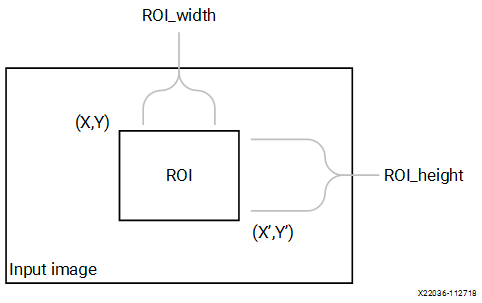

.. rubric:: API Syntax

.. code:: c

   template<int SRC_T, int ROWS, int COLS,int ARCH_TYPE=0,int NPC=1>
   void crop(xf::cv::Mat<SRC_T, ROWS, COLS, NPC> & _src_mat,xf::cv::Mat<SRC_T, ROWS, COLS, NPC>  &_dst_mat,xf::cv::Rect_<unsigned int> &roi)

.. rubric:: Parameter Descriptions

The following table describes the template and the function parameters.

.. table:: Table Crop Parameter Description

   +---------------+------------------------------------------------------+
   | Parameter     | Description                                          |
   +===============+======================================================+
   | SRC_T         | Input pixel type. Only 8-bit, unsigned, 1 and 3      |
   |               | channels are supported (XF_8UC1 and XF_8UC3).        |
   +---------------+------------------------------------------------------+
   | ROWS          | Maximum height of input and output image.            |
   +---------------+------------------------------------------------------+
   | COLS          | Maximum width of input and output image. Must be     |
   |               | multiple of 8 for 8-pixel operation.                 |
   +---------------+------------------------------------------------------+
   | ARCH_TYPE     | Architecture type. 0 resolves to stream              |
   |               | implementation and 1 resolves to memory mapped       |
   |               | implementation.                                      |
   +---------------+------------------------------------------------------+
   | NPC           | Number of pixels to be processed per cycle. NPC      |
   |               | should be power of 2.                                |
   +---------------+------------------------------------------------------+
   | \_src_mat     | Input image                                          |
   +---------------+------------------------------------------------------+
   | \_dst_mat     | Output ROI image                                     |
   +---------------+------------------------------------------------------+
   | roi           | ROI is a ``xf::cv::Rect`` object that consists of the|
   |               | top left corner of the rectangle along with the      |
   |               | height and width of the rectangle.                   |
   +---------------+------------------------------------------------------+

.. rubric:: Resource Utilization

The following table summarizes the resource utilization of crop function
in normal mode (NPC=1) for 3 ROIs (480x640, 100x200, 300x300) as
generated in the Vivado HLS 2019.1 tool for the Xilinx
xczu9eg-ffvb1156-2-i-es2 FPGA.

.. table:: Table Crop Function Resource Utilization Summary

    +-----------------------------+-----------------------------+-----------------------------+
    | Name                        | Resource Utilization                                      |
    +                             +-----------------------------+-----------------------------+
    |                             | 1 pixel per clock operation | 8 pixel per clock operation |  
    +                             +-----------------------------+-----------------------------+
    |                             | 300 MHz                     | 150 MHz                     |
    +=============================+=============================+=============================+
    | BRAM_18K                    | 6                           | 8                           |
    +-----------------------------+-----------------------------+-----------------------------+
    | DSP48E                      | 10                          | 10                          |
    +-----------------------------+-----------------------------+-----------------------------+
    | FF                          | 17482                       | 16995                       |
    +-----------------------------+-----------------------------+-----------------------------+
    | LUT                         | 16831                       | 15305                       |
    +-----------------------------+-----------------------------+-----------------------------+

.. rubric:: Performance Estimate

The following table summarizes a performance estimate of the kernel in
different configurations, generated using Vivado HLS 2019.1 tool for
Xczu9eg-ffvb1156-1-i-es1 FPGA to process a grayscale HD (1080x1920)
image for 3 ROIs (480x640, 100x200, 300x300).

.. table:: Table Crop Function Performance Estimate Summary

    +-----------------------------+------------------+
    | Operating Mode              | Latency Estimate |
    +                             +------------------+
    |                             | Max Latency (ms) |
    +=============================+==================+
    | 1 pixel operation (300 MHz) | 1.7              |
    +-----------------------------+------------------+
    | 8 pixel operation (150 MHz) | 0.6              |
    +-----------------------------+------------------+

Multiple ROI Extraction
------------------------

You can call the ``xf::cv::crop`` function multiple times in accel.cpp.

Multiple ROI Extraction Example
--------------------------------

.. code:: c

   void crop_accel(xf::cv::Mat<TYPE, HEIGHT, WIDTH, NPIX> &_src,xf::cv::Mat<TYPE,HEIGHT, WIDTH, NPIX> _dst[NUM_ROI],xf::cv::Rect_<unsigned int> roi[NUM_ROI])

.. code:: c

    {xf::cv::crop<TYPE, TYPE, HEIGHT, WIDTH, NPIX>(_src, _dst[0],roi[0]); xf::cv::crop<TYPE, TYPE, HEIGHT, WIDTH, NPIX>(_src, _dst[1],roi[1]); xf::cv::crop<TYPE, TYPE, HEIGHT, WIDTH, NPIX>(_src, _dst[2],roi[2]);}
    

.. _customcca:

Custom CCA
==========

The ``custom CCA`` function takes a binary image as input which contains a 
fruit on a conveyer belt (black background) and returns the total fruit pixels 
minus defect, total defect pixels and defect image  which has the defects marked as 
'255'. This function is a custom made solution for defect detection in fruit, which 
ideally works with other pre-processing functions.

The custom CCA algorthm works in two-passes. The first pass includes labelling the 
background, foreground and defect in forward and reverse raster-scan. The second pass 
to perform an '&' operation over the forward and reverse partial output data. 

.. rubric:: API Syntax

.. code:: c

    template <int HEIGHT, int WIDTH>
    void ccaCustom(
    uint8_t* in_ptr1, 
    uint8_t* in_ptr2, 
    uint8_t* tmp_out_ptr1, 
    uint8_t* tmp_out_ptr2, 
    uint8_t* out_ptr, 
    int& obj_pix, 
    int& def_pix, 
    int height, 
    int width)

.. rubric:: Parameter Descriptions

The following table describes the template and the function parameters.

.. table:: Table accumulate Parameter Description

   +-----------------+----------------------------------------------------+
   | Parameter       | Description                                        |
   +=================+====================================================+
   | HEIGHT          | Maximum height of input and output image.          |
   +-----------------+----------------------------------------------------+
   | WIDTH           | Maximum width of input and output image.           |
   +-----------------+----------------------------------------------------+
   | in_ptr1         | Input 8-bit image pointer for forward pass, binary |
   |                 | 8-bit image ('0' and '255')                        |
   +-----------------+----------------------------------------------------+
   | in_ptr1         | Input 8-bit image pointer for the parallel         |
   |                 | computation of reverse pass, binary 8-bit image    |
   |                 | ('0' and '255')                                    |
   +-----------------+----------------------------------------------------+
   | tmp_out_ptr1    | 8-bit pointer to store and read from the temporary |
   |                 | buffer in DDR for the forward pass. This memory    |
   |                 | must be allocated before the kernel call.          |
   +-----------------+----------------------------------------------------+
   | tmp_out_ptr2    | 8-bit pointer to store and read from the temporary |
   |                 | buffer in DDR for the reverse pass. This memory    |
   |                 | must be allocated before the kernel call.          |
   +-----------------+----------------------------------------------------+
   | out_ptr         | Output 8-bit image pointer for the which contains  |
   |                 | the defects image. Defect pixels are marked as     |
   |                 | '255'.                                             |
   +-----------------+----------------------------------------------------+
   | obj_pix         | output - no. of object/foreground pixels without   |
   |                 | the count of defect pixels.                        |
   +-----------------+----------------------------------------------------+
   | def_pix         | output - no. of defect pixels in the               |
   |                 | object/foreground.                                 |
   +-----------------+----------------------------------------------------+
   | height          | Height of the input image                          |
   +-----------------+----------------------------------------------------+
   | Width           | Width of the input image                           |
   +-----------------+----------------------------------------------------+

.. rubric:: Resource Utilization

The following table summarizes the resource utilization for custom CCA, generated using Vitis HLS 2021.1 tool for the xczu9eg-ffvb1156-1-i-es1, to process a FHD (1080x1920) image.

.. table:: Table customCCA Function Resource Utilization Summary

    +----------------+---------------------------+----------------------+-----------+-------+------+------+
    | Operating Mode | Operating Frequency (MHz) |               Utilization Estimate                     |
    +                +                           +----------------------+-----------+-------+------+------+
    |                |                           | BRAM_18K             | DSP_48Es  |   FF  |  LUT | CLB  |
    +================+===========================+======================+===========+=======+======+======+
    | 1 Pixel        | 300                       | 10                   | 10        | 11166 | 7556 | 1757 |
    +----------------+---------------------------+----------------------+-----------+-------+------+------+

The following table summarizes the resource utilization for custom CCA, generated using Vitis HLS 2021.1 tool for the xczu9eg-ffvb1156-1-i-es1, to process a 4K image.

.. table:: Table 16. customCCA Function Resource Utilization Summary

    +----------------+---------------------------+----------------------+-----------+-------+------+------+
    | Operating Mode | Operating Frequency (MHz) |               Utilization Estimate                     |
    +                +                           +----------------------+-----------+-------+------+------+
    |                |                           | BRAM_18K             | DSP_48Es  |   FF  |  LUT | CLB  |
    +================+===========================+======================+===========+=======+======+======+
    | 1 Pixel        | 300                       | 12                   | 10        | 11199 | 7804 | 1748 |
    +----------------+---------------------------+----------------------+-----------+-------+------+------+

.. rubric:: Performance Estimate

The following table summarizes the performance for custom CCA, as generated using Vivado HLS 2019.1 tool for the xczu9eg-ffvb1156-1-i-es1, to process a FHD (1080x1920) image.

.. table:: Table 17. customCCA Function Performance Estimate Summary

    +-----------------------------+------------------+
    | Operating Mode              | Latency Estimate |
    +                             +------------------+
    |                             | Max Latency (ms) |
    +=============================+==================+
    | 1 pixel operation (300 MHz) | 14               |
    +-----------------------------+------------------+

.. _custom-convolution:

Custom Convolution
==================

The ``filter2D`` function performs convolution over an image using a
user-defined kernel.

Convolution is a mathematical operation on two functions *f* and *g*,
producing a third function, The third function is typically viewed as a
modified version of one of the original functions, that gives the area
overlap between the two functions to an extent that one of the original
functions is translated.

The filter can be unity gain filter or a non-unity gain filter. The
filter must be of type XF_16SP. If the co-efficients are floating point,
it must be converted into the Qm.n and provided as the input as well as
the shift parameter has to be set with the ‘n’ value. Else, if the input
is not of floating point, the filter is provided directly and the shift
parameter is set to zero.

.. rubric:: API Syntax

.. code:: c

   template<int BORDER_TYPE,int FILTER_WIDTH,int FILTER_HEIGHT, int SRC_T,int DST_T, int ROWS, int COLS,int NPC=1>
   void filter2D(xf::cv::Mat<SRC_T, ROWS, COLS, NPC> & _src_mat,xf::cv::Mat<DST_T, ROWS, COLS, NPC> & _dst_mat,short int filter[FILTER_HEIGHT*FILTER_WIDTH],unsigned char _shift)

.. rubric:: Parameter Descriptions

The following table describes the template and the function parameters.

.. table:: Table filter2D Parameter Description

   +------------------+---------------------------------------------------+
   | Parameter        | Description                                       |
   +==================+===================================================+
   | BORDER_TYPE      | Border Type supported is XF_BORDER_CONSTANT       |
   +------------------+---------------------------------------------------+
   | FILTER_HEIGHT    | Number of rows in the input filter                |
   +------------------+---------------------------------------------------+
   | FILTER_WIDTH     | Number of columns in the input filter             |
   +------------------+---------------------------------------------------+
   | SRC_T            | Input pixel type. Only 8-bit, unsigned, 1 and 3   |
   |                  | channels are supported (XF_8UC1 and XF_8UC3)      |
   +------------------+---------------------------------------------------+
   | DST_T            | Output pixel type. 8-bit unsigned single and 3    |
   |                  | channels (XF_8UC1, XF_8UC3) and 16-bit signed     |
   |                  | single and 3 channels (XF_16SC1, XF_16SC3)        |
   |                  | supported.                                        |
   +------------------+---------------------------------------------------+
   | ROWS             | Maximum height of input and output image          |
   +------------------+---------------------------------------------------+
   | COLS             | Maximum width of input and output image. Must be  |
   |                  | multiple of 8, for 8 pixel mode.                  |
   +------------------+---------------------------------------------------+
   | NPC              | Number of pixels to be processed per cycle;       |
   |                  | possible options are XF_NPPC1 and XF_NPPC8 for 1  |
   |                  | pixel and 8 pixel operations respectively.        |
   +------------------+---------------------------------------------------+
   | \_src_mat        | Input image                                       |
   +------------------+---------------------------------------------------+
   | \_dst_mat        | Output image                                      |
   +------------------+---------------------------------------------------+
   | filter           | The input filter of any size, provided the        |
   |                  | dimensions should be an odd number. The filter    |
   |                  | co-efficients either a 16-bit value or a 16-bit   |
   |                  | fixed point equivalent value.                     |
   +------------------+---------------------------------------------------+
   | \_shift          | The filter must be of type XF_16SP. If the        |
   |                  | co-efficients are floating point, it must be      |
   |                  | converted into the Qm.n and provided as the input |
   |                  | as well as the shift parameter has to be set with |
   |                  | the ‘n’ value. Else, if the input is not of       |
   |                  | floating point, the filter is provided directly   |
   |                  | and the shift parameter is set to zero.           |
   +------------------+---------------------------------------------------+

.. rubric:: Resource Utilization

The following table summarizes the resource utilization of the kernel in
different configurations, generated using Vivado HLS 2019.1 tool for the
Xczu9eg-ffvb1156-1-i-es1 FPGA, to process a grayscale HD (1080x1920)
image.

.. table:: Table filter2D Function Resource Utilization Summary

    +----------------+----------------+---------------------------+------------------+-----------+-------+-------+----------+
    | Operating Mode | Filter Size    | Operating Frequency (MHz) |           Utilization Estimate                          |
    +                +                +                           +------------------+-----------+-------+-------+----------+
    |                |                |                           | BRAM_18K         | DSP_48Es  | FF    | LUT   |    CLB   |
    +================+================+===========================+==================+===========+=======+=======+==========+
    | 1 Pixel        | 3x3            | 300                       | 3                | 9         | 1701  | 1161  |   269    |
    +                +----------------+---------------------------+------------------+-----------+-------+-------+----------+
    |                | 5x5            | 300                       | 5                | 25        | 3115  | 2144  |   524    |
    +----------------+----------------+---------------------------+------------------+-----------+-------+-------+----------+
    | 8 Pixel        | 3x3            | 150                       | 6                | 72        | 2783  | 2768  |   638    |
    +                +----------------+---------------------------+------------------+-----------+-------+-------+----------+
    |                | 5x5            | 150                       | 10               | 216       | 3020  | 4443  |   1007   |
    +----------------+----------------+---------------------------+------------------+-----------+-------+-------+----------+

The following table summarizes the resource utilization of the kernel in
different configurations, generated using Vivado HLS 2019.1 tool for the
Xilinx Xczu9eg-ffvb1156-1-i-es1 FPGA, to process a 4K 3 Channel image.

.. table:: Table filter2D Function Resource Utilization Summary

    +----------------+---------------+---------------------------+----------------------+-----------+----+-----+
    | Operating Mode | Filter Size   | Operating Frequency (MHz) |               Utilization Estimate          |
    +                +               +                           +----------------------+-----------+----+-----+
    |                |               |                           | BRAM_18K             | DSP_48Es  | FF | LUT |
    +================+===============+===========================+======================+===========+====+=====+
    | 1 Pixel        |  3x3          | 300                       | 18                   | 27        | 886| 801 |
    +----------------+---------------+---------------------------+----------------------+-----------+----+-----+
    | 8 Pixel        |  5x5          | 300                       | 30                   | 75        |1793| 1445|
    +----------------+---------------+---------------------------+----------------------+-----------+----+-----+

.. rubric:: Performance Estimate

The following table summarizes the performance of the kernel in
different configurations, as generated using Vivado HLS 2019.1 tool for
the Xczu9eg-ffvb1156-1-i-es1, to process a grayscale HD (1080x1920)
image.

.. table:: Table filter2D Function Performance Estimate Summary

    +-----------------------------+------------------+------------------+------------------+
    | Operating Mode              |  Operating       |Filter Size       | Latency Estimate |
    +                             +  Frequency       +                  +------------------+
    |                             |  (MHz)           |                  | Max (ms)         |
    +=============================+==================+==================+==================+
    | 1 pixel                     | 300              | 3x3              | 7                |
    +                             +------------------+------------------+------------------+
    |                             | 300              | 5x5              | 7.1              |
    +-----------------------------+------------------+------------------+------------------+
    | 8 pixel                     | 150              | 3x3              | 1.86             |
    +                             +------------------+------------------+------------------+
    |                             | 150              | 5x5              | 1.86             |
    +-----------------------------+------------------+------------------+------------------+

.. _delay:

Delay
=====

In image processing pipelines, it is possible that the inputs to a
function with FIFO interfaces are not synchronized. That is, the first
data packet for first input might arrive a finite number of clock cycles
after the first data packet of the second input. If the function has
FIFOs at its interface with insufficient depth, this causes the whole
design to stall on hardware. To synchronize the inputs, we provide this
function to delay the input packet that arrives early, by a finite
number of clock cycles.

.. rubric:: API Syntax

.. code:: c

   template<int MAXDELAY, int SRC_T, int ROWS, int COLS,int NPC=1 >
             void delayMat(xf::cv::Mat<SRC_T, ROWS, COLS, NPC> & _src, xf::cv::Mat<SRC_T, ROWS, COLS, NPC> & _dst)

.. rubric:: Parameter Descriptions

The table below describes the template and the function parameters.

    +--------------+-------------------------------------------------------+
    | Parameter    | Description                                           |
    +==============+=======================================================+
    | SRC_T        | Input and output pixel type                           |
    +--------------+-------------------------------------------------------+
    | ROWS         | Maximum height of input and output image.             |
    +--------------+-------------------------------------------------------+
    | COLS         | Maximum width of input and output image (must be a    |
    |              | multiple of 8, for 8 pixel operation)                 |
    +--------------+-------------------------------------------------------+
    | NPC          | Number of pixels to be processed per cycle; possible  |
    |              | options are XF_NPPC1 and XF_NPPC8 for 1 pixel and 8   |
    |              | pixel operations respectively.                        |
    +--------------+-------------------------------------------------------+
    | MAXDELAY     | Maximum delay that the function is to be instantiated |
    |              | for.                                                  |
    +--------------+-------------------------------------------------------+
    | \_src        | Input image                                           |
    +--------------+-------------------------------------------------------+
    | \_dst        | Output image                                          |
    +--------------+-------------------------------------------------------+

.. _demosaicing:

Demosaicing
===========

The Demosaicing function converts a single plane Bayer pattern output,
from the digital camera sensors to a color image. This function
implements an improved bi-linear interpolation technique proposed by
Malvar, He, and Cutler.

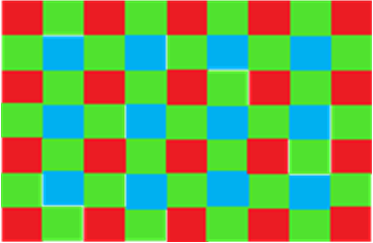

The above figure shows the Bayer mosaic for color image capture in
single-CCD digital cameras.

.. rubric:: API Syntax

.. code:: c

   template<int BFORMAT, int SRC_T, int DST_T, int ROWS, int COLS, int NPC,bool USE_URAM=false>
   void demosaicing(xf::cv::Mat<SRC_T, ROWS, COLS, NPC> &src_mat, xf::cv::Mat<DST_T, ROWS, COLS, NPC> &dst_mat)

.. rubric:: Parameter Descriptions

The following table describes the template and the function parameters.

.. table:: Table Demosaicing Parameter Description

   +---------------+------------------------------------------------------+
   | Parameter     | Description                                          |
   +===============+======================================================+
   | BFORMAT       | Input Bayer pattern. XF_BAYER_BG, XF_BAYER_GB,       |
   |               | XF_BAYER_GR, and XF_BAYER_RG are the supported       |
   |               | values.                                              |
   +---------------+------------------------------------------------------+
   | SRC_T         | Input pixel type. 8-bit, unsigned,1 channel          |
   |               | (XF_8UC1) and 16-bit, unsigned, 1                    |
   |               | channel (XF_16UC1) are supported.                    |
   +---------------+------------------------------------------------------+
   | DST_T         | Output pixel type. 8-bit, unsigned, 4 channel        |
   |               | (XF_8UC4) and 16-bit, unsigned, 4 channel (XF_16UC4) |
   |               | are supported.                                       |
   +---------------+------------------------------------------------------+
   | ROWS          | Number of rows in the image being processed.         |
   +---------------+------------------------------------------------------+
   | COLS          | Number of columns in the image being processed. Must |
   |               | be multiple of 8, in case of 8 pixel mode.           |
   +---------------+------------------------------------------------------+
   | NPC           | Number of pixels to be processed per cycle; single   |
   |               | pixel parallelism (XF_NPPC1), two-pixel parallelism  |
   |               | (XF_NPPC2) and four-pixel parallelism (XF_NPPC4) are |
   |               | supported. XF_NPPC4 is not supported with XF_16UC1   |
   |               | pixel type.                                          |
   +---------------+------------------------------------------------------+
   | USE_URAM      | Enable to map storage structures to UltraRAM.        |
   +---------------+------------------------------------------------------+
   | \_src_mat     | Input image                                          |
   +---------------+------------------------------------------------------+
   | \_dst_mat     | Output image                                         |
   +---------------+------------------------------------------------------+

. rubric:: Resource Utilization

The following table below shows the resource utilization of the
Demosaicing function, generated using Vivado HLS 2019.1 version tool for
the Xczu9eg-ffvb1156-1-i-es1 FPGA.

.. table:: Table Demosaicing Function Resource Utilization Summary

    +----------------+---------------------------+----------------------+-----------+----+-----+-----+
    | Operating Mode | Operating Frequency (MHz) |               Utilization Estimate                |
    +                +                           +----------------------+-----------+----+-----+-----+
    |                |                           | BRAM_18K             | DSP_48Es  | FF | LUT | CLB |
    +================+===========================+======================+===========+====+=====+=====+
    | 1 Pixel        | 300                       | 8                    | 0         |1906| 1915| 412 |
    +----------------+---------------------------+----------------------+-----------+----+-----+-----+
    | 2 Pixel        | 300                       | 8                    | 0         |2876| 3209| 627 |
    +----------------+---------------------------+----------------------+-----------+----+-----+-----+
    | 4 Pixel        | 300                       | 8                    | 0         |2950| 3222| 660 |
    +----------------+---------------------------+----------------------+-----------+----+-----+-----+

The following table shows the resource utilization of the Demosaicing
function, generated using Vivado HLS 2019.1 version tool for the
xczu7ev-ffvc1156-2-e FPGA.

.. table:: Table 206. Demosaicing Function Resource Utilization Summary with UltraRAM Enabled

    +----------------+---------------------------+-----------------------+-----------+----+-----+-----+
    | Operating Mode | Operating Frequency (MHz) |               Utilization Estimate                 |
    +                +                           +------------+----------+-----------+----+-----+-----+
    |                |                           | BRAM_18K   | URAM     | DSP_48Es  | FF | LUT | CLB |
    +================+===========================+============+==========+===========+====+=====+=====+
    | 1 Pixel        | 300                       | 0          |  1       | 0         |1366| 1399| 412 |
    +----------------+---------------------------+------------+----------+-----------+----+-----+-----+

.. rubric:: Performance Estimate

The following table shows the performance in different configurations,
generated using Vivado HLS 2019.1 tool for Xczu9eg-ffvb1156-1-i-es1 to
process a 4K (3840x2160) image.

.. table:: Table Demosaicing Function Performance Estimate Summary

    +-----------------------------+------------------+
    | Operating Mode              | Latency Estimate |
    +                             +------------------+
    |                             | Max Latency (ms) |
    +=============================+==================+
    | 1 pixel operation (300 MHz) | 27.82            |
    +-----------------------------+------------------+
    | 2 pixel operation (300 MHz) | 13.9             |
    +-----------------------------+------------------+
    | 4 pixel operation           | 6.95             |
    +                             +                  +
    | (300 MHz, 8-bit image only) |                  |
    +-----------------------------+------------------+

.. _dilate:

Dilate
======

During a dilation operation, the current pixel intensity is replaced by
the maximum value of the intensity in a nxn neighborhood of the current
pixel.

| 
| |image59|

.. rubric:: API Syntax

.. code:: c

   template<int BORDER_TYPE, int TYPE, int ROWS, int COLS,int K_SHAPE,int K_ROWS,int K_COLS, int ITERATIONS, int NPC=1>
   void dilate (xf::cv::Mat<TYPE, ROWS, COLS, NPC> & _src, xf::cv::Mat<TYPE, ROWS, COLS, NPC> & _dst,unsigned char _kernel[K_ROWS*K_COLS])

.. rubric:: Parameter Descriptions

The following table describes the template and the function parameters.

.. table:: Table dilate Parameter Description

   +---------------+------------------------------------------------------+
   | Parameter     | Description                                          |
   +===============+======================================================+
   | BORDER_TYPE   | Border Type supported is XF_BORDER_CONSTANT          |
   +---------------+------------------------------------------------------+
   | TYPE          | Input and Output pixel type. Only 8-bit, unsigned, 1 |
   |               | and 3 channels are supported (XF_8UC1 and XF_8UC3)   |
   +---------------+------------------------------------------------------+
   | ROWS          | Maximum height of input and output image.            |
   +---------------+------------------------------------------------------+
   | COLS          | Maximum width of input and output image (must be     |
   |               | multiple of 8, for 8-pixel operation)                |
   +---------------+------------------------------------------------------+
   | K_SHAPE       | Shape of the kernel . The supported kernel shapes    |
   |               | are RECT, CROSS, and ELLIPSE.                        |
   +---------------+------------------------------------------------------+
   | NPC           | Number of pixels to be processed per cycle; possible |
   |               | options are XF_NPPC1 and XF_NPPC8 for 1 pixel and 8  |
   |               | pixel operations respectively.                       |
   +---------------+------------------------------------------------------+
   | K_ROWS        | Height of the kernel.                                |
   +---------------+------------------------------------------------------+
   | K_COLS        | Width of the kernel.                                 |
   +---------------+------------------------------------------------------+
   | ITERATIONS    | Number of times the dilation is applied. Currently   |
   |               | supporting for Rectangular shape kernel element.     |
   +---------------+------------------------------------------------------+
   | \_src_mat     | Input image                                          |
   +---------------+------------------------------------------------------+
   | \_dst_mat     | Output image                                         |
   +---------------+------------------------------------------------------+
   | \_kernel      | Dilation kernel of size K_ROWS \* K_COLS.            |
   +---------------+------------------------------------------------------+

.. rubric:: Resource Utilization

The following table summarizes the resource utilization of the Dilation
function with rectangle shape structuring element in 1 pixel operation
and 8 pixel operation, generated using Vivado HLS 2019.1 version tool
for the Xczu9eg-ffvb1156-1-i-es1 FPGA for HD (1080X1920) image.

.. table:: Table dilate Function Resource Utilization Summary

    +-----------------------------+-----------------------------+-----------------------------+
    | Name                        | Resource Utilization                                      |
    +                             +-----------------------------+-----------------------------+
    |                             | 1 pixel per clock operation | 8 pixel per clock operation |  
    +                             +-----------------------------+-----------------------------+
    |                             | 300 MHz                     | 150 MHz                     |
    +=============================+=============================+=============================+
    | BRAM_18K                    | 3                           | 6                           |
    +-----------------------------+-----------------------------+-----------------------------+
    | DSP48E                      | 0                           | 0                           |
    +-----------------------------+-----------------------------+-----------------------------+
    | FF                          | 411                         | 657                         |
    +-----------------------------+-----------------------------+-----------------------------+
    | LUT                         | 392                         | 1249                        |
    +-----------------------------+-----------------------------+-----------------------------+
    | CLB                         | 96                          | 255                         |
    +-----------------------------+-----------------------------+-----------------------------+

.. rubric:: Performance Estimate

The following table summarizes the resource utilization of the Dilation
function with rectangle shape structuring element in 1 pixel operation,
generated using Vivado HLS 2019.1 version tool for the
Xczu9eg-ffvb1156-1-i-es1 FPGA for 4K 3channel image.

.. table:: Table dilate Function Resource Utilization Summary

    +-----------------------------+-----------------------------+
    | Name                        | Resource Utilization        |
    +                             +-----------------------------+
    |                             | 1 pixel per clock operation |  
    +                             +-----------------------------+
    |                             | 300 MHz                     |
    +=============================+=============================+
    | BRAM_18K                    | 18                          |
    +-----------------------------+-----------------------------+
    | DSP48E                      | 0                           |
    +-----------------------------+-----------------------------+
    | FF                          | 983                         |
    +-----------------------------+-----------------------------+
    | LUT                         | 745                         |
    +-----------------------------+-----------------------------+
    | CLB                         | 186                         |
    +-----------------------------+-----------------------------+

The following table summarizes a performance estimate of the Dilation
function for Normal Operation (1 pixel) and Resource Optimized (8 pixel)
configurations, generated using Vivado HLS 2019.1 tool for
Xczu9eg-ffvb1156-1-i-es1 FPGA.

.. table:: Table dilate Function Performance Estimate Summary

    +-----------------------------+------------------+------------------+
    | Operating Mode              | Latency Estimate                    |
    +                             +------------------+------------------+
    |                             | Min Latency (ms) | Max Latency (ms) |
    +=============================+==================+==================+
    | 1 pixel operation (300 MHz) | 7.0              | 7.0              |
    +-----------------------------+------------------+------------------+
    | 8 pixel operation (150 MHz) | 1.87             | 1.87             |
    +-----------------------------+------------------+------------------+

.. _distance-transform:

Distance Transform Feature Matcher
==================================
The distance transform is an operator normally only applied to binary 
images, where in this case the image must be coded as zero and non-zero 
pixels as a grayscale image. The result of the transform is a graylevel 
image that looks similar to the input image, except that the graylevel 
intensities of points inside foreground regions are changed to show the 
distance to the closest boundary from each point.

This Xilinx implementation applies 3x3 mask, of distance type DIST_L2 
(Euclidean distance), with horizontal/vertical shift cost, a = 0.955, and 
diagonal shift cost b = 1.3693.

Computing the distance takes two passes, forward and backward. During the 
forward pass, forward mask is applied, and while the backward pass the 
backward mask is applied over the forward pass data.
In this implementation, it is required to pass a cache memory for the 
kernel to interact (write while forward pass, read while backward pass).
The cache memory must be of image dimensions and of type ap_uint<32>.

.. rubric:: API Syntax

.. code:: c

   template <int IN_PTR, int FW_PTR, int ROWS, int COLS, int USE_URAM>
   void distanceTransform(ap_uint<IN_PTR>* _src,
                          float* _dst, ap_uint<FW_PTR>* _fw_pass, 
                          int rows, int cols)
 
.. rubric:: Parameter Descriptions

The following table describes template paramters and arguments of the function.

.. table:: Table distance-transform Parameter Description

   +-----------------+------------------------------------------------------+
   | Parameter       | Description                                          |
   +=================+======================================================+
   | IN_PTR          | Input pointer width must be '8'.                     |
   +-----------------+------------------------------------------------------+
   | FW_PTR          | Forward pass data pointer width must be '32'.        |
   +-----------------+------------------------------------------------------+
   | ROWS            | Maximum number of rows of the input image that the   |
   |                 | hardware kernel must be built for.                   |
   +-----------------+------------------------------------------------------+
   | COLS            | Maximum number of columns of the input image that    |
   |                 | the hardware kernel must be built for.               |
   +-----------------+------------------------------------------------------+
   | USE_URAM        | Default is '0'. Can be set to '1', if the device has |
   |                 | URAM support.                                        |
   +-----------------+------------------------------------------------------+
   | _src            | Grayscale input image pointer, of ap_uint<8>* type.  |
   +-----------------+------------------------------------------------------+
   | _dst            | The distance image pointer,of type float*.           |
   +-----------------+------------------------------------------------------+
   | _fw_pass        | Forward pass pointer, of type ap_uint<32>. This is   |
   |                 | used as an intermediary cache, between forward and   |
   |                 | backward passes.                                     |
   +-----------------+------------------------------------------------------+
   | rows            | Number of rows in the input image, must be less than |
   |                 | ROWS.                                                |
   +-----------------+------------------------------------------------------+   
   | cols            | Number of cols in the input image, must be less than |
   |                 | COLS.                                                |
   +-----------------+------------------------------------------------------+
   
.. rubric:: Resource Utilization

The following table summarizes the resource utilization of the kernel in different configurations, generated using Vitis 2020.2 tool, to process a 4K image.

.. table:: Table distance-transform Resource Utilization Summary

    +--------------------+-------------------------+--------------------------+--------------+--------+---------+---------+
    |   Operating Mode   |   Operating Frequency   |   Utilization Estimate                                               |
    +                    +   (MHz)                 +--------------------------+--------------+--------+---------+---------+
    |                    |                         |   BRAM_18K               |   DSP_48Es   |   FF   |   LUT   |   CLB   |
    +====================+=========================+==========================+==============+========+=========+=========+
    | default            | 300                     | 22                       | 0            | 5129   | 7444    | 1757    |
    +--------------------+-------------------------+--------------------------+--------------+--------+---------+---------+

.. rubric:: Performance Estimate

The following table summarizes a performance estimate of the kernel in different configurations, as generated using Vitis 2020.2 tool, to process a 4K image.

.. table:: Table distance-transform Function Performance Estimate Summary

   +--------------------+-------------------------+---------------------------------------------+
   |   Operating Mode   |   Operating Frequency   | Latency Estimate                            |
   |                    |   (MHz)                 | **Max (ms)**                                |
   +====================+=========================+=============================================+
   | default            | 200                     |  86.249                                     |
   +--------------------+-------------------------+---------------------------------------------+
   

.. _duplicate:

Duplicate
=========

When various functions in a pipeline are implemented by a programmable
logic, FIFOs are instantiated between two functions for dataflow
processing. When the output from one function is consumed by two
functions in a pipeline, the FIFOs need to be duplicated. This function
facilitates the duplication process of the FIFOs.

.. rubric:: API Syntax

.. code:: c

   template<int SRC_T, int ROWS, int COLS,int NPC=1>
             void duplicateMat(xf::cv::Mat<SRC_T, ROWS, COLS, NPC> & _src, xf::cv::Mat<SRC_T, ROWS, COLS, NPC> & _dst1,xf::cv::Mat<SRC_T, ROWS, COLS, NPC> & _dst2)

.. rubric:: Parameter Descriptions

The table below describes the template and the function parameters.

    +----------+-----------------------------------------------------------+
    | Paramete | Description                                               |
    | r        |                                                           |
    +==========+===========================================================+
    | SRC_T    | Input and output pixel type                               |
    +----------+-----------------------------------------------------------+
    | ROWS     | Maximum height of input and output image.                 |
    +----------+-----------------------------------------------------------+
    | COLS     | Maximum width of input and output image (must be a        |
    |          | multiple of 8, for 8-pixel operation)                     |
    +----------+-----------------------------------------------------------+
    | NPC      | Number of pixels to be processed per cycle. Possible      |
    |          | options are XF_NPPC1 and XF_NPPC8 for 1 pixel and 8 pixel |
    |          | operations respectively.                                  |
    +----------+-----------------------------------------------------------+
    | \_src    | Input image                                               |
    +----------+-----------------------------------------------------------+
    | \_dst1   | Duplicate output for \_src                                |
    +----------+-----------------------------------------------------------+
    | \_dst2   | Duplicate output for \_src                                |
    +----------+-----------------------------------------------------------+

.. _erode:

Erode
=====

The ``erode`` function finds the minimum pixel intensity in the NXN
neighborhood of a pixel and replaces the pixel intensity with the
minimum value.

| 
| |image60|

.. rubric:: API Syntax

.. code:: c

   template<int BORDER_TYPE, int TYPE, int ROWS, int COLS,int K_SHAPE,int K_ROWS,int K_COLS, int ITERATIONS, int NPC=1>
   void erode (xf::cv::Mat<TYPE, ROWS, COLS, NPC> & _src, xf::cv::Mat<TYPE, ROWS, COLS, NPC> & _dst,unsigned char _kernel[K_ROWS*K_COLS]) 

.. rubric:: Parameter Descriptions

The following table describes the template and the function parameters.

.. table:: Table erode Parameter Description

   +----------------+-----------------------------------------------------+
   | Parameter      | Description                                         |
   +================+=====================================================+
   | BORDER_TYPE    | Border type supported is XF_BORDER_CONSTANT         |
   +----------------+-----------------------------------------------------+
   | TYPE           | Input and Output pixel type. Only 8-bit, unsigned,  |
   |                | 1 and 3 channels are supported (XF_8UC1 and         |
   |                | XF_8UC3)                                            |
   +----------------+-----------------------------------------------------+
   | ROWS           | Maximum height of input and output image.           |
   +----------------+-----------------------------------------------------+
   | COLS           | Maximum width of input and output image (must be    |
   |                | multiple of 8, for 8-pixel operation)               |
   +----------------+-----------------------------------------------------+
   | K_SHAPE        | Shape of the kernel . The supported kernel shapes   |
   |                | are RECT,CROSS and ELLIPSE.                         |
   +----------------+-----------------------------------------------------+
   | K_ROWS         | Height of the kernel.                               |
   +----------------+-----------------------------------------------------+
   | K_COLS         | Width of the kernel.                                |
   +----------------+-----------------------------------------------------+
   | ITERATIONS     | Number of times the erosion is applied.Currently    |
   |                | supporting for Rectangular shape kernel element.    |
   +----------------+-----------------------------------------------------+
   | NPC            | Number of pixels to be processed per cycle;         |
   |                | possible options are XF_NPPC1 and XF_NPPC8 for 1    |
   |                | pixel and 8 pixel operations respectively.          |
   +----------------+-----------------------------------------------------+
   | \_src_mat      | Input image                                         |
   +----------------+-----------------------------------------------------+
   | \_dst_mat      | Output image                                        |
   +----------------+-----------------------------------------------------+
   | \_kernel       | Erosion kernel of size K_ROWS \* K_COLS.            |
   +----------------+-----------------------------------------------------+

.. rubric:: Resource Utilization

The following table summarizes the resource utilization of the Erosion
function with rectangular shape structuring element generated using
Vivado HLS 2019.1 version tool for the Xczu9eg-ffvb1156-1-i-es1 FPGA,for
FullHD image(1080x1920).

.. table:: Table erode Function Resource Utilization Summary

    +-----------------------------+-----------------------------+-----------------------------+
    | Name                        | Resource Utilization                                      |
    +                             +-----------------------------+-----------------------------+
    |                             | 1 pixel per clock operation | 8 pixel per clock operation |  
    +                             +-----------------------------+-----------------------------+
    |                             | 300 MHz                     | 150 MHz                     |
    +=============================+=============================+=============================+
    | BRAM_18K                    | 3                           | 6                           |
    +-----------------------------+-----------------------------+-----------------------------+
    | DSP48E                      | 0                           | 0                           |
    +-----------------------------+-----------------------------+-----------------------------+
    | FF                          | 411                         | 657                         |
    +-----------------------------+-----------------------------+-----------------------------+
    | LUT                         | 392                         | 1249                        |
    +-----------------------------+-----------------------------+-----------------------------+
    | CLB                         | 96                          | 255                         |
    +-----------------------------+-----------------------------+-----------------------------+

The following table summarizes the resource utilization of the Erosion
function with rectangular shape structuring element generated using
Vivado HLS 2019.1 version tool for the Xczu9eg-ffvb1156-1-i-es1 FPGA,for
4K image with 3channels.

.. table:: Table erode Function Resource Utilization Summary

    +-----------------------------+-----------------------------+
    | Name                        | Resource Utilization        |
    +                             +-----------------------------+
    |                             | 1 pixel per clock operation |  
    +                             +-----------------------------+
    |                             | 300 MHz                     |
    +=============================+=============================+
    | BRAM_18K                    | 18                          |
    +-----------------------------+-----------------------------+
    | DSP48E                      | 0                           |
    +-----------------------------+-----------------------------+
    | FF                          | 983                         |
    +-----------------------------+-----------------------------+
    | LUT                         | 3745                        |
    +-----------------------------+-----------------------------+
    | CLB                         | 186                         |
    +-----------------------------+-----------------------------+

.. rubric:: Performance Estimate

The following table summarizes a performance estimate of the Erosion
function for Normal Operation (1 pixel) and Resource Optimized (8 pixel)
configurations, generated using Vivado HLS 2019.1 tool for
Xczu9eg-ffvb1156-1-i-es1 FPGA.

.. table:: Table erode Function Performance Estimate Summary

    +-----------------------------+------------------+------------------+
    | Operating Mode              | Latency Estimate                    |
    +                             +------------------+------------------+
    |                             | Min Latency (ms) | Max Latency (ms) |
    +=============================+==================+==================+
    | 1 pixel operation (300 MHz) | 7.0              | 7.0              |
    +-----------------------------+------------------+------------------+
    | 8 pixel operation (150 MHz) | 1.85             | 1.85             |
    +-----------------------------+------------------+------------------+

.. _fast-corner-detection:

FAST Corner Detection
=====================

Features from accelerated segment test (FAST) is a corner detection
algorithm, that is faster than most of the other feature detectors.

The ``fast`` function picks up a pixel in the image and compares the
intensity of 16 pixels in its neighborhood on a circle, called the
Bresenham's circle. If the intensity of 9 contiguous pixels is found to
be either more than or less than that of the candidate pixel by a given
threshold, then the pixel is declared as a corner. Once the corners are
detected, the non-maximal suppression is applied to remove the weaker
corners.

This function can be used for both still images and videos. The corners
are marked in the image. If the corner is found in a particular
location, that location is marked with 255, otherwise it is zero.

.. rubric:: API Syntax

.. code:: c

   template<int NMS,int SRC_T,int ROWS, int COLS,int NPC=1>
   void fast(xf::cv::Mat<SRC_T, ROWS, COLS, NPC> & _src_mat,xf::cv::Mat<SRC_T, ROWS, COLS, NPC> & _dst_mat,unsigned char _threshold)

.. rubric:: Parameter Descriptions

The following table describes the template and the function parameters.

.. table:: Table fast Parameter Description

   +------------+---------------------------------------------------------+
   | Parameter  | Description                                             |
   +============+=========================================================+
   | NMS        | If NMS == 1, non-maximum suppression is applied to      |
   |            | detected corners (keypoints). The value should be 0 or  |
   |            | 1.                                                      |
   +------------+---------------------------------------------------------+
   | SRC_T      | Input pixel type. Only 8-bit, unsigned, 1-channel is    |
   |            | supported (XF_8UC1)                                     |
   +------------+---------------------------------------------------------+
   | ROWS       | Maximum height of input image.                          |
   +------------+---------------------------------------------------------+
   | COLS       | Maximum width of input image (must be a multiple of 8,  |
   |            | for 8-pixel operation)                                  |
   +------------+---------------------------------------------------------+
   | NPC        | Number of pixels to be processed per cycle; possible    |
   |            | options are XF_NPPC1 and XF_NPPC8 for 1 pixel and 8     |
   |            | pixel operations respectively.                          |
   +------------+---------------------------------------------------------+
   | \_src_mat  | Input image                                             |
   +------------+---------------------------------------------------------+
   | \_dst_mat  | Output image. The corners are marked in the image.      |
   +------------+---------------------------------------------------------+
   | \_threshol | Threshold on the intensity difference between the       |
   | d          | center pixel and its neighbors. Usually it is taken     |
   |            | around 20.                                              |
   +------------+---------------------------------------------------------+

.. rubric:: Resource Utilization

The following table summarizes the resource utilization of the kernel
for different configurations, generated using Vivado HLS 2019.1 for the
Xczu9eg-ffvb1156-1-i-es1 FPGA, to process a grayscale HD (1080x1920)
image with NMS.

.. table:: Table fast Function Resource Utilization Summary

    +-----------------------------+-----------------------------+-----------------------------+
    | Name                        | Resource Utilization                                      |
    +                             +-----------------------------+-----------------------------+
    |                             | 1 pixel per clock operation | 8 pixel per clock operation |  
    +                             +-----------------------------+-----------------------------+
    |                             | 300 MHz                     | 150 MHz                     |
    +=============================+=============================+=============================+
    | BRAM_18K                    | 10                          | 20                          |
    +-----------------------------+-----------------------------+-----------------------------+
    | DSP48E                      | 0                           | 0                           |
    +-----------------------------+-----------------------------+-----------------------------+
    | FF                          | 2695                        | 7310                        |
    +-----------------------------+-----------------------------+-----------------------------+
    | LUT                         | 3792                        | 20956                       |
    +-----------------------------+-----------------------------+-----------------------------+
    | CLB                         | 769                         | 3519                        |
    +-----------------------------+-----------------------------+-----------------------------+

.. rubric:: Performance Estimate

The following table summarizes the performance of kernel for different
configurations, as generated using Vivado HLS 2019.1 tool for the
Xczu9eg-ffvb1156-1-i-es1, to process a grayscale HD (1080x1920) image
with non-maximum suppression (NMS).

.. table:: Table fast Function Performance Estimate Summary

    +-----------------------------+------------------+------------------+------------------+
    | Operating Mode              |  Operating       |Filter Size       | Latency Estimate |
    +                             +  Frequency       +                  +------------------+
    |                             |  (MHz)           |                  | Max (ms)         |
    +=============================+==================+==================+==================+
    | 1 pixel                     | 300              | 3x3              | 7                |
    +-----------------------------+------------------+------------------+------------------+
    | 8 pixel                     | 150              | 3x3              | 1.86             |
    +-----------------------------+------------------+------------------+------------------+

.. _gaincontrol:

Gaincontrol
============

The gain control modules improve the overall brightness of the input image. In this module, applying a multiplicative gain (weight) for red and blue channel of the input bayerized image.

.. rubric:: API Syntax

.. code:: c

   template <int BFORMAT, int SRC_T, int ROWS, int COLS, int NPC = 1>
            void gaincontrol(xf::cv::Mat<SRC_T, ROWS, COLS, NPC>& src,
                             xf::cv::Mat<SRC_T, ROWS, COLS, NPC>& dst,
                             unsigned short rgain,
                             unsigned short bgain)

The following table describes the template and the function parameters.

.. table:: Table gaincontrol Parameter Description

    +-----------+--------------------------------------------------------------------+
    | Parameter | Description                                                        |
    +===========+====================================================================+
    | BFORMAT   | Input Bayer pattern.                                               |
    +-----------+--------------------------------------------------------------------+
    | SRC_T     | Input and Output Pixel Type.                                       |
    +-----------+--------------------------------------------------------------------+
    | ROWS      | Maximum height of input and output image (Must be multiple of NPC) |
    +-----------+--------------------------------------------------------------------+
    | COLS      | Maximum width of input and output image (Must be multiple of NPC)  |
    +-----------+--------------------------------------------------------------------+
    | NPC       | Number of Pixels to be processed per cycle.                        |
    +-----------+--------------------------------------------------------------------+
    | src       | Input Bayer image                                                  |
    +-----------+--------------------------------------------------------------------+
    | dst       | Output Bayer image                                                 |
    +-----------+--------------------------------------------------------------------+
    | rgain     | gain value for red channel in Q9.7 format                          |
    +-----------+--------------------------------------------------------------------+
    | bgain     | gain value for red channel in Q9.7 format                          |
    +-----------+--------------------------------------------------------------------+

.. rubric:: Resource Utilization

The following table summarizes the resource utilization of the kernel in different configurations, generated using Vivado HLS 2019.2 tool for the Xilinx xc7vx485t-ffg1157-1 FPGA, to process 4K image.

.. table:: Table gaincontrol Resource Utilization Summary

    +----------------+---------------------+----------------------+----------+-----+-----+-------+
    | Operating Mode | Operating Frequency | Utilization Estimate |          |     |     |       |
    |                |                     |                      |          |     |     |       |
    |                | (MHz)               |                      |          |     |     |       |
    +                +                     +----------------------+----------+-----+-----+-------+
    |                |                     | BRAM_18K             | DSP_48Es | FF  | LUT | SLICE |
    +================+=====================+======================+==========+=====+=====+=======+
    | 1 pixel        | 300                 | 0                    | 3        | 233 | 95  | 59    |
    +----------------+---------------------+----------------------+----------+-----+-----+-------+
    | 2 pixel        | 300                 | 0                    | 3        | 235 | 95  | 59    |
    +----------------+---------------------+----------------------+----------+-----+-----+-------+

.. rubric:: Performance Estimate

The following table summarizes a performance estimate of the kernel in different configurations, as generated using Vivado HLS 2019.2 tool for the Xilinx xc7vx485t-ffg1157-1, to process a 4K image.

    +----------------+---------------------+------------------+
    | Operating Mode | Operating Frequency | Latency Estimate |
    |                |                     |                  |
    |                | (MHz)               |                  |
    +                +                     +------------------+
    |                |                     | Max (ms)         |
    +================+=====================+==================+
    | 1 pixel        | 300                 | 27.7             |
    +----------------+---------------------+------------------+
    | 2 pixel        | 300                 | 14.2             |
    +----------------+---------------------+------------------+

.. _extractExposureFrames:

Extract Exposure Frames 
========================

The extractExposureFrames module returns the Shortexposureframe and Longexposureframe from the input frame using the Digital overlap parameter.

.. rubric:: API Syntax

.. code:: c

   template <int SRC_T, int N_ROWS, int MAX_ROWS, int MAX_COLS, int NPPC = XF_NPPC1, int USE_URAM = 0>
            void extractExposureFrames(xf::cv::Mat<SRC_T, MAX_ROWS * 2, MAX_COLS, NPPC>& _hdrSrc,
                                       xf::cv::Mat<SRC_T, MAX_ROWS, MAX_COLS, NPPC>& _lefSrc,
                                       xf::cv::Mat<SRC_T, MAX_ROWS, MAX_COLS, NPPC>& _sefSrc)

The following table describes the template and the function parameters.

.. table:: Table extractExposureFrames Parameter Description

    +-----------+--------------------------------------------------------------------+
    | Parameter | Description                                                        |
    +===========+====================================================================+
    | SRC_T     | Input and Output Pixel Type.                                       |
    +-----------+--------------------------------------------------------------------+
    | N_ROWS    | Number of Digital overlap rows between SEF and LEF                 |
    +-----------+--------------------------------------------------------------------+
    | MAX_ROWS  | Maximum height of input and output image (Must be multiple of NPC) |
    +-----------+--------------------------------------------------------------------+
    | MAX_COLS  | Maximum width of input and output image (Must be multiple of NPC)  |
    +-----------+--------------------------------------------------------------------+
    | NPPC      | Number of Pixels to be processed per cycle.                        |
    +-----------+--------------------------------------------------------------------+
    | USE_URAM  | enable to use URAM instead of BRAM in the design.                  |
    +-----------+--------------------------------------------------------------------+
    | _hdrSrc   | Input HDR image                                                    |
    +-----------+--------------------------------------------------------------------+
    | _lefSrc   | Long exposure frame                                                |
    +-----------+--------------------------------------------------------------------+
    | _sefSrc   | Short exposure frame                                               |
    +-----------+--------------------------------------------------------------------+

.. rubric:: Resource Utilization

The following table summarizes the resource utilization of the kernel in different configurations, generated using Vivado HLS 2019.2 tool for the Xilinx xc7vx485t-ffg1157-1 FPGA, to process a HD image.

.. table:: Table extractExposureFrames Resource Utilization Summary

    +----------------+---------------------+----------------------+----------+------+------+------+
    | Operating Mode | Operating Frequency | Utilization Estimate |          |      |      |      |
    |                |                     |                      |          |      |      |      |
    |                | (MHz)               |                      |          |      |      |      |
    +                +                     +----------------------+----------+------+------+------+
    |                |                     | BRAM_18K             | DSP_48Es | FF   | LUT  | CLB  |
    +================+=====================+======================+==========+======+======+======+
    | 1 pixel        | 300                 | 8                    | 0        | 408  | 304  | 120  |
    +----------------+---------------------+----------------------+----------+------+------+------+

.. rubric:: Performance Estimate

The following table summarizes a performance estimate of the kernel in different configurations, as generated using Vivado HLS 2019.2 tool for the Xilinx xc7vx485t-ffg1157-1 FPGA, to process a HD image.

.. table:: Table extractExposureFrames Resource Utilization Summary

    +----------------+---------------------+------------------+
    | Operating Mode | Operating Frequency | Latency Estimate |
    |                |                     |                  |
    |                | (MHz)               |                  |
    +                +                     +------------------+
    |                |                     | Max (ms)         |
    +================+=====================+==================+
    | 1 pixel        | 300                 | 14               |
    +----------------+---------------------+------------------+

.. _flip:

Flip
====

The Flip function converts input image into output image which is a horizontal flip or vertical flip or both of input image, 
based on user input.

.. rubric:: API Syntax

.. code:: c

    template <int PTR_WIDTH, int TYPE, int ROWS, int COLS, int NPC>
    void flip(ap_uint<PTR_WIDTH>* SrcPtr,
              ap_uint<PTR_WIDTH>* DstPtr,
              int Rows,
              int Cols,
              int Direction)

The following table describes the template and the function parameters.

.. table:: Table Flip Parameter Description

    +-----------+--------------------------------------------------------------------+
    | Parameter | Description                                                        |
    +===========+====================================================================+
    | PTR_WIDTH | Pixel Width of Input and Output Pointer                            |
    +-----------+--------------------------------------------------------------------+
    | TYPE      | Input and Output Pixel type                                        |
    +-----------+--------------------------------------------------------------------+
    | ROWS      | Maximum height of input and output image (Must be multiple of NPC) |
    +-----------+--------------------------------------------------------------------+
    | COLS      | Maximum width of input and output image (Must be multiple of NPC)  |
    +-----------+--------------------------------------------------------------------+
    | NPC       | Number of Pixels to be processed per cycle.                        |
    +-----------+--------------------------------------------------------------------+
    | SrcPtr    | Input Image pointer.                                               |
    +-----------+--------------------------------------------------------------------+
    | DstPtr    | Output Image pointer.                                              |
    +-----------+--------------------------------------------------------------------+
    | Rows      | Height of the image                                                |
    +-----------+--------------------------------------------------------------------+
    | Cols      | Width of the image                                                 |
    +-----------+--------------------------------------------------------------------+
    | Direction | Direction of flip, possible values are horizontal (0),             |
    |           | vertical (1) and both (-1)                                         |
    +-----------+--------------------------------------------------------------------+

.. rubric:: Resource Utilization

The following table summarizes the resource utilization in different configurations, generated using Vitis HLS 2021.1 tool for the xczu7ev-ffvc1156-2-e, to process a grayscale 4k (2160x3840) image. 

.. table:: Table flip Resource Utilization Summary

    +----------------+----------------+---------------------+----------------------+----------+------+------+------+
    | Operating Mode | Direction of   | Operating Frequency | Utilization Estimate |          |      |      |      |
    |                | flip           |                     |                      |          |      |      |      |
    |                |                | (MHz)               |                      |          |      |      |      |
    +                +                +                     +----------------------+----------+------+------+------+
    |                |                |                     | BRAM_18K             | DSP      | FF   | LUT  | URAM |
    +================+================+=====================+======================+==========+======+======+======+
    | 1 Pixel        | Horizontal     | 300                 | 12                   | 5        | 5888 | 7787 | 0    |
    +                +----------------+---------------------+----------------------+----------+------+------+------+
    |                | Vertical       | 300                 | 12                   | 5        | 5888 | 7787 | 0    |
    +                +----------------+---------------------+----------------------+----------+------+------+------+
    |                | Both           | 300                 | 12                   | 5        | 5888 | 7787 | 0    |
    +----------------+----------------+---------------------+----------------------+----------+------+------+------+
    | 4 Pixel        | Horizontal     | 300                 | 16                   | 5        | 7180 | 9794 | 0    |
    +                +----------------+---------------------+----------------------+----------+------+------+------+
    |                | Vertical       | 300                 | 16                   | 5        | 7180 | 9794 | 0    |
    +                +----------------+---------------------+----------------------+----------+------+------+------+
    |                | Both           | 300                 | 16                   | 5        | 7180 | 9794 | 0    |
    +----------------+----------------+---------------------+----------------------+----------+------+------+------+

The following table summarizes the resource utilization in different configurations, generated using Vitis HLS 2021.1 tool for the xczu7ev-ffvc1156-2-e, to process a 4k (2160x3840) 3 channel image.  

.. table:: Table flip Resource Utilization Summary

    +----------------+----------------+---------------------+----------------------+----------+------+-------+------+
    | Operating Mode | Direction of   | Operating Frequency | Utilization Estimate |          |      |       |      |
    |                | flip           |                     |                      |          |      |       |      |
    |                |                | (MHz)               |                      |          |      |       |      |
    +                +                +                     +----------------------+----------+------+-------+------+
    |                |                |                     | BRAM_18K             | DSP      | FF   | LUT   | URAM |
    +================+================+=====================+======================+==========+======+=======+======+
    | 1 Pixel        | Horizontal     | 300                 | 32                   | 5        | 6355 | 9005  | 0    |
    +                +----------------+---------------------+----------------------+----------+------+-------+------+
    |                | Vertical       | 300                 | 32                   | 5        | 6355 | 9005  | 0    |
    +                +----------------+---------------------+----------------------+----------+------+-------+------+
    |                | Both           | 300                 | 32                   | 5        | 6355 | 9005  | 0    |
    +----------------+----------------+---------------------+----------------------+----------+------+-------+------+
    | 4 Pixel        | Horizontal     | 300                 | 56                   | 5        | 8798 | 15409 | 0    |
    +                +----------------+---------------------+----------------------+----------+------+-------+------+
    |                | Vertical       | 300                 | 56                   | 5        | 8798 | 15409 | 0    |
    +                +----------------+---------------------+----------------------+----------+------+-------+------+
    |                | Both           | 300                 | 56                   | 5        | 8798 | 15409 | 0    |
    +----------------+----------------+---------------------+----------------------+----------+------+-------+------+

.. rubric:: Performance Estimate

The following table summarizes the resource utilization in different configurations, generated using Vitis HLS 2021.1 tool for the xczu7ev-ffvc1156-2-e, to process a 4k (2160x3840) 3 channel image.

.. table:: Table flip Resource Utilization Summary

    +----------------+---------------------+------------------+
    | Operating Mode | Operating Frequency | Latency Estimate |
    |                |                     |                  |
    |                | (MHz)               |                  |
    +                +                     +------------------+
    |                |                     | Max (ms)         |
    +================+=====================+==================+
    | 1 pixel        | 300                 | 28.5             |
    +----------------+---------------------+------------------+
    | 4 pixel        | 300                 | 7.7              |
    +----------------+---------------------+------------------+

.. _gammacorrection:

Gamma Correction
=================

The gammacorrection modules improves the overall brightness of image. The gamma lookuptable is generated using the gamma value and with following equation.

|image162|

|image163|

.. rubric:: API Syntax

.. code:: c

   template <int SRC_T, int DST_T, int ROWS, int COLS, int NPC = 1>
   void gammacorrection(xf::cv::Mat<SRC_T, ROWS, COLS, NPC>& src,
                        xf::cv::Mat<DST_T, ROWS, COLS, NPC>& dst,
                        unsigned char lut_table[256 * 3])

The following table describes the template and the function parameters.

.. table:: Table gammacorrection Parameter Description

    +-----------+--------------------------------------------------------------------+
    | Parameter | Description                                                        |
    +===========+====================================================================+
    | SRC_T     | Input Pixel Type.                                                  |
    +-----------+--------------------------------------------------------------------+
    | DST_T     | Output Pixel Type.                                                 |
    +-----------+--------------------------------------------------------------------+
    | ROWS      | Maximum height of input and output image (Must be multiple of NPC) |
    +-----------+--------------------------------------------------------------------+
    | COLS      | Maximum width of input and output image (Must be multiple of NPC)  |
    +-----------+--------------------------------------------------------------------+
    | NPC       | Number of Pixels to be processed per cycle.                        |
    +-----------+--------------------------------------------------------------------+
    | src       | Input image                                                        |
    +-----------+--------------------------------------------------------------------+
    | dst       | Output image                                                       |
    +-----------+--------------------------------------------------------------------+
    | lut_table | Lookup table for gamma values.first 256 will be R,next 256 values  +
    |           | are G gamma and last 256 values are B values                       |
    +-----------+--------------------------------------------------------------------+

.. rubric:: Resource Utilization

The following table summarizes the resource utilization of the kernel in different configurations, generated using Vivado HLS 2019.2 tool for the Xilinx xc7vx485t-ffg1157-1 FPGA, to process a 4K image.

.. table:: Table gammacorrection Resource Utilization Summary

    +----------------+---------------------+----------------------+----------+------+------+------+
    | Operating Mode | Operating Frequency | Utilization Estimate |          |      |      |      |
    |                |                     |                      |          |      |      |      |
    |                | (MHz)               |                      |          |      |      |      |
    +                +                     +----------------------+----------+------+------+------+
    |                |                     | BRAM_18K             | DSP_48Es | FF   | LUT  | CLB  |
    +================+=====================+======================+==========+======+======+======+
    | 1 pixel        | 300                 | 3                    | 0        | 177  | 360  | 120  |
    +----------------+---------------------+----------------------+----------+------+------+------+

.. rubric:: Performance Estimate

The following table summarizes a performance estimate of the kernel in different configurations, as generated using Vivado HLS 2019.2 tool for the Xilinx xc7vx485t-ffg1157-1 FPGA, to process a 4K image.

.. table:: Table gammacorrection Resource Utilization Summary

    +----------------+---------------------+------------------+
    | Operating Mode | Operating Frequency | Latency Estimate |
    |                |                     |                  |
    |                | (MHz)               |                  |
    +                +                     +------------------+
    |                |                     | Max (ms)         |
    +================+=====================+==================+
    | 1 pixel        | 300                 | 27.9             |
    +----------------+---------------------+------------------+
    | 4 pixel        | 300                 | 7                |
    +----------------+---------------------+------------------+

.. include:: include/gtm_api.rst

.. _hdrmerge:

HDR Merge
==========

HDR Merge module generates the High Dynamic Range (HDR) image from a set of different exposure frames. Usually, image sensors has limited dynamic range and it's difficult to get HDR image with single image capture. From the sensor, the frames are collected with different exposure times and will get different exposure frames. HDRMerge will generate the HDR frame with those exposure frames.
The HDRMerge in RGB domain is complex and expensive interms of latency, because of camera response function. But,in Bayer domain the camera resonse function is linear.
The radiance value which passes through the lens of the image sensor is converted into pixel intensity value. The camera response function relates the radiance value to pixel value.
The CRF function in 

        |HDRIMG1|
        
        here, |HDRIMG2|
        
The CRF function f(x) linearly express as

        |HDRIMG3|    
        
To compute the weight in pixel value domain, 

        |HDRIMG4|

.. rubric:: API Syntax

.. code:: c

    template <int SRC_T, int DST_T, int ROWS, int COLS, int NPC = 1, int NO_EXPS, int W_SIZE>
    void Hdrmerge_bayer(xf::cv::Mat<SRC_T, ROWS, COLS, NPC>& _src_mat1,
                    xf::cv::Mat<SRC_T, ROWS, COLS, NPC>& _src_mat2,
                    xf::cv::Mat<SRC_T, ROWS, COLS, NPC>& _dst_mat,
                    short wr_hls[NO_EXPS * NPC * W_SIZE])

The following table describes the template and the function parameters.

.. table:: Table HDRmerge Parameter Description

    +-----------+--------------------------------------------------------------------+
    | Parameter | Description                                                        |
    +===========+====================================================================+
    | SRC_T     | Input Pixel Type.                                                  |
    +-----------+--------------------------------------------------------------------+
    | DST_T     | Output Pixel Type.                                                 |
    +-----------+--------------------------------------------------------------------+
    | ROWS      | Maximum height of input and output image (Must be multiple of NPC) |
    +-----------+--------------------------------------------------------------------+
    | COLS      | Maximum width of input and output image (Must be multiple of NPC)  |
    +-----------+--------------------------------------------------------------------+
    | NPC       | Number of Pixels to be processed per cycle.                        |
    +-----------+--------------------------------------------------------------------+
    | NO_EXPS   | Number exposure frames to be merged in the module                  |
    +-----------+--------------------------------------------------------------------+
    | W_SIZE    | W_SIZE is should be 2 power pixel width.                           |
    +-----------+--------------------------------------------------------------------+
    | _src_mat1 | Short exposure frame                                               |
    +-----------+--------------------------------------------------------------------+
    | _src_mat2 | Long exposure frame                                                |
    +-----------+--------------------------------------------------------------------+
    | _dst_mat  | Output HDR image                                                   |
    +-----------+--------------------------------------------------------------------+
    | wr_hls    | Lookup table for weight values.computing the weights LUT in host   |
    |           | side and passing as input to the function.weight values are Q1.15  |
    +-----------+--------------------------------------------------------------------+

.. rubric:: Resource Utilization

The following table summarizes the resource utilization in different configurations, generated using Vitis HLS 2021.1 tool for the xczu9eg-ffvb1156-2-e, to process a bayer HD image. 

.. table:: Table HDRMerge Resource Utilization Summary

    +----------------+----------------+---------------------+----------------------+----------+------+------+------+
    | Operating Mode | Pixel Type     | Operating Frequency | Utilization Estimate |          |      |      |      |
    |                |                |                     |                      |          |      |      |      |
    |                |                | (MHz)               |                      |          |      |      |      |
    +                +                +                     +----------------------+----------+------+------+------+
    |                |                |                     | BRAM_18K             | DSP      | FF   | LUT  | CLB  |
    +================+================+=====================+======================+==========+======+======+======+
    | 1 Pixel        | 8bit           | 300                 | 2                    | 8        | 5824 | 4886 | 1079 |
    +                +----------------+---------------------+----------------------+----------+------+------+------+
    |                | 10bit          | 300                 | 2                    | 8        | 5826 | 4919 | 1034 |
    +----------------+----------------+---------------------+----------------------+----------+------+------+------+

.. rubric:: Performance Estimate

The following table summarizes the latency numbers in different configurations, generated using Vitis HLS 2021.1 tool for the xczu9eg-ffvb1156-2-e, to process a HD image.

.. table:: Table HDRMerge Latency Summary

    +----------------+---------------------+------------------+
    | Operating Mode | Operating Frequency | Latency Estimate |
    |                |                     |                  |
    |                | (MHz)               |                  |
    +                +                     +------------------+
    |                |                     | Max (ms)         |
    +================+=====================+==================+
    | 1 pixel        | 300                 | 7.3              |
    +----------------+---------------------+------------------+
    | 2 pixel        | 300                 | 3.7              |
    +----------------+---------------------+------------------+

.. _gaussian-filter:

Gaussian Filter
===============

The ``GaussianBlur`` function applies Gaussian blur on the input image.
Gaussian filtering is done by convolving each point in the input image
with a Gaussian kernel.

| 
| |image61|

Where |image62|,\ |image63| are the mean values and |image64|, |image65|
are the variances in x and y directions respectively. In the
GaussianBlur function, values of |image66|, |image67| are considered as
zeroes and the values of |image68|, |image69| are equal.

.. rubric:: API Syntax

.. code:: c

   template<int FILTER_SIZE, int BORDER_TYPE, int SRC_T, int ROWS, int COLS, int NPC =  1>
   void GaussianBlur(xf::cv::Mat<SRC_T, ROWS, COLS, NPC> & src, xf::cv::Mat<SRC_T, ROWS, COLS, NPC> & dst, float sigma)

.. rubric:: Parameter Descriptions

The following table describes the template and the function parameters.

.. table:: Table . GaussianBlur Parameter Description

   +----------------+-----------------------------------------------------+
   | Parameter      | Description                                         |
   +================+=====================================================+
   | FILTER_SIZE    | Filter size. Filter size of 3 (XF_FILTER_3X3), 5    |
   |                | (XF_FILTER_5X5) and 7 (XF_FILTER_7X7) are           |
   |                | supported.                                          |
   +----------------+-----------------------------------------------------+
   | BORDER_TYPE    | Border type supported is XF_BORDER_CONSTANT         |
   +----------------+-----------------------------------------------------+
   | SRC_T          | Input and Output pixel type. Only 8-bit, unsigned,  |
   |                | 1 and 3 channels are supported (XF_8UC1 and         |
   |                | XF_8UC3)                                            |
   +----------------+-----------------------------------------------------+
   | ROWS           | Maximum height of input and output image.           |
   +----------------+-----------------------------------------------------+
   | COLS           | Maximum width of input and output image (must be a  |
   |                | multiple of 8, for 8-pixel operation)               |
   +----------------+-----------------------------------------------------+
   | NPC            | Number of pixels to be processed per cycle;         |
   |                | possible values are XF_NPPC1 and XF_NPPC8 for 1     |
   |                | pixel and 8 pixel operations respectively.          |
   +----------------+-----------------------------------------------------+
   | src            | Input image                                         |
   +----------------+-----------------------------------------------------+
   | dst            | Output image                                        |
   +----------------+-----------------------------------------------------+
   | sigma          | Standard deviation of Gaussian filter               |
   +----------------+-----------------------------------------------------+

.. rubric:: Resource Utilization

The following table summarizes the resource utilization of the Gaussian
Filter in different configurations, generated using Vivado HLS 2019.1
version tool for the Xczu9eg-ffvb1156-1-i-es1 FPGA, to progress a
grayscale HD (1080x1920) image.

.. table:: Table . GaussianBlur Function Resource Utilization Summary

    +----------------+----------------+---------------------------+------------------+-----------+-------+-------+----------+
    | Operating Mode | Filter Size    | Operating Frequency (MHz) |           Utilization Estimate                          |      
    +                +                +                           +------------------+-----------+-------+-------+----------+
    |                |                |                           | BRAM_18K         | DSP_48Es  | FF    | LUT   | CLB      |
    +================+================+===========================+==================+===========+=======+=======+==========+
    | 1 Pixel        | 3x3            | 300                       | 3                | 17        | 3641  | 2791  | 610      |
    +                +----------------+---------------------------+------------------+-----------+-------+-------+----------+
    |                | 5x5            | 300                       | 5                | 27        | 4461  | 3544  | 764      |
    +                +----------------+---------------------------+------------------+-----------+-------+-------+----------+
    |                | 7x7            | 250                       | 7                | 35        | 4770  | 4201  | 894      |
    +----------------+----------------+---------------------------+------------------+-----------+-------+-------+----------+
    | 8 Pixel        | 3x3            | 150                       | 6                | 52        | 3939  | 3784  | 814      |
    +                +----------------+---------------------------+------------------+-----------+-------+-------+----------+
    |                | 5x5            | 150                       | 10               | 111       | 5688  | 5639  | 1133     |
    +                +----------------+---------------------------+------------------+-----------+-------+-------+----------+
    |                | 7x7            | 150                       | 14               | 175       | 7594  | 7278  | 1518     |
    +----------------+----------------+---------------------------+------------------+-----------+-------+-------+----------+

The following table summarizes the resource utilization of the Gaussian
Filter in different configurations, generated using Vivado HLS 2019.1
version tool for the Xczu9eg-ffvb1156-1-i-es1 FPGA, to progress a 4K 3
Channel image.

.. table:: Table . GaussianBlur Function Resource Utilization Summary

    +----------------+---------------------------+----------------------+-----------+-----------+-----+-----+
    | Operating Mode | Filter Size               | Operating Frequency  | Utilization Estimate              |
    +                +                           +                      +-----------+-----------+-----+-----+
    |                |                           | (MHz)                | BRAM_18K  | DSP_48Es  | LUT | CLB |
    +================+===========================+======================+===========+===========+=====+=====+
    | 1 Pixel        | 3x3                       | 300                  | 18        | 33        | 4835| 3742|
    +                +---------------------------+----------------------+-----------+-----------+-----+-----+
    |                | 5x5                       | 300                  | 30        | 51        | 5755| 3994|
    +                +---------------------------+----------------------+-----------+-----------+-----+-----+
    |                | 7x7                       | 300                  | 42        | 135       | 8086| 5422|
    +----------------+---------------------------+----------------------+-----------+-----------+-----+-----+

.. rubric:: Performance Estimate

The following table summarizes a performance estimate of the Gaussian
Filter in different configurations, as generated using Vivado HLS 2019.1
tool for Xczu9eg-ffvb1156-1-i-es1 FPGA, to process a grayscale HD
(1080x1920) image.

.. table:: Table . GaussianBlur Function Performance Estimate Summary

    +-----------------------------+------------------+------------------+
    | Operating Mode              | Filter Size      | Latency Estimate |
    +                             +                  +------------------+
    |                             |                  | Max Latency (ms) |
    +=============================+==================+==================+
    | 1 pixel operation (300 MHz) | 3x3              | 7.01             |
    +                             +------------------+------------------+
    |                             | 5x5              | 7.03             |
    +                             +------------------+------------------+
    |                             | 7x7              | 7.06             |
    +-----------------------------+------------------+------------------+
    | 8 pixel operation (150 MHz) | 3x3              | 1.6              |
    +                             +------------------+------------------+
    |                             | 5x5              | 1.7              |
    +                             +------------------+------------------+
    |                             | 7x7              | 1.74             |
    +-----------------------------+------------------+------------------+

.. _gradient-magnitude:

Gradient Magnitude
==================

The ``magnitude`` function computes the magnitude for the images. The
input images are x-gradient and y-gradient images of type 16S. The
output image is of same type as the input image.

For L1NORM normalization, the magnitude computed image is the pixel-wise
added image of absolute of x-gradient and y-gradient, as shown below:.

| 
| |image70|

For L2NORM normalization, the magnitude computed image is as follows:

| 
| |image71|

.. rubric:: API Syntax

.. code:: c

   template< int NORM_TYPE ,int SRC_T,int DST_T, int ROWS, int COLS,int NPC=1>
   void magnitude(xf::cv::Mat<SRC_T, ROWS, COLS, NPC> & _src_matx,xf::cv::Mat<DST_T, ROWS, COLS, NPC> & _src_maty,xf::cv::Mat<DST_T, ROWS, COLS, NPC> & _dst_mat)

.. rubric:: Parameter Descriptions

The following table describes the template and the function parameters.

.. table:: Table . magnitude Parameter Description

   +------------+---------------------------------------------------------+
   | Parameter  | Description                                             |
   +============+=========================================================+
   | NORM_TYPE  | Normalization type can be either L1 or L2 norm. Values  |
   |            | are XF_L1NORM or XF_L2NORM                              |
   +------------+---------------------------------------------------------+
   | SRC_T      | Input pixel type. Only 16-bit, signed, 1 channel is     |
   |            | supported (XF_16SC1)                                    |
   +------------+---------------------------------------------------------+
   | DST_T      | Output pixel type. Only 16-bit, signed,1 channel is     |
   |            | supported (XF_16SC1)                                    |
   +------------+---------------------------------------------------------+
   | ROWS       | Maximum height of input and output image.               |
   +------------+---------------------------------------------------------+
   | COLS       | Maximum width of input and output image (must be        |
   |            | multiple of 8, for 8-pixel operation)                   |
   +------------+---------------------------------------------------------+
   | NPC        | Number of pixels to be processed per cycle; possible    |
   |            | values are XF_NPPC1 and XF_NPPC8 for 1 pixel and 8      |
   |            | pixel operations respectively.                          |
   +------------+---------------------------------------------------------+
   | \_src_matx | First input, x-gradient image.                          |
   +------------+---------------------------------------------------------+
   | \_src_maty | Second input, y-gradient image.                         |
   +------------+---------------------------------------------------------+
   | \_dst_mat  | Output, magnitude computed image.                       |
   +------------+---------------------------------------------------------+

.. rubric:: Resource Utilization

The following table summarizes the resource utilization of the kernel in
different configurations, generated using Vivado HLS 2019.1 tool for the
Xczu9eg-ffvb1156-1-i-es1 FPGA, to process a grayscale HD (1080x1920)
image and for L2 normalization.

.. table:: Table . magnitude Function Resource Utilization Summary

    +-----------------------------+-----------------------------+-----------------------------+
    | Name                        | Resource Utilization                                      |
    +                             +-----------------------------+-----------------------------+
    |                             | 1 pixel per clock operation | 8 pixel per clock operation |  
    +                             +-----------------------------+-----------------------------+
    |                             | 300 MHz                     | 150 MHz                     |
    +=============================+=============================+=============================+
    | BRAM_18K                    | 0                           | 0                           |
    +-----------------------------+-----------------------------+-----------------------------+
    | DSP48E                      | 2                           | 16                          |
    +-----------------------------+-----------------------------+-----------------------------+
    | FF                          | 707                         | 2002                        |
    +-----------------------------+-----------------------------+-----------------------------+
    | LUT                         | 774                         | 3666                        |
    +-----------------------------+-----------------------------+-----------------------------+
    | CLB                         | 172                         | 737                         |
    +-----------------------------+-----------------------------+-----------------------------+

.. rubric:: Performance Estimate

The following table summarizes the performance of the kernel in
different configurations, as generated using Vivado HLS 2019.1 tool for
the Xczu9eg-ffvb1156-1-i-es1, to process a grayscale HD (1080x1920)
image and for L2 normalization.

.. table:: Table . magnitude Function Performance Estimate Summary

    +-----------------------------+------------------+
    | Operating Mode              | Latency Estimate |
    +                             +------------------+
    |                             | Max Latency (ms) |
    +=============================+==================+
    | 1 pixel operation (300 MHz) | 7.2              |
    +-----------------------------+------------------+
    | 8 pixel operation (150 MHz) | 1.7              |
    +-----------------------------+------------------+

.. _gradient-phase:

Gradient Phase
==============

The ``phase`` function computes the polar angles of two images. The
input images are x-gradient and y-gradient images of type 16S. The
output image is of same type as the input image.

For radians:

|image72|

For degrees:

|image73|

.. rubric:: API Syntax

.. code:: c

   template<int RET_TYPE ,int SRC_T,int DST_T, int ROWS, int COLS,int NPC=1 >
   void phase(xf::cv::Mat<SRC_T, ROWS, COLS, NPC> & _src_matx,xf::cv::Mat<DST_T, ROWS, COLS, NPC> & _src_maty,xf::cv::Mat<DST_T, ROWS, COLS, NPC> & _dst_mat)

.. rubric:: Parameter Descriptions

The following table describes the template and the function parameters.

.. table:: Table . phase Parameter Description

   +--------------+-------------------------------------------------------+
   | Parameter    | Description                                           |
   +==============+=======================================================+
   | RET_TYPE     | Output format can be either in radians or degrees.    |
   |              | Options are XF_RADIANS or XF_DEGREES.                 |
   |              |                                                       |
   |              | -  If the XF_RADIANS option is selected, phase API    |
   |              |    will return result in Q4.12 format. The output     |
   |              |    range is (0, 2 pi).                                |
   |              | -  If the XF_DEGREES option is selected, xFphaseAPI   |
   |              |    will return result in Q10.6 degrees and output     |
   |              |    range is (0, 360).                                 |
   +--------------+-------------------------------------------------------+
   | SRC_T        | Input pixel type. Only 16-bit, signed, 1 channel is   |
   |              | supported (XF_16SC1).                                 |
   +--------------+-------------------------------------------------------+
   | DST_T        | Output pixel type. Only 16-bit, signed, 1 channel is  |
   |              | supported (XF_16SC1)                                  |
   +--------------+-------------------------------------------------------+
   | ROWS         | Maximum height of input and output image.             |
   +--------------+-------------------------------------------------------+
   | COLS         | Maximum width of input and output image (must be a    |
   |              | multiple of 8, for 8-pixel operation)                 |
   +--------------+-------------------------------------------------------+
   | NPC          | Number of pixels to be processed per cycle; possible  |
   |              | options are XF_NPPC1 and XF_NPPC8 for 1 pixel and 8   |
   |              | pixel operations respectively.                        |
   +--------------+-------------------------------------------------------+
   | \_src_matx   | First input, x-gradient image.                        |
   +--------------+-------------------------------------------------------+
   | \_src_maty   | Second input, y-gradient image.                       |
   +--------------+-------------------------------------------------------+
   | \_dst_mat    | Output, phase computed image.                         |
   +--------------+-------------------------------------------------------+

.. rubric:: Resource Utilization

The following table summarizes the resource utilization of the kernel in
different configurations, generated using Vivado HLS 2019.1 tool for the
Xczu9eg-ffvb1156-1-i-es1 FPGA, to process a grayscale HD (1080x1920)
image.

.. table:: Table . phase Function Resource Utilization Summary

    +-----------------------------+-----------------------------+-----------------------------+
    | Name                        | Resource Utilization                                      |
    +                             +-----------------------------+-----------------------------+
    |                             | 1 pixel per clock operation | 8 pixel per clock operation |  
    +                             +-----------------------------+-----------------------------+
    |                             | 300 MHz                     | 150 MHz                     |
    +=============================+=============================+=============================+
    | BRAM_18K                    | 6                           | 24                          |
    +-----------------------------+-----------------------------+-----------------------------+
    | DSP48E                      | 6                           | 19                          |
    +-----------------------------+-----------------------------+-----------------------------+
    | FF                          | 873                         | 2396                        |
    +-----------------------------+-----------------------------+-----------------------------+
    | LUT                         | 753                         | 3895                        |
    +-----------------------------+-----------------------------+-----------------------------+
    | CLB                         | 187                         | 832                         |
    +-----------------------------+-----------------------------+-----------------------------+

.. rubric:: Performance Estimate

The following table summarizes the performance of the kernel in
different configurations, as generated using Vivado HLS 2019.1 tool for
the Xczu9eg-ffvb1156-1-i-es1, to process a grayscale HD (1080x1920)
image.

.. table:: Table . phase Function Performance Estimate Summary

   +----------------+---------------------------+-----------------------+
   | Operating Mode | Operating Frequency (MHz) | Latency Estimate (ms) |
   +================+===========================+=======================+
   | 1 pixel        | 300                       | 7.2                   |
   +----------------+---------------------------+-----------------------+
   | 8 pixel        | 150                       | 1.7                   |
   +----------------+---------------------------+-----------------------+

.. rubric:: Deviation from OpenCV

In phase implementation, the output is returned in a fixed point format.
If XF_RADIANS option is selected, phase API will return result in Q4.12
format. The output range is (0, 2 pi). If XF_DEGREES option is selected,
phase API will return result in Q10.6 degrees and output range is (0,
360).

.. _harris-corner-detection:

Harris Corner Detection
=======================

In order to understand Harris Corner Detection, let us consider a
grayscale image. Sweep a window ``w(x,y)`` (with displacements ``u`` in
the x-direction and ``v`` in the y-direction), ``I`` calculates the
variation of intensity ``w(x,y)``.

| 
| |image74|

Where:

-  ``w(x,y)`` is the window position at (x,y)
-  ``I(x,y)`` is the intensity at (x,y)
-  ``I(x+u,y+v)`` is the intensity at the moved window ``(x+u,y+v)``.

Since we are looking for windows with corners, we are looking for
windows with a large variation in intensity. Hence, we have to maximize
the equation above, specifically the term:

| 
| |image75|

Using Taylor expansion:

| 
| |image76|

Expanding the equation and cancelling ``I(x,y)`` with ``-I(x,y)``:

| 
| |image77|

The above equation can be expressed in a matrix form as:

| 
| |image78|

So, our equation is now:

| 
| |image79|

A score is calculated for each window, to determine if it can possibly
contain a corner:

| 
| |image80|
| Where, 

-  |image81|
-  |image82|

.. rubric:: API Syntax

Non-Maximum Suppression:
------------------------

In non-maximum suppression (NMS) if radius = 1, then the bounding box is
2*r+1 = 3.

In this case, consider a 3x3 neighborhood across the center pixel. If
the center pixel is greater than the surrounding pixel, then it is
considered a corner. The comparison is made with the surrounding pixels,
which are within the radius.

Radius = 1

    +----------------------+----------------------+----------------------+
    | x-1, y-1             | x-1, y               | x-1, y+1             |
    +----------------------+----------------------+----------------------+
    | x, y-1               | x, y                 | x, y+1               |
    +----------------------+----------------------+----------------------+
    | x+1, y-1             | x+1, y               | x+1, y+1             |
    +----------------------+----------------------+----------------------+

Threshold:
----------

A threshold=442, 3109 and 566 is used for 3x3, 5x5, and 7x7 filters
respectively. This threshold is verified over 40 sets of images. The
threshold can be varied, based on the application. The corners are
marked in the output image. If the corner is found in a particular
location, that location is marked with 255, otherwise it is zero.

.. code:: c

   template<int FILTERSIZE,int BLOCKWIDTH, int NMSRADIUS,int SRC_T,int ROWS, int COLS,int NPC=1,bool USE_URAM=false>
   void cornerHarris(xf::cv::Mat<SRC_T, ROWS, COLS, NPC> & src,xf::cv::Mat<SRC_T, ROWS, COLS, NPC> & dst,uint16_t threshold, uint16_t k)

.. rubric:: Parameter Descriptions

The following table describes the template and the function parameters.

.. table:: Table . cornerHarris Parameter Description

   +--------------+-------------------------------------------------------+
   | Parameter    | Description                                           |
   +==============+=======================================================+
   | FILTERSIZE   | Size of the Sobel filter. 3, 5, and 7 supported.      |
   +--------------+-------------------------------------------------------+
   | BLOCKWIDTH   | Size of the box filter. 3, 5, and 7 supported.        |
   +--------------+-------------------------------------------------------+
   | NMSRADIUS    | Radius considered for non-maximum suppression. Values |
   |              | supported are 1 and 2.                                |
   +--------------+-------------------------------------------------------+
   | TYPE         | Input pixel type. Only 8-bit, unsigned, 1-channel is  |
   |              | supported (XF_8UC1).                                  |
   +--------------+-------------------------------------------------------+
   | ROWS         | Maximum height of input image.                        |
   +--------------+-------------------------------------------------------+
   | COLS         | Maximum width of input image (must be multiple of 8,  |
   |              | for 8-pixel operation)                                |
   +--------------+-------------------------------------------------------+
   | NPC          | Number of pixels to be processed per cycle; possible  |
   |              | options are XF_NPPC1 and XF_NPPC8 for 1 pixel and 8   |
   |              | pixel operations respectively.                        |
   +--------------+-------------------------------------------------------+
   | USE_URAM     | Enable to map some storage structures to URAM         |
   +--------------+-------------------------------------------------------+
   | src          | Input image                                           |
   +--------------+-------------------------------------------------------+
   | dst          | Output image.                                         |
   +--------------+-------------------------------------------------------+
   | threshold    | Threshold applied to the corner measure.              |
   +--------------+-------------------------------------------------------+
   | k            | Harris detector parameter in Q16.16 format.           |
   +--------------+-------------------------------------------------------+

.. rubric:: Resource Utilization

The following table summarizes the resource utilization of the Harris
corner detection in different configurations, generated using Vivado HLS
2019.1 version tool for the Xczu9eg-ffvb1156-1-i-es1 FPGA, to process a
grayscale HD (1080x1920) image.

The following table summarizes the resource utilization for Sobel Filter
= 3, Box filter=3 and NMS_RADIUS =1.

.. table:: Table . Resource Utilization Summary - For Sobel Filter = 3, Box filter=3 and NMS_RADIUS =1

    +-----------------------------+-----------------------------+-----------------------------+
    | Name                        | Resource Utilization                                      |
    +                             +-----------------------------+-----------------------------+
    |                             | 1 pixel per clock operation | 8 pixel per clock operation |  
    +                             +-----------------------------+-----------------------------+
    |                             | 300 MHz                     | 150 MHz                     |
    +=============================+=============================+=============================+
    | BRAM_18K                    | 33                          | 66                          |
    +-----------------------------+-----------------------------+-----------------------------+
    | DSP48E                      | 10                          | 80                          |
    +-----------------------------+-----------------------------+-----------------------------+
    | FF                          | 3254                        | 9330                        |
    +-----------------------------+-----------------------------+-----------------------------+
    | LUT                         | 3522                        | 13222                       |
    +-----------------------------+-----------------------------+-----------------------------+
    | CLB                         | 731                         | 2568                        |
    +-----------------------------+-----------------------------+-----------------------------+

The following table summarizes the resource utilization for Sobel Filter = 3, Box filter=5 and NMS_RADIUS =1.

.. table:: Table . Resource Utilization Summary - Sobel Filter = 3, Box filter=5 and NMS_RADIUS =1

    +-----------------------------+-----------------------------+-----------------------------+
    | Name                        | Resource Utilization                                      |
    +                             +-----------------------------+-----------------------------+
    |                             | 1 pixel per clock operation | 8 pixel per clock operation |  
    +                             +-----------------------------+-----------------------------+
    |                             | 300 MHz                     | 150 MHz                     |
    +=============================+=============================+=============================+
    | BRAM_18K                    | 45                          | 90                          |
    +-----------------------------+-----------------------------+-----------------------------+
    | DSP48E                      | 10                          | 80                          |
    +-----------------------------+-----------------------------+-----------------------------+
    | FF                          | 5455                        | 12459                       |
    +-----------------------------+-----------------------------+-----------------------------+
    | LUT                         | 5695                        | 24594                       |
    +-----------------------------+-----------------------------+-----------------------------+
    | CLB                         | 1132                        | 4498                        |
    +-----------------------------+-----------------------------+-----------------------------+

The following table summarizes the resource utilization for Sobel Filter = 3, Box filter=7 and NMS_RADIUS =1.

.. table:: Table . Resource Utilization Summary - Sobel Filter = 3, Box filter=7 and NMS_RADIUS =1

    +-----------------------------+-----------------------------+-----------------------------+
    | Name                        | Resource Utilization                                      |
    +                             +-----------------------------+-----------------------------+
    |                             | 1 pixel per clock operation | 8 pixel per clock operation |  
    +                             +-----------------------------+-----------------------------+
    |                             | 300 MHz                     | 150 MHz                     |
    +=============================+=============================+=============================+
    | BRAM_18K                    | 57                          | 114                         |
    +-----------------------------+-----------------------------+-----------------------------+
    | DSP48E                      | 10                          | 80                          |
    +-----------------------------+-----------------------------+-----------------------------+
    | FF                          | 8783                        | 16593                       |
    +-----------------------------+-----------------------------+-----------------------------+
    | LUT                         | 9157                        | 39813                       |
    +-----------------------------+-----------------------------+-----------------------------+
    | CLB                         | 1757                        | 6809                        |
    +-----------------------------+-----------------------------+-----------------------------+

The following table summarizes the resource utilization for Sobel Filter = 5, Box filter=3 and NMS_RADIUS =1.

.. table:: Table . Resource Utilization Summary - Sobel Filter = 5, Box filter=3 and NMS_RADIUS =1

    +-----------------------------+-----------------------------+-----------------------------+
    | Name                        | Resource Utilization                                      |
    +                             +-----------------------------+-----------------------------+
    |                             | 1 pixel per clock operation | 8 pixel per clock operation |  
    +                             +-----------------------------+-----------------------------+
    |                             | 300 MHz                     | 150 MHz                     |
    +=============================+=============================+=============================+
    | BRAM_18K                    | 35                          | 70                          |
    +-----------------------------+-----------------------------+-----------------------------+
    | DSP48E                      | 10                          | 80                          |
    +-----------------------------+-----------------------------+-----------------------------+
    | FF                          | 4656                        | 11659                       |
    +-----------------------------+-----------------------------+-----------------------------+
    | LUT                         | 4681                        | 17394                       |
    +-----------------------------+-----------------------------+-----------------------------+
    | CLB                         | 1005                        | 3277                        |
    +-----------------------------+-----------------------------+-----------------------------+

The following table summarizes the resource utilization for Sobel Filter = 5, Box filter=5 and NMS_RADIUS =1.

.. table:: Table. Resource Utilization Summary - Sobel Filter = 5, Box filter=5 and NMS_RADIUS =1

    +-----------------------------+-----------------------------+-----------------------------+
    | Name                        | Resource Utilization                                      |
    +                             +-----------------------------+-----------------------------+
    |                             | 1 pixel per clock operation | 8 pixel per clock operation |  
    +                             +-----------------------------+-----------------------------+
    |                             | 300 MHz                     | 150 MHz                     |
    +=============================+=============================+=============================+
    | BRAM_18K                    | 47                          | 94                          |
    +-----------------------------+-----------------------------+-----------------------------+
    | DSP48E                      | 10                          | 80                          |
    +-----------------------------+-----------------------------+-----------------------------+
    | FF                          | 6019                        | 14776                       |
    +-----------------------------+-----------------------------+-----------------------------+
    | LUT                         | 6337                        | 28795                       |
    +-----------------------------+-----------------------------+-----------------------------+
    | CLB                         | 1353                        | 5102                        |
    +-----------------------------+-----------------------------+-----------------------------+

The following table summarizes the resource utilization for Sobel Filter = 5, Box filter=7 and NMS_RADIUS =1.

.. table:: Table . Resource Utilization Summary - Sobel Filter = 5, Box filter=7 and NMS_RADIUS =1

    +-----------------------------+-----------------------------+-----------------------------+
    | Name                        | Resource Utilization                                      |
    +                             +-----------------------------+-----------------------------+
    |                             | 1 pixel per clock operation | 8 pixel per clock operation |  
    +                             +-----------------------------+-----------------------------+
    |                             | 300 MHz                     | 150 MHz                     |
    +=============================+=============================+=============================+
    | BRAM_18K                    | 59                          | 118                         |
    +-----------------------------+-----------------------------+-----------------------------+
    | DSP48E                      | 10                          | 80                          |
    +-----------------------------+-----------------------------+-----------------------------+
    | FF                          | 9388                        | 18913                       |
    +-----------------------------+-----------------------------+-----------------------------+
    | LUT                         | 9414                        | 43070                       |
    +-----------------------------+-----------------------------+-----------------------------+
    | CLB                         | 1947                        | 7508                        |
    +-----------------------------+-----------------------------+-----------------------------+

The following table summarizes the resource utilization for Sobel Filter = 7, Box filter=3 and NMS_RADIUS =1.

.. table:: Table . Resource Utilization Summary - Sobel Filter = 7, Box filter=3 and NMS_RADIUS =1

    +-----------------------------+-----------------------------+-----------------------------+
    | Name                        | Resource Utilization                                      |
    +                             +-----------------------------+-----------------------------+
    |                             | 1 pixel per clock operation | 8 pixel per clock operation |  
    +                             +-----------------------------+-----------------------------+
    |                             | 300 MHz                     | 150 MHz                     |
    +=============================+=============================+=============================+
    | BRAM_18K                    | 37                          | 74                          |
    +-----------------------------+-----------------------------+-----------------------------+
    | DSP48E                      | 11                          | 88                          |
    +-----------------------------+-----------------------------+-----------------------------+
    | FF                          | 6002                        | 13880                       |
    +-----------------------------+-----------------------------+-----------------------------+
    | LUT                         | 6337                        | 25573                       |
    +-----------------------------+-----------------------------+-----------------------------+
    | CLB                         | 1327                        | 4868                        |
    +-----------------------------+-----------------------------+-----------------------------+

The following table summarizes the resource utilization for Sobel Filter = 7, Box filter=5 and NMS_RADIUS =1.

.. table:: Table . Resource Utilization Summary - Sobel Filter = 7, Box filter=5 and NMS_RADIUS =1

    +-----------------------------+-----------------------------+-----------------------------+
    | Name                        | Resource Utilization                                      |
    +                             +-----------------------------+-----------------------------+
    |                             | 1 pixel per clock operation | 8 pixel per clock operation |  
    +                             +-----------------------------+-----------------------------+
    |                             | 300 MHz                     | 150 MHz                     |
    +=============================+=============================+=============================+
    | BRAM_18K                    | 49                          | 98                          |
    +-----------------------------+-----------------------------+-----------------------------+
    | DSP48E                      | 11                          | 88                          |
    +-----------------------------+-----------------------------+-----------------------------+
    | FF                          | 7410                        | 17049                       |
    +-----------------------------+-----------------------------+-----------------------------+
    | LUT                         | 8076                        | 36509                       |
    +-----------------------------+-----------------------------+-----------------------------+
    | CLB                         | 1627                        | 6518                        |
    +-----------------------------+-----------------------------+-----------------------------+

The following table summarizes the resource utilization for Sobel Filter = 7, Box filter=7 and NMS_RADIUS =1.

.. table:: Table . Resource Utilization Summary - Sobel Filter = 7, Box filter=7 and NMS_RADIUS =1

    +-----------------------------+-----------------------------+-----------------------------+
    | Name                        | Resource Utilization                                      |
    +                             +-----------------------------+-----------------------------+
    |                             | 1 pixel per clock operation | 8 pixel per clock operation |  
    +                             +-----------------------------+-----------------------------+
    |                             | 300 MHz                     | 150 MHz                     |
    +=============================+=============================+=============================+
    | BRAM_18K                    | 61                          | 74                          |
    +-----------------------------+-----------------------------+-----------------------------+
    | DSP48E                      | 11                          | 88                          |
    +-----------------------------+-----------------------------+-----------------------------+
    | FF                          | 10714                       | 21137                       |
    +-----------------------------+-----------------------------+-----------------------------+
    | LUT                         | 11500                       | 51331                       |
    +-----------------------------+-----------------------------+-----------------------------+
    | CLB                         | 2261                        | 8863                        |
    +-----------------------------+-----------------------------+-----------------------------+

The following table summarizes the resource utilization for Sobel Filter = 3, Box filter=3 and NMS_RADIUS =2.

.. table:: Table . Resource Utilization Summary - Sobel Filter = 3, Box filter=3 and NMS_RADIUS =2

    +----------+----------------------+---------+
    | Name     | Resource Utilization           |
    +          +----------------------+---------+
    |          | 1 pixel              | 8 pixel |
    +----------+----------------------+---------+
    |          | 300 MHz              | 150 MHz |
    +==========+======================+=========+
    | BRAM_18K | 41                   | 82      |
    +----------+----------------------+---------+
    | DSP48E   | 10                   | 80      |
    +----------+----------------------+---------+
    | FF       | 5519                 | 10714   |
    +----------+----------------------+---------+
    | LUT      | 5094                 | 16930   |
    +----------+----------------------+---------+
    | CLB      | 1076                 | 3127    |
    +----------+----------------------+---------+

The following table summarizes the resource utilization for Sobel Filter = 3, Box filter=5 and NMS_RADIUS =2.

.. table:: Table . Resource Utilization Summary

    +----------+----------------------+---------+
    | Name     | Resource Utilization           |
    +          +----------------------+---------+
    |          | 1 pixel              | 8 pixel |
    +----------+----------------------+---------+
    |          | 300 MHz              | 150 MHz |
    +==========+======================+=========+
    | BRAM_18K | 53                   | 106     |
    +----------+----------------------+---------+
    | DSP48E   | 10                   | 80      |
    +----------+----------------------+---------+
    | FF       | 6798                 | 13844   |
    +----------+----------------------+---------+
    | LUT      | 6866                 | 28286   |
    +----------+----------------------+---------+
    | CLB      | 1383                 | 4965    |
    +----------+----------------------+---------+

The following table summarizes the resource utilization for Sobel Filter = 3, Box filter=7 and NMS_RADIUS =2.

.. table:: Table . Resource Utilization Summary - Sobel Filter = 3, Box filter=7 and NMS_RADIUS =2

    +----------+----------------------+---------+
    | Name     | Resource Utilization           |
    +          +----------------------+---------+
    |          | 1 pixel              | 8 pixel |
    +----------+----------------------+---------+
    |          | 300 MHz              | 150 MHz |
    +==========+======================+=========+
    | BRAM_18K | 65                   | 130     |
    +----------+----------------------+---------+
    | DSP48E   | 10                   | 80      |
    +----------+----------------------+---------+
    | FF       | 10137                | 17977   |
    +----------+----------------------+---------+
    | LUT      | 10366                | 43589   |
    +----------+----------------------+---------+
    | CLB      | 1940                 | 7440    |
    +----------+----------------------+---------+

The following table summarizes the resource utilization for Sobel Filter = 5, Box filter=3 and NMS_RADIUS =2.

.. table:: Table . Resource Utilization Summary - Sobel Filter = 5, Box filter=3 and NMS_RADIUS =2

    +----------+----------------------+---------+
    | Name     | Resource Utilization           |
    +          +----------------------+---------+
    |          | 1 pixel              | 8 pixel |
    +----------+----------------------+---------+
    |          | 300 MHz              | 150 MHz |
    +==========+======================+=========+
    | BRAM_18K | 43                   | 86      |
    +----------+----------------------+---------+
    | DSP48E   | 10                   | 80      |
    +----------+----------------------+---------+
    | FF       | 5957                 | 12930   |
    +----------+----------------------+---------+
    | LUT      | 5987                 | 21187   |
    +----------+----------------------+---------+
    | CLB      | 1244                 | 3922    |
    +----------+----------------------+---------+

The following table summarizes the resource utilization for Sobel Filter = 5, Box filter=5 and NMS_RADIUS =2.

.. table:: Table . Resource Utilization Summary - Sobel Filter = 5, Box filter=5 and NMS_RADIUS =2

    +----------+----------------------+---------+
    | Name     | Resource Utilization           |
    +          +----------------------+---------+
    |          | 1 pixel              | 8 pixel |
    +----------+----------------------+---------+
    |          | 300 MHz              | 150 MHz |
    +==========+======================+=========+
    | BRAM_18K | 55                   | 110     |
    +----------+----------------------+---------+
    | DSP48E   | 10                   | 80      |
    +----------+----------------------+---------+
    | FF       | 5442                 | 16053   |
    +----------+----------------------+---------+
    | LUT      | 6561                 | 32377   |
    +----------+----------------------+---------+
    | CLB      | 1374                 | 5871    |
    +----------+----------------------+---------+

The following table summarizes the resource utilization for Sobel Filter = 5, Box filter=7 and NMS_RADIUS =2.

.. table:: Table . Resource Utilization Summary - Sobel Filter = 5, Box filter=7 and NMS_RADIUS =2

    +----------+----------------------+---------+
    | Name     | Resource Utilization           |
    +          +----------------------+---------+
    |          | 1 pixel              | 8 pixel |
    +----------+----------------------+---------+
    |          | 300 MHz              | 150 MHz |
    +==========+======================+=========+
    | BRAM_18K | 67                   | 134     |
    +----------+----------------------+---------+
    | DSP48E   | 10                   | 80      |
    +----------+----------------------+---------+
    | FF       | 10673                | 20190   |
    +----------+----------------------+---------+
    | LUT      | 10793                | 46785   |
    +----------+----------------------+---------+
    | CLB      | 2260                 | 8013    |
    +----------+----------------------+---------+

The following table summarizes the resource utilization for Sobel Filter = 7, Box filter=3 and NMS_RADIUS =2.

.. table:: Table . Resource Utilization Summary - Sobel Filter = 7, Box filter=3 and NMS_RADIUS =2

    +----------+----------------------+---------+
    | Name     | Resource Utilization           |
    +          +----------------------+---------+
    |          | 1 pixel              | 8 pixel |
    +----------+----------------------+---------+
    |          | 300 MHz              | 150 MHz |
    +==========+======================+=========+
    | BRAM_18K | 45                   | 90      |
    +----------+----------------------+---------+
    | DSP48E   | 11                   | 88      |
    +----------+----------------------+---------+
    | FF       | 7341                 | 15161   |
    +----------+----------------------+---------+
    | LUT      | 7631                 | 29185   |
    +----------+----------------------+---------+
    | CLB      | 1557                 | 5425    |
    +----------+----------------------+---------+

The following table summarizes the resource utilization for Sobel Filter = 7, Box filter=5 and NMS_RADIUS =2.

.. table:: Table . Resource Utilization Summary - Sobel Filter = 7, Box filter=5 and NMS_RADIUS =2

    +----------+----------------------+---------+
    | Name     | Resource Utilization           |
    +          +----------------------+---------+
    |          | 1 pixel              | 8 pixel |
    +----------+----------------------+---------+
    |          | 300 MHz              | 150 MHz |
    +==========+======================+=========+
    | BRAM_18K | 57                   | 114     |
    +----------+----------------------+---------+
    | DSP48E   | 11                   | 88      |
    +----------+----------------------+---------+
    | FF       | 8763                 | 18330   |
    +----------+----------------------+---------+
    | LUT      | 9368                 | 40116   |
    +----------+----------------------+---------+
    | CLB      | 1857                 | 7362    |
    +----------+----------------------+---------+

The following table summarizes the resource utilization for Sobel Filter = 7, Box filter=7 and NMS_RADIUS =2.

.. table:: Table . Resource Utilization Summary - Sobel Filter = 7, Box filter=7 and NMS_RADIUS =2

    +----------+----------------------+---------+
    | Name     | Resource Utilization           |
    +          +----------------------+---------+
    |          | 1 pixel              | 8 pixel |
    +----------+----------------------+---------+
    |          | 300 MHz              | 150 MHz |
    +==========+======================+=========+
    | BRAM_18K | 69                   | 138     |
    +----------+----------------------+---------+
    | DSP48E   | 11                   | 88      |
    +----------+----------------------+---------+
    | FF       | 12078                | 22414   |
    +----------+----------------------+---------+
    | LUT      | 12831                | 54652   |
    +----------+----------------------+---------+
    | CLB      | 2499                 | 9628    |
    +----------+----------------------+---------+

.. rubric:: Resource Utilization with URAM enable

This section summarizes the resource utilization of the Harris corner detection in different configurations, generated using Vivado HLS 2019.1 version tool for the xczu7ev-ffvc1156-2-e FPGA, to process a grayscale 4K (3840X2160) image.

The following table summarizes the resource utilization for Sobel Filter = 3, Box filter=3 and NMS_RADIUS =1.

.. table:: Table . Resource Utilization Summary - For Sobel Filter = 3, Box filter=3 and NMS_RADIUS =1

    +----------+----------------------+---------+
    | Name     | Resource Utilization           |
    +          +----------------------+---------+
    |          | 1 pixel              | 8 pixel |
    +----------+----------------------+---------+
    |          | 300 MHz              | 150 MHz |
    +==========+======================+=========+
    | BRAM_18K | 12                   | 12      |
    +----------+----------------------+---------+
    | URAM     | 4                    | 21      |
    +----------+----------------------+---------+
    | DSP48E   | 10                   | 80      |
    +----------+----------------------+---------+
    | FF       | 5306                 | 11846   |
    +----------+----------------------+---------+
    | LUT      | 3696                 | 13846   |
    +----------+----------------------+---------+

The following table summarizes the resource utilization for Sobel Filter = 3, Box filter=5 and NMS_RADIUS =1.

.. table:: Table . Resource Utilization Summary - Sobel Filter = 3, Box filter=5 and NMS_RADIUS =1

    +----------+----------------------+---------+
    | Name     | Resource Utilization           |
    +          +----------------------+---------+
    |          | 1 pixel              | 8 pixel |
    +----------+----------------------+---------+
    |          | 300 MHz              | 150 MHz |
    +==========+======================+=========+
    | BRAM_18K | 12                   | 12      |
    +----------+----------------------+---------+
    | URAM     | 7                    | 30      |
    +----------+----------------------+---------+
    | DSP48E   | 10                   | 80      |
    +----------+----------------------+---------+
    | FF       | 7625                 | 13899   |
    +----------+----------------------+---------+
    | LUT      | 5596                 | 27136   |
    +----------+----------------------+---------+

The following table summarizes the resource utilization for Sobel Filter = 3, Box filter=7 and NMS_RADIUS =1.

.. table:: Table . Resource Utilization Summary - Sobel Filter = 3, Box filter=7 and NMS_RADIUS =1

    +----------+----------------------+---------+
    | Name     | Resource Utilization           |
    +          +----------------------+---------+
    |          | 1 pixel              | 8 pixel |
    +----------+----------------------+---------+
    |          | 300 MHz              | 150 MHz |
    +==========+======================+=========+
    | BRAM_18K | 12                   | 12      |
    +----------+----------------------+---------+
    | URAM     | 7                    | 42      |
    +----------+----------------------+---------+
    | DSP48E   | 10                   | 80      |
    +----------+----------------------+---------+
    | FF       | 12563                | 19919   |
    +----------+----------------------+---------+
    | LUT      | 8816                 | 39087   |
    +----------+----------------------+---------+

The following table summarizes the resource utilization for Sobel Filter = 5, Box filter=3 and NMS_RADIUS =1.

.. table:: Table 251. Resource Utilization Summary - Sobel Filter = 5, Box filter=3 and NMS_RADIUS =1

    +----------+----------------------+---------+
    | Name     | Resource Utilization           |
    +          +----------------------+---------+
    |          | 1 pixel              | 8 pixel |
    +----------+----------------------+---------+
    |          | 300 MHz              | 150 MHz |
    +==========+======================+=========+
    | BRAM_18K | 12                   | 12      |
    +----------+----------------------+---------+
    | URAM     | 4                    | 23      |
    +----------+----------------------+---------+
    | DSP48E   | 10                   | 80      |
    +----------+----------------------+---------+
    | FF       | 6689                 | 15022   |
    +----------+----------------------+---------+
    | LUT      | 4506                 | 18719   |
    +----------+----------------------+---------+

The following table summarizes the resource utilization for Sobel Filter = 5, Box filter=5 and NMS_RADIUS =1.

.. table:: Table 252. Resource Utilization Summary - Sobel Filter = 5, Box filter=5 and NMS_RADIUS =1

    +----------+----------------------+---------+
    | Name     | Resource Utilization           |
    +          +----------------------+---------+
    |          | 1 pixel              | 8 pixel |
    +----------+----------------------+---------+
    |          | 300 MHz              | 150 MHz |
    +==========+======================+=========+
    | BRAM_18K | 12                   | 12      |
    +----------+----------------------+---------+
    | URAM     | 7                    | 32      |
    +----------+----------------------+---------+
    | DSP48E   | 10                   | 80      |
    +----------+----------------------+---------+
    | FF       | 9050                 | 17063   |
    +----------+----------------------+---------+
    | LUT      | 6405                 | 31992   |
    +----------+----------------------+---------+

The following table summarizes the resource utilization for Sobel Filter = 5, Box filter=7 and NMS_RADIUS =1.

.. table:: Table 253. Resource Utilization Summary - Sobel Filter = 5, Box filter=7 and NMS_RADIUS =1

    +----------+----------------------+---------+
    | Name     | Resource Utilization           |
    +          +----------------------+---------+
    |          | 1 pixel              | 8 pixel |
    +----------+----------------------+---------+
    |          | 300 MHz              | 150 MHz |
    +==========+======================+=========+
    | BRAM_18K | 12                   | 12      |
    +----------+----------------------+---------+
    | URAM     | 7                    | 44      |
    +----------+----------------------+---------+
    | DSP48E   | 10                   | 80      |
    +----------+----------------------+---------+
    | FF       | 13946                | 23116   |
    +----------+----------------------+---------+
    | LUT      | 9626                 | 44738   |
    +----------+----------------------+---------+

The following table summarizes the resource utilization for Sobel Filter = 7, Box filter=3 and NMS_RADIUS =1.

.. table:: Table 254. Resource Utilization Summary - Sobel Filter = 7, Box filter=3 and NMS_RADIUS =1

    +----------+----------------------+---------+
    | Name     | Resource Utilization           |
    +          +----------------------+---------+
    |          | 1 pixel              | 8 pixel |
    +----------+----------------------+---------+
    |          | 300 MHz              | 150 MHz |
    +==========+======================+=========+
    | BRAM_18K | 12                   | 12      |
    +----------+----------------------+---------+
    | URAM     | 4                    | 25      |
    +----------+----------------------+---------+
    | DSP48E   | 11                   | 88      |
    +----------+----------------------+---------+
    | FF       | 8338                 | 17378   |
    +----------+----------------------+---------+
    | LUT      | 6151                 | 24844   |
    +----------+----------------------+---------+

The following table summarizes the resource utilization for Sobel Filter = 7, Box filter=5 and NMS_RADIUS =1.

.. table:: Table 255. Resource Utilization Summary - Sobel Filter = 7, Box filter=5 and NMS_RADIUS =1

    +----------+----------------------+---------+
    | Name     | Resource Utilization           |
    +          +----------------------+---------+
    |          | 1 pixel              | 8 pixel |
    +----------+----------------------+---------+
    |          | 300 MHz              | 150 MHz |
    +==========+======================+=========+
    | BRAM_18K | 12                   | 12      |
    +----------+----------------------+---------+
    | URAM     | 7                    | 34      |
    +----------+----------------------+---------+
    | DSP48E   | 11                   | 88      |
    +----------+----------------------+---------+
    | FF       | 10497                | 19457   |
    +----------+----------------------+---------+
    | LUT      | 7858                 | 39762   |
    +----------+----------------------+---------+

The following table summarizes the resource utilization for Sobel Filter = 7, Box filter=7 and NMS_RADIUS =1.

.. table:: Table 256. Resource Utilization Summary - Sobel Filter = 7, Box filter=7 and NMS_RADIUS =1

    +----------+----------------------+---------+
    | Name     | Resource Utilization           |
    +          +----------------------+---------+
    |          | 1 pixel              | 8 pixel |
    +----------+----------------------+---------+
    |          | 300 MHz              | 150 MHz |
    +==========+======================+=========+
    | BRAM_18K | 12                   | 12      |
    +----------+----------------------+---------+
    | URAM     | 7                    | 46      |
    +----------+----------------------+---------+
    | DSP48E   | 11                   | 88      |
    +----------+----------------------+---------+
    | FF       | 15393                | 25450   |
    +----------+----------------------+---------+
    | LUT      | 11080                | 50662   |
    +----------+----------------------+---------+

The following table summarizes the resource utilization for Sobel Filter = 3, Box filter=3 and NMS_RADIUS =2.

.. table:: Table 257. Resource Utilization Summary - Sobel Filter = 3, Box filter=3 and NMS_RADIUS =2

    +----------+----------------------+---------+
    | Name     | Resource Utilization           |
    +          +----------------------+---------+
    |          | 1 pixel              | 8 pixel |
    +----------+----------------------+---------+
    |          | 300 MHz              | 150 MHz |
    +==========+======================+=========+
    | BRAM_18K | 20                   | 20      |
    +----------+----------------------+---------+
    | URAM     | 4                    | 21      |
    +----------+----------------------+---------+
    | DSP48E   | 10                   | 80      |
    +----------+----------------------+---------+
    | FF       | 6286                 | 13441   |
    +----------+----------------------+---------+
    | LUT      | 4704                 | 18072   |
    +----------+----------------------+---------+

The following table summarizes the resource utilization for Sobel Filter = 3, Box filter=5 and NMS_RADIUS =2.

.. table:: Table 258. Resource Utilization Summary

    +----------+----------------------+---------+
    | Name     | Resource Utilization           |
    +          +----------------------+---------+
    |          | 1 pixel              | 8 pixel |
    +----------+----------------------+---------+
    |          | 300 MHz              | 150 MHz |
    +==========+======================+=========+
    | BRAM_18K | 20                   | 20      |
    +----------+----------------------+---------+
    | URAM     | 7                    | 30      |
    +----------+----------------------+---------+
    | DSP48E   | 10                   | 80      |
    +----------+----------------------+---------+
    | FF       | 8626                 | 15498   |
    +----------+----------------------+---------+
    | LUT      | 6606                 | 31371   |
    +----------+----------------------+---------+

The following table summarizes the resource utilization for Sobel Filter = 3, Box filter=7 and NMS_RADIUS =2.

.. table:: Table 259. Resource Utilization Summary - Sobel Filter = 3, Box filter=7 and NMS_RADIUS =2

    +----------+----------------------+---------+
    | Name     | Resource Utilization           |
    +          +----------------------+---------+
    |          | 1 pixel              | 8 pixel |
    +----------+----------------------+---------+
    |          | 300 MHz              | 150 MHz |
    +==========+======================+=========+
    | BRAM_18K | 20                   | 20      |
    +----------+----------------------+---------+
    | URAM     | 7                    | 42      |
    +----------+----------------------+---------+
    | DSP48E   | 10                   | 80      |
    +----------+----------------------+---------+
    | FF       | 13543                | 21522   |
    +----------+----------------------+---------+
    | LUT      | 9853                 | 43301   |
    +----------+----------------------+---------+

The following table summarizes the resource utilization for Sobel Filter = 5, Box filter=3 and NMS_RADIUS =2.

.. table:: Table 260. Resource Utilization Summary - Sobel Filter = 5, Box filter=3 and NMS_RADIUS =2

    +----------+----------------------+---------+
    | Name     | Resource Utilization           |
    +          +----------------------+---------+
    |          | 1 pixel              | 8 pixel |
    +----------+----------------------+---------+
    |          | 300 MHz              | 150 MHz |
    +==========+======================+=========+
    | BRAM_18K | 20                   | 20      |
    +----------+----------------------+---------+
    | URAM     | 4                    | 23      |
    +----------+----------------------+---------+
    | DSP48E   | 10                   | 80      |
    +----------+----------------------+---------+
    | FF       | 7670                 | 16750   |
    +----------+----------------------+---------+
    | LUT      | 5513                 | 22854   |
    +----------+----------------------+---------+

The following table summarizes the resource utilization for Sobel Filter = 5, Box filter=5 and NMS_RADIUS =2.

.. table:: Table 261. Resource Utilization Summary - Sobel Filter = 5, Box filter=5 and NMS_RADIUS =2

    +----------+----------------------+---------+
    | Name     | Resource Utilization           |
    +          +----------------------+---------+
    |          | 1 pixel              | 8 pixel |
    +----------+----------------------+---------+
    |          | 300 MHz              | 150 MHz |
    +==========+======================+=========+
    | BRAM_18K | 20                   | 20      |
    +----------+----------------------+---------+
    | URAM     | 7                    | 32      |
    +----------+----------------------+---------+
    | DSP48E   | 10                   | 80      |
    +----------+----------------------+---------+
    | FF       | 9712                 | 18793   |
    +----------+----------------------+---------+
    | LUT      | 7338                 | 36136   |
    +----------+----------------------+---------+

The following table summarizes the resource utilization for Sobel Filter = 5, Box filter=7 and NMS_RADIUS =2.

.. table:: Table 262. Resource Utilization Summary - Sobel Filter = 5, Box filter=7 and NMS_RADIUS =2

    +----------+----------------------+---------+
    | Name     | Resource Utilization           |
    +          +----------------------+---------+
    |          | 1 pixel              | 8 pixel |
    +----------+----------------------+---------+
    |          | 300 MHz              | 150 MHz |
    +==========+======================+=========+
    | BRAM_18K | 20                   | 20      |
    +----------+----------------------+---------+
    | URAM     | 7                    | 44      |
    +----------+----------------------+---------+
    | DSP48E   | 10                   | 80      |
    +----------+----------------------+---------+
    | FF       | 14650                | 24846   |
    +----------+----------------------+---------+
    | LUT      | 10558                | 48866   |
    +----------+----------------------+---------+

The following table summarizes the resource utilization for Sobel Filter = 7, Box filter=3 and NMS_RADIUS =2.

.. table:: Table 263. Resource Utilization Summary - Sobel Filter = 7, Box filter=3 and NMS_RADIUS =2

    +----------+----------------------+---------+
    | Name     | Resource Utilization           |
    +          +----------------------+---------+
    |          | 1 pixel              | 8 pixel |
    +----------+----------------------+---------+
    |          | 300 MHz              | 150 MHz |
    +==========+======================+=========+
    | BRAM_18K | 20                   | 20      |
    +----------+----------------------+---------+
    | URAM     | 4                    | 25      |
    +----------+----------------------+---------+
    | DSP48E   | 11                   | 88      |
    +----------+----------------------+---------+
    | FF       | 9562                 | 19101   |
    +----------+----------------------+---------+
    | LUT      | 7405                 | 29986   |
    +----------+----------------------+---------+

The following table summarizes the resource utilization for Sobel Filter = 7, Box filter=5 and NMS_RADIUS =2.

.. table:: Table 264. Resource Utilization Summary - Sobel Filter = 7, Box filter=5 and NMS_RADIUS =2

    +----------+----------------------+---------+
    | Name     | Resource Utilization           |
    +          +----------------------+---------+
    |          | 1 pixel              | 8 pixel |
    +----------+----------------------+---------+
    |          | 300 MHz              | 150 MHz |
    +==========+======================+=========+
    | BRAM_18K | 20                   | 20      |
    +----------+----------------------+---------+
    | URAM     | 7                    | 34      |
    +----------+----------------------+---------+
    | DSP48E   | 11                   | 88      |
    +----------+----------------------+---------+
    | FF       | 11751                | 21180   |
    +----------+----------------------+---------+
    | LUT      | 9254                 | 44024   |
    +----------+----------------------+---------+

The following table summarizes the resource utilization for Sobel Filter = 7, Box filter=7 and NMS_RADIUS =2.

.. table:: Table 265. Resource Utilization Summary - Sobel Filter = 7, Box filter=7 and NMS_RADIUS =2

    +----------+----------------------+---------+
    | Name     | Resource Utilization           |
    +          +----------------------+---------+
    |          | 1 pixel              | 8 pixel |
    +----------+----------------------+---------+
    |          | 300 MHz              | 150 MHz |
    +==========+======================+=========+
    | BRAM_18K | 20                   | 20      |
    +----------+----------------------+---------+
    | URAM     | 7                    | 46      |
    +----------+----------------------+---------+
    | DSP48E   | 11                   | 88      |
    +----------+----------------------+---------+
    | FF       | 16723                | 27156   |
    +----------+----------------------+---------+
    | LUT      | 12474                | 54858   |
    +----------+----------------------+---------+

.. rubric:: Performance Estimate

The following table summarizes a performance estimate of the Harris corner detection in different configurations, as generated using Vivado HLS 2019.1 tool for Xilinx Xczu9eg-ffvb1156-1-i-es1 FPGA, to process a grayscale HD (1080x1920) image.

.. table:: Table 266. cornerHarris Function Performance Estimate Summary

    +----------------+---------------------+---------------+------------------+------------+----------------+
    | Operating Mode | Operating Frequency | Configuration                                 |Latency Estimate|
    |                |                     |                                               |                |
    |                | (MHz)               |                                               |                |
    +                +---------------------+---------------+------------------+------------+----------------+
    |                |                     | Sobel         | Box              | NMS Radius | Latency(In ms) |
    +================+=====================+===============+==================+============+================+
    | 1 pixel        | 300 MHz             | 3             | 3                | 1          | 7              |
    +----------------+---------------------+---------------+------------------+------------+----------------+
    | 1 pixel        | 300 MHz             | 3             | 5                | 1          | 7.1            |
    +----------------+---------------------+---------------+------------------+------------+----------------+
    | 1 pixel        | 300 MHz             | 3             | 7                | 1          | 7.1            |
    +----------------+---------------------+---------------+------------------+------------+----------------+
    | 1 pixel        | 300 MHz             | 5             | 3                | 1          | 7.2            |
    +----------------+---------------------+---------------+------------------+------------+----------------+
    | 1 pixel        | 300 MHz             | 5             | 5                | 1          | 7.2            |
    +----------------+---------------------+---------------+------------------+------------+----------------+
    | 1 pixel        | 300 MHz             | 5             | 7                | 1          | 7.2            |
    +----------------+---------------------+---------------+------------------+------------+----------------+
    | 1 pixel        | 300 MHz             | 7             | 3                | 1          | 7.22           |
    +----------------+---------------------+---------------+------------------+------------+----------------+
    | 1 pixel        | 300 MHz             | 7             | 5                | 1          | 7.22           |
    +----------------+---------------------+---------------+------------------+------------+----------------+
    | 1 pixel        | 300 MHz             | 7             | 7                | 1          | 7.22           |
    +----------------+---------------------+---------------+------------------+------------+----------------+
    | 8 pixel        | 150 MHz             | 3             | 3                | 1          | 1.7            |
    +----------------+---------------------+---------------+------------------+------------+----------------+
    | 8 pixel        | 150 MHz             | 3             | 5                | 1          | 1.7            |
    +----------------+---------------------+---------------+------------------+------------+----------------+
    | 8 pixel        | 150 MHz             | 3             | 7                | 1          | 1.7            |
    +----------------+---------------------+---------------+------------------+------------+----------------+
    | 8 pixel        | 150 MHz             | 5             | 3                | 1          | 1.71           |
    +----------------+---------------------+---------------+------------------+------------+----------------+
    | 8 pixel        | 150 MHz             | 5             | 5                | 1          | 1.71           |
    +----------------+---------------------+---------------+------------------+------------+----------------+
    | 8 pixel        | 150 MHz             | 5             | 7                | 1          | 1.71           |
    +----------------+---------------------+---------------+------------------+------------+----------------+
    | 8 pixel        | 150 MHz             | 7             | 3                | 1          | 1.8            |
    +----------------+---------------------+---------------+------------------+------------+----------------+
    | 8 pixel        | 150 MHz             | 7             | 5                | 1          | 1.8            |
    +----------------+---------------------+---------------+------------------+------------+----------------+
    | 8 pixel        | 150 MHz             | 7             | 7                | 1          | 1.8            |
    +----------------+---------------------+---------------+------------------+------------+----------------+
    | 1 pixel        | 300 MHz             | 3             | 3                | 2          | 7.1            |
    +----------------+---------------------+---------------+------------------+------------+----------------+
    | 1 pixel        | 300 MHz             | 3             | 5                | 2          | 7.1            |
    +----------------+---------------------+---------------+------------------+------------+----------------+
    | 1 pixel        | 300 MHz             | 3             | 7                | 2          | 7.1            |
    +----------------+---------------------+---------------+------------------+------------+----------------+
    | 1 pixel        | 300 MHz             | 5             | 3                | 2          | 7.21           |
    +----------------+---------------------+---------------+------------------+------------+----------------+
    | 1 pixel        | 300 MHz             | 5             | 5                | 2          | 7.21           |
    +----------------+---------------------+---------------+------------------+------------+----------------+
    | 1 pixel        | 300 MHz             | 5             | 7                | 2          | 7.21           |
    +----------------+---------------------+---------------+------------------+------------+----------------+
    | 1 pixel        | 300 MHz             | 7             | 3                | 2          | 7.22           |
    +----------------+---------------------+---------------+------------------+------------+----------------+
    | 1 pixel        | 300 MHz             | 7             | 5                | 2          | 7.22           |
    +----------------+---------------------+---------------+------------------+------------+----------------+
    | 1 pixel        | 300 MHz             | 7             | 7                | 2          | 7.22           |
    +----------------+---------------------+---------------+------------------+------------+----------------+
    | 8 pixel        | 150 MHz             | 3             | 3                | 2          | 1.8            |
    +----------------+---------------------+---------------+------------------+------------+----------------+
    | 8 pixel        | 150 MHz             | 3             | 5                | 2          | 1.8            |
    +----------------+---------------------+---------------+------------------+------------+----------------+
    | 8 pixel        | 150 MHz             | 3             | 7                | 2          | 1.8            |
    +----------------+---------------------+---------------+------------------+------------+----------------+
    | 8 pixel        | 150 MHz             | 5             | 3                | 2          | 1.81           |
    +----------------+---------------------+---------------+------------------+------------+----------------+
    | 8 pixel        | 150 MHz             | 5             | 5                | 2          | 1.81           |
    +----------------+---------------------+---------------+------------------+------------+----------------+
    | 8 pixel        | 150 MHz             | 5             | 7                | 2          | 1.81           |
    +----------------+---------------------+---------------+------------------+------------+----------------+
    | 8 pixel        | 150 MHz             | 7             | 3                | 2          | 1.9            |
    +----------------+---------------------+---------------+------------------+------------+----------------+
    | 8 pixel        | 150 MHz             | 7             | 5                | 2          | 1.91           |
    +----------------+---------------------+---------------+------------------+------------+----------------+
    | 8 pixel        | 150 MHz             | 7             | 7                | 2          | 1.92           |
    +----------------+---------------------+---------------+------------------+------------+----------------+

.. rubric:: Deviation from OpenCV

In Vitis Vision, thresholding and NMS are included, but in OpenCV they are not included. In Vitis Vision, all the blocks are implemented in fixed point. Whereas, in OpenCV, all the blocks are implemented in floating point.

.. _histogram-computation:

Histogram Computation
=====================

| The ``calcHist`` function computes the histogram of given input image.
| |image83|
| Where, H is the array of 256 elements.

.. rubric:: API Syntax

.. code:: c

   template<int SRC_T,int ROWS, int COLS,int NPC=1>
   void calcHist(xf::cv::Mat<SRC_T, ROWS, COLS, NPC> & _src, uint32_t *histogram)

.. rubric:: Parameter Descriptions

The following table describes the template and the function parameters.

.. table:: Table . calcHist Parameter Description

   +-----------+----------------------------------------------------------+
   | Parameter | Description                                              |
   +===========+==========================================================+
   | SRC_T     | Input pixel type. Only 8-bit, unsigned, 1 and 3 channels |
   |           | are supported (XF_8UC1 and XF_8UC3)                      |
   +-----------+----------------------------------------------------------+
   | ROWS      | Maximum height of input and output image.                |
   +-----------+----------------------------------------------------------+
   | COLS      | Maximum width of input and output image (must be         |
   |           | multiple of 8, for 8-pixel operation)                    |
   +-----------+----------------------------------------------------------+
   | NPC       | Number of pixels to be processed per cycle               |
   +-----------+----------------------------------------------------------+
   | \_src     | Input image                                              |
   +-----------+----------------------------------------------------------+
   | histogram | Output array of 256 elements                             |
   +-----------+----------------------------------------------------------+

.. rubric:: Resource Utilization

The following table summarizes the resource utilization of the calcHist
function for Normal Operation (1 pixel) and Resource Optimized (8 pixel)
configurations, generated using Vivado HLS 2019.1 version tool for the
Xczu9eg-ffvb1156-1-i-es1 FPGA at 300 MHz for 1 pixel case and at 150 MHz
for 8 pixel mode.

.. table:: Table . calcHist Function Resource Utilization Summary

    +----------+----------------------------+------------------------------+
    | Name     | Resource Utilization                                      |
    +          +----------------------------+------------------------------+
    |          | Normal Operation (1 pixel) | Resource Optimized (8 pixel) |
    +==========+============================+==============================+
    | BRAM_18K | 2                          | 16                           |
    +----------+----------------------------+------------------------------+
    | DSP48E   | 0                          | 0                            |
    +----------+----------------------------+------------------------------+
    | FF       | 196                        | 274                          |
    +----------+----------------------------+------------------------------+
    | LUT      | 240                        | 912                          |
    +----------+----------------------------+------------------------------+
    | CLB      | 57                         | 231                          |
    +----------+----------------------------+------------------------------+

The following table summarizes the resource utilization of the calcHist function for Normal Operation (1 pixel), generated using Vivado HLS 2019.1 version tool for the Xczu9eg-ffvb1156-1-i-es1 FPGA at 300 MHz for 1 pixel case for 4K image 3 channel.

.. table:: Table . calcHist Function Resource Utilization Summary

    +----------+----------------------------+
    | Name     | Resource Utilization       |
    +          +----------------------------+
    |          | Normal Operation (1 pixel) |
    +==========+============================+
    | BRAM_18K | 8                          |
    +----------+----------------------------+
    | DSP48E   | 0                          |
    +----------+----------------------------+
    | FF       | 381                        |
    +----------+----------------------------+
    | LUT      | 614                        |
    +----------+----------------------------+
    | CLB      | 134                        |
    +----------+----------------------------+

.. rubric:: Performance Estimate

The following table summarizes a performance estimate of the calcHist
function for Normal Operation (1 pixel) and Resource Optimized (8 pixel)
configurations, generated using Vivado HLS 2019.1 version tool for the
Xczu9eg-ffvb1156-1-i-es1 FPGA at 300 MHz for 1 pixel and 150 MHz for 8
pixel mode.

.. table:: Table . calcHist Function Performance Estimate Summary

    +-----------------------------+------------------+
    | Operating Mode              | Latency Estimate |
    +                             +------------------+
    |                             | Max Latency (ms) |
    +=============================+==================+
    | 1 pixel operation (300 MHz) | 6.9              |
    +-----------------------------+------------------+
    | 8 pixel operation (150 MHz) | 1.7              |
    +-----------------------------+------------------+

.. _histogram-equalization:

Histogram Equalization
======================

The ``equalizeHist`` function performs histogram equalization on input
image or video. It improves the contrast in the image, to stretch out
the intensity range. This function maps one distribution (histogram) to
another distribution (a wider and more uniform distribution of intensity
values), so the intensities are spread over the whole range.

For histogram H[i], the cumulative distribution H'[i] is given as:

| 
| |image84|

The intensities in the equalized image are computed as:

| 
| |image85|

.. rubric:: API Syntax

.. code:: c

   template<int SRC_T, int ROWS, int COLS, int NPC = 1>
   void equalizeHist(xf::cv::Mat<SRC_T, ROWS, COLS, NPC> & _src,xf::cv::Mat<SRC_T, ROWS, COLS, NPC> & _src1,xf::cv::Mat<SRC_T, ROWS, COLS, NPC> & _dst)

.. rubric:: Parameter Descriptions

The following table describes the template and the function parameters.

.. table:: Table . equalizeHist Parameter Description

   +------------+---------------------------------------------------------+
   | Parameter  | Description                                             |
   +============+=========================================================+
   | SRC_T      | Input and output pixel type. Only 8-bit, unsigned, 1    |
   |            | channel is supported (XF_8UC1)                          |
   +------------+---------------------------------------------------------+
   | ROWS       | Maximum height of input and output image.               |
   +------------+---------------------------------------------------------+
   | COLS       | Maximum width of input and output image (must be a      |
   |            | multiple of 8, for 8-pixel operation)                   |
   +------------+---------------------------------------------------------+
   | NPC        | Number of pixels to be processed per cycle              |
   +------------+---------------------------------------------------------+
   | \_src      | Input image                                             |
   +------------+---------------------------------------------------------+
   | \_src1     | Input image                                             |
   +------------+---------------------------------------------------------+
   | \_dst      | Output image                                            |
   +------------+---------------------------------------------------------+

.. _resource-utilization-71:

Resource Utilization

The following table summarizes the resource utilization of the
equalizeHist function for Normal Operation (1 pixel) and Resource
Optimized (8 pixel) configurations, generated using Vivado HLS 2019.1
version tool for the Xczu9eg-ffvb1156-1-i-es1 FPGA at 300 MHz for 1
pixel and 150 MHz for 8 pixel mode.

.. table:: Table . equalizeHist Function Resource Utilization Summary

    +----------------+---------------------------+----------------------+----------+------+------+-----+
    | Operating Mode | Operating Frequency (MHz) | Utilization Estimate                                |
    +                +                           +----------------------+----------+------+------+-----+
    |                |                           | BRAM_18K             | DSP_48Es | FF   | LUT  | CLB |
    +================+===========================+======================+==========+======+======+=====+
    | 1 pixel        | 300                       | 4                    | 5        | 3492 | 1807 | 666 |
    +----------------+---------------------------+----------------------+----------+------+------+-----+
    | 8 pixel        | 150                       | 25                   | 5        | 3526 | 2645 | 835 |
    +----------------+---------------------------+----------------------+----------+------+------+-----+

.. rubric:: Performance Estimate

The following table summarizes a performance estimate of the
equalizeHist function for Normal Operation (1 pixel) and Resource
Optimized (8 pixel) configurations, generated using Vivado HLS
2019.1version tool for the Xczu9eg-ffvb1156-1-i-es1 FPGA at 300 MHz for
1 pixel and 150 MHz for 8 pixel mode.

.. table:: Table . equalizeHist Function Performance Estimate Summary

    +-----------------------------+------------------+
    | Operating Mode              | Latency Estimate |
    +                             +------------------+
    |                             | Max (ms)         |
    +=============================+==================+
    | 1 pixel per clock operation | 13.8             |
    +-----------------------------+------------------+
    | 8 pixel per clock operation | 3.4              |
    +-----------------------------+------------------+

.. _hog:

HOG
===

The Histogram of Oriented Gradients (HOG) is a feature descriptor used
in computer vision for the purpose of object detection. The feature
descriptors produced from this approach is widely used in the pedestrian
detection.

The technique counts the occurrences of gradient orientation in
localized portions of an image. HOG is computed over a dense grid of
uniformly spaced cells and normalized over overlapping blocks, for
improved accuracy. The concept behind HOG is that the object appearance
and shape within an image can be described by the distribution of
intensity gradients or edge direction.

Both RGB and gray inputs are accepted to the function. In the RGB mode,
gradients are computed for each plane separately, but the one with the
higher magnitude is selected. With the configurations provided, the
window dimensions are 64x128, block dimensions are 16x16.

.. rubric:: API Syntax

.. code:: c

   template<int WIN_HEIGHT, int WIN_WIDTH, int WIN_STRIDE, int BLOCK_HEIGHT, int BLOCK_WIDTH, int CELL_HEIGHT, int CELL_WIDTH, int NOB, int DESC_SIZE, int IMG_COLOR, int OUTPUT_VARIANT, int SRC_T, int DST_T, int ROWS, int COLS, int NPC = XF_NPPC1,bool USE_URAM=false>
   void HOGDescriptor(xf::cv::Mat<SRC_T, ROWS, COLS, NPC> &_in_mat, xf::cv::Mat<DST_T, 1, DESC_SIZE, NPC> &_desc_mat);

.. rubric:: Parameter Descriptions

The following table describes the template parameters.

.. table:: Table . HOGDescriptor Template .. rubric:: Parameter Descriptions

   +--------------+-------------------------------------------------------+
   | Parameters   | Description                                           |
   +==============+=======================================================+
   | WIN_HEIGHT   | The number of pixel rows in the window. This must be  |
   |              | a multiple of 8 and should not exceed the number of   |
   |              | image rows.                                           |
   +--------------+-------------------------------------------------------+
   | WIN_WIDTH    | The number of pixel cols in the window. This must be  |
   |              | a multiple of 8 and should not exceed the number of   |
   |              | image columns.                                        |
   +--------------+-------------------------------------------------------+
   | WIN_STRIDE   | The pixel stride between two adjacent windows. It is  |
   |              | fixed at 8.                                           |
   +--------------+-------------------------------------------------------+
   | BLOCK_HEIGHT | Height of the block. It is fixed at 16.               |
   +--------------+-------------------------------------------------------+
   | BLOCK_WIDTH  | Width of the block. It is fixed at 16.                |
   +--------------+-------------------------------------------------------+
   | CELL_HEIGHT  | Number of rows in a cell. It is fixed at 8.           |
   +--------------+-------------------------------------------------------+
   | CELL_WIDTH   | Number of cols in a cell. It is fixed at 8.           |
   +--------------+-------------------------------------------------------+
   | NOB          | Number of histogram bins for a cell. It is fixed at 9 |
   +--------------+-------------------------------------------------------+
   | DESC_SIZE    | The size of the output descriptor.                    |
   +--------------+-------------------------------------------------------+
   | IMG_COLOR    | The type of the image, set as either XF_GRAY or       |
   |              | XF_RGB                                                |
   +--------------+-------------------------------------------------------+
   | OUTPUT_VARIE | Must be either XF_HOG_RB or XF_HOG_NRB                |
   | NT           |                                                       |
   +--------------+-------------------------------------------------------+
   | SRC_T        | Input pixel type. Must be either XF_8UC1 or XF_8UC4,  |
   |              | for gray and color respectively.                      |
   +--------------+-------------------------------------------------------+
   | DST_T        | Output descriptor type. Must be XF_32UC1.             |
   +--------------+-------------------------------------------------------+
   | ROWS         | Number of rows in the image being processed.          |
   +--------------+-------------------------------------------------------+
   | COLS         | Number of columns in the image being processed.       |
   +--------------+-------------------------------------------------------+
   | NPC          | Number of pixels to be processed per cycle; this      |
   |              | function supports only XF_NPPC1 or 1 pixel per cycle  |
   |              | operations.                                           |
   +--------------+-------------------------------------------------------+
   | USE_URAM     | Enable to map UltraRAM instead of BRAM for some       |
   |              | storage structures.                                   |
   +--------------+-------------------------------------------------------+

The following table describes the function parameters.

.. table:: Table . HOGDescriptor Parameter Description

   +--------------+-------------------------------------------------------+
   | Parameters   | Description                                           |
   +==============+=======================================================+
   | \_in_mat     | Input image, of xf::cv::Mat type                      |
   +--------------+-------------------------------------------------------+
   | \_desc_mat   | Output descriptors, of xf::cv::Mat type               |
   +--------------+-------------------------------------------------------+

Where,

-  NO is normal operation (single pixel processing)
-  RB is repetitive blocks (descriptor data are written window wise)
-  NRB is non-repetitive blocks (descriptor data are written block wise,
   in order to reduce the number of writes).

Note: In the RB mode, the block data is written to the memory taking the
overlap windows into consideration. In the NRB mode, the block data is
written directly to the output stream without consideration of the
window overlap. In the host side, the overlap must be taken care.

.. rubric:: Resource Utilization

The following table shows the resource utilization of ``HOGDescriptor``
function for normal operation (1 pixel) mode as generated in Vivado HLS
2019.1 version tool for the part Xczu9eg-ffvb1156-1-i-es1 at 300 MHz to
process an image of 1920x1080 resolution.

.. table:: Table . HOGDescriptor Function Resource Utilization Summary

    +----------+-----------------------------------------------+-------+-------+-------+
    | Resource | Utilization (at 300 MHz) of 1 pixel operation                         |
    +          +-----------------------------------------------+-------+-------+-------+
    |          | NRB                                                   | RB            |
    +          +-----------------------------------------------+-------+-------+-------+
    |          | Gray                                          | RGB   | Gray  | RGB   |
    +==========+===============================================+=======+=======+=======+
    | BRAM_18K | 43                                            | 49    | 171   | 177   |
    +----------+-----------------------------------------------+-------+-------+-------+
    | DSP48E   | 34                                            | 46    | 36    | 48    |
    +----------+-----------------------------------------------+-------+-------+-------+
    | FF       | 15365                                         | 15823 | 15205 | 15663 |
    +----------+-----------------------------------------------+-------+-------+-------+
    | LUT      | 12868                                         | 13267 | 13443 | 13848 |
    +----------+-----------------------------------------------+-------+-------+-------+

The following table shows the resource utilization of ``HOGDescriptor``
function for normal operation (1 pixel) mode as generated in Vivado HLS 2019.1
version tool for the part xczu7ev-ffvc1156-2-e at 300 MHz to process an
image of 1920x1080 resolution with UltraRAM enabled.

.. table:: Table . HOGDescriptor Function Resource Utilization Summary with UltraRAM enabled

    +----------+-----------------------------------------------+-------+-------+-------+
    | Resource | Utilization (at 300 MHz) of 1 pixel operation                         |
    +          +-----------------------------------------------+-------+-------+-------+
    |          | NRB                                                   | RB            |
    +          +-----------------------------------------------+-------+-------+-------+
    |          | Gray                                          | RGB   | Gray  | RGB   |
    +==========+===============================================+=======+=======+=======+
    | BRAM_18K | 10                                            | 12    | 18    | 20    |
    +----------+-----------------------------------------------+-------+-------+-------+
    | URAM     | 15                                            | 15    | 15    | 17    |
    +----------+-----------------------------------------------+-------+-------+-------+
    | DSP48E   | 34                                            | 46    | 36    | 48    |
    +----------+-----------------------------------------------+-------+-------+-------+
    | FF       | 17285                                         | 17917 | 18270 | 18871 |
    +----------+-----------------------------------------------+-------+-------+-------+
    | LUT      | 12409                                         | 12861 | 12793 | 13961 |
    +----------+-----------------------------------------------+-------+-------+-------+

.. rubric:: Performance Estimate

The following table shows the performance estimates of HOGDescriptor()
function for different configurations as generated in Vivado HLS 2019.1
version tool for the part Xczu9eg-ffvb1156-1-i-es1 to process an image
of 1920x1080p resolution.

.. table:: Table . HOGDescriptor Function Performance Estimate Summary

    +----------------+---------------------------+------------------+----------+
    | Operating Mode | Operating Frequency (MHz) | Latency Estimate            |
    +                +                           +------------------+----------+
    |                |                           | Min (ms)         | Max (ms) |
    +================+===========================+==================+==========+
    | NRB-Gray       | 300                       | 6.98             | 8.83     |
    +----------------+---------------------------+------------------+----------+
    | NRB-RGBA       | 300                       | 6.98             | 8.83     |
    +----------------+---------------------------+------------------+----------+
    | RB-Gray        | 300                       | 176.81           | 177      |
    +----------------+---------------------------+------------------+----------+
    | RB-RGBA        | 300                       | 176.81           | 177      |
    +----------------+---------------------------+------------------+----------+

.. rubric:: Deviations from OpenCV

Listed below are the deviations from the OpenCV:

#. Border care

   The border care that OpenCV has taken in the gradient computation is
   BORDER_REFLECT_101, in which the border padding will be the
   neighboring pixels' reflection. Whereas, in the Xilinx
   implementation, BORDER_CONSTANT (zero padding) was used for the
   border care.

#. Gaussian weighing

   The Gaussian weights are multiplied on the pixels over the block,
   that is a block has 256 pixels, and each position of the block are
   multiplied with its corresponding Gaussian weights. Whereas, in the
   HLS implementation, gaussian weighing was not performed.

#. Cell-wise interpolation
   The magnitude values of the pixels are distributed across different
   cells in the blocks but on the corresponding bins.
   |image86|
   Pixels in the region 1 belong only to its corresponding cells, but
   the pixels in region 2 and 3 are interpolated to the adjacent 2 cells
   and 4 cells respectively. This operation was not performed in the HLS
   implementation.
#. Output handling

   The output of the OpenCV will be in the column major form. In the HLS
   implementation, output will be in the row major form. Also, the
   feature vector will be in the fixed point type Q0.16 in the HLS
   implementation, while in the OpenCV it will be in floating point.

.. rubric:: Limitations

#. The configurations are limited to `Dalal's
   implementation <https://lear.inrialpes.fr/people/triggs/pubs/Dalal-cvpr05.pdf>`__
#. Image height and image width must be a multiple of cell height and
   cell width respectively.

.. _houghlines:

HoughLines
==========

The ``HoughLines`` function here is equivalent to HoughLines Standard in
OpenCV. The ``HoughLines`` function is used to detect straight lines in
a binary image. To apply the Hough transform, edge detection
preprocessing is required. The input to the Hough transform is an edge
detected binary image. For each point (xi,yi) in a binary image, we
define a family of lines that go through the point as:

.. code:: c

   rho= xi cos(theta) + yi sin(theta)

Each pair of (rho,theta) represents a line that passes through the point
(xi,yi). These (rho,theta) pairs of this family of lines passing through
the point form a sinusoidal curve in (rho,theta) plane. If the sinusoids
of N different points intersect in the (rho,theta) plane, then that
intersection (rho1, theta1) represents the line that passes through
these N points. In the ``HoughLines`` function, an accumulator is used
to keep the count (also called voting) of all the intersection points in
the (rho,theta) plane. After voting, the function filters spurious lines
by performing thinning, that is, checking if the center vote value is
greater than the neighborhood votes and threshold, then making that
center vote as valid and other wise making it zero. Finally, the
function returns the desired maximum number of lines (LINESMAX) in
(rho,theta) form as output.

The design assumes the origin at the center of the image i.e at
(Floor(COLS/2), Floor(ROWS/2)). The ranges of rho and theta are:

.. code:: c

    theta = [0, pi)

.. code:: c

   rho=[-DIAG/2, DIAG/2), where DIAG = cvRound{SquareRoot( (COLS*COLS) + (ROWS*ROWS))}

For ease of use, the input angles THETA, MINTHETA and MAXTHETA are taken
in degrees, while the output theta is in radians. The angle resolution
THETA is declared as an integer, but treated as a value in Q6.1 format
(that is, THETA=3 signifies that the resolution used in the function is
1.5 degrees). When the output (rho, ? theta) is used for drawing lines,
you should be aware of the fact that origin is at the center of the
image.

.. rubric:: API Syntax

.. code:: c

   template<unsigned int RHO,unsigned int THETA,int MAXLINES,int DIAG,int MINTHETA,int MAXTHETA,int SRC_T, int ROWS, int COLS,int NPC>
          

.. code:: c

   void HoughLines(xf::cv::Mat<SRC_T, ROWS, COLS, NPC> & _src_mat,float outputrho[MAXLINES],float outputtheta[MAXLINES],short threshold,short linesmax)

.. rubric:: Parameter Descriptions

The following table describes the template and the function parameters.

.. table:: Table . HoughLines Parameter Description

   +-----------+----------------------------------------------------------+
   | Parameter | Description                                              |
   +===========+==========================================================+
   | RHO       | Distance resolution of the accumulator in pixels.        |
   +-----------+----------------------------------------------------------+
   | THETA     | Angle resolution of the accumulator in degrees and Q6.1  |
   |           | format.                                                  |
   +-----------+----------------------------------------------------------+
   | MAXLINES  | Maximum number of lines to be detected                   |
   +-----------+----------------------------------------------------------+
   | MINTHETA  | Minimum angle in degrees to check lines.                 |
   +-----------+----------------------------------------------------------+
   | MAXTHETA  | Maximum angle in degrees to check lines                  |
   +-----------+----------------------------------------------------------+
   | DIAG      | Diagonal of the image. It should be                      |
   |           | cvRound(sqrt(rows*rows + cols*cols)/RHO).                |
   +-----------+----------------------------------------------------------+
   | SRC_T     | Input Pixel Type. Only 8-bit, unsigned, 1-channel is     |
   |           | supported (XF_8UC1).                                     |
   +-----------+----------------------------------------------------------+
   | ROWS      | Maximum height of input image                            |
   +-----------+----------------------------------------------------------+
   | COLS      | Maximum width of input image                             |
   +-----------+----------------------------------------------------------+
   | NPC       | Number of Pixels to be processed per cycle; Only single  |
   |           | pixel supported XF_NPPC1.                                |
   +-----------+----------------------------------------------------------+
   | \_src_mat | Input image should be 8-bit, single-channel binary       |
   |           | image.                                                   |
   +-----------+----------------------------------------------------------+
   | outputrho | Output array of rho values. rho is the distance from the |
   |           | coordinate origin (center of the image).                 |
   +-----------+----------------------------------------------------------+
   | outputthe | Output array of theta values. Theta is the line rotation |
   | ta        | angle in radians.                                        |
   +-----------+----------------------------------------------------------+
   | threshold | Accumulator threshold parameter. Only those lines are    |
   |           | returned that get enough votes (>threshold).             |
   +-----------+----------------------------------------------------------+
   | linesmax  | Maximum number of lines.                                 |
   +-----------+----------------------------------------------------------+

.. rubric:: Resource Utilization

The table below shows the resource utilization of the kernel for
different configurations, generated using Vivado HLS 2019.1 version tool
for the Xczu9eg-ffvb1156-1-i-es1 to process a grayscale HD (1080x1920)
image for 512 lines.

.. table:: Table . Houghlines Function Resource Utilization Summary

    +----------+----------------------+
    | Name     | Resource Utilization |
    +          +----------------------+
    |          | THETA=1, RHO=1       |
    +==========+======================+
    | BRAM_18K | 542                  |
    +----------+----------------------+
    | DSP48E   | 10                   |
    +----------+----------------------+
    | FF       | 60648                |
    +----------+----------------------+
    | LUT      | 56131                |
    +----------+----------------------+

.. rubric:: Performance Estimate

The following table shows the performance of kernel for different
configurations, generated using Vivado HLS 2019.1 version tool for the
Xczu9eg-ffvb1156-1-i-es1 to process a grayscale HD (1080x1920) image for
512 lines.

.. table:: Table . Houghlines Function Performance Estimate Summary

    +----------------+---------------------------+------------------+
    | Operating Mode | Operating Frequency (MHz) | Latency Estimate |
    +                +                           +------------------+
    |                |                           | Max (ms)         |
    +================+===========================+==================+
    | THETA=1, RHO=1 | 300                       | 12.5             |
    +----------------+---------------------------+------------------+

.. _preprocessing-deep-neural-networks:

Preprocessing for Deep Neural Networks
======================================

The input image are typically pre-processed before being fed for inference of different deep neural networks (DNNs). The preProcess function provides various modes to perform various preprocessing operations. The preprocessing function\ :math:`\ f(x`) can be described using below equations.

|image164|

The preProcess function supports operating modes presented in the below table:

    +---------+--------------------------------------------------+--------------------------------------+
    | Op Code | Operation                                        | Description                          |
    +=========+==================================================+======================================+
    | 0       | |image165|                                       | Mean subtraction                     |
    +---------+--------------------------------------------------+--------------------------------------+
    | 1       | |image166|                                       | Scale and clip                       |
    +---------+--------------------------------------------------+--------------------------------------+
    | 2       | |image167|                                       | Clipping                             |
    +---------+--------------------------------------------------+--------------------------------------+
    | 3       | |image168|                                       | Scale and bias                       |
    +---------+--------------------------------------------------+--------------------------------------+
    | 4       | |image169|                                       | Scale and bias with mean subtraction |
    +---------+--------------------------------------------------+--------------------------------------+
    | 5       | |image170|                                       | Complete operation                   |
    +---------+--------------------------------------------------+--------------------------------------+

.. rubric:: API Syntax

.. code:: c

   template <int INPUT_PTR_WIDTH_T,int OUTPUT_PTR_WIDTH_T, int T_CHANNELS_T, int CPW_T, int ROWS_T, int COLS_T, int NPC_T, bool PACK_MODE_T, int WX_T, int WA_T, int WB_T, int WY_T, int WO_T, int FX_T, int FA_T, int FB_T, int FY_T,int FO_T, bool SIGNED_IN_T, int OPMODE_T>

   void preProcess(hls::stream<ap_uint<INPUT_PTR_WIDTH_T> > &srcStrm, ap_uint<OUTPUT_PTR_WIDTH_T> \*out, float params[3*T_CHANNELS_T], int rows, int cols, int th1, int th2)

The following table describes the template and the function parameters.

.. table:: Table gammacorrection Parameter Description

    +--------------------+----------------------------------------------+
    | Parameter          | Description                                  |
    +====================+==============================================+
    | srcStrm            | Input image stream                           |
    +--------------------+----------------------------------------------+
    | out                | Output pointer                               |
    +--------------------+----------------------------------------------+
    | params             | Array containing α, β and γ values           |
    +--------------------+----------------------------------------------+
    | rows               | Input image height                           |
    +--------------------+----------------------------------------------+
    | cols               | Input image width                            |
    +--------------------+----------------------------------------------+
    | th1                | Upper threshold                              |
    +--------------------+----------------------------------------------+
    | th2                | Lower threshold                              |
    +--------------------+----------------------------------------------+
    | INPUT_PTR_WIDTH_T  | Width of input pointer                       |
    +--------------------+----------------------------------------------+
    | OUTPUT_PTR_WIDTH_T | Width of output pointer                      |
    +--------------------+----------------------------------------------+
    | T_CHANNELS_T       | Total Channels                               |
    +--------------------+----------------------------------------------+
    | CPW_T              | Channels Packed per DDR Word                 |
    +--------------------+----------------------------------------------+
    | ROWS_T             | Max Height of Image                          |
    +--------------------+----------------------------------------------+
    | COLS_T             | Max Width of Image                           |
    +--------------------+----------------------------------------------+
    | NPC_T              | Number of pixels processed per clock         |
    +--------------------+----------------------------------------------+
    | PACK_MODE_T        | data format (pixel packed or channel packed) |
    +--------------------+----------------------------------------------+
    | WX_T               | x bit width                                  |
    +--------------------+----------------------------------------------+
    | WA_T               | alpha bit width                              |
    +--------------------+----------------------------------------------+
    | WB_T               | beta bit width                               |
    +--------------------+----------------------------------------------+
    | WY_T               | Gamma bit width                              |
    +--------------------+----------------------------------------------+
    | WO_T               | Output bit width                             |
    +--------------------+----------------------------------------------+
    | FX_T               | Number of integer bits for x                 |
    +--------------------+----------------------------------------------+
    | FA_T               | Number of integer bits for alpha             |
    +--------------------+----------------------------------------------+
    | FB_T               | Number of integer bits for beta              |
    +--------------------+----------------------------------------------+
    | FY_T               | Number of integer bits for gamma             |
    +--------------------+----------------------------------------------+
    | FO_T               | Number of integer bits for output            |
    +--------------------+----------------------------------------------+
    | SIGNED_IN_T        | Signed input flag                            |
    +--------------------+----------------------------------------------+
    | OPMODE_T           | Operating mode                               |
    +--------------------+----------------------------------------------+

.. rubric:: Resource Utilization

The following table summarizes the resource utilization of preProcess for NPC_T =8, CPW_T=3 and OPMODE=0, for a maximum input image size of 1280x720 pixels. The results are after synthesis in Vitis 2019.2 for the Xilinx xcu200-fsgd2104-2-e FPGA at 300 MHz. Latency for this configuration is 0.7 ms.

    +----------------+---------------------+----------------------+----------+------+-------+-------+
    | Operating Mode | Operating Frequency | Utilization Estimate |          |      |       |       |
    |                |                     |                      |          |      |       |       |
    |                | (MHz)               |                      |          |      |       |       |
    +                +                     +----------------------+----------+------+-------+-------+
    |                |                     | BRAM_18K             | DSP_48Es | FF   | LUT   | SLICE |
    +================+=====================+======================+==========+======+=======+=======+
    | 8 pixel        | 300                 | 0                    | 2        | 7554 | 11127 | 2155  |
    +----------------+---------------------+----------------------+----------+------+-------+-------+

.. _pyramid-up:

Pyramid Up
==========

| The ``pyrUp`` function is an image up-sampling algorithm. It first
  inserts zero rows and zero columns after every input row and column
  making up to the size of the output image. The output image size is
  always |image87|. The zero padded image is then smoothened using
  Gaussian image filter. Gaussian filter for the pyramid-up function
  uses a fixed filter kernel as given below:
| |image88|

However, to make up for the pixel intensity that is reduced due to zero
padding, each output pixel is multiplied by 4.

.. rubric:: API Syntax

.. code:: c

   template<int TYPE, int ROWS, int COLS, int NPC> 
   void pyrUp (xf::cv::Mat<TYPE, ROWS, COLS, NPC> & _src, xf::cv::Mat<TYPE, ROWS, COLS, NPC> & _dst)

.. rubric:: Parameter Descriptions

The following table describes the template and the function parameters.

.. table:: Table . pyrUp Parameter Description

   +--------------+-------------------------------------------------------+
   | Parameter    | Description                                           |
   +==============+=======================================================+
   | TYPE         | Input and Output pixel type. Only 8-bit, unsigned, 1  |
   |              | and 3 channels are supported (XF_8UC1 and XF_8UC3)    |
   +--------------+-------------------------------------------------------+
   | ROWS         | Maximum Height or number of output rows to build the  |
   |              | hardware for this kernel                              |
   +--------------+-------------------------------------------------------+
   | COLS         | Maximum Width or number of output columns to build    |
   |              | the hardware for this kernel                          |
   +--------------+-------------------------------------------------------+
   | NPC          | Number of pixels to process per cycle. Currently, the |
   |              | kernel supports only 1 pixel per cycle processing     |
   |              | (XF_NPPC1).                                           |
   +--------------+-------------------------------------------------------+
   | \_src        | Input image stream                                    |
   +--------------+-------------------------------------------------------+
   | \_dst        | Output image stream                                   |
   +--------------+-------------------------------------------------------+

.. rubric:: Resource Utilization

The following table summarizes the resource utilization of pyrUp for 1
pixel per cycle implementation, for a maximum input image size of
1920x1080 pixels. The results are after synthesis in Vivado HLS 2019.1
for the Xilinx Xczu9eg-ffvb1156-1-i-es1 FPGA at 300 MHz.

.. table:: Table . pyrUp Function Resource Utilization Summary

    +----------------+---------------------+----------------------+------+------+-------+
    | Operating Mode | Operating Frequency | Utilization Estimate                       |
    |                |                     |                                            |
    |                | (MHz)               |                                            |
    +                +                     +----------------------+------+------+-------+
    |                |                     | LUTs                 | FFs  | DSPs | BRAMs |
    +================+=====================+======================+======+======+=======+
    | 1 Pixel        | 300                 | 1124                 | 1199 | 0    | 10    |
    +----------------+---------------------+----------------------+------+------+-------+

The following table summarizes the resource utilization of pyrUp for 1
pixel per cycle implementation, for a maximum input image size of 4K
with BGR. The results are after synthesis in Vivado HLS 2019.1 for the
Xilinx Xczu9eg-ffvb1156-1-i-es1 FPGA at 300 MHz.

.. table:: Table . pyrUp Function Resource Utilization Summary

    +----------------+---------------------+----------------------+------+------+-------+
    | Operating Mode | Operating Frequency | Utilization Estimate                       |
    |                |                     |                                            |
    |                | (MHz)               |                                            |
    +                +                     +----------------------+------+------+-------+
    |                |                     | LUTs                 | FFs  | DSPs | BRAMs |
    +================+=====================+======================+======+======+=======+
    | 1 Pixel        | 300                 | 2074                 | 2176 | 0    | 59    |
    +----------------+---------------------+----------------------+------+------+-------+

.. rubric:: Performance Estimate

The following table summarizes performance estimates of pyrUp function
on Vivado HLS 2019.1 for the Xilinx Xczu9eg-ffvb1156-1-i-es1 FPGA.

.. table:: Table . pyrUp Function Performance Estimate Summary

    +----------------+---------------------+------------------+------------------+
    | Operating Mode | Operating Frequency | Input Image Size | Latency Estimate |
    |                |                     |                  |                  |
    |                | (MHz)               |                  |                  |
    +                +                     +                  +------------------+
    |                |                     |                  | Max (ms)         |
    +================+=====================+==================+==================+
    | 1 pixel        | 300                 | 1920x1080        | 27.82            |
    +----------------+---------------------+------------------+------------------+

.. _pyramid-down:

Pyramid Down
============

| The ``pyrDown`` function is an image down-sampling algorithm which
  smoothens the image before down-scaling it. The image is smoothened
  using a Gaussian filter with the following kernel:
| |image89|

Down-scaling is performed by dropping pixels in the even rows and the
even columns. The resulting image size is |image90|.

.. rubric:: API Syntax

.. code:: c

   template<int TYPE, int ROWS, int COLS, int NPC,bool USE_URAM=false> 
   void pyrDown (xf::cv::Mat<TYPE, ROWS, COLS, NPC> & _src, xf::cv::Mat<TYPE, ROWS, COLS, NPC> & _dst)

.. rubric:: Parameter Descriptions

The following table describes the template and the function parameters.

.. table:: Table . pyrDown Parameter Description

   +--------------+-------------------------------------------------------+
   | Parameter    | Description                                           |
   +==============+=======================================================+
   | TYPE         | Input and Output pixel type. Only 8-bit, unsigned, 1  |
   |              | and 3 channels are supported (XF_8UC1 and XF_8UC3)    |
   +--------------+-------------------------------------------------------+
   | ROWS         | Maximum Height or number of input rows to build the   |
   |              | hardware for this kernel                              |
   +--------------+-------------------------------------------------------+
   | COLS         | Maximum Width or number of input columns to build the |
   |              | hardware for this kernel                              |
   +--------------+-------------------------------------------------------+
   | NPC          | Number of pixels to process per cycle. Currently, the |
   |              | kernel supports only 1 pixel per cycle processing     |
   |              | (XF_NPPC1).                                           |
   +--------------+-------------------------------------------------------+
   | USE_URAM     | Enable to map storage structures to UltraRAM          |
   +--------------+-------------------------------------------------------+
   | \_src        | Input image stream                                    |
   +--------------+-------------------------------------------------------+
   | \_dst        | Output image stream                                   |
   +--------------+-------------------------------------------------------+

.. rubric:: Resource Utilization

The following table summarizes the resource utilization of pyrDown for 1
pixel per cycle implementation, for a maximum input image size of
1920x1080 pixels. The results are after synthesis in Vivado HLS 2019.1
for the Xilinx Xczu9eg-ffvb1156-1-i-es1 FPGA at 300 MHz.

.. table:: Table . pyrDown Function Resource Utilization Summary

    +----------------+---------------------+----------------------+------+------+-------+
    | Operating Mode | Operating Frequency | Utilization Estimate                       |
    |                |                     |                                            |
    |                | (MHz)               |                                            |
    +                +                     +----------------------+------+------+-------+
    |                |                     | LUTs                 | FFs  | DSPs | BRAMs |
    +================+=====================+======================+======+======+=======+
    | 1 Pixel        | 300                 | 1171                 | 1238 | 1    | 5     |
    +----------------+---------------------+----------------------+------+------+-------+

The following table summarizes the resource utilization of pyrDown for 1
pixel per cycle implementation, for a maximum input image size of 4K
with BGR image. The results are after synthesis in Vivado HLS 2019.1 for
the Xilinx Xczu9eg-ffvb1156-1-i-es1 FPGA at 300 MHz.

.. table:: Table . pyrDown Function Resource Utilization Summary

    +----------------+---------------------+----------------------+------+------+-------+
    | Operating Mode | Operating Frequency | Utilization Estimate                       |
    |                |                     |                                            |
    |                | (MHz)               |                                            |
    +                +                     +----------------------+------+------+-------+
    |                |                     | LUTs                 | FFs  | DSPs | BRAMs |
    +================+=====================+======================+======+======+=======+
    | 1 Pixel        | 300                 | 2158                 | 1983 | 2    | 30    |
    +----------------+---------------------+----------------------+------+------+-------+

The following table summarizes the resource utilization of pyrDown for 1
pixel per cycle implementation, for a maximum input image size of
3840x2160 pixels. The results are after synthesis in Vivado HLS 2019.1 for the
Xilinx xczu7eg-ffvb1156-1 FPGA at 300 MHz with UltraRAM enabled.

.. table:: Table . pyrDown Function Resource Utilization Summary with UltraRAM Enabled

    +----------------+---------------------+----------------------+------+------+-------+------+
    | Operating Mode | Operating Frequency | Utilization Estimate                              |
    |                |                     |                                                   |
    |                | (MHz)               |                                                   |
    +                +                     +----------------------+------+------+-------+------+
    |                |                     | LUTs                 | FFs  | DSPs | BRAMs | URAM |
    +================+=====================+======================+======+======+=======+======+
    | 1 Pixel        | 300                 | 1171                 | 1243 | 0    | 0     | 1    |
    +----------------+---------------------+----------------------+------+------+-------+------+

.. rubric:: Performance Estimate

The following table summarizes performance estimates of pyrDown function
in Vivado HLS 2019.1 for the Xilinx Xczu9eg-ffvb1156-1-i-es1 FPGA.

.. table:: Table . pyrDown Function Performance Estimate Summary

    +----------------+---------------------+------------------+------------------+
    | Operating Mode | Operating Frequency | Input Image Size | Latency Estimate |
    |                |                     |                  |                  |
    |                | (MHz)               |                  |                  |
    +                +                     +                  +------------------+
    |                |                     |                  | Max (ms)         |
    +================+=====================+==================+==================+
    | 1 pixel        | 300                 | 1920x1080        | 6.99             |
    +----------------+---------------------+------------------+------------------+

.. _InitUndistortRectifyMapInverse:

InitUndistortRectifyMapInverse
==============================

The ``InitUndistortRectifyMapInverse`` function generates mapx and mapy,
based on a set of camera parameters, where mapx and mapy are inputs for
the xf::cv::remap function. That is, for each pixel in the location (u, v)
in the destination (corrected and rectified) image, the function
computes the corresponding coordinates in the source image (the original
image from camera). The InitUndistortRectifyMapInverse module is
optimized for hardware, so the inverse of rotation matrix is computed
outside the synthesizable logic. Note that the inputs are fixed point,
so the floating point camera parameters must be type casted to Q12.20
format.

.. rubric:: API Syntax

.. code:: c

   template< int CM_SIZE, int DC_SIZE, int MAP_T, int ROWS, int COLS, int NPC >
   void InitUndistortRectifyMapInverse ( ap_fixed<32,12> *cameraMatrix, ap_fixed<32,12> *distCoeffs, ap_fixed<32,12> *ir, xf::cv::Mat<MAP_T, ROWS, COLS, NPC> &_mapx_mat, xf::cv::Mat<MAP_T, ROWS, COLS, NPC> &_mapy_mat, int _cm_size, int _dc_size)

.. rubric:: Parameter Descriptions

The following table describes the template and the function parameters.

.. table:: Table . InitUndistortRectifyMapInverse Function Parameter Descriptions

   +--------------+-------------------------------------------------------+
   | Parameter    | Description                                           |
   +==============+=======================================================+
   | CM_SIZE      | It must be set at the compile time, 9 for 3x3 matrix  |
   +--------------+-------------------------------------------------------+
   | DC_SIZE      | It must be set at the compile time, must be 4,5 or 8  |
   +--------------+-------------------------------------------------------+
   | MAP_T        | It is the type of output maps, and must be XF_32FC1   |
   +--------------+-------------------------------------------------------+
   | ROWS         | Maximum image height, necessary to generate the       |
   |              | output maps                                           |
   +--------------+-------------------------------------------------------+
   | COLS         | Maximum image width, necessary to generate the output |
   |              | maps                                                  |
   +--------------+-------------------------------------------------------+
   | NPC          | Number of pixels per cycle. This function supports    |
   |              | only one pixel per cycle, so set to XF_NPPC1          |
   +--------------+-------------------------------------------------------+
   | cameraMatrix | The input matrix representing the camera in the old   |
   |              | coordinate system                                     |
   +--------------+-------------------------------------------------------+
   | distCoeffs   | The input distortion coefficients                     |
   |              | (k1,k2,p1,p2[,k3[,k4,k5,k6]])                         |
   +--------------+-------------------------------------------------------+
   | ir           | The input transformation matrix is equal to           |
   |              | Invert(newCameraMatrix*R), where newCameraMatrix      |
   |              | represents the camera in the new coordinate system    |
   |              | and R is the rotation matrix.. This processing will   |
   |              | be done outside the synthesizable block               |
   +--------------+-------------------------------------------------------+
   | \_mapx_mat   | Output mat objects containing the mapx                |
   +--------------+-------------------------------------------------------+
   | \_mapy_mat   | Output mat objects containing the mapy                |
   +--------------+-------------------------------------------------------+
   | \_cm_size    | 9 for 3x3 matrix                                      |
   +--------------+-------------------------------------------------------+
   | \_dc_size    | 4, 5 or 8. If this is 0, then it means there is no    |
   |              | distortion                                            |
   +--------------+-------------------------------------------------------+

.. _inrange:

InRange
=======

The InRange function checks if pixels in the image src lie between the
given boundaries. dst(x,y) is set to 255, if src(x,y) is within the
specified thresholds and otherwise 0.

Dst(I)= lowerb ≤ src(I) ≤ upperb

Where (x,y) is the spatial coordinate of the pixel.

.. rubric:: API Syntax

.. code:: c

   template<int SRC_T, int ROWS, int COLS,int NPC=1>
   void inRange(xf::cv::Mat<SRC_T, ROWS, COLS, NPC> & src,unsigned char lower_thresh,unsigned char upper_thresh,xf::cv::Mat<SRC_T, ROWS, COLS, NPC> & dst)

.. rubric:: Parameter Descriptions

The following table describes the template and the function parameters.

.. table:: Table . InRange Parameter Description

   +---------------+------------------------------------------------------+
   | Parameter     | Description                                          |
   +===============+======================================================+
   | SRC_T         | Input Pixel Type. 8-bit, unsigned, 1 and 3 channels  |
   |               | are supported (XF_8UC1 and XF_8UC3).                 |
   +---------------+------------------------------------------------------+
   | ROWS          | Maximum height of input and output image.            |
   +---------------+------------------------------------------------------+
   | COLS          | Maximum width of input and output image. In case of  |
   |               | N-pixel parallelism, width should be multiple of N.  |
   +---------------+------------------------------------------------------+
   | NPC           | Number of pixels to be processed per cycle; possible |
   |               | options are XF_NPPC1 and XF_NPPC8 for 1 pixel and 8  |
   |               | pixel operations respectively.                       |
   +---------------+------------------------------------------------------+
   | src           | Input image                                          |
   +---------------+------------------------------------------------------+
   | dst           | Output image                                         |
   +---------------+------------------------------------------------------+
   | lower_thresh  | Lower threshold value                                |
   +---------------+------------------------------------------------------+
   | upper_thresh  | Upper threshold value                                |
   +---------------+------------------------------------------------------+

.. rubric:: Resource Utilization

The following table summarizes the resource utilization of the InRange
function in Resource optimized (8 pixel) mode and normal mode as
generated using Vivado HLS 2019.1 version tool for the
Xczu9eg-ffvb1156-1-i-es1 FPGA

.. table:: Table . InRange Function Resource Utilization Summary

    +----------+-----------------------------+-----------------------------+
    | Name     | Resource Utilization                                      |
    +          +-----------------------------+-----------------------------+
    |          | 1 pixel per clock operation | 8 pixel per clock operation |
    +          +-----------------------------+-----------------------------+
    |          | 300 MHz                     | 150 MHz                     |
    +==========+=============================+=============================+
    | BRAM_18K | 0                           | 0                           |
    +----------+-----------------------------+-----------------------------+
    | DSP48E   | 0                           | 0                           |
    +----------+-----------------------------+-----------------------------+
    | FF       | 86                          | 154                         |
    +----------+-----------------------------+-----------------------------+
    | LUT      | 60                          | 148                         |
    +----------+-----------------------------+-----------------------------+
    | CLB      | 15                          | 37                          |
    +----------+-----------------------------+-----------------------------+

.. rubric:: Performance Estimate

The following table summarizes a performance estimate of the kernel in
different configurations, generated using Vivado HLS 2019.1 tool for
Xczu9eg-ffvb1156-1-i-es1 FPGA to process a grayscale HD (1080x1920)
image.

.. table:: Table . InRange Function Performance Estimate Summary

    +-----------------------------+------------------+
    | Operating Mode              | Latency Estimate |
    +                             +------------------+
    |                             | Max Latency (ms) |
    +=============================+==================+
    | 1 pixel operation (300 MHz) | 6.9              |
    +-----------------------------+------------------+
    | 8 pixel operation (150 MHz) | 1.7              |
    +-----------------------------+------------------+

.. _integral-image:

Integral Image
==============

| The ``integral`` function computes an integral image of the input.
  Each output pixel is the sum of all pixels above and to the left of
  itself.
| |image91|

.. rubric:: API Syntax

.. code:: c

   template<int SRC_TYPE,int DST_TYPE, int ROWS, int COLS, int NPC=1>
   void integral(xf::cv::Mat<SRC_TYPE, ROWS, COLS, NPC> & _src_mat, xf::cv::Mat<DST_TYPE, ROWS, COLS, NPC> & _dst_mat)

.. rubric:: Parameter Descriptions

The following table describes the template and the function parameters.

.. table:: Table . integral Parameter Description

   +--------------+-------------------------------------------------------+
   | Parameter    | Description                                           |
   +==============+=======================================================+
   | SRC_TYPE     | Input pixel type. Only 8-bit, unsigned, 1 channel is  |
   |              | supported (XF_8UC1)                                   |
   +--------------+-------------------------------------------------------+
   | DST_TYPE     | Output pixel type. Only 32-bit,unsigned,1 channel is  |
   |              | supported(XF_32UC1)                                   |
   +--------------+-------------------------------------------------------+
   | ROWS         | Maximum height of input and output image.             |
   +--------------+-------------------------------------------------------+
   | COLS         | Maximum width of input and output image               |
   +--------------+-------------------------------------------------------+
   | NPC          | Number of pixels to be processed per cycle; this      |
   |              | function supports only XF_NPPC1 or 1 pixel per cycle  |
   |              | operations.                                           |
   +--------------+-------------------------------------------------------+
   | \_src_mat    | Input image                                           |
   +--------------+-------------------------------------------------------+
   | \_dst_mat    | Output image                                          |
   +--------------+-------------------------------------------------------+

.. rubric:: Resource Utilization

The following table summarizes the resource utilization of the kernel in
different configurations, generated using Vivado HLS 2019.1 tool for the
Xilinx Xczu9eg-ffvb1156-1-i-es1 FPGA, to process a grayscale HD
(1080x1920) image.

.. table:: Table . integral Function Resource Utilization Summary

    +-----------------------------+-----------------------------+
    | Name                        | Resource Utilization        |
    +                             +-----------------------------+
    |                             | 1 pixel per clock operation |  
    +                             +-----------------------------+
    |                             | 300 MHz                     |
    +=============================+=============================+
    | BRAM_18K                    | 4                           |
    +-----------------------------+-----------------------------+
    | DSP48E                      | 0                           |
    +-----------------------------+-----------------------------+
    | FF                          | 613                         |
    +-----------------------------+-----------------------------+
    | LUT                         | 378                         |
    +-----------------------------+-----------------------------+
    | CLB                         | 102                         |
    +-----------------------------+-----------------------------+

.. rubric:: Performance Estimate

The following table summarizes the performance of the kernel in
different configurations, as generated using Vivado HLS 2019.1 tool for
the Xilinx Xczu9eg-ffvb1156-1-i-es1, to process a grayscale HD
(1080x1920) image.

.. table:: Table . integral Function Performance Estimate Summary

    +-----------------------------+------------------+
    | Operating Mode              | Latency Estimate |
    +                             +------------------+
    |                             | Max Latency (ms) |
    +=============================+==================+
    | 1 pixel operation (300 MHz) | 7.2              |
    +-----------------------------+------------------+

.. _dense-pyramidal-lk-optical:

Dense Pyramidal LK Optical Flow
===============================

Optical flow is the pattern of apparent motion of image objects between
two consecutive frames, caused by the movement of object or camera. It
is a 2D vector field, where each vector is a displacement vector showing
the movement of points from first frame to second.

Optical Flow works on the following assumptions:

-  Pixel intensities of an object do not have too many variations in
   consecutive frames
-  Neighboring pixels have similar motion

| Consider a pixel I(x, y, t) in first frame. (Note that a new
  dimension, time, is added here. When working with images only, there
  is no need of time). The pixel moves by distance (dx, dy) in the next
  frame taken after time dt. Thus, since those pixels are the same and
  the intensity does not change, the following is true:
| |image92|

Taking the Taylor series approximation on the right-hand side, removing
common terms, and dividing by dt gives the following equation:

|image93|

Where |image94|, |image95|, |image96| and |image97|.

The above equation is called the Optical Flow equation, where, ``fx``
and ``fy`` are the image gradientsand ``ft`` is the gradient along time.
However, (u, v) is unknown. It is not possible to solve this equation
with two unknown variables. Thus, several methods are provided to solve
this problem. One method is Lucas-Kanade. Previously it was assumed that
all neighboring pixels have similar motion. The Lucas-Kanade method
takes a patch around the point, whose size can be defined through the
‘WINDOW_SIZE’ template parameter. Thus, all the points in that patch
have the same motion. It is possible to find (``fx``, ``fy``, ``ft`` )
for these points. Thus, the problem now becomes solving ‘WINDOW_SIZE \*
WINDOW_SIZE’ equations with two unknown variables,which is
over-determined. A better solution is obtained with the “least square
fit” method. Below is the final solution, which is a problem with two
equations and two unknowns:

|image98|

This solution fails when a large motion is involved and so pyramids are
used. Going up in the pyramid, small motions are removed and large
motions become small motions and so by applying Lucas-Kanade, the
optical flow along with the scale is obtained.

.. rubric:: API Syntax

.. code:: c

   template< int NUM_PYR_LEVELS, int NUM_LINES, int WINSIZE, int FLOW_WIDTH, int FLOW_INT, int TYPE, int ROWS, int COLS, int NPC,bool USE_URAM=false>
   void densePyrOpticalFlow(
   xf::cv::Mat<TYPE,ROWS,COLS,NPC> & _current_img,
   xf::cv::Mat<TYPE,ROWS,COLS,NPC> & _next_image,
   xf::cv::Mat<XF_32UC1,ROWS,COLS,NPC> & _streamFlowin,
   xf::cv::Mat<XF_32UC1,ROWS,COLS,NPC> & _streamFlowout,
   const int level, const unsigned char scale_up_flag, float scale_in, ap_uint<1> init_flag)

.. rubric:: Parameter Descriptions

The following table describes the template and the function parameters.

.. table:: Table . densePyrOpticalFlow Function Parameter Descriptions

   +--------------+-------------------------------------------------------+
   | Parameter    | Description                                           |
   +==============+=======================================================+
   | NUM_PYR_LEVE | Number of Image Pyramid levels used for the optical   |
   | LS           | flow computation                                      |
   +--------------+-------------------------------------------------------+
   | NUM_LINES    | Number of lines to buffer for the remap algorithm –   |
   |              | used to find the temporal gradient                    |
   +--------------+-------------------------------------------------------+
   | WINSIZE      | Window Size over which Optical Flow is computed       |
   +--------------+-------------------------------------------------------+
   | FLOW_WIDTH,  | Data width and number of integer bits to define the   |
   | FLOW_INT     | signed flow vector data type. Integer bit includes    |
   |              | the signed bit.                                       |
   |              |                                                       |
   |              | The default type is 16-bit signed word with 10        |
   |              | integer bits and 6 decimal bits.                      |
   +--------------+-------------------------------------------------------+
   | TYPE         | Pixel type of the input image. XF_8UC1 is only the    |
   |              | supported value.                                      |
   +--------------+-------------------------------------------------------+
   | ROWS         | Maximum height or number of rows to build the         |
   |              | hardware for this kernel                              |
   +--------------+-------------------------------------------------------+
   | COLS         | Maximum width or number of columns to build the       |
   |              | hardware for this kernel                              |
   +--------------+-------------------------------------------------------+
   | NPC          | Number of pixels the hardware kernel must process per |
   |              | clock cycle. Only XF_NPPC1, 1 pixel per cycle, is     |
   |              | supported.                                            |
   +--------------+-------------------------------------------------------+
   | USE_URAM     | Enable to map some storage structures to UltraRAM     |
   +--------------+-------------------------------------------------------+
   | \_curr_img   | First input image stream                              |
   +--------------+-------------------------------------------------------+
   | \_next_img   | Second input image to which the optical flow is       |
   |              | computed with respect to the first image              |
   +--------------+-------------------------------------------------------+
   | \_streamFlow | 32-bit Packed U and V flow vectors input for optical  |
   | in           | flow. The bits from 31-16 represent the flow vector U |
   |              | while the bits from 15-0 represent the flow vector V. |
   +--------------+-------------------------------------------------------+
   | \_streamFlow | 32-bit Packed U and V flow vectors output after       |
   | out          | optical flow computation. The bits from 31-16         |
   |              | represent the flow vector U while the bits from 15-0  |
   |              | represent the flow vector V.                          |
   +--------------+-------------------------------------------------------+
   | level        | Image pyramid level at which the algorithm is         |
   |              | currently computing the optical flow.                 |
   +--------------+-------------------------------------------------------+
   | scale_up_fla | Flag to enable the scaling-up of the flow vectors.    |
   | g            | This flag is set at the host when switching from one  |
   |              | image pyramid level to the other.                     |
   +--------------+-------------------------------------------------------+
   | scale_in     | Floating point scale up factor for the scaling-up the |
   |              | flow vectors.                                         |
   |              | The value is (previous_rows-1)/(current_rows-1). This |
   |              | is not 1 when switching from one image pyramid level  |
   |              | to the other.                                         |
   +--------------+-------------------------------------------------------+
   | init_flag    | Flag to initialize flow vectors to 0 in the first     |
   |              | iteration of the highest pyramid level. This flag     |
   |              | must be set in the first iteration of the highest     |
   |              | pyramid level (smallest image in the pyramid). The    |
   |              | flag must be unset for all the other iterations.      |
   +--------------+-------------------------------------------------------+

.. rubric:: Resource Utilization

The following table summarizes the resource utilization of
densePyrOpticalFlow for 1 pixel per cycle implementation, with the
optical flow computed for a window size of 11 over an image size of
1920x1080 pixels. The results are after implementation in Vivado HLS
2019.1 for the Xilinx xczu9eg-ffvb1156-2L-e FPGA at 300 MHz.

.. table:: Table . densePyrOpticalFlow Function Resource Utilization Summary

    +----------------+---------------------+----------------------+-------+------+-------+
    | Operating Mode | Operating Frequency | Utilization Estimate                        |
    |                |                     |                                             |
    |                | (MHz)               |                                             |
    +                +                     +----------------------+-------+------+-------+
    |                |                     | LUTs                 | FFs   | DSPs | BRAMs |
    +================+=====================+======================+=======+======+=======+
    | 1 Pixel        | 300                 | 32231                | 16596 | 52   | 215   |
    +----------------+---------------------+----------------------+-------+------+-------+

.. rubric:: Resource Utilization with UltraRAM Enable

The following table summarizes the resource utilization of
densePyrOpticalFlow for 1 pixel per cycle implementation, with the
optical flow computed for a window size of 11 over an image size of
3840X2160 pixels. The results are after implementation in Vivado HLS 2019.1 for
the Xilinx xczu7ev-ffvc1156-2 FPGA at 300 MHz with UltraRAM enabled.

.. table:: Table . densePyrOpticalFlow Function Resource Utilization Summary

    +----------------+---------------------+----------------------+-------+------+-------+------+
    | Operating Mode | Operating Frequency | Utilization Estimate                               |
    |                |                     |                                                    |
    |                | (MHz)               |                                                    |
    +                +                     +----------------------+-------+------+-------+------+
    |                |                     | LUTs                 | FFs   | DSPs | BRAMs | URAM |
    +================+=====================+======================+=======+======+=======+======+
    | 1 Pixel        | 300                 | 31164                | 42320 | 81   | 34    | 23   |
    +----------------+---------------------+----------------------+-------+------+-------+------+

.. rubric:: Performance Estimate

The following table summarizes performance figures on hardware for the
densePyrOpticalFlow function for 5 iterations over 5 pyramid levels
scaled down by a factor of two at each level. This has been tested on
the zcu102 evaluation board.

.. table:: Table . densePyrOpticalFlow Function Performance Estimate Summary

    +----------------+---------------------+------------+------------------+
    | Operating Mode | Operating Frequency | Image Size | Latency Estimate |
    |                |                     |            |                  |
    |                | (MHz)               |            |                  |
    +                +                     +            +------------------+
    |                |                     |            | Max (ms)         |
    +================+=====================+============+==================+
    | 1 pixel        | 300                 | 1920x1080  | 49.7             |
    +----------------+---------------------+------------+------------------+
    | 1 pixel        | 300                 | 1280x720   | 22.9             |
    +----------------+---------------------+------------+------------------+
    | 1 pixel        | 300                 | 1226x370   | 12.02            |
    +----------------+---------------------+------------+------------------+

.. _dense-non-pyramidal-lk-optical:

Dense Non-Pyramidal LK Optical Flow
===================================

Optical flow is the pattern of apparent motion of image objects between
two consecutive frames, caused by the movement of object or camera. It
is a 2D vector field, where each vector is a displacement vector showing
the movement of points from first frame to second.

Optical Flow works on the following assumptions:

-  Pixel intensities of an object do not have too many variations in
   consecutive frames
-  Neighboring pixels have similar motion

| Consider a pixel I(x, y, t) in first frame. (Note that a new
  dimension, time, is added here. When working with images only, there
  is no need of time). The pixel moves by distance (dx, dy) in the next
  frame taken after time dt. Thus, since those pixels are the same and
  the intensity does not change, the following is true:
| |image99|

Taking the Taylor series approximation on the right-hand side, removing
common terms, and dividing by dt gives the following equation:

|image100|

Where |image101|, |image102|, |image103| and |image104|.

The above equation is called the Optical Flow equation, where, ``fx``
and ``fy`` are the image gradientsand ``ft`` is the gradient along time.
However, (u, v) is unknown. It is not possible to solve this equation
with two unknown variables. Thus, several methods are provided to solve
this problem. One method is Lucas-Kanade. Previously it was assumed that
all neighboring pixels have similar motion. The Lucas-Kanade method
takes a patch around the point, whose size can be defined through the
‘WINDOW_SIZE’ template parameter. Thus, all the points in that patch
have the same motion. It is possible to find (``fx``, ``fy``, ``ft`` )
for these points. Thus, the problem now becomes solving ‘WINDOW_SIZE \*
WINDOW_SIZE’ equations with two unknown variables,which is
over-determined. A better solution is obtained with the “least square
fit” method. Below is the final solution, which is a problem with two
equations and two unknowns:

|image105|

.. rubric:: API Syntax

.. code:: c

   template<int TYPE, int ROWS, int COLS, int NPC, int WINDOW_SIZE,bool USE_URAM=false>
   void DenseNonPyrLKOpticalFlow (xf::cv::Mat<TYPE, ROWS, COLS, NPC> & frame0, xf::cv::Mat<TYPE, ROWS, COLS, NPC> & frame1, xf::cv::Mat<XF_32FC1, ROWS, COLS, NPC> & flowx, xf::cv::Mat<XF_32FC1, ROWS, COLS, NPC> & flowy)

.. rubric:: Parameter Descriptions

The following table describes the template and the function parameters.

.. table:: Table . DenseNonPyrLKOpticalFlow Function Paramete Descriptions

   +--------------+-------------------------------------------------------+
   | Parameter    | Description                                           |
   +==============+=======================================================+
   | Type         | pixel type. The current supported pixel value is      |
   |              | XF_8UC1, unsigned 8 bit.                              |
   +--------------+-------------------------------------------------------+
   | ROWS         | Maximum number of rows of the input image that the    |
   |              | hardware kernel must be built for.                    |
   +--------------+-------------------------------------------------------+
   | COLS         | Maximum number of columns of the input image that the |
   |              | hardware kernel must be built for.                    |
   +--------------+-------------------------------------------------------+
   | NPC          | Number of pixels to process per cycle. Supported      |
   |              | values are XF_NPPC1 (=1) and XF_NPPC2(=2).            |
   +--------------+-------------------------------------------------------+
   | WINDOW_SIZE  | Window size over which optical flow will be computed. |
   |              | This can be any odd positive integer.                 |
   +--------------+-------------------------------------------------------+
   | USE_URAM     | Enable to map storage structures to UltraRAM.         |
   +--------------+-------------------------------------------------------+
   | frame0       | First input images.                                   |
   +--------------+-------------------------------------------------------+
   | frame1       | Second input image. Optical flow is computed between  |
   |              | frame0 and frame1.                                    |
   +--------------+-------------------------------------------------------+
   | flowx        | Horizontal component of the flow vectors. The format  |
   |              | of the flow vectors is XF_32FC1 or single precision.  |
   +--------------+-------------------------------------------------------+
   | flowy        | Vertical component of the flow vectors. The format of |
   |              | the flow vectors is XF_32FC1 or single precision.     |
   +--------------+-------------------------------------------------------+

.. rubric:: Resource Utilization

The following table summarizes the resource utilization of
DenseNonPyrLKOpticalFlow for a 4K image, as generated in the Vivado HLS
2019.1 version tool for the Xilinx Xczu9eg-ffvb1156-1-i-es1 FPGA at 300
MHz.

.. table:: Table . DenseNonPyrLKOpticalFlow Function Resource Utilization Summary

    +----------------+---------------------+----------------------+----------+-------+-------+
    | Operating Mode | Operating Frequency | Utilization Estimate                            |
    |                |                     |                                                 |
    |                | (MHz)               |                                                 |
    +                +                     +----------------------+----------+-------+-------+
    |                |                     | BRAM_18K             | DSP_48Es | FF    | LUTs  |
    +================+=====================+======================+==========+=======+=======+
    | 1 pixel        | 300                 | 178                  | 42       | 11984 | 7730  |
    +----------------+---------------------+----------------------+----------+-------+-------+
    | 2 pixel        | 300                 | 258                  | 82       | 22747 | 15126 |
    +----------------+---------------------+----------------------+----------+-------+-------+

The following table summarizes the resource utilization of
DenseNonPyrLKOpticalFlow for a 4K image, as generated in the Vivado HLS version
tool for the Xilinx Xczu7eg-ffvb1156-1 FPGA at 300 MHz with UltraRAM
enabled.

.. table:: Table . DenseNonPyrLKOpticalFlow Function Resource Utilization Summary with UltraRAM Eanble

    +----------------+---------------------+----------------------+------+----------+-------+-------+
    | Operating Mode | Operating Frequency | Utilization Estimate                                   |
    |                |                     |                                                        |
    |                | (MHz)               |                                                        |
    +                +                     +----------------------+------+----------+-------+-------+
    |                |                     | BRAM_18K             | URAM | DSP_48Es | FF    | LUTs  |
    +================+=====================+======================+======+==========+=======+=======+
    | 1 pixel        | 300                 | 0                    | 12   | 42       | 11803 | 7469  |
    +----------------+---------------------+----------------------+------+----------+-------+-------+
    | 2 pixel        | 300                 | 0                    | 23   | 80       | 22124 | 13800 |
    +----------------+---------------------+----------------------+------+----------+-------+-------+

.. rubric:: Performance Estimate

The following table summarizes performance estimates of the
DenseNonPyrLKOpticalFlow function for a 4K image, generated using Vivado
HLS 2019.1 version tool for the Xilinx Xczu9eg-ffvb1156-1-i-es1 FPGA.

.. table:: Table . DenseNonPyrLKOpticalFlow Function Performance Estimate Summary

    +----------------+---------------------+------------------+
    | Operating Mode | Operating Frequency | Latency Estimate |
    |                |                     |                  |
    |                | (MHz)               |                  |
    +                +                     +------------------+
    |                |                     | Max (ms)         |
    +================+=====================+==================+
    | 1 pixel        | 300                 | 28.01            |
    +----------------+---------------------+------------------+
    | 2 pixel        | 300                 | 14.01            |
    +----------------+---------------------+------------------+

.. _kalman-filter:

Kalman Filter
=============

The classic Kalman Filter is proposed for linear system. The state-space
description of a linear system assumed to be:

where x\ :sub:`k` is the state vector at k\ :sup:`th` time instant,
constant (known) ``Ak`` is an nxn state transition matrix, constant
(known) B\ :sub:`k` is an nxm control input matrix, constant (known)
Γ\ :sub:`k` is an nxp system noise input matrix, constant (known)
H\ :sub:`k` is a qxn measurement matrix, constant (known) with 1≤ m, p,
q ≤ n, {u:sub:`k`} a (known) sequence of m vectors (called a
deterministic input sequence), and |image106| and |image107| are
respectively, (unknown) system and observation noise sequences, with
known statistical information such as mean, variance, and covariance.

The Kalman filter assumes the following:

#. |image108| and |image109| are assumed to be sequences of zero-mean
   Gaussian (or normal) white noise. That is, |image110| and |image111|,
   where δ\ :sub:`kl` is a Kronecker Delta function, and Q\ :sub:`k` and
   R\ :sub:`k` are positive definite matrices, E(u) is an expectation of
   random variable u.
#. |image112|
#. The initial state x\ :sub:`0` is also assumed to be independent of
   |image113| and |image114|, that is |image115|.

The representation |image116| means the estimate of x at time instant k
using all the data measured till the time instant j.

The Kalman filter algorithm can be summarized as shown in the below
equations:

Initialization

Time Update / Predict

Measurement Update/Correction

Where P\ :sub:`k,j` is an estimate error covariance nxn matrix,
G\ :sub:`k` is Kalman gain nxq matrix, and k=1, 2,..

.. rubric:: Computation Strategy

The numerical accuracy of the Kalman filter covariance measurement
update is a concern for implementation, since it differentiates two
positive definite arrays. This is a potential problem if finite
precision is used for computation. This design uses UDU factorization of
P to address the numerical accuracy/stability problems.

|image117|

| 
| 

|image118|

| 
| 

|image119|

| 

.. rubric:: Example for Kalman Filter

.. code:: c

   //Control Flag
       INIT_EN      = 1; TIMEUPDATE_EN = 2; MEASUPDATE_EN = 4;
       XOUT_EN_TU  = 8; UDOUT_EN_TU    = 16; XOUT_EN_MU    = 32;
       UDOUT_EN_MU = 64; EKF_MEM_OPT   = 128;
       //Load A_mat,B_mat,Uq_mat,Dq_mat,H_mat,X0_mat,U0_mat,D0_mat,R_mat
       //Initialization
   KalmanFilter(A_mat, B_mat, Uq_mat, Dq_mat,  H_mat, X0_mat, U0_mat, D0_mat, R_mat, u_mat, y_mat, Xout_mat, Uout_mat, Dout_mat, INIT_EN);

   for(int iteration=0; iteration< count; iteration++)
   {
       //Load u_mat (control input)
       for(int index=0; index <C_CTRL; index ++)
           u_mat.write_float(index, control_input[index]);

   //Time Update
   KalmanFilter(A_mat, B_mat, Uq_mat, Dq_mat,  H_mat, X0_mat, U0_mat, D0_mat, R_mat, u_mat, y_mat, Xout_mat, Uout_mat, Dout_mat, TIMEUPDATE_EN + XOUT_EN_TU + UDOUT_EN_TU);

   //Load y_mat (measurement vector)
       for(int index =0; index <M_MEAS; index ++)
           y_mat.write_float(index, control_input[index]);

   //Measurement Update
   KalmanFilter(A_mat, B_mat, Uq_mat, Dq_mat,  H_mat, X0_mat, U0_mat, D0_mat, R_mat, u_mat, y_mat, Xout_mat, Uout_mat, Dout_mat, MEASUPDATE_EN + XOUT_EN_MU + UDOUT_EN_MU);
   }

.. rubric:: API Syntax

.. code:: c

   template<int N_STATE, int M_MEAS, int C_CTRL, Int  MTU, int MMU, bool USE_URAM=0, bool EKF_EN=0, int TYPE, int NPC >
   void KalmanFilter ( xf::cv::Mat<TYPE, N_STATE, N_STATE, NPC>  &A_mat, 
   #if KF_C!=0
   xf::cv::Mat<TYPE, N_STATE, C_CTRL, NPC>   &B_mat, 
   #endif
   xf::cv::Mat<TYPE, N_STATE, N_STATE, NPC>  &Uq_mat, 
   xf::cv::Mat<TYPE, N_STATE, 1, NPC>        &Dq_mat,  
   xf::cv::Mat<TYPE, M_MEAS, N_STATE, NPC>   &H_mat,
   xf::cv::Mat<TYPE, N_STATE, 1, NPC>        &X0_mat, 
   xf::cv::Mat<TYPE, N_STATE, N_STATE, NPC>  &U0_mat, 
   xf::cv::Mat<TYPE, N_STATE, 1, NPC>        &D0_mat, 
   xf::cv::Mat<TYPE, M_MEAS, 1, NPC>         &R_mat, 
   #if KF_C!=0
   xf::cv::Mat<TYPE, C_CTRL, 1, NPC>         &u_mat, 
   #endif
   xf::cv::Mat<TYPE, M_MEAS, 1, NPC>         &y_mat, 
   xf::cv::Mat<TYPE, N_STATE, 1, NPC>        &Xout_mat, 
   xf::cv::Mat<TYPE, N_STATE, N_STATE, NPC>  &Uout_mat, 
   xf::cv::Mat<TYPE, N_STATE, 1, NPC>        &Dout_mat, 
   unsigned char flag)

.. rubric:: Parameter Descriptions

Table . Kalman Filter Parameter Description

    +--------------------------------------------------------------------------------------------------+------------------------+-------------+--------------------+--------------------------------------------------------------------------------------------------------------------------------------------------------------------------+
    | Parameter                                                                                        | Used (?) or Unused (X)                                    | Description                                                                                                                                                              |
    +                                                                                                  +------------------------+-------------+--------------------+                                                                                                                                                                          +
    |                                                                                                  | Initialization         | Time Update | Measurement Update |                                                                                                                                                                          |
    +==================================================================================================+========================+=============+====================+==========================================================================================================================================================================+
    | N_STATE                                                                                          | ?                      | ?           | ?                  | Number of state variable; possible options are 1 to 128                                                                                                                  |
    +--------------------------------------------------------------------------------------------------+------------------------+-------------+--------------------+--------------------------------------------------------------------------------------------------------------------------------------------------------------------------+
    | M_MEAS                                                                                           | ?                      | ?           | ?                  | Number of measurement variable; possible options are 1 to 128; M_MEAS must be less than or equal to N_STATE. In case of Extended Kalman Filter(EKF), M_MEAS should be 1. |
    +--------------------------------------------------------------------------------------------------+------------------------+-------------+--------------------+--------------------------------------------------------------------------------------------------------------------------------------------------------------------------+
    | C_CTRL                                                                                           | ?                      | ?           | ?                  | Number of control variable; possible options are 0 to 128; C_CTRL must be less than or equal to N_STATE. In case of EKF, C_CTRL should be 1.                             |
    +--------------------------------------------------------------------------------------------------+------------------------+-------------+--------------------+--------------------------------------------------------------------------------------------------------------------------------------------------------------------------+
    | MTU                                                                                              | ?                      | ?           | ?                  | Number of multipliers used in time update; possible options are 1 to 128; MTU must be less than or equal to N_STATE                                                      |
    +--------------------------------------------------------------------------------------------------+------------------------+-------------+--------------------+--------------------------------------------------------------------------------------------------------------------------------------------------------------------------+
    | MMU                                                                                              | ?                      | ?           | ?                  | Number of multipliers used in Measurement update; possible options are 1 to 128; MMU must be less than or equal to N_STATE                                               |
    +--------------------------------------------------------------------------------------------------+------------------------+-------------+--------------------+--------------------------------------------------------------------------------------------------------------------------------------------------------------------------+
    | USE_URAM                                                                                         | ?                      | ?           | ?                  | URAM enable; possible options are 0 and 1                                                                                                                                |
    +--------------------------------------------------------------------------------------------------+------------------------+-------------+--------------------+--------------------------------------------------------------------------------------------------------------------------------------------------------------------------+
    | EKF_EN                                                                                           | ?                      | ?           | ?                  | Extended Kalman Filter Enable; possible options are 0 and 1                                                                                                              |
    +--------------------------------------------------------------------------------------------------+------------------------+-------------+--------------------+--------------------------------------------------------------------------------------------------------------------------------------------------------------------------+
    | TYPE                                                                                             | ?                      | ?           | ?                  | Type of input pixel. Currently, only XF_32FC1 is supported.                                                                                                              |
    +--------------------------------------------------------------------------------------------------+------------------------+-------------+--------------------+--------------------------------------------------------------------------------------------------------------------------------------------------------------------------+
    | NPC                                                                                              | ?                      | ?           | ?                  | Number of pixels to be processed per cycle; possible option is XF_NPPC1 (NOT relevant for this function)                                                                 |
    +--------------------------------------------------------------------------------------------------+------------------------+-------------+--------------------+--------------------------------------------------------------------------------------------------------------------------------------------------------------------------+
    | A_mat                                                                                            | ?                      | X           | X                  | Transition matrix A. In case of EKF, Jacobian Matrix F is mapped to A_mat.                                                                                               |
    +--------------------------------------------------------------------------------------------------+------------------------+-------------+--------------------+--------------------------------------------------------------------------------------------------------------------------------------------------------------------------+
    | B_mat                                                                                            | ?                      | X           | X                  | Control matrix B. In case of KF, B_mat argument is not required when C_CTRL=0. And in case of EKF, Dummy matrix with size (N_STATE x 1) is mapped to B_mat.              |
    +--------------------------------------------------------------------------------------------------+------------------------+-------------+--------------------+--------------------------------------------------------------------------------------------------------------------------------------------------------------------------+
    | Uq_mat                                                                                           | ?                      | X           | X                  | U matrix for Process noise covariance matrix Q                                                                                                                           |
    +--------------------------------------------------------------------------------------------------+------------------------+-------------+--------------------+--------------------------------------------------------------------------------------------------------------------------------------------------------------------------+
    | Dq_mat                                                                                           | ?                      | X           | X                  | D matrix for Process noise covariance matrix Q(only diagonal elements)                                                                                                   |
    +--------------------------------------------------------------------------------------------------+------------------------+-------------+--------------------+--------------------------------------------------------------------------------------------------------------------------------------------------------------------------+
    | H_mat                                                                                            | ?                      | X           | X                  | Measurement Matrix H. In case of EKF, Jacobian Matrix H is mapped to H_mat.                                                                                              |
    +--------------------------------------------------------------------------------------------------+------------------------+-------------+--------------------+--------------------------------------------------------------------------------------------------------------------------------------------------------------------------+
    | X0_mat                                                                                           | ?                      | X           | X                  | Initial state matrix. In case of EKF, state transition function f is mapped to X0_mat.                                                                                   |
    +--------------------------------------------------------------------------------------------------+------------------------+-------------+--------------------+--------------------------------------------------------------------------------------------------------------------------------------------------------------------------+
    | U0_mat                                                                                           | ?                      | X           | X                  | U matrix for initial error estimate covariance matrix P                                                                                                                  |
    +--------------------------------------------------------------------------------------------------+------------------------+-------------+--------------------+--------------------------------------------------------------------------------------------------------------------------------------------------------------------------+
    | D0_mat                                                                                           | ?                      | X           | X                  | D matrix for initial error estimate covariance matrix P(only diagonal elements)                                                                                          |
    +--------------------------------------------------------------------------------------------------+------------------------+-------------+--------------------+--------------------------------------------------------------------------------------------------------------------------------------------------------------------------+
    | R_mat                                                                                            | ?                      | X           | X                  | Measurement noise covariance matrix R(only diagonal elements). In case of EKF, input only one value of R since M_MEAS=1.                                                 |
    +--------------------------------------------------------------------------------------------------+------------------------+-------------+--------------------+--------------------------------------------------------------------------------------------------------------------------------------------------------------------------+
    | u_mat                                                                                            | X                      | ?           | X                  | Control input vector. In case of KF, u_mat argument is not required when C_CTRL=0. And in case of EKF, observation function h is mapped to u_mat.                        |
    +--------------------------------------------------------------------------------------------------+------------------------+-------------+--------------------+--------------------------------------------------------------------------------------------------------------------------------------------------------------------------+
    | y_mat                                                                                            | X                      | X           | ?                  | Measurement vector. In case of EKF, input only one measurement since M_MEAS=1.                                                                                           |
    +--------------------------------------------------------------------------------------------------+------------------------+-------------+--------------------+--------------------------------------------------------------------------------------------------------------------------------------------------------------------------+
    | Xout_mat                                                                                         | X                      | ?           | ?                  | Output state matrix                                                                                                                                                      |
    +--------------------------------------------------------------------------------------------------+------------------------+-------------+--------------------+--------------------------------------------------------------------------------------------------------------------------------------------------------------------------+
    | Uout_mat                                                                                         | X                      | ?           | ?                  | U matrix for output error estimate covariance matrix P                                                                                                                   |
    +--------------------------------------------------------------------------------------------------+------------------------+-------------+--------------------+--------------------------------------------------------------------------------------------------------------------------------------------------------------------------+
    | Dout_mat                                                                                         | X                      | ?           | ?                  | D matrix for output error estimate covariance matrix P(only diagonal elements)                                                                                           |
    +--------------------------------------------------------------------------------------------------+------------------------+-------------+--------------------+--------------------------------------------------------------------------------------------------------------------------------------------------------------------------+
    | flag                                                                                             | ?                      | ?           | ?                  | Control flag register                                                                                                                                                    |
    +--------------------------------------------------------------------------------------------------+------------------------+-------------+--------------------+--------------------------------------------------------------------------------------------------------------------------------------------------------------------------+
    | All U, D counterparts of all initialized matrices (Q and P) are obtained using U-D factorization                                                                                                                                                                                                                                        |
    +--------------------------------------------------------------------------------------------------+------------------------+-------------+--------------------+--------------------------------------------------------------------------------------------------------------------------------------------------------------------------+

.. table:: Table . Control Flag Registers

   +-----------------------------------+-----------------------------------+
   | Flag bit                          | Description                       |
   +===================================+===================================+
   | 0                                 | Initialization enable             |
   +-----------------------------------+-----------------------------------+
   | 1                                 | Time update enable                |
   +-----------------------------------+-----------------------------------+
   | 2                                 | Measurement update enable         |
   +-----------------------------------+-----------------------------------+
   | 3                                 | X\ :sub:`out` enable for time     |
   |                                   | update                            |
   +-----------------------------------+-----------------------------------+
   | 4                                 | U\ :sub:`out`/D:sub:`out` enable  |
   |                                   | for time update                   |
   +-----------------------------------+-----------------------------------+
   | 5                                 | X\ :sub:`out` enables for         |
   |                                   | measurement update                |
   +-----------------------------------+-----------------------------------+
   | 6                                 | U\ :sub:`out`/D:sub:`out` enable  |
   |                                   | for measurement update            |
   +-----------------------------------+-----------------------------------+
   | 7                                 | Read optimization (Uq_mat,        |
   |                                   | Dq_mat, U0_mat, D0_mat and R_mat) |
   |                                   | for Extended Kalman Filter        |
   +-----------------------------------+-----------------------------------+

.. rubric:: Resource Utilization

The following table summarizes the resource utilization of the kernel in
different configurations, generated using Vivado HLS 2019.1 tool for the Xilinx
Xczu9eg-ffvb1156-1 FPGA.

.. table:: Table . Kalman Filter Function Resource Utilization Summary

    +----------+-----------------------------------------------------+------------------------------------------------+-------------------------------------------+
    | Name     | Resource Utilization                                                                                                                             |
    +          +-----------------------------------------------------+------------------------------------------------+-------------------------------------------+
    |          | N_STATE=128; C_CTRL=128; M_MEAS=128; MTU=24; MMU=24 | N_STATE=64; C_CTRL=64; M_MEAS=12;MTU=16;MMU=16 | N_STATE=5; C_CTRL=1; M_MEAS=3;MTU=2;MMU=2 |
    +==========+=====================================================+================================================+===========================================+
    |          | 300 MHz                                             | 300 MHz                                        | 300 MHz                                   |
    +----------+-----------------------------------------------------+------------------------------------------------+-------------------------------------------+
    | BRAM_18K | 387                                                 | 142                                            | 24                                        |
    +----------+-----------------------------------------------------+------------------------------------------------+-------------------------------------------+
    | DSP48E   | 896                                                 | 548                                            | 87                                        |
    +----------+-----------------------------------------------------+------------------------------------------------+-------------------------------------------+
    | FF       | 208084                                              | 128262                                         | 34887                                     |
    +----------+-----------------------------------------------------+------------------------------------------------+-------------------------------------------+
    | LUT      | 113556                                              | 70942                                          | 18141                                     |
    +----------+-----------------------------------------------------+------------------------------------------------+-------------------------------------------+

The following table shows the resource utilization of the kernel for a
configuration with USE_URAM enable, generated using Vivado HLS 2019.1 for the
Xilinx xczu7ev-ffvc1156-2-e FPGA.

.. table:: Table . Resource Utilization with UltraRAM Enabled

   +-----------------------------------+-----------------------------------+
   | Resource                          | Resource Utilization (N_STATE=64; |
   |                                   | C_CTRL=64; M_MEAS=12; MTU=4;      |
   |                                   | MMU=4) (300 MHz) (ms)             |
   +===================================+===================================+
   | BRAM_18K                          | 30                                |
   +-----------------------------------+-----------------------------------+
   | DSP48E                            | 284                               |
   +-----------------------------------+-----------------------------------+
   | FF                                | 99210                             |
   +-----------------------------------+-----------------------------------+
   | LUT                               | 53939                             |
   +-----------------------------------+-----------------------------------+
   | URAM                              | 11                                |
   +-----------------------------------+-----------------------------------+

.. rubric:: Performance Estimate

The following table shows the performance of kernel for different
configurations, as generated using Vivado HLS 2019.1 tool for the Xilinx®
Xczu9eg-ffvb1156-1, for one iteration. Latency estimate is calculated by
taking average latency of 100 iteration.

.. table:: Table . Kalman Filter Function Performance Estimate Summary

    +-----------------------------------------------------+---------------------------+--------------+
    | Operating Mode                                      | Latency Estimate                         |
    +                                                     +---------------------------+--------------+
    |                                                     | Operating Frequency (MHz) | Latency (ms) |
    +=====================================================+===========================+==============+
    | N_STATE=128; C_CTRL=128; M_MEAS=128; MTU=24; MMU=24 | 300                       | 0.7          |
    +-----------------------------------------------------+---------------------------+--------------+
    | N_STATE=64; C_CTRL=64; M_MEAS=12; MTU=16; MMU=16    | 300                       | 0.12         |
    +-----------------------------------------------------+---------------------------+--------------+
    | N_STATE=5; C_CTRL=1; M_MEAS=3; MTU=2; MMU=2         | 300                       | 0.04         |
    +-----------------------------------------------------+---------------------------+--------------+

The following table shows the performance of kernel for a configuration
with UltraRAM enable, as generated using Vivado HLS 2019.1 tool for the Xilinx
xczu7ev-ffvc1156-2-e, for one iteration. Latency estimate is calculated
by taking average latency of 100 iteration.

.. table:: Table . Performance Estimate with UltraRAM

   +----------------------+----------------------+----------------------+
   | Operating Mode       | Operating Frequency  | Latency (ms)         |
   |                      | (MHz)                |                      |
   +======================+======================+======================+
   | N_STATE=64;          | 300                  | 0.25                 |
   | C_CTRL=64;           |                      |                      |
   | M_MEAS=12;MTU=4;MMU= |                      |                      |
   | 4                    |                      |                      |
   +----------------------+----------------------+----------------------+

.. _extended-kalman-filter:

Extended Kalman Filter
----------------------

The Kalman filter estimates the state vector in a linear model. If the
model is nonlinear, then a linearization procedure is performed to
obtain the filtering equations. The Kalman filter so obtained will be
called the Extended Kalman filter. A state-space description of
non-linear system can have a non-linear model of the form:

| 
| 

|image120|

| 
| 

|image121|

| 

Where f\ :sub:`k` and h\ :sub:`k` are valued functions with ranges in
R\ :sup:`n` and R\ :sup:`q`, respectively. 1≤q≤n, and T\ :sub:`k` a
matrix-valued function with range in R\ :sup:`n`\ xR\ :sup:`q` such that
for each k the first order partial derivatives of f\ :sub:`k`
(x:sub:`k`) and h\ :sub:`k` (x:sub:`k`) with respect to all the
components of x\ :sub:`k` are continuous. We consider zero-mean Gaussian
white noise sequences |image122| and |image123| with ranges in
R\ :sup:`p` and R\ :sup:`q` respectively, 1≤p, q≤n.

| The real-time linearization process is carried out as shown in the
  following equations. In the lines of the linear model, the initial
  estimate and predicted position are chosen to be:
| 

|image124|

| 

| Then, |image125|, consecutively, for k=1,2,…, use the predicted
  positions.
| 

|image126|

| 

.. note:: 
    #. |image127|, where |image128|, k is a time index and superscript is
       row index and |image129|
    #. |image130| is a space of column vectors |image131|

| The equation for time update computations is as follows:
| 

|image132|

| 
| |image133|

| The equation for measurement update computations is as follows:
| 

|image134|

| 
| 

|image135|

| 
| 

|image136|

| 

Example for Extended Kalman Filter
~~~~~~~~~~~~~~~~~~~~~~~~~~~~~~~~~~~

.. code:: c

   //Load F/B_mat/Uq_mat/Dq_mat/X0_mat/U0_mat/D0_mat
       
   for(int iteration=0; iteration< count; iteration++)
   {
       if(iteration ==0)
           model_fx(X0_mat, fx);// update fx using X0_mat
       else
   model_fx(Xout_mat, fx); // update fx using Xout_mat

           unsigned char initFlag;
           if(iteration ==0)
               initFlag = INIT_EN;
           else
               initFlag = EKF_MEM_OPT+INIT_EN;

           //Initialization
   KalmanFilter (F, B_mat, Uq_mat, Dq_mat, H, fx, U0_mat, D0_mat, R_mat, hx, y_mat, Xout_mat, Uout_mat, Dout_mat, initFlag);

           //Time Update
   KalmanFilter (F, B_mat, Uq_mat, Dq_mat, H, fx, U0_mat, D0_mat, R_mat, hx, y_mat, Xout_mat, Uout_mat, Dout_mat, TIMEUPDATE_EN + XOUT_EN_TU + UDOUT_EN_TU);
           for(int index=0; index< M_MEAS; index++)
           {
   if(iteration ==0)
   // update hx/H using X0_mat for one measurement at a time
               model_hxH(X0_mat, hx, H, index);
           else
           //update hx/H using Xout_mat for one measurement at a time
   model_hxH(Xout_mat, hx, H, index); 
               
   //Load R_mat
               R_mat.write_float(0,R_matrix[index][index]);

               //Load y_mat
               Y_mat.write_float(0,measurement_vector[index]);

   //Measurement Update
   KalmanFilter (F, B_mat, Uq_mat, Dq_mat, H, fx, U0_mat, D0_mat, R_mat, hx, y_mat, Xout_mat, Uout_mat, Dout_mat, MEASUPDATE_EN + XOUT_EN_MU + UDOUT_EN_MU);
           }
   }

.. _laplacian:

Laplacian Operator
======================

This function calculates the Laplacian of the input image. This function internally uses the filter2D kernel to compute the Laplacian.
The filter coefficients are calculated using cv::getDerivKernels OpenCV function on the host side. 

.. rubric:: API Syntax

.. code:: c

   template<int BORDER_TYPE,int FILTER_WIDTH,int FILTER_HEIGHT, int SRC_T,int DST_T, int ROWS, int COLS,int NPC=1>
   void filter2D(xf::cv::Mat<SRC_T, ROWS, COLS, NPC> & _src_mat,xf::cv::Mat<DST_T, ROWS, COLS, NPC> & _dst_mat,short int filter[FILTER_HEIGHT*FILTER_WIDTH],unsigned char _shift)

.. rubric:: Parameter Descriptions

The following table describes the template and the function parameters.

.. table:: Table filter2D Parameter Description

   +------------------+---------------------------------------------------+
   | Parameter        | Description                                       |
   +==================+===================================================+
   | BORDER_TYPE      | Border Type supported is XF_BORDER_CONSTANT       |
   +------------------+---------------------------------------------------+
   | FILTER_HEIGHT    | Number of rows in the input filter                |
   +------------------+---------------------------------------------------+
   | FILTER_WIDTH     | Number of columns in the input filter             |
   +------------------+---------------------------------------------------+
   | SRC_T            | Input pixel type. Only 8-bit, unsigned, 1 and 3   |
   |                  | channels are supported (XF_8UC1 and XF_8UC3)      |
   +------------------+---------------------------------------------------+
   | DST_T            | Output pixel type. 8-bit unsigned single and 3    |
   |                  | channels (XF_8UC1, XF_8UC3) and 16-bit signed     |
   |                  | single and 3 channels (XF_16SC1, XF_16SC3)        |
   |                  | supported.                                        |
   +------------------+---------------------------------------------------+
   | ROWS             | Maximum height of input and output image          |
   +------------------+---------------------------------------------------+
   | COLS             | Maximum width of input and output image. Must be  |
   |                  | multiple of 8, for 8 pixel mode.                  |
   +------------------+---------------------------------------------------+
   | NPC              | Number of pixels to be processed per cycle;       |
   |                  | possible options are XF_NPPC1 and XF_NPPC8 for 1  |
   |                  | pixel and 8 pixel operations respectively.        |
   +------------------+---------------------------------------------------+
   | \_src_mat        | Input image                                       |
   +------------------+---------------------------------------------------+
   | \_dst_mat        | Output image                                      |
   +------------------+---------------------------------------------------+
   | filter           | The input filter of any size, provided the        |
   |                  | dimensions should be an odd number. The filter    |
   |                  | co-efficients either a 16-bit value or a 16-bit   |
   |                  | fixed point equivalent value.                     |
   +------------------+---------------------------------------------------+
   | \_shift          | The filter must be of type XF_16SP. If the        |
   |                  | co-efficients are floating point, it must be      |
   |                  | converted into the Qm.n and provided as the input |
   |                  | as well as the shift parameter has to be set with |
   |                  | the ‘n’ value. Else, if the input is not of       |
   |                  | floating point, the filter is provided directly   |
   |                  | and the shift parameter is set to zero.           |
   +------------------+---------------------------------------------------+
   
   
.. rubric:: Resource Utilization

The following table summarizes the resource utilization of the kernel in
different configurations, generated using Vivado HLS 2019.1 tool for the
Xczu9eg-ffvb1156-1-i-es1 FPGA, to process a grayscale HD (1080x1920)
image.

.. table:: Table filter2D Function Resource Utilization Summary

    +----------------+----------------+---------------------------+------------------+-----------+-------+-------+----------+
    | Operating Mode | Filter Size    | Operating Frequency (MHz) |           Utilization Estimate                          |
    +                +                +                           +------------------+-----------+-------+-------+----------+
    |                |                |                           | BRAM_18K         | DSP_48Es  | FF    | LUT   |    CLB   |
    +================+================+===========================+==================+===========+=======+=======+==========+
    | 1 Pixel        | 3x3            | 300                       | 3                | 9         | 1701  | 1161  |   269    |
    +                +----------------+---------------------------+------------------+-----------+-------+-------+----------+
    |                | 5x5            | 300                       | 5                | 25        | 3115  | 2144  |   524    |
    +----------------+----------------+---------------------------+------------------+-----------+-------+-------+----------+
    | 8 Pixel        | 3x3            | 150                       | 6                | 72        | 2783  | 2768  |   638    |
    +                +----------------+---------------------------+------------------+-----------+-------+-------+----------+
    |                | 5x5            | 150                       | 10               | 216       | 3020  | 4443  |   1007   |
    +----------------+----------------+---------------------------+------------------+-----------+-------+-------+----------+

The following table summarizes the resource utilization of the kernel in
different configurations, generated using Vivado HLS 2019.1 tool for the
Xilinx Xczu9eg-ffvb1156-1-i-es1 FPGA, to process a 4K 3 Channel image.

.. table:: Table filter2D Function Resource Utilization Summary

    +----------------+---------------+---------------------------+----------------------+-----------+----+-----+
    | Operating Mode | Filter Size   | Operating Frequency (MHz) |               Utilization Estimate          |
    +                +               +                           +----------------------+-----------+----+-----+
    |                |               |                           | BRAM_18K             | DSP_48Es  | FF | LUT |
    +================+===============+===========================+======================+===========+====+=====+
    | 1 Pixel        |  3x3          | 300                       | 18                   | 27        | 886| 801 |
    +----------------+---------------+---------------------------+----------------------+-----------+----+-----+
    | 8 Pixel        |  5x5          | 300                       | 30                   | 75        |1793| 1445|
    +----------------+---------------+---------------------------+----------------------+-----------+----+-----+

.. rubric:: Performance Estimate

The following table summarizes the performance of the kernel in
different configurations, as generated using Vivado HLS 2019.1 tool for
the Xczu9eg-ffvb1156-1-i-es1, to process a grayscale HD (1080x1920)
image.

.. table:: Table filter2D Function Performance Estimate Summary

    +-----------------------------+------------------+------------------+------------------+
    | Operating Mode              |  Operating       |Filter Size       | Latency Estimate |
    +                             +  Frequency       +                  +------------------+
    |                             |  (MHz)           |                  | Max (ms)         |
    +=============================+==================+==================+==================+
    | 1 pixel                     | 300              | 3x3              | 7                |
    +                             +------------------+------------------+------------------+
    |                             | 300              | 5x5              | 7.1              |
    +-----------------------------+------------------+------------------+------------------+
    | 8 pixel                     | 150              | 3x3              | 1.86             |
    +                             +------------------+------------------+------------------+
    |                             | 150              | 5x5              | 1.86             |
    +-----------------------------+------------------+------------------+------------------+

.. _lensshadingcorrection:

Lens Shading Correction
========================

Vignetting/Lensshading refers to the fall-off pixel intensity from the centre towards the edges of the image.
In this algorithm, vignette is corrected by considering the distance between the centre pixel and actual image pixel position. This distance is used to calculate intensity gain per pixel per channel which is used for the correction.

.. rubric:: API Syntax

.. code:: c

  template <int SRC_T, int DST_T, int ROWS, int COLS, int NPC = 1>
  void Lscdistancebased(xf::cv::Mat<SRC_T, ROWS, COLS, NPC>& src, xf::cv::Mat<DST_T, ROWS, COLS, NPC>& dst) {
 
.. rubric:: Parameter Descriptions

The following table describes template parameters and arguments to the function.

.. table:: Table Lensshading correction Parameter Description

  +-----------------+-----------------------------------------------------------+
  | Parameter       | Description                                               |
  +=================+===========================================================+
  | SRC_T           | Input pixel type. 8/10/12/16-bit, unsigned, 3 channel is  |
  |                 | supported (XF_8UC3, XF_10UC3, XF_12UC3, XF_16UC3).        |
  +-----------------+-----------------------------------------------------------+
  | DST_T           | Output pixel type. 8/10/12/16-bit, unsigned, 3 channel is |
  |                 | supported (XF_8UC3, XF_10UC3, XF_12UC3, XF_16UC3).        |
  +-----------------+-----------------------------------------------------------+
  | ROWS            | Maximum height of input and output image                  |
  +-----------------+-----------------------------------------------------------+
  | COLS            | Maximum width of input and output image. In case of       |
  |                 | N-pixel parallelism, width should be multiple of N.       |
  +-----------------+-----------------------------------------------------------+
  | NPC             | Number of pixels to be processed per cycle; possible      |
  |                 | options are XF_NPPC1, XF_NPPC2 AND so on                  |
  +-----------------+-----------------------------------------------------------+
  | src             | Input image                                               |
  +-----------------+-----------------------------------------------------------+
  | dst             | Output image                                              |
  +-----------------+-----------------------------------------------------------+
  
   
.. rubric:: Resource Utilization

The following table summarizes the resource utilization  of the kernel in different configurations, generated using Vitis HLS 2020.2 tool, to process a FULL HD image.

.. table:: Table Lensshading correction Resource Utilization Summary

  +--------------------+-------------------------+--------------------------+--------------+--------+---------+---------+
  |   Operating Mode   |   Operating Frequency   |   Utilization Estimate                                               |
  +                    +   (MHz)                 +--------------------------+--------------+--------+---------+---------+
  |                    |                         |   BRAM_18K               |   DSP_48Es   |   FF   |   LUT   |   CLB   |
  +====================+=========================+==========================+==============+========+=========+=========+
  | 1 pixel-8U         | 300                     | 0                        | 26           | 4198   | 3628    | 889     |
  +--------------------+-------------------------+--------------------------+--------------+--------+---------+---------+
  | 1 pixel-16U        | 300                     | 0                        | 26           | 4253   | 3602    | 770     |
  +--------------------+-------------------------+--------------------------+--------------+--------+---------+---------+

.. rubric:: Performance Estimate

The following table summarizes a performance estimate of the kernel in different configurations, as generated using Vitis HLS 2020.2 tool, to process a FULL HD image.

.. table:: Table Lensshading correction Function Performance Estimate Summary

  +--------------------+-------------------------+---------------------------------------------+
  |   Operating Mode   |   Operating Frequency   |  Latency Estimate                           |
  |                    |   (MHz)                 |  **Max (ms)**                               |
  +====================+=========================+=============================================+
  | 1 pixel            | 300                     | 7                                           |
  +--------------------+-------------------------+---------------------------------------------+
  | 2 pixel            | 300                     | 3.6                                         |
  +--------------------+-------------------------+---------------------------------------------+
  
  
.. _local-tone-mapping:

Local Tone Mapping
===================================

Most of the display devices have limited dynamic range. Hence images with wide dynamic range cannot be seen natively on such devices. To see wide dynamic range images on devices with low dynamic range, we need to compress the wide dynamic range of image to a low dynamic range. This process is called as tone-mapping.

Local tone mapping takes pixel neighbor statistics into account, and produces images with more contrast and brightness.

This implementaion is based on the algorithm proposed by J. Yang, A. Hore and O. Yadid-Pecht.

.. rubric:: API Syntax

.. code:: c

   LTM Class API:
   
   template <int IN_TYPE, int OUT_TYPE, int BLOCK_HEIGHT, int BLOCK_WIDTH, int ROWS, int COLS, int NPC>
   class LTM {}
   
   Processing member function:
   
   xf::cv::LTM<IN_TYPE, OUT_TYPE, BLOCK_HEIGHT, BLOCK_WIDTH, ROWS, COLS, NPC>::process(xf::cv::Mat<IN_TYPE, ROWS, COLS, NPC>& in,
                        int block_rows,
                        int block_cols,
                        XF_CTUNAME(IN_TYPE, NPC) omin_r[MinMaxVArrSize][MinMaxHArrSize],
                        XF_CTUNAME(IN_TYPE, NPC) omax_r[MinMaxVArrSize][MinMaxHArrSize],
                        XF_CTUNAME(IN_TYPE, NPC) omin_w[MinMaxVArrSize][MinMaxHArrSize],
                        XF_CTUNAME(IN_TYPE, NPC) omax_w[MinMaxVArrSize][MinMaxHArrSize],
                        xf::cv::Mat<OUT_TYPE, ROWS, COLS, NPC>& out)
    
   Overlaoded processing member function:
   
   xf::cv::LTM<IN_TYPE, OUT_TYPE, BLOCK_HEIGHT, BLOCK_WIDTH, ROWS, COLS, NPC>::process(xf::cv::Mat<IN_TYPE, ROWS, COLS, NPC>& in,
                        XF_CTUNAME(IN_TYPE, NPC) omin_r[MinMaxVArrSize][MinMaxHArrSize],
                        XF_CTUNAME(IN_TYPE, NPC) omax_r[MinMaxVArrSize][MinMaxHArrSize],
                        XF_CTUNAME(IN_TYPE, NPC) omin_w[MinMaxVArrSize][MinMaxHArrSize],
                        XF_CTUNAME(IN_TYPE, NPC) omax_w[MinMaxVArrSize][MinMaxHArrSize],
                        xf::cv::Mat<OUT_TYPE, ROWS, COLS, NPC>& out)

.. rubric:: Parameter Descriptions

The following table describes the template and the function parameters.

.. table:: Table . LocalToneMapping Function Parameter Descriptions

   +--------------+-------------------------------------------------------+
   | Parameter    | Description                                           |
   +==============+=======================================================+
   | IN_TYPE      | Input pixel type. The current supported pixel value is|
   |              | XF_8UC3, XF_10UC3, XF_12UC3, XF_16UC3, XF_32FC3       |
   +--------------+-------------------------------------------------------+
   | OUT_TYPE     | Input pixel type. The current supported pixel value is|
   |              | XF_8UC3, XF_10UC3, XF_12UC3, XF_16UC3                 |
   +--------------+-------------------------------------------------------+
   | BLOCK_WIDTH  | Max block width the image is divided into.            |
   |              | This can be any positive integer greater than or      |
   |              | equal to 32 and less than input image width.          |
   +--------------+-------------------------------------------------------+
   | BLOCK_HEIGHT | Max block height the image is divided into.           |
   |              | This can be any positive integer greater than or      |
   |              | equal to 32 and less than input image height.         |
   +--------------+-------------------------------------------------------+
   | ROWS         | Maximum number of rows of the input image that the    |
   |              | hardware kernel must be built for.                    |
   +--------------+-------------------------------------------------------+
   | COLS         | Maximum number of columns of the input image that the |
   |              | hardware kernel must be built for.                    |
   +--------------+-------------------------------------------------------+
   | NPC          | Number of pixels to process per cycle. Supported      |
   |              | values are XF_NPPC1, XF_NPPC2, XF_NPPC4, XF_NPPC8.    |
   +--------------+-------------------------------------------------------+
   | in           | Input HDR image                                       |
   +--------------+-------------------------------------------------------+
   | block_rows   | Actual block height                                   |
   +--------------+-------------------------------------------------------+
   | block_cols   | Actual block width                                    |
   +--------------+-------------------------------------------------------+
   | omin_r       | Array of min values to be read by the next frame.     |
   +--------------+-------------------------------------------------------+
   | omax_r       | Array of max values to be read by the next frame.     |
   +--------------+-------------------------------------------------------+
   | omin_w       | Array of min values computed in the current frame.    |
   +--------------+-------------------------------------------------------+
   | omax_w       | Array of max values computed in the current frame.    |
   +--------------+-------------------------------------------------------+
   | out          | Output HDR image                                      |
   +--------------+-------------------------------------------------------+

.. rubric:: Resource Utilization

The following table summarizes the resource utilization of
LocalToneMapping for a 4K image, as generated in the Vitis HLS
2020.2 version tool for the Xilinx xcu200-fsgd2104-2-e FPGA at 300MHz.

.. table:: Table . LocalToneMapping Function Resource Utilization Summary

    +----------------+---------------------+----------------------+----------+-------+-------+
    | Operating Mode | Operating Frequency | Utilization Estimate                            |
    |                |                     |                                                 |
    |                | (MHz)               |                                                 |
    +                +                     +----------------------+----------+-------+-------+
    |                |                     | BRAM_18K             | DSP_48Es | FF    | LUTs  |
    +================+=====================+======================+==========+=======+=======+
    | 1 pixel        | 300                 |           0          |  123     | 35216 | 20246 |
    +----------------+---------------------+----------------------+----------+-------+-------+
    | 4 pixel        | 300                 |           0          |  330     | 67457 | 40391 |
    +----------------+---------------------+----------------------+----------+-------+-------+

.. rubric:: Performance Estimate

The following table summarizes performance estimates of the
LocalToneMapping function for a 4K image, generated using Vitis
HLS 2020.2 version tool for the Xilinx xcu200-fsgd2104-2-e FPGA.

.. table:: Table . LocalToneMapping Function Performance Estimate Summary

    +----------------+---------------------+------------------+
    | Operating Mode | Operating Frequency | Latency Estimate |
    |                |                     |                  |
    |                | (MHz)               |                  |
    +                +                     +------------------+
    |                |                     | Max (ms)         |
    +================+=====================+==================+
    | 1 pixel        | 300                 |     7.2          |
    +----------------+---------------------+------------------+
    | 4 pixel        | 300                 |     1.9          |
    +----------------+---------------------+------------------+
      

.. _look-up-table:

Look Up Table
=============

The ``LUT`` function performs the table lookup operation. Transforms the
source image into the destination image using the given look-up table.
The input image must be of depth XF_8UP and the output image of same
type as input image.

I\ :sub:`out`\ (x, y) = LUT [I:sub:`in1`\ (x, y)]

Where:

-  I\ :sub:`out`\ (x, y) is the intensity of output image at (x, y)
   position
-  I\ :sub:`in`\ (x, y) is the intensity of first input image at (x, y)
   position
-  LUT is the lookup table of size 256 and type unsigned char.

.. rubric:: API Syntax

.. code:: c

   template <int SRC_T, int ROWS, int COLS,int NPC=1>
   void LUT(xf::cv::Mat<SRC_T, ROWS, COLS, NPC> & _src, xf::cv::Mat<SRC_T, ROWS, COLS, NPC> & _dst,unsigned char* _lut)

.. rubric:: Parameter Descriptions

The following table describes the template and the function parameters.

.. table:: Table . LUT Parameter Description

   +-----------+----------------------------------------------------------+
   | Parameter | Description                                              |
   +===========+==========================================================+
   | SRC_T     | Input and Output pixel type. Only 8-bit, unsigned, 1 and |
   |           | 3 channels are supported (XF_8UC1 and XF_8UC3)           |
   +-----------+----------------------------------------------------------+
   | ROWS      | Number of rows in the image being processed.             |
   +-----------+----------------------------------------------------------+
   | COLS      | Number of columns in the image being processed. Must be  |
   |           | a multiple of 8, for 8-pixel operation.                  |
   +-----------+----------------------------------------------------------+
   | NPC       | Number of pixels to be processed in parallel. Possible   |
   |           | options are XF_NPPC1 and XF_NPPC8 for 1 pixel and 8      |
   |           | pixel operations respectively.                           |
   +-----------+----------------------------------------------------------+
   | \_src     | Input image of size (ROWS, COLS) and type 8U.            |
   +-----------+----------------------------------------------------------+
   | \_dst     | Output image of size (ROWS, COLS) and same type as       |
   |           | input.                                                   |
   +-----------+----------------------------------------------------------+
   | \_lut     | Input lookup Table of size 256 and type unsigned char.   |
   +-----------+----------------------------------------------------------+

.. rubric:: Resource Utilization

The following table summarizes the resource utilization of the LUT
function, generated using Vivado HLS 2019.1 tool for the Xilinx
Xczu9eg-ffvb1156-1-i-es1 FPGA, to process a grayscale HD (1080x1920)
image.

.. table:: Table . LUT Function Resource Utilization Summary

    +----------------+---------------------------+----------------------+----------+------+-----+-----+
    | Operating Mode | Operating Frequency (MHz) | Utilization Estimate                               |
    +                +                           +----------------------+----------+------+-----+-----+
    |                |                           | BRAM_18K             | DSP_48Es | FF   | LUT | CLB |
    +================+===========================+======================+==========+======+=====+=====+
    | 1 pixel        | 300                       | 1                    | 0        | 937  | 565 | 137 |
    +----------------+---------------------------+----------------------+----------+------+-----+-----+
    | 8 pixel        | 150                       | 9                    | 0        | 1109 | 679 | 162 |
    +----------------+---------------------------+----------------------+----------+------+-----+-----+

The following table summarizes the resource utilization of the LUT
function, generated using Vivado HLS 2019.1 tool for the Xilinx
Xczu9eg-ffvb1156-1-i-es1 FPGA, to process 4K 3Channel image.

.. table:: Table . LUT Function Resource Utilization Summary

    +----------------+---------------------------+----------------------+----------+------+-----+-----+
    | Operating Mode | Operating Frequency (MHz) | Utilization Estimate                               |
    +                +                           +----------------------+----------+------+-----+-----+
    |                |                           | BRAM_18K             | DSP_48Es | FF   | LUT | CLB |
    +================+===========================+======================+==========+======+=====+=====+
    | 1 pixel        | 300                       | 4                    | 0        | 1160 | 648 | 175 |
    +----------------+---------------------------+----------------------+----------+------+-----+-----+

.. rubric:: Performance Estimate

The following table summarizes the performance in different
configurations, as generated using Vivado HLS 2019.1 tool for the Xilinx
Xczu9eg-ffvb1156-1-i-es1, to process a grayscale HD (1080x1920) image.

.. table:: Table . LUT Function Performance Estimate Summary

    +-----------------------------+------------------+
    | Operating Mode              | Latency Estimate |
    +                             +------------------+
    |                             | Max Latency (ms) |
    +=============================+==================+
    | 1 pixel operation (300 MHz) | 6.92             |
    +-----------------------------+------------------+
    | 8 pixel operation (150 MHz) | 1.66             |
    +-----------------------------+------------------+

.. _ariaid-title95:

Mean and Standard Deviation
===========================

The ``meanStdDev`` function computes the mean and standard deviation of
input image. The output Mean value is in fixed point Q8.8 format, and
the Standard Deviation value is in Q8.8 format. Mean and standard
deviation are calculated as follows:

| 
| |image137|
| |image138|

.. rubric:: API Syntax

.. code:: c

   template<int SRC_T,int ROWS, int COLS,int NPC=1>
   void meanStdDev(xf::cv::Mat<SRC_T, ROWS, COLS, NPC> & _src,unsigned short* _mean,unsigned short* _stddev)

.. rubric:: Parameter Descriptions

The following table describes the template and the function parameters.

.. table:: Table . meanStdDev Parameter Description

   +------------+---------------------------------------------------------+
   | Parameter  | Description                                             |
   +============+=========================================================+
   | SRC_T      | Input and Output pixel type. Only 8-bit, unsigned, 1    |
   |            | and 3 channels are supported (XF_8UC1 and XF_8UC3)      |
   +------------+---------------------------------------------------------+
   | ROWS       | Number of rows in the image being processed.            |
   +------------+---------------------------------------------------------+
   | COLS       | Number of columns in the image being processed. Must be |
   |            | a multiple of 8, for 8-pixel operation.                 |
   +------------+---------------------------------------------------------+
   | NPC        | Number of pixels to be processed per cycle; possible    |
   |            | options are XF_NPPC1 and XF_NPPC8 for 1 pixel and 8     |
   |            | pixel operations respectively.                          |
   +------------+---------------------------------------------------------+
   | \_src      | Input image                                             |
   +------------+---------------------------------------------------------+
   | \_mean     | 16-bit data pointer through which the computed mean of  |
   |            | the image is returned.                                  |
   +------------+---------------------------------------------------------+
   | \_stddev   | 16-bit data pointer through which the computed standard |
   |            | deviation of the image is returned.                     |
   +------------+---------------------------------------------------------+

.. rubric:: Resource Utilization

The following table summarizes the resource utilization of the
meanStdDev function, generated using Vivado HLS 2019.1 tool for the
Xczu9eg-ffvb1156-1-i-es1 FPGA, to process a grayscale HD (1080x1920)
image.

.. table:: Table . meanStdDev Function Resource Utilization Summary

    +----------------+---------------------------+----------------------+----------+------+-----+-----+
    | Operating Mode | Operating Frequency (MHz) | Utilization Estimate                               |
    +                +                           +----------------------+----------+------+-----+-----+
    |                |                           | BRAM_18K             | DSP_48Es | FF   | LUT | CLB |
    +================+===========================+======================+==========+======+=====+=====+
    | 1 pixel        | 300                       | 0                    | 6        | 896  | 461 | 121 |
    +----------------+---------------------------+----------------------+----------+------+-----+-----+
    | 8 pixel        | 150                       | 0                    | 13       | 1180 | 985 | 208 |
    +----------------+---------------------------+----------------------+----------+------+-----+-----+

The following table summarizes the resource utilization of the
meanStdDev function, generated using Vivado HLS 2019.1 tool for the
Xczu9eg-ffvb1156-1-i-es1 FPGA, to process a 4K 3Channel image.

.. table:: Table . meanStdDev Function Resource Utilization Summary

    +----------------+---------------------------+----------------------+----------+------+------+-----+
    | Operating Mode | Operating Frequency (MHz) | Utilization Estimate                                |
    +                +                           +----------------------+----------+------+------+-----+
    |                |                           | BRAM_18K             | DSP_48Es | FF   | LUT  | CLB |
    +================+===========================+======================+==========+======+======+=====+
    | 1 pixel        | 300                       | 0                    | 7        | 5075 | 3324 | 725 |
    +----------------+---------------------------+----------------------+----------+------+------+-----+

.. rubric:: Performance Estimate

The following table summarizes the performance in different
configurations, as generated using Vivado HLS 2019.1 tool for the
Xczu9eg-ffvb1156-1-i-es1, to process a grayscale HD (1080x1920) image.

.. table:: Table . meanStdDev Function Performance Estimate Summary

    +-----------------------------+------------------+
    | Operating Mode              | Latency Estimate |
    +                             +------------------+
    |                             | Max Latency      |
    +=============================+==================+
    | 1 pixel operation (300 MHz) | 6.9 ms           |
    +-----------------------------+------------------+
    | 8 pixel operation (150 MHz) | 1.69 ms          |
    +-----------------------------+------------------+

.. _max:

Max
===

The Max function calculates the per-element maximum of two corresponding
images src1, src2 and stores the result in dst.

dst(x,y)=max( src1(x,y) ,src2(x,y) )

.. rubric:: API Syntax

.. code:: c

   template< int SRC_T , int ROWS, int COLS, int NPC=1>
   void max(xf::cv::Mat<SRC_T, ROWS, COLS, NPC> & _src1, xf::cv::Mat<SRC_T, ROWS, COLS, NPC> & _src2, xf::cv::Mat<SRC_T, ROWS, COLS, NPC> & _dst)

.. rubric:: Parameter Descriptions

The following table describes the template and the function parameters.

.. table:: Table . Max Parameter Description

   +---------------+------------------------------------------------------+
   | Parameter     | Description                                          |
   +===============+======================================================+
   | SRC_T         | Input Pixel Type. 8-bit, unsigned, 1 channel is      |
   |               | supported (XF_8UC1).                                 |
   +---------------+------------------------------------------------------+
   | ROWS          | Maximum height of input and output image.            |
   +---------------+------------------------------------------------------+
   | COLS          | Maximum width of input and output image. In case of  |
   |               | N-pixel parallelism, width should be multiple of N.  |
   +---------------+------------------------------------------------------+
   | NPC           | Number of pixels to be processed per cycle; possible |
   |               | options are XF_NPPC1 and XF_NPPC8 for 1 pixel and 8  |
   |               | pixel operations respectively.                       |
   +---------------+------------------------------------------------------+
   | \_src1        | First input image                                    |
   +---------------+------------------------------------------------------+
   | \_src2        | Second input image                                   |
   +---------------+------------------------------------------------------+
   | \_dst         | Output image                                         |
   +---------------+------------------------------------------------------+

.. rubric:: Resource Utilization

The following table summarizes the resource utilization of the Max
function in Resource optimized (8 pixel) mode and normal mode as
generated using Vivado HLS 2019.1 version tool for the
Xczu9eg-ffvb1156-1-i-es1 FPGA.

.. table:: Table . Max Function Resource Utilization Summary

    +----------+-----------------------------+-----------------------------+
    | Name     | Resource Utilization                                      |
    +          +-----------------------------+-----------------------------+
    |          | 1 pixel per clock operation | 8 pixel per clock operation |
    +==========+=============================+=============================+
    |          | 300 MHz                     | 150 MHz                     |
    +----------+-----------------------------+-----------------------------+
    | BRAM_18K | 0                           | 0                           |
    +----------+-----------------------------+-----------------------------+
    | DSP48E   | 0                           | 0                           |
    +----------+-----------------------------+-----------------------------+
    | FF       | 103                         | 153                         |
    +----------+-----------------------------+-----------------------------+
    | LUT      | 44                          | 102                         |
    +----------+-----------------------------+-----------------------------+
    | CLB      | 21                          | 38                          |
    +----------+-----------------------------+-----------------------------+

.. rubric:: Performance Estimate

The following table summarizes a performance estimate of the kernel in
different configurations, generated using Vivado HLS 2019.1 tool for
Xczu9eg-ffvb1156-1-i-es1 FPGA to process a grayscale HD (1080x1920)
image.

.. table:: Table . Max Function Performance Estimate Summary

    +-----------------------------+------------------+
    | Operating Mode              | Latency Estimate |
    +                             +------------------+
    |                             | Max Latency (ms) |
    +=============================+==================+
    | 1 pixel operation (300 MHz) | 6.9              |
    +-----------------------------+------------------+
    | 8 pixel operation (150 MHz) | 1.7              |
    +-----------------------------+------------------+

.. _maxs:

MaxS
====

The MaxS function calculates the maximum elements between src and given
scalar value scl and stores the result in dst.

dst(I)=maxS( src(I) ,scl )

.. rubric:: API Syntax

.. code:: c

   template< int SRC_T , int ROWS, int COLS, int NPC=1>
   void maxS(xf::cv::Mat<SRC_T, ROWS, COLS, NPC> & _src1, unsigned char _scl[XF_CHANNELS(SRC_T,NPC)], xf::cv::Mat<SRC_T, ROWS, COLS, NPC> & _dst)

.. rubric:: Parameter Descriptions

The following table describes the template and the function parameters.

.. table:: Table . MaxS Parameter Description

   +---------------+------------------------------------------------------+
   | Parameter     | Description                                          |
   +===============+======================================================+
   | SRC_T         | Input Pixel Type. 8-bit, unsigned, 1 channel is      |
   |               | supported (XF_8UC1).                                 |
   +---------------+------------------------------------------------------+
   | ROWS          | Maximum height of input and output image.            |
   +---------------+------------------------------------------------------+
   | COLS          | Maximum width of input and output image. In case of  |
   |               | N-pixel parallelism, width should be multiple of N.  |
   +---------------+------------------------------------------------------+
   | NPC           | Number of pixels to be processed per cycle; possible |
   |               | options are XF_NPPC1 and XF_NPPC8 for 1 pixel and 8  |
   |               | pixel operations respectively.                       |
   +---------------+------------------------------------------------------+
   | \_src1        | First Input image                                    |
   +---------------+------------------------------------------------------+
   | \_scl         | Input scalar value, the size should be number of     |
   |               | channels                                             |
   +---------------+------------------------------------------------------+
   | \_dst         | Output image                                         |
   +---------------+------------------------------------------------------+

.. rubric:: Resource Utilization

The following table summarizes the resource utilization of the MaxS
function in Resource optimized (8 pixel) mode and normal mode as
generated using Vivado HLS 2019.1 version tool for the
Xczu9eg-ffvb1156-1-i-es1 FPGA.

.. table:: Table . MaxS Function Resource Utilization Summary

    +----------+-----------------------------+-----------------------------+
    | Name     | Resource Utilization                                      |
    +          +-----------------------------+-----------------------------+
    |          | 1 pixel per clock operation | 8 pixel per clock operation |
    +==========+=============================+=============================+
    |          | 300 MHz                     | 150 MHz                     |
    +----------+-----------------------------+-----------------------------+
    | BRAM_18K | 0                           | 0                           |
    +----------+-----------------------------+-----------------------------+
    | DSP48E   | 0                           | 0                           |
    +----------+-----------------------------+-----------------------------+
    | FF       | 162                         | 43                          |
    +----------+-----------------------------+-----------------------------+
    | LUT      | 103                         | 104                         |
    +----------+-----------------------------+-----------------------------+
    | CLB      | 32                          | 20                          |
    +----------+-----------------------------+-----------------------------+

.. rubric:: Performance Estimate

The following table summarizes a performance estimate of the kernel in
different configurations, generated using Vivado HLS 2019.1 tool for
Xczu9eg-ffvb1156-1-i-es1 FPGA to process a grayscale HD (1080x1920)
image.

.. table:: Table . MaxS Function Performance Estimate Summary

    +-----------------------------+------------------+
    | Operating Mode              | Latency Estimate |
    +                             +------------------+
    |                             | Max Latency (ms) |
    +=============================+==================+
    | 1 pixel operation (300 MHz) | 6.9              |
    +-----------------------------+------------------+
    | 8 pixel operation (150 MHz) | 1.7              |
    +-----------------------------+------------------+

.. _median-blur-filter:

Median Blur Filter
==================

The function medianBlur performs a median filter operation on the input
image. The median filter acts as a non-linear digital filter which
improves noise reduction. A filter size of N would output the median
value of the NxN neighborhood pixel values, for each pixel.

.. rubric:: API Syntax

.. code:: c

   template<int FILTER_SIZE, int BORDER_TYPE, int TYPE, int ROWS, int COLS, int NPC> 
   void medianBlur (xf::cv::Mat<TYPE, ROWS, COLS, NPC> & _src, xf::cv::Mat<TYPE, ROWS, COLS, NPC> & _dst)

.. rubric:: Parameter Descriptions

The following table describes the template and the function parameters.

.. table:: Table . medianBlur Parameter Description

   +--------------+-------------------------------------------------------+
   | Parameter    | Description                                           |
   +==============+=======================================================+
   | FILTER_SIZE  | Window size of the hardware filter for which the      |
   |              | hardware kernel will be built. This can be any odd    |
   |              | positive integer greater than 1.                      |
   +--------------+-------------------------------------------------------+
   | BORDER_TYPE  | The way in which borders will be processed in the     |
   |              | hardware kernel. Currently, only XF_BORDER_REPLICATE  |
   |              | is supported.                                         |
   +--------------+-------------------------------------------------------+
   | TYPE         | Input and Output pixel type. Only 8-bit, unsigned, 1  |
   |              | and 3 channels are supported (XF_8UC1 and XF_8UC3)    |
   +--------------+-------------------------------------------------------+
   | ROWS         | Number of rows in the image being processed.          |
   +--------------+-------------------------------------------------------+
   | COLS         | Number of columns in the image being processed. Must  |
   |              | be a multiple of 8, for 8-pixel operation.            |
   +--------------+-------------------------------------------------------+
   | NPC          | Number of pixels to be processed in parallel. Options |
   |              | are XF_NPPC1 (for 1 pixel processing per clock),      |
   |              | XF_NPPC8 (for 8 pixel processing per clock            |
   +--------------+-------------------------------------------------------+
   | \_src        | Input image.                                          |
   +--------------+-------------------------------------------------------+
   | \_dst        | Output image.                                         |
   +--------------+-------------------------------------------------------+

.. rubric:: Resource Utilization

The following table summarizes the resource utilization of the
medianBlur function for XF_NPPC1 and XF_NPPC8 configurations, generated
using Vivado HLS 2019.1 version tool for the Xczu9eg-ffvb1156-1-i-es1
FPGA.

.. table:: Table . medianBlur Function Resource Utilization Summary

    +----------------+-------------+---------------------+----------------------+------+------+-------+
    | Operating Mode | FILTER_SIZE | Operating Frequency | Utilization Estimate                       |
    |                |             |                     |                                            |
    |                |             | (MHz)               |                                            |
    +                +             +                     +----------------------+------+------+-------+
    |                |             |                     | LUTs                 | FFs  | DSPs | BRAMs |
    +================+=============+=====================+======================+======+======+=======+
    | 1 pixel        | 3           | 300                 | 1197                 | 771  | 0    | 3     |
    +----------------+-------------+---------------------+----------------------+------+------+-------+
    | 8 pixel        | 3           | 150                 | 6559                 | 1595 | 0    | 6     |
    +----------------+-------------+---------------------+----------------------+------+------+-------+
    | 1 pixel        | 5           | 300                 | 5860                 | 1886 | 0    | 5     |
    +----------------+-------------+---------------------+----------------------+------+------+-------+

The following table summarizes the resource utilization of the
medianBlur function for XF_NPPC1 with 3channel image as input, generated
using Vivado HLS 2019.1 version tool for the Xczu9eg-ffvb1156-1-i-es1
FPGA.

.. table:: Table . medianBlur Function Resource Utilization Summary

    +----------------+-------------+---------------------+----------------------+------+------+-------+
    | Operating Mode | FILTER_SIZE | Operating Frequency | Utilization Estimate                       |
    |                |             |                     |                                            |
    |                |             | (MHz)               |                                            |
    +                +             +                     +----------------------+------+------+-------+
    |                |             |                     | LUTs                 | FFs  | DSPs | BRAMs |
    +================+=============+=====================+======================+======+======+=======+
    | 1 pixel        | 3           | 300                 | 2100                 | 1971 | 0    | 9     |
    +----------------+-------------+---------------------+----------------------+------+------+-------+
    | 1 pixel        | 5           | 300                 | 13541                | 9720 | 0    | 15    |
    +----------------+-------------+---------------------+----------------------+------+------+-------+

.. rubric:: Performance Estimate

The following table summarizes performance estimates of medianBlur
function on Vivado HLS 2019.1 version tool for the Xilinx
Xczu9eg-ffvb1156-1-i-es1 FPGA.

.. table:: Table . medianBlur Function Performance Estimate Summary

    +----------------+-------------+---------------------+------------------+------------------+
    | Operating Mode | FILTER_SIZE | Operating Frequency | Input Image Size | Latency Estimate |
    |                |             |                     |                  |                  |
    |                |             | (MHz)               |                  |                  |
    +                +             +                     +                  +------------------+
    |                |             |                     |                  | Max (ms)         |
    +================+=============+=====================+==================+==================+
    | 1 pixel        | 3           | 300                 | 1920x1080        | 6.99             |
    +----------------+-------------+---------------------+------------------+------------------+
    | 8 pixel        | 3           | 150                 | 1920x1080        | 1.75             |
    +----------------+-------------+---------------------+------------------+------------------+
    | 1 pixel        | 5           | 300                 | 1920x1080        | 7.00             |
    +----------------+-------------+---------------------+------------------+------------------+

.. _min:

Min
===

The Min function calculates the per element minimum of two corresponding
images src1, src2 and stores the result in dst.

dst(I)=min( src1(I) ,src2(I) )

.. rubric:: API Syntax

.. code:: c

   template< int SRC_T , int ROWS, int COLS, int NPC=1>
   void min(xf::cv::Mat<SRC_T, ROWS, COLS, NPC> & _src1, xf::cv::Mat<SRC_T, ROWS, COLS, NPC> & _src2, xf::cv::Mat<SRC_T, ROWS, COLS, NPC> & _dst)

.. rubric:: Parameter Descriptions

The following table describes the template and the function parameters.

.. table:: Table . Min Parameter Description

   +---------------+------------------------------------------------------+
   | Parameter     | Description                                          |
   +===============+======================================================+
   | SRC_T         | Input pixel type. 8-bit, unsigned, 1 channel is      |
   |               | supported (XF_8UC1).                                 |
   +---------------+------------------------------------------------------+
   | ROWS          | Maximum height of input and output image             |
   +---------------+------------------------------------------------------+
   | COLS          | Maximum width of input and output image. Must be     |
   |               | multiple of 8, for 8-pixel operation.                |
   +---------------+------------------------------------------------------+
   | NPC           | Number of pixels to be processed per cycle, possible |
   |               | options are XF_NPPC1 and XF_NPPC8 for 1 pixel and 8  |
   |               | pixel operations respectively.                       |
   +---------------+------------------------------------------------------+
   | \_src1        | First input image                                    |
   +---------------+------------------------------------------------------+
   | \_src2        | Second input image                                   |
   +---------------+------------------------------------------------------+
   | \_dst         | Output image                                         |
   +---------------+------------------------------------------------------+

.. rubric:: Resource Utilization

The following table summarizes the resource utilization of the Min
function in Resource optimized (8 pixel) mode and normal mode as
generated using Vivado HLS 2019.1 version tool for the
Xczu9eg-ffvb1156-1-i-es1 FPGA.

.. table:: Table . Min Function Resource Utilization Summary

    +----------+-----------------------------+-----------------------------+
    | Name     | Resource Utilization                                      |
    +          +-----------------------------+-----------------------------+
    |          | 1 pixel per clock operation | 8 pixel per clock operation |
    +==========+=============================+=============================+
    |          | 300 MHz                     | 150 MHz                     |
    +----------+-----------------------------+-----------------------------+
    | BRAM_18K | 0                           | 0                           |
    +----------+-----------------------------+-----------------------------+
    | DSP48E   | 0                           | 0                           |
    +----------+-----------------------------+-----------------------------+
    | FF       | 103                         | 153                         |
    +----------+-----------------------------+-----------------------------+
    | LUT      | 44                          | 102                         |
    +----------+-----------------------------+-----------------------------+
    | CLB      | 23                          | 34                          |
    +----------+-----------------------------+-----------------------------+

.. rubric:: Performance Estimate

The following table summarizes a performance estimate of the kernel in
different configurations, generated using Vivado HLS 2019.1 tool for
Xczu9eg-ffvb1156-1-i-es1 FPGA to process a grayscale HD (1080x1920)
image.

.. table:: Table . Min Function Performance Estimate Summary

    +-----------------------------+------------------+
    | Operating Mode              | Latency Estimate |
    +                             +------------------+
    |                             | Max Latency (ms) |
    +=============================+==================+
    | 1 pixel operation (300 MHz) | 6.9              |
    +-----------------------------+------------------+
    | 8 pixel operation (150 MHz) | 1.7              |
    +-----------------------------+------------------+

.. _mins:

MinS
====

The MinS function calculates the minimum elements between src and given
scalar value scl and stores the result in dst.

dst(x,y)=minS( src(x,y) ,scl )

.. rubric:: API Syntax

.. code:: c

   template< int SRC_T , int ROWS, int COLS, int NPC=1>
   void minS(xf::cv::Mat<SRC_T, ROWS, COLS, NPC> & _src1, unsigned char _scl[XF_CHANNELS(SRC_T,NPC)], xf::cv::Mat<SRC_T, ROWS, COLS, NPC> & _dst)

.. rubric:: Parameter Descriptions

The following table describes the template and the function parameters.

.. table:: Table . MinS Parameter Description

   +---------------+------------------------------------------------------+
   | Parameter     | Description                                          |
   +===============+======================================================+
   | SRC_T         | Input Pixel Type. 8-bit, unsigned, 1 channel is      |
   |               | supported (XF_8UC1).                                 |
   +---------------+------------------------------------------------------+
   | ROWS          | Maximum height of input and output image.            |
   +---------------+------------------------------------------------------+
   | COLS          | Maximum width of input and output image. In case of  |
   |               | N-pixel parallelism, width should be multiple of N   |
   +---------------+------------------------------------------------------+
   | NPC           | Number of pixels to be processed per cycle; possible |
   |               | options are XF_NPPC1 and XF_NPPC8 for 1 pixel and 8  |
   |               | pixel operations respectively.                       |
   +---------------+------------------------------------------------------+
   | \_src1        | First Input image                                    |
   +---------------+------------------------------------------------------+
   | \_scl         | Input scalar value, the size should be the number of |
   |               | channels.                                            |
   +---------------+------------------------------------------------------+
   | \_dst         | Output image                                         |
   +---------------+------------------------------------------------------+

.. rubric:: Resource Utilization

The following table summarizes the resource utilization of the MinS
function in Resource optimized (8 pixel) mode and normal mode as
generated using Vivado HLS 2019.1 version tool for the
Xczu9eg-ffvb1156-1-i-es1 FPGA

.. table:: Table . MinS Function Resource Utilization Summary

    +----------+-----------------------------+-----------------------------+
    | Name     | Resource Utilization                                      |
    +          +-----------------------------+-----------------------------+
    |          | 1 pixel per clock operation | 8 pixel per clock operation |
    +==========+=============================+=============================+
    |          | 300 MHz                     | 150 MHz                     |
    +----------+-----------------------------+-----------------------------+
    | BRAM_18K | 0                           | 0                           |
    +----------+-----------------------------+-----------------------------+
    | DSP48E   | 0                           | 0                           |
    +----------+-----------------------------+-----------------------------+
    | FF       | 104                         | 159                         |
    +----------+-----------------------------+-----------------------------+
    | LUT      | 43                          | 103                         |
    +----------+-----------------------------+-----------------------------+
    | CLB      | 23                          | 36                          |
    +----------+-----------------------------+-----------------------------+

.. rubric:: Performance Estimate

The following table summarizes a performance estimate of the kernel in
different configurations, generated using Vivado HLS 2019.1 tool for
Xczu9eg-ffvb1156-1-i-es1 FPGA to process a grayscale HD (1080x1920)
image.

.. table:: Table . MinS Function Performance Estimate Summary

    +-----------------------------+------------------+
    | Operating Mode              | Latency Estimate |
    +                             +------------------+
    |                             | Max Latency (ms) |
    +=============================+==================+
    | 1 pixel operation (300 MHz) | 6.9              |
    +-----------------------------+------------------+
    | 8 pixel operation (150 MHz) | 1.7              |
    +-----------------------------+------------------+

.. _minmax-location:

MinMax Location
===============

The ``minMaxLoc`` function finds the minimum and maximum values in an
image and location of those values.

| 
| |image139|
| |image140|

.. rubric:: API Syntax

.. code:: c

   template<int SRC_T,int ROWS,int COLS,int NPC>
   void minMaxLoc(xf::cv::Mat<SRC_T, ROWS, COLS, NPC> & _src,int32_t *max_value, int32_t *min_value,uint16_t *_minlocx, uint16_t *_minlocy, uint16_t *_maxlocx, uint16_t *_maxlocy )

.. rubric:: Parameter Descriptions

The following table describes the template and the function parameters.

.. table:: Table . minMaxLoc Parameter Description

   +-------------+--------------------------------------------------------+
   | Parameter   | Description                                            |
   +=============+========================================================+
   | SRC_T       | Input pixel type. 8-bit, unsigned, 1 channel           |
   |             | (XF_8UC1), 16-bit, unsigned, 1 channel (XF_16UC1),     |
   |             | 16-bit, signed, 1 channel (XF_16SC1), 32-bit, signed,  |
   |             | 1 channel (XF_32SC1) are supported.                    |
   +-------------+--------------------------------------------------------+
   | ROWS        | Number of rows in the image being processed.           |
   +-------------+--------------------------------------------------------+
   | COLS        | Number of columns in the image being processed.        |
   +-------------+--------------------------------------------------------+
   | NPC         | Number of pixels to be processed per cycle; possible   |
   |             | options are XF_NPPC1 and XF_NPPC8 for 1 pixel and 8    |
   |             | pixel operations respectively.                         |
   +-------------+--------------------------------------------------------+
   | \_src       | Input image                                            |
   +-------------+--------------------------------------------------------+
   | max_val     | Maximum value in the image, of type int.               |
   +-------------+--------------------------------------------------------+
   | min_val     | Minimum value in the image, of type int.               |
   +-------------+--------------------------------------------------------+
   | \_minlocx   | x-coordinate location of the first minimum value.      |
   +-------------+--------------------------------------------------------+
   | \_minlocy   | y-coordinate location of the first minimum value.      |
   +-------------+--------------------------------------------------------+
   | \_maxlocx   | x-coordinate location of the first maximum value.      |
   +-------------+--------------------------------------------------------+
   | \_maxlocy   | y-coordinate location of the first maximum value.      |
   +-------------+--------------------------------------------------------+

.. rubric:: Resource Utilization

The following table summarizes the resource utilization of the minMaxLoc
function, generated using Vivado HLS 2019.1 tool for the
Xczu9eg-ffvb1156-1-i-es1 FPGA, to process a grayscale HD (1080x1920)
image.

.. table:: Table . minMaxLoc Function Resource Utilization Summary

    +----------------+---------------------------+----------------------+----------+------+------+-----+
    | Operating Mode | Operating Frequency (MHz) | Utilization Estimate                                |
    +                +                           +----------------------+----------+------+------+-----+
    |                |                           | BRAM_18K             | DSP_48Es | FF   | LUT  | CLB |
    +================+===========================+======================+==========+======+======+=====+
    | 1 pixel        | 300                       | 0                    | 3        | 451  | 398  | 86  |
    +----------------+---------------------------+----------------------+----------+------+------+-----+
    | 8 pixel        | 150                       | 0                    | 3        | 1049 | 1025 | 220 |
    +----------------+---------------------------+----------------------+----------+------+------+-----+

.. rubric:: Performance Estimate

The following table summarizes the performance in different
configurations, as generated using Vivado HLS 2019.1 tool for the Xilinx
Xczu9eg-ffvb1156-1-i-es1, to process a grayscale HD (1080x1920) image.

.. table:: Table . minMaxLoc Function Performance Estimate Summary

    +-----------------------------+------------------+
    | Operating Mode              | Latency Estimate |
    +                             +------------------+
    |                             | Max Latency (ms) |
    +=============================+==================+
    | 1 pixel operation (300 MHz) | 6.9              |
    +-----------------------------+------------------+
    | 8 pixel operation (150 MHz) | 1.69             |
    +-----------------------------+------------------+

.. _mean-shift-tracking:

Mean Shift Tracking
===================

Mean shift tracking is one of the basic object tracking algorithms.
Mean-shift tracking tries to find the area of a video frame that is
locally most similar to a previously initialized model. The object to be
tracked is represented by a histogram. In object tracking algorithms
target representation is mainly rectangular or elliptical region. It
contains target model and target candidate. Color histogram is used to
characterize the object. Target model is generally represented by its
probability density function (pdf). Weighted RGB histogram is used to
give more importance to object pixels.

Mean-shift algorithm is an iterative technique for locating the maxima
of a density function. For object tracking, the density function used is
the weight image formed using color histograms of the object to be
tracked and the frame to be tested. By using the weighted histogram we
are taking spatial position into consideration unlike the normal
histogram calculation. This function will take input image pointer, top
left and bottom right coordinates of the rectangular object, frame
number and tracking status as inputs and returns the centroid using
recursive mean shift approach.

.. rubric:: API Syntax

.. code:: c

   template <int MAXOBJ, int MAXITERS, int OBJ_ROWS, int OBJ_COLS, int SRC_T, int ROWS, int COLS, int NPC> 
   void MeanShift(xf::cv::Mat<SRC_T, ROWS, COLS, NPC> &_in_mat, uint16_t* x1, uint16_t* y1, uint16_t* obj_height, uint16_t* obj_width, uint16_t* dx, uint16_t* dy, uint16_t* status, uint8_t frame_status, uint8_t no_objects, uint8_t no_iters );

.. rubric:: Template  Parameter Descriptions

The following table describes the template parameters.

.. table:: Table . MeanShift Template Parameters

   +--------------+-------------------------------------------------------+
   | Parameter    | Description                                           |
   +==============+=======================================================+
   | MAXOBJ       | Maximum number of objects to be tracked               |
   +--------------+-------------------------------------------------------+
   | MAXITERS     | Maximum iterations for convergence                    |
   +--------------+-------------------------------------------------------+
   | OBJ_ROWS     | Maximum Height of the object to be tracked            |
   +--------------+-------------------------------------------------------+
   | OBJ_COLS     | Maximum width of the object to be tracked             |
   +--------------+-------------------------------------------------------+
   | SRC_T        | Type of the input xf::cv::Mat, must be XF_8UC4, 8-bit |
   |              | data with 4 channels                                  |
   +--------------+-------------------------------------------------------+
   | ROWS         | Maximum height of the image                           |
   +--------------+-------------------------------------------------------+
   | COLS         | Maximum width of the image                            |
   +--------------+-------------------------------------------------------+
   | NPC          | Number of pixels to be processed per cycle; this      |
   |              | function supports only XF_NPPC1 or 1 pixel per cycle  |
   |              | operations.                                           |
   +--------------+-------------------------------------------------------+

.. rubric:: Function Parameter Description

The following table describes the function parameters.

.. table:: Table . MeanShift Function Parameters

   +--------------+-------------------------------------------------------+
   | Parameter    | Description                                           |
   +==============+=======================================================+
   | \_in_mat     | Input xF Mat                                          |
   +--------------+-------------------------------------------------------+
   | x1           | Top Left corner x-coordinate of all the objects       |
   +--------------+-------------------------------------------------------+
   | y1           | Top Left corner y-coordinate of all the objects       |
   +--------------+-------------------------------------------------------+
   | obj_height   | Height of all the objects                             |
   +--------------+-------------------------------------------------------+
   | obj_width    | Width of all the objects                              |
   +--------------+-------------------------------------------------------+
   | dx           | Centers x-coordinate of all the objects returned by   |
   |              | the kernel function                                   |
   +--------------+-------------------------------------------------------+
   | dy           | Centers y-coordinate of all the objects returned by   |
   |              | the kernel function                                   |
   +--------------+-------------------------------------------------------+
   | status       | Track the object only if the status of the object is  |
   |              | true, that is if the object goes out of the frame,    |
   |              | status is made zero                                   |
   +--------------+-------------------------------------------------------+
   | frame_status | Set as zero for the first frame and one for other     |
   |              | frames                                                |
   +--------------+-------------------------------------------------------+
   | no_objects   | Number of objects racked                              |
   +--------------+-------------------------------------------------------+
   | no_iters     | Number of iterations for convergence                  |
   +--------------+-------------------------------------------------------+

.. rubric:: Resource Utilization and Performance Estimate

The following table summarizes the resource utilization of the MeanShift
function for normal (1 pixel) configuration as generated in Vivado HLS
2019.1 release tool for the part xczu9eg-ffvb1156-i-es1 at 300 MHz to
process a RGB image of resolution,1920x1080, and for 10 objects of size
of 250x250 and 4 iterations.

.. table:: Table . MeanShift Function Resource Utilization and Performance Estimate Summary

   +---------------+-------------------+-------+------+-------+-------+
   | Configuration | Max. Latency (ms) | BRAMs | DSPs | FFs   | LUTs  |
   +===============+===================+=======+======+=======+=======+
   | 1 pixel       | 19.28             | 76    | 14   | 13198 | 10064 |
   +---------------+-------------------+-------+------+-------+-------+

.. rubric:: Limitations

The maximum number of objects that can be tracked is 10.

.. _mode-filter:

Mode filter 
===========

Mode filter is a non-linear digital filter which improves noise reduction. This implements filter operation with given size of N by computing **mode** for all the pixels in an NxN window.

.. rubric:: API Syntax

.. code:: c

    template <int FILTER_SIZE, int BORDER_TYPE, int TYPE, int ROWS, int COLS, int NPC = 1>
    void modefilter(xf::cv::Mat<TYPE, ROWS, COLS, NPC>& _src, xf::cv::Mat<TYPE, ROWS, COLS, NPC>& _dst)

.. rubric:: Parameter Descriptions

The following table describes the template and the function parameters.

.. table:: Table Mode filter Parameter Description

   +--------------+-------------------------------------------------------+
   | Parameter    | Description                                           |
   +==============+=======================================================+
   | FILTER_SIZE  | Window size of the hardware filter for which the      |
   |              | hardware kernel will be built. This can be any odd    |
   |              | positive integer greater than 1.                      |
   +--------------+-------------------------------------------------------+
   | BORDER_TYPE  | The way in which borders will be processed in the     |
   |              | hardware kernel. Currently, only XF_BORDER_REPLICATE  |
   |              | is supported.                                         |
   +--------------+-------------------------------------------------------+
   | TYPE         | Input and Output pixel type. Only 8-bit, unsigned, 1  |
   |              | or 3 channels are supported (XF_8UC1 and XF_8UC3)     |
   +--------------+-------------------------------------------------------+
   | ROWS         | Number of rows in the image being processed.          |
   +--------------+-------------------------------------------------------+
   | COLS         | Number of columns in the image being processed. Must  |
   |              | be a multiple of 8, for 8-pixel operation.            |
   +--------------+-------------------------------------------------------+
   | NPC          | Number of pixels to be processed in parallel. Options |
   |              | are XF_NPPC1 (for 1 pixel processing per clock),      |
   |              | XF_NPPC8 (for 8 pixel processing per clock            |
   +--------------+-------------------------------------------------------+
   | _src         | Input image.                                          |
   +--------------+-------------------------------------------------------+
   | _dst         | Output image.                                         |
   +--------------+-------------------------------------------------------+

.. rubric:: Resource Utilization

The following table summarizes the resource utilization of the
Mode filter function for XF_NPPC1 configurations, generated
using Vitis HLS 2020.2 version tool.

.. table:: Table Mode filter Function Resource Utilization Summary

   +----------------+-------------+---------------------+----------------------+-------+------+-------+
   | Operating Mode | FILTER_SIZE | Operating Frequency | Utilization Estimate                        |
   +                +             + (MHz)               +----------------------+-------+------+-------+
   |                |             |                     | LUTs                 | FFs   | DSPs | BRAMs |
   +================+=============+=====================+======================+=======+======+=======+
   | 1 pixel        | 3           | 300                 | 628                  | 900   | 0    | 3     |
   +----------------+-------------+---------------------+----------------------+-------+------+-------+
   | 1 pixel        | 5           | 300                 | 2579                 | 4070  | 0    | 5     |
   +----------------+-------------+---------------------+----------------------+-------+------+-------+
   | 1 pixel        | 7           | 300                 | 7852                 | 14065 | 0    | 7     |
   +----------------+-------------+---------------------+----------------------+-------+------+-------+

.. rubric:: Performance Estimate

The following table summarizes performance estimates of Mode filter
function on Vitis HLS 2020.2 version tool.

.. table:: Table Mode filter Function Performance Estimate Summary

   +----------------+-------------+---------------------+------------------+------------------+
   | Operating Mode | FILTER_SIZE | Operating Frequency | Input Image Size | Latency Estimate |
   |                |             | (MHz)               |                  | Max (ms)         |
   +================+=============+=====================+==================+==================+
   | 1 pixel        | 3           | 300                 | 1920x1080        | 6.99             |
   +----------------+-------------+---------------------+------------------+------------------+
   | 1 pixel        | 5           | 300                 | 1920x1080        | 7.00             |
   +----------------+-------------+---------------------+------------------+------------------+
   | 1 pixel        | 7           | 300                 | 1920x1080        | 7.15             |
   +----------------+-------------+---------------------+------------------+------------------+
   

.. _otsu-threshold:

Otsu Threshold
==============

Otsu threshold is used to automatically perform clustering-based image
thresholding or the reduction of a gray-level image to a binary image.
The algorithm assumes that the image contains two classes of pixels
following bi-modal histogram (foreground pixels and background pixels),
it then calculates the optimum threshold separating the two classes.

Otsu method is used to find the threshold which can minimize the intra
class variance which separates two classes defined by weighted sum of
variances of two classes.

|image141|

Where, w_1is the class probability computed from the histogram.

|image142|

Otsu shows that minimizing the intra-class variance is the same as
maximizing inter-class variance

|image143|
|image144|

Where,\ |image145| is the class mean.

.. rubric:: API Syntax

.. code:: c

   template<int SRC_T, int ROWS, int COLS,int NPC=1> void OtsuThreshold(xf::cv::Mat<SRC_T, ROWS, COLS, NPC> & _src_mat, uint8_t &_thresh)

.. rubric:: Parameter Descriptions

The following table describes the template and the function parameters.

.. table:: Table . OtsuThreshold Parameter Description

   +----------+-----------------------------------------------------------+
   | Paramete | Description                                               |
   | r        |                                                           |
   +==========+===========================================================+
   | SRC_T    | Input pixel type. Only 8-bit, unsigned, 1 channel is      |
   |          | supported (XF_8UC1)                                       |
   +----------+-----------------------------------------------------------+
   | ROWS     | Maximum height of input and output image.                 |
   +----------+-----------------------------------------------------------+
   | COLS     | Maximum width of input and output image (must be a        |
   |          | multiple of 8, for 8-pixel operation)                     |
   +----------+-----------------------------------------------------------+
   | NPC      | Number of pixels to be processed per cycle; possible      |
   |          | options are XF_NPPC1 and XF_NPPC8 for 1 pixel and 8 pixel |
   |          | operations respectively.                                  |
   +----------+-----------------------------------------------------------+
   | \_src_ma | Input image                                               |
   | t        |                                                           |
   +----------+-----------------------------------------------------------+
   | \_thresh | Output threshold value after the computation              |
   +----------+-----------------------------------------------------------+

Resource Utilization

The following table summarizes the resource utilization of the
OtsuThreshold function, generated using Vivado HLS 2019.1 tool for the
Xilinx Xczu9eg-ffvb1156-1-i-es1 FPGA, to process a grayscale HD
(1080x1920) image.

.. table:: Table . OtsuThreshold Function Resource Utilization Summary

    +----------------+---------------------------+----------------------+----------+------+------+-----+
    | Operating Mode | Operating Frequency (MHz) | Utilization Estimate                                |
    +                +                           +----------------------+----------+------+------+-----+
    |                |                           | BRAM_18K             | DSP_48Es | FF   | LUT  | CLB |
    +================+===========================+======================+==========+======+======+=====+
    | 1 pixel        | 300                       | 8                    | 49       | 2239 | 3353 | 653 |
    +----------------+---------------------------+----------------------+----------+------+------+-----+
    | 8 pixel        | 150                       | 22                   | 49       | 1106 | 3615 | 704 |
    +----------------+---------------------------+----------------------+----------+------+------+-----+

.. rubric:: Performance Estimate

The following table summarizes the performance in different
configurations, as generated using Vivado HLS 2019.1 tool for the Xilinx
Xczu9eg-ffvb1156-1-i-es1, to process a grayscale HD (1080x1920) image.

.. table:: Table . OtsuThreshold Function Performance Estimate Summary

    +-----------------------------+------------------+
    | Operating Mode              | Latency Estimate |
    +                             +------------------+
    |                             | Max Latency (ms) |
    +=============================+==================+
    | 1 pixel operation (300 MHz) | 6.92             |
    +-----------------------------+------------------+
    | 8 pixel operation (150 MHz) | 1.76             |
    +-----------------------------+------------------+

.. _paintmask:

Paint Mask
===========

The Paintmask function replace the pixel intensity value with given
color value when mask is not zero or the corresponding pixel from the
input image.

.. rubric:: API Syntax

.. code:: c

   template< int SRC_T,int MASK_T, int ROWS, int COLS,int NPC=1>
   void paintmask(xf::cv::Mat<SRC_T, ROWS, COLS, NPC> & _src_mat, xf::cv::Mat<MASK_T, ROWS, COLS, NPC> & in_mask, xf::cv::Mat<SRC_T, ROWS, COLS, NPC> & _dst_mat, unsigned char _color[XF_CHANNELS(SRC_T,NPC)])

.. rubric:: Parameter Descriptions

The following table describes the template and the function parameters.

.. table:: Table . Paintmask Parameter Description

   +---------------+------------------------------------------------------+
   | Parameter     | Description                                          |
   +===============+======================================================+
   | SRC_T         | Input pixel type. 8-bit, unsigned, 1 channel is      |
   |               | supported (XF_8UC1).                                 |
   +---------------+------------------------------------------------------+
   | MASK_T        | Mask value type. 8-bit, unsigned, 1 channel is       |
   |               | supported (XF_8UC1).                                 |
   +---------------+------------------------------------------------------+
   | ROWS          | Maximum height of input and output image             |
   +---------------+------------------------------------------------------+
   | COLS          | Maximum width of input and output image. In case of  |
   |               | N-pixel parallelism, width should be multiple of N.  |
   +---------------+------------------------------------------------------+
   | NPC           | Number of pixels to be processed per cycle; possible |
   |               | options are XF_NPPC1 and XF_NPPC8 for 1 pixel and 8  |
   |               | pixel operations respectively.                       |
   +---------------+------------------------------------------------------+
   | \_src_mat     | Input image                                          |
   +---------------+------------------------------------------------------+
   | \_in_mask     | Input mask image                                     |
   +---------------+------------------------------------------------------+
   | \_dst_mat     | Output image                                         |
   +---------------+------------------------------------------------------+
   | \_color       | Color value to be filled when mask is not zero       |
   +---------------+------------------------------------------------------+

.. rubric:: Resource Utilization

The following table summarizes the resource utilization of the Paintmask
Resource optimized (8 pixel) mode and normal mode as generated using
Vivado HLS 2019.1 version tool for the Xczu9eg-ffvb1156-1-i-es1 FPGA.

.. table:: Table . Paintmask Function Resource Utilization Summary

    +----------+-----------------------------+-----------------------------+
    | Name     | Resource Utilization                                      |
    +          +-----------------------------+-----------------------------+
    |          | 1 pixel per clock operation | 8 pixel per clock operation |
    +==========+=============================+=============================+
    |          | 300 MHz                     | 150 MHz                     |
    +----------+-----------------------------+-----------------------------+
    | BRAM_18K | 0                           | 0                           |
    +----------+-----------------------------+-----------------------------+
    | DSP48E   | 0                           | 0                           |
    +----------+-----------------------------+-----------------------------+
    | FF       | 95                          | 163                         |
    +----------+-----------------------------+-----------------------------+
    | LUT      | 57                          | 121                         |
    +----------+-----------------------------+-----------------------------+
    | CLB      | 14                          | 33                          |
    +----------+-----------------------------+-----------------------------+

.. rubric:: Performance Estimate

The following table summarizes a performance estimate of the kernel in
different configurations, generated using Vivado HLS 2019.1 tool for
Xczu9eg-ffvb1156-1-i-es1 FPGA to process a grayscale HD (1080x1920)
image.

.. table:: Table . Painmask Function Performance Estimate Summary

    +----------------+---------------------------+--------------+
    | Operating Mode | Latency Estimate                         |
    +                +---------------------------+--------------+
    |                | Operating Frequency (MHz) | Latency (ms) |
    +================+===========================+==============+
    | 1 pixel        | 300                       | 6.9          |
    +----------------+---------------------------+--------------+
    | 8 pixel        | 150                       | 1.7          |
    +----------------+---------------------------+--------------+

.. _pixel-wise-addition:

Pixel-Wise Addition
===================

The ``add`` function performs the pixel-wise addition between two input
images and returns the output image.

*I\ out\ (x, y) = I\ in1\ (x, y) + I\ in2\ (x, y)*

Where:

-  *I\ out\ (x, y)* is the intensity of the output image at (x, y)
   position
-  *I\ in1\ (x, y)* is the intensity of the first input image at (x, y)
   position
-  *I\ in2\ (x, y)* is the intensity of the second input image at (x, y)
   position.

XF_CONVERT_POLICY_TRUNCATE: Results are the least significant bits of
the output operand, as if stored in two’s complement binary format in
the size of its bit-depth.

XF_CONVERT_POLICY_SATURATE: Results are saturated to the bit depth of
the output operand.

.. rubric:: API Syntax

.. code:: c

   template<int POLICY_TYPE, int SRC_T, int ROWS, int COLS, int NPC=1> 
   void add (
   xf::cv::Mat<int SRC_T, int ROWS, int COLS, int NPC> src1,  
   xf::cv::Mat<int SRC_T, int ROWS, int COLS, int NPC> src2,  
   xf::cv::Mat<int SRC_T, int ROWS, int COLS, int NPC> dst )

.. rubric:: Parameter Descriptions

The following table describes the template and the function parameters.

.. table:: Table . add Parameter Description

   +-----------+----------------------------------------------------------+
   | Parameter | Description                                              |
   +===========+==========================================================+
   | POLICY_TY | Type of overflow handling. It can be either,             |
   | PE        | XF_CONVERT_POLICY_SATURATE or                            |
   |           | XF_CONVERT_POLICY_TRUNCATE.                              |
   +-----------+----------------------------------------------------------+
   | SRC_T     | Pixel type. Options are XF_8UC1, XF_8UC3, XF_16SC3, and  |
   |           | XF_16SC1.                                                |
   +-----------+----------------------------------------------------------+
   | ROWS      | Maximum height of input and output image.                |
   +-----------+----------------------------------------------------------+
   | COLS      | Maximum width of input and output image (must be a       |
   |           | multiple of 8, for 8-pixel operation)                    |
   +-----------+----------------------------------------------------------+
   | NPC       | Number of pixels to be processed per cycle; possible     |
   |           | options are XF_NPPC1 and XF_NPPC8 for 1 pixel and 8      |
   |           | pixel operations respectively.                           |
   +-----------+----------------------------------------------------------+
   | src1      | Input image                                              |
   +-----------+----------------------------------------------------------+
   | src2      | Input image                                              |
   +-----------+----------------------------------------------------------+
   | dst       | Output image                                             |
   +-----------+----------------------------------------------------------+

.. rubric:: Resource Utilization

The following table summarizes the resource utilization in different
configurations, generated using Vivado HLS 2019.1 tool for the Xilinx
Xczu9eg-ffvb1156-1-i-es1 FPGA, to process a grayscale HD (1080x1920)
image.

.. table:: Table . add Function Resource Utilization Summary

    +----------------+---------------------+----------------------+----------+----+-----+-----+
    | Operating Mode | Operating Frequency | Utilization Estimate                             |
    |                |                     |                                                  |
    |                | (MHz)               |                                                  |
    +                +                     +----------------------+----------+----+-----+-----+
    |                |                     | BRAM_18K             | DSP_48Es | FF | LUT | CLB |
    +================+=====================+======================+==========+====+=====+=====+
    | 1 pixel        | 300                 | 0                    | 0        | 62 | 55  | 11  |
    +----------------+---------------------+----------------------+----------+----+-----+-----+
    | 8 pixel        | 150                 | 0                    | 0        | 65 | 138 | 24  |
    +----------------+---------------------+----------------------+----------+----+-----+-----+

The following table summarizes the resource utilization in different
configurations, generated using Vivado HLS 2019.1 tool for the Xilinx
Xczu9eg-ffvb1156-1-i-es1 FPGA, to process 4K image with 3 channels.

.. table:: Table . add Function Resource Utilization Summary

    +----------------+---------------------+----------------------+----------+-----+-----+-----+
    | Operating Mode | Operating Frequency | Utilization Estimate                              |
    |                |                     |                                                   |
    |                | (MHz)               |                                                   |
    +                +                     +----------------------+----------+-----+-----+-----+
    |                |                     | BRAM_18K             | DSP_48Es | FF  | LUT | CLB |
    +================+=====================+======================+==========+=====+=====+=====+
    | 1 pixel        | 300                 | 0                    | 0        | 113 | 77  | 24  |
    +----------------+---------------------+----------------------+----------+-----+-----+-----+

.. rubric:: Performance Estimate

The following table summarizes the performance in different
configurations, as generated using Vivado HLS 2019.1 tool for the Xilinx
Xczu9eg-ffvb1156-1-i-es1, to process a grayscale HD (1080x1920) image.

.. table:: Table . add Function Performance Estimate Summary

    +-----------------------------+------------------+
    | Operating Mode              | Latency Estimate |
    +                             +------------------+
    |                             | Max Latency (ms) |
    +=============================+==================+
    | 1 pixel operation (300 MHz) | 6.9              |
    +-----------------------------+------------------+
    | 8 pixel operation (150 MHz) | 1.7              |
    +-----------------------------+------------------+

.. _pixel-wise-multi:

Pixel-Wise Multiplication
=========================

The ``multiply`` function performs the pixel-wise multiplication between
two input images and returns the output image.

I\ :sub:`out`\ (x, y) = I\ :sub:`in1`\ (x, y) \* I\ :sub:`in2`\ (x, y)
\* scale_val

Where:

-  I\ :sub:`out`\ (x, y) is the intensity of the output image at (x, y)
   position
-  I\ :sub:`in1`\ (x, y) is the intensity of the first input image at
   (x, y) position
-  I\ :sub:`in2`\ (x, y) is the intensity of the second input image at
   (x, y) position
-  scale_val is the scale value.

XF_CONVERT_POLICY_TRUNCATE: Results are the least significant bits of
the output operand, as if stored in two’s complement binary format in
the size of its bit-depth.

XF_CONVERT_POLICY_SATURATE: Results are saturated to the bit depth of
the output operand.

.. rubric:: API Syntax

.. code:: c

   template<int POLICY_TYPE, int SRC_T,int ROWS, int COLS, int NPC=1> 
   void multiply (
   xf::cv::Mat<int SRC_T, int ROWS, int COLS, int NPC> src1,  
   xf::cv::Mat<int SRC_T, int ROWS, int COLS, int NPC> src2,  
   xf::cv::Mat<int SRC_T int ROWS, int COLS, int NPC> dst,
   float scale)

.. rubric:: Parameter Descriptions

The following table describes the template and the function parameters.

.. table:: Table . multiply Parameter Description

   +-----------+----------------------------------------------------------+
   | Parameter | Description                                              |
   +===========+==========================================================+
   | POLICY_TY | Type of overflow handling. It can be either,             |
   | PE        | XF_CONVERT_POLICY_SATURATE or                            |
   |           | XF_CONVERT_POLICY_TRUNCATE.                              |
   +-----------+----------------------------------------------------------+
   | SRC_T     | pixel type. Options are XF_8UC1,XF_8UC3,XF_16SC1 and     |
   |           | XF_16SC3.                                                |
   +-----------+----------------------------------------------------------+
   | ROWS      | Maximum height of input and output image.                |
   +-----------+----------------------------------------------------------+
   | COLS      | Maximum width of input and output image (must be a       |
   |           | multiple of 8, for 8-pixel operation)                    |
   +-----------+----------------------------------------------------------+
   | NPC       | Number of pixels to be processed per cycle; possible     |
   |           | options are XF_NPPC1 and XF_NPPC8 for 1 pixel and 8      |
   |           | pixel operations respectively.                           |
   +-----------+----------------------------------------------------------+
   | src1      | Input image                                              |
   +-----------+----------------------------------------------------------+
   | src2      | Input image                                              |
   +-----------+----------------------------------------------------------+
   | dst       | Output image                                             |
   +-----------+----------------------------------------------------------+
   | scale_val | Weighing factor within the range of 0 and 1              |
   +-----------+----------------------------------------------------------+

.. rubric:: Resource Utilization

The following table summarizes the resource utilization in different
configurations, generated using Vivado HLS 2019.1 tool for the Xilinx
Xczu9eg-ffvb1156-1-i-es1 FPGA, to process a grayscale HD (1080x1920)
image.

.. table:: Table . multiply Function Resource Utilization Summary

    +----------------+---------------------+----------------------+----------+-----+-----+-----+
    | Operating Mode | Operating Frequency | Utilization Estimate                              |
    |                |                     |                                                   |
    |                | (MHz)               |                                                   |
    +                +                     +----------------------+----------+-----+-----+-----+
    |                |                     | BRAM_18K             | DSP_48Es | FF  | LUT | CLB |
    +================+=====================+======================+==========+=====+=====+=====+
    | 1 pixel        | 300                 | 0                    | 2        | 124 | 59  | 18  |
    +----------------+---------------------+----------------------+----------+-----+-----+-----+
    | 8 pixel        | 150                 | 0                    | 16       | 285 | 108 | 43  |
    +----------------+---------------------+----------------------+----------+-----+-----+-----+

The following table summarizes the resource utilization in different
configurations, generated using Vivado HLS 2019.1 tool for the Xilinx
Xczu9eg-ffvb1156-1-i-es1 FPGA, to process a 4K image with 3 channels.

.. table:: Table 350. multiply Function Resource Utilization Summary

    +----------------+---------------------+----------------------+----------+-----+-----+-----+
    | Operating Mode | Operating Frequency | Utilization Estimate                              |
    |                |                     |                                                   |
    |                | (MHz)               |                                                   |
    +                +                     +----------------------+----------+-----+-----+-----+
    |                |                     | BRAM_18K             | DSP_48Es | FF  | LUT | CLB |
    +================+=====================+======================+==========+=====+=====+=====+
    | 1 pixel        | 300                 | 0                    | 9        | 312 | 211 | 62  |
    +----------------+---------------------+----------------------+----------+-----+-----+-----+

.. rubric:: Performance Estimate

The following table summarizes the performance in different
configurations, as generated using Vivado HLS 2019.1 tool for the Xilinx
Xczu9eg-ffvb1156-1-i-es1, to process a grayscale HD (1080x1920) image.

.. table:: Table . multiply Function Performance Estimate Summary

    +-----------------------------+------------------+
    | Operating Mode              | Latency Estimate |
    +                             +------------------+
    |                             | Max Latency (ms) |
    +=============================+==================+
    | 1 pixel operation (300 MHz) | 6.9              |
    +-----------------------------+------------------+
    | 8 pixel operation (150 MHz) | 1.7              |
    +-----------------------------+------------------+

.. _pixel-wise-sub:

Pixel-Wise Subtraction
======================

The ``subtract`` function performs the pixel-wise subtraction between
two input images and returns the output image.

I\ :sub:`out`\ (x, y) = I\ :sub:`in1`\ (x, y) - I\ :sub:`in2`\ (x, y)

Where:

-  I\ :sub:`out`\ (x, y) is the intensity of the output image at (x, y)
   position
-  I\ :sub:`in1`\ (x, y) is the intensity of the first input image at
   (x, y) position
-  I\ :sub:`in2`\ (x, y) is the intensity of the second input image at
   (x, y) position.

XF_CONVERT_POLICY_TRUNCATE: Results are the least significant bits of
the output operand, as if stored in two’s complement binary format in
the size of its bit-depth.

XF_CONVERT_POLICY_SATURATE: Results are saturated to the bit depth of
the output operand.

.. rubric:: API Syntax

.. code:: c

   template<int POLICY_TYPE int SRC_T, int ROWS, int COLS, int NPC=1> 
   void subtract (
   xf::cv::Mat<int SRC_T, int ROWS, int COLS, int NPC> src1,  
   xf::cv::Mat<int SRC_T, int ROWS, int COLS, int NPC> src2,  
   xf::cv::Mat<int SRC_T, int ROWS, int COLS, int NPC> dst )

.. rubric:: Parameter Descriptions

The following table describes the template and the function parameters.

.. table:: Table . subtract Parameter Description

   +-------------+--------------------------------------------------------+
   | Parameter   | Description                                            |
   +=============+========================================================+
   | POLICY_TYPE | Type of overflow handling. It can be either,           |
   |             | XF_CONVERT_POLICY_SATURATE or                          |
   |             | XF_CONVERT_POLICY_TRUNCATE.                            |
   +-------------+--------------------------------------------------------+
   | SRC_T       | pixel type. Options are XF_8UC1,XF_8UC3,XF_16SC3       |
   |             | and_16SC1.                                             |
   +-------------+--------------------------------------------------------+
   | ROWS        | Maximum height of input and output image.              |
   +-------------+--------------------------------------------------------+
   | COLS        | Maximum width of input and output image (must be a     |
   |             | multiple of 8, for 8-pixel operation)                  |
   +-------------+--------------------------------------------------------+
   | NPC         | Number of pixels to be processed per cycle; possible   |
   |             | options are XF_NPPC1 and XF_NPPC8 for 1 pixel and 8    |
   |             | pixel operations respectively.                         |
   +-------------+--------------------------------------------------------+
   | src1        | Input image                                            |
   +-------------+--------------------------------------------------------+
   | src2        | Input image                                            |
   +-------------+--------------------------------------------------------+
   | dst         | Output image                                           |
   +-------------+--------------------------------------------------------+

.. rubric:: Resource Utilization

The following table summarizes the resource utilization in different
configurations, generated using Vivado HLS 2019.1 tool for the Xilinx
Xczu9eg-ffvb1156-1-i-es1 FPGA, to process a grayscale HD (1080x1920)
image.

.. table:: Table . subtract Function Resource Utilization Summary

    +----------------+---------------------+----------------------+----------+----+-----+-----+
    | Operating Mode | Operating Frequency | Utilization Estimate                             |
    |                |                     |                                                  |
    |                | (MHz)               |                                                  |
    +                +                     +----------------------+----------+----+-----+-----+
    |                |                     | BRAM_18K             | DSP_48Es | FF | LUT | CLB |
    +================+=====================+======================+==========+====+=====+=====+
    | 1 pixel        | 300                 | 0                    | 0        | 62 | 53  | 11  |
    +----------------+---------------------+----------------------+----------+----+-----+-----+
    | 8 pixel        | 150                 | 0                    | 0        | 59 | 13  | 21  |
    +----------------+---------------------+----------------------+----------+----+-----+-----+

The following table summarizes the resource utilization in different
configurations, generated using Vivado HLS 2019.1 tool for the Xilinx
Xczu9eg-ffvb1156-1-i-es1 FPGA, to process a 4K image with 3 channels.

.. table:: Table . subtract Function Resource Utilization Summary

    +----------------+---------------------+----------------------+----------+----+-----+-----+
    | Operating Mode | Operating Frequency | Utilization Estimate                             |
    |                |                     |                                                  |
    |                | (MHz)               |                                                  |
    +                +                     +----------------------+----------+----+-----+-----+
    |                |                     | BRAM_18K             | DSP_48Es | FF | LUT | CLB |
    +================+=====================+======================+==========+====+=====+=====+
    | 1 pixel        | 300                 | 0                    | 0        | 110| 64  | 28  |
    +----------------+---------------------+----------------------+----------+----+-----+-----+

.. rubric:: Performance Estimate

The following table summarizes the performance in different
configurations, as generated using Vivado HLS 2019.1 tool for the Xilinx
Xczu9eg-ffvb1156-1-i-es1, to process a grayscale HD (1080x1920) image.

.. table:: Table . subtract Function Performance Estimate Summary

    +-----------------------------+------------------+
    | Operating Mode              | Latency Estimate |
    +                             +------------------+
    |                             | Max Latency (ms) |
    +=============================+==================+
    | 1 pixel operation (300 MHz) | 6.9              |
    +-----------------------------+------------------+
    | 8 pixel operation (150 MHz) | 1.7              |
    +-----------------------------+------------------+

.. _quantizationdithering:

Quantization & Dithering
========================

This algorithm dithers input image using Floyd-Steinberg dithering method. It is commonly used by image manipulation software, for example when an image is converted into GIF format each pixel intensity value is quantized to 8 bit i.e. 256 colors. 

.. rubric:: API Syntax

.. code:: c

   template <int IN_TYPE, int OUT_TYPE, int ROWS, int COLS, int SCALE_FACTOR, int MAX_REPRESENTED_VALUE, int NPC>
   void xf_QuatizationDithering(xf::cv::Mat<IN_TYPE, ROWS, COLS, NPC>& stream_in,
                                xf::cv::Mat<OUT_TYPE, ROWS, COLS, NPC>& stream_out)
.. rubric:: Parameter Descriptions

The following table describes the template and the function parameters.

.. table:: Table Quantization & Dithering Parameter Description

   +-----------------------+------------------------------------------------------+
   | Parameter             | Description                                          |
   +=======================+======================================================+
   | IN_TYPE               | Input pixel type. It should be XF_8UC1, XF_8UC3,     |
   |                       | XF_10UC1, XF_10UC3, XF_12UC1,  XF_12UC3,  XF_16UC1,  |
   |                       | or XF_16UC3. Note XF_<PIXEL_BITWIDTH>UC<NUM_CHANNELS>|
   +-----------------------+------------------------------------------------------+
   | OUT_TYPE              | Output pixel type. It should be XF_8UC1, XF_8UC3,    |
   |                       | XF_10UC1, XF_10UC3, XF_12UC1,  XF_12UC3,  XF_16UC1,  |
   |                       | or XF_16UC3. Output PIXEL_WIDTH should less than or  |
   |                       | equal to input PIXEL_BITWIDTH                        |   
   +-----------------------+------------------------------------------------------+
   | ROWS                  | Maximum height of input and output image             |
   +-----------------------+------------------------------------------------------+
   | COLS                  | Maximum width of input and output image. In case of  |
   |                       | N-pixel parallelism, width should be multiple of N.  |
   +-----------------------+------------------------------------------------------+
   | SCALE_FACTOR          | The SCALE_FACTOR must be power of 2 & less than or   |
   |                       | equal to 2^(output PIXEL_BITWIDTH)                   |
   +-----------------------+------------------------------------------------------+
   | MAX_REPRESENTED_VALUE | The MAX_REPRESENTED_VALUE must be equal to           |
   |                       | equal to 2^(input PIXEL_BITWIDTH)                    |   
   +-----------------------+------------------------------------------------------+
   | NPC                   | Number of pixels to be processed per cycle; possible |
   |                       | options is XF_NPPC1 or XF_NPPC2                      |
   +-----------------------+------------------------------------------------------+
   | stream_in             | Input image                                          |
   +-----------------------+------------------------------------------------------+
   | stream_out            | Output image                                         |
   +-----------------------+------------------------------------------------------+   

.. rubric:: Resource Utilization

The following table summarizes the resource utilization  of the kernel in different configurations, generated using Vitis HLS 2020.2 tool for the Xilinx xcu200-fsgd2104-2-e FPGA, to process a RGB image with a resolution of 1024x676 & pixel width 16 bit and quantized it to 8 bit pixel width.

.. table:: Table Quantization & Dithering Resource Utilization Summary

   +--------------------+-------------------------+--------------------------+--------------+--------+---------+---------+
   |   Operating Mode   |   Operating Frequency   |  Utilization Estimate                                                |
   +                    +   (MHz)                 +--------------------------+--------------+--------+---------+---------+
   |                    |                         |  BRAM_18K                |   DSP_48Es   |   FF   |   LUT   |   CLB   |
   +====================+=========================+==========================+==============+========+=========+=========+
   | 1 pixel            | 300                     | 11                       | 10           | 7592   | 5765    | 1582    |
   +--------------------+-------------------------+--------------------------+--------------+--------+---------+---------+
   | 2 pixel            | 300                     | 14                       | 12           | 8150   | 6945    | 1749    |
   +--------------------+-------------------------+--------------------------+--------------+--------+---------+---------+

.. rubric:: Performance Estimate

The following table summarizes a performance estimate of the kernel in different configurations, as generated using Vitis HLS 2020.2 tool for the Xilinx xcu200-fsgd2104-2-e FPGA,  to process a RGB image with a resolution of 1024x676 & pixel width 16 bit and quantized it to 8 bit pixel width.

.. table:: Table Quantization & Dithering Function Performance Estimate Summary

   +----------------+---------------------+------------------+
   | Operating Mode | Operating Frequency | Latency Estimate |
   |                |                     |                  |
   |                | (MHz)               | **Max (ms)**     |
   +================+=====================+==================+
   | 1 pixel        | 300                 | 2.8              |
   +----------------+---------------------+------------------+
   | 2 pixel        | 300                 | 1.58             |
   +----------------+---------------------+------------------+
   

.. _reduce:

Reduce
======

The Reduce function reduces the matrix to a vector by treating rows/cols
as set of 1-D vectors and performing specified operation on vectors
until a single row/col is obtained.

Reduction operation could be one of the following:

-  REDUCE_SUM : The output is the sum of all of the matrix’s
   rows/columns.
-  REDUCE_AVG : The output is the mean vector of all of the matrix’s
   rows/columns.
-  REDUCE_MAX : The output is the maximum (column/row-wise) of all of
   the matrix’s rows/columns.
-  REDUCE_MIN : The output is the minimum (column/row-wise) of all of
   the matrix’s rows/columns.

.. rubric:: API Syntax

.. code:: c

   template< int REDUCE_OP, int SRC_T , int DST_T,  int ROWS, int COLS, int ONE_D_HEIGHT, int ONE_D_WIDTH,int NPC=1> void reduce(xf::cv::Mat<SRC_T, ROWS, COLS, NPC> & _src_mat, xf::cv::Mat<DST_T, ONE_D_HEIGHT, ONE_D_WIDTH, 1> & _dst_mat, unsigned char dim)

.. rubric:: Parameter Descriptions

The following table describes the template and the function parameters.

.. table:: Table . Reduce Parameter Description

   +---------------+------------------------------------------------------+
   | Parameter     | Description                                          |
   +===============+======================================================+
   | REDUCE_OP     | The flag specifies the type of reduction operation   |
   |               | to be applied.                                       |
   +---------------+------------------------------------------------------+
   | SRC_T         | Input pixel type. 8-bit, unsigned, 1 channel is      |
   |               | supported (XF_8UC1).                                 |
   +---------------+------------------------------------------------------+
   | DST_T         | Output pixel type. 8-bit, unsigned, 1 channel is     |
   |               | supported (XF_8UC1).                                 |
   +---------------+------------------------------------------------------+
   | ROWS          | Maximum height of input and output image             |
   +---------------+------------------------------------------------------+
   | COLS          | Maximum width of input and output image. In case of  |
   |               | N-pixel parallelism, width should be multiple of N.  |
   +---------------+------------------------------------------------------+
   | ONE_D_HEIGHT  | Height of output 1-D vector or reduced matrix        |
   +---------------+------------------------------------------------------+
   | ONE_D_WIDTH   | Width of output 1-D vector or reduced matrix         |
   +---------------+------------------------------------------------------+
   | NPC           | Number of pixels to be processed per cycle; possible |
   |               | option is XF_NPPC1 (1 pixel per cycle).              |
   +---------------+------------------------------------------------------+
   | \_src_mat     | Input image                                          |
   +---------------+------------------------------------------------------+
   | \_dst_mat     | 1-D vector                                           |
   +---------------+------------------------------------------------------+
   | dim           | Dimension index along which the matrix is reduced. 0 |
   |               | means that the matrix is reduced to a single row. 1  |
   |               | means that the matrix is reduced to a single column. |
   +---------------+------------------------------------------------------+

.. rubric:: Resource Utilization

The following table summarizes the resource utilization of the Reduce
function Normal mode(1 pixel) as generated using Vivado HLS 2019.1
version tool for the Xczu9eg-ffvb1156-1-i-es1 FPGA.

.. table:: Table . Reduce Function Resource Utilization Summary

    +-----------------------------+-----------------------------+
    | Name                        | Resource Utilization        |
    +                             +-----------------------------+
    |                             | 1 pixel per clock operation |  
    +                             +-----------------------------+
    |                             | 300 MHz                     |
    +=============================+=============================+
    | BRAM_18K                    | 2                           |
    +-----------------------------+-----------------------------+
    | DSP48E                      | 0                           |
    +-----------------------------+-----------------------------+
    | FF                          | 288                         |
    +-----------------------------+-----------------------------+
    | LUT                         | 172                         |
    +-----------------------------+-----------------------------+
    | CLB                         | 54                          |
    +-----------------------------+-----------------------------+

.. rubric:: Performance Estimate

The following table summarizes a performance estimate of the kernel in
different configurations, generated using Vivado HLS 2019.1 tool for
Xczu9eg-ffvb1156-1-i-es1 FPGA to process a grayscale HD (1080x1920)
image.

.. table:: Table . Reduce Function Performance Estimate Summary

    +-----------------------------+------------------+
    | Operating Mode              | Latency Estimate |
    +                             +------------------+
    |                             | Max Latency (ms) |
    +=============================+==================+
    | 1 pixel operation (300 MHz) | 6.9              |
    +-----------------------------+------------------+

.. _remap:

Remap
=====

| The ``remap`` function takes pixels from one place in the image and
  relocates them to another position in another image. Two types of
  interpolation methods are used here for mapping the image from source
  to destination image.
| |image146|

.. rubric:: API Syntax

.. code:: c

   template<int WIN_ROWS,int INTERPOLATION_TYPE, int SRC_T, int MAP_T, int DST_T, int ROWS, int COLS, int NPC = 1,bool USE_URAM=false>

   void remap (xf::cv::Mat<SRC_T, ROWS, COLS, NPC> &_src_mat,
            xf::cv::Mat<DST_T, ROWS, COLS, NPC> &_remapped_mat,
            xf::cv::Mat<MAP_T, ROWS, COLS, NPC> &_mapx_mat,
            xf::cv::Mat<MAP_T, ROWS, COLS, NPC> &_mapy_mat);

.. rubric:: Parameter Descriptions

The following table describes the template parameters.

.. table:: Table . remap template .. rubric:: Parameter Descriptions

   +--------------+-------------------------------------------------------+
   | Parameter    | Description                                           |
   +==============+=======================================================+
   | WIN_ROWS     | Number of input image rows to be buffered inside.     |
   |              | Must be set based on the map data. For instance, for  |
   |              | left right flip, 2 rows are sufficient.               |
   +--------------+-------------------------------------------------------+
   | INTERPOLATIO | Type of interpolation, either XF_INTERPOLATION_NN     |
   | N_TYPE       | (nearest neighbor) or XF_INTERPOLATION_BILINEAR       |
   |              | (linear interpolation)                                |
   +--------------+-------------------------------------------------------+
   | SRC_T        | Input and Output pixel type. Only 8-bit, unsigned, 1  |
   |              | and 3 channels are supported (XF_8UC1 and XF_8UC3)    |
   +--------------+-------------------------------------------------------+
   | MAP_T        | Map type. Single channel float type. XF_32FC1.        |
   +--------------+-------------------------------------------------------+
   | DST_T        | Output image type. Grayscale image of type 8-bits and |
   |              | single channel. XF_8UC1.                              |
   +--------------+-------------------------------------------------------+
   | ROWS         | Height of input and output images                     |
   +--------------+-------------------------------------------------------+
   | COLS         | Width of input and output images                      |
   +--------------+-------------------------------------------------------+
   | NPC          | Number of pixels to be processed per cycle; this      |
   |              | function supports only XF_NPPC1 or 1 pixel per cycle  |
   |              | operations.                                           |
   +--------------+-------------------------------------------------------+
   | USE_URAM     | Enable to map some structures to UltraRAM instead of  |
   |              | BRAM.                                                 |
   +--------------+-------------------------------------------------------+

The following table describes the function parameters.

.. table:: Table . remap Parameter Description

   +--------------+-------------------------------------------------------+
   | PARAMETERS   | **DESCRIPTION**                                       |
   +==============+=======================================================+
   | \_src_mat    | Input xF Mat                                          |
   +--------------+-------------------------------------------------------+
   | \_remapped_m | Output xF Mat                                         |
   | at           |                                                       |
   +--------------+-------------------------------------------------------+
   | \_mapx_mat   | mapX Mat of float type                                |
   +--------------+-------------------------------------------------------+
   | \_mapy_mat   | mapY Mat of float type                                |
   +--------------+-------------------------------------------------------+

.. rubric:: Resource Utilization

The following table summarizes the resource utilization of remap, for HD
(1080x1920) images generated in the Vivado HLS 2019.1 version tool for
the Xilinx xczu9eg-ffvb1156-i-es1 FPGA at 300 MHz, with WIN_ROWS as 64
for the XF_INTERPOLATION_BILINEAR mode.

.. table:: Table . remap Function Resource Utilization Summary

   +----------+----------------------+
   | Name     | Resource Utilization |
   +==========+======================+
   | BRAM_18K | 64                   |
   +----------+----------------------+
   | DSP48E   | 17                   |
   +----------+----------------------+
   | FF       | 1738                 |
   +----------+----------------------+
   | LUT      | 1593                 |
   +----------+----------------------+
   | CLB      | 360                  |
   +----------+----------------------+

The following table summarizes the resource utilization of remap, for 4K
(3840x2160) images generated in the Vivado HLS 2019.1 version tool for the
Xilinx xczu7ev-ffvc1156 FPGA at 300 MHz, with WIN_ROWS as 100 for the
XF_INTERPOLATION_BILINEAR mode using UltraRAM .

.. table:: Table . remap Function Resource Utilization Summary with UltraRAM Enabled

   +----------+----------------------+
   | Name     | Resource Utilization |
   +==========+======================+
   | BRAM_18K | 3                    |
   +----------+----------------------+
   | DSP48E   | 10                   |
   +----------+----------------------+
   | URAM     | 24                   |
   +----------+----------------------+
   | FF       | 3196                 |
   +----------+----------------------+
   | LUT      | 3705                 |
   +----------+----------------------+

.. rubric:: Performance Estimate

The following table summarizes the performance of remap(), for HD
(1080x1920) images generated in the Vivado HLS 2019.1 version tool for
the Xilinx xczu9eg-ffvb1156-i-es1 FPGA at 300 MHz, with WIN_ROWS as 64
for XF_INTERPOLATION_BILINEAR mode.

.. table:: Table . remap Function Performance Estimate Summary

   +----------------+---------------------+------------------+
   | Operating Mode | Operating Frequency | Latency Estimate |
   |                |                     |                  |
   |                | (MHz)               | Max latency (ms) |
   +================+=====================+==================+
   | 1 pixel mode   | 300                 | 7.2              |
   +----------------+---------------------+------------------+

.. _resolution-conversion:

Resolution Conversion (Resize)
==============================

Resolution Conversion is the method used to resize the source image to
the size of the destination image. Different types of interpolation
techniques can be used in resize function, namely: Nearest-neighbor,
Bilinear, and Area interpolation. The type of interpolation can be
passed as a template parameter to the API. The following enumeration
types can be used to specify the interpolation type:

-  XF_INTERPOLATION_NN - For Nearest-neighbor interpolation
-  XF_INTERPOLATION_BILINEAR - For Bilinear interpolation
-  XF_INTERPOLATION_AREA - For Area interpolation

Note: Scaling factors greater than or equal to 0.25 are supported in
down-scaling and values less than or equal to 8 are supported for
up-scaling.

.. rubric:: API Syntax

.. code:: c

   template<int INTERPOLATION_TYPE, int TYPE, int SRC_ROWS, int SRC_COLS, int DST_ROWS, int DST_COLS, int NPC,int MAX_DOWN_SCALE> 
   void resize (xf::cv::Mat<TYPE, SRC_ROWS, SRC_COLS, NPC> & _src, xf::cv::Mat<TYPE, DST_ROWS, DST_COLS, NPC> & _dst)

.. rubric:: Parameter Descriptions

The following table describes the template and the function parameters.

.. table:: Table . resize Parameter Description

   +--------------+-------------------------------------------------------+
   | Parameter    | Description                                           |
   +==============+=======================================================+
   | INTERPOLATIO | Interpolation type. The different options possible    |
   | N_TYPE       | are                                                   |
   |              |                                                       |
   |              | -  XF_INTERPOLATION_NN – Nearest Neighbor             |
   |              |    Interpolation                                      |
   |              | -  XF_INTERPOLATION_BILINEAR – Bilinear interpolation |
   |              | -  XF_INTERPOLATION_AREA – Area Interpolation         |
   +--------------+-------------------------------------------------------+
   | TYPE         | Input and Output pixel type. Only 8-bit, unsigned, 1  |
   |              | and 3 channels are supported (XF_8UC1 and XF_8UC3)    |
   +--------------+-------------------------------------------------------+
   | SRC_ROWS     | Maximum Height of input image for which the hardware  |
   |              | kernel would be built.                                |
   +--------------+-------------------------------------------------------+
   | SRC_COLS     | Maximum Width of input image for which the hardware   |
   |              | kernel would be built (must be a multiple of 8).      |
   +--------------+-------------------------------------------------------+
   | DST_ROWS     | Maximum Height of output image for which the hardware |
   |              | kernel would be built.                                |
   +--------------+-------------------------------------------------------+
   | DST_COLS     | Maximum Width of output image for which the hardware  |
   |              | kernel would be built (must be a multiple of 8).      |
   +--------------+-------------------------------------------------------+
   | NPC          | Number of pixels to be processed per cycle. Possible  |
   |              | options are XF_NPPC1 (1 pixel per cycle) and XF_NPPC8 |
   |              | (8 pixel per cycle).                                  |
   +--------------+-------------------------------------------------------+
   | MAX_DOWN_SCA | Set to 2 for all 1 pixel modes, and for upscale in x  |
   | LE           | direction. When down scaling in x direction in        |
   |              | 8-pixel mode, please set this parameter to the next   |
   |              | highest integer value of the down scale factor i.e.,  |
   |              | if downscaling from 1920 columns to 1280 columns, set |
   |              | to 2. For 1920 to 640, set to 3.                      |
   +--------------+-------------------------------------------------------+
   | \_src        | Input Image                                           |
   +--------------+-------------------------------------------------------+
   | \_dst        | Output Image                                          |
   +--------------+-------------------------------------------------------+

.. rubric:: Resource Utilization

The following table summarizes the resource utilization of Resize
function in Resource Optimized (8 pixel) mode and Normal mode, as
generated in the Vivado HLS 2019.1 tool for the Xilinx
xczu9eg-ffvb1156-2-i-es2 FPGA.

.. table:: Table . resize Function Resource Utilization Summary

    +----------------------------+------------------------+---------------------+------+------+-------+-----------------------------+------+------+------+-------+
    | Operating Mode             | Utilization Estimate                                                                                                          |
    +                            +------------------------+---------------------+------+------+-------+-----------------------------+------+------+------+-------+
    |                            | 1 Pixel (at 300 MHz)                                               | 8 Pixel (at 150MHz)                                      |
    +                            +------------------------+---------------------+------+------+-------+-----------------------------+------+------+------+-------+
    |                            | IMAGESIZE              | LUTs                | FFs  | DSPs | BRAMs | IMAGESIZE                   | LUTs | FFs  | DSPs | BRAMs |
    +============================+========================+=====================+======+======+=======+=============================+======+======+======+=======+
    | Downscale Nearest Neighbor | 1920X1080 TO 960X1620  | 1089                | 1593 | 4    | 2     | 3840X2160 TO 1920X1080      | 2545 | 2250 | 4    | 12    |
    +----------------------------+------------------------+---------------------+------+------+-------+-----------------------------+------+------+------+-------+
    | Downscale Bilinear         | 1920X1080 TO 960X1080  | 1340                | 1846 | 8    | 2     | 3840X2160 TO 1920X1080      | 5159 | 3092 | 36   | 12    |
    +----------------------------+------------------------+---------------------+------+------+-------+-----------------------------+------+------+------+-------+
    | Downscale Area             | 3840X2160 TO 1920X1080 | 6146                | 8338 | 19   | 10    | 3840X2160 TO 1920X1080      | 17892| 19758| 162  |  16   |
    +----------------------------+------------------------+---------------------+------+------+-------+-----------------------------+------+------+------+-------+
    | Upscale Nearest Neighbor   | 1920X1080 TO 3840X540  | 1089                | 1593 | 4    | 2     | 1920X1080 TO 3840X2160      | 1818 | 1686 | 4    | 6     |
    +----------------------------+------------------------+---------------------+------+------+-------+-----------------------------+------+------+------+-------+
    | Upscale Bilinear           | 1920X1080 TO 3840X540  | 1340                | 1846 | 8    | 2     | 1920X1080 TO 3840X2160      | 3697 | 2739 | 36   | 6     |
    +----------------------------+------------------------+---------------------+------+------+-------+-----------------------------+------+------+------+-------+
    | Upscale Area               | 1920X1080 TO 3840X2160 | 5811                | 8773 | 28   |  32   | 1920X1080 TO 3840X2160      | 12214| 14003|  98  | 24    |
    +----------------------------+------------------------+---------------------+------+------+-------+-----------------------------+------+------+------+-------+

The following table summarizes the resource utilization of Resize
function in Normal mode, as generated in the Vivado HLS 2019.1 tool for
the Xilinx xczu9eg-ffvb1156-2-i-es2 FPGA for 3channel image as input.

.. table:: Table . resize Function Resource Utilization Summary

    +----------------------------+------------------------+------+------+------+-------+
    | Operating Mode             | Utilization Estimate                                |
    +                            +------------------------+------+------+------+-------+
    |                            | 1 Pixel (at 300 MHz)                                |
    +                            +------------------------+------+------+------+-------+
    |                            | IMAGESIZE              | LUTs | FFs  | DSPs | BRAMs |
    +============================+========================+======+======+======+=======+
    | Downscale Nearest Neighbor | 3840X2160 TO 1920X108  | 1184 | 168  | 4    | 18    |
    +----------------------------+------------------------+------+------+------+-------+
    | Downscale Bilinear         | 3840X2160 TO 1920X1080 | 1592 | 2058 | 14   | 18    |
    +----------------------------+------------------------+------+------+------+-------+
    | Downscale Area             | 3840X2160 TO 1920X1080 | 3212 | 4777 | 104  | 72    |
    +----------------------------+------------------------+------+------+------+-------+
    | Upscale Nearest Neighbor   | 1920X1080 TO 3840X2160 | 1166 | 1697 | 4    | 9     |
    +----------------------------+------------------------+------+------+------+-------+
    | Upscale Bilinear           | 1920X1080 TO 3840X2160 | 1574 | 2053 | 14   | 9     |
    +----------------------------+------------------------+------+------+------+-------+
    | Upscale Area               | 1920X1080 TO 3840X2160 | 1731 | 2733 | 36   | 31    |
    +----------------------------+------------------------+------+------+------+-------+

.. rubric:: Performance Estimate

The following table summarizes the performance estimation of Resize for
various configurations, as generated in the Vivado HLS 2019.1 tool for
the xczu9eg-ffvb1156-2-i-es2 FPGA at 300 MHz to resize a grayscale image
from 1080x1920 to 480x640 (downscale); and to resize a grayscale image
from 1080x1920 to 2160x3840 (upscale). This table also shows the
latencies obtained for different interpolation types.

.. table:: Table . resize Function Performance Estimate Summary

    +----------------+---------------------+-----------------------+-----------+-----------+---------+----------+---------+
    | Operating Mode | Operating Frequency | Latency Estimate (ms)                                                        |
    |                |                     |                                                                              |
    |                | (MHz)               |                                                                              |
    +                +                     +-----------------------+-----------+-----------+---------+----------+---------+
    |                |                     | Downscale             | Downscale | Downscale | Upscale | Upscale  | Upscale |
    |                |                     |                       |           |           |         |          |         |
    |                |                     | NN                    | Bilinear  | Area      | NN      | Bilinear | Area    |
    +================+=====================+=======================+===========+===========+=========+==========+=========+
    | 1 pixel        | 300                 | 6.94                  | 6.97      | 7.09      | 27.71   | 27.75    | 27.74   |
    +----------------+---------------------+-----------------------+-----------+-----------+---------+----------+---------+
	

.. _rgbir2bayer:

.. include:: include/rgbir_api.rst

.. _bgr2hsv:

BGR to HSV Conversion
======================

The ``BGR2HSV`` function converts the input image color space to HSV
color space and returns the HSV image as the output.

.. rubric:: API Syntax

.. code:: c

   template<int SRC_T, int ROWS, int COLS,int NPC=1>
             void BGR2HSV(xf::cv::Mat<SRC_T, ROWS, COLS, NPC> & _src_mat,xf::cv::Mat<SRC_T, ROWS, COLS, NPC> & _dst_mat)

.. rubric:: Parameter Descriptions

The table below describes the template and the function parameters.

    +--------------+-------------------------------------------------------+
    | Parameter    | Description                                           |
    +==============+=======================================================+
    | SRC_T        | Input pixel type should be XF_8UC3                    |
    +--------------+-------------------------------------------------------+
    | DST_T        | Output pixel type should be XF_8UC3                   |
    +--------------+-------------------------------------------------------+
    | ROWS         | Maximum height of input and output image              |
    +--------------+-------------------------------------------------------+
    | COLS         | Maximum width of input and output image. Must be      |
    |              | multiple of 8, for 8-pixel operation.                 |
    +--------------+-------------------------------------------------------+
    | NPC          | Number of pixels to be processed per cycle. Only      |
    |              | XF_NPPC1 is supported.                                |
    +--------------+-------------------------------------------------------+
    | \_src_mat    | Input image                                           |
    +--------------+-------------------------------------------------------+
    | \_dst_mat    | Output image                                          |
    +--------------+-------------------------------------------------------+

.. _scharr-filter:

Scharr Filter
=============

The ``Scharr`` function computes the gradients of input image in both x
and y direction by convolving the kernel with input image being
processed.

For Kernel size 3x3:

-  GradientX:
   |image147|
-  GradientY:
   |image148|

.. rubric:: API Syntax

.. code:: c

   template<int BORDER_TYPE, int SRC_T,int DST_T, int ROWS, int COLS,int NPC=1>
   void Scharr(xf::cv::Mat<SRC_T, ROWS, COLS, NPC> & _src_mat,xf::cv::Mat<DST_T, ROWS, COLS, NPC> & _dst_matx,xf::cv::Mat<DST_T, ROWS, COLS, NPC> & _dst_maty)

.. rubric:: Parameter Descriptions

The following table describes the template and the function parameters.

.. table:: Table . Scharr Parameter Description

   +--------------+-------------------------------------------------------+
   | Parameter    | Description                                           |
   +==============+=======================================================+
   | BORDER_TYPE  | Border type supported is XF_BORDER_CONSTANT           |
   +--------------+-------------------------------------------------------+
   | SRC_T        | Input pixel type. Only 8-bit, unsigned, 1 and 3       |
   |              | channels are supported (XF_8UC1 and XF_8UC3)          |
   +--------------+-------------------------------------------------------+
   | DST_T        | Output pixel type. Only 8-bit unsigned, 16-bit        |
   |              | signed,1 and 3 channels are supported (XF_8UC1,       |
   |              | XF_16SC1,XF_8UC3 and XF_16SC3)                        |
   +--------------+-------------------------------------------------------+
   | ROWS         | Maximum height of input and output image              |
   +--------------+-------------------------------------------------------+
   | COLS         | Maximum width of input and output image. Must be      |
   |              | multiple of 8, for 8-pixel operation.                 |
   +--------------+-------------------------------------------------------+
   | NPC          | Number of pixels to be processed per cycle; possible  |
   |              | options are XF_NPPC1 and XF_NPPC8 for 1 pixel and 8   |
   |              | pixel operations respectively.                        |
   +--------------+-------------------------------------------------------+
   | \_src_mat    | Input image                                           |
   +--------------+-------------------------------------------------------+
   | \_dst_matx   | X gradient output image.                              |
   +--------------+-------------------------------------------------------+
   | \_dst_maty   | Y gradient output image.                              |
   +--------------+-------------------------------------------------------+

.. rubric:: Resource Utilization

The following table summarizes the resource utilization of the kernel in
different configurations, generated using Vivado HLS 2019.1 tool for the
Xilinx Xczu9eg-ffvb1156-1-i-es1 FPGA, to process a grayscale HD
(1080x1920) image.

.. table:: Table . Scharr Function Resource Utilization Summary

    +-----------------------------+-----------------------------+-----------------------------+
    | Name                        | Resource Utilization                                      |
    +                             +-----------------------------+-----------------------------+
    |                             | 1 pixel per clock operation | 8 pixel per clock operation |  
    +                             +-----------------------------+-----------------------------+
    |                             | 300 MHz                     | 150 MHz                     |
    +=============================+=============================+=============================+
    | BRAM_18K                    | 3                           | 6                           |
    +-----------------------------+-----------------------------+-----------------------------+
    | DSP48E                      | 0                           | 0                           |
    +-----------------------------+-----------------------------+-----------------------------+
    | FF                          | 728                         | 1434                        |
    +-----------------------------+-----------------------------+-----------------------------+
    | LUT                         | 812                         | 2481                        |
    +-----------------------------+-----------------------------+-----------------------------+
    | CLB                         | 171                         | 461                         |
    +-----------------------------+-----------------------------+-----------------------------+

The following table summarizes the resource utilization of the kernel in
different configurations, generated using Vivado HLS 2019.1 tool for the
Xilinx Xczu9eg-ffvb1156-1-i-es1 FPGA, to process a 4K 3 channel image.

.. table:: Table . Scharr Function Resource Utilization Summary

    +-----------------------------+-----------------------------+
    | Name                        | Resource Utilization        |
    +                             +-----------------------------+
    |                             | 1 pixel per clock operation |  
    +                             +-----------------------------+
    |                             | 300 MHz                     |
    +=============================+=============================+
    | BRAM_18K                    | 18                          |
    +-----------------------------+-----------------------------+
    | DSP48E                      | 0                           |
    +-----------------------------+-----------------------------+
    | FF                          | 1911                        |
    +-----------------------------+-----------------------------+
    | LUT                         | 1392                        |
    +-----------------------------+-----------------------------+

.. rubric:: Performance Estimate

The following table summarizes the performance of the kernel in
different configurations, as generated using Vivado HLS 2019.1 tool for
the Xilinx Xczu9eg-ffvb1156-1-i-es1, to process a grayscale HD
(1080x1920) image.

.. table:: Table . Scharr Function Performance Estimate Summary

   +----------------+---------------------+---------+
   | Operating Mode | Operating Frequency | Latency |
   |                |                     |         |
   |                | (MHz)               | (ms)    |
   +================+=====================+=========+
   | 1 pixel        | 300                 | 7.2     |
   +----------------+---------------------+---------+
   | 8 pixel        | 150                 | 1.7     |
   +----------------+---------------------+---------+

.. _set:

Set
===

The Set function sets the each pixel in input image to a given scalar
value and stores the result in dst.

.. rubric:: API Syntax

.. code:: c

   template< int SRC_T , int ROWS, int COLS, int NPC=1>
   void set(xf::cv::Mat<SRC_T, ROWS, COLS, NPC> & _src1, unsigned char _scl[XF_CHANNELS(SRC_T,NPC)], xf::cv::Mat<SRC_T, ROWS, COLS, NPC> & _dst)

.. rubric:: Parameter Descriptions

The following table describes the template and the function parameters.

.. table:: Table . Set Parameter Description

   +---------------+------------------------------------------------------+
   | Parameter     | Description                                          |
   +===============+======================================================+
   | SRC_T         | Input pixel type. 8-bit, unsigned, 1 channel is      |
   |               | supported (XF_8UC1).                                 |
   +---------------+------------------------------------------------------+
   | ROWS          | Maximum height of input and output image             |
   +---------------+------------------------------------------------------+
   | COLS          | Maximum width of input and output image. Must be     |
   |               | multiple of 8, for 8-pixel operation.                |
   +---------------+------------------------------------------------------+
   | NPC           | Number of pixels to be processed per cycle.          |
   +---------------+------------------------------------------------------+
   | \_src1        | First input image                                    |
   +---------------+------------------------------------------------------+
   | \_scl         | Scalar value                                         |
   +---------------+------------------------------------------------------+
   | \_dst         | Output image                                         |
   +---------------+------------------------------------------------------+

.. rubric:: Resource Utilization

The following table summarizes the resource utilization of the Set
function in Resource optimized (8 pixel) mode and normal mode as
generated using Vivado HLS 2019.1 version tool for the
Xczu9eg-ffvb1156-1-i-es1 FPGA.

.. table:: Table . Set Function Resource Utilization Summary

    +-----------------------------+-----------------------------+-----------------------------+
    | Name                        | Resource Utilization                                      |
    +                             +-----------------------------+-----------------------------+
    |                             | 1 pixel per clock operation | 8 pixel per clock operation |  
    +                             +-----------------------------+-----------------------------+
    |                             | 300 MHz                     | 150 MHz                     |
    +=============================+=============================+=============================+
    | BRAM_18K                    | 0                           | 0                           |
    +-----------------------------+-----------------------------+-----------------------------+
    | DSP48E                      | 0                           | 0                           |
    +-----------------------------+-----------------------------+-----------------------------+
    | FF                          | 87                          | 87                          |
    +-----------------------------+-----------------------------+-----------------------------+
    | LUT                         | 43                          | 42                          |
    +-----------------------------+-----------------------------+-----------------------------+
    | CLB                         | 17                          | 18                          |
    +-----------------------------+-----------------------------+-----------------------------+

.. rubric:: Performance Estimate

The following table summarizes a performance estimate of the kernel in
different configurations, generated using Vivado HLS 2019.1 tool for
Xczu9eg-ffvb1156-1-i-es1 FPGA to process a grayscale HD (1080x1920)
image.

.. table:: Table . Set Function Performance Estimate Summary

    +-----------------------------+------------------+
    | Operating Mode              | Latency Estimate |
    +                             +------------------+
    |                             | Max Latency (ms) |
    +=============================+==================+
    | 1 pixel operation (300 MHz) | 6.9              |
    +-----------------------------+------------------+
    | 8 pixel operation (150 MHz) | 1.7              |
    +-----------------------------+------------------+

.. _sobel-filter:

Sobel Filter
============

The ``Sobel`` function Computes the gradients of input image in both x
and y direction by convolving the kernel with input image being
processed.

-  For Kernel size 3x3

   -  GradientX:
      |image149|
   -  GradientY:
      |image150|

-  For Kernel size 5x5

   -  GradientX:
      |image151|
   -  GradientY:
      |image152|

-  For Kernel size 7x7

   -  GradientX:
      |image153|
   -  GradientY:
      |image154|

.. rubric:: API Syntax

.. code:: c

   template<int BORDER_TYPE,int FILTER_TYPE, int SRC_T,int DST_T, int ROWS, int COLS,int NPC=1,bool USE_URAM=false>
   void Sobel(xf::cv::Mat<SRC_T, ROWS, COLS, NPC> & _src_mat,xf::cv::Mat<DST_T, ROWS, COLS, NPC> & _dst_matx,xf::cv::Mat<DST_T, ROWS, COLS, NPC> & _dst_maty)

.. rubric:: Parameter Descriptions

The following table describes the template and the function parameters.

.. table:: Table . Sobel Parameter Description

    +----------------------------------------+-----------------------------------------------------------------------------------------------------------------------------------------+
    | Parameter                              | Description                                                                                                                             |
    +========================================+=========================================================================================================================================+
    | FILTER_TYPE                            | Filter size. Filter size of 3 (XF_FILTER_3X3), 5 (XF_FILTER_5X5) and 7 (XF_FILTER_7X7) are supported.                                   |
    +----------------------------------------+-----------------------------------------------------------------------------------------------------------------------------------------+
    | BORDER_TYPE                            | Border Type supported is XF_BORDER_CONSTANT                                                                                             |
    +----------------------------------------+-----------------------------------------------------------------------------------------------------------------------------------------+
    | SRC_T                                  | Input pixel type. Only 8-bit, unsigned, 1 and 3 channels are supported (XF_8UC1 and XF_8UC3)                                            |
    +----------------------------------------+-----------------------------------------------------------------------------------------------------------------------------------------+
    | DST_T                                  | Output pixel type. Only 8-bit unsigned, 16-bit signed,1 and 3 channels are supported (XF_8UC1, XF_16SC1,XF_8UC3 and XF_16SC3)           |
    +----------------------------------------+-----------------------------------------------------------------------------------------------------------------------------------------+
    | ROWS                                   | Maximum height of input and output image.                                                                                               |
    +----------------------------------------+-----------------------------------------------------------------------------------------------------------------------------------------+
    | COLS                                   | Maximum width of input and output image. Must be multiple of 8, for 8-pixel operation.                                                  |
    +----------------------------------------+-----------------------------------------------------------------------------------------------------------------------------------------+
    | NPC                                    | Number of pixels to be processed per cycle; possible options are XF_NPPC1 and XF_NPPC8 for 1 pixel and 8 pixel operations respectively. |
    +----------------------------------------+-----------------------------------------------------------------------------------------------------------------------------------------+
    | USE_URAM                               | Enable to map storage structures to UltraRAM                                                                                            |
    +----------------------------------------+-----------------------------------------------------------------------------------------------------------------------------------------+
    | \_src_mat                              | Input image                                                                                                                             |
    +----------------------------------------+-----------------------------------------------------------------------------------------------------------------------------------------+
    | \_dst_matx                             | X gradient output image.                                                                                                                |
    +----------------------------------------+-----------------------------------------------------------------------------------------------------------------------------------------+
    | \_dst_maty                             | Y gradient output image.                                                                                                                |
    +----------------------------------------+-----------------------------------------------------------------------------------------------------------------------------------------+
    | 1. Sobel 7x7 8-pixel is not supported.                                                                                                                                           | 
    +----------------------------------------+-----------------------------------------------------------------------------------------------------------------------------------------+

.. rubric:: Resource Utilization

The following table summarizes the resource utilization of the kernel in
different configurations, generated using Vivado HLS 2019.1 tool for the
Xilinx Xczu9eg-ffvb1156-1-i-es1 FPGA, to process a grayscale HD
(1080x1920) image.

.. table:: Table . Sobel Function Resource Utilization Summary

    +----------------+-------------+---------------------+----------------------+----------+------+------+-----+
    | Operating Mode | Filter Size | Operating Frequency | Utilization Estimate                                |
    |                |             |                     |                                                     |
    |                |             | (MHz)               |                                                     |
    +                +             +                     +----------------------+----------+------+------+-----+
    |                |             |                     | BRAM_18K             | DSP_48Es | FF   | LUT  | CLB |
    +================+=============+=====================+======================+==========+======+======+=====+
    | 1 pixel        | 3x3         | 300                 | 3                    | 0        | 609  | 616  | 135 |
    +----------------+-------------+---------------------+----------------------+----------+------+------+-----+
    |                | 5x5         | 300                 | 5                    | 0        | 1133 | 1499 | 308 |
    +----------------+-------------+---------------------+----------------------+----------+------+------+-----+
    |                | 7x7         | 300                 | 7                    | 0        | 2658 | 3334 | 632 |
    +----------------+-------------+---------------------+----------------------+----------+------+------+-----+
    | 8 pixel        | 3x3         | 150                 | 6                    | 0        | 1159 | 1892 | 341 |
    +----------------+-------------+---------------------+----------------------+----------+------+------+-----+
    |                | 5x5         | 150                 | 10                   | 0        | 3024 | 5801 | 999 |
    +----------------+-------------+---------------------+----------------------+----------+------+------+-----+

The following table summarizes the resource utilization of the kernel in
different configurations, generated using Vivado HLS 2019.1 tool for the
Xilinx Xczu9eg-ffvb1156-1-i-es1 FPGA, to process a 4K 3 Channel image.

.. table:: Table . Sobel Function Resource Utilization Summary

    +----------------+-------------+---------------------+----------------------+----------+------+------+
    | Operating Mode | Filter Size | Operating Frequency | Utilization Estimate                          |
    |                |             |                     |                                               |
    |                |             | (MHz)               |                                               |
    +                +             +                     +----------------------+----------+------+------+
    |                |             |                     | BRAM_18K             | DSP_48Es | FF   | LUT  |
    +================+=============+=====================+======================+==========+======+======+
    | 1 pixel        | 3x3         | 300                 | 18                   | 0        | 1047 | 1107 |
    +----------------+-------------+---------------------+----------------------+----------+------+------+
    |                | 5x5         | 300                 | 30                   | 0        | 5370 | 3312 |
    +----------------+-------------+---------------------+----------------------+----------+------+------+
    |                | 7x7         | 300                 | 42                   | 0        | 6100 | 5496 |
    +----------------+-------------+---------------------+----------------------+----------+------+------+

The following table summarizes the resource utilization of the kernel in
different configurations, generated using Vivado HLS 2019.1 tool for the Xilinx
xczu7ev-ffvc1156-2-e FPGA, to process a grayscale 4K (3840x2160) image
with UltraRAM enable.

.. table:: Table . Sobel Function Resource Utilization Summary with UltraRAM enable

    +----------------+-------------+---------------------+----------------------+------+----------+------+------+
    | Operating Mode | Filter Size | Operating Frequency | Utilization Estimate                                 |
    |                |             |                     |                                                      |
    |                |             | (MHz)               |                                                      |
    +                +             +                     +----------------------+------+----------+------+------+
    |                |             |                     | BRAM_18K             | URAM | DSP_48Es | FF   | LUT  |
    +================+=============+=====================+======================+======+==========+======+======+
    | 1 pixel        | 3x3         | 300                 | 0                    | 1    | 0        | 919  | 707  |
    +----------------+-------------+---------------------+----------------------+------+----------+------+------+
    |                | 5x5         | 300                 | 0                    | 1    | 0        | 2440 | 1557 |
    +----------------+-------------+---------------------+----------------------+------+----------+------+------+
    |                | 7x7         | 300                 | 0                    | 1    | 0        | 4066 | 3495 |
    +----------------+-------------+---------------------+----------------------+------+----------+------+------+
    | 8 pixel        | 3x3         | 150                 | 0                    | 3    | 0        | 1803 | 2050 |
    +----------------+-------------+---------------------+----------------------+------+----------+------+------+
    |                | 5x5         | 150                 | 0                    | 5    | 0        | 4159 | 6817 |
    +----------------+-------------+---------------------+----------------------+------+----------+------+------+

.. rubric:: Performance Estimate

The following table summarizes the performance of the kernel in
different configurations, as generated using Vivado HLS 2019.1 tool for
the Xilinx Xczu9eg-ffvb1156-1-i-es1, to process a grayscale HD
(1080x1920) image.

.. table:: Table . Sobel Function Performance Estimate Summary

    +----------------+---------------------+-------------+------------------+
    | Operating Mode | Operating Frequency | Filter Size | Latency Estimate |
    |                |                     |             |                  |
    |                | (MHz)               |             | (ms)             |
    +================+=====================+=============+==================+
    | 1 pixel        | 300                 | 3x3         | 7.5              |
    +                +---------------------+-------------+------------------+
    |                | 300                 | 5x5         | 7.5              |
    +                +---------------------+-------------+------------------+
    |                | 300                 | 7x7         | 7.5              |
    +----------------+---------------------+-------------+------------------+
    | 8 pixel        | 150                 | 3x3         | 1.7              |
    +                +---------------------+-------------+------------------+
    |                | 150                 | 5x5         | 1.71             |
    +----------------+---------------------+-------------+------------------+

.. _semi-global-method:

Semi Global Method for Stereo Disparity Estimation
==================================================

Stereo matching algorithms are used for finding relative depth from a
pair of rectified stereo images. The resultant disparity information can
be used for 3D reconstruction by triangulation, using the known
intrinsic and extrinsic parameters of the stereo camera. The Semi global
method for stereo disparity estimation aggregates the cost in terms of
dissimilarity across multiple paths leading to a smoother estimate of
the disparity map.

For the semi-global method in Vitis Vision, census transform in conjunction
with Hamming distance is used for cost computation. The semiglobal
optimization block is based on the implementation by Hirschmuller, but
approximates the cost aggregation by considering only four directions.

Parallelism is achieved by computing and aggregating cost for multiple
disparities in parallel, and this parameter is included as a
compile-time input.

.. rubric:: API Syntax

.. code:: c

   template<int BORDER_TYPE, int WINDOW_SIZE, int NDISP, int PU, int R, int SRC_T, int DST_T, int ROWS, int COLS, int NPC>

.. code:: c

   void SemiGlobalBM(xf::cv::Mat<SRC_T,ROWS,COLS,NPC> & _src_mat_l, xf::cv::Mat<SRC_T,ROWS,COLS,NPC> & _src_mat_r, xf::cv::Mat<DST_T,ROWS,COLS,NPC> & _dst_mat, uint8_t p1, uint8_t p2) 

.. rubric:: Parameter Descriptions

The following table describes the template and the function parameters.

.. table:: Table . SemiGlobalBM Parameter Description

   +--------------+-------------------------------------------------------+
   | Parameter    | Description                                           |
   +==============+=======================================================+
   | BORDER_TYPE  | The border pixels are processed in Census transform   |
   |              | function based on this parameter. Only                |
   |              | XF_BORDER_CONSTANT is supported.                      |
   +--------------+-------------------------------------------------------+
   | WINDOW_SIZE  | Size of the window used for Census transform          |
   |              | computation. Only ‘5’ (5x5) is supported.             |
   +--------------+-------------------------------------------------------+
   | NDISP        | Number of disparities                                 |
   +--------------+-------------------------------------------------------+
   | PU           | Number of disparity units to be computed in parallel  |
   +--------------+-------------------------------------------------------+
   | R            | Number of directions for cost aggregation. It must be |
   |              | 2, 3, or 4.                                           |
   +--------------+-------------------------------------------------------+
   | SRC_T        | Type of input image Mat object. It must be XF_8UC1.   |
   +--------------+-------------------------------------------------------+
   | DST_T        | Type of output disparity image Mat object. It must be |
   |              | XF_8UC1.                                              |
   +--------------+-------------------------------------------------------+
   | ROWS         | Maximum height of the input image.                    |
   +--------------+-------------------------------------------------------+
   | COLS         | Maximum width of the input image.                     |
   +--------------+-------------------------------------------------------+
   | NPC          | Number of pixels to be computed in parallel. It must  |
   |              | be XF_NPPC1.                                          |
   +--------------+-------------------------------------------------------+
   | \_src_mat_l  | Left input image Mat                                  |
   +--------------+-------------------------------------------------------+
   | \_src_mat_r  | Right input image Mat                                 |
   +--------------+-------------------------------------------------------+
   | \_dst_mat    | Output disparity image Mat                            |
   +--------------+-------------------------------------------------------+
   | p1           | Small penalty for cost aggregation                    |
   +--------------+-------------------------------------------------------+
   | p2           | Large penalty for cost aggregation. The maximum value |
   |              | is 100.                                               |
   +--------------+-------------------------------------------------------+

.. rubric:: Resource Utilization

The following table summarizes the resource utilization for a 1920 x
1080 image, with 64 number of disparities, and 32 parallel units.

.. table:: Table . SemiGlobalBM Function Resource Utilization Summary

    +----------------+----------------+---------------------------+------------------+-----------+-------+-------+
    | Operating Mode | Filter Size    | Operating Frequency (MHz) |           Utilization Estimate               |
    +                +                +                           +------------------+-----------+-------+-------+
    |                |                |                           | BRAM_18K         | DSP_48Es  | FF    | LUT   |
    +================+================+===========================+==================+===========+=======+=======+
    | 1 Pixel        | 5x5            | 200                       | 205              | 141       | 11856 | 19102 |
    +----------------+----------------+---------------------------+------------------+-----------+-------+-------+

.. rubric:: Performance Estimate

The following table summarizes a performance estimate for a 1920x1080
image.

.. table:: Table . SemiGlobalBM Function Performance Estimate Summary

   +-------------+-------------+-------------+-------------+-------------+
   | Operating   | Operating   | Number of   | Parallel    | Latency     |
   | Mode        | Frequency   | Disparities | Units       |             |
   +=============+=============+=============+=============+=============+
   | 1           | 200 MHz     | 64          | 32          | 42 ms       |
   | pixel/clock |             |             |             |             |
   +-------------+-------------+-------------+-------------+-------------+

.. _stereo-local-block:

Stereo Local Block Matching
===========================

Stereo block matching is a method to estimate the motion of the blocks
between the consecutive frames, called stereo pair. The postulate behind
this idea is that, considering a stereo pair, the foreground objects
will have disparities higher than the background. Local block matching
uses the information in the neighboring patch based on the window size,
for identifying the conjugate point in its stereo pair. While, the
techniques under global method, used the information from the whole
image for computing the matching pixel, providing much better accuracy
than local methods. But, the efficiency in the global methods are
obtained with the cost of resources, which is where local methods stands
out.

Local block matching algorithm consists of pre-processing and disparity
estimation stages. The pre-processing consists of Sobel gradient
computation followed by image clipping. And the disparity estimation
consists of SAD (Sum of Absolute Difference) computation and obtaining
the disparity using winner takes all method (least SAD will be the
disparity). Invalidity of the pixel relies upon its uniqueness from the
other possible disparities. And the invalid pixels are indicated with
the disparity value of zero.

.. rubric:: API Syntax

.. code:: c

   template <int WSIZE, int NDISP, int NDISP_UNIT, int SRC_T, int DST_T, int ROWS, int COLS, int NPC = XF_NPPC1,bool USE_URAM=false>
   void StereoBM(xf::cv::Mat<SRC_T, ROWS, COLS, NPC> &_left_mat, xf::cv::Mat<SRC_T, ROWS, COLS, NPC> &_right_mat, xf::cv::Mat<DST_T, ROWS, COLS, NPC> &_disp_mat, xf::cv::xFSBMState<WSIZE,NDISP,NDISP_UNIT> &sbmstate);

.. rubric:: Parameter Descriptions

The following table describes the template and the function parameters.

.. table:: Table . StereoBM Parameter Description

   +--------------+-------------------------------------------------------+
   | Parameter    | Description                                           |
   +==============+=======================================================+
   | WSIZE        | Size of the window used for disparity computation     |
   +--------------+-------------------------------------------------------+
   | NDISP        | Number of disparities                                 |
   +--------------+-------------------------------------------------------+
   | NDISP_UNITS  | Number of disparities to be computed in parallel.     |
   +--------------+-------------------------------------------------------+
   | SRC_T        | Input pixel type. Only 8-bit, unsigned, 1 channel is  |
   |              | supported (XF_8UC1)                                   |
   +--------------+-------------------------------------------------------+
   | DST_T        | Output type. This is XF_16UC1, where the disparities  |
   |              | are arranged in Q12.4 format.                         |
   +--------------+-------------------------------------------------------+
   | ROWS         | Maximum height of input and output image              |
   +--------------+-------------------------------------------------------+
   | COLS         | Maximum width of input and output image               |
   +--------------+-------------------------------------------------------+
   | NPC          | Number of pixels to be processed per cycle; possible  |
   |              | options are XF_NPPC1 only.                            |
   +--------------+-------------------------------------------------------+
   | USE_URAM     | Enable to map some storage structures to UltraRAM     |
   +--------------+-------------------------------------------------------+
   | left_image   | Image from the left camera                            |
   +--------------+-------------------------------------------------------+
   | right_image  | Image from the right camera                           |
   +--------------+-------------------------------------------------------+
   | disparity_im | Disparities output in the form of an image.           |
   | age          |                                                       |
   +--------------+-------------------------------------------------------+
   | sbmstate     | Class object consisting of various parameters         |
   |              | regarding the stereo block matching algorithm.        |
   |              |                                                       |
   |              | #. preFilterCap: Default value is 31, can be altered  |
   |              |    by the user, value ranges from 1 to 63.            |
   |              | #. minDisparity: Default value is 0, can be altered   |
   |              |    by the user, value ranges from 0 to                |
   |              |    (imgWidth-NDISP).                                  |
   |              | #. uniquenessRatio: Default set to 15, but can be     |
   |              |    altered to any non-negative integer.               |
   |              | #. textureThreshold: Default set to 10, but can be    |
   |              |    modified to any non-negative integer.              |
   +--------------+-------------------------------------------------------+

.. rubric:: Resource Utilization

The following table summarizes the resource utilization of the kernel in
different configurations, generated using Vivado HLS 2019.1 version tool
for the Xilinx® Xczu9eg-ffvb1156-1-i-es1 FPGA, to progress a grayscale
HD (1080x1920) image.

The configurations are in the format: imageSize_WSIZE_NDisp_NDispUnits.

.. table:: Table . StereoBM Function Resource Utilization Summary

    +----------------+-----------+----------------------+--------+-------+-------+
    | Configurations | Frequency | Resource Utilization                          |
    |                |           |                                               |
    |                | (MHz)     |                                               |
    +                +           +----------------------+--------+-------+-------+
    |                |           | BRAM_18k             | DSP48E | FF    | LUT   |
    +================+===========+======================+========+=======+=======+
    | HD_5_16_2      | 300       | 37                   | 20     | 6856  | 7181  |
    +----------------+-----------+----------------------+--------+-------+-------+
    | HD_9_32_4      | 300       | 45                   | 20     | 9700  | 10396 |
    +----------------+-----------+----------------------+--------+-------+-------+
    | HD_11_32_32    | 300       | 49                   | 20     | 34519 | 31978 |
    +----------------+-----------+----------------------+--------+-------+-------+
    | HD_15_128_32   | 300       | 57                   | 20     | 41017 | 35176 |
    +----------------+-----------+----------------------+--------+-------+-------+
    | HD_21_64_16    | 300       | 69                   | 20     | 29853 | 30706 |
    +----------------+-----------+----------------------+--------+-------+-------+

The following table summarizes the resource utilization of the kernel in
different configurations, generated using Vivado HLS 2019.1 version tool for
the Xilinx xczu7ev-ffvc1156-2-e FPGA, to progress a grayscale HD
(1080x1920) image with UltraRAM enable.

The configurations are in the format: imageSize_WSIZE_NDisp_NDispUnits.

.. table:: Table . StereoBM Function Resource Utilization Summary with UltraRAM Enable

    +----------------+-----------+----------------------+------+--------+-------+-------+
    | Configurations | Frequency | Resource Utilization                                 |
    |                |           |                                                      |
    |                | (MHz)     |                                                      |
    +                +           +----------------------+------+--------+-------+-------+
    |                |           | BRAM_18k             | URAM | DSP48E | FF    | LUT   |
    +================+===========+======================+======+========+=======+=======+
    | HD_5_16_2      | 300       | 0                    | 12   | 20     | 7220  | 6529  |
    +----------------+-----------+----------------------+------+--------+-------+-------+
    | HD_9_32_4      | 300       | 0                    | 12   | 20     | 10186 | 9302  |
    +----------------+-----------+----------------------+------+--------+-------+-------+
    | HD_11_32_32    | 300       | 0                    | 14   | 20     | 44046 | 30966 |
    +----------------+-----------+----------------------+------+--------+-------+-------+
    | HD_15_128_32   | 300       | 0                    | 14   | 20     | 50556 | 38132 |
    +----------------+-----------+----------------------+------+--------+-------+-------+
    | HD_21_64_16    | 300       | 0                    | 16   | 20     | 35991 | 28464 |
    +----------------+-----------+----------------------+------+--------+-------+-------+

.. rubric:: Performance Estimate

The following table summarizes a performance estimate of the Stereo
local block matching in different configurations, as generated using
Vivado HLS 2019.1 tool for Xilinx Xczu9eg-ffvb1156-1-i-es1 FPGA, to
process a grayscale HD (1080x1920) image.

The configurations are in the format: imageSize_WSIZE_NDisp_NDispUnits.

.. table:: Table . StereoBM Function Performance Estimate Summary

    +----------------+-----------+--------------+--------+
    | Configurations | Frequency | Latency (ms)          |
    |                |           |                       |
    |                | (MHz)     |                       |
    +                +           +--------------+--------+
    |                |           | Min          | Max    |
    +================+===========+==============+========+
    | HD_5_16_2      | 300       | 55.296       | 55.296 |
    +----------------+-----------+--------------+--------+
    | HD_9_32_4      | 300       | 55.296       | 55.296 |
    +----------------+-----------+--------------+--------+
    | HD_11_32_32    | 300       | 6.912        | 6.912  |
    +----------------+-----------+--------------+--------+
    | HD_15_48_16    | 300       | 20.736       | 20.736 |
    +----------------+-----------+--------------+--------+
    | HD_15_128_32   | 300       | 27.648       | 27.648 |
    +----------------+-----------+--------------+--------+
    | HD_21_64_16    | 300       | 27.648       | 27.648 |
    +----------------+-----------+--------------+--------+

.. _subrs:

SubRS
=====

The SubRS function subtracts the intensity of the source image from a
scalar image and stores it in the destination image.

dst(I)= scl - src(I)

.. rubric:: API Syntax

.. code:: c

   template<int POLICY_TYPE, int SRC_T, int ROWS, int COLS, int NPC =1>
   void subRS(xf::cv::Mat<SRC_T, ROWS, COLS, NPC> & _src1, unsigned char _scl[XF_CHANNELS(SRC_T,NPC)],xf::cv::Mat<SRC_T, ROWS, COLS, NPC> & _dst)

.. rubric:: Parameter Descriptions

The following table describes the template and the function parameters.

.. table:: Table . SubRS Parameter Description

   +---------------+------------------------------------------------------+
   | Parameter     | Description                                          |
   +===============+======================================================+
   | SRC_T         | Input Pixel Type. 8-bit, unsigned, 1 channel is      |
   |               | supported (XF_8UC1).                                 |
   +---------------+------------------------------------------------------+
   | ROWS          | Maximum height of input and output image             |
   +---------------+------------------------------------------------------+
   | COLS          | Maximum width of input and output image. In case of  |
   |               | N-pixel parallelism, width should be multiple of N.  |
   +---------------+------------------------------------------------------+
   | NPC           | Number of pixels to be processed per cycle; possible |
   |               | options are XF_NPPC1 and XF_NPPC8 for 1 pixel and 8  |
   |               | pixel operations respectively.                       |
   +---------------+------------------------------------------------------+
   | \_src1        | First Input image                                    |
   +---------------+------------------------------------------------------+
   | \_scl         | Input scalar value,the size should be number of      |
   |               | channels                                             |
   +---------------+------------------------------------------------------+
   | \_dst         | Output image                                         |
   +---------------+------------------------------------------------------+

.. rubric:: Resource Utilization

The following table summarizes the resource utilization of the SubRS
function in Resource optimized (8 pixel) mode and normal mode as
generated using Vivado HLS 2019.1 version tool for the
Xczu9eg-ffvb1156-1-i-es1 FPGA.

.. table:: Table . SubRS Function Resource Utilization Summary

    +----------+-----------------------------+-----------------------------+
    | Name     | Resource Utilization                                      |
    +          +-----------------------------+-----------------------------+
    |          | 1 pixel per clock operation | 8 pixel per clock operation |
    +          +-----------------------------+-----------------------------+
    |          | 300 MHz                     | 150 MHz                     |
    +==========+=============================+=============================+
    | BRAM_18K | 0                           | 0                           |
    +----------+-----------------------------+-----------------------------+
    | DSP48E   | 0                           | 0                           |
    +----------+-----------------------------+-----------------------------+
    | FF       | 103                         | 104                         |
    +----------+-----------------------------+-----------------------------+
    | LUT      | 44                          | 133                         |
    +----------+-----------------------------+-----------------------------+
    | CLB      | 23                          | 43                          |
    +----------+-----------------------------+-----------------------------+

.. rubric:: Performance Estimate

The following table summarizes a performance estimate of the kernel in
different configurations, generated using Vivado HLS 2019.1 tool for
Xczu9eg-ffvb1156-1-i-es1 FPGA to process a grayscale HD (1080x1920)
image.

.. table:: Table . SubRS Function Performance Estimate Summary

    +-----------------------------+------------------+
    | Operating Mode              | Latency Estimate |
    +                             +------------------+
    |                             | Max Latency (ms) |
    +=============================+==================+
    | 1 pixel operation (300 MHz) | 6.9              |
    +-----------------------------+------------------+
    | 8 pixel operation (150 MHz) | 1.7              |
    +-----------------------------+------------------+

.. _subs:

SubS
====

The SubS function subtracts a scalar value from the intensity of source
image and stores it in the destination image.

dst(I)= src(I) - scl

.. rubric:: API Syntax

.. code:: c

   template<int POLICY_TYPE, int SRC_T, int ROWS, int COLS, int NPC =1>
   void subS(xf::cv::Mat<SRC_T, ROWS, COLS, NPC> & _src1, unsigned char _scl[XF_CHANNELS(SRC_T,NPC)],xf::cv::Mat<SRC_T, ROWS, COLS, NPC> & _dst)

.. rubric:: Parameter Descriptions

The following table describes the template and the function parameters.

.. table:: Table . SubS Parameter Description

   +---------------+------------------------------------------------------+
   | Parameter     | Description                                          |
   +===============+======================================================+
   | SRC_T         | Input Pixel Type. 8-bit, unsigned, 1 channel is      |
   |               | supported (XF_8UC1).                                 |
   +---------------+------------------------------------------------------+
   | ROWS          | Maximum height of input and output image.            |
   +---------------+------------------------------------------------------+
   | COLS          | Maximum width of input and output image. In case of  |
   |               | N-pixel parallelism, width should be multiple of N.  |
   +---------------+------------------------------------------------------+
   | NPC           | Number of pixels to be processed per cycle; possible |
   |               | options are XF_NPPC1 and XF_NPPC8 for 1 pixel and 8  |
   |               | pixel operations respectively.                       |
   +---------------+------------------------------------------------------+
   | \_src1        | First Input image                                    |
   +---------------+------------------------------------------------------+
   | \_scl         | Input scalar value, the size should be the number of |
   |               | channels.                                            |
   +---------------+------------------------------------------------------+
   | \_dst         | Output image                                         |
   +---------------+------------------------------------------------------+

.. rubric:: Resource Utilization

The following table summarizes the resource utilization of the SubS
function in Resource optimized (8 pixel) mode and normal mode as
generated using Vivado HLS 2019.1 version tool for the
Xczu9eg-ffvb1156-1-i-es1 FPGA.

.. table:: Table . SubS Function Resource Utilization Summary

    +-----------------------------+-----------------------------+-----------------------------+
    | Name                        | Resource Utilization                                      |
    +                             +-----------------------------+-----------------------------+
    |                             | 1 pixel per clock operation | 8 pixel per clock operation |  
    +                             +-----------------------------+-----------------------------+
    |                             | 300 MHz                     | 150 MHz                     |
    +=============================+=============================+=============================+
    | BRAM_18K                    | 0                           | 0                           |
    +-----------------------------+-----------------------------+-----------------------------+
    | DSP48E                      | 0                           | 0                           |
    +-----------------------------+-----------------------------+-----------------------------+
    | FF                          | 103                         | 104                         |
    +-----------------------------+-----------------------------+-----------------------------+
    | LUT                         | 44                          | 133                         |
    +-----------------------------+-----------------------------+-----------------------------+
    | CLB                         | 23                          | 43                          |
    +-----------------------------+-----------------------------+-----------------------------+

.. rubric:: Performance Estimate

The following table summarizes a performance estimate of the kernel in
different configurations, generated using Vivado HLS 2019.1 tool for
Xczu9eg-ffvb1156-1-i-es1 FPGA to process a grayscale HD (1080x1920)
image.

.. table:: Table . SubS Function Performance Estimate Summary

    +-----------------------------+------------------+
    | Operating Mode              | Latency Estimate |
    +                             +------------------+
    |                             | Max Latency (ms) |
    +=============================+==================+
    | 1 pixel operation (300 MHz) | 6.9              |
    +-----------------------------+------------------+
    | 8 pixel operation (150 MHz) | 1.7              |
    +-----------------------------+------------------+

.. _sum:

Sum
===

The sum function calculates the sum of all pixels in input image.

.. rubric:: API Syntax

.. code:: c

   template< int SRC_T , int ROWS, int COLS, int NPC=1>
   void sum(xf::cv::Mat<SRC_T, ROWS, COLS, NPC> & src1,double sum[XF_CHANNELS(SRC_T,NPC)])

.. rubric:: Parameter Descriptions

The following table describes the template and the function parameters.

.. table:: Table . Sum Parameter Description

   +---------------+------------------------------------------------------+
   | Parameter     | Description                                          |
   +===============+======================================================+
   | SRC_T         | Input pixel type. 8-bit, unsigned, 1 channel is      |
   |               | supported (XF_8UC1).                                 |
   +---------------+------------------------------------------------------+
   | ROWS          | Maximum height of input and output image.            |
   +---------------+------------------------------------------------------+
   | COLS          | Maximum width of input and output image (must be     |
   |               | multiple of 8).                                      |
   +---------------+------------------------------------------------------+
   | NPC           | Number of pixels to be processed per cycle.          |
   +---------------+------------------------------------------------------+
   | \_src1        | Input image.                                         |
   +---------------+------------------------------------------------------+
   | sum           | Array to store sum of all pixels in the image.       |
   +---------------+------------------------------------------------------+

.. rubric:: Resource Utilization

The following table summarizes the resource utilization of the Sum
function in Resource optimized (8 pixel) mode and normal mode as
generated using Vivado HLS 2019.1 version tool for the
Xczu9eg-ffvb1156-1-i-es1 FPGA.

.. table:: Table . Sum Function Resource Utilization Summary

    +-----------------------------+-----------------------------+-----------------------------+
    | Name                        | Resource Utilization                                      |
    +                             +-----------------------------+-----------------------------+
    |                             | 1 pixel per clock operation | 8 pixel per clock operation |  
    +                             +-----------------------------+-----------------------------+
    |                             | 300 MHz                     | 150 MHz                     |
    +=============================+=============================+=============================+
    | BRAM_18K                    | 0                           | 0                           |
    +-----------------------------+-----------------------------+-----------------------------+
    | DSP48E                      | 0                           | 0                           |
    +-----------------------------+-----------------------------+-----------------------------+
    | FF                          | 341                         | 408                         |
    +-----------------------------+-----------------------------+-----------------------------+
    | LUT                         | 304                         | 338                         |
    +-----------------------------+-----------------------------+-----------------------------+
    | CLB                         | 71                          | 87                          |
    +-----------------------------+-----------------------------+-----------------------------+

.. rubric:: Performance Estimate

The following table summarizes a performance estimate of the kernel in
different configurations, generated using Vivado HLS 2019.1 tool for
Xczu9eg-ffvb1156-1-i-es1 FPGA to process a grayscale HD (1080x1920)
image.

.. table:: Table . Sum Function Performance Estimate Summary

    +-----------------------------+------------------+
    | Operating Mode              | Latency Estimate |
    +                             +------------------+
    |                             | Max Latency (ms) |
    +=============================+==================+
    | 1 pixel operation (300 MHz) |                  |
    +-----------------------------+------------------+
    | 8 pixel operation (150 MHz) |                  |
    +-----------------------------+------------------+

     

.. _svm:

SVM
===

The ``SVM`` function is the SVM core operation, which performs dot
product between the input arrays. The function returns the resultant dot
product value with its fixed point type.

.. rubric:: API Syntax

.. code:: c

   template<int SRC1_T, int SRC2_T, int DST_T, int ROWS1, int COLS1, int ROWS2, int COLS2, int NPC=1, int N>
   void SVM(xf::cv::Mat<SRC1_T, ROWS1, COLS1, NPC> &in_1, xf::cv::Mat<SRC2_T, ROWS2, COLS2, NPC> &in_2, uint16_t idx1, uint16_t idx2, uchar_t frac1, uchar_t frac2, uint16_t n, uchar_t *out_frac, ap_int<XF_PIXELDEPTH(DST_T)> *result)

.. rubric:: Parameter Descriptions

The following table describes the template and the function parameters.

.. table:: Table . SVM Parameter Description

   +------------+---------------------------------------------------------+
   | Parameters | Description                                             |
   +============+=========================================================+
   | SRC1_T     | Input pixel type. 16-bit, signed, 1 channel (XF_16SC1)  |
   |            | is supported.                                           |
   +------------+---------------------------------------------------------+
   | SRC2_T     | Input pixel type. 16-bit, signed, 1 channel (XF_16SC1)  |
   |            | is supported.                                           |
   +------------+---------------------------------------------------------+
   | DST_T      | Output data Type. 32-bit, signed, 1 channel (XF_32SC1)  |
   |            | is supported.                                           |
   +------------+---------------------------------------------------------+
   | ROWS1      | Number of rows in the first image being processed.      |
   +------------+---------------------------------------------------------+
   | COLS1      | Number of columns in the first image being processed.   |
   +------------+---------------------------------------------------------+
   | ROWS2      | Number of rows in the second image being processed.     |
   +------------+---------------------------------------------------------+
   | COLS2      | Number of columns in the second image being processed.  |
   +------------+---------------------------------------------------------+
   | NPC        | Number of pixels to be processed per cycle; possible    |
   |            | options are XF_NPPC1.                                   |
   +------------+---------------------------------------------------------+
   | N          | Max number of kernel operations                         |
   +------------+---------------------------------------------------------+
   | in_1       | First Input Array.                                      |
   +------------+---------------------------------------------------------+
   | in_2       | Second Input Array.                                     |
   +------------+---------------------------------------------------------+
   | idx1       | Starting index of the first array.                      |
   +------------+---------------------------------------------------------+
   | idx2       | Starting index of the second array.                     |
   +------------+---------------------------------------------------------+
   | frac1      | Number of fractional bits in the first array data.      |
   +------------+---------------------------------------------------------+
   | frac2      | Number of fractional bits in the second array data.     |
   +------------+---------------------------------------------------------+
   | n          | Number of kernel operations.                            |
   +------------+---------------------------------------------------------+
   | out_frac   | Number of fractional bits in the resultant value.       |
   +------------+---------------------------------------------------------+
   | result     | Resultant value                                         |
   +------------+---------------------------------------------------------+

.. rubric:: Resource Utilization

The following table summarizes the resource utilization of the SVM
function, generated using Vivado HLS 2019.1 tool for the Xilinx
Xczu9eg-ffvb1156-1-i-es1 FPGA.

.. table:: Table . SVM Function Resource Utilization Summary

    +---------------------------+---------------------------+----------+----+-----+-----+
    | Operating Frequency (MHz) | Utilization Estimate (ms)                             |
    +                           +---------------------------+----------+----+-----+-----+
    |                           | BRAM_18K                  | DSP_48Es | FF | LUT | CLB |
    +===========================+===========================+==========+====+=====+=====+
    | 300                       | 0                         | 1        | 27 | 34  | 12  |
    +---------------------------+---------------------------+----------+----+-----+-----+

.. rubric:: Performance Estimate

The following table summarizes the performance in different
configurations, as generated using Vivado HLS 2019.1 tool for the Xilinx
Xczu9eg-ffvb1156-1-i-es1 FPGA.

.. table:: Table . SVM Function Performance Estimate Summary

    +---------------------------+------------------+--------------+
    | Operating Frequency (MHz) | Latency Estimate                |
    +---------------------------+------------------+--------------+
    |                           | Min (cycles)     | Max (cycles) |
    +===========================+==================+==============+
    | 300                       | 204              | 204          |
    +---------------------------+------------------+--------------+

.. _threedlut:

3D LUT
===================

3D Look Up Tables (LUTs) may look similar to 1D LUTs in their principle of using value as mapping indexes to get the new value, they differ in the sense that they operate on three independent parameters. This drastically increases the number of mapped indexes to value pairs. For example, a combination of 3 individual 1D LUTs can map 2^n * 3 values where n is the bitdepth, whereas a 3D LUT processing 3 channels will have 2^n * 2^n * 2^n possible values.

Since all those huge number of values cannot be stored, only a subset of them are saved and the remaining values are computed through interpolation. The current implementation supports trilinear interpolation.

.. rubric:: API Syntax

.. code:: c

    template <int LUTDIM, int SQLUTDIM, int INTYPE, int OUTTYPE, int ROWS, int COLS, int NPPC = 1, int URAM = 0>
    void lut3d(xf::cv::Mat<INTYPE, ROWS, COLS, NPPC>& in_img,
               xf::cv::Mat<XF_32FC3, SQLUTDIM, LUTDIM, NPPC>& lut,
               xf::cv::Mat<OUTTYPE, ROWS, COLS, NPPC>& out_img,
               unsigned char lutdim)

The following table describes the template and the function parameters.

.. table:: Table 3D LUT Parameter Description

    +-----------+---------------------------------------------------------------------+
    | Parameter | Description                                                         |
    +===========+=====================================================================+
    | LUTDIM    | Maximum dimension of input LUT                                      |
    +-----------+---------------------------------------------------------------------+
    | SQLUTDIM  | Squared value of maximum dimension of input LUT                     |
    +-----------+---------------------------------------------------------------------+
    | INTYPE    | Input Pixel Type. XF_8UC3, XF_10UC3, XF_12UC3, XF_16UC3 supported   |
    +-----------+---------------------------------------------------------------------+
    | OUTTYPE   | Output Pixel Type. XF_8UC3, XF_10UC3, XF_12UC3, XF_16UC3 supported  |    
    +-----------+---------------------------------------------------------------------+
    | ROWS      | Maximum height of input and output image                            |
    +-----------+---------------------------------------------------------------------+
    | COLS      | Maximum width of input and output image                             |
    +-----------+---------------------------------------------------------------------+
    | NPPC      | Number of Pixels to be processed per cycle. Only XF_NPPC1 supported |
    +-----------+---------------------------------------------------------------------+
    | URAM      | Enable to map storage structures to UltraRAM.                       |
    +-----------+---------------------------------------------------------------------+
    | in_img    | Input image                                                         |
    +-----------+---------------------------------------------------------------------+
    | lut       | Input lut                                                           |
    +-----------+---------------------------------------------------------------------+
    | out_img   | Output image                                                        |
    +-----------+---------------------------------------------------------------------+
    | lutdim    | Dimension of input lut                                              |
    +-----------+---------------------------------------------------------------------+
    
.. rubric:: Resource Utilization

The following table summarizes the resource utilization of the kernel in different configurations, generated using Vitis HLS 2020.2 tool for the Xilinx Alveo U200 FPGA, to process a 4K image.

.. table:: Table 3D LUT Resource Utilization Summary

    +----------------+---------------------+----------------------+----------+------+------+-------+
    | Operating Mode | Operating Frequency | Utilization Estimate |          |      |      |       |
    |                |                     |                      |          |      |      |       |
    |                | (MHz)               |                      |          |      |      |       |
    +                +                     +----------------------+----------+------+------+-------+
    |                |                     | BRAM_18K             | DSP_48Es | FF   | LUT  | SLICE |
    +================+=====================+======================+==========+======+======+=======+
    | 1 pixel        | 300                 | 30                   | 40        | 9182 | 12039| 847  |
    +----------------+---------------------+----------------------+----------+------+------+-------+

.. rubric:: Performance Estimate

The following table summarizes a performance estimate of the kernel in different configurations, as generated using Vitis HLS 2020.2 tool for the Xilinx Alveo U200 FPGA, to process 4K image.

.. table:: Table 3D LUT Resource Utilization Summary

    +----------------+---------------------+------------------+
    | Operating Mode | Operating Frequency | Latency Estimate |
    |                |                     |                  |
    |                | (MHz)               |                  |
    +                +                     +------------------+   
    |                |                     | Max (ms)         |
    +================+=====================+==================+
    | 1 pixel        | 300                 | 28.5             |
    +----------------+---------------------+------------------+

.. _thresholding:

Thresholding
============

The ``Threshold`` function performs thresholding operation on the input
image. There are several types of thresholding supported by the
function.

.. rubric:: API Syntax

.. code:: c

   template<int THRESHOLD_TYPE, int SRC_T, int ROWS, int COLS,int NPC=1>
   void Threshold(xf::cv::Mat<SRC_T, ROWS, COLS, NPC> & _src_mat,xf::cv::Mat<SRC_T, ROWS, COLS, NPC> & _dst_mat,short int thresh,short int maxval ) 

.. rubric:: Parameter Descriptions

The following table describes the template and the function parameters.

.. table:: Table . Threshold Parameter Description

   +--------------+-------------------------------------------------------+
   | Parameter    | Description                                           |
   +==============+=======================================================+
   | THRESHOLD_TY | Type of thresholding.                                 |
   | PE           |                                                       |
   +--------------+-------------------------------------------------------+
   | SRC_T        | Input pixel type. Only 8-bit, unsigned, 1 channel is  |
   |              | supported (XF_8UC1).                                  |
   +--------------+-------------------------------------------------------+
   | ROWS         | Maximum height of input and output image.             |
   +--------------+-------------------------------------------------------+
   | COLS         | Maximum width of input and output image. Must be      |
   |              | multiple of 8, for 8-pixel operation.                 |
   +--------------+-------------------------------------------------------+
   | NPC          | Number of pixels to be processed per cycle.           |
   +--------------+-------------------------------------------------------+
   | \_src_mat    | Input image                                           |
   +--------------+-------------------------------------------------------+
   | \_dst_mat    | Output image                                          |
   +--------------+-------------------------------------------------------+
   | thresh       | Threshold value.                                      |
   +--------------+-------------------------------------------------------+
   | maxval       | Maximum value to use with the ``THRESH_BINARY`` and   |
   |              | ``THRESH_BINARY_INV`` thresholding types.             |
   +--------------+-------------------------------------------------------+

.. rubric:: Resource Utilization

The following table summarizes the resource utilization of the kernel
with binary thresholding in different configurations, generated using
Vivado HLS 2019.1 tool for the Xilinx Xczu9eg-ffvb1156-1 FPGA, to
process a grayscale HD (1080x1920) image.

.. table:: Table . Threshold Function Resource Utilization Summary

    +-----------------------------+-----------------------------+-----------------------------+
    | Name                        | Resource Utilization                                      |
    +                             +-----------------------------+-----------------------------+
    |                             | 1 pixel per clock operation | 8 pixel per clock operation |  
    +                             +-----------------------------+-----------------------------+
    |                             | 300 MHz                     | 150 MHz                     |
    +=============================+=============================+=============================+
    | BRAM_18K                    | 0                           | 0                           |
    +-----------------------------+-----------------------------+-----------------------------+
    | DSP48E                      | 0                           | 0                           |
    +-----------------------------+-----------------------------+-----------------------------+
    | FF                          | 110                         | 154                         |
    +-----------------------------+-----------------------------+-----------------------------+
    | LUT                         | 61                          | 139                         |
    +-----------------------------+-----------------------------+-----------------------------+
    | CLB                         | 16                          | 37                          |
    +-----------------------------+-----------------------------+-----------------------------+

.. rubric:: Performance Estimate

The following table summarizes the performance of the kernel in
different configurations, as generated using Vivado HLS 2019.1 tool for
the Xilinx Xczu9eg-ffvb1156-1, to process a grayscale HD (1080x1920)
image.

.. table:: Table . Threshold Function Performance Estimate Summary

   +----------------+---------------------+------------------+
   | Operating Mode | Operating Frequency | Latency Estimate |
   |                |                     |                  |
   |                | (MHz)               | (ms)             |
   +================+=====================+==================+
   | 1 pixel        | 300                 | 7.2              |
   +----------------+---------------------+------------------+
   | 8 pixel        | 150                 | 1.7              |
   +----------------+---------------------+------------------+

.. _atan2:

Atan2
=====

The ``Atan2LookupFP`` function finds the arctangent of y/x. It returns
the angle made by the vector |image155| with respect to origin. The
angle returned by atan2 will also contain the quadrant information.

``Atan2LookupFP`` is a fixed point version of the standard atan2
function. This function implements the atan2 using a lookup table
approach. The values in the look up table are represented in Q4.12
format and so the values returned by this function are in Q4.12. A
maximum error of 0.2 degrees is present in the range of 89 to 90 degrees
when compared to the standard atan2 function available in glibc. For the
other angles (0 to 89) the maximum error is in the order of 10-3. This
function returns 0 when both xs and ys are zeroes.

.. rubric:: API Syntax

.. code:: c

   short Atan2LookupFP(short xs, short ys, int M1,int N1,int M2, int N2)

.. rubric:: Parameter Descriptions

The following table describes the template and the function parameters.

.. table:: Table . Atan2LookupFP Parameter Description

   +--------------+-------------------------------------------------------+
   | Parameter    | Description                                           |
   +==============+=======================================================+
   | xs           | 16-bit signed value x in fixed point format of QM1.N1 |
   +--------------+-------------------------------------------------------+
   | ys           | 16-bit signed value y in fixed point format of QM2.N2 |
   +--------------+-------------------------------------------------------+
   | M1           | Number of bits to represent integer part of x.        |
   +--------------+-------------------------------------------------------+
   | N1           | Number of bits to represent fractional part of y.     |
   |              | Must be equal to 16-M1.                               |
   +--------------+-------------------------------------------------------+
   | M2           | Number of bits to represent integer part of y.        |
   +--------------+-------------------------------------------------------+
   | N2           | Number of bits to represent fractional part of y.     |
   |              | Must be equal to 16-N1.                               |
   +--------------+-------------------------------------------------------+
   | Return       | Return value is in radians. Its range varies from -pi |
   |              | to +pi in fixed point format of Q4.12                 |
   +--------------+-------------------------------------------------------+

..rubric:: Resource Utilization

The following table summarizes the resource utilization of the
``Atan2LookupFP`` function , generated using Vivado HLS 2019.1 tool for
the Xilinx Xczu9eg-ffvb1156-1-i-es1 FPGA.

.. table:: Table . Atan2LookupFP Function Resource Utilization Summary

    +---------------------+----------------------+----------+-----+-----+-----+
    | Operating Frequency | Utilization Estimate                              |
    |                     |                                                   |
    | (MHz)               |                                                   |
    +                     +----------------------+----------+-----+-----+-----+
    |                     | BRAM_18K             | DSP_48Es | FF  | LUT | CLB |
    +=====================+======================+==========+=====+=====+=====+
    | 300                 | 4                    | 2        | 275 | 75  | 139 |
    +---------------------+----------------------+----------+-----+-----+-----+

.. rubric:: Performance Estimate

The following table summarizes the performance in different
configurations, as generated using Vivado HLS 2019.1 tool for the Xilinx
Xczu9eg-ffvb1156-1-i-es1 FPGA.

.. table:: Table . Atan2LookupFP Function Performance Estimate Summary

    +---------------------+------------------+--------------+
    | Operating Frequency | Latency Estimate                |
    |                     |                                 |
    | (MHz)               |                                 |
    +                     +------------------+--------------+
    |                     | Min (cycles)     | Max (cycles) |
    +=====================+==================+==============+
    | 300                 | 1                | 15           |
    +---------------------+------------------+--------------+

.. _inverse:

Inverse (Reciprocal)
====================

The ``Inverse`` function computes the reciprocal of a number x. The
values of 1/x are stored in a look up table of 2048 size. The index for
picking the 1/x value is computed using the fixed point format of x.
Once this index is computed, the corresponding 1/x value is fetched from
the look up table and returned along with the number of fractional bits
needed to represent this value in fixed point format.

.. rubric:: API Syntax

.. code:: c

   unsigned int Inverse(unsigned short x,int M,char *N)

.. rubric:: Parameter Descriptions

The following table describes the template and the function parameters.

.. table:: Table . Inverse Parameter Description

   +--------------+-------------------------------------------------------+
   | Parameter    | Description                                           |
   +==============+=======================================================+
   | x            | 16-bit unsigned value x in fixed point format of      |
   |              | QM.(16-M)                                             |
   +--------------+-------------------------------------------------------+
   | M            | Number of bits to represent integer part of x.        |
   +--------------+-------------------------------------------------------+
   | N            | Pointer to a char variable which stores the number of |
   |              | bits to represent fractional part of 1/x. This value  |
   |              | is returned from the function.                        |
   +--------------+-------------------------------------------------------+
   | Return       | 1/x value is returned in 32-bit format represented by |
   |              | a fixed point format of Q(32-N).N                     |
   +--------------+-------------------------------------------------------+

.. rubric:: Resource Utilization

The following table summarizes the resource utilization of the Inverse
function, generated using Vivado HLS 2019.1 tool for the Xilinx
Xczu9eg-ffvb1156-1-i-es1 FPGA.

.. table:: Table . Inverse Function Resource Utilization Summary

    +---------------------+----------------------+----------+-----+-----+-----+
    | Operating Frequency | Utilization Estimate                              |
    |                     |                                                   |
    | (MHz)               |                                                   |
    +                     +----------------------+----------+-----+-----+-----+
    |                     | BRAM_18K             | DSP_48Es | FF  | LUT | CLB |
    +=====================+======================+==========+=====+=====+=====+
    | 300                 | 4                    | 0        | 68  | 128 | 22  |
    +---------------------+----------------------+----------+-----+-----+-----+

.. rubric:: Performance Estimate

The following table summarizes the performance in different
configurations, as generated using Vivado HLS 2019.1 tool for the Xilinx
Xczu9eg-ffvb1156-1-i-es1 FPGA.

.. table:: Table . Inverse Function Performance Estimate Summary

    +---------------------+------------------+--------------+
    | Operating Frequency | Latency Estimate                |
    |                     |                                 |
    | (MHz)               |                                 |
    +                     +------------------+--------------+
    |                     | Min (cycles)     | Max (cycles) |
    +=====================+==================+==============+
    | 300                 | 1                | 15           |
    +---------------------+------------------+--------------+

.. _square-root:

Square Root
===========

The ``Sqrt`` function computes the square root of a 16-bit fixed point
number using the non-restoring square root algorithm. The non-restoring
square root algorithm uses the two's complement representation for the
square root result. At each iteration the algorithm can generate exact
result value even in the last bit.

Input argument D must be 16-bit number, though it is declared as 32-bit.
The output sqrt(D) is 16-bit type. If format of D is QM.N (where M+N =
16) then format of output is Q(M/2).N

To get a precision of 'n' bits in fractional part, you can simply left
shift the radicand (D) by '2n' before the function call and shift the
solution right by 'n' to get the correct answer. For example, to find
the square root of 35 (01100011:sub:`2`) with one bit after the decimal
point, that is, N=1:

#. Shift the number (0110001100:sub:`2`) left by 2
#. Shift the answer (1011:sub:`2`) right by 1. The correct answer is
   101.1, which is 5.5.

.. rubric:: API Syntax

.. code:: c

   int Sqrt(unsigned int D)

.. rubric:: Parameter Descriptions

The following table describes the template and the function parameters.

.. table:: Table . Sqrt Parameter Description

   +--------------+-------------------------------------------------------+
   | Parameter    | Description                                           |
   +==============+=======================================================+
   | D            | Input data in a 16-bit fixed-point format.            |
   +--------------+-------------------------------------------------------+
   | Return       | Output value in short int format.                     |
   +--------------+-------------------------------------------------------+

.. rubric:: Resource Utilization

The following table summarizes the resource utilization of the Sqrt
function, generated using Vivado HLS 2019.1 tool for the Xilinx
Xczu9eg-ffvb1156-1-i-es1 FPGA.

.. table:: Table . Sqrt Function Resource Utilization Summary

    +---------------------+----------------------+----------+----+-----+-----+
    | Operating Frequency | Utilization Estimate                             |
    |                     |                                                  |
    | (MHz)               |                                                  |
    +                     +----------------------+----------+----+-----+-----+
    |                     | BRAM_18K             | DSP_48Es | FF | LUT | CLB |
    +=====================+======================+==========+====+=====+=====+
    | 300                 | 0                    | 0        | 8  | 6   | 1   |
    +---------------------+----------------------+----------+----+-----+-----+

.. rubric:: Performance Estimate

The following table summarizes the performance in different
configurations, as generated using Vivado HLS 2019.1 tool for the Xilinx
Xczu9eg-ffvb1156-1-i-es1 FPGA.

.. table:: Table . Sqrt Function Performance Estimate Summary

    +---------------------+------------------+--------------+
    | Operating Frequency | Latency Estimate                |
    |                     |                                 |
    | (MHz)               |                                 |
    +                     +------------------+--------------+
    |                     | Min (cycles)     | Max (cycles) |
    +=====================+==================+==============+
    | 300                 | 18               | 18           |
    +---------------------+------------------+--------------+

.. _warptransform:

Warp Transform
===============

The ``warpTransform`` function is designed to perform the perspective
and affine geometric transformations on an image. The type of transform
is a compile time parameter to the function.

The function uses a streaming interface to perform the transformation.
Due to this and due to the fact that geometric transformations need
access to many different rows of input data to compute one output row,
the function stores some rows of the input data in block RAMs/UltraRAMs.
The number of rows the function stores can be configured by the user by
modifying a template parameter. Based on the transformation matrix, you
can decide on the number of rows to be stored. You can also choose when
to start transforming the input image in terms of the number of rows of
stored image.

Affine Transformation

The transformation matrix consists of size parameters, and is as shown:

|image156|

Affine transformation is applied in the warpTransform function following
the equation:

|image157|

Perspective Transformation

The transformation matrix is a 3x3 matrix as shown below:

|image158|

Perspective transformation is applied in warpTransform following the
equation:

|image159|

The destination pixel is then computed by dividing the first two
dimensions of the dst1 by the third dimension

|image160|

.. rubric:: API Syntax

.. code:: c

   template<int STORE_LINES, int START_ROW, int TRANSFORMATION_TYPE, int INTERPOLATION_TYPE, int SRC_T, int ROWS, int COLS, int NPC=1,bool USE_URAM=false>
   void warpTransform(xf::cv::Mat<SRC_T, ROWS, COLS, NPC> & src, xf::cv::Mat<SRC_T, ROWS, COLS, NPC> & dst, float *transformation_matrix)

.. rubric:: Parameter Descriptions

The following table describes the template and the function parameters.

.. table:: Table . warpTransform Parameter Description

   +--------------+-------------------------------------------------------+
   | Parameter    | Description                                           |
   +==============+=======================================================+
   | STORE_LINES  | Number of lines to store an input to process a given  |
   |              | transformation.                                       |
   +--------------+-------------------------------------------------------+
   | START_ROW    | Number of the input rows to store before starting the |
   |              | image transformation. This must be less than or equal |
   |              | to STORE_LINES.                                       |
   +--------------+-------------------------------------------------------+
   | TRANSFORMATI | Affine and perspective transformations are supported. |
   | ON_TYPE      | Set this flag to ‘0’ for affine and ‘1’ for           |
   |              | perspective transformation.                           |
   +--------------+-------------------------------------------------------+
   | INTERPOLATIO | Set flag to ‘1’ for bilinear interpolation and ‘0’    |
   | N_TYPE       | for nearest neighbor interpolation.                   |
   +--------------+-------------------------------------------------------+
   | SRC_T        | Input and Output pixel type. Only 8-bit, unsigned, 1  |
   |              | and 3 channels are supported (XF_8UC1 and XF_8UC3)    |
   +--------------+-------------------------------------------------------+
   | ROWS         | Maximum height of input and output image.             |
   +--------------+-------------------------------------------------------+
   | COLS         | Maximum width of input and output image.              |
   +--------------+-------------------------------------------------------+
   | NPC          | Number of pixels to be processed per cycle; only      |
   |              | one-pixel operation supported (XF_NPPC1).             |
   +--------------+-------------------------------------------------------+
   | USE_URAM     | Enable to map some storage structures to UltraRAM     |
   +--------------+-------------------------------------------------------+
   | src          | Input image                                           |
   +--------------+-------------------------------------------------------+
   | dst          | Output image                                          |
   +--------------+-------------------------------------------------------+
   | transformati | Transformation matrix that is applied to the input    |
   | on_matrix    | image.                                                |
   +--------------+-------------------------------------------------------+

.. rubric:: Resource Utilization

The following table summarizes the resource utilization of the Warp
transform, generated using Vivado HLS 2019.1 version tool for the Xilinx
Xczu9eg-ffvb1156-1-i-es1 FPGA, to process a grayscale HD (1080x1920)
image.

.. table:: Table . warpTransform Function Resource Utilization Summary

    +----------------+----------------------+---------------+-------------+---------------------+----------------------+------+------+-------+
    | Transformation | INTERPOLATION \_TYPE | STORE \_LINES | START \_ROW | Operating Frequency | Utilization Estimate                       |
    |                |                      |               |             |                     |                                            |
    |                |                      |               |             | (MHz)               |                                            |
    +                +                      +               +             +                     +----------------------+------+------+-------+
    |                |                      |               |             |                     | LUTs                 | FFs  | DSPs | BRAMs |
    +================+======================+===============+=============+=====================+======================+======+======+=======+
    | Perspective    | Bilinear             | 100           | 50          | 300                 | 7468                 | 9804 | 61   | 112   |
    +----------------+----------------------+---------------+-------------+---------------------+----------------------+------+------+-------+
    | Perspective    | Nearest Neighbor     | 100           | 50          | 300                 | 4514                 | 6761 | 35   | 104   |
    +----------------+----------------------+---------------+-------------+---------------------+----------------------+------+------+-------+
    | Affine         | Bilinear             | 100           | 50          | 300                 | 6139                 | 5606 | 40   | 124   |
    +----------------+----------------------+---------------+-------------+---------------------+----------------------+------+------+-------+
    | Affine         | Nearest Neighbor     | 100           | 50          | 300                 | 4611                 | 4589 | 18   | 112   |
    +----------------+----------------------+---------------+-------------+---------------------+----------------------+------+------+-------+

The following table summarizes the resource utilization of the Warp
transform, generated using Vivado HLS 2019.1 version tool for the Xilinx
Xczu9eg-ffvb1156-1-i-es1 FPGA, to process a BGR 4K image.

.. table:: Table . warpTransform Function Resource Utilization Summary

    +----------------+----------------------+---------------+-------------+---------------------+----------------------+------+------+-------+
    | Transformation | INTERPOLATION \_TYPE | STORE \_LINES | START \_ROW | Operating Frequency | Utilization Estimate                       |
    |                |                      |               |             |                     |                                            |
    |                |                      |               |             | (MHz)               |                                            |
    +                +                      +               +             +                     +----------------------+------+------+-------+
    |                |                      |               |             |                     | LUTs                 | FFs  | DSPs | BRAMs |
    +================+======================+===============+=============+=====================+======================+======+======+=======+
    | Perspective    | Bilinear             | 100           | 50          | 300                 | 9192                 | 7910 | 48   | 616   |
    +----------------+----------------------+---------------+-------------+---------------------+----------------------+------+------+-------+
    | Perspective    | Nearest Neighbor     | 100           | 50          | 300                 | 10533                | 12055| 69   | 604   |
    +----------------+----------------------+---------------+-------------+---------------------+----------------------+------+------+-------+
    | Affine         | Bilinear             | 100           | 50          | 300                 | 6397                 | 8415 | 35   | 604   |
    +----------------+----------------------+---------------+-------------+---------------------+----------------------+------+------+-------+

The following table summarizes the resource utilization of the Warp
transform, generated using Vivado HLS 2019.1 version tool for the Xilinx
xczu7ev-ffvc1156-2-e FPGA, to progress a grayscale 4K image with
UltraRAM enabled.

.. table:: Table . warpTransform Function Resource Utilization Summary with UltraRAM Enable

    +----------------+----------------------+---------------+-------------+---------------------+----------------------+-------+------+-------+------+
    | Transformation | INTERPOLATION \_TYPE | STORE \_LINES | START \_ROW | Operating Frequency | Utilization Estimate                               |
    |                |                      |               |             |                     |                                                    |
    |                |                      |               |             | (MHz)               |                                                    |
    +                +                      +               +             +                     +----------------------+-------+------+-------+------+
    |                |                      |               |             |                     | LUTs                 | FFs   | DSPs | BRAMs | URAM |
    +================+======================+===============+=============+=====================+======================+=======+======+=======+======+
    | Perspective    | Bilinear             | 100           | 50          | 300                 | 7820                 | 12458 | 61   | 7     | 12   |
    +----------------+----------------------+---------------+-------------+---------------------+----------------------+-------+------+-------+------+
    | Perspective    | Nearest Neighbor     | 100           | 50          | 300                 | 4880                 | 8323  | 35   | 2     | 6    |
    +----------------+----------------------+---------------+-------------+---------------------+----------------------+-------+------+-------+------+
    | Affine         | Bilinear             | 100           | 50          | 300                 | 6850                 | 9516  | 40   | 13    | 12   |
    +----------------+----------------------+---------------+-------------+---------------------+----------------------+-------+------+-------+------+
    | Affine         | Nearest Neighbor     | 100           | 50          | 300                 | 4651                 | 6548  | 18   | 6     | 6    |
    +----------------+----------------------+---------------+-------------+---------------------+----------------------+-------+------+-------+------+

.. rubric:: Performance Estimate

The following table summarizes a performance estimate of the Warp
transform, as generated using Vivado HLS 2019.1 tool for Xilinx
Xczu9eg-ffvb1156-1-i-es1 FPGA, to process a grayscale HD (1080x1920)
image.

.. table:: Table . warpTransform Function Performance Estimate Summary

   +------------+-------------+-------+-------+----------+-------------+
   | Transforma | INTERPOLATI | STORE | START | Operatin | Latency     |
   | tion       | ON          | \_LIN | \_ROW | g        | Estimate    |
   |            | \_TYPE      | ES    |       | Frequenc |             |
   |            |             |       |       | y        | Max (ms)    |
   |            |             |       |       |          |             |
   |            |             |       |       | (MHz)    |             |
   +============+=============+=======+=======+==========+=============+
   | Perspectiv | Bilinear    | 100   | 50    | 300      | 7.46        |
   | e          |             |       |       |          |             |
   +------------+-------------+-------+-------+----------+-------------+
   | Perspectiv | Nearest     | 100   | 50    | 300      | 7.31        |
   | e          | Neighbor    |       |       |          |             |
   +------------+-------------+-------+-------+----------+-------------+
   | Affine     | Bilinear    | 100   | 50    | 300      | 7.31        |
   +------------+-------------+-------+-------+----------+-------------+
   | Affine     | Nearest     | 100   | 50    | 300      | 7.24        |
   |            | Neighbor    |       |       |          |             |
   +------------+-------------+-------+-------+----------+-------------+

.. _zero:

Zero
====

The Zero function sets the each pixel in input image to zero and stores
the result in dst.

.. rubric:: API Syntax

.. code:: c

   template< int SRC_T , int ROWS, int COLS, int NPC=1>
   void zero(xf::cv::Mat<SRC_T, ROWS, COLS, NPC> & _src1,xf::cv::Mat<SRC_T, ROWS, COLS, NPC> & _dst)

.. rubric:: Parameter Descriptions

The following table describes the template and the function parameters.

.. table:: Table . Zero Parameter Description

   +---------------+------------------------------------------------------+
   | Parameter     | Description                                          |
   +===============+======================================================+
   | SRC_T         | Input Pixel Type. 8-bit, unsigned, 1 channel is      |
   |               | supported (XF_8UC1).                                 |
   +---------------+------------------------------------------------------+
   | ROWS          | Maximum height of input and output image.            |
   +---------------+------------------------------------------------------+
   | COLS          | Maximum width of input and output image. In case of  |
   |               | N-pixel parallelism, width should be multiple of N.  |
   +---------------+------------------------------------------------------+
   | NPC           | Number of pixels to be processed per cycle; possible |
   |               | options are XF_NPPC1 and XF_NPPC8 for 1 pixel and 8  |
   |               | pixel operations respectively.                       |
   +---------------+------------------------------------------------------+
   | \_src1        | Input image                                          |
   +---------------+------------------------------------------------------+
   | \_dst         | Output image                                         |
   +---------------+------------------------------------------------------+

.. rubric:: Resource Utilization

The following table summarizes the resource utilization of the Zero
function in Resource optimized (8 pixel) mode and normal mode as
generated using Vivado HLS 2019.1 version tool for the
Xczu9eg-ffvb1156-1-i-es1 FPGA.

.. table:: Table . Zero Function Resource Utilization Summary

    +-----------------------------+-----------------------------+-----------------------------+
    | Name                        | Resource Utilization                                      |
    +                             +-----------------------------+-----------------------------+
    |                             | 1 pixel per clock operation | 8 pixel per clock operation |  
    +                             +-----------------------------+-----------------------------+
    |                             | 300 MHz                     | 150 MHz                     |
    +=============================+=============================+=============================+
    | BRAM_18K                    | 0                           | 0                           |
    +-----------------------------+-----------------------------+-----------------------------+
    | DSP48E                      | 0                           | 0                           |
    +-----------------------------+-----------------------------+-----------------------------+
    | FF                          | 78                          | 78                          |
    +-----------------------------+-----------------------------+-----------------------------+
    | LUT                         | 42                          | 41                          |
    +-----------------------------+-----------------------------+-----------------------------+
    | CLB                         | 15                          | 14                          |
    +-----------------------------+-----------------------------+-----------------------------+

.. rubric:: Performance Estimate

The following table summarizes a performance estimate of the kernel in
different configurations, generated using Vivado HLS 2019.1 tool for
Xczu9eg-ffvb1156-1-i-es1 FPGA to process a grayscale HD (1080x1920)
image.

.. table:: Table . Zero Function Performance Estimate Summary

    +-----------------------------+------------------+
    | Operating Mode              | Latency Estimate |
    +                             +------------------+
    |                             | Max Latency (ms) |
    +=============================+==================+
    | 1 pixel operation (300 MHz) | 6.9              |
    +-----------------------------+------------------+
    | 8 pixel operation (150 MHz) | 1.7              |
    +-----------------------------+------------------+

:sup:`1` N. Dalal, B. Triggs: Histograms of oriented gradients for human
detection, IEEE Computer Society Conference on Computer Vision and
Pattern Recognition, 2005.

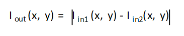
.. |image1| image:: ./images/btr1554997275001.png
   :class: image

.. |image6| image:: ./images/fre1554997017719.png
   :class: image

.. |image20| image:: ./images/dji1554997345308.png
   :class: image

.. |image45| image:: ./images/tye1558525119805.svg
   :class: image

.. |image51| image:: ./images/nnt1558524820358.svg
   :class: image

.. |image60| image:: ./images/qzf1554997363793.png
   :class: image

.. |image62| image:: ./images/rmc1554997017054.png
   :class: image

.. |image66| image:: ./images/rmc1554997017054.png
   :class: image

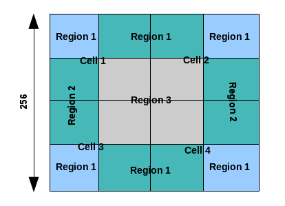

.. |image97| image:: ./images/cht1554996987363.png
   :class: image

.. |image104| image:: ./images/cht1554996987363.png
   :class: image

.. |image131| image:: ./images/gua1559108773758.svg
   :class: image

.. |image152| image:: ./images/cua1554997256117.png
   :class: image

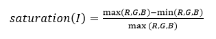
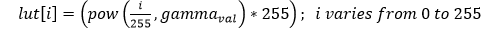
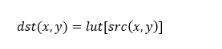
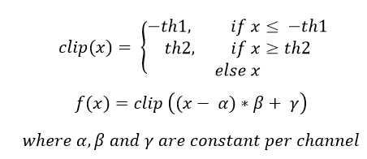
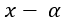
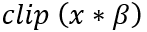
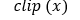
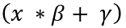
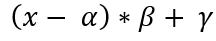
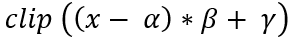
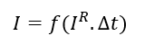
.. |HDRIMG2| image:: ./images/HDRIMG2.PNG
   :class: image
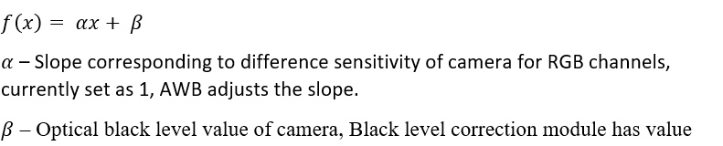
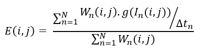
