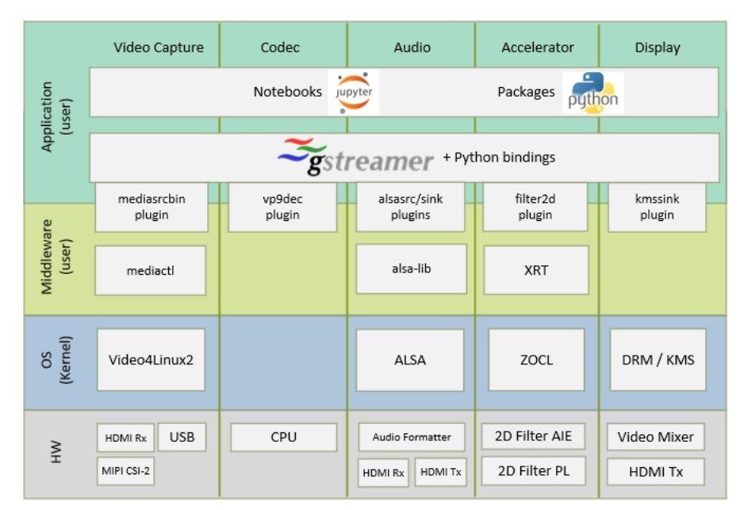

Introduction
============

The Versal Base TRD consists of a series of platforms, accelerators and Jupyter
notebooks to demonstrate various aspects of the design. A platform is a Vivado
design with a pre-instantiated set of I/O interfaces and a corresponding
PetaLinux BSP and image that includes the required kernel drivers and user-space
libraries to exercise those interfaces. Accelerators are mapped to FPGA logic
resources and/or AI Engine cores and stitched into the platform using the Vitis
toolchain. The reference design currently supports the VCK190 evaluation board.

Platforms
---------

The following is a list of supported platforms including key I/O interfaces:

* Platform 1:

  * Sources:

    * USB webcam capture pipeline

    * File source

    * MIPI CSI-2 image sensor capture pipeline via FMC daughter card

  * Processing:

    * VP9 decode and demux

    * 2D Filter (PL)

    * 2D Filter (AIE)

  * Sinks:

    * HDMI Tx + video mixer display pipeline

    * Application sink into jupyter notebook display

* Platform 2:

  Platform 2 is essentially an enhancement to platform 1 capture pipeline,
  while the rest of the hardware design and pre-instantiated set of I/O
  interfaces remain the same. The notable difference in the capture path is
  replacement of IMX274 image sensor with Avnet Multi-Camera image sensor.

* Platform 3:

  Platform 3 uses HDMI RX in the capture pipeline, while the rest of the hardware 
  design and pre-instantiated set of I/O interfaces remain the same. HDMI RX also
  supports capture of audio data.

  Audio replay can be done on all platforms. For Platform 1 and Plaform 2 the audio 
  source is a file. In case of Platform 3 the audio source can be a either a file or
  HDMI RX.

.. image:: images/system-bd.jpg
    :width: 1200px
    :alt: System Design Block Diagram

Software Stack
--------------

The main software frameworks used in this reference design are:

* Jupyter notebooks for top-level application control and visualization

* GStreamer multimedia framework and plugins for video pipeline creation

* V4L2 kernel subsystem and drivers for video capture devices

* Xilinx run-time (XRT) and Xilinx OpenCL for acceleration kernels

* DRM/KMS kernel subsystem and drivers for display devices

* ALSA kernel subsystem and drivers for audio devices

Design File Hierarchy
---------------------

The reference design zip files can be downloaded from the below locations. Note
there is a separate zip file per platform:

* Platforms supporting Pre-Production Silicon

  * Platform 1: https://www.xilinx.com/cgi-bin/docs/ctdoc?cid=bigfile;d=rdf0610-vck190_base_trd_platform1_2020.2_v0.5.zip

  * Platform 2: https://www.xilinx.com/cgi-bin/docs/ctdoc?cid=bigfile;d=rdf0611-vck190_base_trd_platform2_2020.2_v0.5.zip

  * Platform 3: https://www.xilinx.com/cgi-bin/docs/ctdoc?cid=bigfile;d=rdf0612-vck190_base_trd_platform3_2020.2_v0.5.zip

It has the following contents:

* Petalinux Board Support Package (BSP)

* Pre-built SD card image

* Vivado hardware design project

* Vitis platform

* Vitis accelerator projects

* README file

* Petalinux sources and licenses archive

The design file hierarchy is identical between the different platforms. For
example, the hierarchy of platform 1 is shown below:

.. code-block:: bash

   vck190_base_trd_platform1_2020.2_v0.5
   ├── accelerators
   │   ├── examples
   │   │   ├── filter2d_aie
   │   │   ├── filter2d_combined
   │   │   └── filter2d_pl
   │   ├── LICENSE
   │   └── vitis_libraries
   │       └── vision
   ├── archiver.tar.gz
   ├── petalinux
   │   └── xilinx-vck190-base-trd-platform1-2020.2.bsp
   ├── platform
   │   ├── pfm.tcl
   │   └── vck190_base_trd_platform1
   ├── README.txt
   ├── sdcard
   │   └── petalinux-sdimage.wic.gz
   └── vivado
       ├── scripts
       ├── source
       └── xdc

The User Guide for the reference design is available at 
https://www.xilinx.com/support/documentation/boards_and_kits/vck190/ug1442-vck190-trd.pdf

In the following tutorials, it is assumed that the design zip file is extracted
into a directory referred to as ``$working_dir``, e.g.

.. code-block:: bash

   export working_dir=/path/to/extracted/zip/vck190_base_trd_platform1_2020.2_v0.5

Licenses
--------

The design includes files licensed by Xilinx and third parties under the terms
of the GNU General Public License, GNU Lesser General Public License,
BSD License, MIT License, and other licenses. The design directory includes one
tar ball named ``archiver.tar.gz`` containing the complete set of design source
files and licenses extracted from the design source files. You are solely
responsible for checking any files you use for notices and licenses and for
complying with any terms applicable to your use of the design and any third
party files supplied with the design.

