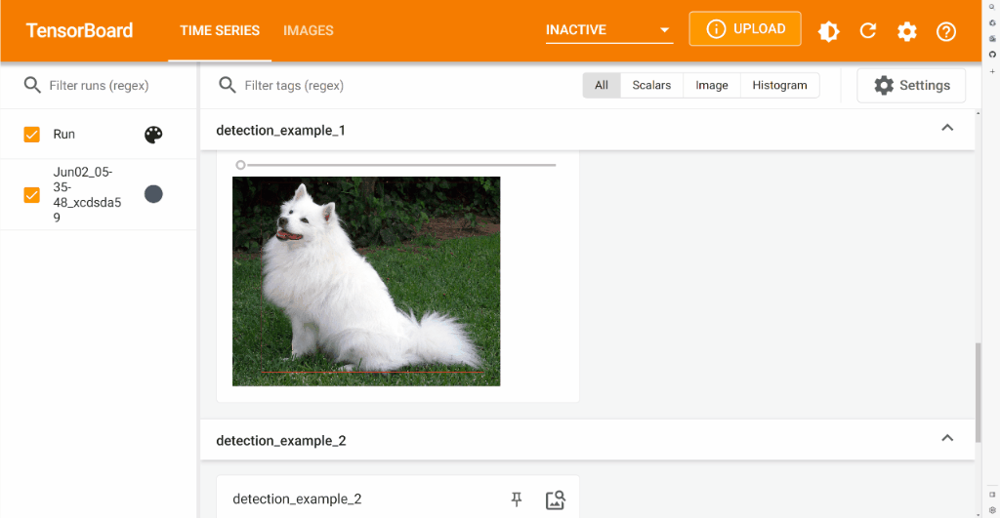

<table class="sphinxhide">
 <tr>
   <td align="center"><h1>Vitis AI</h1><h0>Adaptable & Real-Time AI Inference Acceleration</h0>
   </td>
 </tr>
</table>

# OnBoard

## Overview

OnBoard is a new experimental tool introduced in the Vitis™ AI 3.5.0 release. The intent is to enable analysis and debugging for WeGO users, providing visualization of the inference flow for a model. OnBoard is extended from **TensorBoard web** server and writes events with simple function calls. It can visualize the images of inference resuls, the graph structure of the model before and after WeGO transformation, and DPU platform related information. In the Vitis AI 3.5 release, OnBoard is available for both PyTorch and TensorFlow 2.

## Key Features And Enhancements in VAI3.5 Release

- Displaying image data
- Examining the Pytorch/TensorFlow Graph
- Displaying platform info

## Preparation

### Setup Host Environment For V70

Before running the examples, please follow [setup for V70](https://xilinx.github.io/Vitis-AI/3.5/html/docs/quickstart/v70.html#alveo-v70-setup) to set up the host env for V70 and make sure you have entered the Vitis AI CPU docker container successfully and the DPU IP has been selected properly.

> Note: Currently the OnBoard tool only support PyTorch and TensorFlow 2 frameworks, make sure the right docker image is used for the corresponding examples running purpose(i.e. PyTorch docker for PyTorch examples, TensorFlow 2.x docker for TensorFlow 2.x examples). 

### Prepare OnBoard Example Recipes

Download and prepare the OnBoard examples recipes(ie. models and images) by executing:
```
wget http://www.xilinx.com/bin/public/openDownload?filename=onboard_example_recipes.tar.gz -O onboard_example_recipes.tar.gz
tar -xvf onboard_example_recipes.tar.gz ./
```

## Run OnBoard Examples

### Run the Examples Script

We provide two sets of examples. Please refer to the *Basic Usage Examples Script* to run the basic OnBoard API usage. The *WeGO OnBoard Example* demonstrate the OnBoard API usage with WeGO inference processing.

#### Basic Usage Examples Script

In these examples, you can see how to use OnBoard with either framework.  Select the example corresponding to your desired framework.

- [pytorch](./demo_pytorch.py)
```
conda activate vitis-ai-wego-torch
python demo_pytorch.py
```
- [TensorFlow](./demo_tensorflow2.py)
```
conda activate vitis-ai-tensorflow2
python demo_tensorflow2.py
```

### WeGO OnBoard Example

From inside the PyTorch docker container, you can run the following WeGO PyTorch classfication sample:
 
[WeGO PyTorch inference samples](../wego/pytorch/01_compiling_offline_quantized_models/classification/)

###  Start TensorBoard To Visualize

Enter the following command to start the TensorBoard server, where `your_log_dir` is the parameter of the object constructor:
```
tensorboard --logdir=<your_log_dir> --bind_all
```

Finally, use your favorite browser to load the tensorboard page.  The IP address will be shown in the terminal after starting the server.

### Visualization Results
<p align="center"></p>

