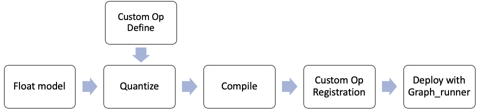

<table class="sphinxhide">
 <tr>
   <td align="center"><h1>Vitis AI</h1><h0>Adaptable & Real-Time AI Inference Acceleration</h0>
   </td>
 </tr>
</table>

# Introduction
In VAI3.0 release, Pytorch model and Tensorflow2 model with custom op are supported. The basic workflow for custom op is shown below.

<p align="center">
  
</p>

We will give examples for the following two models respectively.
* MNIST model based on Tensorflow2
* Pointpillars model based on Pytorch

## Directory Structure Introduction

```
custom_operator
├── custom_op_workflow.png
├── graph_runner_block_flow.png
├── op_add
│   ├── Makefile
│   ├── my_add_op.cpp
│   └── README.md
├── pytorch_example
│   ├── deployment
│   │   ├── cpp
│   │   └── python
│   ├── model
│   │   ├── compiled
│   │   └── quantized
│   └── op_registration
│       ├── cpp
│       └── python
├── README.md
└── tensorflow2_example
    ├── deployment
    │   ├── cpp
    │   └── python
    ├── model
    │   ├── compiled
    │   └── quantized
    └── op_registration
        ├── cpp
        └── python

```

## Step 1 : Quantize

For the Tensorflow2 model, refer to Tensorflow2 model quantize in Custom OP Workflow section of UG1414 and download the source code package [tf2_custom_op_demo.tar.gz](https://www.xilinx.com/bin/public/openDownload?filename=tf2_custom_op_demo.tar.gz) to do the quantization.

For the Pytorch model, refer to Pytorch model quantize in Custom OP Workflow section of UG1414 and download the float model and source code package [pointpillars-custom_op-vai2.5.tgz](https://www.xilinx.com/bin/public/openDownload?filename=pointpillars-custom_op-vai2.5.tgz) to do the quantization.

## Step 2 : Compile
Use the latest 3.0 docker to compile the model.  
For tensorflow2, the compiling commands are shown below.
Compile for edge DPU as an example:
```
conda activate vitis-ai-tensorflow2
cd <path of Vitis-AI>/examples/custom_operator/tensorflow2_example/model/quantized
vai_c_tensorflow2 -m ./quantized.h5 -a /opt/vitis_ai/compiler/arch/DPUCZDX8G/ZCU102/arch.json -o ./ -n tf2_custom_op
```
For pytorch model, the compiling commands are shown below.
Compile for edge DPU as an example:
```
conda activate vitis-ai-pytorch
cd <path of Vitis-AI>/examples/custom_operator/pytorch_example/model/quantized
vai_c_xir -x VoxelNet_int.xmodel -a /opt/vitis_ai/compiler/arch/DPUCZDX8G/ZCU102/arch.json -o ./ -n pointpillars_custom_op
```

## Step 3 : Custom OP Registration
Vitis AI supports both C++ and Python to implement and register the custom OP.

### tensorflow2 example
Run the following commands to register the custom OP.

For edge DPU, copy `Vitis-AI/examples/custom_operator/tensorflow2_example/op_registration` folder to the board, then run the following commands on the board.

For cloud DPU, you need run `conda deactivate` to exit conda vitis-ai-tensorflow2 or conda base environment, and return to the system environment of the docker container to continue execution the following commands.

#### Register custom OP in C++
```
cd <path of Vitis-AI>/examples/custom_operator/tensorflow2_example/op_registration/cpp/
bash op_registration.sh        # For edge DPU
bash op_registration_cloud.sh  # For cloud DPU
```
#### Register custom OP in Python

```
cd <path of Vitis-AI>/examples/custom_operator/tensorflow2_example/op_registration/python/
bash op_registration.sh        # For edge DPU
bash op_registration_cloud.sh  # For cloud DPU
```

### pytorch example
Run the following commands to register the custom OP.

For edge DPU, copy `Vitis-AI/examples/custom_operator/pytorch_example/op_registration` folder to the board, then run the following commands on the board.

For cloud DPU, you need run `conda deactivate` to exit conda vitis-ai-tensorflow2 or conda base environment, and return to the system environment of the docker container to continue execution the following commands.

#### Register custom OP in C++
```
cd <path of Vitis-AI>/examples/custom_operator/pytorch_example/op_registration/cpp/
bash op_registration.sh          # For edge DPU
bash op_registration_cloud.sh    # For cloud DPU
```
#### Register custom OP in Python
```
cd <path of Vitis-AI>/examples/custom_operator/pytorch_example/op_registration/python/
bash op_registration.sh          # For edge DPU
bash op_registration_cloud.sh    # For cloud DPU
```

## Step 4 : Deployment
For the models with custom op, `graph_runner` APIs are recommended.
The following figure is the block flow of programming in `graph_runner`

<p align="center">
  
</p>

After you finished coding, you need to compile/cross-compile the source code to generate the executable program.

## Step 5 : Run the demo 
Before you run the demo, make sure the environment of the board has been set up correctly. If not, refer to [board setup](../../board_setup/mpsoc/board_setup_mpsoc.rst#step-2-setup-the-target)   

Also, make sure the following files are generated or ready.

* compiled model, which is generated in step 2
* custom op library, which is generated in step 3
* test images
* executable program, which is generated in step 4


### tensorflow2_example
#### Running on edge DPU
Download the test image from [here](https://www.xilinx.com/bin/public/openDownload?filename=sample.jpg) and copy it to the board.
Then copy `Vitis-AI/examples/custom_operator/tensorflow2_example/deployment` folder to the board
```
cd deployment/cpp
bash build.sh
./tf2_custom_op_graph_runner tf2_custom_op.xmodel sample.jpg
```
#### Running on cloud DPU
Download the test image from [here](https://www.xilinx.com/bin/public/openDownload?filename=sample.jpg) and copy it to the sample folder.

For C++ sample:
```
cd <path of Vitis-AI>/examples/custom_operator/tensorflow2_example/deployment/cpp/
bash build.sh
./tf2_custom_op_graph_runner tf2_custom_op.xmodel sample.jpg
```
For python sample:
```
cd <path of Vitis-AI>/examples/custom_operator/tensorflow2_example/deployment/cpp/
/usr/bin/python3 tf2_custom_op_graph_runner.py tf2_custom_op.xmodel ./
```

### pytorch_example
#### Running on edge DPU
Copy `Vitis-AI/examples/custom_operator/pytorch_example/deployment` folder to the board
```
cd deployment/cpp/pointpillars_graph_runner
bash build.sh
./build/sample_pointpillars_graph_runner pointpillars_custom_op.xmodel data/sample_pointpillars.bin
```
#### Running on cloud DPU

For c++ sample:
```
cd <path of Vitis-AI>/examples/custom_operator/pytorch_example/deployment/cpp/pointpillars_graph_runner
bash build_cloud.sh
./sample_pointpillars_graph_runner pointpillars_custom_op.xmodel data/sample_pointpillars.bin
```

For python sample:
```
cd <path of Vitis-AI>/examples/custom_operator/pytorch_example/deployment/python
/usr/bin/python3 pointpillars_main.py pointpillars_customer_op.xmodel ../cpp/pointpillars_graph_runner/data/sample_pointpillars.bin
```

## Reference
For more information, please refer to [Vitis AI User Guide](https://www.xilinx.com/html_docs/vitis_ai/2_5/index.html).
