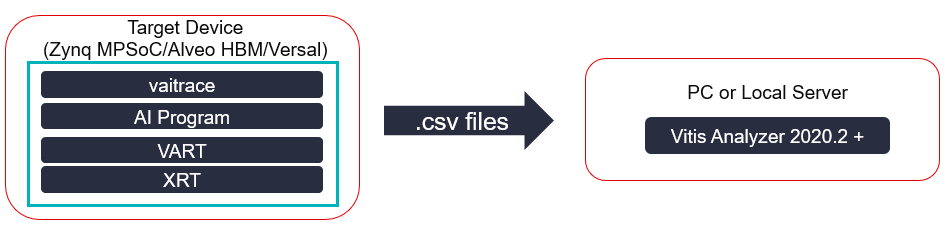
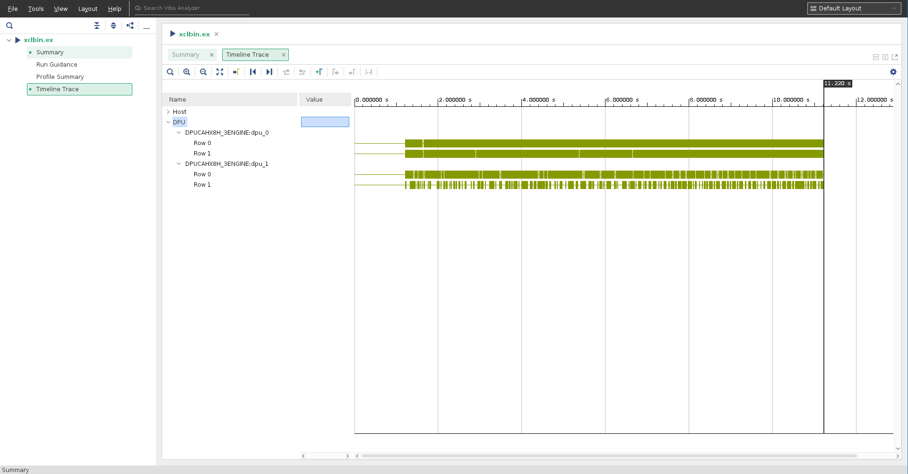
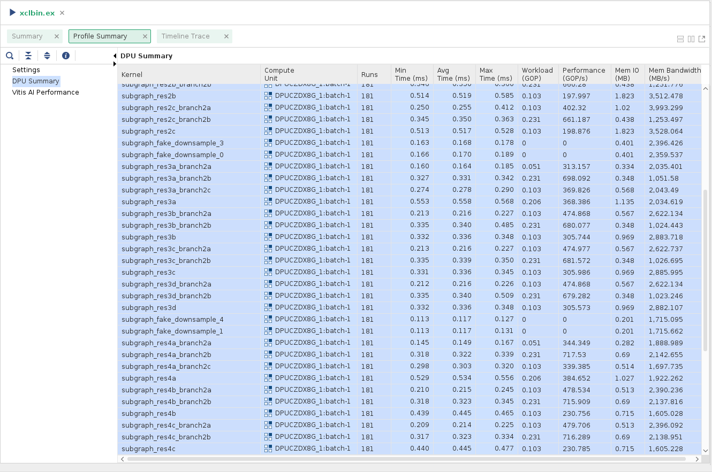
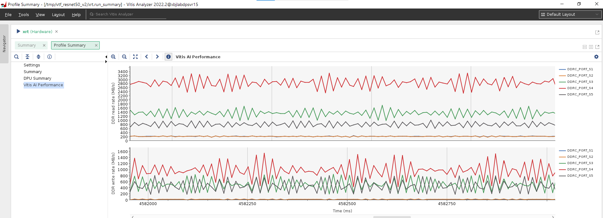
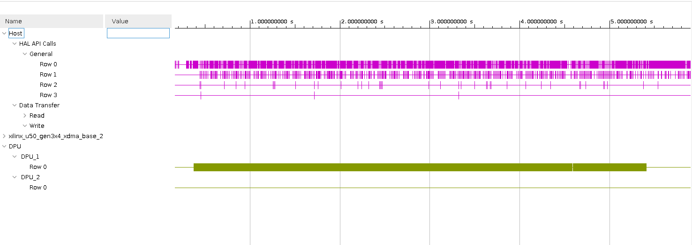
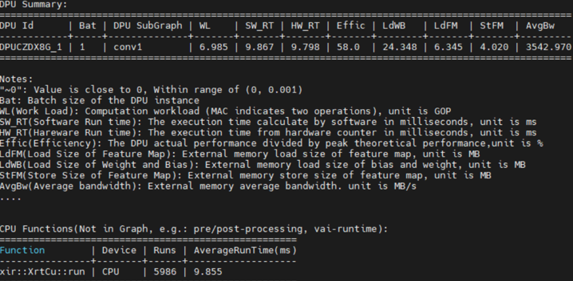

<table class="sphinxhide">
 <tr>
   <td align="center"><h1>Vitis AI</h1><h0>Adaptable & Real-Time AI Inference Acceleration</h0>
   </td>
 </tr>
</table>


# Xilinx Vitis AI Profiler

## Overview

Vitis-AI Profiler is an application level tool that could help to optimize the whole AI application. The main purpose of Vitis-AI profiler is to help detect bottleneck of the whole AI application.With Vitis-AI Profiler, you can profile the pre-processing functions and the post-processing functions together with DPU kernels' running status. If the profiling result shows that one pre-processing function takes very long time, it leads to a high CPU utilization and DPU cores wait a long time for CPUs to finish processing. In this situation, we find that the pre-processing and CPU is the bottleneck. if user want to improve performance, try to rewrite this pre-processing function with HLS or OpenCL to reduce CPU's workload.
- Easy to use, this tool requires neither any change in user’s code nor re-compilation of the program
- Figuring out hot spots or bottlenecks of preference quickly
- vaitrace: running on devices, take the responsibility for data collection

## What's New
### v3.0
- Support DPUCV2DX8G(edge)

### v2.5
- Fully support CustomOP and GraphRunner
- Stability optimization

### v2.0
- More detailed DPU memory IO statistics in text summary
- Support trace cpu tasks inside GraphRunner
- Optimized trace data analysis speed for edge devices

### v1.4
- Support new DPU IPs: DPUCVDX8G(edge), DPUCAHX8L(cloud), DPUCVDX8H(cloud)
-	Support DPU IP generated by VIVADO flow 
- Memory IO statistics 
- Text summary（vaitrace --txt）
-	Configuration file not needed for fine grained profiling (vaitrace --fine_grained) 

### v1.3 
- Use Vitis Analyzer 2020.2 as default GUI
- Support profiling for Vitis-AI python applications
- Fix various vaitrace bugs

## Vitis AI Profiler Architecture
<div align="center">

</div>  

## Why Vitis AI Profiler
### What's the benefit of this tool
- An all-in-one profiling soution for Vitis-AI
- Vitis-AI is a heterogeneous system, it's complicated, so that we need a more powerful and customized tool for profiling. The Vitis AI Profiler could be used for a application level profiling. For an AI application, there will be some parts running on hardware, for example, neural network computation usually runs on DPU, and also, also some parts of the AI application running on CPU as a function that was implemented by c/c++ code like image pre-processing. This tool could help put the running status of all parts together. So that, we get an all-in-one profiling tool for Vitis-AI applications. 

### What Information Can Be Obtained from This Tool

<p align="center"> Vitis AI Profiler GUI Overview</p>

From Vitis-AI v1.3, [Vitis Analyzer](https://www.xilinx.com/html_docs/xilinx2020_2/vitis_doc/jfn1567005096685.html) is the default GUI for vaitrace

- DPU Summary  
  A table of the number of runs and min/avg/max times for each kernel 
  <p align="center"></p>

- DDR Transfer Rates  
  Line graphs of achieved FPS and read/write transfer rates (in MB/s) as sampled during the application, Only available for edge platforms
  - For Zynq MPSoC devices, DDRC_PORT_S[n] in the report represent the traffic pass throught S[n] port of DDR Memory Controller. [ref.](https://docs.xilinx.com/r/en-US/ug1085-zynq-ultrascale-trm/Block-Diagram?tocId=ycliZesl_R3fScaJ2DWc3w)
  - For Versal devices, DDRC_PORT_S[n] in the report represent the traffic pass throught Versal DDRMC[n]. [ref.1](https://docs.xilinx.com/r/en-US/am011-versal-acap-trm/DDR4-Memory-Controller), [ref.2](https://docs.xilinx.com/r/en-US/pg313-network-on-chip/NoC-Architecture)
  <p align="center"></p>
- Timeline Trace   
  This will include timed events from VART, HAL APIs, and the DPUs
      <p align="center"></p>

- Notes  
  - From Vitis-AI v1.3, Vitis Analyzer is the default GUI for vaitrace

## Get Started with Vitis AI Profiler
-	System Requirements  
    - Hardware  
        - Support Zynq MPSoC (DPUCZD series)
        - Support Alveo (DPUCAH series)
        - Support Versal (DPUCVDX8G/DPUCVDX8H)
    - Software  
        - Support VART v1.2+
        - Support Vitis AI Library v1.2+

- Installing  
    - Preparing debug environment for vaitrace in MPSoC platform   
      These steps are __not__ required for Vitis AI prebuilt images for ZCU102 & ZCU104 https://github.com/Xilinx/Vitis-AI/tree/master/setup/mpsoc/VART       
        1. Configure and Build Petalinux  
        Run _petalinux-config -c kernel_ and Enable these for Linux kernel  
        ```
        General architecture-dependent options ---> [*] Kprobes
        Kernel hacking  ---> [*] Tracers
        Kernel hacking  ---> [*] Tracers  --->
        			[*]   Kernel Function Tracer
        			[*]   Enable kprobes-based dynamic events
        			[*]   Enable uprobes-based dynamic events
        ```    
        2. Run _petelinux-config -c rootfs_ and enable this for root-fs  
        ```
        Petalinux package Groups  --->
			packaggroup-petalinux-self-hosted --->
				[*] packagegroup-petalinux-self-hosted
        ```
        3. Run _petalinux-build_ and update kernel and rootfs

    - Preparing debug environment for docker
      If you are using Vitis AI with docker, please add this patch to docker_run.sh to get root permission for vaitrace  
      ```diff
      @@ -89,6 +71,7 @@ docker_run_params=$(cat <<-END
           -e USER=$user -e UID=$uid -e GID=$gid \
           -e VERSION=$VERSION \
           -v $DOCKER_RUN_DIR:/vitis_ai_home \
      +    -v /sys/kernel/debug:/sys/kernel/debug  --privileged=true \
           -v $HERE:/workspace \
           -w /workspace \
           --rm \

      ```
      - This step is only required for Versal devices working in docker environment   
        - For Zynq MPSoC devices, vaitrace does not interact with docker, therefore modification for the docker_run.sh is __not required__    
        - For Versal devices running in docker environment, there are some limitations for an in-depth profiling. Because some tools require superuser permission that cannot work well with docker in default setting. So we need this modification to get more permissions

      - Due to an issue of overlay-fs, to support all the features of Vitis-AI Profiler in docker environment, it's recommended to use Linux kernel 4.8 or above on your host machine, see [here](https://lore.kernel.org/patchwork/patch/890633/)


### Starting A Simple Trace with vaitrace  
We use vai_runtime resnet50 sample  
  - Download and setup Vitis AI
  - Start testing and tracing
    - vaitrace requires root permission
    ```bash
      # sudo bash
    ```
    - For C++ programs, add vaitrace in front of the test command, the test command is:
    ```bash
      # cd ~/Vitis_AI/examples/vai_runtime/resnet50
      # vaitrace ./resnet50 /usr/share/vitis_ai_library/models/resnet50/resnet50.xmodel
    ```
    - For Python programs, add -m vaitrace_py to the python interpreter command
    ``` bash
      # cd ~/Vitis_AI/examples/vai_runtime/resnet50_mt_py
      # python3 -m vaitrace_py ./resnet50.py 2 /usr/share/vitis_ai_library/models/resnet50/resnet50.xmodel
    ```
  -	vaitrace and XRT generates some files in the working directory  
Copy all .csv files and xrt.run_summary to you PC, the xrt.run_summary can be opened by vitis_analyzer 2020.2 and above
    -	Command Line:
    ```bash
      # vitis_analyzer xrt.run_summary
    ```
    -	GUI:  
    File->Open Summary… : select the xrt.run_summary
  - About Vitis Analyzer, please see [Using the Vitis Analyzer](https://docs.xilinx.com/r/en-US/ug1393-vitis-application-acceleration/Using-the-Vitis-Analyzer)


## Vaitrace Usage
### Command Line Usage
```bash
# vaitrace --help
usage: Xilinx Vitis AI Trace [-h] [-c [CONFIG]] [-d] [-o [TRACESAVETO]] [-t [TIMEOUT]] [-v]

  cmd   Command to be traced
  -b    Bypass mode, just run command and by pass vaitrace, for debug use
  -c [CONFIG]       Specify the configuration file
  -o [TRACESAVETO]  Save trace file to
  -t [TIMEOUT]      Tracing time limitation, default value is 30(s)
  --txt_summary
  --txt             Display txt summary
  --fine_grained    Fine grained mode

```
### Important and frequently used arguments
- cmd: cmd is your executable program of Vitis AI that to be traced, including program name and arguments  

-	-t  control the tracing time(in seconds) starting from the [cmd] being launched, default value is 30
  
-	-o  where to save report, only available for text summary mode, by default, the test summary will be output to STDOUT.

-	-c  users can start a trace with more custom options by writing these a json  format configuration file and specify the configuration by -c, details of configuration file will be explained in the next section

- --txt  Output text summary, vaitrace will not generate report for Vitis Analyzer in this mode

- --fine_grained  Start trace with fine grained mode, this mode will generate a mass of trace data, the trace time is limited to 10 (seconds)

### Configuration
Another way to launch a trace is to save all necessary information for vaitrace into a configuration file then use __vaitrace -c [config_name.json]__

- Configuration priority: Configuration File > Command Line > Default

- Here is an example of vaitrace configuration file
    ```json
    {
      "trace": {
        "enable_trace_list": ["vitis-ai-library", "opencv", "vart", "custom"]
      },
      "trace_custom": []
    }
    ```

    |  Key | Sub-level Key | Type | Description |
    |  :-  | :- | :-: | :- |
    | trace  |  | object | |
    |  | enable_tracelist | list_of_string |enable_trace_list	list	Built-in trace function list to be enabled, available value **"vitis-ai-library", "vart", “opencv”, "custom"**, custom for function in trace_custom list|
    |  trace_custom | | list_of_string | trace_custom	list	The list of functions to be traced that are implemented by user. For the name of function, naming space are supported. You can see an example of using custom trace function later in this document|
		

### Text Summary
When the --txt_summary or --txt option is used, vaitrace prints an ASCII table as shown in the following figure

<div align="center">

</div>  
The fields are defined in the following list:  

- DPU Id: Name of the DPU instance  
- Bat: Batch size of the DPU instance  
- SubGraph: Name of subgraph in the xmodel  
- WL(Work Load): Computation workload (MAC indicates two operations), unit is GOP  
- SW_RT(Software Run time) : The execution time in milliseconds, unit is ms.
- HW_RT(Hardware Run time) : The execution time from DPU hardware counter in milliseconds, unit is ms, not affected by linux system scheduling.
- Effic: The DPU performance efficiency as a percentage.
- LdFM (Load Size of Feature Map): External memory load size of feature map, unit is MB.
- LdWB (Load Size of Weight and Bias): External memory load size of bias and weight, unit is MB.
- StFM (Store Size of Feature Map): External memory store size of feature map, unit is MB.
- AvgBw(Average bandwidth): Average DDR memory access bandwidth.  
AvgBw = (total load size of the subgraph (including feature map and weight/bias, from
DDR/HBM to DPU bank mem) + total store size of the subgraph (from DPU bank mem to
DDR/HBM)) / subgraph runtime

### Vitis-AI Profiler DPU Profiling Examples  
[Examples](./examples.md)
