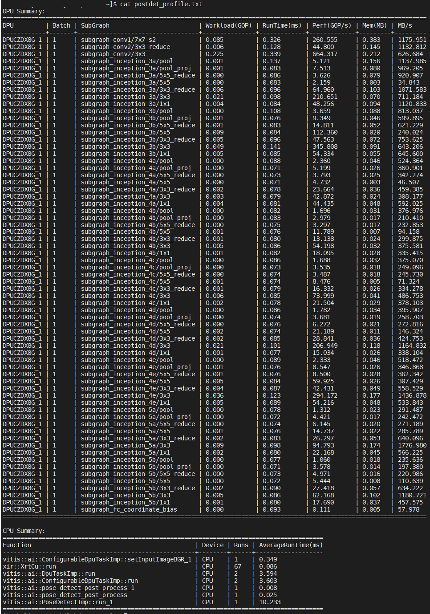
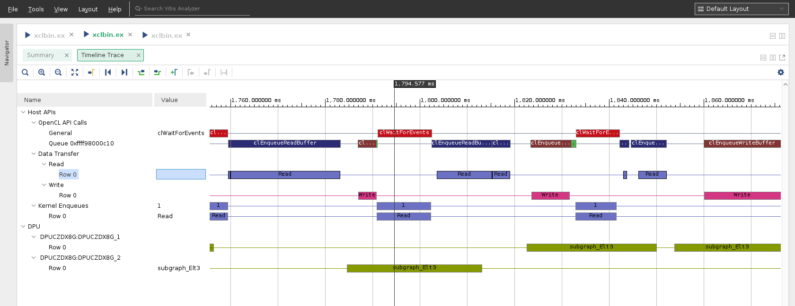

<table class="sphinxhide">
 <tr>
   <td align="center"><h1>Vitis AI</h1><h0>Adaptable & Real-Time AI Inference Acceleration</h0>
   </td>
 </tr>
</table>

# Xilinx Vitis AI Profiler

## DPU Profiling Examples
### VART C++ Program Profiling Using Configuration File
- Device  
  Edge: ZCU104
- Preparing 
  ```bash
  # cd path-to-vart-resnet50-samples
  ```
  - Remove cv::imshow and cv::waitKey from main.cc so that this program could run continuously
  - Build the sample

  From the source code, we found that **TopK** and **softmax** task will be done by CPU, and we want to check the performance of these two functions, so write the name of these two functions to trace_custom list, and save this file as trace_resnet50_vart.json.  
  For edge devices: 
  ```json
  {
      "trace": {
          "enable_trace_list": ["vart", "opencv", "custom"]
      },
      "trace_custom": ["TopK", "CPUCalcSoftmax"]
  }

  ```

- Starting Trace:
  ```bash
  # vaitrace -c trace_resnet50_vart.json
  ```
  note: vaitrace requires root permission

- Result
Upload all csv files and xrt.run_summary and open the xclbin.ex.run_summary in Vitis Analyzer 2020.2

### VART Python Program Profiling
- Device  
  Edge: ZCU104
- Preparing 
  ```bash
  # cd path-to-vart-resnet50_mt_py sample
  ```
  - Modifing code: we are about to profile Vitis-AI and some code of resnet50.py need to be changed
    1. Improt vai_tracepoint from vaitrace_py
    2. Add __@vai_tracepoint__ as decorator to functions that we want to trace
    3. Uncomment CPUCalcSoftmax and TopK
     ```diff
     --- a/demo/VART/samples/resnet50_mt_py/resnet50.py
     +++ b/demo/VART/samples/resnet50_mt_py/resnet50.py
     @@ -25,6 +25,7 @@ import math
      import threading
      import time
      import sys
     +from vaitrace_py import vai_tracepoint

      """
      Calculate softmax
     @@ -33,7 +34,7 @@ size: data size
      return: softamx result
      """

     +@vai_tracepoint
      def CPUCalcSoftmax(data, size):
          sum = 0.0
          result = [0 for i in range(size)]
     @@ -56,7 +57,7 @@ datain: data result of softmax
      filePath: filePath in witch that records the infotmation of kinds
      """

     +@vai_tracepoint
      def TopK(datain, size, filePath):

          cnt = [i for i in range(size)]
     @@ -136,9 +137,9 @@ def runResnet50(runner: "Runner", img, cnt):
              """softmax&TopK calculate with batch """
              """Benchmark DPU FPS performance over Vitis AI APIs execute_async() and wait() """
              """Uncomment the following code snippet to include softmax calculation for models end-to-end FPS evaluation """
     -        #for j in range(runSize):
     -        #    softmax = CPUCalcSoftmax(outputData[0][j], pre_output_size)
     -        #    TopK(softmax, pre_output_size, "./words.txt")
     +        for j in range(runSize):
     +            softmax = CPUCalcSoftmax(outputData[0][j], pre_output_size)
     +            TopK(softmax, pre_output_size, "./words.txt")

              count = count + runSize
      """
      ```
- Starting Trace
  - Use __python3 -m vaitrace_py__ to start the trace
   ```bash
   # python3 -m vaitrace_py ./resnet50.py 2 resnet50.xmodel
   ```
- Result  
  Upload all csv files and xrt.run_summary and open the xclbin.ex.run_summary in Vitis Analyzer 2020.2

### Text summary and fine grained mode
- Device  
  Edge: ZCU102
- Configuration  
  Demo: posedetect  
  Demo path: ~/Vitis-AI/demo/Vitis-AI-Library/samples/posedetect  
  Test command:  
  ```
  # cd ~/Vitis-AI/demo/Vitis-AI-Library/samples/posedetect
  # vaitrace --txt -o ./postdet_profile.txt --fine_grained ./test_jpeg_posedetect sp_net sample_posedetect.jpg
  ```
- Result  
  ```
  # cat postdet_profile.txt
  ```
    <p align="center"></p>

### Profiling DPU together with HLS/OpenCL Kernels
- Configuration  
  In the XRT 2020.2 and Vitis-AI 1.3 release, there are two distinct profiling paths in XRT. One is OpenCL profiling, enabled by "profile=true" and "timeline_trace=true",The second profiling path is enabled by "xrt_profile=true" option and the vaitrace is compatible with the second path only, and __"vitis_ai_profile=true" will be enabled by vaitrace automatically__. So, for 2020.2, it would recommend the following structure in xrt.ini file to profiling DPU and HLS/OpenCL kernels together:
  ```
  [Debug]
  xrt_profile=true
  lop_trace=true
  ```
- Result  
  - Collect all csv files and xrt.run_summary
  - Open the run summary by Vitis Analyzer, it show OpenCL API calls and DPU events on the same timeline
    <p align="center"></p>
