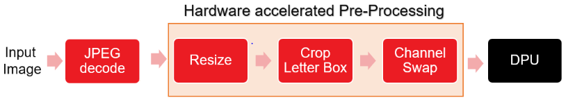

# ADAS Detection
ADAS detection application is supported on the following devices.
- ZCU102
- ZCU104
- ALVEO-U50
- ALVEO-U280
- ALVEO-U200
- VCK190 production

VCK190 ES1 is supported with the [Known Issue](#Known-Issue).

:pushpin: **Note:** Use VAI2.5 setup to run this applicaion


# Table of Contents
- [Introduction](#introduction)
- [Run ADAS detection example](#run-adas-detection-example)
  - [Setting up the system and running ADAS detection example on ZCU102/ZCU104/VCK190](#setting-up-the-system-and-running-adas-detection-example-on-zcu102zcu104vck190)
    - [Setting SD card](#1-setting-sd-card)
    - [Cross-compile ADAS detection example](#2-cross-compile-adas-detection-example)
    - [Download setup files](#3-download-setup-files)
    - [Copying ADAS detection app and setup files](#4-copying-adas-detection-app-and-setup-files)
    - [Run ADAS detection example on ZCU102/ZCU104/VCK190](#5-run-adas-detection-example-on-zcu102zcu104vck190)
  - [Setting up the system and running ADAS detection example on U50/U280/U200](#setting-up-the-system-and-running-adas-detection-example-on-u50u280u200)
    - [Install xclbin](#1-install-xclbin)
    - [Download setup files](#2-download-setup-files)
    - [Build ADAS detection application](#3-build-adas-detection-application)
    - [Run ADAS detection example on U50/U280/U200](#4-run-adas-detection-example-on-u50u280u200)
- [Performance](#performance)    

# Introduction
Currently, applications accelerating pre-processing for detection networks (YOLO-v3) is provided and can only run on ZCU102/ZCU104 and VCK190 edge platforms , and U50/U280/U200 Alveo platforms. In this application, software JPEG decoder is used for loading input image. JPEG decoder transfer input image data to pre-processing kernel and the pre-processed data is directly stored at the ML accelerator input physical address. Below image shows the inference pipeline.

<div align="center">
  
</div>

:pushpin: **Note:** In this application pre-processed data is directly stored at ML accelerator physical address. Hence, avoiding device to host data transfers.

# Run ADAS detection example
ADAS detection example can be run on different platforms like ZCU102/ZCU104 and VCK190 edge platforms or U50/U200/U280 data center platforms. Each platform has pre-built xclbin which can be used to set the system and run the application out of the box. And depending on the platform there are two more approaches, pre-built flow and build flow. Currently, only ZCU102 supports pre-built flow. In the subsequent sections, we give details for setting the system on a given platform and running ADAS detection example.
1. [Setting up the system and running ADAS detection example on ZCU102/ZCU104/VCK190](#setting-up-the-system-and-running-adas-detection-example-on-zcu102zcu104vck190)
1. [Setting up the system and running ADAS detection example on U50/U280/U200](#setting-up-the-system-and-running-adas-detection-example-on-u50u280u200)

## Setting up the system and running ADAS detection example on **ZCU102/ZCU104/VCK190**
The system to run ADAS detection example on ZCU102/ZCU104/VCK190 can be set using pre-built xclbin and build flow approaches. In addition, ZCU102 also supports pre-built flow approach. Setting up the system and running ADAS detection example include the following steps.

Initially, the the sd card is set following any one of the above approaches. Then, cross-compilation environment is installed on the host system followed by cross-compiling the ADAS detection application. Later, Vitis AI runtime libraries, model files and image databse are downloaded. Finally, ADAS detection example is run on the platform. 

These steps are summarizied as follows:
1. [Setting SD card](#1-setting-sd-card)
1. [Cross-compile ADAS detection example](#2-cross-compile-adas-detection-example)
1. [Download setup files](#3-download-setup-files)
1. [Copying ADAS detection app and setup files](#4-copying-adas-detection-app-and-setup-files)
1. [Run ADAS detection example on ZCU102/ZCU104/VCK190](#5-run-adas-detection-example-on-zcu102zcu104vck190)

### **1. Setting SD card**
The SD card is set/flashed with `sd_card.img` file using Etcher like tools. Following approaches are used to create the image file.

#### **1. Using pre-built xclbin**
In this approach, the xclbin including pre-processing accelerator and DPU is already built and packaged to create a sd_card.img file.

* Download the SD card system image files from the following links:

  | No. | DPU                     | Device          | Download Link                                                                          |
  |-----|-------------------------------|-----------------|----------------------------------------------------------------------------------------|
  | 1   | DPUCZDX8G  | ZCU102          | [waa_zcu102_adasdetection_v2_5_0.img.gz](https://www.xilinx.com/bin/public/openDownload?filename=waa_zcu102_adasdetection_v2_5_0.img.gz)        |
  | 2   | DPUCZDX8G  | ZCU104          | [waa_zcu104_adasdetection_v2_5_0.img.gz](https://www.xilinx.com/bin/public/openDownload?filename=waa_zcu104_adasdetection_v2_5_0.img.gz)        |
  | 3   | DPUCVDX8G  | VCK190          | [waa_vck190_adasdetection_v2_5_0.img.gz](https://www.xilinx.com/bin/public/openDownload?filename=waa_vck190_adasdetection_v2_5_0.img.gz)        |
     
* Unzip the file and flash the `sd_card.img` file on the SD card using tools like Etcher.

#### **2. Using build flow**  
In this approach, the pre-processing accelerator and DPU are built from sources following the build flow.

| No. | Build flow                    | Device          | Documentation                                                                          |
|-----|-------------------------------|-----------------|----------------------------------------------------------------------------------------|
| 1   | DPUCZDX8G  | ZCU102          | [DPUCZDX8G_zcu102](./build_flow/DPUCZDX8G_zcu102/README.md)        |
| 2   | DPUCZDX8G  | ZCU104          | [DPUCZDX8G_zcu104](./build_flow/DPUCZDX8G_zcu104/README.md)        |
| 3   | DPUCVDX8G  | VCK190          | [DPUCVDX8G_vck190](./build_flow/DPUCVDX8G_vck190/README.md)        |

#### **3. Using pre-built flow** 
The DPU is pre-built and its partial bitfiles are pre-created (using DFx flow). Only the pre-processing accelerator is built from sources. This flow gives 10x saving in build time for embedded platform like ZCU102.

| No. | Pre-built flow                    | Device          | Documentation                                                                          |
|-----|-------------------------------|-----------------|----------------------------------------------------------------------------------------|
| 1   | DPUCZDX8G  | ZCU102          | [DPUCZDX8G_zcu102](./pre_built_flow/DPUCZDX8G_zcu102/README.md)        |

:pushpin: **Note:** Pre-built flow is supported only on ZCU102.

### **2. Cross-compile ADAS detection example** 
Once the SD card is set with sd_card.img system, cross-compilation environment is installed on the host system and the ADAS detection application is cross-compiled.

  * Download the [sdk-2022.1.0.0.sh](https://www.xilinx.com/bin/public/openDownload?filename=sdk-2022.1.0.0.sh).

  * Install the cross-compilation system environment, follow the prompts to install. 

    **Please install it on your local host linux system, not in the docker system.**
    ```sh
    ./sdk-2022.1.0.0.sh
    ```
    Note that the `~/petalinux_sdk` path is recommended for the installation. Regardless of the path you choose for the installation, make sure the path has read-write permissions. 
    Here we install it under `~/petalinux_sdk`.

  * When the installation is complete, follow the prompts and execute the following command.
    ```sh
    source ~/petalinux_sdk/environment-setup-cortexa72-cortexa53-xilinx-linux
    ```
    Note that if you close the current terminal, you need to re-execute the above instructions in the new terminal interface.

  * Download the [vitis_ai_2022.1-r2.5.0.tar.gz](https://www.xilinx.com/bin/public/openDownload?filename=vitis_ai_2022.1-r2.5.0.tar.gz) and install it to the petalinux system.
    ```sh
    tar -xzvf vitis_ai_2022.1-r2.5.0.tar.gz -C ~/petalinux_sdk/sysroots/cortexa72-cortexa53-xilinx-linux
    ```

  * Cross compile `ADAS detection` example.
    ```sh
    cd  ${VAI_HOME}/examples/Whole-App-Acceleration/apps/adas_detection
    bash -x app_build.sh
    ```
      If the compilation process does not report any error and the executable file `./bin/adas_detection.exe` is generated , then the host environment is installed correctly.

### **3. Download setup files** 

* Download Vitis AI Runtime libraries

  * Download the [Vitis AI Runtime 2.5.0](https://www.xilinx.com/bin/public/openDownload?filename=vitis-ai-runtime-2.5.0.tar.gz). 

  * Untar the runtime packet. 

* Download model files for ADAS detection

  The following table gives links to model files corresponding to the device. 
  | No. | Device                    | Download Link             |
  |-----|---------------------------|---------------------------|
  | 1   | ZCU102/ZCU104             | [adas_detection-zcu102_zcu104_kv260-r2.5.0.tar.gz](https://www.xilinx.com/bin/public/openDownload?filename=yolov3_adas_pruned_0_9-zcu102_zcu104_kv260-r2.5.0.tar.gz)        |
  | 2   | VCK190          | [adas_detection-vck190-r2.5.0.tar.gz](https://www.xilinx.com/bin/public/openDownload?filename=yolov3_adas_pruned_0_9-vck190-r2.5.0.tar.gz)        |


  Please click on the above links to download the model file or copy the link and run the following commands. 
    ```sh
    cd ${VAI_HOME}/examples/Whole-App-Acceleration/apps/adas_detection
    mkdir model_files
    cd model_files
    wget <Download Link> -O <model-files.tar.gz>
    tar -xzvf <model-files.tar.gz>
    ```
  Please note that the extracted folder and the model name may vary. Use appropriate name or path to the model file while running the application.

* Download the image dataset 
  * Download images at http://image-net.org/download-images and copy images to ` ${VAI_HOME}/examples/Whole-App-Acceleration/apps/adas_detection/img` directory. 
  
### **4. Copying ADAS detection app and setup files** 
* Create `adas_detection` in the BOOT partition `/run/media/mmcblk0p1/` of the SD Card which is flashed using any one of the approaches of [Setting SD card](#1-setting-sd-card) section. Then copy the following contents of ${VAI_HOME}/examples/Whole-App-Acceleration/apps/adas_detection to the `adas_detection` directory of the BOOT partition of the SD card.
    ```sh
    vitis-ai-runtime-2.5.0
    model_files
    app_test.sh
    bin   
    img
    ```
* Insert the SD card into the destination ZCU102/ZCU104/VCK190 board and plugin the power. Connect serial port of the board to the host system. Wait for the Linux boot to complete.

* Install the Vitis AI Runtime on the board. Execute the following command.
    ```sh
    cd /run/media/mmcblk0p1/
    cp -r vitis-ai-runtime-2.5.0/2022.1/aarch64/centos ~/
    cd ~/centos
    bash setup.sh
    ```

### **5. Run ADAS detection example on ZCU102/ZCU104/VCK190**
This section gives details to run the ADAS detection example on ZCU102/ZCU104/VCK190 platforms.
```sh
cd /run/media/mmcblk0p1/
export XLNX_VART_FIRMWARE=/run/media/mmcblk0p1/dpu.xclbin
export XLNX_ENABLE_FINGERPRINT_CHECK=0
```
To hide troubleshooting messages, `use dmesg -n 4`.

Please expand the following to see the instructions to run different tests on the ZCU102/ZCU104/VCK190 platforms.

<details>
<summary>Click to expand different tests and expected output for ZCU102:</summary>

  * Functionality test with single image using WAA
    ```sh
    ./app_test.sh --xmodel_file ./model_files/yolov3_adas_pruned_0_9/yolov3_adas_pruned_0_9.xmodel --image_dir ./img/ --verbose

    # Expect similar output:
		The Confidence Threshold used in this demo is 0.5
		Total number of images in the dataset is 1
		image name: image1
		  xmin, ymin, xmax, ymax :12.3173 312.835 89.8562 364.71
		image name: image1
		  xmin, ymin, xmax, ymax :108.805 328.219 144.592 353.546
		image name: image1
		  xmin, ymin, xmax, ymax :83.6033 328.275 119.39 349.272
		image name: image1
		  xmin, ymin, xmax, ymax :1.9616 324.017 21.5726 345.06
		image name: image1
		  xmin, ymin, xmax, ymax :139.033 321.582 191.414 362.169
		image name: image1
		  xmin, ymin, xmax, ymax :171.326 325.928 261.314 364.758
    ```

  * Functionality test with single image without WAA (software preprocessing)
    ```sh
    ./app_test.sh --xmodel_file ./model_zcu102/yolov3_adas_pruned_0_9/yolov3_adas_pruned_0_9.xmodel --image_dir ./img/ --verbose --use_sw_pre_proc

    # Expect similar output:
		The Confidence Threshold used in this demo is 0.5
		Total number of images in the dataset is 1
		image name: image1
		  xmin, ymin, xmax, ymax :12.1682 313.02 89.707 364.895
		image name: image1
		  xmin, ymin, xmax, ymax :109.099 328.121 144.886 353.449
		image name: image1
		  xmin, ymin, xmax, ymax :83.6033 328.426 119.39 349.423
		image name: image1
		  xmin, ymin, xmax, ymax :173.604 326.026 258.141 364.855
		image name: image1
		  xmin, ymin, xmax, ymax :139.336 321.671 191.717 362.259
		image name: image1
		  xmin, ymin, xmax, ymax :1.87612 324.302 21.4872 345.345
    ```
	
  * Performance test with & without WAA

    ```sh
    ./app_test.sh --xmodel_file ./model_files/yolov3_adas_pruned_0_9/yolov3_adas_pruned_0_9.xmodel --image_dir ./img/ --performance_diff

    # Expect similar output:
        Running Performance Diff: 

          Running Application with Software Preprocessing 

          E2E Performance: 17.53 fps
          Pre-process Latency: 16.14 ms
          Execution Latency: 8.35 ms
          Post-process Latency: 32.52 ms

       Running Application with Hardware Preprocessing 

          E2E Performance: 25.34 fps
          Pre-process Latency: 0.82 ms
          Execution Latency: 8.25 ms
          Post-process Latency: 30.37 ms

          The percentage improvement in throughput is 44.53 %
       
    ```


</details>

<details>
<summary>Click to expand different tests and expected output for ZCU104:</summary>

  * Functionality test with single image using WAA#
    ```sh
    ./app_test.sh --xmodel_file ./model_files/yolov3_adas_pruned_0_9/yolov3_adas_pruned_0_9.xmodel --image_dir ./img/ --verbose

    # Expect similar output:
		Total number of images in the dataset is 2
		image name: frankfurt_000000_000294_leftImg8bit
		  xmin, ymin, xmax, ymax :1020.05 693.011 1169.63 824.456
		image name: frankfurt_000000_000294_leftImg8bit
		  xmin, ymin, xmax, ymax :1553.79 133.34 1590.05 210.394
		image name: frankfurt_000000_000294_leftImg8bit
		  xmin, ymin, xmax, ymax :1709.95 28.0512 1845.05 300.051
		image name: frankfurt_000000_000294_leftImg8bit
		  xmin, ymin, xmax, ymax :1881.89 -39.4744 1944.61 76.5256
		image name: frankfurt_000000_000294_leftImg8bit
		  xmin, ymin, xmax, ymax :689.37 52.0046 824.468 324.005
		image name: frankfurt_000000_000294_leftImg8bit
		  xmin, ymin, xmax, ymax :1371.6 -27.4977 1434.32 88.5023
		image name: frankfurt_000000_000294_leftImg8bit
		  xmin, ymin, xmax, ymax :1004.49 730.347 1036.5 760.153
    ```

  * Functionality test with single image without WAA (software preprocessing)
    ```sh
    ./app_test.sh --xmodel_file ./model_files/yolov3_adas_pruned_0_9/yolov3_adas_pruned_0_9.xmodel --image_dir ./img/ --verbose --use_sw_pre_proc

    # Expect similar output:
		The Confidence Threshold used in this demo is 0.5
		Total number of images in the dataset is 2
		image name: frankfurt_000000_000294_leftImg8bit
		  xmin, ymin, xmax, ymax :1019.76 693.863 1169.33 825.308
		image name: frankfurt_000000_000294_leftImg8bit
		  xmin, ymin, xmax, ymax :1553.64 133.766 1589.9 210.82
		image name: frankfurt_000000_000294_leftImg8bit
		  xmin, ymin, xmax, ymax :690.294 51.1624 825.392 323.162
		image name: frankfurt_000000_000294_leftImg8bit
		  xmin, ymin, xmax, ymax :1372.06 -27.9188 1434.78 88.0812
		image name: frankfurt_000000_000294_leftImg8bit
		  xmin, ymin, xmax, ymax :1710.95 36.4679 1846.04 291.988
		image name: frankfurt_000000_000294_leftImg8bit
		  xmin, ymin, xmax, ymax :1882.39 -35.8719 1945.11 73.1
		image name: frankfurt_000000_000294_leftImg8bit
		  xmin, ymin, xmax, ymax :1004.69 729.349 1036.7 759.155
    ```
	
  * Performance test with & without WAA

    ```sh
    export XLNX_VART_FIRMWARE=/run/media/mmcblk0p1/dpu.xclbin
    
    ./app_test.sh --xmodel_file ./model_files/yolov3_adas_pruned_0_9/yolov3_adas_pruned_0_9.xmodel --image_dir ./img/ --performance_diff

    # Expect similar output:
        Running Performance Diff: 

          Running Application with Software Preprocessing 

          E2E Performance: 16.12 fps
          Pre-process Latency: 16.02 ms
          Execution Latency: 8.39 ms
          Post-process Latency: 37.58 ms

       Running Application with Hardware Preprocessing 

          E2E Performance: 27.09 fps
          Pre-process Latency: 0.73 ms
          Execution Latency: 8.25 ms
          Post-process Latency: 27.88 ms

          The percentage improvement in throughput is 68.11 %
       
    ```	
</details>

<details>
<summary>Click to expand different tests and expected output for VCK190:</summary>

  * Functionality test with single image using WAA
    ```sh
    ./app_test.sh --xmodel_file ./model_files/yolov3_adas_pruned_0_9/yolov3_adas_compiled.xmodel --image_dir ./img/ --verbose

    # Expect similar output:
		The Confidence Threshold used in this demo is 0.5
		Total number of images in the dataset is 1
		image name: image
		  xmin, ymin, xmax, ymax :1023.22 372.571 1172.79 504.016
		image name: image
		  xmin, ymin, xmax, ymax :1264.86 308.747 1771.48 560.747
		image name: image
		  xmin, ymin, xmax, ymax :1226.47 379.522 1256.53 472.467
		image name: image
		  xmin, ymin, xmax, ymax :1197.53 380.348 1222.46 467.662
		image name: image
		  xmin, ymin, xmax, ymax :1163.45 382.788 1193.51 475.733
    ```

  * Functionality test with single image without WAA (software preprocessing)
    ```sh
    ./app_test.sh --xmodel_file ./model_files/yolov3_adas_pruned_0_9/yolov3_adas_compiled.xmodel --image_dir ./img/ --verbose --use_sw_pre_proc

    # Expect similar output:
		The Confidence Threshold used in this demo is 0.5
		Total number of images in the dataset is 1
		image name: image
		  xmin, ymin, xmax, ymax :1019.76 373.862 1169.33 505.308
		image name: image
		  xmin, ymin, xmax, ymax :1261.38 311.325 1768 563.325
		image name: image
		  xmin, ymin, xmax, ymax :1004.69 409.349 1036.7 439.155
		image name: image
		  xmin, ymin, xmax, ymax :1196.12 379.151 1224.36 466.464
		image name: image
		  xmin, ymin, xmax, ymax :1227.45 375.78 1257.51 474.72
		image name: image
		  xmin, ymin, xmax, ymax :1162.96 378.397 1193.03 477.337
    ```

  * Performance test with & without WAA
    ```sh
    ./app_test.sh --xmodel_file ./model_files/yolov3_adas_pruned_0_9/yolov3_adas_compiled.xmodel --image_dir ./img/ --performance_diff

    # Expect similar output:
        Running Performance Diff: 

          Running Application with Software Preprocessing 

          E2E Performance: 34.45 fps
          Pre-process Latency: 7.59 ms
          Execution Latency: 1.11 ms
          Post-process Latency: 20.31 ms

       Running Application with Hardware Preprocessing 

          E2E Performance: 70.02 fps
          Pre-process Latency: 0.58 ms
          Execution Latency: 1.08 ms
          Post-process Latency: 12.60 ms

          The percentage improvement in throughput is 103.26 %
		  
    ```	
</details>

&nbsp;

## Setting up the system and running ADAS detection example on **U50/U280/U200**
Initially, the Alveo accelerator card needs to be setup. Following table gives the setup instructions for different Alveo cards.

| No. | DPU        | Device          | Accelerator Card Setup Link                                                                                                    |
|-----|------------|-----------------|--------------------------------------------------------------------------------------------------------------------------------|
| 1   | DPUCAHX8H  | U50/U280        | [DPUCAHX8H_U50_U280](../../../../setup/alveo/README.md#alveo-card-setup-in-host)        |
| 2   | DPUCADF8H  | U200            | [DPUCADF8H_U200](../../../../setup/alveo/README.md#alveo-card-setup-in-host)                                                   |


Later, the docker container needs to be loaded. 

:pushpin: **Note:**The following commands to compile the app or run the app are needed to be run in the docker environment. Docker installation instructions are available [here](../../../../README.md#installation)

The system to run ADAS detection example on U50/U280/U200 can be set using pre-built xclbin and build flow approaches. Setting up the system and running ADAS detection example include the following steps.

Initially, xclbin is installed in the docker. Then model files and image databse are downloaded. Later, the adas_detection application is build. Finally, the adas_detection example is run on the platform. 

These steps are summarizied as follows:
1. [Install xclbin](#1-install-xclbin)
1. [Download setup files](#2-download-setup-files)
1. [Build ADAS detection application](#3-build-adas-detection-application)
1. [Run ADAS detection example on U50/U280/U200](#4-run-adas-detection-example-on-u50u280u200)

### **1. Install xclbin**
* In the platform the xclbin is installed using any one of the following approaches.

  #### **1. Using pre-built xclbin**
  In this approach, the xclbin including pre-processing accelerator and DPU is already built. Download the xclbin corresponing to the platform.

  | No. | DPU        | Device           | WAA Package Link                                                                                                           |
  |-----|------------|------------------|----------------------------------------------------------------------------------------------------------------------------|
  | 1   | DPUCAHX8H  | U50              | [waa_u50_xclbins_v2_5_0](https://www.xilinx.com/bin/public/openDownload?filename=waa_u50_xclbins_v2_5_0.tar.gz)            |
  | 2   | DPUCAHX8H  | U280             | [waa_u280_xclbins_v2_0_0](https://www.xilinx.com/bin/public/openDownload?filename=waa_u280_xclbins_v2_0_0.tar.gz)          |
  | 3   | DPUCADF8H  | U200             | [waa_u200_xclbins_v2_0_0](https://www.xilinx.com/bin/public/openDownload?filename=waa_u200_xclbins_v2_0_0.tar.gz)          |
  
  #### **2. Using build flow**  
  In this approach, the pre-processing accelerator and DPU are built from sources following the build flow.
    
  | No. | Build flow   | Device       | Documentation                                                      |
  |-----|--------------|--------------|--------------------------------------------------------------------|
  | 1   | DPUCAHX8H    | U50          | [DPUCAHX8H_u50_u280](./build_flow/DPUCAHX8H_u50_u280/README.md)    |
  | 2   | DPUCAHX8H    | U280         | [DPUCAHX8H_u50_u280](./build_flow/DPUCAHX8H_u50_u280/README.md)    |
  | 3   | DPUCADF8H    | U200         | [DPUCADF8H_u200](./build_flow/DPUCADF8H_u200/README.md)            |
  
* After obtaining the xclbin, please run the following commands.
    ```sh
    sudo tar -xzvf <waa-package.tar.gz> --directory /
    ```
* Please run the command corresponding to the platform.

    | Platform    | Command                                                                                             |
    |-------------|-----------------------------------------------------------------------------------------------------|
    | U50         | `export XLNX_VART_FIRMWARE=/opt/xilinx/overlaybins/waa_u50_xclbins_v2_5_0/adas_detection/dpu.xclbin `     |
    | U280        | `export XLNX_VART_FIRMWARE=/opt/xilinx/overlaybins/waa_u280_xclbins_v2_0_0/adas_detection/dpu.xclbin `    |
    | U200        | `export XLNX_VART_FIRMWARE=/opt/xilinx/overlaybins/waa_u200_xclbins_v2_0_0/adas_detection/dpu.xclbin `    |
        
### **2. Download setup files**
* Download model files for ADAS detection

  The following table gives links to model files corresponding to the device. 
  | No. | Device                    | Download Link             |
  |-----|---------------------------|---------------------------|
  | 1   | U50/U280             | [adas_detection-u50-u280-DPUCAHX8H-r2.5.0.tar.gz](https://www.xilinx.com/bin/public/openDownload?filename=yolov3_adas_pruned_0_9-u50-u280-DPUCAHX8H-r2.5.0.tar.gz)        |
  | 2   | U200          | [adas_detection-u200-u250-r1.4.0.tar.gz](https://www.xilinx.com/bin/public/openDownload?filename=yolov3_adas_pruned_0_9-u200-u250-r1.4.0.tar.gz)        |


  Please click on the above links to download the model file or copy the link and run the following commands. 
    ```sh
    cd ${VAI_HOME}/examples/Whole-App-Acceleration/apps/adas_detection
    mkdir model_files
    cd model_files
    wget <Download Link> -O <model-files.tar.gz>
    tar -xzvf <model-files.tar.gz>
    ```
  Please note that the extracted folder and the model name may vary. Use appropriate name or path to the model file while running the application.

* Download the image dataset 
  * Download images at http://image-net.org/download-images and copy images to ` ${VAI_HOME}/examples/Whole-App-Acceleration/apps/adas_detection/img` directory. 


### **3. Build ADAS detection application**
```sh
cd ${VAI_HOME}/examples/Whole-App-Acceleration/apps/adas_detection
bash -x app_build.sh
```
  If the compilation process does not report any error then the executable file `./bin/adas_detection.exe` is generated.    

### **4. Run ADAS detection example on U50/U280/U200**
This section gives details to run the adas_detection example on U50/U280/U200 platforms.

  ```sh
  cd ${VAI_HOME}/examples/Whole-App-Acceleration/apps/adas_detection
  export XLNX_ENABLE_FINGERPRINT_CHECK=0
  ```

Please expand the following to see the instructions to run different tests on the U50/U280/U200 platforms.

<details>
<summary>Click to expand different tests and expected output for U50:</summary>

  * Functionality test with single image using WAA
    ```sh
    ./app_test.sh --xmodel_file ./model_files/yolov3_adas_pruned_0_9_u50-u280-DPUCAHX8H-r2.5.0/yolov3_adas_pruned_0_9.xmodel --image_dir ${VAI_HOME}/examples/Whole-App-Acceleration/apps/adas_detection/img/ --verbose
    
    # Expect similar output:
		The Confidence Threshold used in this demo is 0.5
		Total number of images in the dataset is 1

		image name: image
		  xmin, ymin, xmax, ymax :12.3173 312.835 89.8562 364.71
		image name: image
		  xmin, ymin, xmax, ymax :108.805 328.219 144.592 353.546
		image name: image
		  xmin, ymin, xmax, ymax :83.6033 328.275 119.39 349.272
		image name: image
		  xmin, ymin, xmax, ymax :1.9616 324.017 21.5726 345.06
		image name: image
		  xmin, ymin, xmax, ymax :139.033 321.582 191.414 362.169
		image name: image
		  xmin, ymin, xmax, ymax :171.326 325.928 261.314 364.758
    ```

  * Functionality test with single image without WAA (software preprocessing)
    ```sh
    ./app_test.sh --xmodel_file ./model_files/yolov3_adas_pruned_0_9_u50-u280-DPUCAHX8H-r2.5.0/yolov3_adas_pruned_0_9.xmodel --image_dir ${VAI_HOME}/examples/Whole-App-Acceleration/apps/adas_detection/img/ --verbose --use_sw_pre_proc
    
    # Expect similar output:
		The Confidence Threshold used in this demo is 0.5
		Total number of images in the dataset is 1

		image name: image
		  xmin, ymin, xmax, ymax :12.1682 313.02 89.707 364.895
		image name: image
		  xmin, ymin, xmax, ymax :109.099 328.121 144.886 353.449
		image name: image
		  xmin, ymin, xmax, ymax :83.6033 328.426 119.39 349.423
		image name: image
		  xmin, ymin, xmax, ymax :173.604 326.026 258.141 364.855
		image name: image
		  xmin, ymin, xmax, ymax :139.336 321.671 191.717 362.259
		image name: image
		  xmin, ymin, xmax, ymax :1.87612 324.302 21.4872 345.345
    ```
	
  * Performance test with & without WAA

    ```sh
    export XLNX_ENABLE_FINGERPRINT_CHECK=0
    ./app_test.sh --xmodel_file ./model_files/yolov3_adas_pruned_0_9_u50-u280-DPUCAHX8H-r2.5.0/yolov3_adas_pruned_0_9.xmodel --image_dir ${VAI_HOME}/examples/Whole-App-Acceleration/apps/adas_detection/img/ --performance_diff

    # Expect similar output:
        Running Performance Diff: 

        Running Application with Software Preprocessing 

        E2E Performance: 68.45 fps
        Pre-process Latency: 4.44 ms
        Execution Latency: 3.52 ms
        Post-process Latency: 6.64 ms

        Running Application with Hardware Preprocessing 

        E2E Performance: 93.12 fps
        Pre-process Latency: 0.99 ms
        Execution Latency: 3.33 ms
        Post-process Latency: 6.42 ms

        The percentage improvement in throughput is 36.04 %
    ```	
</details>

<details>
<summary>Click to expand different tests and expected output for U280:</summary>

  * Functionality test with single image using WAA
    ```sh
    ./app_test.sh --xmodel_file ./model_files/yolov3_adas_pruned_0_9_u50-u280-DPUCAHX8H-r2.5.0/yolov3_adas_pruned_0_9.xmodel --image_dir ${VAI_HOME}/examples/Whole-App-Acceleration/apps/adas_detection/img/ --verbose
    
    # Expect similar output:
		The Confidence Threshold used in this demo is 0.5
		Total number of images in the dataset is 1

		image name: frankfurt_000000_000294_leftImg8bit
		  xmin, ymin, xmax, ymax :1020.05 373.011 1169.63 504.456
		image name: frankfurt_000000_000294_leftImg8bit
		  xmin, ymin, xmax, ymax :1252.69 329.102 1759.31 581.102
		image name: frankfurt_000000_000294_leftImg8bit
		  xmin, ymin, xmax, ymax :1004.49 410.347 1036.5 440.153
		image name: frankfurt_000000_000294_leftImg8bit
		  xmin, ymin, xmax, ymax :1197.78 375.235 1222.7 468.18
		image name: frankfurt_000000_000294_leftImg8bit
		  xmin, ymin, xmax, ymax :1227.93 376.278 1257.99 475.218
		image name: frankfurt_000000_000294_leftImg8bit
		  xmin, ymin, xmax, ymax :679.323 346.293 709.384 414.293
		image name: frankfurt_000000_000294_leftImg8bit
		  xmin, ymin, xmax, ymax :1164.6 377.952 1192.84 476.891
    ```

  * Functionality test with single image without WAA (software preprocessing)
    ```sh
    ./app_test.sh --xmodel_file ./model_files/yolov3_adas_pruned_0_9_u50-u280-DPUCAHX8H-r2.5.0/yolov3_adas_pruned_0_9.xmodel --image_dir ${VAI_HOME}/examples/Whole-App-Acceleration/apps/adas_detection/img/ --verbose --use_sw_pre_proc
    
    # Expect similar output:
		The Confidence Threshold used in this demo is 0.5
		Total number of images in the dataset is 1

		image name: frankfurt_000000_000294_leftImg8bit
		  xmin, ymin, xmax, ymax :1019.76 373.862 1169.33 505.308
		image name: frankfurt_000000_000294_leftImg8bit
		  xmin, ymin, xmax, ymax :1261.38 311.325 1768 563.325
		image name: frankfurt_000000_000294_leftImg8bit
		  xmin, ymin, xmax, ymax :1004.69 409.349 1036.7 439.155
		image name: frankfurt_000000_000294_leftImg8bit
		  xmin, ymin, xmax, ymax :1196.12 379.151 1224.36 466.464
		image name: frankfurt_000000_000294_leftImg8bit
		  xmin, ymin, xmax, ymax :1227.45 375.78 1257.51 474.72
		image name: frankfurt_000000_000294_leftImg8bit
		  xmin, ymin, xmax, ymax :1162.96 378.397 1193.03 477.337
		image name: frankfurt_000000_000294_leftImg8bit
		  xmin, ymin, xmax, ymax :680.01 346.497 710.071 414.497
    ```
  * Performance test with & without WAA

    ```sh
    export XLNX_ENABLE_FINGERPRINT_CHECK=0
    ./app_test.sh --xmodel_file ./model_files/yolov3_adas_pruned_0_9_u50-u280-DPUCAHX8H-r2.5.0/yolov3_adas_pruned_0_9.xmodel --image_dir ${VAI_HOME}/examples/Whole-App-Acceleration/apps/adas_detection/img/ --performance_diff

    # Expect similar output:
        Running Performance Diff: 

          Running Application with Software Preprocessing 

          E2E Performance: 82.48 fps
          Pre-process Latency: 3.78 ms
          Execution Latency: 2.53 ms
          Post-process Latency: 5.82 ms

        Running Application with Hardware Preprocessing 

          E2E Performance: 100.45 fps
          Pre-process Latency: 0.70 ms
          Execution Latency: 2.44 ms
          Post-process Latency: 6.81 ms

          The percentage improvement in throughput is 21.79 %
    ```	
</details>

<details>
<summary>Click to expand different tests and expected output for U200:</summary>

  * Functionality test with single image using WAA
    ```sh
    ./app_test.sh --xmodel_file ./model_files/yolov3_adas_pruned_0_9/yolov3_adas_pruned_0_9.xmodel --image_dir ${VAI_HOME}/examples/Whole-App-Acceleration/apps/adas_detection/img/ --verbose
    
    # Expect similar output:
		The Confidence Threshold used in this demo is 0.5
		Total number of images in the dataset is 1

		image name: image
		  xmin, ymin, xmax, ymax :12.3173 312.835 89.8562 364.71
		image name: image
		  xmin, ymin, xmax, ymax :108.805 328.219 144.592 353.546
		image name: image
		  xmin, ymin, xmax, ymax :83.6033 328.275 119.39 349.272
		image name: image
		  xmin, ymin, xmax, ymax :1.9616 324.017 21.5726 345.06
		image name: image
		  xmin, ymin, xmax, ymax :139.033 321.582 191.414 362.169
		image name: image
		  xmin, ymin, xmax, ymax :171.326 325.928 261.314 364.758
    ```

  * Functionality test with single image without WAA (software preprocessing)
    ```sh
    ./app_test.sh --xmodel_file ./model_files/yolov3_adas_pruned_0_9/yolov3_adas_pruned_0_9.xmodel --image_dir ${VAI_HOME}/examples/Whole-App-Acceleration/apps/adas_detection/img/ --verbose --use_sw_pre_proc
    
    # Expect similar output:
		The Confidence Threshold used in this demo is 0.5
		Total number of images in the dataset is 1

		image name: image
		  xmin, ymin, xmax, ymax :12.1682 313.02 89.707 364.895
		image name: image
		  xmin, ymin, xmax, ymax :109.099 328.121 144.886 353.449
		image name: image
		  xmin, ymin, xmax, ymax :83.6033 328.426 119.39 349.423
		image name: image
		  xmin, ymin, xmax, ymax :173.604 326.026 258.141 364.855
		image name: image
		  xmin, ymin, xmax, ymax :139.336 321.671 191.717 362.259
		image name: image
		  xmin, ymin, xmax, ymax :1.87612 324.302 21.4872 345.345
    ```

  * Performance test with & without WAA

    ```sh
    export XLNX_ENABLE_FINGERPRINT_CHECK=0
    ./app_test.sh --xmodel_file ./model_files/yolov3_adas_pruned_0_9/yolov3_adas_pruned_0_9.xmodel --image_dir ${VAI_HOME}/examples/Whole-App-Acceleration/apps/adas_detection/img/ --performance_diff

    # Expect similar output:
        Running Performance Diff: 

        Running Application with Software Preprocessing 

        E2E Performance: 34.80 fps
        Pre-process Latency: 4.01 ms
        Execution Latency: 15.88 ms
        Post-process Latency: 8.84 ms

        Running Application with Hardware Preprocessing 

        E2E Performance: 39.66 fps
        Pre-process Latency: 0.81 ms
        Execution Latency: 15.77 ms
        Post-process Latency: 8.63 ms

        The percentage improvement in throughput is 13.97 %
    ```	
</details>


&nbsp;


## Performance
Below table shows the comparison of performance achieved by accelerating the pre-processing pipeline on FPGA.
For `ADAS detection`, the performance numbers are achieved by running ~5k images randomly picked from COCO dataset.

> Network: YOLOv3 Adas Detection


<table style="undefined;table-layout: fixed; width: 664px">
<colgroup>
<col style="width: 119px">
<col style="width: 136px">
<col style="width: 145px">
<col style="width: 134px">
</colgroup>
  <tr>
    <th rowspan="2">Device</th>
    <th colspan="2">Performance (FPS)</th>
    <th rowspan="2"><span style="font-weight:bold">Improvement</span></th>
  </tr>
  <tr>
    <td>with software Pre-processing</td>
    <td>with hardware Pre-processing</td>
  </tr>

  <tr>
    <td>ZCU102</td>
    <td>17.53</td>
    <td>25.34</td>
    <td>44.53 %</td>
  </tr>

  <tr>
    <td>ZCU104</td>
    <td>16.12</td>
    <td>27.09</td>
    <td>68.11 %</td>
  </tr>

  <tr>
    <td>VCK190</td>
    <td>34.45</td>
    <td>70.02</td>
    <td>103.26 %</td>
  </tr>
  
  <tr>
    <td>U50</td>
    <td>68.45</td>
    <td>93.12</td>
    <td>36.04 %</td>
  </tr>

  <tr>
    <td>U280</td>
    <td>82.48</td>
    <td>100.45</td>
    <td>21.79 %</td>
  </tr>

  <tr>
    <td>U200</td>
    <td>34.80</td>
    <td>39.66</td>
    <td>13.97 %</td>
  </tr>
  

</table>

:pushpin: **Note:** The above performance numbers doesn't consider the image read time and NPC4 is used in pre-process accelerator.

>System with Intel&reg; Xeon&reg; Silver 4116 CPU @ 2.10GHz is used for U200 and U280 tests while Intel&reg; Xeon&reg; Bronze 3104 CPU @ 1.70GHz is used for U50 tests.

:pushpin: **Note:** The performance numbers are computed using end-to-end latency and it depends on input image resolution. So performance numbers can vary with different images.

## Known Issue
### Running the application on VCK190 ES1 device
Please refer the [Workaround for ES1 device ](https://github.com/Xilinx/Vitis-AI/tree/v2.0/dsa/XVDPU-TRD#9-known-issue) for running the ADAS detection application on ES1 devices.
