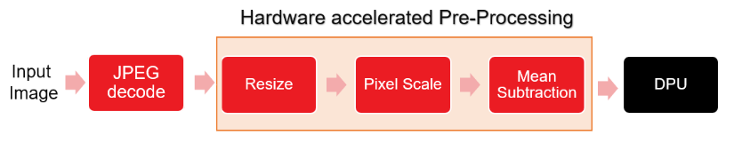

# Resnet-50
Resnet50 application is supported on the following devices.
- ZCU102
- ZCU104
- ALVEO-U50
- ALVEO-U280
- ALVEO-U200
- VCK190 production
- VCK5000

VCK190 ES1 is supported with the [Known Issue](#Known-Issue).

:pushpin: **Note:** Use VAI2.5 setup to run this applicaion


# Table of Contents
- [Introduction](#Introduction)
- [Run Resnet50 example](#run-resnet50-example)
  - [Setting up the system and running Resnet50 example on ZCU102/ZCU104/VCK190](#setting-up-the-system-and-running-resnet50-example-on-zcu102zcu104vck190)
    - [Setting SD card](#1-setting-sd-card)
    - [Cross-compile Resnet50 example](#2-cross-compile-resnet50-example)
    - [Download setup files](#3-download-setup-files)
    - [Copying Resnet50 app and setup files](#4-copying-resnet50-app-and-setup-files)
    - [Run Resnet50 example on ZCU102/ZCU104/VCK190](#5-run-resnet50-example-on-zcu102zcu104vck190)
  - [Setting up the system and running Resnet50 example on U50/U280/U200/VCK5000](#setting-up-the-system-and-running-resnet50-example-on-u50u280u200vck5000)
    - [Install xclbin](#1-install-xclbin)
    - [Download setup files](#2-download-setup-files)
    - [Build Resnet50 application](#3-build-resnet50-application)
    - [Run Resnet50 example on U50/U280/U200/VCK5000](#4-run-resnet50-example-on-u50u280u200vck5000)
- [Performance](#performance)    

# Introduction
Currently, applications accelerating pre-processing for classification networks (Resnet-50) is provided and can only run on ZCU102/ZCU104 and VCK190 edge platforms , and U50/U280/U200 Alveo platforms. In this application, software JPEG decoder is used for loading input image. JPEG decoder transfer input image data to pre-processing kernel and the pre-processed data is directly stored at the ML accelerator input physical address. Below image shows the inference pipeline.

<div align="center">
  
</div>

:pushpin: **Note:** In this application pre-processed data is directly stored at ML accelerator physical address. Hence, avoiding device to host data transfers.

# Run Resnet50 example
Resnet50 example can be run on different platforms like ZCU102/ZCU104 and VCK190 edge platforms or U50/U200/U280/VCK5000 data center platforms. Each platform has pre-built xclbin which can be used to set the system and run the application out of the box. And depending on the platform there are two more approaches, pre-built flow and build flow. Currently, only ZCU102 supports pre-built flow. In the subsequent sections, we give details for setting the system on a given platform and running resnet50 example.
1. [Setting up the system and running Resnet50 example on ZCU102/ZCU104/VCK190](#setting-up-the-system-and-running-resnet50-example-on-zcu102zcu104vck190)
1. [Setting up the system and running Resnet50 example on U50/U280/U200/VCK5000](#setting-up-the-system-and-running-resnet50-example-on-u50u280u200vck5000)

## Setting up the system and running Resnet50 example on **ZCU102/ZCU104/VCK190**
The system to run Resnet50 example on ZCU102/ZCU104/VCK190 can be set using pre-built xclbin and build flow approaches. In addition, ZCU102 also supports pre-built flow approach. Setting up the system and running Resnet50 example include the following steps.

Initially, the the sd card is set following any one of the above approaches. Then, cross-compilation environment is installed on the host system followed by cross-compiling the resnet50 application. Later, Vitis AI runtime libraries, model files and image databse are downloaded. Finally, resnet50 example is run on the platform. 

These steps are summarizied as follows:
1. [Setting SD card](#1-setting-sd-card)
1. [Cross-compile Resnet50 example](#2-cross-compile-resnet50-example)
1. [Download setup files](#3-download-setup-files)
1. [Copying Resnet50 app and setup files](#4-copying-resnet50-app-and-setup-files)
1. [Run Resnet50 example on ZCU102/ZCU104/VCK190](#5-run-resnet50-example-on-zcu102zcu104vck190)

### **1. Setting SD card**
The SD card is set/flashed with `sd_card.img` file using Etcher like tools. Following approaches are used to create the image file.

#### **1. Using pre-built xclbin**
In this approach, the xclbin including pre-processing accelerator and DPU is already built and packaged to create a sd_card.img file.

* Download the SD card system image files from the following links:

  | No. | DPU                     | Device          | Download Link                                                                          |
  |-----|-------------------------------|-----------------|----------------------------------------------------------------------------------------|
  | 1   | DPUCZDX8G  | ZCU102          | [waa_zcu102_resnet50_v2_5_0.img.gz](https://www.xilinx.com/bin/public/openDownload?filename=waa_zcu102_resnet50_v2_5_0.img.gz)        |
  | 2   | DPUCZDX8G  | ZCU104          | [waa_zcu104_resnet50_v2_5_0.img.gz](https://www.xilinx.com/bin/public/openDownload?filename=waa_zcu104_resnet50_v2_5_0.img.gz)        |
  | 3   | DPUCVDX8G  | VCK190          | [waa_vck190_resnet50_v2_5_0.img.gz](https://www.xilinx.com/bin/public/openDownload?filename=waa_vck190_resnet50_v2_5_0.img.gz)        |
     
* Unzip the file and flash the `sd_card.img` file on the SD card using tools like Etcher.

#### **2. Using build flow**  
In this approach, the pre-processing accelerator and DPU are built from sources following the build flow.

| No. | Build flow                    | Device          | Documentation                                                                          |
|-----|-------------------------------|-----------------|----------------------------------------------------------------------------------------|
| 1   | DPUCZDX8G  | ZCU102          | [DPUCZDX8G_zcu102](./build_flow/DPUCZDX8G_zcu102/README.md)        |
| 2   | DPUCZDX8G  | ZCU104          | [DPUCZDX8G_zcu104](./build_flow/DPUCZDX8G_zcu104/README.md)        |
| 3   | DPUCVDX8G  | VCK190          | [DPUCVDX8G_vck190](./build_flow/DPUCVDX8G_vck190/README.md)        |

#### **3. Using pre-built flow** 
The DPU is pre-built and its partial bitfiles are pre-created (using DFx flow). Only the pre-processing accelerator is built from sources. This flow gives 10x saving in build time for embedded platform like ZCU102.

| No. | Pre-built flow                    | Device          | Documentation                                                                          |
|-----|-------------------------------|-----------------|----------------------------------------------------------------------------------------|
| 1   | DPUCZDX8G  | ZCU102          | [DPUCZDX8G_zcu102](./pre_built_flow/DPUCZDX8G_zcu102/README.md)        |

:pushpin: **Note:** Pre-built flow is supported only on ZCU102.

### **2. Cross-compile Resnet50 example** 
Once the SD card is set with sd_card.img system, cross-compilation environment is installed on the host system and the resnet50 application is cross-compiled.

  * Download the [sdk-2022.1.0.0.sh](https://www.xilinx.com/bin/public/openDownload?filename=sdk-2022.1.0.0.sh).

  * Install the cross-compilation system environment, follow the prompts to install. 

    **Please install it on your local host linux system, not in the docker system.**
    ```sh
    ./sdk-2022.1.0.0.sh
    ```
    Note that the `~/petalinux_sdk` path is recommended for the installation. Regardless of the path you choose for the installation, make sure the path has read-write permissions. 
    Here we install it under `~/petalinux_sdk`.

  * When the installation is complete, follow the prompts and execute the following command.
    ```sh
    source ~/petalinux_sdk/environment-setup-cortexa72-cortexa53-xilinx-linux
    ```
    Note that if you close the current terminal, you need to re-execute the above instructions in the new terminal interface.

  * Download the [vitis_ai_2022.1-r2.5.0.tar.gz](https://www.xilinx.com/bin/public/openDownload?filename=vitis_ai_2022.1-r2.5.0.tar.gz) and install it to the petalinux system.
    ```sh
    tar -xzvf vitis_ai_2022.1-r2.5.0.tar.gz -C ~/petalinux_sdk/sysroots/cortexa72-cortexa53-xilinx-linux
    ```

  * Cross compile `resnet50` example.
    ```sh
    cd  ${VAI_HOME}/examples/Whole-App-Acceleration/apps/resnet50
    bash -x app_build.sh
    ```
      If the compilation process does not report any error and the executable file `./bin/resnet50.exe` is generated , then the host environment is installed correctly.

### **3. Download setup files** 

* Download Vitis AI Runtime libraries

  * Download the [Vitis AI Runtime 2.5.0](https://www.xilinx.com/bin/public/openDownload?filename=vitis-ai-runtime-2.5.0.tar.gz). 

  * Untar the runtime packet. 

* Download model files for Resnet50

  The following table gives links to model files corresponding to the device. 
  | No. | Device                    | Download Link             |
  |-----|---------------------------|---------------------------|
  | 1   | ZCU102/ZCU104             | [resnet50-zcu102_zcu104_kv260-r2.5.0.tar.gz](https://www.xilinx.com/bin/public/openDownload?filename=resnet50-zcu102_zcu104_kv260-r2.5.0.tar.gz)        |
  | 2   | VCK190          | [resnet50-vck190-r2.5.0.tar.gz](https://www.xilinx.com/bin/public/openDownload?filename=resnet50-vck190-r2.5.0.tar.gz)        |


  Please click on the above links to download the model file or copy the link and run the following commands. 
    ```sh
    cd ${VAI_HOME}/examples/Whole-App-Acceleration/apps/resnet50
    mkdir model_files
    cd model_files
    wget <Download Link> -O <model-files.tar.gz>
    tar -xzvf <model-files.tar.gz>
    ```
  Please note that the extracted folder and the model name may vary. Use appropriate name or path to the model file while running the application.

* Download the image dataset 
  * Download images at http://image-net.org/download-images and copy images to ` ${VAI_HOME}/examples/Whole-App-Acceleration/apps/resnet50/img` directory. 
  
### **4. Copying Resnet50 app and setup files** 
* Create `resnet50` in the BOOT partition `/run/media/mmcblk0p1/` of the SD Card which is flashed using any one of the approaches of [Setting SD card](#1-setting-sd-card) section. Then copy the following contents of ${VAI_HOME}/examples/Whole-App-Acceleration/apps/resnet50 to the `resnet50` directory of the BOOT partition of the SD card.
    ```sh
    vitis-ai-runtime-2.5.0
    model_files
    app_test.sh
    bin   
    img
    words.txt
    ```
* Insert the SD card into the destination ZCU102/ZCU104/VCK190 board and plugin the power. Connect serial port of the board to the host system. Wait for the Linux boot to complete.

* Install the Vitis AI Runtime on the board. Execute the following command.
    ```sh
    cd /run/media/mmcblk0p1/
    cp -r vitis-ai-runtime-2.5.0/2022.1/aarch64/centos ~/
    cd ~/centos
    bash setup.sh
    ```

### **5. Run Resnet50 example on ZCU102/ZCU104/VCK190**
This section gives details to run the Resnet50 example on ZCU102/ZCU104/VCK190 platforms.
```sh
cd /run/media/mmcblk0p1/
export XLNX_VART_FIRMWARE=/run/media/mmcblk0p1/dpu.xclbin
export XLNX_ENABLE_FINGERPRINT_CHECK=0
```
To hide troubleshooting messages, `use dmesg -n 4`.

Please expand the following to see the instructions to run different tests on the ZCU102/ZCU104/VCK190 platforms.

<details>
<summary>Click to expand different tests and expected output for ZCU102:</summary>

  * Functionality test with single image using WAA
    ```sh
    ./app_test.sh --xmodel_file ./model_files/resnet50/resnet50.xmodel --image_dir ./img/ --verbose

    # Expect similar output:
    WARNING: Logging before InitGoogleLogging() is written to STDERR
    I0712 10:16:33.656128  1587 main.cc:465] create running for subgraph: subgraph_conv1
    Number of images in the image directory is: 1
    top[0] prob = 0.829972  name = sea snake
    top[1] prob = 0.068128  name = hognose snake, puff adder, sand viper
    top[2] prob = 0.032181  name = water snake
    top[3] prob = 0.015201  name = horned viper, cerastes, sand viper, horned asp, Cerastes cornutus
    top[4] prob = 0.015201  name = American alligator, Alligator mississipiensis
    ```

  * Functionality test with single image without WAA (software preprocessing)
    ```sh
    ./app_test.sh --xmodel_file ./model_files/resnet50/resnet50.xmodel --image_dir ./img/ --verbose --use_sw_pre_proc

    # Expect similar output:
    WARNING: Logging before InitGoogleLogging() is written to STDERR
    I0712 10:16:42.329468  1612 main.cc:465] create running for subgraph: subgraph_conv1
    Number of images in the image directory is: 1
    top[0] prob = 0.808481  name = sea snake
    top[1] prob = 0.066364  name = hognose snake, puff adder, sand viper
    top[2] prob = 0.031348  name = water snake
    top[3] prob = 0.031348  name = American alligator, Alligator mississipiensis
    top[4] prob = 0.024414  name = African crocodile, Nile crocodile, Crocodylus niloticus
    ```

  * Performance test with & without WAA

    ```sh
    ./app_test.sh --xmodel_file ./model_files/resnet50/resnet50.xmodel --image_dir ./img/ --performance_diff
    
    # Expect similar output
        Running Performance Diff: 

          Running Application with Software Preprocessing 

          E2E Performance: 49.70 fps
          Pre-process Latency: 7.68 ms
          Execution Latency: 11.72 ms
          Post-process Latency: 0.70 ms

          Running Application with Hardware Preprocessing 

          E2E Performance: 74.53 fps
          Pre-process Latency: 1.04 ms
          Execution Latency: 11.66 ms
          Post-process Latency: 0.69 ms

          The percentage improvement in throughput is 49.95 %
       
    ```
</details>

<details>
<summary>Click to expand different tests and expected output for ZCU104:</summary>

  * Functionality test with single image using WAA
    ```sh
    ./app_test.sh --xmodel_file ./model_files/resnet50/resnet50.xmodel --image_dir ./img/ --verbose

    # Expect similar output:
    WARNING: Logging before InitGoogleLogging() is written to STDERR
    I0712 10:16:33.656128  1587 main.cc:465] create running for subgraph: subgraph_conv1
    Number of images in the image directory is: 1
    top[0] prob = 0.829972  name = sea snake
    top[1] prob = 0.068128  name = hognose snake, puff adder, sand viper
    top[2] prob = 0.032181  name = water snake
    top[3] prob = 0.015201  name = horned viper, cerastes, sand viper, horned asp, Cerastes cornutus
    top[4] prob = 0.015201  name = American alligator, Alligator mississipiensis
    ```

  * Functionality test with single image without WAA (software preprocessing)
    ```sh
    ./app_test.sh --xmodel_file ./model_files/resnet50/resnet50.xmodel --image_dir ./img/ --verbose --use_sw_pre_proc

    # Expect similar output:
    WARNING: Logging before InitGoogleLogging() is written to STDERR
    I0712 10:16:42.329468  1612 main.cc:465] create running for subgraph: subgraph_conv1
    Number of images in the image directory is: 1
    top[0] prob = 0.808481  name = sea snake
    top[1] prob = 0.066364  name = hognose snake, puff adder, sand viper
    top[2] prob = 0.031348  name = water snake
    top[3] prob = 0.031348  name = American alligator, Alligator mississipiensis
    top[4] prob = 0.024414  name = African crocodile, Nile crocodile, Crocodylus niloticus
    ```

  * Performance test with & without WAA

    ```sh
    ./app_test.sh --xmodel_file ./model_files/resnet50/resnet50.xmodel --image_dir ./img/ --performance_diff
    
    # Expect similar output
        Running Performance Diff: 

          Running Application with Software Preprocessing 

          E2E Performance: 49.57 fps
          Pre-process Latency: 7.65 ms
          Execution Latency: 11.82 ms
          Post-process Latency: 0.70 ms

          Running Application with Hardware Preprocessing 

          E2E Performance: 74.59 fps
          Pre-process Latency: 0.97 ms
          Execution Latency: 11.72 ms
          Post-process Latency: 0.70 ms

          The percentage improvement in throughput is 50.47 %
       
    ```
</details>

<details>
<summary>Click to expand different tests and expected output for VCK190:</summary>

  * Functionality test with single image using WAA
    ```sh
    ./app_test.sh --xmodel_file ./model_files/resnet50/resnet50.xmodel --image_dir ./img/ --verbose

    # Expect similar output:
    WARNING: Logging before InitGoogleLogging() is written to STDERR
    I0119 12:50:58.796797  1135 main.cc:510] create running for subgraph: subgraph_resnet_v1_50/block1/unit_1/bottleneck_v1/add
    Number of images in the image directory is: 1
    top[0] prob = 0.992312  name = brain coral
    top[1] prob = 0.004055  name = coral reef
    top[2] prob = 0.000905  name = puffer, pufferfish, blowfish, globefish
    top[3] prob = 0.000905  name = eel
    top[4] prob = 0.000427  name = rock beauty, Holocanthus tricolor
    ```

  * Functionality test with single image without WAA (software preprocessing)
    ```sh
    ./app_test.sh --xmodel_file ./model_files/resnet50/resnet50.xmodel --image_dir ./img/ --verbose --use_sw_pre_proc

    # Expect similar output:
    WARNING: Logging before InitGoogleLogging() is written to STDERR
    I0119 12:50:28.357049  1133 main.cc:510] create running for subgraph: subgraph_resnet_v1_50/block1/unit_1/bottleneck_v1/add
    Number of images in the image directory is: 1
    top[0] prob = 0.990261  name = brain coral
    top[1] prob = 0.005196  name = coral reef
    top[2] prob = 0.001159  name = puffer, pufferfish, blowfish, globefish
    top[3] prob = 0.000903  name = eel
    top[4] prob = 0.000427  name = rock beauty, Holocanthus tricolor
    ```

  * Performance test with & without WAA
    ```sh
    ./app_test.sh --xmodel_file ./model_files/resnet50/resnet50.xmodel --image_dir ./img/ --performance_diff
    
    # Expect similar output
        Running Performance Diff: 

          Running Application with Software Preprocessing 

          E2E Performance: 213.08 fps
          Pre-process Latency: 3.42 ms
          Execution Latency: 0.69 ms
          Post-process Latency: 0.57 ms

          Running Application with Hardware Preprocessing 

          E2E Performance: 459.77 fps
          Pre-process Latency: 0.91 ms
          Execution Latency: 0.69 ms
          Post-process Latency: 0.57 ms

          The percentage improvement in throughput is 115.77 %
 
    ```
</details>

&nbsp;

## Setting up the system and running Resnet50 example on **U50/U280/U200/VCK5000**
Initially, the Alveo accelerator card needs to be setup. Following table gives the setup instructions for different Alveo cards.

| No. | DPU        | Device          | Accelerator Card Setup Link                                                                                                    |
|-----|------------|-----------------|--------------------------------------------------------------------------------------------------------------------------------|
| 1   | DPUCAHX8H  | U50/U280        | [DPUCAHX8H_U50_U280](../../../../setup/alveo/README.md#alveo-card-setup-in-host)        |
| 2   | DPUCADF8H  | U200            | [DPUCADF8H_U200](../../../../setup/alveo/README.md#alveo-card-setup-in-host)                                                   |
| 3   | DPUCVDX8H  | VCK5000         | [DPUCVDX8H_VCK5000](../../../../setup/vck5000/README.md#1-vck5000-card-setup-in-host)                                          |


Later, the docker container needs to be loaded. 

:pushpin: **Note:**The following commands to compile the app or run the app are needed to be run in the docker environment. Docker installation instructions are available [here](../../../../README.md#installation)

The system to run Resnet50 example on U50/U280/U200/VCK5000 can be set using pre-built xclbin and build flow approaches. Setting up the system and running Resnet50 example include the following steps.

Initially, xclbin is installed in the docker. Then model files and image databse are downloaded. Later, the resnet50 application is build. Finally, the resnet50 example is run on the platform. 

These steps are summarizied as follows:
1. [Install xclbin](#1-install-xclbin)
1. [Download setup files](#2-download-setup-files)
1. [Build Resnet50 application](#3-build-resnet50-application)
1. [Run Resnet50 example on U50/U280/U200/VCK5000](#4-run-resnet50-example-on-u50u280u200vck5000)

### **1. Install xclbin**
* In the platform the xclbin is installed using any one of the following approaches.

  #### **1. Using pre-built xclbin**
  In this approach, the xclbin including pre-processing accelerator and DPU is already built. Download the xclbin corresponing to the platform.

  | No. | DPU        | Device           | WAA Package Link                                                                                                           |
  |-----|------------|------------------|----------------------------------------------------------------------------------------------------------------------------|
  | 1   | DPUCAHX8H  | U50              | [waa_u50_xclbins_v2_5_0](https://www.xilinx.com/bin/public/openDownload?filename=waa_u50_xclbins_v2_5_0.tar.gz)            |
  | 2   | DPUCAHX8H  | U280             | [waa_u280_xclbins_v2_0_0](https://www.xilinx.com/bin/public/openDownload?filename=waa_u280_xclbins_v2_0_0.tar.gz)          |
  | 3   | DPUCADF8H  | U200             | [waa_u200_xclbins_v2_0_0](https://www.xilinx.com/bin/public/openDownload?filename=waa_u200_xclbins_v2_0_0.tar.gz)          |
  | 4   | DPUCVDX8H  | VCK5000          | [waa_vck5000_xclbins_v2_5_0](https://www.xilinx.com/bin/public/openDownload?filename=waa_vck5000_xclbins_v2_5_0.tar.gz)    |

  #### **2. Using build flow**  
  In this approach, the pre-processing accelerator and DPU are built from sources following the build flow.
    
  | No. | Build flow   | Device       | Documentation                                                      |
  |-----|--------------|--------------|--------------------------------------------------------------------|
  | 1   | DPUCAHX8H    | U50          | [DPUCAHX8H_u50_u280](./build_flow/DPUCAHX8H_u50_u280/README.md)    |
  | 2   | DPUCAHX8H    | U280         | [DPUCAHX8H_u50_u280](./build_flow/DPUCAHX8H_u50_u280/README.md)    |
  | 3   | DPUCADF8H    | U200         | [DPUCADF8H_u200](./build_flow/DPUCADF8H_u200/README.md)            |
  | 4   | DPUCVDX8H    | VCK5000      | [DPUCVDX8H_vck5000](./build_flow/DPUCVDX8H_vck5000/README.md)      |

* After obtaining the xclbin, please run the following commands.
    ```sh
    sudo tar -xzvf <waa-package.tar.gz> --directory /
    ```
* Please run the command corresponding to the platform.

    | Platform    | Command                                                                                             |
    |-------------|-----------------------------------------------------------------------------------------------------|
    | U50         | `export XLNX_VART_FIRMWARE=/opt/xilinx/overlaybins/waa_u50_xclbins_v2_5_0/resnet50/dpu.xclbin `     |
    | U280        | `export XLNX_VART_FIRMWARE=/opt/xilinx/overlaybins/waa_u280_xclbins_v2_0_0/resnet50/dpu.xclbin `    |
    | U200        | `export XLNX_VART_FIRMWARE=/opt/xilinx/overlaybins/waa_u200_xclbins_v2_0_0/resnet50/dpu.xclbin `    |
    | VCK50000    | `export XLNX_VART_FIRMWARE=/opt/xilinx/overlaybins/waa_vck5000_xclbins_v2_5_0/resnet50/dpu.xclbin ` |
        
### **2. Download setup files**
* Download model files for Resnet50

  The following table gives links to model files corresponding to the device. 
  | No. | Device                    | Download Link             |
  |-----|---------------------------|---------------------------|
  | 1   | U50/U280             | [resnet50-u50-u280-DPUCAHX8H-r2.5.0.tar.gz](https://www.xilinx.com/bin/public/openDownload?filename=resnet50-u50-u280-DPUCAHX8H-r2.5.0.tar.gz)        |
  | 2   | U200          | [resnet50-u200-u250-r1.4.0.tar.gz](https://www.xilinx.com/bin/public/openDownload?filename=resnet50-u200-u250-r1.4.0.tar.gz)        |
  | 3   | VCK5000          | [resnet50-vck50008pe-DPUCVDX8H-r2.0.0.tar.gz](https://www.xilinx.com/bin/public/openDownload?filename=resnet50-vck50008pe-DPUCVDX8H-r2.0.0.tar.gz)        |


  Please click on the above links to download the model file or copy the link and run the following commands. 
    ```sh
    cd ${VAI_HOME}/examples/Whole-App-Acceleration/apps/resnet50
    mkdir model_files
    cd model_files
    wget <Download Link> -O <model-files.tar.gz>
    tar -xzvf <model-files.tar.gz>
    ```
  Please note that the extracted folder and the model name may vary. Use appropriate name or path to the model file while running the application.

* Download the image dataset 
  * Download images at http://image-net.org/download-images and copy images to ` ${VAI_HOME}/examples/Whole-App-Acceleration/apps/resnet50/img` directory. 


### **3. Build Resnet50 application**
```sh
cd ${VAI_HOME}/examples/Whole-App-Acceleration/apps/resnet50
bash -x app_build.sh
```
  If the compilation process does not report any error then the executable file `./bin/resnet50.exe` is generated.    

### **4. Run Resnet50 example on U50/U280/U200/VCK5000**
This section gives details to run the Resnet50 example on U50/U280/U200/VCK5000 platforms.

  ```sh
  cd ${VAI_HOME}/examples/Whole-App-Acceleration/apps/resnet50
  export XLNX_ENABLE_FINGERPRINT_CHECK=0
  ```

Please expand the following to see the instructions to run different tests on the U50/U280/U200/VCK5000 platforms.

<details>
<summary>Click to expand different tests and expected output for U50:</summary>

  * Functionality test with single image using WAA
    ```sh
    ./app_test.sh --xmodel_file ./model_files/resnet50/resnet50.xmodel --image_dir ./img/ --verbose

    # Expect similar output:
    WARNING: Logging before InitGoogleLogging() is written to STDERR
    I0712 10:16:33.656128  1587 main.cc:465] create running for subgraph: subgraph_conv1
    Number of images in the image directory is: 1
    top[0] prob = 0.829972  name = sea snake
    top[1] prob = 0.068128  name = hognose snake, puff adder, sand viper
    top[2] prob = 0.032181  name = water snake
    top[3] prob = 0.015201  name = horned viper, cerastes, sand viper, horned asp, Cerastes cornutus
    top[4] prob = 0.015201  name = American alligator, Alligator mississipiensis
    ```

  * Functionality test with single image without WAA (software preprocessing)
    ```sh
    ./app_test.sh --xmodel_file ./model_files/resnet50/resnet50.xmodel --image_dir ./img/ --verbose --use_sw_pre_proc

    # Expect similar output:
    WARNING: Logging before InitGoogleLogging() is written to STDERR
    I0712 10:16:42.329468  1612 main.cc:465] create running for subgraph: subgraph_conv1
    Number of images in the image directory is: 1
    top[0] prob = 0.808481  name = sea snake
    top[1] prob = 0.066364  name = hognose snake, puff adder, sand viper
    top[2] prob = 0.031348  name = water snake
    top[3] prob = 0.031348  name = American alligator, Alligator mississipiensis
    top[4] prob = 0.024414  name = African crocodile, Nile crocodile, Crocodylus niloticus
    ```

  * Performance test with & without WAA

    ```sh
    export XLNX_ENABLE_FINGERPRINT_CHECK=0
    ./app_test.sh --xmodel_file ./model_files/resnet50/resnet50.xmodel --image_dir ./img/ --performance_diff

    # Expect similar output:
      Running Performance Diff: 

          Running Application with Software Preprocessing 

          E2E Performance: 154.46 fps
          Pre-process Latency: 2.69 ms
          Execution Latency: 3.42 ms
          Post-process Latency: 0.36 ms

          Running Application with Hardware Preprocessing 

          E2E Performance: 199.36 fps
          Pre-process Latency: 1.32 ms
          Execution Latency: 3.30 ms
          Post-process Latency: 0.39 ms

          The percentage improvement in throughput is 29.07 %
    ```
</details>

<details>
<summary>Click to expand different tests and expected output for U280:</summary>

  * Functionality test with single image using WAA
    ```sh
    ./app_test.sh --xmodel_file ./model_files/resnet50/resnet50.xmodel --image_dir ./img/ --verbose

    # Expect similar output:
    WARNING: Logging before InitGoogleLogging() is written to STDERR
    I0616 03:41:02.972975   764 main.cc:510] create running for subgraph: subgraph_quant_conv1_conv
    Number of images in the image directory is: 3
    top[0] prob = 0.816577  name = sea snake
    top[1] prob = 0.086067  name = water snake
    top[2] prob = 0.040655  name = hognose snake, puff adder, sand viper
    top[3] prob = 0.019204  name = rock python, rock snake, Python sebae
    top[4] prob = 0.014956  name = horned viper, cerastes, sand viper, horned asp, Cerastes cornutus
    ```

  * Functionality test with single image without WAA (software preprocessing)
    ```sh
    ./app_test.sh --xmodel_file ./model_files/resnet50/resnet50.xmodel --image_dir ./img/ --verbose --use_sw_pre_proc

    # Expect similar output:
    WARNING: Logging before InitGoogleLogging() is written to STDERR
    I0616 03:40:44.617273   698 main.cc:510] create running for subgraph: subgraph_quant_conv1_conv
    Number of images in the image directory is: 1
    top[0] prob = 0.864593  name = sea snake
    top[1] prob = 0.055272  name = water snake
    top[2] prob = 0.026108  name = hognose snake, puff adder, sand viper
    top[3] prob = 0.020333  name = rock python, rock snake, Python sebae
    top[4] prob = 0.012333  name = horned viper, cerastes, sand viper, horned asp, Cerastes cornutus
    ```

  * Performance test with & without WAA

    ```sh
    export XLNX_ENABLE_FINGERPRINT_CHECK=0
    ./app_test.sh --xmodel_file ./model_files/resnet50/resnet50.xmodel --image_dir ./img/ --performance_diff

    # Expect similar output:
      Running Performance Diff: 

          Running Application with Software Preprocessing 

          E2E Performance: 183.02 fps
          Pre-process Latency: 2.67 ms
          Execution Latency: 2.52 ms
          Post-process Latency: 0.27 ms

          Running Application with Hardware Preprocessing 

          E2E Performance: 253.29 fps
          Pre-process Latency: 1.18 ms
          Execution Latency: 2.45 ms
          Post-process Latency: 0.31 ms

          The percentage improvement in throughput is 38.39 %
    ```
</details>

<details>
<summary>Click to expand different tests and expected output for U200:</summary>

  * Functionality test with single image using WAA
    ```sh
    ./app_test.sh --xmodel_file ./model_files/resnet50/resnet50.xmodel --image_dir ./img/ --verbose

    # Expect similar output:
    WARNING: Logging before InitGoogleLogging() is written to STDERR
    I0616 04:38:59.037778   276 main.cc:510] create running for subgraph: subgraph_conv1
    Number of images in the image directory is: 1
    top[0] prob = 0.808481  name = sea snake
    top[1] prob = 0.066364  name = hognose snake, puff adder, sand viper
    top[2] prob = 0.031348  name = water snake
    top[3] prob = 0.031348  name = American alligator, Alligator mississipiensis
    top[4] prob = 0.024414  name = African crocodile, Nile crocodile, Crocodylus niloticus
    ```

  * Functionality test with single image without WAA (software preprocessing)
    ```sh
    ./app_test.sh --xmodel_file ./model_files/resnet50/resnet50.xmodel --image_dir ./img/ --verbose --use_sw_pre_proc

    # Expect similar output:
    WARNING: Logging before InitGoogleLogging() is written to STDERR
    I0616 04:39:07.074311   342 main.cc:510] create running for subgraph: subgraph_conv1
    Number of images in the image directory is: 1
    Currently u200 doesnot support zero copy. Hence running without zero copy
    top[0] prob = 0.829972  name = sea snake
    top[1] prob = 0.068128  name = hognose snake, puff adder, sand viper
    top[2] prob = 0.032181  name = water snake
    top[3] prob = 0.015201  name = horned viper, cerastes, sand viper, horned asp, Cerastes cornutus
    top[4] prob = 0.015201  name = American alligator, Alligator mississipiensis
    ```

  * Performance test with & without WAA

    ```sh
    export XLNX_ENABLE_FINGERPRINT_CHECK=0
    ./app_test.sh --xmodel_file ./model_files/resnet50/resnet50.xmodel --image_dir ./img/ --performance_diff

    # Expect similar output:
      Running Performance Diff: 

          Running Application with Software Preprocessing 

          E2E Performance: 157.65 fps
          Pre-process Latency: 2.77 ms
          Execution Latency: 3.21 ms
          Post-process Latency: 0.36 ms

          Running Application with Hardware Preprocessing 

          E2E Performance: 204.46 fps
          Pre-process Latency: 1.22 ms
          Execution Latency: 3.23 ms
          Post-process Latency: 0.44 ms

          The percentage improvement in throughput is 29.69 %
    ```
</details>

<details>
<summary>Click to expand different tests and expected output for VCK5000:</summary>

  * Functionality test with single image using WAA
    ```sh
    ./app_test.sh --xmodel_file ./model_files/resnet50/resnet50.xmodel --image_dir ./img/ --verbose

    # Expect similar output:
    WARNING: Logging before InitGoogleLogging() is written to STDERR
    I0712 10:16:33.656128  1587 main.cc:465] create running for subgraph: subgraph_conv1
    Number of images in the image directory is: 1
    top[0] prob = 0.829972  name = sea snake
    top[1] prob = 0.068128  name = hognose snake, puff adder, sand viper
    top[2] prob = 0.032181  name = water snake
    top[3] prob = 0.015201  name = horned viper, cerastes, sand viper, horned asp, Cerastes cornutus
    top[4] prob = 0.015201  name = American alligator, Alligator mississipiensis
    ```

  * Functionality test with single image without WAA (software preprocessing)
    ```sh
    ./app_test.sh --xmodel_file ./model_files/resnet50/resnet50.xmodel --image_dir ./img/ --verbose --use_sw_pre_proc

    # Expect similar output:
    WARNING: Logging before InitGoogleLogging() is written to STDERR
    I0712 10:16:42.329468  1612 main.cc:465] create running for subgraph: subgraph_conv1
    Number of images in the image directory is: 1
    top[0] prob = 0.808481  name = sea snake
    top[1] prob = 0.066364  name = hognose snake, puff adder, sand viper
    top[2] prob = 0.031348  name = water snake
    top[3] prob = 0.031348  name = American alligator, Alligator mississipiensis
    top[4] prob = 0.024414  name = African crocodile, Nile crocodile, Crocodylus niloticus
    ```

  * Performance test with & without WAA

    ```sh
    export XLNX_ENABLE_FINGERPRINT_CHECK=0
    ./app_test.sh --xmodel_file ./model_files/resnet50/resnet50.xmodel --image_dir ./img/ --performance_diff

    # Expect similar output:
      Running Performance Diff: 

          Running Application with Software Preprocessing 

          E2E Performance: 339.90 fps
          Pre-process Latency: 2.3 ms
          Execution Latency: 0.34 ms
          Post-process Latency: 0.26 ms

          Running Application with Hardware Preprocessing 

          E2E Performance: 621.19 fps
          Pre-process Latency: 1.04 ms
          Execution Latency: 0.3 ms
          Post-process Latency: 0.26 ms

          The percentage improvement in throughput is 82.73 %
    ```
</details>


&nbsp;


## Performance
Below table shows the comparison of performance achieved by accelerating the pre-processing pipeline on FPGA.
For `Resnet-50`, the performance numbers are achieved by running 500 images randomly picked from ImageNet dataset.


<table style="undefined;table-layout: fixed; width: 664px">
<colgroup>
<col style="width: 119px">
<col style="width: 136px">
<col style="width: 145px">
<col style="width: 134px">
</colgroup>
  <tr>
    <th rowspan="2">Device</th>
    <th colspan="2">Performance (FPS)</th>
    <th rowspan="2"><span style="font-weight:bold">Improvement</span></th>
  </tr>
  <tr>
    <td>with software Pre-processing</td>
    <td>with hardware Pre-processing</td>
  </tr>

  <tr>
    <td>ZCU102</td>
    <td>49.70</td>
    <td>74.53</td>
    <td>49.95 %</td>
  </tr>

  <tr>
    <td>ZCU104</td>
    <td>49.57</td>
    <td>74.59</td>
    <td>50.47 %</td>
  </tr>

  <tr>
    <td>VCK190</td>
    <td>213.08 </td>
    <td>459.77 </td>
    <td>115.77 %</td>
  </tr>

  <tr>
    <td>U50</td>
    <td>154.46</td>
    <td>199.36</td>
    <td>29.07 %</td>
  </tr>

  <tr>
    <td>U280</td>
    <td>183.02</td>
    <td>253.29</td>
    <td>38.39 %</td>
  </tr>

  <tr>
    <td>U200</td>
    <td>157.65</td>
    <td>204.46</td>
    <td>29.69 %</td>
  </tr>

  <tr>
    <td>VCK5000</td>
    <td>339.90</td>
    <td>621.19</td>
    <td>82.73 %</td>
  </tr>

</table>

:pushpin: **Note:** The above performance numbers doesn't consider the image read time and NPC1 is used in pre-process accelerator.

>System with Intel&reg; Xeon&reg; Silver 4116 CPU @ 2.10GHz is used for U200 and U280 tests while Intel&reg; Xeon&reg; Bronze 3104 CPU @ 1.70GHz is used for U50 tests.

:pushpin: **Note:** The performance numbers are computed using end-to-end latency and it depends on input image resolution. So performance numbers can vary with different images.

## Known Issue
### Running the application on VCK190 ES1 device
Please refer the [Workaround for ES1 device ](https://github.com/Xilinx/Vitis-AI/tree/v2.0/dsa/XVDPU-TRD#9-known-issue) for running the resnet50 application on ES1 devices.
