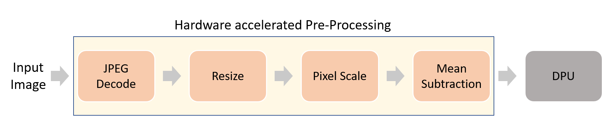

# Resnet-50 with JPEG Decoder
Resnet50 application with JPEG decoder accelerator is supported on the following devices.
- ZCU102

:pushpin: **Note:** Use VAI2.5 setup to run this applicaion


## Table of Contents

- [Resnet-50 with JPEG Decoder](#resnet-50-with-jpeg-decoder)
  - [Table of Contents](#table-of-contents)
  - [Introduction](#introduction)
  - [Run Resnet50_JPEG example](#run-resnet50_jpeg-example)
    - [**Using pre-built xclbin**](#using-pre-built-xclbin)
      - [*Setting up and running on **ZCU102***](#setting-up-and-running-on-zcu102)
    - [Build flow](#build-flow)
  - [Performance](#performance)

## Introduction
Currently, applications accelerating pre-processing for classification networks (Resnet-50) is provided and can only run on ZCU102 platform. In this application, hardware JPEG decoder is used for loading input image. JPEG decoder transfer input image data to pre-processing kernel and the pre-processed data is directly stored at the ML accelerator input physical address. Below image shows the inference pipeline.

:pushpin: **Note:** In this application pre-processed data is directly stored at ML accelerator physical address. Hence avoiding device to host data transfers.

<div align="center">
  
</div>


## Run Resnet50_JPEG example
Resnet50_JPEG example runs with 3 different ways. 
1. Using pre-built xlcbin 
2. Build flow

### **Using pre-built xclbin**

#### *Setting up and running on **ZCU102***
* Installing a Board Image.
	* Download the SD card system image tar files from the following links:  
	
      [ZCU102](https://www.xilinx.com/bin/public/openDownload?filename=waa_zcu102_resnet50jpeg_v2_5_0.img.gz)

      	:pushpin: **Note:** The version of the board image should be 2022.1 or above.
	* Untar the file
	* Use Etcher software to burn the image file onto the SD card.
	* Insert the SD card with the image into the destination board.
	* Plug in the power and boot the board using the serial port to operate on the system.
	* Set up the IP information of the board using the serial port.
	You can now operate on the board using SSH.
* Installing Vitis AI Runtime on the Evaluation Board

  * Download the [Vitis AI Runtime 2.5.0](https://www.xilinx.com/bin/public/openDownload?filename=vitis-ai-runtime-2.5.0.tar.gz).

  * Untar the runtime packet and copy the following folder to the board using scp.
    ```sh
	tar -xzvf vitis-ai-runtime-2.5.0.tar.gz
	scp -r vitis-ai-runtime-2.5.0/2022.1/aarch64/centos root@IP_OF_BOARD:~/
    ```
  * Install the Vitis AI Runtime on the evaluation board. Execute the following command.
    ```sh
	  cd ~/centos
	  bash setup.sh
    ```
* Cross-compile Resnet50_JPEG example
  * Download the [sdk-2022.1.0.0.sh](https://www.xilinx.com/bin/public/openDownload?filename=sdk-2022.1.0.0.sh)

  * Install the cross-compilation system environment, follow the prompts to install. 

    **Please install it on your local host linux system, not in the docker system.**
    ```sh
    ./sdk-2022.1.0.0.sh
    ```
    Note that the `~/petalinux_sdk` path is recommended for the installation. Regardless of the path you choose for the installation, make sure the path has read-write permissions. 
    Here we install it under `~/petalinux_sdk`.

  * When the installation is complete, follow the prompts and execute the following command.
    ```sh
    . ~/petalinux_sdk/environment-setup-cortexa72-cortexa53-xilinx-linux
    ```
    Note that if you close the current terminal, you need to re-execute the above instructions in the new terminal interface.

  * Download the [vitis_ai_2022.1-r2.5.0.tar.gz](https://www.xilinx.com/bin/public/openDownload?filename=vitis_ai_2022.1-r2.5.0.tar.gz) and install it to the petalinux system.
    ```sh
    tar -xzvf vitis_ai_2022.1-r2.5.0.tar.gz -C ~/petalinux_sdk/sysroots/cortexa72-cortexa53-xilinx-linux
    ```

  * Cross compile `resnet50_jpeg` example.
    ```sh
    cd  ${VAI_HOME}/examples/Whole-App-Acceleration/apps/resnet50_jpeg/libs/libjfif
	make clean
	make
	cd  ${VAI_HOME}/examples/Whole-App-Acceleration/apps/resnet50_jpeg
    bash -x app_build.sh
    ```
      If the compilation process does not report any error and the executable file `./bin/resnet50_jpeg.exe` is generated , then the host environment is installed correctly.

* Download Model files for Resnet50 Network

  ```sh
  cd ${VAI_HOME}/examples/Whole-App-Acceleration/apps/resnet50_jpeg
  mkdir model_zcu102
  cd model_zcu102
  wget https://www.xilinx.com/bin/public/openDownload?filename=resnet50-zcu102_zcu104_kv260-r2.5.0.tar.gz -O resnet50-zcu102_zcu104_kv260-r2.5.0.tar.gz
  tar -xzvf resnet50-zcu102_zcu104_kv260-r2.5.0.tar.gz
  ```
  Please note that the extracted folder and the model name may vary. Use appropriate name or path to the model file while running the application.

* Run Resnet50_JPEG Example

  This part is about how to run the Resnet50_JPEG example on zcu102 board.

  * Download the images at http://image-net.org/download-images and copy images to ` ${VAI_HOME}/examples/Whole-App-Acceleration/apps/resnet50_jpeg/img/` directory 

  * Copy following content of  ${VAI_HOME}/examples/Whole-App-Acceleration/apps/resnet50_jpeg directory to the BOOT partition of the SD Card.
    ```sh
        bin
        model_zcu102
        img
        app_test.sh
        libs
        words.txt
    ```


  * Please insert SD_CARD on the ZCU102 board. After the linux boot, run:

  * Performance test with & without waa

    ```sh
     cd /run/media/mmcblk0p1/
     export XLNX_VART_FIRMWARE=/run/media/mmcblk0p1/dpu.xclbin
    
     ./app_test.sh --xmodel_file ./model_zcu102/resnet50/resnet50.xmodel --image_dir ./img/ --performance_diff

    # Expect Similar Output:
    Running Performance Diff:
    
      Running Application with Software Preprocessing

        E2E Performance: 31.52 fps
        Pre-process Latency: 18.84 ms
        Execution Latency: 11.79 ms
        Post-process Latency: 0.69 ms

      Running Application with Hardware Preprocessing

        E2E Performance: 65.89 fps
        Pre-process Latency: 2.79 ms
        Execution Latency: 11.68 ms
        Post-process Latency: 0.69 ms

       The percentage improvement in throughput is 109.04 %
    ```

  * Functionality test with waa
    ```sh
    ./app_test.sh --xmodel_file ./model_zcu102/resnet50/resnet50.xmodel --image_dir ./img/ --verbose

    # Expect similar output:
    WARNING: Logging before InitGoogleLogging() is written to STDERR
    I0712 10:16:33.656128  1587 main.cc:465] create running for subgraph: subgraph_conv1
    Number of images in the image directory is: 1
    top[0] prob = 0.829972  name = sea snake
    top[1] prob = 0.068128  name = hognose snake, puff adder, sand viper
    top[2] prob = 0.032181  name = water snake
    top[3] prob = 0.015201  name = horned viper, cerastes, sand viper, horned asp, Cerastes cornutus
    top[4] prob = 0.015201  name = American alligator, Alligator mississipiensis
    ```

  * Functionality test without waa
    ```sh
    ./app_test.sh --xmodel_file ./model_zcu102/resnet50/resnet50.xmodel --image_dir ./img/ --verbose --use_sw_pre_proc

    # Expect similar output:
    WARNING: Logging before InitGoogleLogging() is written to STDERR
    I0712 10:16:42.329468  1612 main.cc:465] create running for subgraph: subgraph_conv1
    Number of images in the image directory is: 1
    top[0] prob = 0.808481  name = sea snake
    top[1] prob = 0.066364  name = hognose snake, puff adder, sand viper
    top[2] prob = 0.031348  name = water snake
    top[3] prob = 0.031348  name = American alligator, Alligator mississipiensis
    top[4] prob = 0.024414  name = African crocodile, Nile crocodile, Crocodylus niloticus
    ```

### Build flow
Both the pre-processing accelerator and DPU are built from sources.

| No. | Build flow                    | Device     | Documentation                                                                          |
|-----|-------------------------------|------------|----------------------------------------------------------------------------------------|
| 1   | DPUCZDX8G  | ZCU102     | [./build_flow/DPUCZDX8G_zcu102/README](./build_flow/DPUCZDX8G_zcu102/README.md)        |


## Performance
Below table shows the comparison of performance achieved by accelerating the pre-processing pipeline on FPGA.
For `Resnet-50_JPEG`, the performance numbers are achieved by running 500 images randomly picked from ImageNet dataset.


<table style="undefined;table-layout: fixed; width: 664px">
<colgroup>
<col style="width: 119px">
<col style="width: 136px">
<col style="width: 145px">
<col style="width: 134px">
</colgroup>
  <tr>
    <th rowspan="2">Device</th>
    <th colspan="2">Performance (FPS)</th>
    <th rowspan="2"><span style="font-weight:bold">Improvement</span></th>
  </tr>
  <tr>
    <td>with software Pre-processing</td>
    <td>with hardware Pre-processing</td>
  </tr>

  <tr>
    <td>ZCU102</td>
    <td>31.52</td>
    <td>65.89</td>
    <td>109.04 %</td>
  </tr>

</table>

:pushpin: **Note:** The above performance numbers consider the image read time.

:pushpin: **Note:** that Performance numbers are computed using end-to-end latency and it depends on input image resolution. So performance numbers can vary with different images  
